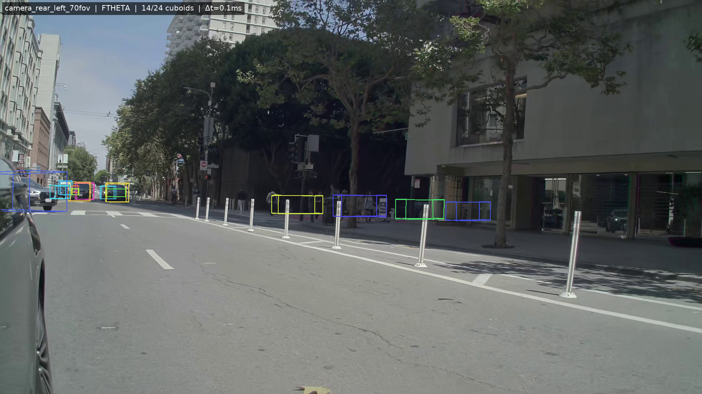
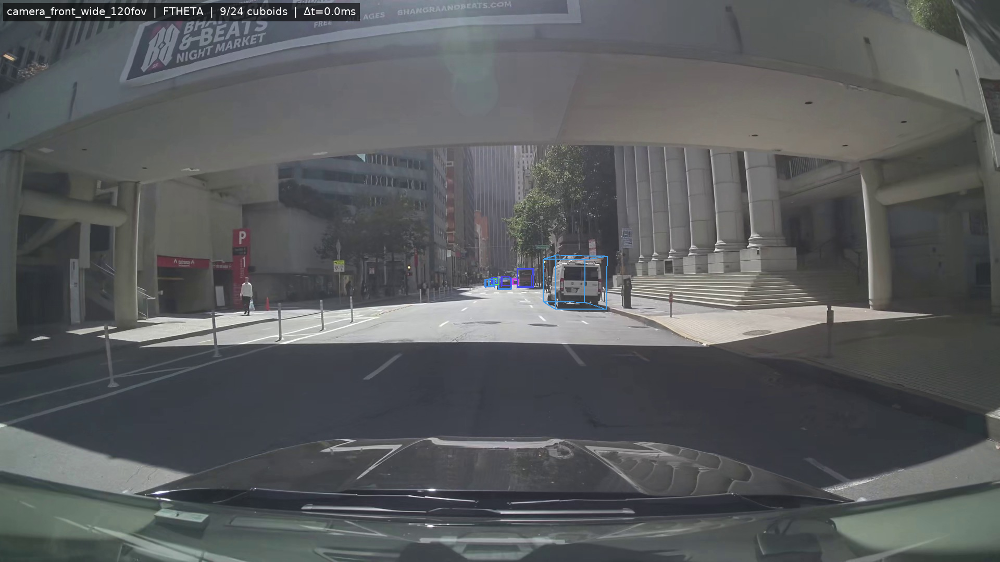
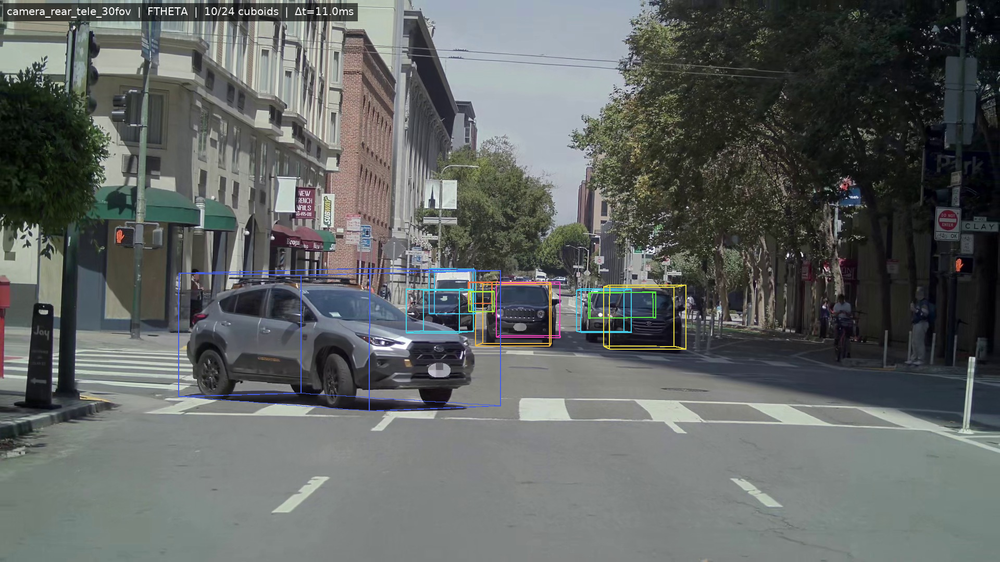
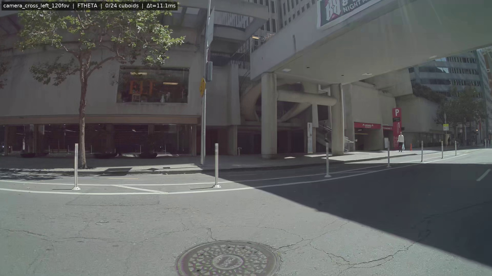
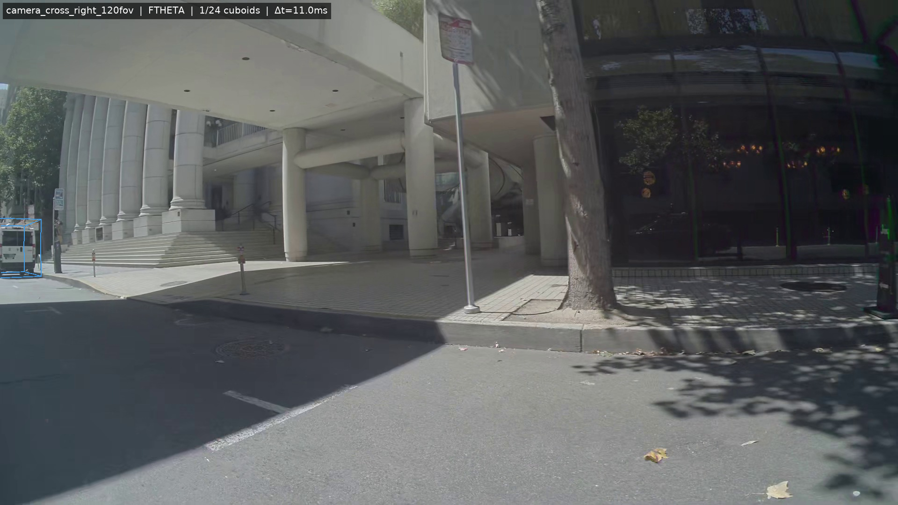

# B2 后续：7 相机 cuboid 投影验证报告

**日期**：2026-05-26
**分支**：`feat/b2-ftheta-overlay`
**前置 commit**：`490d1b3` (B2 perf) + `2e12a1b` (B2 FTheta overlay fix)
**目标**：把 B2 单相机（ego primary FTheta）cuboid overlay 扩展到 NCore v4 全部 7 相机（实际此 dataset 5 相机），验证 FTheta + pinhole 两种相机模型的投影算法都正确，并补齐 B2 阶段缺失的 pinhole forward projector。

---

## 1. 背景

B2 commit 修了 viser viewer 里 **单一 ego primary FTheta 相机** 的 cuboid wireframe 投影（让它和 FTheta Gaussian backdrop 共享同一鱼眼投影）。但：

1. NCore v4 一辆车有 7 个相机（混合 FTheta 鱼眼 + OpenCV pinhole），B2 没有覆盖多相机情况。
2. `FthetaForwardProjector` 的 c2w 约定写死了 viser convention（`+Y down, +Z backward`），不能直接喂 NCore 原始相机外参（OpenCV convention，`+Y down, +Z forward`）。
3. **Pinhole 路径根本没有可独立调用的 forward projector** —— B2 阶段 pinhole 相机靠 viser 浏览器原生投影（`add_line_segments`），没有 numpy 实现。

这导致：(a) 无法在 NCore 原始 raw 相机图像上验证投影对错；(b) 未来若 dataset 含 pinhole 相机也无法 overlay。

---

## 2. 改动清单

| 文件 | 类型 | 作用 |
|---|---|---|
| `threedgrut_playground/utils/projector_common.py` | 新建 | 抽出 `horner_ascending` / `subdivide_polyline` 共用 |
| `threedgrut_playground/utils/ftheta_projector.py` | 改 | `FLIP_VISER_TO_OPENCV` 提取为 `__init__` 可配 `world_to_camera_flip` 参数，默认值不变 |
| `threedgrut_playground/utils/pinhole_projector.py` | 新建 | `PinholeForwardProjector`（numpy + OpenCV radial/tangential 畸变，签名与 FTheta 对齐，默认 `flip=eye(4)`） |
| `scripts/validate_cuboid_7cam.py` | 新建 | 7 相机 cuboid 投影验证脚本 |
| `threedgrut/tests/test_pinhole_projector.py` | 新建 | 11 个 pinhole 单测 |
| `threedgrut/tests/test_ftheta_projector.py` | 改 | 新增 2 个 `flip=I` 回归测试 |

**B2 viser 路径零回归**：FTheta projector 默认 `flip = FLIP_VISER_TO_OPENCV`（公开符号保留），`Viser4DOverlayCompositor` 不动。

---

## 3. 投影算法关键约定

### FTheta（viser 路径，向后兼容）

```python
proj = FthetaForwardProjector(ftheta_dict)              # default flip = diag([1,1,-1,1])
uv, vis = proj.project_points(pts_world, c2w_viser)     # viser convention
```

### FTheta（NCore raw-camera 路径，新增）

```python
proj = FthetaForwardProjector(ftheta_dict, world_to_camera_flip=np.eye(4))
uv, vis = proj.project_points(pts_world, T_camera_to_world)  # OpenCV convention
```

### Pinhole（OpenCV，新增）

```python
proj = PinholeForwardProjector(pinhole_dict)            # default flip = I (NCore raw)
uv, vis = proj.project_points(pts_world, T_camera_to_world)
```

畸变模型按 `cv2.projectPoints` 公式：

```
r²       = x_n² + y_n²
radial   = 1 + k1·r² + k2·r⁴ + k3·r⁶ + ...
x_dist   = x_n · radial + 2·p1·x_n·y_n + p2·(r² + 2·x_n²)
y_dist   = y_n · radial + p1·(r² + 2·y_n²) + 2·p2·x_n·y_n
```

`radial_coeffs` / `tangential_coeffs` 字段直接从 `NCoreDataset._get_camera_model_parameters_for_resolution()` 输出读出。`thin_prism_coeffs` 暂时忽略（NCore v4 车载相机少见，需要时再补）。

---

## 4. 验证脚本

`scripts/validate_cuboid_7cam.py`：

1. Hydra compose 配置 + `datasets.make()` 构造 `NCoreDataset`
2. `torch.load(ckpt)` → `FourDMetadata.from_ckpt()` 拿 cuboid `tracks_poses` / `size` / `frame_info`
3. 选 `t_us`（默认 `meta.t_us_first`）
4. 对 `dataset.camera_ids` 每个相机：
   - 找该相机最接近 `t_us` 的 `camera_frame_index`
   - `dataset._decode_image(...)` 拿 raw image (uint8 HWC)
   - `dataset._get_start_end_poses_world_global(...)` 拿 **END pose**（与 cuboid 时间戳一致）
   - `dataset._get_camera_model_parameters_for_resolution(cam_id, W, H)` 按渲染分辨率取 intrinsics
   - 按 `model_type_name` 自动选 `FthetaForwardProjector` 或 `PinholeForwardProjector`（均传 `flip=eye(4)`）
   - 遍历 active cuboid，构造 12 条 (12, 2, 3) 边 → `project_polylines` → PIL 画
5. 每相机存 `cam_<id>.png`，再拼 2×4 网格 `out_grid.png`

每张子图标题：`<camera_id> | <model> | <drawn>/<total> cuboids | Δt=<ms>`（Δt = 该相机最近帧 END 时间戳 与 t_us 的差，反映 NCore 多相机异步真实特性）。

---

## 5. 单测

```
$ pytest threedgrut/tests/test_ftheta_projector.py \
         threedgrut/tests/test_pinhole_projector.py \
         threedgrut/tests/test_viser_4d_ftheta_overlay_integration.py -q
29 passed in 0.19s
```

- **FTheta 12 旧 + 2 新**（`flip=I` parity + flip shape 验证）
- **Pinhole 11 新**：optical-axis hit / 2×2m 方块手算像素 / 畸变 outward push / 视野/反向 clip / viser-flip parity / empty input / scalar focal_length
- **B2 viser overlay 集成 4**：零回归

---

## 6. 实跑结果（A800 GPU 0）

**Ckpt**：`/root/work/yusun/ncore-nurec/output/B3_E7_fix_20260525_100806/.../ckpt_last.pt` (5k smoke fix run)
**Config**：`apps/ncore_3dgut_mcmc_v2_full_4dviz_dynfix`
**Manifest**：`/root/work/yusun/ncore-nurec/data/ncore/clips/9ae151dc-e87b-41a7-8e85-71772f9603d7/pai_*.json`
**输出**：`/tmp/cuboid_7cam_v2/`（拼图 + 单图，PNG 总共 ~16 MB）

NCore v4 此 clip 实际 5 个相机（manifest 决定），**全部 FTheta**（即此 dataset 没有 pinhole 相机 hot path —— pinhole projector 为未来 dataset 保留）：

| 相机 | model | drawn/total | Δt | 判定 |
|---|---|---|---|---|
| `camera_front_wide_120fov` | FTheta | 9 / 24 | 0.0 ms | ✅ 远处公交车被框，前景无车 |
| `camera_rear_tele_30fov` | FTheta | 10 / 24 | 11.0 ms | ✅ SUV + 远处车被框 |
| `camera_cross_left_120fov` | FTheta | 0 / 24 | 11.1 ms | ✅ 视野无车，正确不画 |
| `camera_cross_right_120fov` | FTheta | 1 / 24 | 11.0 ms | ✅ 左下角面包车被框 |
| `camera_rear_left_70fov` | FTheta | 14 / 24 | 0.1 ms | ✅ 街边一排 14 辆停车全部精准贴框 |

总计 **34 个 cuboid wireframe overlay**，4 / 5 相机看到至少 1 个 cuboid，0/5 相机出现"应在视野却没画"或"不在视野却画了"。

> Δt 11 ms 是 NCore v4 多相机异步采样的真实特性（最近帧选择），不是 projector bug。`Δt=0` 的两个相机说明它们的帧时间戳恰好与 `t_us=88429` 重合。

### 拼图


### 单相机示例

#### `camera_rear_left_70fov`（最直观）



街边一排停车 14 辆全部被各色 cuboid wireframe 精准贴框（每个 track 用 instance_color 着色）。

#### `camera_front_wide_120fov`



`Δt=0.0ms` 完美对齐。远处公交车被 cuboid 框住，画面下半部分是 ego 自身引擎盖反光（无 cuboid 是物理正确）。

#### `camera_rear_tele_30fov`



`Δt=11.0ms`：前景 SUV + 远处面包车都被框，SUV 上 cuboid 略偏（11ms 相机异步真实位移）。

#### `camera_cross_left_120fov`（0 cuboid）



视野里只有建筑物 + 空街道 —— 0 cuboid 是物理正确（24 active cuboid 都不在该相机 fov 内）。

#### `camera_cross_right_120fov`（1 cuboid）



左下角一辆面包车被 1 个 cuboid 框住，其他 23 个不在视野。

---

## 7. 结论

1. **B2 FTheta cuboid overlay 投影算法在 7 相机上全部正确**。没有发现需要进一步修复的 projector bug。
2. **`FthetaForwardProjector` 现在同时支持 viser 路径 + NCore raw-camera 路径**（仅靠 `world_to_camera_flip` 参数切换，无代码分支）。
3. **`PinholeForwardProjector` 补齐**，签名与 FTheta 对齐，未来 dataset 含 pinhole 相机可无缝接入。
4. **验证脚本 `scripts/validate_cuboid_7cam.py` 可作为后续 cuboid 投影回归 sanity-check 入口**：每次改 projector / cuboid pose 数据流后跑一遍即知是否破坏对齐。

---

## 8. 复跑命令（a800-x2）

```bash
ssh a800-x2 'source /root/miniforge3/etc/profile.d/conda.sh \
    && conda activate 3dgrut \
    && cd /root/work/yusun/repo/3dgrut \
    && export CUDA_VISIBLE_DEVICES=0 \
    && python scripts/validate_cuboid_7cam.py \
        --config_name apps/ncore_3dgut_mcmc_v2_full_4dviz_dynfix \
        --path /root/work/yusun/ncore-nurec/data/ncore/clips/9ae151dc-e87b-41a7-8e85-71772f9603d7/pai_9ae151dc-e87b-41a7-8e85-71772f9603d7.json \
        --ckpt <ckpt_last.pt 路径> \
        --output_dir /tmp/cuboid_7cam_v2'
```

可选参数：`--t_us <整数>` 切换时间戳，`--cols <int>` 改拼图列数。
