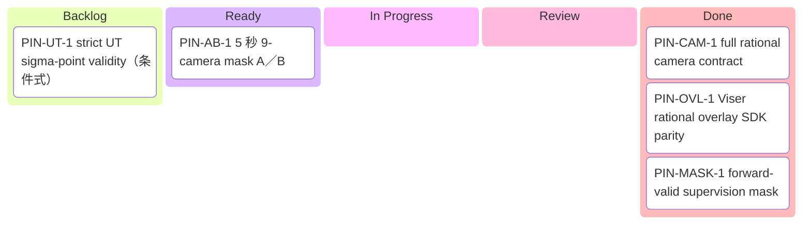
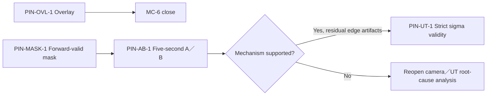

# Pinhole Camera Contract Work Kanban

**创建日期：** 2026-07-15
**范围：** Inceptio OpenCV rational camera 的 Viser overlay 与 native training/render 有效域问题。
**权威分析：** [`inceptio_opencv_rational_peripheral_blur_analysis_2026-07-14.md`](inceptio_opencv_rational_peripheral_blur_analysis_2026-07-14.md)

## 1. Board

> Mermaid 标签一律使用全角括号，避免仓库渲染器解析失败。

## 2. Task Table

| ID | Task | Status | Owner | Branch / Worktree | Acceptance gate | Evidence |
|---|---|---|---|---|---|---|
| PIN-CAM-1 | Full OpenCV rational camera contract | ✅ Done | Codex + main review | merged to `main` | inverse=30; calibrated prefix in CUDA/CPU/Viser; valid-only UT; 2×2 + 9-camera A/B; focused/full tests | [`PIN-CAM-1 final validation`](T8_artifacts/pinhole_camera_contract/PIN-CAM-1_final_validation_2026-07-17.md); 9-camera masked PSNR +0.882 dB, CC +0.883 dB, LPIPS -0.0175; front-wide outer ring +2.719 dB |
| PIN-OVL-1 | Viser OpenCV rational overlay projector | ✅ Done | overlay subagent + main review | merged from `fix/viser-opencv-rational-overlay` | rational numerator/denominator + tangential + thin-prism + `0.8<icD<1.2`; focused/full tests; five real cameras SDK validity 100% agreement; float image-point MAE <0.05 px; MC-6 closed only | Commits `89df9eb`, `132261e`, `35032c2`, `934c91b`; 517 samples/camera; MAE 0.000017–0.000036 px; full `1018 passed, 2 skipped`; merge commit recorded in Done Log |
| PIN-MASK-1 | OpenCV rational forward-valid supervision mask | ✅ Done | implementation subagents + independent reviewer + main verification | merged from `fix/pinhole-forward-valid-mask` | opt-in config default false; OpenCVPinhole only; train/val/test same mask; PAI/FTheta no-op; per-camera coverage log; CPU regression + real b6a9 probe; no training yet | Commits `b41305f`, `7c7a3d1`, `ac3e027`, `7b71987`, `9207948`; b6a9 wide kept 62.8740–64.5541%, standard 100%, tele 99.9989%; PAI 5 FTheta applied=false/unchanged=true; focused 21, full 1034 passed/2 skipped; independent spec PASS + quality APPROVED |
| PIN-AB-1 | 5 秒 9-camera baseline vs mask A/B | ⬜ Ready, depends PIN-MASK-1 | GPU experiment subagent | same feature branch or dedicated experiment worktree | same 9 cameras/R6t/depth-off/nw=10/seed/steps/window; only mask flag differs; report radial fixed-region metrics, forward-valid metrics, center and standard/tele guards; no cross-mask overall-PSNR miscomparison | Output under `docs/T8_artifacts/pinhole_forward_valid_ab/`; update this board with run IDs and metrics |
| PIN-UT-1 | `ut_require_all_sigma_points_valid=true` single-variable test | ⬜ Backlog, conditional | unassigned | dedicated experiment branch/worktree | run only if PIN-AB-1 supports contract hypothesis but valid-edge artifacts remain; compare against winning mask arm | Not started |

## 3. Dependencies

## 4. Monitoring Rules

- 每个后台 agent 必须对应一张卡；dispatch 时写入 owner、branch/worktree 和验收门槛。
- 状态只允许：⬜ Backlog/Ready、🟡 In Progress、🔵 Review、✅ Done、⛔ Blocked。
- “代码写完”不等于 Done；真实环境验证、测试、证据文档和 commit hash 缺一不可。
- 后台 agent 返回后由主 agent 核验实际分支、diff、测试和远端产物，不能直接相信自报完成。
- A/B 卡必须记录固定变量、唯一变量、运行机器、数据窗口、步数、输出路径和 metrics。
- Overlay 与 native backdrop 两条线禁止混为同一 bug：PIN-OVL-1 只关闭 MC-6；MC-10 由 PIN-MASK-1/PIN-AB-1 决定。
- 每次状态变化同步更新 Board 与 Task Table；最终 commit hash 写入 Evidence。

## 5. Current Evidence Snapshot

- Wide OpenCVPinhole cameras：全图 forward-valid 约 62.9–64.6%；稳定域约到 normalized radius `r≈0.7`。
- Standard/tele：forward-valid 分别 100% / 99.997%。
- Native C3 radial evidence：standard/tele edge PSNR 不退；wide cameras edge 退化，`right_wide` center→edge 为 26.61→15.92 dB。
- PAI/FTheta 对照：forward/inverse 共享 polynomial pair 与 `max_angle` 有效锥，无同类径向 contract mismatch。
- Overlay real SDK parity：五台 camera validity agreement 100%；float image-point MAE 0.000017–0.000036 px，待 branch final review/docs closure。
- PIN-CAM-1 full-fix：calibrated validity prefix 取代固定 icD gate；9-camera masked PSNR +0.882 dB、CC masked PSNR +0.883 dB、LPIPS -0.0175，front-wide `r>=0.9` +2.719 dB。

## 6. Done Log

- 2026-07-15：建立 PIN Kanban；把 overlay 修复、forward-valid mask、5 秒 A/B 与条件式 UT test 拆成四张独立卡。PIN-MASK-1 进入执行，PIN-OVL-1 进入 Review。
- 2026-07-15：PIN-OVL-1 ✅。`PinholeForwardProjector` 改为 OpenCV rational + tangential + thin-prism + trust gate；inceptio 五相机、517 samples/camera validity agreement 100%，MAE 0.000017–0.000036 px，integer RTT 全通过；Mac full 1018 passed/2 skipped；MC-6 关闭、MC-10 保持待 PIN-MASK/PIN-AB。
- 2026-07-15：PIN-MASK-1 ✅。默认关闭的 `dataset.mask_forward_invalid_pixels` 已贯穿 train/val/test；b6a9 7 台 wide/rear rational camera 保留 62.8740–64.5541%，standard 100%，tele 99.9989%；left-wide 1 个 non-finite pole 正确叠加；PAI 5 台 FTheta 均 applied=false、unchanged=true；focused 21、Mac full 1034 passed/2 skipped；独立 review 为 spec PASS + quality APPROVED。
- 2026-07-17：PIN-CAM-1 ✅。完整 OpenCV rational inverse、calibrated validity prefix、valid-only UT、Viser/CPU projector contract 和九相机验收闭环；生产提交 `57d4cd7`、`3649f74`、`0994f21`、`47aeb4b`，验收 driver `9322bab`。持久化证据与完整结论见 final validation report。
