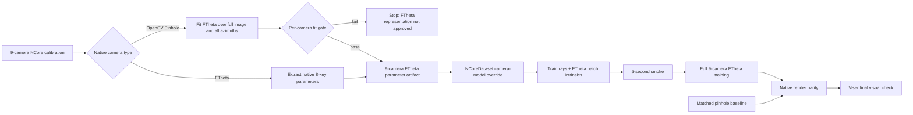

# 9-Camera FTheta Retraining and Peripheral-Blur Verification Plan

> **For agentic workers:** Execute this plan task-by-task with checkbox tracking. Do not treat a FTheta viewer rendering of a pinhole-trained checkpoint as evidence that FTheta training succeeds.
>
> **Dependency:** Complete or reuse the parameter-fitting and full-image validation work in [`2026-07-15-pinhole-ftheta-conversion-validation.md`](2026-07-15-pinhole-ftheta-conversion-validation.md), especially PIN-FTHETA-2/3/4, before starting GPU training.
>
> **2026-07-17 user-approved scope revision:** Keep the completed nine-camera survey as historical calibration evidence, but Tasks 2-7 now run a matched **seven-camera** Arm P/Arm F experiment. Both arms exclude `camera_front_standard_55fov` and `camera_front_tele_30fov`, and neither arm applies the tele-camera loss weight. This revision supersedes later references to nine-camera training/metadata/metrics; existing `9cam` plan and artifact filenames remain unchanged for traceability.

## Goal

Train a new model whose complete 9-camera train/validation/render path uses FTheta camera models, then determine whether FTheta training—not merely FTheta visualization—reduces the center-to-periphery quality gap.

The only experimental variable between the primary A/B arms is the camera-model representation:

```text
Arm P: OpenCV Pinhole rays + OpenCV Pinhole 3DGUT projection
Arm F: FTheta rays + FTheta 3DGUT projection
```

Both arms must use the same camera IDs, source frames, poses, resolution, seed, loss, layer configuration, iteration count, and evaluation protocol.

Both seven-camera experiment configs must explicitly set
`dataset.mask_forward_invalid_pixels=true` and
`dataset.opencv_pinhole_use_validity_domain=false`. The forward-valid mask is
active for Arm P's OpenCV pinhole models. It is a strict no-op for Arm F because
the dataset applies it only to `OpenCVPinholeCameraModel` instances; retaining
the same setting in both arms preserves the matched A/B while disabling the
mutually exclusive calibrated validity-domain path in both.

## Non-goals

- Do not claim a fix from `FTheta viewer + pinhole-trained checkpoint`.
- Do not add or remove cameras in the FTheta arm.
- Do not change Gaussian architecture, loss weights, depth policy, densification, or pose optimization in the camera-model A/B.
- Do not use the 1.13 px FTheta fitting residual as a sufficient explanation for blur. It is a calibration-fit measurement and must be reported alongside angular error, spatial distribution, and native-render results.
- Do not start full training until all nine camera parameter fits pass the survey gate.

## Architecture



The camera model must be consistent across all three stages:

```text
dataset pixels_to_camera_rays
        ↓
training GPU batch intrinsics
        ↓
3DGUT forward projection / render.py / Viser
```

The FTheta 8-key parameter contract is assembled in `NCoreDataset._get_camera_model_parameters_for_resolution()` and consumed by `tracer.py` through `fromFThetaCameraModelParameters()`.

## Tech Stack

- Python / NumPy / pytest for parameter extraction, fitting, and calibration validation.
- NCore SDK for native camera-model construction and ray generation.
- 3DGUT FTheta CUDA projection path.
- `train.py` and `render.py` for smoke, full training, and native evaluation.
- Viser only after native-render parity is established.
- inceptio worktree for GPU execution when the local/A800 environment is unavailable; use depth-off and `num_workers=10` there.

## Global Constraints and Evidence Sources

- The nine-camera experiment set is defined in [`ncore_3dgut_mcmc_multilayer_inceptio.yaml`](../../../configs/apps/ncore_3dgut_mcmc_multilayer_inceptio.yaml:118).
- NCore camera construction and ray-cache creation are in [`datasetNcore.py`](../../../threedgrut/datasets/datasetNcore.py:398-580).
- The FTheta parameter dictionary has eight fields in [`datasetNcore.py`](../../../threedgrut/datasets/datasetNcore.py:1777-1877).
- The native FTheta tracer bridge is in [`tracer.py`](../../../threedgut_tracer/tracer.py:475-490).
- Existing conversion validation and calibration gates are in [`2026-07-15-pinhole-ftheta-conversion-validation.md`](2026-07-15-pinhole-ftheta-conversion-validation.md).
- Existing viewer metadata currently emphasizes the primary camera in [`metadata.py`](../../../threedgrut/viz/metadata.py:117-145); the 9-camera plan must not silently fall back to an ideal pinhole projector for other cameras.
- Existing C4 evidence shows that adding FTheta cameras can improve angular coverage while lowering reconstruction metrics; improvement must therefore be demonstrated by this matched retraining A/B, not assumed.

## File Structure

### Reuse or complete from the conversion-validation plan

- `threedgrut_playground/utils/ftheta_fitter.py` — OpenCV-to-FTheta candidate fitter.
- `threedgrut_playground/utils/opencv_inverse.py` — full OpenCV reference ray generator.
- `threedgrut/tests/test_ftheta_fitter.py` — polynomial, round-trip, angular-error tests.
- `scripts/pin_ftheta_camera_survey.py` — nine-camera fit survey.
- `scripts/pin_ftheta_b6a9_calibs.json` — frozen source calibration artifact, with provenance.

### New files

- `scripts/export_9cam_ftheta_params.py` — extract native/fitted parameters and provenance into one JSON artifact.
- `threedgrut/tests/test_ncore_ftheta_override.py` — dataset override and train/val/test contract tests.
- `threedgrut/tests/test_ftheta_metadata_all_cameras.py` — checkpoint metadata coverage tests.
- `scripts/pin_ftheta_9cam_smoke.sh` — reproducible 5-second FTheta smoke driver.
- `scripts/pin_ftheta_9cam_ab.sh` — matched Arm P/Arm F training and native-render driver.
- `docs/T8_artifacts/PIN_FTHETA_9CAM_PARAMETER_SURVEY.md` — per-camera fit metrics and gate decisions.
- `docs/T8_artifacts/PIN_FTHETA_9CAM_RETRAIN_VALIDATION.md` — training commands, hashes, metrics, and visual evidence.

### Modified files

- `threedgrut/datasets/datasetNcore.py` — optional explicit FTheta camera-model override, with no silent fallback.
- `configs/apps/ncore_3dgut_mcmc_multilayer_inceptio.yaml` or a new experiment config — add the parameter-artifact path without changing the baseline recipe.
- `threedgrut/viz/metadata.py` and the Viser metadata handoff — persist all nine active camera FTheta dictionaries.
- `threedgrut_playground/viser_gui_4d.py` — consume the active camera's FTheta state only after native parity is proven.

---

## Task 0: Freeze the experiment specification

**Files:**
- Create: `docs/T8_artifacts/PIN_FTHETA_9CAM_EXPERIMENT_SPEC.md`

**Verification checklist:**

- [ ] Record the exact nine camera IDs, clip/manifest, resolution, train/val windows, seed, iterations, config commit, and GPU environment.
- [ ] Define Arm P and Arm F as a single-variable camera-model A/B.
- [ ] Define center and peripheral regions before seeing results.
- [ ] Define the fit gate from PIN-FTHETA-3/4 before GPU execution.

**Anti-pattern guards:**

- Do not use a different checkpoint, camera subset, or viewer-only swap as Arm F.
- Do not change the inverse-iteration setting in Arm F as if it were an FTheta parameter; FTheta uses its polynomial inverse path.

## Task 1: Extract and survey all nine FTheta parameter sets

**Files:**
- Reuse/modify: `scripts/export_9cam_ftheta_params.py`, `scripts/pin_ftheta_camera_survey.py`
- Output: `docs/T8_artifacts/PIN_FTHETA_9CAM_PARAMETER_SURVEY.md`

**Interfaces:**

- Input: NCore manifest and the nine camera IDs.
- Output: one JSON entry per camera with the eight FTheta fields, source model type, source calibration hash, fitter version, and fit metrics.

**Verification checklist:**

- [ ] Confirm whether each camera is native FTheta or requires OpenCV-to-FTheta fitting.
- [ ] For fitted cameras, sample multiple azimuths and the full image, not only the `+X` half-plane.
- [ ] Report center, peripheral, p50, p95, p99, and max pixel/angular errors.
- [ ] Report valid coverage and forward/inverse round-trip error.
- [ ] Stop if any camera fails the predeclared fit gate; do not begin training.

**Anti-pattern guards:**

- Do not rename an OpenCV model to FTheta without fitting its rays.
- Do not accept a whole-image mean that hides a peripheral failure.
- Do not discard tangential/thin-prism residuals without reporting them.

## Task 2: Add the explicit FTheta camera-model override

**Files:**
- Modify: `threedgrut/datasets/datasetNcore.py`
- Modify: experiment config
- Test: `threedgrut/tests/test_ncore_ftheta_override.py`

**Interfaces:**

- Input: `dataset.ftheta_params_path` mapping camera ID to an eight-key FTheta dictionary.
- Output: FTheta ray cache and `intrinsics_FThetaCameraModelParameters` for every selected camera and every split.

**Verification checklist:**

- [ ] Add RED tests for default-off behavior and explicit FTheta override behavior.
- [ ] Verify train, val, and test all use the same per-camera model type.
- [ ] Verify resolution scaling uses `transform(image_domain_scale=..., new_resolution=...)` consistently.
- [ ] Log camera ID, model type, resolution, and parameter fingerprint at dataset initialization.
- [ ] Verify no `OpenCVPinhole` path is used when the override is enabled.
- [ ] Run focused tests, then the full Mac test suite.

**Anti-pattern guards:**

- Do not mutate the original NCore manifest in place.
- Do not silently fall back to ideal pinhole if an FTheta entry is missing.
- Do not apply the OpenCV forward-valid mask to FTheta; FTheta validity must come from its own `max_angle`/polynomial domain.

## Task 3: Persist all nine cameras in checkpoint metadata and wire Viser

**Files:**
- Modify: `threedgrut/viz/metadata.py`
- Modify: `threedgrut_playground/viser_gui_4d.py`
- Test: `threedgrut/tests/test_ftheta_metadata_all_cameras.py`

**Verification checklist:**

- [ ] Store all nine camera FTheta dictionaries, not only the primary camera.
- [ ] Verify camera switching selects the active camera's FTheta dictionary and native resolution.
- [ ] Verify FTheta state and pinhole state are mutually exclusive.
- [ ] Verify viewer does not use ideal-pinhole fallback for any of the nine FTheta cameras.
- [ ] Run transition and resolution tests before any visual run.

**Anti-pattern guards:**

- Do not use Viser output to validate the training arm before native render parity.
- Do not infer camera-model correctness from overlay alignment alone.

## Task 4: Run the 5-second FTheta mechanism smoke

**Files:**
- Create: `scripts/pin_ftheta_9cam_smoke.sh`

**Verification checklist:**

- [ ] Run the same 5-second window and seed as the baseline smoke.
- [ ] Confirm all nine cameras contribute samples.
- [ ] Confirm finite loss, finite rays, and no silent camera fallback.
- [ ] Confirm checkpoint metadata contains all nine FTheta entries.
- [ ] Confirm `metrics.json` contains the expected per-camera fields.
- [ ] Keep the smoke result separate from full-window KPI evidence.

**Anti-pattern guards:**

- Do not mark the FTheta path complete because a checkpoint file was written.
- Do not compare 5-second metrics directly with full-window KPI numbers.

## Task 5: Train matched pinhole and FTheta arms

**Files:**
- Create: `scripts/pin_ftheta_9cam_ab.sh`
- Output: two isolated run directories and resolved configs.

**Verification checklist:**

- [ ] Train Arm P with the approved pinhole baseline recipe.
- [ ] Train Arm F with the nine-camera FTheta override.
- [ ] Keep seed, iterations, camera set, data windows, loss, layers, resolution, and environment identical.
- [ ] Record commit hash, config hash, parameter-artifact hash, checkpoint path, and training log for both arms.
- [ ] Verify both arms complete evaluation and write `metrics.json`.

**Anti-pattern guards:**

- Do not add the two fisheye cameras to the nine-camera arm.
- Do not change depth policy or `num_workers` between arms.
- Do not use a pinhole-trained checkpoint as the FTheta result.

## Task 6: Native render and center/periphery validation

**Files:**
- Create/modify: `docs/T8_artifacts/PIN_FTHETA_9CAM_RETRAIN_VALIDATION.md`

**Verification checklist:**

- [ ] Render identical camera IDs, timestamps, poses, resolutions, and frames from both checkpoints with native `render.py`.
- [ ] Compute center-disk and peripheral-annulus PSNR, SSIM, LPIPS, gradient correlation, edge sharpness, and center/periphery gap.
- [ ] Report per-camera results before aggregate means.
- [ ] Count invalid rays and invalid projections separately.
- [ ] Compare FTheta rays against the frozen calibration reference, not against the pinhole checkpoint.

**Decision gates:**

| Native result | Decision |
|---|---|
| FTheta peripheral quality improves and center does not regress | FTheta retraining is supported |
| Both arms remain peripheral-blurred | Camera model is not the root cause; investigate Gaussian/data/pose causes |
| FTheta native is clear but Viser is blurred | Viewer projection/state bug |
| FTheta is worse or fit gate fails | Do not adopt FTheta for these cameras |

## Task 7: Final Viser visual verification

**Verification checklist:**

- [ ] Launch Viser with the newly FTheta-trained checkpoint only after Task 6 passes.
- [ ] Inspect the same fixed camera/frame set used by native render.
- [ ] Save center/periphery screenshots for Arm P and Arm F.
- [ ] Confirm Viser and native render use the same resolution, active camera, pose, and FTheta parameters.
- [ ] Record qualitative observations separately from KPI evidence.

**Anti-pattern guards:**

- Do not use a visually pleasing Viser frame to override failed native metrics.
- Do not call the task fixed if only the overlay improves while the backdrop remains blurred.

## Final Verification and Deliverables

- [ ] Nine-camera FTheta parameter JSON with provenance and hashes.
- [ ] Per-camera fit/validity survey with center and peripheral errors.
- [ ] Dataset override tests and full Mac test result.
- [ ] 5-second smoke logs and `metrics.json`.
- [ ] Matched Arm P/Arm F full-training logs, checkpoints, resolved configs, and hashes.
- [ ] Native render comparison with per-camera center/periphery metrics.
- [ ] Viser screenshots only as a secondary visual confirmation.
- [ ] Update [`docs/pinhole_camera_kanban.md`](../../pinhole_camera_kanban.md) with the experiment result; do not mark FTheta successful without parameter-fit evidence and native A/B evidence.

## Expected conclusion format

The final report must answer these three questions separately:

1. **Can FTheta represent all nine cameras within the declared calibration gate?**
2. **Does retraining with FTheta improve native peripheral quality over matched pinhole training?**
3. **Does Viser reproduce the native FTheta result?**

Only if all three answers are positive may this work be described as a visual full-fix.
