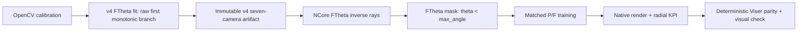

# FTheta v4 Full-Domain 7-Camera Retraining Fix Plan

> **Status:** Phases 1-2 are verified. The real `inceptio_2` train/val/test
> NCore integration probe passed without CUDA/JIT. Phase 3 now has a verified
> isolated worktree, complete canonical dataset, and reusable smoke/full v4
> data-readiness gates committed and pushed as
> `59bb0ae506e10f4d74eaab27703071f611ee950f`. The launch-time GPU-idle gate
> plus release-grade initialization of both submodules at their exact gitlink
> commits and the new output-root launch remain open, so Phase 3 is not complete.
>
> **Supersedes:** The hard-STOP calibration policy and GPU execution sections of
> [`2026-07-17-ftheta-9cam-retrain.md`](2026-07-17-ftheta-9cam-retrain.md).
> The earlier plan remains historical evidence. Results produced with
> `pin-ftheta-numpy-v3-physical-domain`, `max_angle=41.84°` for front-wide, or
> artifact SHA-256 `73965c6d...` are invalid for the new Arm F.
> Exact historical paths and hashes are preserved in
> [`PIN_FTHETA_V3_INVALIDATED_EVIDENCE.md`](../../T8_artifacts/PIN_FTHETA_V3_INVALIDATED_EVIDENCE.md).
>
> **User decision recorded on 2026-07-18:** Use the current seven-camera v4
> approximation even though several calibration quality thresholds are
> exceeded. Those residual thresholds remain visible warnings; they no longer
> block GPU execution. Runtime-domain consistency, artifact provenance, and
> matched native-render evidence remain hard requirements.
>
> **Training host:** `inceptio_2`. Read-only discovery confirmed an RTX 4090
> 24 GB, 62 GiB RAM, 3.4 TiB free disk, and the `3dgrut2` Python environment.
> Use depth-off and `num_workers=10`, matching the established `inceptio`
> recipe. The complete canonical b6a9 dataset was copied and verified on
> 2026-07-18. Historical incomplete copies were left untouched.

## Goal

Correct the FTheta conversion and supervision-domain path, retrain a matched
seven-camera Pinhole/FTheta A/B on `inceptio_2`, and determine with native
center/periphery metrics whether full-domain FTheta training removes or reduces
the visible clear-center/blurred-outer-ring defect.

The seven active cameras are:

1. `camera_front_wide_120fov`
2. `camera_cross_left_120fov`
3. `camera_cross_right_120fov`
4. `camera_left_wide_90fov`
5. `camera_right_wide_90fov`
6. `camera_back_rear_wide_90fov`
7. `camera_rear_left_70fov`

Both arms exclude `camera_front_standard_55fov` and
`camera_front_tele_30fov`, as already approved. The only scientific variable is
the camera representation:

```text
Arm P: source OpenCV Pinhole rays + Pinhole 3DGUT projection
Arm F: versioned v4 FTheta rays + FTheta 3DGUT projection
```

Everything else—clip, frame windows, seven cameras, poses, resolution, seed,
losses, layers, depth policy, iterations, renderer, and evaluation frames—must
match.

## Why a new plan is required

The previous FTheta artifact inherited the Pinhole renderer's
`0.8 < icD < 1.2` trust gate. That truncated front-wide to `41.84°`, giving only
about 63% raster coverage and defeating the purpose of converting a large-FOV
camera to FTheta.

The current v4 working tree correctly separates the domains:

- OpenCV Pinhole runtime continues to use the `icD` trust gate.
- OpenCV-to-FTheta calibration does **not** use the `icD` gate.
- Calibration still rejects later folded rational branches and non-positive
  Jacobian regions.
- Front-wide becomes `max_angle=69.2585°` with 99.9929% FTheta-domain raster
  coverage.

A second mismatch was found during this plan's discovery: NCore returns finite
FTheta inverse rays outside `max_angle`, while CUDA forward projection accepts
only `theta < max_angle`. Therefore FTheta currently supervises some pixels
that it cannot forward-project. Phase 2 adds a FTheta-own-domain supervision
mask. This fix must not reuse any OpenCV `icD` condition.



## Non-goals

- Do not reintroduce `0.8 < icD < 1.2` anywhere in the FTheta arm.
- Do not keep refitting degree-5 polynomials merely to turn accepted residual
  warnings green before the downstream experiment.
- Do not reuse or metadata-swap a v3 FTheta checkpoint. It was optimized under
  different rays and a different projection domain.
- Do not overwrite a parameter file referenced by an old checkpoint. Doing so
  creates a hybrid render: old-trained Gaussians, new dataset rays, and old
  embedded camera metadata.
- Do not add front-standard/front-tele back into either arm.
- Do not use a Viser screenshot as proof of training correctness. Native render
  and radial metrics come first.
- Do not hide invalid/excluded corners by reporting only a masked common domain.

## Frozen inputs and experiment identity

- Clip: `inceptio_b6a9ed61-8952-4b0c-90d8-fd2893e849e9`
- Manifest SHA-256:
  `df2021203cfe318cfa8da3462e38c5b7fbf6bf3963d3a8149d145f98f6036e31`
- Canonical target path on `inceptio_2`:
  `/home/inceptio/work/data/inc_b6a9ed61_20s/inceptio_b6a9ed61-8952-4b0c-90d8-fd2893e849e9/`
- Base config:
  `configs/apps/ncore_3dgut_mcmc_multilayer_inceptio_7cam.yaml`
- Environment policy: depth supervision off, `num_workers=10`, seed `42`
- Mechanism smoke: 5-second window, 5k iterations
- Full comparison: full 20-second window, 30k iterations
- Branch: `codex/ftheta-full-domain-v4`
- Verified remote worktree:
  `/home/inceptio/repo/3dgrut2-wt/ftheta-v4-7cam` at
  `59bb0ae506e10f4d74eaab27703071f611ee950f`
- Proposed output roots:
  - smoke: `/home/inceptio/work/output/pin_ftheta_v4_smoke_runs`
  - full: `/home/inceptio/work/output/pin_ftheta_v4_full_ab_runs`

## Policy: hard safety gates versus accepted quality warnings

### Hard safety gates

These conditions stop execution:

1. The FTheta fitter/inverse calibration path applies the Pinhole `icD` gate.
2. A later folded rational branch is used.
3. Any of the exact eight FTheta fields is missing, non-finite, or structurally
   invalid; source resolution or principal point changes unexpectedly.
4. Forward or inverse polynomial derivative is non-positive anywhere in its
   used domain under dense verification.
5. Per-camera FTheta coverage regresses below the accepted v4 baseline beyond
   a declared numerical tolerance.
6. The artifact is mutable, lacks provenance/hashes, has a stale v3 fingerprint,
   or front-wide has the old `0.730310... rad` sentinel.
7. Dataset construction silently clips `max_angle`, falls back to Pinhole/ideal
   Pinhole, or applies an OpenCV forward-valid mask to FTheta.
8. Any FTheta pixel with `theta >= max_angle` reaches RGB supervision.
9. Any selected camera/split has zero frames, non-finite rays/loss/render output,
   missing checkpoint metadata, or a mismatched artifact fingerprint.
10. P/F scientific configs differ in anything other than camera representation
    and output bookkeeping.
11. The canonical dataset is incomplete, or native render inventories/GT trees
    do not match exactly.

### Soft calibration warnings

These remain reported per camera but do not stop smoke/full training after the
user's explicit acceptance:

| Metric | Historical warning threshold |
|---|---:|
| non-radial floor mean | `< 0.01°` |
| forward polynomial max | `< 1.5 px` |
| angular mean | `< 0.02°` |
| angular p95 | `< 0.04°` |
| angular p99 | `< 0.08°` |
| angular max | `< 0.15°` |
| outer angular p99 | `< 0.10°` |

Accepted current warning inventory:

| Camera | Exceeded warning metrics |
|---|---|
| front-wide | none |
| cross-left | non-radial mean, p95, p99, max, outer p99 |
| cross-right | none |
| left-wide | forward max, p95, p99, max, outer p99 |
| right-wide | forward max, mean, p95, p99, max, outer p99 |
| back-rear-wide | p95, max |
| rear-left | max |

Accepted v4 coverage baselines:

| Camera | FTheta domain | OpenCV calibration domain | Pixels outside FTheta `max_angle` |
|---|---:|---:|---:|
| front-wide | 99.9929% | 100.0000% | 148 |
| cross-left | 99.9933% | 100.0000% | 138 |
| cross-right | 99.9936% | 100.0000% | 133 |
| left-wide | 98.7290% | 98.4722% | 26,355 |
| right-wide | 97.8640% | 97.5162% | 44,292 |
| back-rear-wide | 99.9942% | 100.0000% | 120 |
| rear-left | 99.9951% | 100.0000% | 101 |

The pixel counts are native-resolution v4 oracles. Tests may allow only a
documented float32 boundary tolerance; unexplained differences are a hard stop.

## Existing APIs and evidence sources

- Fitter:
  [`fit_ftheta_from_opencv_rational()`](../../../threedgrut_playground/utils/ftheta_fitter.py)
- Full OpenCV inverse/calibration-domain switch:
  [`invert_opencv_full_model()` and `opencv_pixels_to_camera_rays()`](../../../threedgrut_playground/utils/opencv_inverse.py)
- Full-image angular/radial survey:
  [`compute_fullimage_angular_error()`](../../../threedgrut_playground/utils/ftheta_fitter.py)
- FTheta override validation and construction:
  [`threedgrut/datasets/ftheta_override.py`](../../../threedgrut/datasets/ftheta_override.py)
- Dataset rays, masks, and batch intrinsics:
  [`threedgrut/datasets/datasetNcore.py`](../../../threedgrut/datasets/datasetNcore.py)
- FTheta native tracer bridge:
  [`threedgut_tracer/tracer.py`](../../../threedgut_tracer/tracer.py)
- Current survey and strict thresholds:
  [`scripts/pin_ftheta_camera_survey.py`](../../../scripts/pin_ftheta_camera_survey.py)
- Reusable full A/B evidence contract:
  [`scripts/pin_ftheta_full_ab_validation.py`](../../../scripts/pin_ftheta_full_ab_validation.py)
- Regional native analysis:
  [`scripts/drivers/pin_ab_radial_analysis.py`](../../../scripts/drivers/pin_ab_radial_analysis.py)
- Checkpoint camera metadata:
  [`threedgrut/viz/metadata.py`](../../../threedgrut/viz/metadata.py)
- Viewer camera-state merge:
  [`threedgrut_playground/utils/camera_render_state.py`](../../../threedgrut_playground/utils/camera_render_state.py)

---

## Phase 0: Documentation discovery and contract freeze

**Files:**

- Modify: `docs/T8_artifacts/PIN_FTHETA_9CAM_EXPERIMENT_SPEC.md`
- Modify: `docs/T8_artifacts/PIN_FTHETA_9CAM_PARAMETER_SURVEY.md`
- Create: `docs/T8_artifacts/PIN_FTHETA_9CAM_PARAMETER_SURVEY_V3_PHYSICAL_DOMAIN.md`
- Create: `docs/T8_artifacts/PIN_FTHETA_V3_INVALIDATED_EVIDENCE.md`
- Modify: `docs/superpowers/plans/2026-07-17-ftheta-9cam-retrain.md`
- Modify now: `docs/pinhole_camera_kanban.md` for Phase 0 status and historical
  inventory linkage
- Modify again after Phase 9 measured results: `docs/pinhole_camera_kanban.md`
- Modify after host/data paths are finalized: `AGENTS.md`

**Discovery already completed while authoring this plan:**

- [x] Confirm the v3 `41.84°` root cause in fitter/inverse code.
- [x] Confirm the current v4 front-wide `69.2585°` result and seven-camera
  coverage/derivative baselines.
- [x] Confirm the dataset → Batch → tracer → CUDA FTheta chain.
- [x] Confirm the missing FTheta `max_angle` supervision mask.
- [x] Confirm old checkpoint/artifact evidence cannot be reused.
- [x] Confirm `inceptio_2` GPU/RAM/disk/Python environment.
- [x] Confirm `inceptio_2` does not yet have a complete canonical seven-camera
  b6a9 input.
- [x] Confirm native radial analysis exists and deterministic Viser image
  generation does not.

**Implementation checklist:**

- [x] Add a superseded banner to the July 17 plan; do not delete its history.
- [x] Rewrite the experiment spec so calibration residuals are WARN and runtime
  invariants are HARD.
- [x] Record the accepted warning table and coverage baselines above verbatim.
- [x] Declare all v3 smoke/full/native/Viser artifact and checkpoint categories
  invalid for the v4 decision without rewriting historical evidence.
- [x] Record the exact v3 run/checkpoint/artifact paths and hashes in
  [`PIN_FTHETA_V3_INVALIDATED_EVIDENCE.md`](../../T8_artifacts/PIN_FTHETA_V3_INVALIDATED_EVIDENCE.md),
  including the precise limitation that no separately hashed or manifest-bound
  Viser evidence was recovered.
- [x] Freeze the center/periphery regions before running the new A/B:
  center `r < 0.5`, periphery `r >= 0.9`.
- [x] Add the verified `inceptio_2` runbook to `AGENTS.md`, including its PATH,
  depth-off/worker policy, isolated-worktree rule, and canonical data path.

**Anti-pattern guards:**

- Do not rewrite old run manifests or make old evidence look current.
- Do not mark Phase 0 complete until the exact v3 inventory is recorded.
- Do not call `physical_domain_retention` a Pinhole runtime domain in v4; it now
  refers to the calibration-domain comparison and should be renamed or clearly
  documented.
- Do not define adoption thresholds after seeing the full-run result.

## Phase 1: Freeze the v4 fitter, survey policy, and immutable artifacts

**Files:**

- Modify: `threedgrut_playground/utils/ftheta_fitter.py`
- Modify: `threedgrut_playground/utils/opencv_inverse.py`
- Modify: `scripts/pin_ftheta_camera_survey.py`
- Modify: `threedgrut/tests/test_ftheta_fitter.py`
- Modify: `threedgrut/tests/test_opencv_inverse.py`
- Create: `scripts/pin_ftheta_b6a9_7cam_params_v4_full_domain.json`
- Create: `scripts/pin_ftheta_b6a9_9cam_survey_v4_full_domain.json`

**Implementation:**

1. Preserve `enforce_runtime_trust=True` as the safe default for ordinary
   Pinhole runtime calls.
2. Require every FTheta calibration caller to pass
   `enforce_runtime_trust=False` explicitly.
3. Preserve first-raw-monotonic-branch and positive-Jacobian checks.
4. Split the survey result into:
   - `hard_failures`: structural/domain/provenance/monotonicity failures;
   - `quality_warnings`: the accepted residual thresholds.
5. Return non-zero only for hard failures. Print and serialize every quality
   warning without converting it to PASS.
6. Densely evaluate forward and inverse polynomial derivatives across the used
   domain for all seven cameras. Do not rely only on the fitter fallback.
7. Generate new, versioned artifacts. The seven-camera runtime artifact must
   either include its own provenance or reference and hash the richer survey
   artifact.
8. Record source calibration SHA, fitter source SHA, generation command,
   generated-at time, exact camera order, and final artifact SHA.
9. Before the Phase 1 implementation commit, restore every legacy mutable
   artifact path to its exact pre-v4 bytes. Write v4 output only to the new
   versioned paths, so an old checkpoint can never resolve to v4 content.

**Verification checklist:**

- [x] Tests cover domain separation for all seven cameras, not only front-wide.
- [x] Front-wide sentinel is `max_angle≈1.208789 rad`, never `0.730310 rad`.
- [x] All eight fields are finite and both polynomial derivatives are positive.
- [x] Artifact generation is deterministic byte-for-byte.
- [x] Coverage meets the accepted per-camera baselines within frozen tolerance.
- [x] Quality threshold violations appear as warnings and do not cause exit 2.
- [x] A hard invariant failure still causes non-zero exit.

**Verified Phase 1 evidence (Mac, 2026-07-18):**

- Focused results: transaction/structural/path-collision tests `20 passed`;
  fitter plus inverse suites `72 passed`; loader regression suite `21 passed`.
- Two consecutive real exporter CLI runs produced byte-identical survey,
  runtime, and provenance files.
- Final SHA-256 prefixes: runtime `e637b584`, survey `08087b1f`, provenance
  sidecar `df3d51f3`.
- Legacy artifacts remain byte-for-byte unchanged: seven-camera SHA-256
  `73965c6d10693b7742c7afb538169990a94d2457890738a7a4f66d13fcd0a450`;
  nine-camera SHA-256
  `2f914d17f69d7f235ddd90abe1d52c3e9e25e383b29491b2e9d7dbef2f162cfa`.
- Frozen native-resolution three-domain counts (`kept / excluded`):

| Camera | FTheta own domain | OpenCV calibration domain | Comparison intersection |
|---|---:|---:|---:|
| `camera_front_wide_120fov` | 2,073,452 / 148 | 2,073,600 / 0 | 2,073,452 / 148 |
| `camera_cross_left_120fov` | 2,073,462 / 138 | 2,073,600 / 0 | 2,073,462 / 138 |
| `camera_cross_right_120fov` | 2,073,467 / 133 | 2,073,600 / 0 | 2,073,467 / 133 |
| `camera_left_wide_90fov` | 2,047,245 / 26,355 | 2,041,919 / 31,681 | 2,041,919 / 31,681 |
| `camera_right_wide_90fov` | 2,029,308 / 44,292 | 2,022,096 / 51,504 | 2,022,096 / 51,504 |
| `camera_back_rear_wide_90fov` | 2,073,480 / 120 | 2,073,600 / 0 | 2,073,480 / 120 |
| `camera_rear_left_70fov` | 2,073,499 / 101 | 2,073,600 / 0 | 2,073,499 / 101 |

**Anti-pattern guards:**

- Do not remove fold/Jacobian safety to obtain 100% coverage.
- Do not hide the accepted tangential/non-radial approximation. The current fit
  uses a `+X` radial profile and identity `linear_cde`; document that limitation.
- Do not overwrite an artifact used by a historical checkpoint.

## Phase 2: Add the FTheta-own-domain supervision mask

> **Implementation status (2026-07-18):** Complete and verified. The focused
> dataset/camera-domain suites report `100 passed`, including the pure-contract
> seven-camera native-resolution exclusion oracle and unchanged Pinhole
> regression suites. A real canonical-data `inceptio_2` probe subsequently
> constructed train, val, and test `NCoreDataset` instances, read one full
> sample from each, and reproduced every exclusion oracle without CUDA/JIT.

**Files:**

- Modify: `threedgrut/datasets/__init__.py`
- Modify: `threedgrut/datasets/utils.py`
- Modify: `threedgrut/datasets/datasetNcore.py`
- Modify: `configs/apps/ncore_3dgut_mcmc_multilayer_inceptio_7cam.yaml` or add a
  dedicated v4 config
- Modify: `threedgrut/tests/test_ncore_ftheta_override.py`
- Add a focused test file only if the existing test becomes unwieldy.

**Required behavior:**

For an FTheta camera ray `ray=(x,y,z)`, compute:

```python
theta = atan2(sqrt(x*x + y*y), z)
valid = isfinite(ray).all() and theta < camera_model.max_angle
```

Use the same strict `<` boundary as the CUDA forward projection. AND this mask
into the RGB supervision mask for FTheta train/val/test. Pinhole continues to
use its own forward-valid logic. There must be no call to an OpenCV `icD` mask
from the FTheta branch.

Freeze `dataset.camera_max_fov_deg=190.0` explicitly. Every train, validation,
and test `NCoreDataset` construction in `threedgrut/datasets/__init__.py` must
pass `camera_max_fov_deg` through to `datasetNcore.py`; assert that constructed
and resolution-transformed FTheta `max_angle` equals the artifact value and do
not allow silent clipping.

**Verification checklist:**

- [x] RED test proves finite NCore rays outside `max_angle` were previously
  supervised.
- [x] GREEN test proves every `theta >= max_angle` FTheta pixel is excluded.
- [x] Exact native-resolution excluded counts match the seven v4 oracle values.
- [x] A boundary test distinguishes `< max_angle` from `<= max_angle`.
- [x] FTheta mask logic contains no `icD`, rational denominator, or Pinhole
  trust-domain condition.
- [x] Pinhole behavior is unchanged.
- [x] Train, val, test, and render dataset construction use the same model and
  domain contract.
- [x] Telemetry logs per-camera model type, artifact fingerprint, total pixels,
  excluded-by-max-angle pixels, and non-finite pixels.

**Verified Phase 2 canonical-data probe (`inceptio_2`, 2026-07-18):**

- Worktree/commit:
  `/home/inceptio/repo/3dgrut2-wt/ftheta-v4-7cam` at
  `b1afacb4f7fb323d8db59c70bf49c600f1685fef`.
- Config: `apps/ncore_3dgut_mcmc_multilayer_inceptio_7cam_v4`, five-second
  train/val windows, native `1920x1080`, `camera_max_fov_deg=190.0`,
  `n_val_image_subsample=1`, aux masks on, both depth inputs off.
- Runtime artifact SHA-256:
  `e637b5845302edaa940b10671b31d4b7d29a727eeb358f98249ac5334d459fbd`.
- Machine-readable result:
  `/tmp/ftheta_v4_dataset_probe.json`, SHA-256
  `16098116db576954ab4d112e724c1d2c90c9c6c5c13be066a76861af6ab05e3f`.
- Full log: `/tmp/ftheta_v4_dataset_probe.log`, SHA-256
  `8db35ffd05be453b51e623284de8c0b651182145de861bded11868847f780348`.
- Dataset lengths were train `284`, val `44`, and test `44`. One real
  full-resolution sample was decoded from each split; every RGB value was
  finite, every valid mask was `1080x1920`, and semantic/road/sky/dynamic masks
  were present.
- The log contains exactly 21 stable telemetry records (three splits x seven
  cameras). Every record reports `model_type=FThetaCameraModel`,
  `total=2,073,600`, and `nonfinite=0`.

| Camera | Artifact fingerprint | Excluded by `max_angle` | Train frames | Val/test frames | Forbidden supervised pixels |
|---|---|---:|---:|---:|---:|
| `camera_front_wide_120fov` | `0785f301bb8ee9bc3084d1882b2459d60055afe47633a800ff9be18997c7aa55` | 148 | 38 | 6 / 6 | 0 |
| `camera_cross_left_120fov` | `8a4bbf97ccef47c95645f63450b08612a9f383b657ebec6cbb6e2580398e2ac2` | 138 | 42 | 6 / 6 | 0 |
| `camera_cross_right_120fov` | `49fd193cbebf9db682ce4f7f8fa41b9a7bc56c5d79d83d72ef2003a0bc662f5c` | 133 | 37 | 6 / 6 | 0 |
| `camera_left_wide_90fov` | `683441e06e127ec7dbbedf672fcec176760323e19e03141838609aac2a5d381c` | 26,355 | 39 | 6 / 6 | 0 |
| `camera_right_wide_90fov` | `e5410c753599762326b049e6dfb407d75ea6754ba99b0968717410a8eb9886a5` | 44,292 | 43 | 7 / 7 | 0 |
| `camera_back_rear_wide_90fov` | `7e7a327a84a8f55ef4a246824f1e26eb9956c85d84194a206e5bca04736e87b3` | 120 | 42 | 6 / 6 | 0 |
| `camera_rear_left_70fov` | `d92d0cf162a5abe75c572b3211d487f9b368542e6198680b5d89996290046a4a` | 101 | 43 | 7 / 7 | 0 |

For every split/camera, the static supervision mask and its first/last
per-frame copies contained zero valid pixels outside the strict FTheta domain;
the sampled batch also contained zero. Runtime construction preserved every
artifact `max_angle` exactly (`max delta=0`), as did an explicit `960x540`
parameter transform (`max delta=0`). The probe ran with
`CUDA_VISIBLE_DEVICES=''`; `torch.cuda.is_initialized()` remained false and no
trainer or JIT path was entered.

**Anti-pattern guards:**

- Do not mark all finite FTheta inverse rays valid.
- Do not change `max_angle` just to reduce the excluded count.
- Do not report only masked metrics; full-raster output remains part of Phase 6.

## Phase 3: Prepare `inceptio_2` code and canonical data

**Verified host facts:**

- Host/user: `inceptio-4090-2` / `inceptio`
- GPU: RTX 4090, 24,564 MiB
- RAM: 62 GiB; swap 8 GiB
- Python: `/home/inceptio/miniforge3/envs/3dgrut2/bin/python` (3.11.15)
- Torch/NCore: torch `2.11.0+cu128`, NCore `19.2.1`
- Repository: `/home/inceptio/repo/3dgrut2` (currently old and dirty)
- Output: `/home/inceptio/work/output`

`~/miniforge3/etc/profile.d/conda.sh` is absent. Drivers must export
`/home/inceptio/miniforge3/envs/3dgrut2/bin` into PATH rather than assuming
`conda activate` works.

**Resolved canonical-data blocker:**

- Before transfer, the normal driver path was absent. One local copy had the
  correct manifest but only 1/14 raw component stores; another had all 14 raw
  stores but only six-camera aux coverage and omitted
  `camera_rear_left_70fov`.
- The original `inceptio` canonical dataset had all 14 raw stores and 11-camera
  aux coverage. It was copied through an isolated staging path, fully hashed
  and opened, then atomically promoted to the exact canonical target. The two
  incomplete historical copies were not deleted or overwritten.

**Implementation checklist:**

- [x] Commit the relevant v4 implementation/artifacts/tests on the proposed
  branch without including unrelated dirty files.
- [x] Push that exact commit to `inceptio_2` and create the isolated worktree;
  never train from its dirty main checkout.
- [ ] Initialize both submodules in the isolated worktree and verify each HEAD
  exactly equals its superproject gitlink commit. Restored header trees without
  initialized submodule metadata are not release-ready.
- [x] Sync or materialize the complete canonical dataset from `inceptio` into
  the exact target path on `inceptio_2`. Select a transfer route only after a
  read-only source/destination size and disk check.
- [x] Verify the frozen manifest SHA and sequence ID.
- [x] Verify all 14 referenced raw component stores exist and can be opened.
- [x] Verify aux metadata covers all seven selected cameras and required LiDAR
  components; open representative keys rather than checking filenames only.
- [x] Verify camera frame counts/resolutions and available disk after transfer.
- [ ] Verify GPU is idle immediately before launch.
- [x] Use the new isolated worktree name; stale prunable worktree metadata and
  historical run directories were not removed.
- [x] Selectively commit/push the verified readiness patch and fast-forward the
  isolated worktree without including unrelated dirty files.
- [ ] Launch only into the new smoke/full output roots after reusable preflight
  passes.

**Verified Phase 3 worktree/data evidence (`inceptio_2`, 2026-07-18):**

- Isolated worktree:
  `/home/inceptio/repo/3dgrut2-wt/ftheta-v4-7cam`, commit
  `59bb0ae506e10f4d74eaab27703071f611ee950f` after the selective readiness
  commit was pushed directly to the `inceptio_2` repository and the checked-out
  branch was fast-forwarded by `receive.denyCurrentBranch=updateInstead`.
- Canonical target:
  `/home/inceptio/work/data/inc_b6a9ed61_20s/inceptio_b6a9ed61-8952-4b0c-90d8-fd2893e849e9/`.
- Source and target both contain `5,163,009,372` bytes in 49 files. The complete
  relative-name/size/per-file-SHA streams matched byte-for-byte; their
  aggregate SHA-256 is
  `6968a7711b78b7367b8e790676708f3965236d2636677a2ef16a4ddc5cc0feba`.
- Transfer used a Mac-relayed tar stream into a non-conflicting staging
  directory and completed in `45.68 s`; promotion to the target was atomic and
  guarded by a target-absent check.
- Manifest SHA-256 is
  `df2021203cfe318cfa8da3462e38c5b7fbf6bf3963d3a8149d145f98f6036e31`;
  sequence ID is `inceptio_b6a9ed61-8952-4b0c-90d8-fd2893e849e9`.
- All 14/14 manifest component stores opened successfully and yielded a
  representative array plus expected root metadata. Final
  `SequenceLoaderV4` discovery found all 12 cameras and
  `lidar_top_360fov`; none of the active seven was missing.
- All four required aux stores opened successfully: semantic segmentation has
  2,063 leaves across 11 cameras; ego mask has 10 camera entries; LiDAR
  segmentation and LiDAR camera visibility each have 200 entries. The active
  seven are present in sseg, egomask, and the 11-camera aux metadata.
- Active-seven raw/sseg frame counts match at `186, 190, 177, 177, 193, 191,
  194` in config camera order. Representative raw/sseg/egomask images are all
  `1920x1080`. After transfer the filesystem retained about 3.67 TB free.
- The isolated worktree resolves to
  `59bb0ae506e10f4d74eaab27703071f611ee950f`; tracked status is clean.
  Restored dependency contents include
  `thirdparty/tiny-cuda-nn/include/tiny-cuda-nn/common.h` and
  `threedgrt_tracer/dependencies/optix-dev/include/optix.h`.
- No training output directory was created and no trainer, CUDA, or JIT path
  ran during data preparation or the dataset probe.

**Required validator improvement:**

> **Status:** Implemented, independently verified, selectively committed as
> `59bb0ae506e10f4d74eaab27703071f611ee950f`, pushed to `inceptio_2`, and
> present in the tracked-clean isolated worktree. No unrelated dirty file was
> included.

The reusable `scripts/ncore_data_readiness.py` gate now:

- requires an explicit `v4-multilayer` aux profile at v4 call sites, preserving
  the old smoke/full CLI behavior when the profile flag is absent;
- opens every manifest component store and all four required aux stores through
  the production IndexedTarStore path;
- requires all seven raw cameras, exact raw-to-sseg END-timestamp key equality,
  decoded `1920x1080` sseg/egomask payloads, and nonempty representative raw
  frames;
- requires exact raw point-cloud/lidar-sseg/lidar-camvis sensor and timestamp
  equality, then reads every raw point cloud and every matching aux frame;
  for all 200 timestamps the raw `xyz.shape[0]`, decoded lidar-sseg count, and
  fully read lidar-camvis first dimension must be exactly equal;
- binds `v4-multilayer` to the frozen v4-only config, full-domain runtime
  artifact, survey, provenance sidecar, fitter/source hashes, camera order,
  canonical manifest SHA/clip ID, and exactly 14 manifest component stores;
  the legacy `73965c6d...` artifact and legacy config cannot claim this profile;
- keeps the no-profile public APIs backward compatible, while the public
  smoke/full create APIs cannot write a v4-profile manifest without running
  canonical-manifest validation and the complete readiness scan themselves;
- runs after cheap source/provenance checks and immediately before the exclusive
  smoke/full run-manifest write; v4 manifests hash the readiness source,
  provenance sidecar, and survey artifact.

Local verification on 2026-07-18 passed `py_compile`, `git diff --check`, and
`162` focused tests covering readiness, FTheta override, and both validator
drivers. Independent quality/anti-pattern review findings for timestamp sets,
PNG decoding, native resolution, LiDAR payload alignment, legacy isolation,
provenance order, readiness-source hashing, all-frame point-count alignment,
and v4 profile identity were closed before the final run.

Final real no-GPU verification used the canonical dataset and the exact
validator code later committed as `59bb0ae`; before the selective commit it was
copied only to `/tmp/ftheta_v4_readiness_overlay_20260718`, so the verification
did not modify the remote worktree or dataset:

- direct readiness: `DIRECT_FINAL_ALL_LIDAR_OK`, 14 component stores, raw/sseg
  counts `186,190,177,177,193,191,194`, and all 200 raw/lidar-sseg/lidar-camvis
  frames and point counts matched;
- full `manifest-create`: schema `3`, status `running`, profile
  `v4-multilayer`, readiness/sidecar/survey sources hashed;
- smoke `manifest-create`: schema `2`, status `started`, profile
  `v4-multilayer`, readiness/sidecar/survey sources hashed;
- all three reported `torch.cuda.is_initialized() == False`; no GPU, JIT,
  trainer, or training-output path was entered.

**Anti-pattern guards:**

- Do not trust manifest hash alone as proof that its component stores exist.
- Do not use the six-camera aux copy for a seven-camera run.
- Do not rsync the local dirty worktree over the remote repository; use a
  committed branch and isolated worktree.
- Do not start JIT/training while data transfer or preflight is incomplete.

## Phase 4: Mac tests, provenance freeze, and no-GPU preflight

> **Implementation status (2026-07-18):** The dedicated v4 smoke/full drivers,
> dependency-light CPU preflight gate, validator parameterization, and driver
> tests are implemented in the local dirty worktree. Focused Mac verification
> passes, but these files are intentionally not committed yet. Therefore the
> final commit/hash freeze, full Mac suite, canonical-data remote preflight, and
> launch remain open. No GPU, CUDA initialization, JIT, trainer, renderer, or
> training-output path was entered.

**Files:**

- Create: `scripts/pin_ftheta_7cam_v4_smoke.sh`
- Create: `scripts/pin_ftheta_7cam_v4_full_ab.sh`
- Create or parameterize: v4 smoke/full validators without weakening the old
  historical evidence contract
- Modify/add driver tests under `threedgrut/tests/`

Reuse the proven train → checkpoint metadata → native render → metrics → hashed
run-manifest structure from `scripts/pin_ftheta_9cam_smoke.sh` and
`scripts/pin_ftheta_7cam_full_ab.sh`, but point v4 drivers only at the immutable
v4 artifact and new output roots.

**Verification checklist:**

- [x] Driver preflight rejects the old artifact SHA and `0.730310 rad` sentinel.
- [ ] Preflight verifies final commit SHA, source/artifact hashes, exact seven
  cameras, exact eight keys, and per-camera fingerprints.
- [x] The provenance sidecar is a mandatory preflight input: before any GPU/JIT
  work, verify its generation command, runtime/survey artifact hashes, all
  hashed source files, frozen timestamp, seven-camera order, and fingerprints.
  A missing, stale, or mismatched sidecar is a hard failure.
- [ ] Preflight checks complete dataset stores and seven-camera aux coverage.
- [x] Config explicitly freezes `camera_max_fov_deg=190.0`, depth-off,
  `num_workers=10`, seed, durations, and camera order.
- [x] P/F normalized scientific config diff contains only the artifact/camera
  representation and output bookkeeping.
- [x] Old and v4 checkpoint paths/artifact paths cannot be confused.
- [ ] Run focused tests, then full `pytest -q threedgrut/tests` on Mac. If the
  sandbox blocks a local socket test, rerun outside the sandbox and record it.
- [ ] Recompute hashes after the final commit; never freeze dirty-worktree hashes
  as release evidence.
- [ ] Run the remote `--preflight` successfully before allocating the GPU.

**Current Phase 4 evidence (Mac, 2026-07-18):**

- New drivers are `scripts/pin_ftheta_7cam_v4_smoke.sh` and
  `scripts/pin_ftheta_7cam_v4_full_ab.sh`; both run the CPU-only preflight before
  exporting `CUDA_VISIBLE_DEVICES`, creating output directories, or referencing
  `train.py`/`render.py`.
- The shared `scripts/pin_ftheta_v4_driver_validation.py` imports neither torch
  nor trainer/renderer code. Its order is committed-source branch/SHA gate,
  v4-only path/output isolation, runtime/survey/sidecar/source hash validation,
  exact seven-camera/eight-key/fingerprint and legacy-sentinel rejection,
  canonical manifest/readiness, then resolved P/F parity.
- The release SHA is no longer self-derived: both drivers require the external
  `PIN_FTHETA_EXPECTED_COMMIT`, pass it through preflight and manifest creation,
  and reject an empty or mismatched value. The v4 release gate rejects tracked
  and untracked files (including `sitecustomize.py`/shadow modules) and verifies
  required tiny-cuda-nn/OptiX headers. Both submodules must be initialized,
  recursively clean, and checked out at the exact superproject gitlink commit;
  each nested descendant is checked against the gitlink in its immediate owning
  parent submodule HEAD. A restored header tree, wrong commit, or dirty outer or
  nested submodule is a hard failure.
- V4-only log/metrics gates require train/val/test x exact-seven camera-domain
  telemetry, frozen model/fingerprint/total/excluded/nonfinite oracles, explicit
  or renderer-schema-equivalent `nonfinite_pred_px=0`, and no
  prediction/render drop sentinel. The smoke
  evidence chain now hashes and revalidates native render/GT PNG inventories;
  its failure trap records stage and exit code. Legacy v3 paths retain their
  prior validation behavior.
- `py_compile`, `bash -n` for both drivers, and `git diff --check` pass. Focused
  readiness/FTheta/driver regression reports `204 passed in 18.45s` after the
  quality-gate fixes.
- Static Mac provenance/config preflight passed for all seven cameras. Do not
  record normalized config hashes from the intentionally uncommitted Mac
  worktree. Recompute and record them only after the final commit is checked out
  at `/home/inceptio/repo/3dgrut2-wt/ftheta-v4-7cam` and preflight succeeds with
  the canonical dataset at
  `/home/inceptio/work/data/inc_b6a9ed61_20s/inceptio_b6a9ed61-8952-4b0c-90d8-fd2893e849e9/`.
- Shell tests prove empty expected-commit and wrong-SHA rejection; the correct
  current SHA advances to the next gate and creates no output. In the
  intentionally uncommitted local worktree it then stops at the complete-clean
  source gate. This is the required pre-commit behavior, not a readiness bypass.
  The complete canonical stores are not on the Mac; after selective commit/sync,
  the same command must pass against canonical `inceptio_2` data before any GPU
  allocation. Final normalized hashes must be recomputed from that commit.

**Anti-pattern guards:**

- Do not reuse the filename behind an old checkpoint.
- Do not include unrelated current modifications to
  `scripts/drivers/pin_ab_radial_analysis.py`, its test, or kanban files in the
  v4 implementation commit unless they are separately reviewed and tested.
- Do not weaken validators to make stale evidence pass.

## Phase 5: Matched 5-second / 5k Pinhole-FTheta smoke

Run both arms from the same `inceptio_2` worktree and process environment. Use a
detached `setsid` launch with stdin/stdout/stderr disconnected, because the
driver nests train and evaluation processes.

**Hard smoke gates:**

- [ ] Both arms resolve the same seven cameras, 5-second window, seed, frame
  inventory, losses, layers, resolution, depth-off policy, and 5k steps.
- [ ] Arm P uses OpenCV Pinhole; Arm F uses FTheta in dataset rays, Batch
  intrinsics, tracer, native render, and checkpoint schema-v3 metadata.
- [ ] All seven cameras have positive sample/render/metric counts.
- [ ] FTheta domain telemetry exactly matches the preflight contract.
- [ ] Losses and rays are finite; no renderer batch/pixel is dropped for
  non-finite output.
- [ ] Both checkpoints reach global step 5000 and contain exact seven-camera
  types, native resolutions, eight-key dictionaries, artifact SHA, and
  fingerprints.
- [ ] Native renders and complete per-camera `metrics.json` are written.
- [ ] Run manifests hash logs, configs, artifact, checkpoints, render trees, and
  metrics.

**Stop conditions:**

- Any fallback/model/fingerprint mismatch.
- Any FTheta pixel outside its own `max_angle` reaches supervision.
- Missing camera metrics, non-finite loss/render, incomplete checkpoint, or
  mismatched frame/GT inventory.

The smoke validates mechanism only. Its 5-second metrics must not be compared
to historical 20-second KPI anchors.

**Phase 5 first-launch invalidation and CPU gate probe (2026-07-18):**

- The first v4 smoke launch used commit
  `c3311f4f36d3d21328b95f3d2f2d528218fee53b` and run root
  `/home/inceptio/work/output/pin_ftheta_v4_smoke_runs/20260718T075631Z_1784361391334783786_pid19134_r14398`.
  The original gate interpreted the backward-compatible `nonfinite` telemetry
  as a post-repair count. It saw Pinhole raw inverse counts 6/7 on the left/right
  wide cameras, so the whole process group was manually terminated before the
  first training iteration. Its manifest remains `status="started"` with
  `arms={}` and no recorded failure stage/exit code. This run is invalid and
  must never be resumed or reused as Phase 5 evidence.
- A subsequent CPU-only probe (`CUDA_VISIBLE_DEVICES=''`) constructed the real
  P-arm train, val, and test `NCoreDataset` objects with the exact v4 seven-camera
  contract. Valid log:
  `/tmp/ftheta_p_nonfinite_diag_c3311f4_v2.log`; SHA-256
  `b16b2e11164ea08d65779464b255183145f294db3583f8b215bb36824c85ab68`.
- The exact 21 split/camera raw inverse counts are split-invariant:
  - train: front=0, cross-left=0, cross-right=0, left-wide=6,
    right-wide=7, back-rear=0, rear-left=0;
  - val: front=0, cross-left=0, cross-right=0, left-wide=6,
    right-wide=7, back-rear=0, rear-left=0;
  - test: front=0, cross-left=0, cross-right=0, left-wide=6,
    right-wide=7, back-rear=0, rear-left=0.
- Repair counts exactly equal those raw counts. All repair-after cached rays are
  finite, and zero original-or-cached non-finite locations remain enabled by
  the final static supervision masks in all 21 records. The Phase 5 v4 gate
  therefore freezes P raw `{0,0,0,6,7,0,0}`, F raw all-zero, and requires both
  `cached_nonfinite=0` and `supervised_nonfinite=0` for every split/camera.
  Missing extended fields, duplicate records, split drift, or any oracle drift
  remain hard failures; legacy validator behavior is unchanged.

## Phase 6: Matched full-window / 30k Pinhole-FTheta training

Start only after Phase 5 passes. Use new full-run directories and preserve the
complete smoke evidence.

**Verification checklist:**

- [ ] Same committed code/worktree/Python/GPU process environment for both arms.
- [ ] Full 20-second window, 30k iterations, seed 42, seven cameras, depth-off,
  and `num_workers=10` in both arms.
- [ ] P/F resolved-config parity passes before training and again from the run
  evidence.
- [ ] Both arms complete training and test evaluation; logs contain training
  statistics and final test metrics.
- [ ] Checkpoints reach step 30000 and satisfy the camera metadata contract.
- [ ] Native render output count, names, resolution, GT bytes/tree hash, and
  evaluated frames match exactly.
- [ ] Per-camera PSNR/SSIM/LPIPS are finite; record iterations/sec, peak GPU
  memory, wall time, and failure/restart history.
- [ ] Final manifests contain commit, environment, config, artifact, checkpoint,
  render-tree, metrics, and dataset fingerprints.

**Anti-pattern guards:**

- Do not resume one arm from a checkpoint unless both-arm resume semantics are
  proven equivalent and recorded.
- Do not change worker count, depth policy, or evaluation sampling to rescue one
  arm.
- Do not call checkpoint creation alone a successful run; native evaluation and
  evidence finalization are required.

## Phase 7: Native full-raster and center/periphery decision

Use `scripts/drivers/pin_ab_radial_analysis.py --full-run-manifest ...` only
after its focused tests pass and its exact source hash is frozen. Evaluate
identical camera IDs, timestamps, poses, resolutions, and GT frames.

Report, per camera and then macro/frame-weighted aggregate:

- full-raster PSNR, SSIM, LPIPS;
- center `r<0.5` and periphery `r>=0.9` PSNR/SSIM/LPIPS;
- gradient correlation and edge sharpness;
- center-minus-periphery quality gap;
- invalid inverse rays, excluded-by-FTheta-domain pixels, invalid forward
  projections, and non-finite prediction pixels as separate counts;
- raw full-raster primary results and P∩F common-valid diagnostic results.

### Pre-registered adoption decision

The primary decision uses raw full-raster/periphery output so FTheta cannot win
by masking corners. Common-valid metrics are diagnostic only.

| Result | Decision |
|---|---|
| Macro peripheral PSNR improves by at least `+0.10 dB`, center PSNR is non-inferior within `-0.10 dB`, center/periphery gap shrinks, LPIPS/SSIM do not contradict the direction, and no camera has peripheral PSNR regression worse than `-0.50 dB` | FTheta retraining is supported; continue to Viser parity |
| Direction is mixed or improvements are below the frozen margin | Inconclusive; report camera-level trade-offs without claiming a fix |
| Both arms retain the same blurred outer ring | Camera representation is not the primary cause; investigate data/pose/Gaussian capacity |
| FTheta is systematically worse or violates a hard domain invariant | Do not adopt the v4 conversion for this training set |

Calibration warning thresholds do not veto a successful downstream result, but
the final report must correlate each warned camera with its regional KPI so the
cost of the accepted approximation is visible.

**Anti-pattern guards:**

- Do not average cameras before showing per-camera failures.
- Do not compare new results to invalid v3 checkpoints as if they were a valid
  A/B arm.
- Do not select only common-domain or masked metrics to hide full-raster loss.

## Phase 8: Deterministic Viser/native parity, then visual inspection

Native success is a prerequisite. Checkpoint metadata—not the manifest's camera
model—must be authoritative for projection, resolution, and active camera state.

**Files:**

- Modify: `threedgrut_playground/viser_gui_4d.py` and/or its render-state helper
  to add a deterministic UI-free camera/frame dump path
- Modify: `scripts/validate_viser_render_parity.py`
- Test: viewer camera-state, transition, resolution, and dump determinism tests
- Output: fixed-camera/frame native and viewer PNG trees plus heatmaps/report

**Implementation checklist:**

- [ ] Add a deterministic dump using the exact `CameraRenderState`; the current
  comparator consumes pre-existing images but does not generate them.
- [ ] Dump the same seven cameras, timestamps, poses, and native resolutions as
  the native comparison.
- [ ] Reject v3 artifact SHA, stale per-camera fingerprints, model fallback,
  resolution mismatch, or manifest/checkpoint state mixing.
- [ ] Assert `linear_cde=[1,0,0]` for this run unless viewer helpers are upgraded
  to implement non-identity CDE exactly.
- [ ] Compare viewer/native full/center/periphery MAE and PSNR, and save
  difference heatmaps.
- [ ] Only after numerical parity, launch the interactive viewer with the newly
  trained v4 Arm F checkpoint and save fixed center/periphery screenshots.

**Decision:**

- Native clear + deterministic viewer dump clear + interactive blur means the
  remaining defect is browser/background presentation state.
- Native clear + deterministic viewer dump blurred means the viewer render
  contract is still wrong.
- Native blurred means Viser is not the place to claim or repair training
  quality.

**Anti-pattern guards:**

- Do not use the manual last-frame `B2_DUMP_DIR` behavior as a reproducible
  multi-camera parity harness.
- Do not interpret perspective-plane browser screenshots as numerical parity.
- Do not change camera metadata in an old checkpoint to simulate v4 training.

## Phase 9: Documentation, provenance, and closeout

**Files:**

- Create: `docs/T8_artifacts/PIN_FTHETA_7CAM_V4_RETRAIN_VALIDATION.md`
- Modify: `docs/T8_artifacts/PIN_FTHETA_9CAM_EXPERIMENT_SPEC.md`
- Modify: `docs/T8_artifacts/PIN_FTHETA_9CAM_PARAMETER_SURVEY.md`
- Modify: `docs/pinhole_camera_kanban.md`
- Modify: `AGENTS.md` with the proven `inceptio_2` runbook

**Final evidence checklist:**

- [ ] Final source commit and selective file list.
- [ ] Source calibration, v4 survey, runtime artifact, config, checkpoint,
  metrics, and render-tree SHA-256 values.
- [ ] `inceptio_2` Python/Torch/NCore/CUDA/GPU identity and run commands.
- [ ] Dataset manifest/component/aux readiness evidence.
- [ ] Full Mac pytest result and focused remote preflight result.
- [ ] Seven-camera calibration warnings and accepted coverage/exclusion counts.
- [ ] 5k smoke evidence for both arms.
- [ ] 30k full evidence for both arms.
- [ ] Per-camera and aggregate full/center/periphery native metrics.
- [ ] Deterministic viewer/native parity metrics and secondary screenshots.
- [ ] Explicit invalidation references for every v3 checkpoint/run used during
  the earlier investigation.

The final report must answer separately:

1. **Does v4 preserve the intended large-FOV FTheta domain without copying the
   Pinhole `icD` restriction?**
2. **What is the measurable training/rendering cost of the accepted
   non-radial/degree-5 approximation on each camera?**
3. **Does matched v4 FTheta retraining improve native peripheral quality over
   matched Pinhole training?**
4. **Does deterministic and interactive Viser reproduce the native v4 result?**

Only if Questions 1, 3, and 4 are positive may the outer-ring defect be called
fixed by this FTheta path. Question 2 remains a mandatory limitation report
even when the downstream result is positive.
