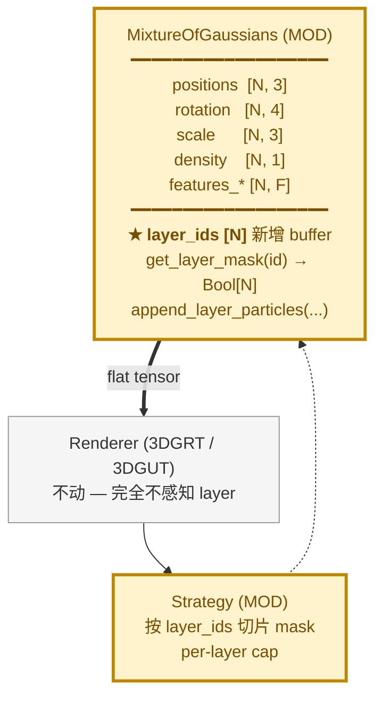

# 3DGRUT v2 备选方案 — 单 MixtureOfGaussians + layer_ids buffer

> **状态**：备选（NOT currently adopted）。当前 v2 已采纳 `LayeredGaussians` 容器路线，详见 [v2_architecture.md](v2_architecture.md) 与 [v2_plan.md](v2_plan.md)。
> **本文档作用**：当容器路线遇到不可克服阻塞时，可整体切换到本备选方案。仅作 reference，不参与主线开发。

---

## 1. 设计要点

不引入新 `LayeredGaussians` 容器，而是在现有 `MixtureOfGaussians` 内加一个辅助 buffer：

```python
class MixtureOfGaussians(nn.Module):
    def __init__(...):
        ...
        # 单一新增字段，per-particle layer 归属
        self.register_buffer(
            "layer_ids",
            torch.zeros(0, dtype=torch.int32),  # 初始空
        )
```

- 所有 per-particle 张量（positions/scale/density/rotation/SH）保持 `[N, ...]` flat tensor，不分组。
- Layer 概念**只在 strategy 和 loss 计算时被消费**，渲染时完全无感。
- 兼容 v1 ckpt：缺 `layer_ids` 字段时默认全 0（视为 background 层）。

---

## 2. 模块图



---

## 3. 与当前主线方案对比

| 维度 | 当前主线 (LayeredGaussians 容器) | 本备选 (layer_ids buffer) |
|---|---|---|
| 模型类层级 | `LayeredGaussians ⊃ ModuleDict[name → MoG]` | 单 `MixtureOfGaussians` + 1 个 IntTensor buffer |
| 渲染前的合并 | 显式 `fused_view(frame_id)` concat 各层 tensor | 不需要合并（本来就是 flat） |
| 每层不同 LR / scheduler | 自然支持（每个 MoG 有自己的 optimizer 参数组） | 较繁琐（需在单 optimizer 中按 layer_ids 切 param group） |
| Dynamic per-frame pose | 在 `fused_view` 内 transform，干净分层 | 需要每 step 临时改写 `positions[layer_ids==2]`，污染全局 tensor |
| MCMC scoping | `get_layer_mask(name)` clean | `layer_ids == id` 切片，同样可行 |
| Checkpoint schema | 与 NRE 对齐 `gaussians_nodes.<name>` | flat ckpt + 多一个 `layer_ids` 字段 |
| v1 ckpt 兼容 | 容器侧自动 route 到 "background" | 缺字段时 `layer_ids = zeros(N)` |
| 实现复杂度 | 中（容器 + bridge 逻辑） | 低（buffer + mask 切片） |
| 改 renderer 接口 | 不动 | 不动 |
| 单元测试粒度 | 容器级 + 各层级 | 全在 MoG 上 |

---

## 4. 切回本方案的触发条件（任一）

1. **LayeredGaussians 多层 fused_view 性能不可接受**：concat 在 H100/A800 上每 step 耗时 > 5 ms（粒子数 1M 量级）。
2. **NRE ckpt schema 不再要求** `gaussians_nodes.<name>`，整体回到 flat ckpt。
3. **bg/road/dyn 三层间需要密集 cross-layer 操作**（如跨层粒子合并 / 共享 KNN），容器边界反而成累赘。
4. **Trainer 端集成代码膨胀超出预期**（bridge 逻辑 + per-layer optimizer + per-frame pose 三件加起来超过 1000 行）。

> 实际触发前先做 spike：在 PR 分支单独评估迁移成本（预计 1-1.5 天，因为 strategy / dataset / loss 改动**与方案无关**，主要是模型类抽象切换）。

---

## 5. 本方案下的关键代码片段（参考）

### 5.1 `MixtureOfGaussians` 新增方法

```python
def get_layer_mask(self, layer_id: int) -> torch.BoolTensor:
    return self.layer_ids == layer_id

def append_layer_particles(
    self,
    layer_id: int,
    positions, rotation, scale, density,
    features_albedo, features_specular,
):
    """追加一层粒子。所有 tensor 在 layer 内部已初始化好。"""
    N_new = positions.shape[0]
    self.positions = nn.Parameter(torch.cat([self.positions, positions]))
    self.rotation  = nn.Parameter(torch.cat([self.rotation,  rotation]))
    self.scale     = nn.Parameter(torch.cat([self.scale,     scale]))
    self.density   = nn.Parameter(torch.cat([self.density,   density]))
    self.features_albedo   = nn.Parameter(torch.cat([self.features_albedo,   features_albedo]))
    self.features_specular = nn.Parameter(torch.cat([self.features_specular, features_specular]))
    self.layer_ids = torch.cat([
        self.layer_ids,
        torch.full((N_new,), layer_id, dtype=torch.int32, device=positions.device),
    ])

def save_checkpoint(self, path):
    state = super().save_checkpoint(path)
    state["layer_ids"] = self.layer_ids.cpu()
    return state

def load_checkpoint(self, path):
    state = super().load_checkpoint(path)
    if "layer_ids" in state:
        self.layer_ids = state["layer_ids"].to(self.device)
    else:
        # v1 兼容：全部 layer 0
        self.layer_ids = torch.zeros(
            self.positions.shape[0], dtype=torch.int32, device=self.device,
        )
```

### 5.2 LayeredMCMC（共用主线方案的 layered_mcmc.py，仅 `_select_indices` 切换）

```python
class LayeredMCMCStrategy(MCMCStrategy):
    def _select_indices(self, model):
        # 本方案：单 MoG + layer_ids buffer
        return model.layer_ids == self._current_layer_id
```

### 5.3 Dynamic pose 应用（trainer step 内）

```python
def train_step(self, batch):
    cur_frame = batch.frame_idx
    positions = self.model.positions.clone()       # 临时
    dyn_mask = self.model.get_layer_mask(layer_id=2)
    if dyn_mask.any():
        local_pts = positions[dyn_mask]
        positions[dyn_mask] = self._apply_track_poses(local_pts, cur_frame)
    # 注入临时 world position
    self.model._cached_world_positions = positions
    rgb_pred, alpha = self.model.forward(batch)
    ...
```

`MixtureOfGaussians.forward` 改为优先使用 `_cached_world_positions`（若存在），训练后清理。

---

## 6. 缺点（为什么主线没选）

1. **耦合**：把"层"概念植入到模型核心张量，model 不再纯净，未来加 deformable / SMPL 时 forward 路径分支会膨胀。
2. **Dynamic pose 污染**：每 step 改写 `positions` 是 in-place 操作，与 PyTorch optimizer state / autograd 交互复杂，调试成本高。
3. **NRE schema 不对齐**：NRE / Omniverse 期望的 ckpt 是 `gaussians_nodes.<name>` 嵌套，flat schema 需要在导出时再做一次转换。
4. **Per-layer 不同 LR 困难**：v2 路面层 `scale_lr_mult=0.2`、动态层正常，buffer 方案要把 param_group 按 `layer_ids` 切，但 layer_ids 随 add/relocate 变化，param_group 难以稳定维护。

---

> 文档结束。如未来需要启用此方案：
> 1. 从 main 切 branch `v2-alt-layer-ids`；
> 2. 把 `LayeredGaussians` 删掉，按本文档代码片段实现；
> 3. Strategy / dataset / loss 代码 **完全复用**主线 plan 的 T2.x / T3.x / T4.x（这些任务与模型抽象解耦）；
> 4. ckpt 迁移工具：写一个一次性 script 把 `gaussians_nodes.<name>` 拼回 flat + 生成 `layer_ids`。
