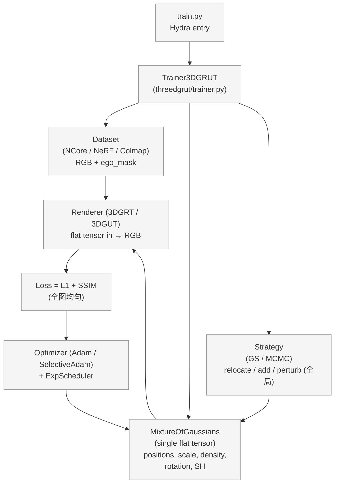
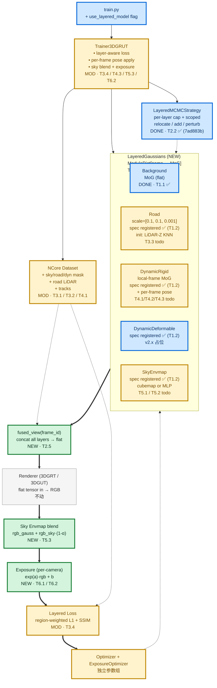
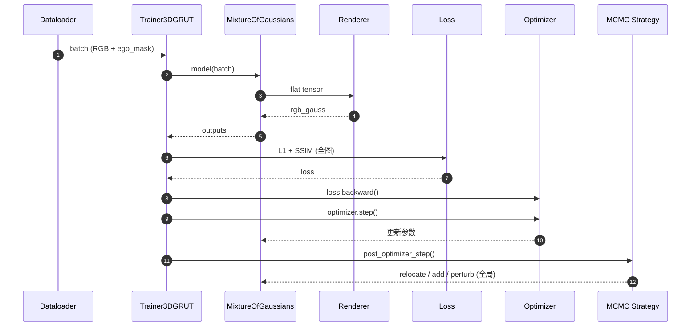
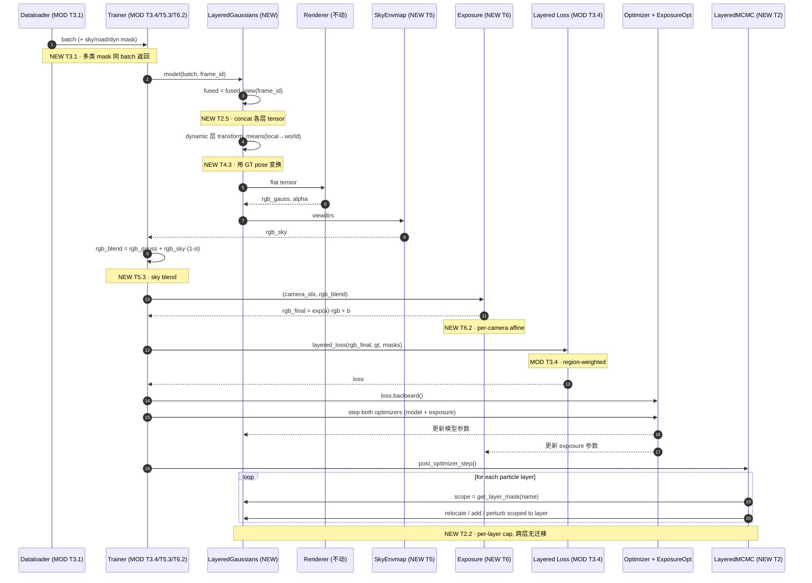
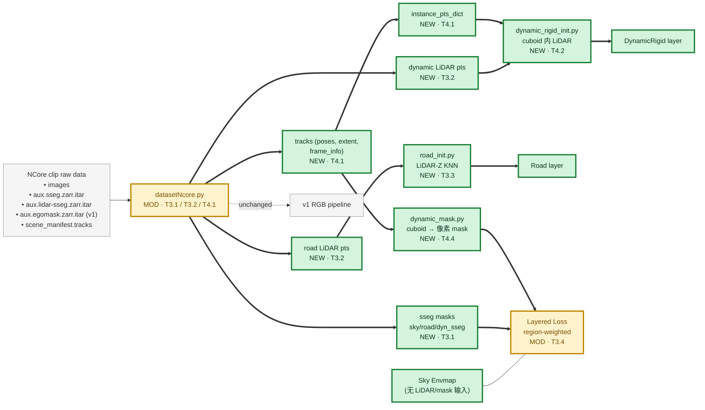
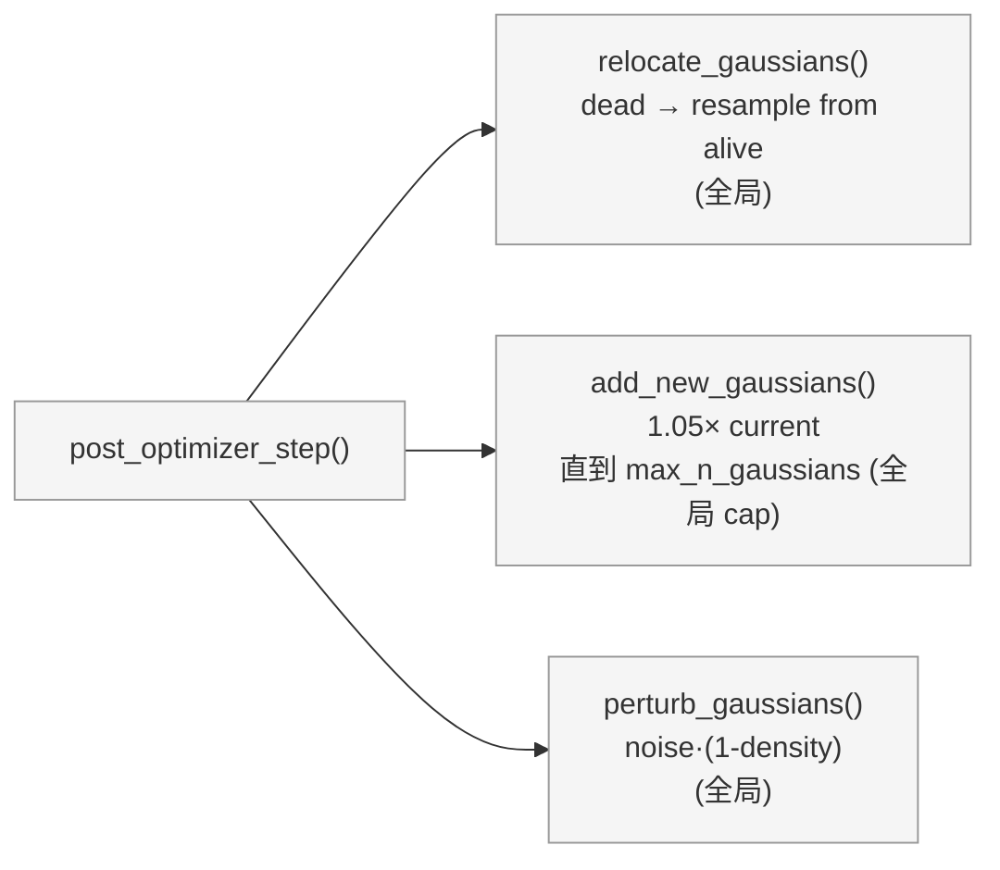
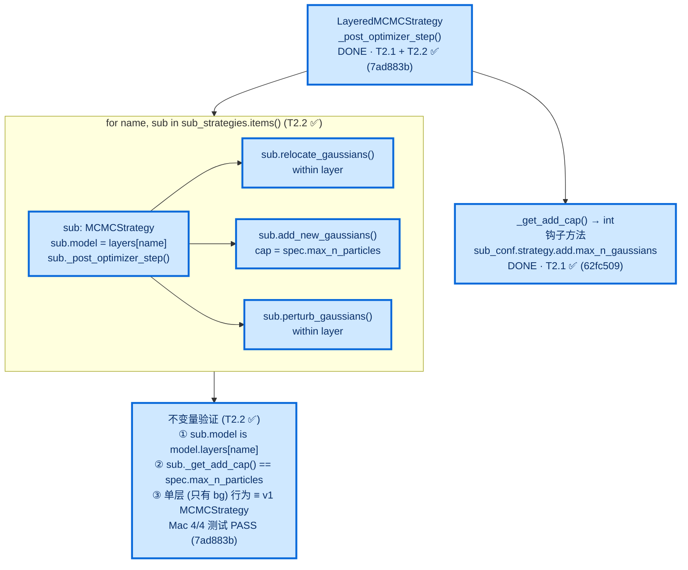
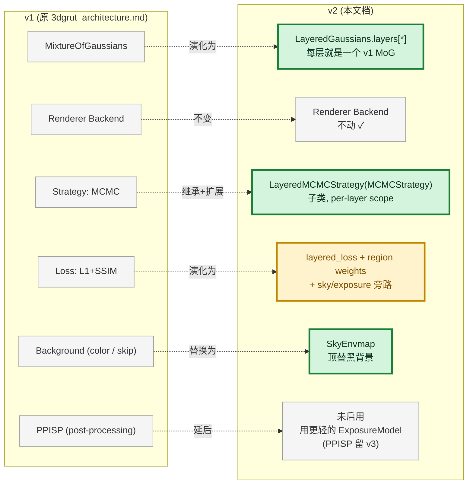

# 3DGRUT v2 架构图（分层高斯）

> **目标**：在 3DGRUT 基础上引入 NuRec 风格的分层场景表征（Background / DynamicRigid / DynamicDeformable / Sky envmap），并加上层感知 MCMC、每相机色彩校正。
> **本文档作用**：把"v2 在 v1 之上加/改了什么"用 Mermaid 图直观呈现，**每个高亮模块/流程差异 都挂一个任务 ID（Tx.y）**，与 [v2_plan.md](v2_plan.md) 的看板一一对应。

---

## 0. 图例

所有 Mermaid 图统一使用以下 classDef 高亮：

| 样式 | 含义 |
|---|---|
| 灰底 | v1 已有，v2 不动 |
| 绿底加粗 | v2 新增模块（NEW） |
| 黄底加粗 | v2 修改现有模块（MOD） |
| 蓝底加粗 | v2 已完成（DONE，已 land 到 main） |

线型：
- 实线 `-->` v1 已有数据流（保留）
- 粗实线 `==>` v2 新增数据流
- 虚线 `-.->` v2 修改后的数据流

---

## 1. 模块层架构对比（v1 vs v2）

### 1.1 v1 架构（当前 main）

### 1.2 v2 架构（目标）

### 1.3 模块级 diff 摘要

| 模块 | v1 状态 | v2 状态 | 任务 | 文件 |
|---|---|---|---|---|
| `train.py` | unchanged | 加 `use_layered_model` 分支 | T1.5 ✅ | `train.py` |
| `Trainer3DGRUT` | 单 MoG | 支持 LayeredGaussians + 多 head；`init_model` 读 `conf.layers.enabled` 经 registry 构造 specs | T1.2 ✅ / T1.5 ✅ / T3.4 / T4.3 / T5.3 / T6.2 | `threedgrut/trainer.py` |
| `MixtureOfGaussians` | 全场景表征 | **不动**，被 LayeredGaussians 内嵌 | — | `threedgrut/model/model.py` |
| **LayeredGaussians** | — | **新增 容器，ModuleDict 持每层 MoG** | T1.1 ✅ T1.5 ✅ T2.5 | `threedgrut/layers/layered_model.py` |
| **LayerSpec / registry** | — | **新增 描述层属性 + 5 标准层注册表** | T1.2 ✅ | `layer_spec.py` (8 字段), `registry.py` (STANDARD_LAYERS + specs_from_config) |
| **road_init.py** | — | **新增 LiDAR-Z KNN 路面 init** | T3.3 | `threedgrut/layers/road_init.py` |
| **dynamic_rigid_init.py** | — | **新增 cuboid 内 LiDAR 抽取** | T4.2 | `threedgrut/layers/dynamic_rigid_init.py` |
| **dynamic_mask.py** | — | **新增 cuboid → 像素 mask 投影** | T4.4 | `threedgrut/layers/dynamic_mask.py` |
| `MCMCStrategy` | 全局 relocate/add | 抽基类 `_get_add_cap()` 钩子 ✅ (62fc509) | T2.1 ✅ | `threedgrut/strategy/mcmc.py` |
| **LayeredMCMCStrategy** | — | **新增 sub-strategy 数组，per-layer cap；实际采用 sub-strategy 数组方案（非原计划的 _select_indices 继承方案），更轻量 ✅ (7ad883b)** | T2.2 ✅ / T2.3 ✅ | `threedgrut/strategy/layered_mcmc.py` |
| **SkyEnvmap** | — | **新增 cubemap (nvdiffrast) 或 MLP** | T5.1 / T5.2 | `threedgrut/correction/sky_envmap.py` |
| **ExposureModel** | — | **新增 per-camera affine** | T6.1 | `threedgrut/correction/exposure.py` |
| `datasetNcore.py` | RGB + ego_mask | 加 sky/road/dyn mask + road LiDAR + tracks | T3.1 / T3.2 / T4.1 | `threedgrut/datasets/datasetNcore.py` |
| `Renderer` (3DGRT/3DGUT) | flat tensor in | **不动**（tracer 层不感知 layer） | — | `threedgrt_tracer/` / `threedgut_tracer/` |
| `scene_manifest schema` | v1 | 加可选 `layer_assignments` | T7.5 | `schemas/scene_manifest.schema.json` |

> ✅ = 已完成（commit 5a6a5f9）；其余 ⬜ = 待办。

---

## 2. 训练流程对比（v1 vs v2）

### 2.1 v1 训练 step（19 步）

### 2.2 v2 训练 step（高亮新增 / 修改）

### 2.3 流程差异 → 任务映射

| 流程节点 | v1 | v2 | 任务 |
|---|---|---|---|
| Dataloader 输出 | RGB + ego_mask | + sky/road/dyn mask + road_lidar + tracks | **T3.1 / T3.2 / T4.1** |
| 模型 forward | 单 MoG flat | LayeredGaussians.fused_view(frame_id) | **T1.5 ✅** (单 bg 桥)；**T2.5** (多层 fused) |
| Dynamic pose | n/a | per-frame transform_means local→world | **T4.3** |
| 渲染后处理 | 直接 RGB | + sky envmap blend | **T5.3** |
| 色彩校正 | n/a | per-camera affine | **T6.2** |
| Loss | 全图均匀 | region-weighted | **T3.4** |
| Dynamic mask | n/a | cuboid 投影到像素平面 | **T4.4** |
| MCMC 致密化 | 全局 cap | per-layer cap + 跨层无迁移 | **T2.1 ✅ / T2.2 ✅ / T2.3 ✅** |
| Optimizer | 单 Adam | + 独立 exposure optimizer | **T6.2** |

---

## 3. 数据流：层路由（drivestudio 风格）

> 参考 `drivestudio/architecture.md` 第 3 节"scene 和 instance 路由"。NCore v4 的 sseg / lidar-sseg / tracks 三源数据按下图分发到各 Gaussian 层。

---

## 4. LayeredGaussians 内部结构（NVIDIA NuRec 命名）

```mermaid
flowchart TB
    LG["LayeredGaussians<br/>threedgrut/layers/layered_model.py"]:::new

    Specs["specs: list[LayerSpec]<br/>registry-driven<br/>T1.2"]:::new

    %% layers
    BG["background : MoG<br/>positions (world)<br/>scale_prior [0.1,0.1,0.1]<br/>兼容 v1 ckpt 透传<br/>DONE · T1.1 ✅"]:::done
    Road["road : MoG<br/>positions (world, Z 锁定)<br/>scale_prior [0.1,0.1,0.001]<br/>scale_lr_mult 0.2<br/>mask_field='road_mask'<br/>NEW · T1.2 + T3.3"]:::new
    DynR["dynamic_rigids : MoG<br/>positions (object-local)<br/>scale_prior [0.05,0.05,0.05]<br/>mask_field='dynamic_mask'<br/>track_id per-particle buffer<br/>per-frame pose 运行时变换<br/>NEW · T1.2 + T4.2 + T4.3"]:::new
    DynD["dynamic_deformables<br/>registered, v2.x 占位<br/>is_particle_layer=False"]:::existing
    SkyL["sky_envmap : SkyEnvmap<br/>is_particle_layer=False<br/>cubemap [6,512,512,3] 或 MLP<br/>forward(viewdirs) → rgb<br/>NEW · T5.1 / T5.2"]:::new

    Fused["fused_view(frame_id, train)<br/>→ flat tensors<br/>concat across particle layers<br/>dynamic 层先 transform_means<br/>T1.5 ✅(单层) · T2.5(多层)"]:::new

    LayerMask["get_layer_mask(name)<br/>→ Bool[N_total]<br/>供 LayeredMCMCStrategy<br/>T2.2"]:::new

    Ckpt["checkpoint I/O<br/>NRE schema 对齐<br/>ckpt.model.gaussians_nodes.&lt;name&gt;<br/>3 种输入：NRE wrap / 解开 / v1 flat<br/>DONE · T1.1 ✅"]:::done

    LG --> Specs
    LG --> BG
    LG --> Road
    LG --> DynR
    LG --> DynD
    LG --> SkyL
    LG ==> Fused
    LG ==> LayerMask
    LG ==> Ckpt

    classDef existing fill:#f5f5f5,stroke:#999,color:#333
    classDef new      fill:#d4f4dd,stroke:#1a7f37,stroke-width:3px,color:#0d3320
    classDef done     fill:#cfe8ff,stroke:#0969da,stroke-width:3px,color:#0a3069
```

---

## 5. MCMC 致密化对比

### 5.1 v1 全局 MCMC

### 5.2 v2 Layered MCMC（T2.1 / T2.2 / T2.3）

> **实际实现备注（T2.2）**：原计划采用"继承 MCMCStrategy 并 override `_select_indices` / `get_layer_mask`"的方案；**实际采用 sub-strategy 数组方案**：`LayeredMCMCStrategy` 持有 `sub_strategies: dict[str, MCMCStrategy]`，每个 is_particle_layer=True 的层各一个独立 `MCMCStrategy` 实例，`sub.model` 直接指向 `LayeredGaussians.layers[name]`（真实 MoG，非 wrapper）。`_post_optimizer_step` 串行遍历 subs，_get_add_cap 由 sub_conf 中的 `max_n_gaussians` 覆写实现。此方案更轻量：不需要在操作内部切换 layer 上下文，零跨层迁移自然保证，单 bg 模式 byte-identical with v1。

---

## 6. 模块新增/修改 文件清单（与任务一一对应）

### 6.1 新建文件

| 文件 | 任务 |
|---|---|
| `threedgrut/layers/__init__.py` | T1.1 ✅ / T1.2 ✅ (导出 LayerSpec/registry，lazy-import LayeredGaussians) |
| `threedgrut/layers/layered_model.py` | T1.1 ✅ / T1.3 ✅ (错误消息) / T2.5 |
| `threedgrut/layers/layer_spec.py` | T1.1 ✅ / T1.2 ✅ (8 字段) |
| `threedgrut/layers/registry.py` | T1.2 ✅ |
| `threedgrut/layers/road_init.py` | T3.3 |
| `threedgrut/layers/dynamic_rigid_init.py` | T4.2 |
| `threedgrut/layers/dynamic_mask.py` | T4.4 |
| `threedgrut/strategy/layered_mcmc.py` | T2.2 ✅ (7ad883b) |
| `threedgrut/correction/__init__.py` | T5.2 / T6.1 |
| `threedgrut/correction/sky_envmap.py` | T5.2 |
| `threedgrut/correction/exposure.py` | T6.1 |
| `configs/strategy/layered_mcmc.yaml` | T2.3 ✅ (1a0d275) — Hydra `defaults:[mcmc,_self_]` 继承，仅改 method |
| `configs/apps/ncore_3dgut_mcmc_v2_full.yaml` | T7.1 |
| `threedgrut/tests/test_layered_gaussians.py` | T1.1 ✅ / T1.4 ✅ (+3 contract test) |
| `threedgrut/tests/test_layer_spec_registry.py` | T1.4 ✅ (新建，9 测试，Mac 本地可跑无 torch 依赖) |
| `threedgrut/tests/test_layered_mcmc.py` | T2.1 ✅ (62fc509) · T2.2 ✅ (7ad883b, 4 tests) · T2.3 ✅ (1a0d275, 5 tests) · T2.4 (remaining) |
| `threedgrut/tests/test_road_init.py` | T3.5 |
| `threedgrut/tests/test_dynamic_rigid_init.py` | T4.5 |
| `threedgrut/tests/test_sky_envmap.py` | T5.4 |
| `threedgrut/tests/test_exposure.py` | T6.3 |
| `WP_V2_Report.md` | T7.5 |

### 6.2 修改文件

| 文件 | 改动点 | 任务 |
|---|---|---|
| `train.py` | use_layered_model 分支 | T1.5 ✅ |
| `threedgrut/trainer.py` | `init_model` 改读 `conf.layers.enabled`（T1.2 ✅）；`init_densification_and_pruning_strategy` 加 `LayeredMCMCStrategy` case（T2.2 ✅）；T2.3 ✅ 去除重复 `specs_from_config` 调用，改用 `self.model.specs`；后续：layered loss / sky blend / exposure / per-frame pose | T1.2 ✅ / T1.5 ✅ / T2.2 ✅ / T2.3 ✅ / T3.4 / T4.3 / T5.3 / T6.2 |
| `configs/base_gs.yaml` | 加 `use_layered_model: false` + `layers.enabled: [background]` 默认 | T1.2 ✅ |
| `threedgrut/strategy/mcmc.py` | 抽 `_get_add_cap()` 钩子 ✅ (62fc509) | T2.1 ✅ |
| `threedgrut/datasets/datasetNcore.py` | aux mask + road_lidar + tracks | T3.1 / T3.2 / T4.1 |
| `schemas/scene_manifest.schema.json` | layer_assignments 字段 | T7.5 |

### 6.3 复用外部代码（不修改源头，借代码或思想）

| 来源 | 用法 | 任务 |
|---|---|---|
| `drivestudio/models/modules.py:174-205` (EnvLight) | 直接复制 → `correction/sky_envmap.py` | T5.2 |
| `drivestudio/models/nodes/rigid.py:315-362` (transform_means) | 模式参考，重写 | T4.3 |
| `drivestudio/datasets/driving_dataset.py:263-396` (get_init_objects) | schema 参考，重写 NCore 版 | T4.1 |
| Reconstruction-Studio `models/luxury/exposure.py` (29 行) | 直接复制 → `correction/exposure.py` | T6.1 |
| Reconstruction-Studio `models/gaussians/surface.py` (863 行) | 仅借 LiDAR-Z KNN init 思路（不引入 2DGS / PyTorch3D） | T3.3 |

---

## 7. 关键不变量（验收锚点）

| 不变量 | 任务挂点 | 验证手段 |
|---|---|---|
| 单 bg 层时 LayeredGaussians 行为 ≡ v1 MoG（byte-identical resume） | T1.1 ✅ | 已在 commit 5a6a5f9 验证（PSNR 24.123 dB ≡ v1 24.123 dB） |
| LayerSpec 是 frozen 不可变 | T1.2 ✅ | `test_layer_spec_frozen_immutable`（commit 60e1154） |
| `STANDARD_LAYERS` 5 层 + layer_id 唯一 | T1.2 ✅ | `test_registry_*`（commit 569819b，4 测试） |
| v1 ckpt resume 错误消息引导用户到 `layers.enabled` | T1.3 ✅ | `test_v1_ckpt_resume_without_background_layer_raises`（commit ff83028，A800 跑） |
| 多层 ckpt save→load 字节一致 | T1.4 ✅ | `test_multi_layer_ckpt_roundtrip`（commit ff83028，A800 跑） |
| `MCMCStrategy._get_add_cap()` 默认等于 conf 值 | T2.1 ✅ | `test_mcmc_get_add_cap_defaults_to_conf` (Mac, 62fc509) |
| LayeredMCMC sub_strategies 仅含粒子层 | T2.2 ✅ | `test_layered_mcmc_holds_sub_strategy_per_particle_layer` (Mac, 7ad883b) |
| LayeredMCMC 每层 cap = spec.max_n_particles | T2.2 ✅ | `test_layered_mcmc_sub_uses_per_layer_cap` (Mac, 7ad883b) |
| LayeredMCMC 单层时 ≡ v1 MCMCStrategy (sub.model is layer MoG) | T2.2 ✅ | `test_layered_mcmc_single_bg_equivalent_to_v1` (Mac, 7ad883b) |
| 训练全程无跨层迁移 | T2.4 | relocate 1000 步后所有粒子的 layer 归属不变 |
| 路面层 Z scale 不漂移 | T3.5 | 1000 步后 `scales.exp()[:, 2].max() < 0.005` |
| Dynamic 粒子随 GT pose 正确移动 | T4.5 | mock 单 track，frame 0/N-1 两端 world 位置匹配 |
| Renderer 接口零变更 | 所有 stage | tracer Python binding 签名 git diff = ∅ |

---

## 8. 与原 3DGRUT 架构图的对应

> 参考 `3dgrut_architecture.md` 第 13 节 ASCII 图。v2 在三个层次上扩展：

---

> 文档结束。下一步：见 [v2_plan.md](v2_plan.md) 看板与任务详解；备选架构见 [v2_alternative.md](v2_alternative.md)。
