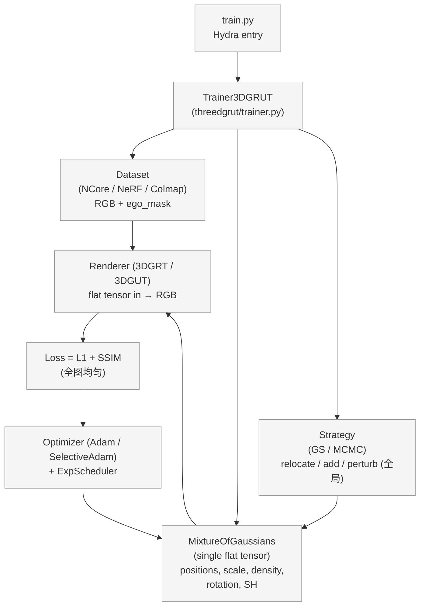
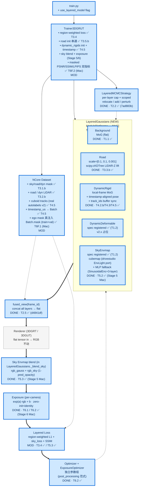
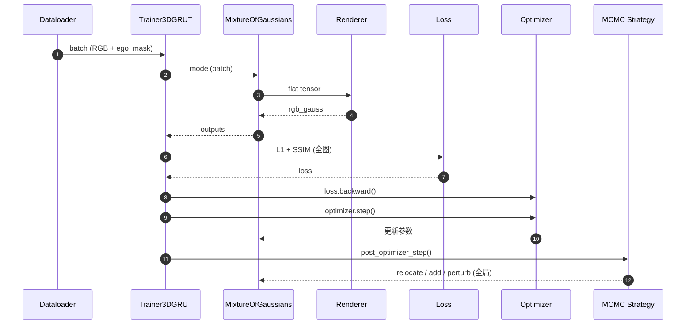
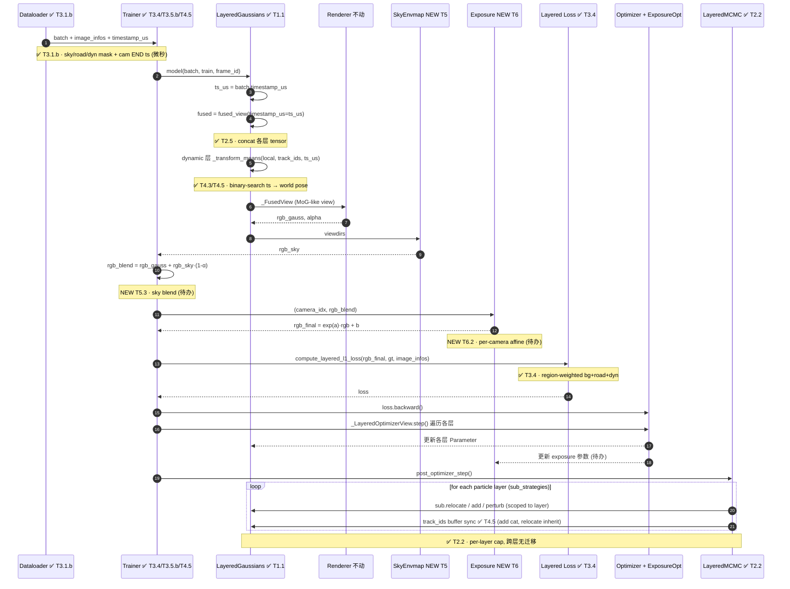
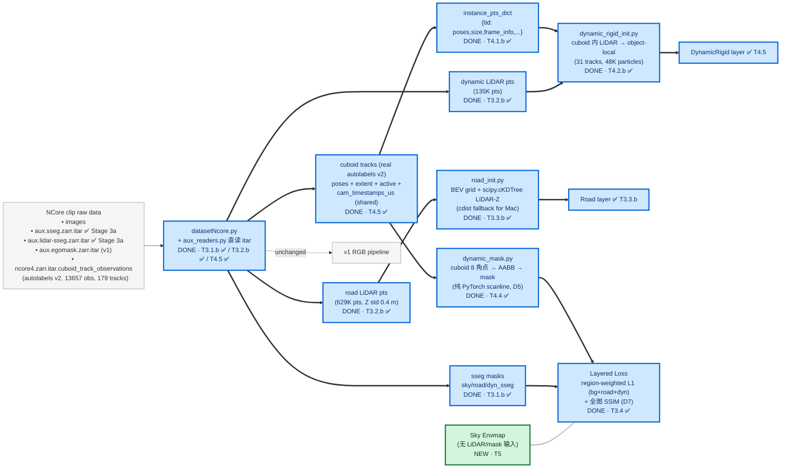
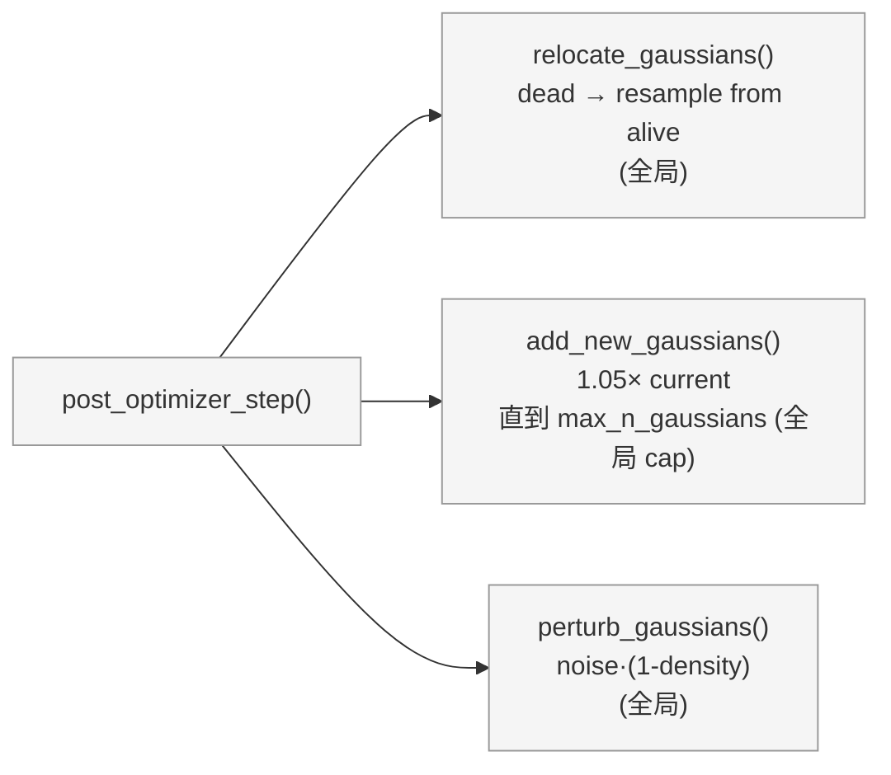
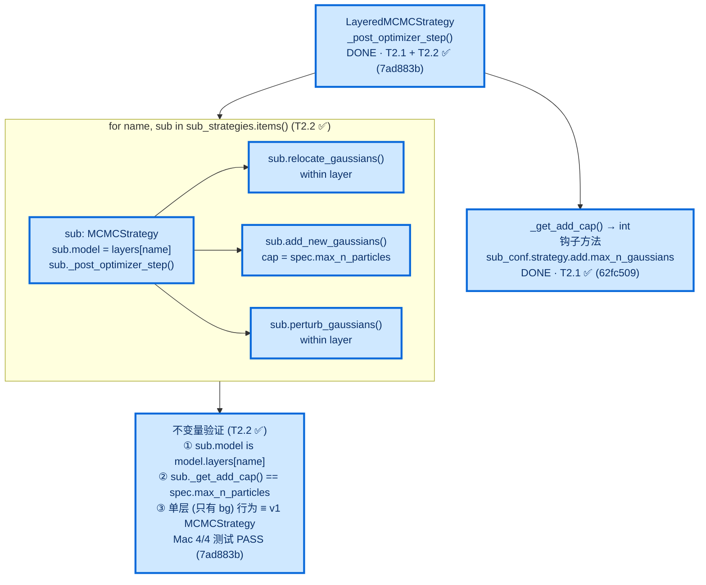
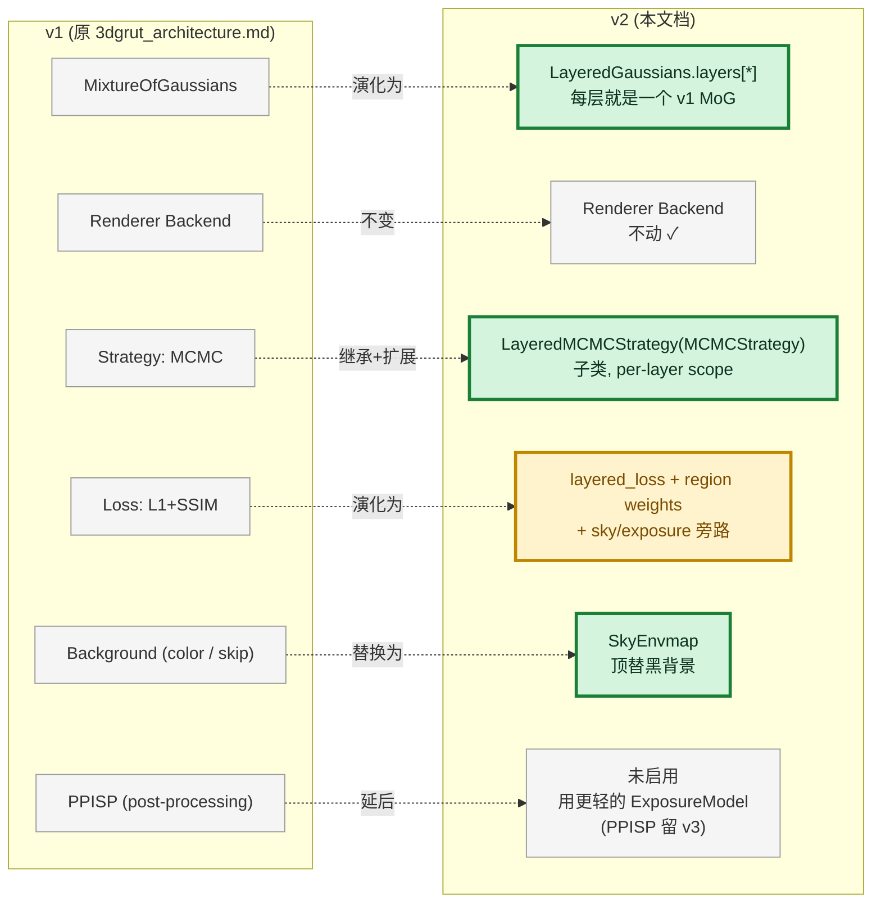

# 3DGRUT v2 架构图（分层高斯）

> **目标**：在 3DGRUT 基础上引入 NuRec 风格的分层场景表征（Background / DynamicRigid / DynamicDeformable / Sky envmap），并加上层感知 MCMC、每相机色彩校正。
> **本文档作用**：把"v2 在 v1 之上加/改了什么"用 Mermaid 图直观呈现，**每个高亮模块/流程差异 都挂一个任务 ID（Tx.y）**，与 [v2_plan.md](v2_plan.md) 的看板一一对应。

---

## 0. 图例

所有 Mermaid 图统一使用以下 classDef 高亮：

| 样式 | 含义 |
|---|---|
| 灰底 | v1 已有，v2 不动 |
| 绿底加粗 | v2 新增模块（NEW） |
| 黄底加粗 | v2 修改现有模块（MOD） |
| 蓝底加粗 | v2 已完成（DONE，已 land 到 main） |

线型：
- 实线 `-->` v1 已有数据流（保留）
- 粗实线 `==>` v2 新增数据流
- 虚线 `-.->` v2 修改后的数据流

---

## 1. 模块层架构对比（v1 vs v2）

### 1.1 v1 架构（当前 main）

### 1.2 v2 架构（目标）

### 1.3 模块级 diff 摘要

| 模块 | v1 状态 | v2 状态 | 任务 | 文件 |
|---|---|---|---|---|
| `train.py` | unchanged | 加 `use_layered_model` 分支 | T1.5 ✅ | `train.py` |
| `Trainer3DGRUT` | 单 MoG | 支持 LayeredGaussians + 多 head + multi-layer init dispatcher (case "lidar" 分支 bg/road/dynamic_rigids 各 init)；`get_losses` region-weighted L1 + perturb mask；timestamp_us → forward；**`compute_metrics` 输出 psnr/ssim/lpips full + masked 双指标 (T6F.2 ✅ Mac，mask=None 时 byte-identical 回归)** | T1.2 ✅ / T1.5 ✅ / T3.4 ✅ / T3.5.b ✅ / T4.3 ✅ / T4.5 ✅ / T5.3 / T6.2 / T6F.2 ✅ | `threedgrut/trainer.py` |
| `MixtureOfGaussians` | 全场景表征 | **不动**，被 LayeredGaussians 内嵌 | — | `threedgrut/model/model.py` |
| **LayeredGaussians** | — | **新增 容器，ModuleDict 持每层 MoG；fused_view + get_layer_mask 接口实现；T3.0 init_layer_from_points + optimizer property；T8.14 `enabled_layer_names: Set[str]` 运行时层开关；T8.15 `_rotmat_to_quat_wxyz` (Shepperd) + `_quat_multiply_wxyz` + `_transform_means_and_active(rotations_local)` 返回 (positions_world, active_mask, rotations_world=q_pose⊗q_local) 三元组；fused_view 复合 per-track pose 旋转到 per-particle rotation + inactive 帧 density=-50 抑制 + free-camera per-track first-active fallback；`get_model_parameters`/`init_from_checkpoint` 序列化 `track_ids` buffer 跨 ckpt roundtrip** | T1.1 ✅ T1.5 ✅ T2.5 ✅ T3.0 ✅ T8.14 ✅ T8.15 ✅ | `threedgrut/layers/layered_model.py` |
| **bg_cuboid_loss** | — | **T8.15: bg 层 3D opacity penalty + `clamp_layer_positions_to_cuboids` (dyn 层位置硬约束) + `collect_active_cuboids_for_frame` + `lambda_schedule` warmup + `particles_inside_any_cuboid_mask`** | T8.15 ✅ | `threedgrut/model/bg_cuboid_loss.py` |
| **class_psnr** | — | **T8.15: per-cuboid PSNR metric，trainer.compute_metrics + render.py eval loop 双路径接入；输出 metrics.json `mean_class_psnr` + per-class breakdown** | T8.15 ✅ | `threedgrut/model/class_psnr.py` |
| **LayerSpec / registry** | — | **新增 描述层属性 + 5 标准层注册表** | T1.2 ✅ | `layer_spec.py` (8 字段), `registry.py` (STANDARD_LAYERS + specs_from_config) |
| **road_init.py** | — | **新增 LiDAR-Z KNN 路面 init** | T3.3.a/b ✅ | `threedgrut/layers/road_init.py` |
| **dynamic_rigid_init.py** | — | **新增 cuboid 内 LiDAR 抽取** | T4.2 ✅ | `threedgrut/layers/dynamic_rigid_init.py` |
| **dynamic_mask.py** | — | **新增 cuboid → 像素 mask 投影（纯 PyTorch scanline AABB, D5）；T8.15 加 ftheta_params 分支 + `_normalize_ftheta_params` + `_horner_ascending_torch` + `_corners_to_pixels_ftheta`，训练侧 cuboid mask 自动跟 FTheta 投影对齐** | T4.4 ✅ T8.15 ✅ | `threedgrut/layers/dynamic_mask.py` |
| **tracks_loader (T8.15)** | identity rot only | **T8.15: `euler_xyz_to_rotation_matrix` pure-numpy (vs scipy bit-match) + L237-245 写入完整 SE(3) 含 bbox.rot extrinsic xyz Euler；之前 pose[:3,:3] = I 丢车辆 yaw → MCMC 用 6m 巨型 scale 补偿（已在 fused_view 旋转复合后修对）** | T4.5 ✅ T8.15 ✅ | `threedgrut/datasets/tracks_loader.py` |
| **tracks_loader.py** | — | **新增 scene_manifest tracks → instance_pts_dict (T4.1.b)** | T4.1 ✅ | `threedgrut/datasets/tracks_loader.py` |
| **layered_loss.py** | — | **新增 region-weighted L1 纯函数 (T3.4)** | T3.4 ✅ | `threedgrut/model/layered_loss.py` |
| `MCMCStrategy` | 全局 relocate/add | 抽基类 `_get_add_cap()` 钩子 ✅ (62fc509) | T2.1 ✅ | `threedgrut/strategy/mcmc.py` |
| **LayeredMCMCStrategy** | — | **新增 sub-strategy 数组，per-layer cap；实际采用 sub-strategy 数组方案（非原计划的 _select_indices 继承方案），更轻量 ✅ (7ad883b / 04c9174)** | T2.2 ✅ / T2.3 ✅ / T2.4 ✅ | `threedgrut/strategy/layered_mcmc.py` |
| **SkyEnvmap** | — | **新增 SkyEnvmapBase + SkyEnvmapCubemap (nvdiffrast 6 面立方体贴图，移植自 drivestudio EnvLight) + SkyEnvmapMLP (SinusoidalEncoder + 3 层 MLP + sigmoid，无外部依赖)** | T5.2 ✅ (Stage 5 Mac) | `threedgrut/correction/__init__.py` · `threedgrut/correction/sky_envmap.py` |
| **ExposureModel** | — | **新增 per-camera affine `exp(a)*x + b`，零初始化 = identity** | T6.1 ✅ (Stage 6 Mac) | `threedgrut/correction/exposure.py` |
| `datasetNcore.py` | RGB + ego_mask | + load_aux_masks + aux_readers 直读 itar (sseg/lidar-sseg)；get_road/dynamic_lidar_points 按 class 过滤；__getitem__ 注入 timestamp_us (cam END) + region masks 到 batch；**train+val 真把 ego mask 注入 `batch_dict["valid"]` → `get_gpu_batch_with_intrinsics` 转 `Batch.mask` reshape [1,H,W,1] float32 (T6F.1 ✅ Mac，修复"加载了但没用"漏洞)** | T3.1.b ✅ / T3.2.b ✅ / T4.5 ✅ / T6F.1 ✅ | `threedgrut/datasets/datasetNcore.py` |
| **aux_readers.py** | — | **新增 SsegAuxReader / LidarSsegAuxReader 直读 zarr.itar (绕开 SDK version check)** | T3.1.b ✅ | `threedgrut/datasets/aux_readers.py` |
| **ncore_semantic.py** | — | **新增 SKY/ROAD/DYNAMIC class ID 常量 (Cityscapes palette)** | T3.1.a ✅ | `threedgrut/datasets/ncore_semantic.py` |
| `protocols.py::Batch` | rays + rgb + mask | + image_infos dict (sky/road/dyn masks GPU) + timestamp_us (cam END, 微秒 universal time); **Batch.mask 字段 v1 起就存在但 NCore 一直空填，Stage 6-fix 后由 NCore 真填充 (T6F.1 ✅ Mac)** | T3.1.b ✅ / T4.5 ✅ / T6F.1 ✅ | `threedgrut/datasets/protocols.py` |
| `tracks_loader.py::load_tracks_from_ncore_cuboids` | — | **新增 真 NCore cuboid autolabels v2 → instance_pts_dict（替代 mock JSON）** | T4.5 ✅ | `threedgrut/datasets/tracks_loader.py` |
| `mcmc.py` | add/relocate 不感知 buffer | + track_ids buffer sync (add 时 cat sampled，relocate 时 dead 继承 alive donor) | T4.5 ✅ | `threedgrut/strategy/mcmc.py` |
| `Renderer` (3DGRT/3DGUT) | flat tensor in | **不动**（tracer 层不感知 layer） | — | `threedgrt_tracer/` / `threedgut_tracer/` |
| `scene_manifest schema` | v1 | 加可选 `layer_assignments` | T7.5 | `schemas/scene_manifest.schema.json` |

> ✅ = 已完成（commit 5a6a5f9）；其余 ⬜ = 待办。

---

## 2. 训练流程对比（v1 vs v2）

### 2.1 v1 训练 step（19 步）

### 2.2 v2 训练 step（高亮新增 / 修改）

### 2.3 流程差异 → 任务映射

| 流程节点 | v1 | v2 | 任务 |
|---|---|---|---|
| Dataloader 输出 | RGB + ego_mask | + image_infos (sky/road/dyn mask) + timestamp_us + road_lidar + dyn_lidar | **T3.1.b ✅ / T3.2.b ✅ / T4.5 ✅** |
| 模型 forward | 单 MoG flat | LayeredGaussians.forward → fused_view(timestamp_us) → _FusedView → renderer | **T1.5 ✅** (单 bg 桥) / **T2.5 ✅** / **T3.5.a ✅** (多层 + _FusedView) |
| Dynamic pose | n/a | _transform_means(local, track_ids, timestamp_us) binary-search ts→pose | **T4.3 ✅ / T4.5 ✅** (real cuboids autolabels v2) |
| 渲染后处理 | 直接 RGB | + sky envmap blend | **T5.3** (待办) |
| 色彩校正 | n/a | per-camera affine | **T6.2** (待办) |
| Loss | 全图均匀 L1+SSIM | region-weighted L1 (bg+road+dyn 分区) + 全图 SSIM | **T3.4 ✅** |
| Dynamic mask | n/a | cuboid 8 角点 → AABB → mask scanline (纯 PyTorch) | **T4.4 ✅** |
| MCMC 致密化 | 全局 cap | per-layer cap + 跨层无迁移 + track_ids buffer sync | **T2.1 ✅ / T2.2 ✅ / T2.3 ✅ / T4.5 ✅** |
| Optimizer | 单 Adam | _LayeredOptimizerView 遍历各层 + 独立 exposure optimizer | **T3.0 ✅** (单/多层) / **T6.2** (exposure 待办) |

---

## 3. 数据流：层路由（drivestudio 风格）

> 参考 `drivestudio/architecture.md` 第 3 节"scene 和 instance 路由"。NCore v4 的 sseg / lidar-sseg / tracks 三源数据按下图分发到各 Gaussian 层。

---

## 4. LayeredGaussians 内部结构（NVIDIA NuRec 命名）

```mermaid
flowchart TB
    LG["LayeredGaussians<br/>threedgrut/layers/layered_model.py"]:::new

    Specs["specs: list[LayerSpec]<br/>registry-driven<br/>T1.2"]:::new

    %% layers
    BG["background : MoG<br/>positions world frame<br/>scale_prior [0.1,0.1,0.1]<br/>兼容 v1 ckpt 透传<br/>DONE · T1.1 ✅"]:::done
    Road["road : MoG<br/>positions world Z 锁定<br/>scale_prior [0.1,0.1,0.001]<br/>scale_lr_mult 已接线·默认 1.0（E3 旋钮）<br/>perturb_scale_mask 1,1,0 (D1)<br/>mask_field road_mask<br/>DONE · T1.2 + T3.3.b ✅"]:::done
    DynR["dynamic_rigids : MoG<br/>positions object-local frame<br/>scale_prior [0.05,0.05,0.05]<br/>mask_field dynamic_mask<br/>track_ids per-particle buffer<br/>(sync on MCMC add/relocate, T4.5)<br/>timestamp-aligned world transform<br/>DONE · T1.2+T4.2.b+T4.3+T4.5 ✅"]:::done
    DynD["dynamic_deformables<br/>registered, v2.x 占位<br/>is_particle_layer=False"]:::existing
    SkyL["sky_envmap : SkyEnvmap<br/>is_particle_layer=False<br/>cubemap [6,128,128,3] or MLP fallback<br/>forward(viewdirs) -> rgb_sky<br/>挂 ModuleDict; setup_optimizer 挂独立 Adam<br/>DONE · T5.2 + T5.3 ✅ (Stage 5 Mac)"]:::done

    Fused["fused_view(timestamp_us)<br/>concat all particle layers<br/>dyn 层先 _transform_means<br/>(binary-search ts to pose, T4.5)<br/>DONE · T2.5 ✅ + T4.5 ✅"]:::done

    LayerMask["get_layer_mask(name)<br/>Bool N_total<br/>供 LayeredMCMCStrategy<br/>T2.5 ✅"]:::done

    Ckpt["checkpoint I/O<br/>NRE schema 对齐<br/>ckpt.model.gaussians_nodes.NAME<br/>3 种输入: NRE wrap / 解开 / v1 flat<br/>DONE · T1.1 ✅"]:::done

    Tracks2["tracks_camera_timestamps_us (shared buffer)<br/>+ _track_pose_TID + _track_active_TID<br/>(populate_tracks)<br/>DONE · T4.5 ✅"]:::done
    OptView["_LayeredOptimizerView<br/>多层 step/zero_grad/param_groups 遍历<br/>(单 bg 透传 bg.optimizer)<br/>DONE · T3.0 ✅"]:::done
    InitAPI["init_layer_from_points(name, ...)<br/>spec-aware defaults + device sync<br/>DONE · T3.0 ✅"]:::done

    LG --> Specs
    LG --> BG
    LG --> Road
    LG --> DynR
    LG --> DynD
    LG --> SkyL
    LG ==> Fused
    LG ==> LayerMask
    LG ==> Ckpt
    LG ==> Tracks2
    LG ==> OptView
    LG ==> InitAPI

    classDef existing fill:#f5f5f5,stroke:#999,color:#333
    classDef new      fill:#d4f4dd,stroke:#1a7f37,stroke-width:3px,color:#0d3320
    classDef done     fill:#cfe8ff,stroke:#0969da,stroke-width:3px,color:#0a3069
```

---

## 5. MCMC 致密化对比

### 5.1 v1 全局 MCMC

### 5.2 v2 Layered MCMC（T2.1 / T2.2 / T2.3）

> **实际实现备注（T2.2）**：原计划采用"继承 MCMCStrategy 并 override `_select_indices` / `get_layer_mask`"的方案；**实际采用 sub-strategy 数组方案**：`LayeredMCMCStrategy` 持有 `sub_strategies: dict[str, MCMCStrategy]`，每个 is_particle_layer=True 的层各一个独立 `MCMCStrategy` 实例，`sub.model` 直接指向 `LayeredGaussians.layers[name]`（真实 MoG，非 wrapper）。`_post_optimizer_step` 串行遍历 subs，_get_add_cap 由 sub_conf 中的 `max_n_gaussians` 覆写实现。此方案更轻量：不需要在操作内部切换 layer 上下文，零跨层迁移自然保证，单 bg 模式 byte-identical with v1。

---

## 6. 模块新增/修改 文件清单（与任务一一对应）

### 6.1 新建文件

| 文件 | 任务 |
|---|---|
| `threedgrut/layers/__init__.py` | T1.1 ✅ / T1.2 ✅ (导出 LayerSpec/registry，lazy-import LayeredGaussians) |
| `threedgrut/layers/layered_model.py` | T1.1 ✅ / T1.3 ✅ (错误消息) / T2.5 ✅ (fused_view + get_layer_mask, d4841df) / T3.0 ✅ (init_layer_from_points + optimizer property + _LayeredOptimizerView) / **E3.3 ✅ (5adcc50/9097af9): fused_view road `features_albedo` ← BEV grid 双线性采样 + set_road_bev_grid（Parameter+Adam）+ ckpt `road_bev_state` save/load 持久化** |
| `threedgrut/layers/layer_spec.py` | T1.1 ✅ / T1.2 ✅ (8 字段) |
| `threedgrut/layers/registry.py` | T1.2 ✅ |
| `threedgrut/layers/road_init.py` | T3.3.b ✅ (9f6a54c, scipy.cKDTree + cdist fallback) |
| `threedgrut/layers/dynamic_rigid_init.py` | T4.2.b ✅ (b22a506) |
| `threedgrut/layers/dynamic_mask.py` | T4.4 ✅ (b22a506, 纯 PyTorch scanline AABB) |
| `threedgrut/strategy/layered_mcmc.py` | T2.2 ✅ (7ad883b) |
| `threedgrut/model/layered_loss.py` | T3.4 ✅ (9077fd6, region-weighted L1 纯函数) |
| `threedgrut/model/road_reg.py` | **V3-R1.2/1.3 ✅ (75ab6f9, clamp_layer_scales + compute_effective_rank_loss + compute_depth_tv_loss 纯函数)** —— road scale clamp（实测生效但 novel-view null）|
| `threedgrut/model/road_region.py` | **V3-R2 ✅ (7bf4992, build_road_height_field + query_ground_z + compute_bg_road_opacity_penalty)** —— bg-in-road opacity penalty，**首个真正有效改动**：5k A/B 路面 bg 粒子 −86%、road opacity +28% 反超主导、cc_psnr_masked +0.65 dB；镜像 bg_cuboid_loss.py。**E3.6 ✅ (1e6a1dd/8d21476): compute_on_road_mask 共享原语（penalty + bg-init 剔 road 复用）+ penalty z_ceil 全高度（空气区 bg）；5k takeover A/B bg −28% / road opacity p50 +62% / bg 替补 14%→10% / R10 不出洞** |
| `threedgrut/model/pose_anchor.py` | **P1.2 ✅ (2026-06-06, compute_pose_boundary_loss 首/末活跃帧锚 GT + compute_pose_prior_loss 全帧软 L2，旋转矩阵 Frobenius²，纯函数)** —— 修 track-pose 漂移；30k A/B fix 三者最优 class25.07/cc26.06（−0.61 未在本配方复现）|
| `threedgrut/model/track_albedo_fourier.py` | **P1.3b ✅ (2026-06-06, fourier_albedo_bias Σ f_i·cos(iπt/N_t) + upgrade_albedo_table ckpt 升降维，纯函数)** —— 4D-SH 时变 albedo；A/B k4 24.13 vs DC k1 24.20 **无增益**，default k1 关、gated 留未来 |
| `threedgrut/model/plane_warp.py` | **E1.1 ✅ (2026-06-12, ftheta_project_points + build_plane_warp + warp_image 纯函数)** —— 平面诱导 warp 伪 GT：novel 像素射线↔road 高度场定点求交→FTheta 投回原相机；novel lane 指标内核（render.py + eval_frames_dir 共用） |
| `threedgrut/model/bev_texture.py` | **E3.3 ✅ (2026-06-16, 5adcc50, build_bev_feature_grid + sample_bev_feature_bilinear 纯函数)** —— road BEV 平面纹理：road albedo 聚合成 [H,W,C] grid（网格对齐 build_road_height_field）+ 双线性可微采样；fused_view 注入替代 per-gaussian SH DC（策略1 Python 端零 kernel/ABI）；3k spike novel grad_corr@6m +20% / band_psnr +1.44dB，越远外推越占优 |
| `threedgrut/model/nta_iou.py` | **E1.2 ✅ (2026-06-12, project_track_to_2d_box + compute_frame_nta_iou)** —— GT cuboid→2D AABB best-match IoU；behind-camera 前置剔除 |
| `threedgrut/model/vehicle_detector.py` | **E1.2 ✅ (YOLOv8m 懒加载单例)** —— 唯一 ultralytics 耦合点，duck-typed 注入 |
| `scripts/dump_test_split_manifest.py` | **E0.4 ✅ (2026-06-12)** —— test split 位姿 manifest（NuRec 侧出帧对齐用） |
| `scripts/eval_frames_dir.py` | **E0.4 ✅ (2026-06-12)** —— render_all 去模型离线评测器：外部帧（nre render）喂项目侧全指标，同口径双向对照核心 |
| `threedgrut/datasets/ncore_semantic.py` | T3.1.a ✅ (e8cb490, Cityscapes palette 常量) |
| `threedgrut/datasets/aux_readers.py` | T3.1.b ✅ (5b49f4b, SsegAuxReader + LidarSsegAuxReader 直读 itar) |
| `threedgrut/datasets/tracks_loader.py` | T4.1.b ✅ (b22a506) + T4.5 ✅ (4807951, load_tracks_from_ncore_cuboids) |
| `threedgrut/correction/__init__.py` | T5.2 ✅ / T6.1 ✅ (Stage 5/6 Mac) |
| `threedgrut/correction/sky_envmap.py` | T5.2 ✅ (Stage 5 Mac, SkyEnvmapBase + SkyEnvmapMLP + SkyEnvmapCubemap) |
| `threedgrut/correction/exposure.py` | T6.1 ✅ (Stage 6 Mac, 35 行 affine 移植自 Recon-Studio) |
| `configs/strategy/layered_mcmc.yaml` | T2.3 ✅ (1a0d275) — Hydra `defaults:[mcmc,_self_]` 继承 |
| `configs/apps/ncore_3dgut_mcmc_v2_road.yaml` | T3.5.b ✅ (8a625c2) |
| `configs/apps/ncore_3dgut_mcmc_v2_full.yaml` | T4.5 ✅ (4807951) |
| `configs/apps/ncore_3dgut_mcmc_v2_sky.yaml` | T5.3 ✅ (Stage 5 Mac, 基于 v2_full + sky_envmap 层 + use_sky_envmap=true) |
| `configs/apps/ncore_3dgut_mcmc_v2_full_exposure.yaml` | T6.2 ✅ (Stage 6 Mac, 基于 sky yaml + 5 相机环 + use_exposure=true) |
| `threedgrut/tests/test_layered_gaussians.py` | T1.1 ✅ / T1.4 ✅ / T2.5 ✅ / T3.0 ✅ / T4.0 ✅ / T4.3 ✅ / T3.5.a ✅ (28 tests total) |
| `threedgrut/tests/test_layer_spec_registry.py` | T1.4 ✅ (9 tests) |
| `threedgrut/tests/test_layered_mcmc.py` | T2.1-T2.4 ✅ + T3.4 perturb mask 4 new tests (13 total) |
| `threedgrut/tests/test_layered_loss.py` | T3.4 ✅ (6 tests, region L1 partition / SSIM 全图) |
| `threedgrut/tests/test_ncore_aux_masks.py` | T3.1.a / T3.2.a ✅ (7 tests) |
| `threedgrut/tests/conftest.py` | T2.4 ✅ (51540a8) — sys.modules stubs + MCMCStrategy no-CUDA patch |
| `threedgrut/tests/test_road_init.py` | T3.3.a ✅ (6 tests) |
| `threedgrut/tests/test_tracks_loader.py` | T4.1.a ✅ (10 tests) |
| `threedgrut/tests/test_dynamic_rigid_init.py` | T4.2.a ✅ (8 tests) |
| `threedgrut/tests/test_dynamic_mask.py` | T4.4 ✅ (6 tests) |
| `threedgrut/tests/test_sky_envmap.py` | T5.4 ✅ (Stage 5 Mac, 11 测试: base abstract / MLP shape+range+grad / Cubemap shape+orthonormal+no-dep error) |
| `threedgrut/tests/test_exposure.py` | T6.3 ✅ (Stage 6 Mac, 6 测试: identity / grad_iso / clamp / invalid_idx / zero_cam / ckpt_roundtrip) |
| `threedgrut/viz/__init__.py` | T8.2 ✅ (Stage 8 Mac, 命名空间) |
| `threedgrut/viz/metadata.py` | T8.2 ✅ (Stage 8 Mac, ~280 行 extract_4d_metadata + 子函数 + FTheta/pinhole FOV 自适应) |
| `threedgrut_playground/viser_gui_4d.py` | T8.3-T8.6 ✅ (Stage 8 Mac, ~640 行 Viser4DViewer + 5 folder GUI + play_tick + timeline 互锁 + ego/LiDAR/axes/frustum + tracks polylines + per-frame cuboid wireframe + --dataset_path lazy fallback) · T8.10 `--no_gaussian_render` Ampere 兼容 ✅ · T8.11 dyn LiDAR per-frame transform ✅ · T8.12 Reset View snap initial_c2w ✅ · T8.12-FIX `--initial_fov_deg`/`--camera_type`/`--camera_fov_deg` CLI flags + `_on_connect` 显式 fov ✅ · T8.13 FTheta intrinsics 透传 + W×H 锁定 + slider 隐藏 + markdown 提示 ✅ · **T8.14** `_build_static_gui` Render Controls 内嵌 "Gaussian Layers" 子 folder + isinstance/engine 守卫 + per-layer checkbox + closure 默认参数绑定 + callback 整体替换 `enabled_layer_names` ✅ · **38a5af1** `--renderer {3dgrt,3dgut}` CLI flag + GUI Renderer 下拉框 + `engine.set_renderer()` 热切换；A800 无 RT 核可用 ✅ · **difix** `--difix_server` CLI + `DifixClient` 钩子 + `_maybe_difix` 每帧路由 + DiFix toggle/RTT GUI（单帧后处理） ✅ · **E2.6 (5cf26e7)** `--harmonizer_temporal_server`/`--harmonizer_temporal_K` CLI（与 `--difix_server` 互斥）+ `HarmonizerTemporalClient` 构造 + `_postproc_reset_flag`（`_on_time_change` 中 `source!="play"` 即 set，seek/scrub/loop-wrap 自动 reset 历史）+ `_postproc_last_wh` 分辨率锁 + `_maybe_difix` 改分发（temporal 优先走 1+K 带 reset，否则原 DifixClient 路径不变，加 None-guard 防 AttributeError）；新增"Harmonizer (temporal, de-flicker)" checkbox ✅ |
| `threedgrut_playground/utils/viz4d_metadata.py` | T8.3 ✅ (Stage 8 Mac, FourDMetadata dataclass + lookup_frame_idx + active_tracks_at + ego_pose_at, 纯 numpy) |
| `threedgrut_playground/utils/cuboid.py` | T8.5 ✅ (Stage 8 Mac, UNIT_CUBE_EDGES + cuboid_world_edges + class_color palette + instance_color FNV-1a hash → HSV → RGB) |
| `threedgrut_playground/utils/viser_math.py` | T8.4 ✅ (Stage 8 Mac, mat_to_wxyz Shepperd/Markley + canonical sign + unit-norm cleanup) |
| `configs/apps/ncore_3dgut_mcmc_v2_full_4dviz.yaml` | T8.2 ✅ (Stage 8 Mac, 继承 v2_full_exposure + viz_4d.enabled=true) |
| `threedgrut/tests/test_engine_layered_load.py` | T8.1 ✅ (Stage 8 Mac, 3 测试: populate_tracks viz_4d roundtrip / _resolve_pose_idx 二分 / idempotent replace) |
| `threedgrut/tests/test_viz_4d_metadata.py` | T8.2 ✅ (Stage 8 Mac, 8 测试: extract_smoke / subsample / include_lidar=false / tracks_metadata / no_tracks / no_lidar / unknown_class / ckpt_roundtrip) |
| `threedgrut/tests/test_viz4d_metadata_loader.py` | T8.3 ✅ (Stage 8 Mac, 8 测试: from_ckpt 解析 / missing block 各种兼容 / lookup_frame_idx 二分 / active_tracks_at / ego_pose_at / empty / no_lidar / torch.save roundtrip) |
| `threedgrut/tests/test_viser_math.py` | T8.4 ✅ (Stage 8 Mac, 4 测试: identity / 90deg_x / 50 random round-trip / canonical sign) |
| `threedgrut/tests/test_cuboid_wireframe.py` | T8.5 ✅ (Stage 8 Mac, 9 测试: shape / vertex range / unique pairs / identity / translation / size scale / z90 rotation / class_color / instance_color) |
| `threedgrut_playground/README_4D.md` | T8.x ✅ (Stage 8 Mac, 用户文档 Quick Start + GUI + ckpt schema + fallback + troubleshooting) |
| `WP_V2_Report.md` | T7.5 ✅ (Stage 7 结题, 231 行: KPI 三组对比 + ExposureModel 失控诊断 + cc_PSNR 解读 + V3-P1 整合方案) |
| `threedgrut_playground/utils/bev_holes.py` | **Phase 2A ✅** — `compute_bev_hole_stats()` ego-corridor 网格分离 A 类透明洞/B 类几何洞 + count/opacity 网格；grid 按 corridor 限界（防 bg sprawl OOM）；纯 numpy/scipy 无 torch |
| `scripts/diagnose_road_bev_holes.py` | **Phase 2A ✅** — CLI: ckpt→road/bg sigmoid(density)→road-only/bg-only/road∪bg 三趟 + BEV 热力图；B3_30k 实测 road 覆盖 68%、bg 替补到 91.7%、真洞 1.6% |
| `threedgrut/tests/test_bev_holes.py` | **Phase 2A ✅** (9 tests, Mac `pytest --noconftest` 全绿；含 corridor-bound sprawl OOM 回归测试) |
| `scripts/diagnose_road_starvation.py` | **Phase 2A ✅** — 饥饿事实核查 CLI: T1 死亡量级 / T2 按 ego 距离 / T3 按 LiDAR 距离 / T4 2×2 解耦 + dead/alive 散点。证实：5k dead 仅 3% 均匀、faint 随相机监督强结构化；30k dead 32% 远场偏置+被 relocate/perturb 甩走 |
| `scripts/_dump_road_lidar_xy.py` | **Phase 2A ✅** — A800 helper：hydra compose + `datasets.make` → `get_road_lidar_points` → 存 LiDAR road XY npy（核查 T3/T4 用） |
| `threedgrut/tests/test_layer_exempt_opacity.py` | **Phase 2A ✅** (6 tests, Mac `--noconftest` 全绿；importlib 独立载入 layer_spec 避开 torch；测 `particle_layer_names_excluding` 选择逻辑) |
| `scripts/gen_lane_sseg.py` | **P3.0 ✅ (2026-06-09)** — 自跑 `facebook/mask2former-swin-large-mapillary-vistas-semantic`（hf-mirror）逐帧前视推理 → 与 sseg 字节同构的 `*.aux.lane.zarr.itar`（复用 `SsegAuxReader` 读，`IndexedTarStore(mode="w")` 写，单 `.zattrs`/节点）。inceptio 599 帧 13.9MB；lane 类 23=Crosswalk/24=General |
| `threedgrut/tests/test_aux_discover_lane.py` | **P3.0 ✅ (2026-06-09)** — `discover_aux_path(clip,"lane")` glob 3 测（单/缺/歧义），纯 pathlib Mac 可测 |
| `threedgrut/model/lane_loss.py` | **P3.1-A ✅ (2026-06-10)** — `compute_lane_sharpness_loss`（lane-band Sobel 梯度幅值 L1，**eps-safe** `_grad_mag_safe` 防 sqrt(0) 反向 NaN；复用 per_class_eval `_luma`/`dilate_mask`；无 lane / band<min_pixels→0，契约同 compute_sky_loss）。训练侧 lane 监督，eval KPI grad_corr/Pearson 只读不复用（防 Goodhart） |
| `configs/apps/ncore_3dgut_mcmc_multilayer_p31.yaml` | **P3.1-A ✅ (2026-06-10)** — P3.1-A preset：lane on（`load_lane_masks`+`lambda_lane=0.05`）+ 放宽 road `anisotropy_ratio_max` 8→30 / `scale_xy_max` 0.3→0.6（与 V3-R1.2/R1.3 抑制细长高斯反向，A/B 权衡，novel 实测安全） |
| `threedgrut/tests/test_lane_loss.py` | **P3.1-A ✅ (2026-06-10)** — lane 锐度 loss 4 测（可微/无lane→0/min_pixels/NaN 守护），纯 torch Mac 可测 |
| `threedgrut/tests/test_road_scale_override.py` | **P3.1-A ✅ (2026-06-10)** — `layers.overrides.road.anisotropy_ratio_max`→`clamp_layer_scales` 链路特征测 3（override→spec/放宽允许更细 min 轴/默认 ratio 8） |
| `threedgrut_playground/utils/difix_protocol.py` | **T8/difix ✅** — DFX1 wire codec（16B 头 magic+H+W+C + raw uint8 帧）；viser（3dgrut env）↔ DiFix server（cosmos env）跨进程换帧，GPU-free 共享 codec |
| `threedgrut_playground/utils/difix_client.py` | **T8/difix ✅** — `DifixClient` 持久连接 + 自动重连 + `last_rtt_ms`/`healthy`；socket 错误降级返回原图（never crash viewer） |
| `threedgrut_playground/difix_server.py` | **T8/difix ✅** — DiFix 推理 TCP server（cosmos 容器内跑）；多线程并发 + `gpu_lock` 串行 forward + `on_listening` 测试钩子 + warmup |
| `threedgrut_playground/utils/harmonizer_protocol.py` | **E2.6 ✅ (2026-06-15)** — HMN1 temporal wire codec（20B 头 magic+H+W+C+K + (1+K_in)×raw uint8 帧）；client-side deque 设计：历史在 client，server 无状态，seek=clear deque 自然 reset。DFX1 reply 复用为单帧返回路径 |
| `threedgrut_playground/utils/harmonizer_client.py` | **E2.6 ✅ (2026-06-15)** — `HarmonizerTemporalClient` K-帧自引用历史 deque；`fix(img, reset=)` 在 discontinuous timeline change 时清空历史；失败不污染历史（不 append）；graceful raw fallback。镜像 `DifixClient` 的"never crash viewer"原则 |
| `threedgrut_playground/harmonizer_temporal_server.py` | **E2.6 ✅ (2026-06-15)** — temporal Harmonizer 推理 TCP server（harmonizer-cosmos-env 容器内跑）；`make_harmonizer_temporal_transform` 做 V-stacking→5D (1,C,1+K,H,W) forward→V=0 output 选择；纯 torch 无 einops（Mac 可 import 测形状契约）；保留 E0.7 两坑（chdir for Cosmos cwd、HARMONIZER_PORT env，默认 59490 与 E0.7/E2.1 的 59487/59489 区分） |
| `threedgrut/tests/test_harmonizer_temporal_ipc.py` | **E2.6 ✅ (2026-06-15)** — 20 测全绿（Mac）：协议 roundtrip/truncation/cold-start、history 增长+cap、reset 语义（fix reset=True / reset() 方法）、失败隔离（不污染历史）、server 并发（stalled-client 回归）、transform 形状契约（identity model）。复刻 test_difix_ipc.py 的 `_running_server` + test_e21_ipc_client.py 的 echo 模式 |
| `scripts/e26_temporal_demo.py` | **E2.6 ✅ (2026-06-15)** — temporal vs nontemporal Harmonizer 去闪烁三列对照 demo（raw/nontemporal_fixed/temporal_fixed）；从 render.py --render-only 连续帧序喂 temporal client（按 timestamp 排序保证时序连续）；nontemporal 复用 E2.1 length-prefixed 协议，temporal 用 HMN1 持久 client |

### 6.2 修改文件

| 文件 | 改动点 | 任务 |
|---|---|---|
| `train.py` | use_layered_model 分支 | T1.5 ✅ |
| `threedgrut/trainer.py` | `init_model` 读 `conf.layers.enabled`；`init_densification_and_pruning_strategy` 加 `LayeredMCMCStrategy` case；`setup_training` case "lidar" 多层 init 分支 (bg/road/dynamic_rigids 各自 init_layer_from_points + populate_tracks)；`get_losses` 接 `compute_layered_l1_loss` + `compute_sky_loss` (layered_loss + use_sky_envmap 开关)；`init_exposure_model` 新方法 (Stage 6) 建 ExposureModel + 独立 Adam; `run_train_iter` sky blend 后 / loss 前应用 `exposure_model(cam_idx, pred_rgb)` + 在 model.optimizer.step() 后 exposure_optimizer.step()；`save_checkpoint` 加 `exposure_state` 段；`exposure_model` / `exposure_optimizer` 加 class-level Optional 默认；**`compute_metrics` 在 validation 分支 mask 不为 None 时追加 psnr_masked (-10·log10(sum((p-g)²·m)/(sum(m)·3))) + ssim_masked / lpips_masked via GT-fill 近似；mask=None 时 byte-identical 回归三指标 = 全图 (T6F.2 ✅ Mac)** | T1.2 ✅ / T1.5 ✅ / T2.2 ✅ / T2.3 ✅ / T3.4 ✅ / T3.5.b ✅ / T4.5 ✅ / T5.3 ✅ / T6.2 ✅ / T6F.2 ✅ |
| `threedgrut/layers/layered_model.py` | `init_layer_from_points` + `optimizer` property + `_LayeredOptimizerView`；`fused_view(timestamp_us)` + `_transform_means` + `_resolve_pose_idx` (binary-search ts→pose)；`populate_tracks` + 共享 `tracks_camera_timestamps_us` buffer；`build_acc` / `setup_optimizer` 多层 broadcast；`__getattr__` 多层 fused/broadcast/ref-fallback；`forward` 多层路由 + `_FusedView`；`_build_sky_module(spec, conf)` 工厂 + `_blend_sky(outputs, batch)` 末尾混合 + `setup_optimizer` 给 sky 挂 Adam (Stage 5)；`forward` 多层 ref_layer 选粒子层（跳过 sky）；`build_acc` skip 非粒子层；**T8.14 `__init__` 注入 `enabled_layer_names: Set[str]`（`object.__setattr__` 不入 state_dict）默认 = 所有 particle layer + sky_envmap；`forward` single-bg fast path 检查 `"background" in enabled` 否则返 `_empty_render`；`forward` multi-layer 路径 `ref_layer = next(... generator, None)` + `None` 时 `_blend_sky(_empty_render(...), ...)` 让 sky 仍可合成；`fused_view` spec 循环跳过 disabled + cat 前 0-row tensors 兜底；`_blend_sky` 加 `or "sky_envmap" not in enabled` 短路；NEW `_empty_render(gpu_batch) → {pred_rgb/opacity/dist 全 0}` 辅助方法** | T1.1 ✅ / T1.3 ✅ / T2.5 ✅ / T3.0 ✅ / T3.5.a ✅ / T4.0 ✅ / T4.3 ✅ / T4.5 ✅ / T5.3 ✅ / T8.14 ✅ |
| `threedgrut/model/layered_loss.py` | `compute_layered_l1_loss` (T3.4) + 新增 `compute_sky_loss(rgb_sky, rgb_gt, sky_mask, min_pixels=100)` 纯函数 (Stage 5, T5.3) · **顶部规范化 4D [B,H,W,1] valid_mask squeeze 到 3D [B,H,W] (T6F.1 fix, A800 5k smoke 暴露 broadcast 错配 1920 vs 1080)** | T3.4 ✅ / T5.3 ✅ / T6F.1 ✅ |
| `threedgrut/render.py` | **eval loop 加 masked psnr/ssim/lpips × raw/cc 共 6 字段 (T6F.2 完整修复 — trainer.compute_metrics 与 render.py eval 路径独立, 必须双改; mask=None 时 byte-identical 复制全图值)** | T6F.2 ✅ |
| `threedgrut/model/per_class_eval.py` | **P3.0 ✅ (2026-06-09)** — 加 `dilate_mask`（`F.max_pool2d` 方形膨胀）+ `_luma`/`_grad_mag`/`_grad_mag_corr_in_mask`（Sobel 梯度幅值 Pearson 相关，阈值无关、替代 edge-IoU）+ `compute_lane_metrics`（band-LPIPS/band-PSNR/raw-PSNR/grad-corr 四候选）+ `LANE_CLASS_IDS=(23,24)` / `DEFAULT_LANE_BAND_PX=8`；保持纯 torch、cv2/NCore-free | P3.0 ✅ |
| `threedgrut/datasets/datasetNcore.py` (P3.0) | **val/test-only** 加载独立 lane 产物 → `semantic_lane_sseg`（`load_lane_masks` flag 归一化强开 `load_aux_masks`；`_ensure_aux_readers` 软失败发现 lane itar；val 分支 try/except KeyError 跳过 lane 产物缺失的相机/帧——前视-only 产物）；`get_gpu_batch_with_intrinsics` 透传 | P3.0 ✅ |
| `threedgrut/render.py` (P3.0) | `render_all` 加前视相机 gate 的 `compute_lane_metrics` 调用 + metrics.json `mean_lane_{band_lpips,band_psnr,raw_psnr,grad_corr}` / `lane_{n_records,total_pixels,band_total_pixels}`（缺产物字节等价）；`from_checkpoint` 加 `load_lane_masks`/`lane_band_px`（OmegaConf struct 解锁注入）；`render.py` 入口加 `--load-lane-masks`/`--lane-band-px` | P3.0 ✅ |
| `threedgrut/datasets/aux_readers.py` (P3.0) | `discover_aux_path` docstring `aux_type` 枚举加 `"lane"`（无逻辑改动） | P3.0 ✅ |
| `threedgrut/datasets/datasetNcore.py` (P3.1) | **P3.1-A** — train 分支前视 gate（try/except KeyError 软失败，镜像 val）加载 lane → `semantic_lane_sseg`（透传 P3.0 已 train/val 通用，复用） | P3.1-A ✅ (2026-06-10) |
| `threedgrut/trainer.py` (P3.1) | **P3.1-A** — `get_losses` 条件式 `loss_lane = λ·compute_lane_sharpness_loss`（仿 lidar「有才算」防 NaN，入总 loss+return dict）；`lambda_lane=0` 默认字节等价 | P3.1-A ✅ (2026-06-10) |
| `configs/apps/ncore_3dgut_mcmc_multilayer.yaml` (P3.1) | **P3.1-A** — trainer 段加 `lambda_lane: 0.0`（默认 0=baseline 字节等价） | P3.1-A ✅ (2026-06-10) |
| `threedgrut/datasets/datasetNcore.py` | load_aux_masks 参数；`__getitem__` (train+val) 抽 sseg mask + 注入 timestamp_us；`get_gpu_batch_with_intrinsics` 装 image_infos + timestamp_us；`_get_semantic_lidar_points` + `get_road/dynamic_lidar_points` 用 LidarSsegAuxReader；`_ensure_aux_readers` lazy init；**`__getitem__` train 分支从已缓存的 `sequence_cameras_frame_valid_pixels_masks` 取 ego 帧 mask（downsample 走 cv2 INTER_NEAREST）塞 `batch_dict["valid"]`；val 分支已有；`get_gpu_batch_with_intrinsics` 把 valid → `Batch.mask` reshape [1,H,W,1] float32 (T6F.1 ✅ Mac，修复"加载了但 batch 没传出去"的漏洞)** | T3.1.b ✅ / T3.2.b ✅ / T4.5 ✅ / T6F.1 ✅ |
| `threedgrut/trainer.py` (Stage 8) | `save_checkpoint` 在 `torch.save` 前检测 `conf.viz_4d.enabled` 且 `isinstance(self.model, LayeredGaussians)` → 调 `extract_4d_metadata(model, train_dataset, conf)` 注入 `parameters["viz_4d"]` (try/except 静默 fallback, 失败仅 warn 不阻断主线 ckpt 落盘); enabled=false 时 ckpt 字段集与旧版 byte-identical | T8.2 ✅ |
| `threedgrut/layers/layered_model.py` (Stage 8) | `_populate_tracks_impl` 新增 `self.tracks_metadata: dict[tid, {class:str, size:Tensor[3]}]` 持久化（class/size 不入 register_buffer，因 str 不支持；纯 Python attr 通过 extract_4d_metadata ride-along 进 ckpt） | T8.2 ✅ |
| `threedgrut_playground/engine.py` (Stage 8) | `load_3dgrt_object` 增加 v2 LayeredGaussians 分支（检测 `conf.use_layered_model` + `specs_from_config` 构造 + `populate_tracks` from ckpt['viz_4d']['tracks']）; `render_pass` 加 `*, timestamp_us: int = -1` kwarg 关键字默认（旧 viser_gui.py 调用零影响）; `_trace_scene_mog` helper 新增 LayeredGaussians 分支（自构 Batch with T_to_world=I + rays_in_world_space=True + timestamp_us 走 forward, 否则 fallthrough to MoG.trace） · **38a5af1** `Engine3DGRUT.__init__` 新增 `renderer` 参数 + `set_renderer()` 热切换；5 处 `self.tracer` 守卫（`Primitives.rebuild_bvh_if_needed` / `rebuild_bvh` / `render_pass` hybrid fallback / denoiser）；A800 3DGUT 模式 36 FPS @ 1024×1024 | T8.1 ✅ |
| `configs/base_gs.yaml` (Stage 8) | + `viz_4d` 块: `enabled: false` (默认), `include_lidar: true`, `lidar_road_subsample: 200000`, `lidar_dynamic_subsample: 100000`, `default_near/far/resolution` | T8.2 ✅ |
| `threedgrut/datasets/__init__.py` | NCoreDataset(load_aux_masks=...) 双路 (train+val) | T3.1.b ✅ |
| `threedgrut/datasets/protocols.py::Batch` | + image_infos: dict (sky/road/dyn masks GPU) + timestamp_us: int (cam END, 微秒); **mask 字段无 schema 变化（v1 起就有），但 NCore 在 T6F.1 之后才真填充 (类型 float32 [B,H,W,1]) ✅ Mac** | T3.1.b ✅ / T4.5 ✅ / T6F.1 ✅ |
| `threedgrut/layers/layer_spec.py` | + perturb_scale_mask 字段 (tuple[3] 或 None, T3.4)；+ `extra: dict` field (compare=False keeps hashable, T5.3 sky backend/resolution 载体) | T3.4 ✅ / T5.3 ✅ |
| `threedgrut/layers/registry.py` | road spec 加 perturb_scale_mask=(1.0,1.0,0.0, T3.4)；sky_envmap spec 加 `extra={"backend":"cubemap","resolution":128}` (T5.3 默认) | T3.4 ✅ / T5.3 ✅ |
| `threedgrut/strategy/mcmc.py` | 抽 `_get_add_cap()` 钩子 (62fc509)；抽 `_get_perturb_mask()` 钩子 (默认 ones, v1 byte-identical, road spec 注 1,1,0)；add/relocate 同步 track_ids buffer (T4.5) | T2.1 ✅ / T3.4 ✅ / T4.5 ✅ |
| `threedgrut/strategy/layered_mcmc.py` | sub 构造时 `_install_perturb_mask` 注入 spec.perturb_scale_mask | T3.4 ✅ |
| `configs/base_gs.yaml` | + `use_layered_model: false` + `layers.enabled: [background]` + `trainer.layered_loss: false` 默认 (T1.2/T3.4)；+ `trainer.use_sky_envmap` + `sky_backend (null=spec default)` + `sky_resolution` + `sky_lr` + `lambda_sky` (T5.3 Stage 5)；+ `trainer.use_exposure` + `exposure_lr` (T6.2 Stage 6) | T1.2 ✅ / T3.4 ✅ / T5.3 ✅ / T6.2 ✅ |
| `threedgrut/layers/layer_spec.py` (Phase 2A Fix v1) | + `particle_layer_names_excluding(specs, exclude)` 纯 helper (torch-free) | Phase 2A 🟡 |
| `threedgrut/layers/layered_model.py` (Phase 2A Fix v1) | + `get_density_excluding(exclude)` 按粒子层 fuse density（排除豁免层），供 opacity reg 用 | Phase 2A 🟡 |
| `threedgrut/trainer.py` (Phase 2A Fix v1) | opacity reg：`loss.exempt_layers_opacity_reg` 非空时用 `get_density_excluding` 排除该层（road），否则走原 `get_density()` | Phase 2A 🟡 |
| `configs/base_gs.yaml` (Phase 2A Fix v1) | + `loss.exempt_layers_opacity_reg: []`（opt-in，默认空=字节等价）；fix run 用 `++...=[road]` | Phase 2A 🟡 |
| `schemas/scene_manifest.schema.json` | layer_assignments 字段 | T7.5 ⏭ 跳过 (仓库无 schemas/ 目录, scene_manifest 在 v2 是隐式的 NCore SDK manifest_json, 未做 JSON Schema 校验; 转 V3 backlog) |

### 6.3 复用外部代码（不修改源头，借代码或思想）

| 来源 | 用法 | 任务 |
|---|---|---|
| `drivestudio/models/modules.py:174-208` (EnvLight) | 直接复制 → `SkyEnvmapCubemap` in `correction/sky_envmap.py` (参数名 `base` 保留, to_opengl 矩阵保留) | T5.2 ✅ |
| `drivestudio/models/modules.py:114-172` (SkyModel) | 简化复制（去外观嵌入分支，外观由 Stage 6 接管）→ `SkyEnvmapMLP` in `correction/sky_envmap.py` | T5.2 ✅ |
| `drivestudio/models/nodes/rigid.py:315-362` (transform_means) | 模式参考，重写 | T4.3 |
| `drivestudio/datasets/driving_dataset.py:263-396` (get_init_objects) | schema 参考，重写 NCore 版 | T4.1 |
| Reconstruction-Studio `models/luxury/exposure.py` (29 行) | 直接复制 → `correction/exposure.py` (去掉 num_camera==1 短路，加 invalid idx / zero camera 防御) | T6.1 ✅ |
| Reconstruction-Studio `models/gaussians/surface.py` (863 行) | 仅借 LiDAR-Z KNN init 思路（不引入 2DGS / PyTorch3D） | T3.3 |

---

## 7. 关键不变量（验收锚点）

| 不变量 | 任务挂点 | 验证手段 |
|---|---|---|
| 单 bg 层时 LayeredGaussians 行为 ≡ v1 MoG（byte-identical resume） | T1.1 ✅ | 已在 commit 5a6a5f9 验证（PSNR 24.123 dB ≡ v1 24.123 dB） |
| LayerSpec 是 frozen 不可变 | T1.2 ✅ | `test_layer_spec_frozen_immutable`（commit 60e1154） |
| `STANDARD_LAYERS` 5 层 + layer_id 唯一 | T1.2 ✅ | `test_registry_*`（commit 569819b，4 测试） |
| v1 ckpt resume 错误消息引导用户到 `layers.enabled` | T1.3 ✅ | `test_v1_ckpt_resume_without_background_layer_raises`（commit ff83028，A800 跑） |
| 多层 ckpt save→load 字节一致 | T1.4 ✅ | `test_multi_layer_ckpt_roundtrip`（commit ff83028，A800 跑） |
| `MCMCStrategy._get_add_cap()` 默认等于 conf 值 | T2.1 ✅ | `test_mcmc_get_add_cap_defaults_to_conf` (Mac, 62fc509) |
| LayeredMCMC sub_strategies 仅含粒子层 | T2.2 ✅ | `test_layered_mcmc_holds_sub_strategy_per_particle_layer` (Mac, 7ad883b) |
| LayeredMCMC 每层 cap = spec.max_n_particles | T2.2 ✅ | `test_layered_mcmc_sub_uses_per_layer_cap` (Mac, 7ad883b) |
| LayeredMCMC 单层时 ≡ v1 MCMCStrategy (sub.model is layer MoG, 结构性) | T2.2 ✅ | `test_layered_mcmc_single_bg_uses_one_sub_strategy` (Mac, 7ad883b, renamed 04c9174) |
| LayeredMCMC + v1 ckpt resume 端到端 byte-identical PSNR | Stage 2 出口 ✅ | A800 1k step 验证 24.123 dB（2026-05-18, df1e87d）；8 帧序列与 T1.2 baseline 完全一致 |
| sub.model 与各层 MoG identity 绑定（跨层无迁移结构性保证） | T2.4 ✅ | `test_no_cross_layer_migration_structural` (Mac, 04c9174) |
| init_densification_buffer 广播到所有 sub-strategy | T2.4 ✅ | `test_init_densification_buffer_dispatches_to_all_subs` (Mac, 04c9174) |
| _make_sub_conf 不改变父 conf | T2.4 ✅ (M-2 carry-over) | `test_make_sub_conf_does_not_mutate_parent` (Mac, 04c9174) |
| Stage 1 测试单独运行不依赖 test_layered_mcmc.py 的 collect order | T2.4 ✅ (I-1 fix) | conftest.py stubs (51540a8); pytest test_layered_gaussians.py 9/9 PASS standalone |
| 单 bg 模式 fused_view 返回 bg 层 Parameter 本身（identity，非新 tensor） | T2.5 ✅ | `test_fused_view_single_bg_passes_through` (Mac, d4841df) |
| 两层 fused_view concat 形状和顺序正确 | T2.5 ✅ | `test_fused_view_two_layers_concat_shape` (Mac, d4841df) |
| get_layer_mask 是完备分区（union=all, intersection=∅, dtype=bool） | T2.5 ✅ | `test_get_layer_mask_partitions_two_layers` (Mac, d4841df) |
| get_layer_mask 对未知/非粒子层名抛 ValueError("unknown layer") | T2.5 ✅ | `test_get_layer_mask_unknown_name_raises` (Mac, d4841df) |
| **T3.0** 多层 optimizer fan-out / 单 bg byte-identical 透传 | T3.0 ✅ | `test_optimizer_property_single_bg_passthrough` / `test_optimizer_wrapper_steps_all_layers` (Mac, b3b3b2b) |
| **T3.0** init_layer_from_points spec-aware defaults (scale_prior 等) | T3.0 ✅ | `test_init_layer_from_points_routes_to_mog` (Mac, b3b3b2b) |
| **T3.1.a** sky/road/dyn 三 mask pairwise disjoint | T3.1.a ✅ | `test_sky_road_dyn_masks_are_disjoint_partition` (Mac, e8cb490) |
| **T3.1.b** A800 单帧 sseg 抽取 sky < 5% / road > 20% / disjoint | T3.1.b ✅ | A800 集成测 (5b49f4b): sky 1.85% top half / road 21.55% bottom half / max sum ≤ 1.0 |
| **T3.2.b** road LiDAR Z std < 0.5 m | T3.2.b ✅ | A800 实测 (5b49f4b): 629K pts, Z std 0.425 m |
| **T3.3.b** 路面层 Z scale 不漂移 (BEV grid Z lock + 路面层 perturb Z mask) | T3.3.b ✅ + T3.4 ✅ | `test_road_init_scale_flat` (Mac): `scales.exp()[:, 2].max() < 0.005`; perturb mask `(1,1,0)` 由 `test_road_spec_has_perturb_scale_mask_z_zero` 验证 |
| **T3.4** region-weighted L1 三区 partition 正确 + SSIM 全图 | T3.4 ✅ | `test_compute_layered_l1_loss_partitions_three_regions` (Mac, 9077fd6) |
| **T3.4 D1** road perturb mask Z 锁定 | T3.4 ✅ | `test_layered_mcmc_installs_road_perturb_mask` (Mac, 9077fd6) |
| **T3.4 D6** 小区域 mask < min_pixels 时该区贡献 = 0 (数值稳定) | T3.4 ✅ | `test_compute_layered_l1_loss_small_region_skipped` (Mac, 9077fd6) |
| **T3.5.a** 多层 forward 调 fused_view + _FusedView + ref_renderer | T3.5.a ✅ | `test_forward_multi_layer_dispatches_to_ref_renderer` (Mac, c688984) |
| **E1.1** `mean_novel_lpips_avg` 永远只聚合 LEGACY_NOVEL_AVG_MODES 4 档（B3 锚 0.5962 历史可比） | E1.1 ✅ | `test_legacy_avg_modes_frozen_at_four` (Mac) + inceptio 实测回归 Δ1.5e-5 |
| **E1.1** lane novel 指标＝plane-warp 伪 GT 口径，仅同 warp 版本内跨模型可比（不与 interpolated mean_lane_* 比绝对值） | E1.1 ✅ | `test_flat_plane_warp_consistency` (Mac) + render.py 注释/Done Log 注记 |
| **E1.2** NTA-IoU 投影只走 `dynamic_mask.project_cuboids_to_mask`，不走 viser `FthetaForwardProjector`（BUG-1 隔离） | E1.2 ✅ | `test_ftheta_project_matches_dynamic_mask` (Mac) 钉死同源公式 |
| **T3.5.b** A800 5k step Stage 3 出口 PSNR ≥ 23.6 | T3.5.b ✅ | A800 实测 (8a625c2): **PSNR 26.133 dB (+2.5 超额)**, road 200K particles, Z lock 保持 |
| **T4.0** tracks_poses buffer 与 mirror dict identity 同步 | T4.0 ✅ | `test_layered_gaussians_holds_tracks_buffers` (Mac, b22a506) |
| **T4.1.a/b** 真 NCore cuboid autolabels v2 解析 schema 正确 (179 unique tracks) | T4.1.b ✅ / T4.5 ✅ | `test_tracks_loader.py` 10 tests + A800 探测 (4807951): 13657 obs, 179 unique tracks, 31 vehicle tracks in 2s window |
| **T4.2.b** Dynamic 粒子 cuboid filter + object-local frame | T4.2.b ✅ | `test_init_dyn_rigid_local_frame_roundtrip` / `test_init_dyn_rigid_cuboid_filter_keeps_inside_points` (Mac, b22a506) |
| **T4.3 / T4.5** Dynamic 粒子 timestamp-aligned 世界变换 | T4.3 ✅ / T4.5 ✅ | `test_transform_means_*` (Mac, b22a506) + A800 实测 (4807951): F6/F7 后帧从 -3 dB 退化变 +0.7 dB 加成 |
| **T4.4** Dynamic mask AABB pixel 数随 size² 缩放 | T4.4 ✅ | `test_project_cuboid_aabb_increases_with_size` (Mac, b22a506) |
| **T4.5** MCMC add/relocate 同步 track_ids buffer (无 shape mismatch) | T4.5 ✅ | A800 实测 (4807951): dyn 层 48K→50K add 后训练不崩，1000 step 后 dyn 粒子仍正确 routed |
| **T4.5** Stage 4 出口 A800 10k PSNR > Stage 3 baseline | T4.5 ✅ | A800 实测 (4807951): **PSNR 26.315 dB (+0.18 vs Stage 3), SSIM 0.883 (best), LPIPS 0.275 (best)** |
| **v1 byte-identical 回归 (T3.0-T4.5 全栈)** | D8 出口门禁 ✅ | A800 1k step (T20 / task #29): 24.123 dB 全 8 帧精确一致 with Stage 2 baseline |
| **T5.2** SkyEnvmapMLP 不依赖 nvdiffrast (构造 + forward 都可在 CPU 跑) | T5.2 ✅ | `test_mlp_forward_shape_flat` / `test_mlp_output_in_unit_range` (Mac CPU, 4 tests) |
| **T5.2** SkyEnvmapCubemap.base.shape == (6, R, R, 3) 纯结构性，构造不需 GPU | T5.2 ✅ | `test_cubemap_params_shape_default` / `test_cubemap_to_opengl_is_orthonormal` (Mac CPU) |
| **T5.2** 无 nvdiffrast 环境下 SkyEnvmapCubemap.forward 抛 ImportError 带 `pip install nvdiffrast` / `sky_backend: mlp` 指引 | T5.2 ✅ | `test_cubemap_raises_clearly_without_nvdiffrast` (Mac CPU, monkeypatch dr=None) |
| **T5.3** sky 关闭时 LayeredGaussians.forward 与 Stage 4 byte-identical (outputs 不含 rgb_sky key) | T5.3 ✅ | `test_blend_sky_passes_through_when_no_sky_layer` (Mac); 全部 28 个老 layered_gaussians 测试 + 12 layered_mcmc 维持 PASS |
| **T5.3** `rgb_gauss + rgb_sky * (1-α)` 极值正确 (α=0→sky only, α=1→gauss only) | T5.3 ✅ | `test_blend_sky_alpha_zero_returns_sky_only` + `test_blend_sky_alpha_one_returns_gauss_only` (Mac) |
| **T5.3** spec.extra 与 conf.trainer.sky_backend 优先级正确 (conf 非 null → 覆盖, conf null → spec 默认) | T5.3 ✅ | `test_layered_gaussians_holds_sky_module_{mlp,cubemap}` (Mac); base_gs.yaml sky_backend=null 用 spec.extra 默认 cubemap |
| **T5.3** sky_mask 为空时 sky_loss = 0 (无 NaN, D6 min_pixels guard) | T5.3 ✅ | `test_compute_sky_loss_zero_when_no_sky_pixels` + `test_compute_sky_loss_none_mask_returns_zero` (Mac) |
| **T5.3** sky_loss 数值正确 (rgb_sky - rgb_gt = 0.5 全图 sky → loss = 0.5) | T5.3 ✅ | `test_compute_sky_loss_uniform_region_arithmetic` (Mac) |
| **T6.1** ExposureModel zero init = identity (forward(i, img) ≈ img.clamp(0,1) when a=b=0) | T6.1 ✅ | `test_zero_init_is_identity` (Mac, N=5 相机全过) |
| **T6.1** per-camera grad 隔离 (forward(0,...).backward() → exposure_a[1:].grad == 0) | T6.1 ✅ | `test_per_camera_grad_isolation` (Mac) |
| **T6.1** 输出 clamp 到 [0, 1] (大正 a + b 后仍合法) | T6.1 ✅ | `test_clamp_to_unit_range` (Mac, a=5/b=2 → 148× gain 仍 clamp) |
| **T6.1** invalid idx / num_camera=0 抛清晰异常 | T6.1 ✅ | `test_invalid_camera_idx_raises` + `test_constructor_rejects_zero_cameras` (Mac) |
| **T6.2** exposure ckpt save/load state_dict roundtrip 字节一致 | T6.2 ✅ | `test_state_dict_roundtrip` (Mac, exposure_a/b float copy 验证) |
| **T6.2** use_exposure=false 时 byte-identical with Stage 5 (no exposure_model attribute set) | T6.2 ✅ | trainer.exposure_model class default None; 全测试套件 123/123 PASS 维持 byte-identical |
| **T5.4 / T5.5** sky_envmap_state ckpt save→load 字节一致 (非粒子层走 state_dict() sibling key) | T5.4 ✅ | `test_sky_envmap_state_roundtrip_in_checkpoint` + `test_get_model_parameters_skips_non_particle_layers` (Mac) |
| **T5.6 A800** Stage 5 出口 5k step PSNR ≥ 25.8 dB | T5.6 ✅ | A800 GPU1 实测: **26.167 dB** (+0.37 over 出口, -0.15 vs Stage 4 baseline 26.315), 943.5s, 5.30 it/s, sky_envmap=MLP backend (nvdiffrast 不可用回退) |
| **T5.6 A800** ckpt 含 sky_envmap_state (layer0/1/2.weight+bias) 实际训练了 | T5.6 ✅ | layer0.weight norm=19.04 (zero-init=0 → 训练后明显非零) |
| **T6.3.a A800** Stage 6 出口 exposure_a.std > 0.01 (5-cam 学到 per-cam 差异) | T6.3.a ✅ | A800 GPU0 实测: **exposure_a.std=0.0306** (3× 出口门槛), gains 0.878-0.946 across 5 cams |
| **T6.3.a A800** sky + exposure 同时启用，ckpt 含 sky_envmap_state + exposure_state 双段共存 | T6.3.a ✅ | A800 实测 ckpt 字段同时存在；3 模块（粒子层 + sky envmap + per-cam exposure）byte-level coexist |
| **T6.3.a A800** color-correction 净收益 cc_PSNR - raw_PSNR ≥ 0.5 dB (证明 exposure 学到非平凡 affine) | T6.3.a ✅ | A800 实测: cc_PSNR 24.937 - raw_PSNR 23.237 = **+1.7 dB** (远超 0.5) |
| **T6F.1** ego mask 注入后 `Batch.mask` shape == [1,H,W,1] / dtype=float32 | T6F.1 ✅ | `test_batch_mask_field_4d_shape_passes_post_init` (Mac, test_datasetNcore_ego_mask.py) |
| **T6F.1** `protocols.Batch.__post_init__` 拒绝 3D mask (强制 reshape，防止误传) | T6F.1 ✅ | `test_batch_mask_field_3d_shape_rejected_by_post_init` (Mac) |
| **T6F.1** valid 2D / 1D 都能 reshape 到 [1,H,W,1] 且数值等价 (train 2D vs val 1D 一致性) | T6F.1 ✅ | `test_valid_2d_reshape_to_4d_mask` + `test_valid_1d_reshape_to_4d_mask` (Mac) |
| **T6F.1** valid_mask=None / 全 1 时 byte-identical 回归 (NeRF/Colmap 不引入回归) | T6F.1 ✅ | `test_layered_l1_valid_mask_none_is_v1_byte_identical` + `test_layered_l1_all_valid_mask_equivalent_to_no_mask` (Mac, 全套 139/139 PASS) |
| **T6F.1** ego mask 接通后 `compute_layered_l1_loss(valid_mask=mask)` 剔除 ego 像素 (无需改 layered_loss.py) | T6F.1 ✅ | `test_layered_l1_with_ego_mask_excludes_ego_pixels` (Mac, ego 区 0.5 误差 + mask 后 loss ≈ 0) |
| **T6F.2** mask=None / 全 1 时 psnr_masked ≡ psnr (byte-identical 回归三指标) | T6F.2 ✅ | `test_masked_metrics_equal_full_when_mask_none` + `test_masked_metrics_equal_full_when_mask_all_ones` (Mac, test_trainer_masked_metrics.py, float32 容差 1e-4) |
| **T6F.2** psnr_masked 数值正确 (mask=True 区 uniform 误差 δ → -10·log10(δ²) 解析值对齐) | T6F.2 ✅ | `test_psnr_masked_uniform_error_matches_analytic_formula` (Mac, δ=0.1 → 20.0 dB) |
| **T6F.2** psnr_masked 只看 mask=True 像素 (mask=False 区造巨大误差 psnr_masked ≥ 99 dB 因 1e-10 clamp) | T6F.2 ✅ | `test_psnr_masked_ignores_error_in_masked_region` (Mac) |
| **T6F.2** SSIM 通过 GT-fill 近似实现 masked (ssim_masked > ssim_full 且 ≤ 1) | T6F.2 ✅ | `test_ssim_masked_via_gt_fill_better_than_full_ssim` (Mac, mock SSIM=1-MSE 验证单调改善) |
| **T6F.2** LPIPS 通过 GT-fill 近似实现 masked (lpips_masked < lpips_full 且 ≥ 0) | T6F.2 ✅ | `test_lpips_masked_via_gt_fill_better_than_full_lpips` (Mac, mock LPIPS=MSE 验证单调改善) |
| **T6F.2** mask [B,H,W,1] broadcast 到 rgb [B,H,W,3] 不爆 | T6F.2 ✅ | `test_psnr_masked_mask_shape_broadcast_to_rgb` (Mac) |
| **T6F.3 A800** Stage 6-fix 出口 metrics.json 含 6 个 masked 字段 (psnr/ssim/lpips × full/masked + cc 同款 共 12 字段) | T6F.3 ✅ | A800 v2_egomask_fix_20260520_113746/metrics.json: mean_psnr 20.493 / mean_psnr_masked 29.493 / mean_ssim_masked 0.934 / mean_lpips_masked 0.190 等 12 字段齐全 |
| **T6F.3 A800** masked PSNR > full PSNR (印证 ego mask 接通方向正确, 非 ego 区不被 ego 内卷) | T6F.3 ✅ | A800 实测: **masked 29.493 > full 20.493 = +9.0 dB**; masked SSIM 0.934 > full 0.858 = +0.076; masked LPIPS 0.190 < full 0.317 = -0.127 |
| **T6F.3 A800** valid frac 78.22% (ego 区 21.78%) mask 方向正确, BOTTOM 1/4 valid=14.10% 与 ego 引擎盖物理位置吻合 | T6F.3 ✅ | NCoreDataset 实测 dump 单帧 valid mean 0.7822, 分区分布 (TOP=100%, BOTTOM=56%, BOTTOM_1/4=14%) |
| **T6F.3 A800** mask 接通 0 性能损失 (9.61 it/s ≈ Stage 4 baseline 9.58 it/s, cheap broadcast) | T6F.3 ✅ | A800 实测 5000 step 520.41 s |
| **T6F.3 A800** masked PSNR 29.49 > Stage 4 baseline 26.32 (+3.18 dB 干净区) | T6F.3 ✅ | 印证 ego mask 修复带来 lift: 非 ego 区不被 ego 内卷训练资源, 干净区拟合反而比 Stage 4 更好 |
| **T8.1 Stage 8** v1 ckpt 加载行为不破（旧 viser_gui.py 不需要改） | T8.1 ✅ | `load_3dgrt_object` 只在 `conf.use_layered_model=True` 走新分支，v1 conf 默认 False; engine.py syntax + 144 测试维持 PASS |
| **T8.1 Stage 8** v2 ckpt + viz_4d 块走 LayeredGaussians + populate_tracks 路径 | T8.1 ✅ | `test_populate_tracks_with_injected_shared_timestamps` (Mac, 模拟 engine 注入 shared ts → populate_tracks) |
| **T8.1 Stage 8** `_resolve_pose_idx` 二分搜索 timestamp_us → pose buffer idx 边界正确 | T8.1 ✅ | `test_resolve_pose_idx_binary_search_on_timestamp` (Mac, 5 case: 精确/前近/后近/past end clamp/-1 fallback) |
| **T8.2 Stage 8** `viz_4d.enabled=false` 时 ckpt 字段集与旧版 byte-identical | T8.2 ✅ | trainer.save_checkpoint gate logic + `test_byte_identical_when_disabled` in test_viz_4d_metadata.py (Mac) |
| **T8.2 Stage 8** `extract_4d_metadata` 在 dataset 无 LiDAR 时不 crash, 字段为 None | T8.2 ✅ | `test_dataset_without_lidar_methods` (Mac) |
| **T8.2 Stage 8** LiDAR subsample 严格遵守 (1M pts + cap 100K → output 100K) | T8.2 ✅ | `test_subsample_respected` (Mac, road 5000→200 + dyn 3000→100) |
| **T8.2 Stage 8** `include_lidar=False` 完全跳过 LiDAR 提取 (xyz/rgb 都 None) | T8.2 ✅ | `test_include_lidar_false_skips_clouds` (Mac) |
| **T8.2 Stage 8** `populate_tracks` 注入 class/size 到 `tracks_metadata` 供 extract surface | T8.2 ✅ | `test_tracks_metadata_populated_via_populate_tracks` + `test_unknown_class_default` (Mac) |
| **T8.2 Stage 8** ckpt['viz_4d'] torch.save → torch.load roundtrip 字段对齐 | T8.2 ✅ | `test_ckpt_roundtrip` in test_viz_4d_metadata.py + `test_ckpt_roundtrip_via_torch_save` in test_viz4d_metadata_loader.py (Mac) |
| **T8.3 Stage 8** FourDMetadata.from_ckpt 在 ckpt 无 viz_4d 块时返回 None (优雅降级) | T8.3 ✅ | `test_from_ckpt_none_when_missing` (Mac, 3 case: {} / no-viz_4d / viz_4d=None) |
| **T8.3 Stage 8** lookup_frame_idx 二分搜索 + 前近/后近选择正确 | T8.3 ✅ | `test_lookup_frame_idx_binary_search` (Mac, 6 case 含 boundary) |
| **T8.3 Stage 8** active_tracks_at 在 frame_idx 越界时返回空列表 (不抛错) | T8.3 ✅ | `test_active_tracks_at` (Mac, idx=-1 / idx=99) |
| **T8.4 Stage 8** mat_to_wxyz 对 50 个随机旋转矩阵 round-trip 误差 < 1e-5 | T8.4 ✅ | `test_roundtrip_random_rotations` (Mac, vs scipy-equivalent _quat_to_mat) |
| **T8.4 Stage 8** mat_to_wxyz canonical sign (w >= 0) — 避免帧间 sign flipping | T8.4 ✅ | `test_canonical_sign_positive_w` (Mac, 180° z 边界) |
| **T8.5 Stage 8** UNIT_CUBE_EDGES = 12 条独立边 (frozenset of vertex pair 唯一) | T8.5 ✅ | `test_unit_cube_edges_unique_pairs` (Mac) |
| **T8.5 Stage 8** cuboid_world_edges identity pose + size=(1,1,1) → 等于 UNIT_CUBE_EDGES | T8.5 ✅ | `test_world_edges_identity_pose_unit_size` (Mac) |
| **T8.5 Stage 8** cuboid_world_edges 旋转 + 缩放 + 平移正确（z90 swap x/y 范围） | T8.5 ✅ | `test_world_edges_rotation_z90` + `test_world_edges_translation_only` + `test_world_edges_size_scale` (Mac) |
| **T8.5 Stage 8** instance_color FNV-1a hash 确定性 (相同 tid 永远相同色) | T8.5 ✅ | `test_instance_color_deterministic` (Mac, 跨调用 stable) |
| **T8.10 Stage 8** --no_gaussian_render 模式跳过 Engine3DGRUT 完全 init (避免 OptiX dlopen segfault on **Ampere datacenter SKU** A100/A800 — RT cores 被 NVIDIA 阉割; Hopper datacenter H100/H800/H200 保留第 3 代 RT cores 不受影响) | T8.10 ✅ A800 | A800 实测: server listening *:8080 起来, 浏览器拖 timeline scene primitives + frustum 同步动 (无 Gaussian 背景) |
| **T8.11 Stage 8** dyn LiDAR per-track object-local + 每帧 R·local+t world transform 让点云跟 cuboid 动 (复用训练侧 init_dynamic_rigid_layer) | T8.11 ✅ A800 | A800 实测: 48,488 个 object-local 点分布 20 active tracks (cap 5000/track), 994.8 MB ckpt; 浏览器拖 timeline → dyn LiDAR 点云跟 cuboid 飘. `test_dyn_lidar_per_track_local_frame` 验证 schema 完整性 (Mac) |
| **T8.12 Stage 8** Pipeline 通 (87 FPS) + 修 2 真实 Stage 8 bug; **完整 Gaussian 渲染** 留 T8.12-FIX (诊断翻新: 不一定是 schema 缺 fisheye, 优先做 fov 校正) | T8.12 ⚠️ RTX 4090 | vast.ai RTX 4090 24GB ($0.630/hr Norway). viser pipeline 端到端通 + scene primitives + timeline 同步 + dyn LiDAR 跟车 + 87 FPS, 但**Gaussian 视觉不匹配 render.py ground truth**. 当时归因 schema 缺 fisheye polynomial → T8.13. **T8.12-FIX 翻案**: 参考 repo (`thinkpad:/home/yusun/repo/3dgrut/tools/viser_multilayer_nurec.py`) 同样 pinhole + 不存 FTheta 也能渲清晰, 真因可能是 fov 初值 / view_matrix 约定 / Layered blend 之一 |
| **T8.12 不变量 1** LayeredGaussians + tracks 路径构 Batch 必须含 camera intrinsics + 真实 c2w as T_to_world + camera-space rays (匹配 NCoreDataset.get_gpu_batch_with_intrinsics contract) | T8.12 ✅ | `engine.py:_trace_scene_mog` 加 `camera=None` kwarg, 从 kaolin Camera 算 `[fx,fy,cx,cy]` 塞 Batch.intrinsics + 真 c2w + 转 camera-space rays. 不传则 tracer `__create_camera_parameters` 抛 "Camera intrinsics unavailable" viser 一连即崩. (pinhole 是 T8.13 待替换的简化) |
| **T8.12 不变量 2** playground engine 加载 ckpt 后整个 ModuleDict 必须搬上 GPU (sky_envmap / exposure 等非 particle layer 用 load_state_dict 不自动迁移 device) | T8.12 ✅ | `layered_model.py:init_from_checkpoint` 末尾加 `if torch.cuda.is_available(): self.cuda()`. 不加则 `_blend_sky` 报 `cpu vs cuda:0` addmm 错 |
| **T8.12 不变量 3** Reset View 必须真正 snap camera 到 `meta.initial_c2w` (位置 + wxyz + look_at + up_direction), 不能只重置 up_direction | T8.12 ✅ | `viser_gui_4d.py:reset_view_button.on_click` 全套设置 4 个 client.camera 字段从 initial_c2w 取 |
| **T8.13 实现完成** viz_4d.ego.primary_camera_intrinsics_FTheta 持久化 8-key dict (`resolution / shutter_type / principal_point / reference_poly / pixeldist_to_angle_poly / angle_to_pixeldist_poly / max_angle / linear_cde`) + `primary_camera_resolution` (W, H), engine `_trace_scene_mog` 加 `fisheye_intrinsics: Optional[dict]` kwarg → `Batch.intrinsics_FThetaCameraModelParameters` (与 pinhole 互斥) → 3dgut UT rasterizer FTheta 分支 (`tracer.py:471 fromFThetaCameraModelParameters`) | T8.13 ✅ Mac+A800 | **A800 实测 (v2_egomask_fix ckpt + camera_front_wide_120fov manifest)**: inject `python -m threedgrut.viz.inject` ~1m50s → schema_v2 + 8 FTheta keys + resolution=(1920,1080) + max_angle=1.221rad (≈140° FOV 与 wide_120fov 一致); viser `--no_gaussian_render` smoke 启动日志 `[T8.13] FTheta intrinsics 已加载`. **kernel 0 改动**: 3dgut UT 在 `tracer.py:471` 已原生支持 FTheta, 本任务全 Python. **Resolution 锁定**: FTheta principal_point 是像素坐标 → viser `resolution_slider.visible=False` + markdown 提示训练分辨率. **vast.ai 4090 视觉验收待用户运行** (复用 t8_12_fix_vast_*.sh 脚本, 视觉清晰即过). Commits 385627f / 6b0389d / 170435a / db1c50a / c2ce1f1 / 36d6933 / fc4d7bc + docs |
| **T8.12-FIX 实测不变量** Pinhole 投影任何 fov 都无法渲染 FTheta-trained Gaussian (验证 fov 不是问题); fisheye raygen (`engine.camera_type=Fisheye`) 产生椭圆 fisheye 形态对的但 equirectangular ≠ FTheta polynomial 内容仍糊 → 必须 T8.13 真 FTheta 投影 | T8.12-FIX ✅ vast.ai | vast.ai 实例 37206629 California $0.908/hr × 1h $0.98. **A/B 截图证据**: pinhole 90° 矩形隧道 motion blur vs Fisheye 120° 椭圆 + cuboid 合理位置. `viser_gui_4d.py` CLI 基建 (3 flags) 已落地, 后续 T8.13 复用 `--camera_type` 钩子加 FTheta 分支 |
| **T8.14** `LayeredGaussians.enabled_layer_names` 默认 = 所有 particle layer + sky_envmap (全开 byte-identical) | T8.14 ✅ Mac+vast.ai | `test_enabled_layer_names_default_includes_all_contributing` (bg+road+dyn+sky 4 层默认 set 完整) + vast.ai 4090 baseline A0 50.8 FPS / B0 6.91 FPS 与改动前 commit hash d0d927c 视觉无差 |
| **T8.14** `fused_view` 跳过禁用层 (bg+road 150 行 → disable road → 100 行 = bg only) | T8.14 ✅ Mac+vast.ai | `test_fused_view_skips_disabled_layer` (wholesale set replacement) + vast.ai Run B B2 (bg+road+dyn 全 off → 街景全消只剩 sky-only 模糊编码, screenshot ss_75070yyvr) |
| **T8.14** `fused_view` 全 particle 关时返回 0-row tensors with 正确 trailing dims (避免 `torch.cat([])` RuntimeError, `_FusedView` 消费者不崩) | T8.14 ✅ Mac | `test_fused_view_all_disabled_returns_zero_particle` (positions/rotation/scale/density/features 全 0-row + trailing dim 与 ref layer 一致) |
| **T8.14** `forward` 全 particle 关时不调用 `ref_layer.renderer.render` (走 `_empty_render` 兜底) | T8.14 ✅ Mac+vast.ai | `test_forward_all_disabled_returns_empty_render` (monkeypatch 两层 `renderer.render` 反向断言 pytest.fail 未触发) + vast.ai Run A A4 全关 → 纯黑画面 66.9 FPS, Run B B3 → 99% 纯黑 + dyn fisheye blob 8.16 FPS, scene primitives 仍保留 |
| **T8.14** `_blend_sky` 在 sky 被禁用时早 return (no-op, 不加 rgb_sky/rgb_gaussians key, pred_rgb 保持 gauss 不变) | T8.14 ✅ Mac+vast.ai | `test_blend_sky_skipped_when_sky_disabled` (alpha=0 默认情形下若 sky 还在会拉满屏 sky, 禁用后 pred_rgb ≡ rgb_gauss bit-equal) + vast.ai Run A A1 sky off 天空全黑（α=0 区无 sky 合成）/ Run B B1 街景几乎不变（bg α≈1 完全覆盖天空, sky 贡献本就为 0） |
| **T8.14** v1 ckpt (`MixtureOfGaussians`, 无 `.specs`) + `--no_gaussian_render` (engine=None) GUI 不创建 Gaussian Layers folder (isinstance + engine 双守卫) | T8.14 ✅ Mac | viser_gui_4d.py `_build_static_gui` 守卫；test_layered_gaussians 200/200 PASS 0 回归（v1 路径 / 单 bg fast path 全部保持） |
| **T8.14** GUI callback 整体替换 `enabled_layer_names` (而非 in-place mutate) → GIL 原子, 渲染线程读到的 set 永远一致 | T8.14 ✅ Mac+vast.ai | viser_gui_4d.py callback 用 `object.__setattr__(mog, "enabled_layer_names", new_set)`；in-flight render 看旧 set, 下一帧看新 set, 无锁；vast.ai 4 个 checkbox toggle 一对一映射, 无错位（每个 checkbox 控制正确层） |
| **T8.14** 性能 — 跳过层越多 OptiX 工作量越少 → FPS↑ | T8.14 ✅ vast.ai | Run A: 50.8 → 49.9 → 56.0 → 63.3 → **66.9 FPS (+31.7%)** 全关；Run B FTheta: 6.91 → 7.66 → 7.66 → 8.16 (+18%) |
| **T8.14 已知 follow-up** (非 T8.14 bug): GUI 状态 desync — 浏览器刷新或 ckpt 重启后 GUI checkbox 显示状态与服务端 `enabled_layer_names` 可能不同步 | follow-up | 功能不受影响, 服务端 set 仍正确驱动 fused_view 跳过；建议 `_on_client_connect` 时从服务端拉一次 sync GUI checkboxes |
| **B2 follow-up** `FthetaForwardProjector.world_to_camera_flip` 默认 = `FLIP_VISER_TO_OPENCV` (B2 viser 路径完全 byte-identical), 支持 `flip=eye(4)` 走 NCore raw-camera OpenCV convention (无双重 Z-flip) | B2 7cam ✅ Mac | `test_flip_identity_parity_with_default_viser_flip` + `test_flip_init_validates_shape` (test_ftheta_projector.py, 2 新 + 12 旧 全 PASS) |
| **B2 follow-up** `PinholeForwardProjector` 签名与 FTheta 对齐, 支持 OpenCV radial+tangential 畸变, 默认 `flip=eye(4)` (NCore raw) | B2 7cam ✅ Mac | `test_pinhole_projector.py` 11 测试: optical-axis hit / 2×2m 方块手算像素 / k1>0 outward push / z<=0 + 出界 clip / viser-flip parity / empty input / scalar focal_length |
| **B2 follow-up** `projector_common.py` 抽出 `horner_ascending` + `subdivide_polyline` 共用 (避免 FTheta vs Pinhole 重复实现); FTheta 测试套件 12 旧 + 2 新 全过 | B2 7cam ✅ Mac | pytest tests/test_ftheta_projector.py + test_pinhole_projector.py + test_viser_4d_ftheta_overlay_integration.py = 29 PASS 0 回归 |
| **B2 follow-up** 7 相机 cuboid 投影 sanity 不变量: 任何相机 fov 内有 active cuboid 对应车辆时投影必须贴车 (≤几像素), 任何相机 fov 内无车时 drawn=0 | B2 7cam ✅ A800 | `scripts/validate_cuboid_7cam.py` A800 实跑 B3 E7 fix ckpt: 5 FTheta 相机全 pass — front_wide 9/24 (远处公交贴框) / rear_tele 10/24 (SUV+远车) / cross_left 0/24 (无车正确) / cross_right 1/24 (左下面包车) / rear_left_70 14/24 (街边一排停车精准贴框). 详见 docs/T8_artifacts/B2_7cam_validation_report.md + B2_7cam_grid.png |
| **Stage 7 实测锚点** ExposureModel 健康度: `raw_psnr_masked` 与 `cc_psnr_masked` 差距 ≤ 2 dB 为健康, 大于此差距警告 exposure 退化 | T7.3 / T7.3.b ✅ | A800 实测三组对照: T6F.3 (single 5k) Δ=+4.59 dB 健康 / T7.3 (7-cam 30k exp ON) Δ=-9.12 dB ❌ 失控 / T7.3.b (7-cam 30k exp OFF) Δ=+1.06 dB 健康. 详见 v2_plan.md § 5 Stage 7 段 |
| **Stage 7 实测锚点** cc_psnr_masked 是 v2 真实重建质量 KPI (撤销 exposure 偏移 + 排除 ego 区), v2 架构在 NCore 9ae151dc clip 天花板 ≈ **24.7 dB** | T7.3 / T7.3.b ✅ | T6F.3 24.90 / T7.2 22.76 / T7.3 24.75 / T7.3.b 24.70 全部 σ < 0.2 dB → 真实质量在 Stage 5-7 不增不减; raw `psnr_masked` 只作 ExposureModel 健康检查 |
| **Stage 7 实测锚点** ExposureModel 30k 长训退化优化失控 (路径 1 物理正确 vs 路径 2 病态短路 — 14 参数 vs 几百万高斯, 30k Adam 无约束选病态短路) | T7.3 ✅ → V3-P1 升级 | T7.3 raw_masked 15.63 (path 2: exposure 学到大偏移 raw 严重过曝/泛白) vs T7.3.b 25.76 (强制 path 1). v2_plan.md § 14.5 V3-P1 整合 bilateral-grid + 加约束防退化 (L2 reg + lr decay + freeze) |
| **Stage 7 实测锚点** 7-cam 30k masked PSNR 25.76 vs 1-cam 5k masked PSNR 29.49 — 多相机长训反而 -3.73 dB | T7.3.b ✅ → V3 排查 | 候选: 多相机 frustum 重叠少监督稀疏 / 30k 过拟合 / dyn 70 tracks 粒子分配不充分 / 多相机 LiDAR 监督权重未调. V3 1-cam 30k + 5-cam 30k 三角化定位 |
| **V3 Stage A** `tracks_poses` / `tracks_active` 是 `@property`（不再是 init-time Python dict），从 `_track_pose_<tid>` buffer 或 `_track_quat_<tid>`/`_track_trans_<tid>` Parameter 反查 — 根除 observation #321/#349/#851 的 ckpt load 后 dict drift bug | V3 Stage A ✅ Mac+ThinkPad | `test_learnable_pose_param.py::test_tracks_poses_property_survives_state_dict_round_trip` + `::test_tracks_poses_property_keys_sorted` (Mac, 13/13 pass) |
| **V3 Stage A** learnable_pose.enabled=true 时，`_populate_tracks_impl` 注册 `_track_quat_<tid>` Parameter[F,4] + `_track_trans_<tid>` Parameter[F,3] + `_track_pose_gt_<tid>` 冻结 buffer，*resume guard* 保证 populate_tracks 重入不覆盖已学的 Parameter | V3 Stage A ✅ Mac+ThinkPad | `test_resume_guard_preserves_learned_parameter` (Mac, pass) + `test_populate_tracks_registers_parameter_when_enabled` |
| **V3 Stage A** learnable_pose.enabled=false 时 baseline 字节兼容：buffer 路径不变（`_track_pose_<tid>` 仍为 register_buffer），全部 90 个 layered/tracks/cuboid 相关 regression tests 通过 | V3 Stage A ✅ Mac+ThinkPad | `test_populate_tracks_registers_buffer_when_disabled` + 完整回归 408/410 pass（2 pre-existing failures 与 V3 无关） |
| **V3 Stage A** pose Parameter 通过独立 `torch.optim.Adam` (rot lr 1e-5 / trans lr 1e-4)，跟 ExposureModel 同模式独立 step + ckpt sibling key `learnable_pose_state`；`freeze_until_iter` 前 zero_grad 不 step | V3 Stage A ✅ Mac+ThinkPad | `test_pose_optimizer_step_changes_trans_parameter` (Mac, pass) — Adam step 后 trans 朝 target 收敛 |
| **V3 Stage A** `_gather_active_tracks_for_batch` 在传 cuboid mask / bg_cuboid_penalty 前对 tracks_poses `.detach()`，杜绝 bg gaussian 通过 cuboid mask 反向"拖动" pose 的对抗优化 | V3 Stage A ✅ Mac+ThinkPad | `test_property_detach_snapshot_breaks_gradient` (Mac, pass) |
| **V3 Stage A** `get_model_parameters` emit `layered_track_state` sibling key 持久化 `_track_quat_/_track_trans_/_track_pose_gt_/_track_active_` 全集 — trainer 走结构化 ckpt 路径（非 `nn.Module.state_dict()`）必须显式包含 LayeredGaussians-level 状态，否则 learnable mode 的 Adam Param 在每次 save 被静默丢弃。`init_from_checkpoint` 走 `load_state_dict(track_state, strict=False)` 恢复 | V3 Stage A ✅ Mac+ThinkPad (commit 8c48815) | `test_trainer_format_ckpt_round_trip_learnable_pose` + `test_trainer_format_ckpt_round_trip_buffer_mode` (Mac, pass); ThinkPad 100 iter sanity v2 ckpt 实测 70 × {quat, trans, pose_gt, active} = 140 keys ✅ |
| **V3 Stage A 实测锚点** ThinkPad RTX 4090 1500 iter freeze=200（Adam step 1300 iter）pose drift 健康：14994 active (track, frame) pairs，trans Δ p99=7.5 mm / max=12.4 mm；rot Δ p99=0.089° / max=0.148°；mean trans 1.4 mm / mean rot 0.013° | V3 Stage A ✅ ThinkPad | `scripts/analyze_pose_drift.py` + `scripts/inspect_layered_track_ckpt.py`；poseopt_on_1500 ckpt PSNR 21.34 / PSNR_masked 22.61 / class_PSNR 20.33 |
| Renderer 接口零变更 | 所有 stage | tracer Python binding 签名 git diff = ∅ |
| **T8.5.7 / V3-E4** `protocols.Batch.camera_id` Optional[str] 字段稳定 (NCoreDataset 两端 __getitem__ 都设 + get_gpu_batch_with_intrinsics 透传) | T8.5.7 ✅ | `tests/test_render_per_camera.py` (Mac, 7 tests); 既有 23 metric/mask 测试无回归 (dd6c39f) |
| **T8.5.7 / V3-E4** `render.py metrics.json["per_camera"]` 字典稳定: keys = train 时 camera_ids; single-cam fallback byte-identical (NeRF/Colmap path) | T8.5.7 ✅ | `tests/test_render_per_camera.py::test_per_camera_byte_identical_when_cam_id_none` + `test_per_camera_single_camera_matches_global_mean` (Mac); A800 E1a/E1b/E1c/E2a/E2b 实测 5 组 metrics.json per_camera 字段齐全 |
| **T8.5.7 / V3-E4** `render.eval_cameras` filter 在 0 命中时 raise (防止误传相机名生成空 metrics.json) | T8.5.7 ✅ | `tests/test_render_per_camera.py::test_eval_cameras_filter_zero_hits_raises_in_render_py` (Mac) |
| **T8.5.7 / V3-E4** Stage 8.5 baseline cc_psnr_masked 27.78 (rear_right_70) vs Stage 7 baseline 22.56 (rear_tele_30), 单 rear-back 相机选择带来 **+5.2 dB** | T8.5.7 ✅ | A800 E2b 对称 5cam 30k 实测; 详见 v3_plan.md § 5 Done Log 2026-05-27 V3-E4 |
| **T8.5.7 / V3-E4** 对称 5-cam 30k cc_psnr_masked 26.04 (global) / 25.61 (4-cam mean), 比 7-cam 30k 全面高 +0.42 dB on 4 公共相机 | T8.5.7 ✅ | A800 E2a vs E2b 实测; multilayer.yaml 默认 camera_ids 切换 |
| **T8.5.7 / V3-E4.1** (V3 follow-up) `Renderer.from_checkpoint` standalone reload of LayeredGaussians ckpt 偏差 ~3 dB (ExposureModel state 未恢复) | T8.5.7 → V3-E4.1 ⬜ | 0ffd738 加 logger.warning; V3-E4 本身用 train-time metrics.json per_camera 绕开此 bug; V3 后续 novel-view eval 需要先解决 |
| **V3-R1.1 架构约束** `_FusedView.get_features()` concat 所有粒子层 `features_specular` 成单张量、渲染器用 ref 层（background）`max_n_features` 统一求值 SH ⇒ **所有粒子层 SH 宽度必须一致**。单层降阶不能缩张量（`validate_fields` 断言 + concat 维度双重失败），须 freeze 法（保 45 维、zero+freeze road order≥2 系数）。CPU 测试 `setup_optimizer=False` 跳过 validate_fields 不抓此 bug | V3-R1.1 ⬜ (中和于 `1117493`) | GPU train AssertionError @ layered_model.py:1308 `init_layer_from_points→validate_fields`；`LayerSpec.sh_degree` 字段保留为 reserved infra |
| **V3-R2 核心机制** road 层渲染由 background 主导（路面 XY 内 75 万 alive bg opacity 主导 vs road 11 万 op 中位 0.014 隐形）⇒ road-only 改动（SH/clamp/effrank）对画面零影响。`bg_road_penalty` 压低路面区 bg opacity → MCMC relocate 搬走 → road 接管。grad 只过 bg density，spatial mask（BEV height field `\|z-ground\|<z_band`）no_grad，镜像 bg_cuboid_loss；base 默认 off 字节兼容 | V3-R2 ✅ (`7bf4992`+`41fc55d`) | 5k A/B 实测：路面 bg 粒子 246729→33996 (−86%)、road opacity_sum 24768→31602 (+28% 反超)、cc_psnr_masked 23.09→23.74 (+0.65 dB)；viser 肉眼用户验收路面完整度 ON≫OFF；8 单测 + bg_cuboid 范式对齐 |
| **P3.0 lane 指标单路径** per-class lane 指标**只在 render.py `render_all`**（trainer 不算，与 class_psnr 的双路径不同）；lane 来自**独立产物** `*.aux.lane.zarr.itar`（Mapillary 类，**不动** Cityscapes `semantic_sseg`）经 `semantic_lane_sseg` 透传；前视相机 gate；`lane_npix_acc` 空 ⇒ metrics.json **零新字段字节等价**（NeRF/Colmap 及无 lane 产物的 clip 不受影响）；lane 产物可只覆盖前视，dataset try/except 跳过缺失相机/帧 | P3.0 ✅ (2026-06-09, `247ce9c`→`98bd9b3`) | 23 Mac 单测（dilate/grad-corr/lane keys/guard）；inceptio baseline 立锚 grad_corr 0.693，守护线前视 5 指标全 =baseline per_camera[front] 差<1e-3 |
| **P3.1-A lane 监督字节等价 + novel 安全** `lambda_lane=0`（默认）⇒ `loss_lane` 整块 lambda-gate 跳过 ⇒ baseline 字节等价；lane loss 用 **eps-safe** `_grad_mag_safe`（不复用 P3.0 eval `_grad_mag`——后者 sqrt(0) 反向 NaN，TDD 抓到）；train 分支 lane 前视 try/except 软失败（lane 缺帧不崩）；放宽 road anisotropy 8→30 实测 **novel_lpips 0.5962<0.5987 不退**（无 hair-thin artifact，V3-R1.2/R1.3 反向但本 clip 安全） | P3.1-A ✅ (2026-06-10, `0e9d7c1`→`35a1e54`) | 三档消融 grad_corr 0.693→0.744（+0.051）；lane loss 主导+0.035 / 几何+0.026；守护 cc 25.84~25.89 全过；Mac 30 测绿 |
| **scale_lr_mult 接线生效 + baseline 字节等价**：`LayerSpec.scale_lr_mult` 经 `LayeredGaussians._apply_scale_lr_mult` 乘到该层 scale param-group lr（仅 scale 组；scale 组配 lr scheduler 时 fail-loud ValueError，防 scheduler_step 每步静默覆写）；registry road 默认 0.2→**1.0**（0.2 自 T1.2 起从未被消费＝死配置，2026-06-11 E0.5 配方审计发现；默认改 identity 保所有锚点配方不变，E3 实验经 `++layers.overrides.road.scale_lr_mult=0.02`（官方 NuRec road scales 1e-4/5e-3）或 0.2 显式开启） | E0.5 顺手修缮 ✅ (2026-06-11) | `test_scale_lr_mult_wiring.py` 7 测 (Mac)：乘子生效/层间隔离/其他组不动/scheduler 组合 fail-loud/scheduler_step 不覆写/registry 默认 identity |
| **temporal Harmonizer IPC：history 增长+cap+reset 语义正确**：`HarmonizerTemporalClient.fix()` 每次 append corrected output 到 K-deque（自引用），`history_depth` 增长到 K 后恒定；`fix(reset=True)` / `reset()` 清空 deque 使下一帧 V=1 冷启动；失败（socket/protocol error）不 append（不污染历史）；server 无状态（每连接读 1+K_in 帧一次 forward） | E2.6 ✅ (2026-06-15) | `test_harmonizer_temporal_ipc.py` 20 测 (Mac, 9de9101)：`test_client_history_grows_then_caps_at_K`（server 观察 K_in=0,1,2,3,4,4,4）/ `test_client_reset_clears_history`（reset 后 K_in=0）/ `test_client_failure_does_not_poison_history`（失败 depth 不变）/ `test_server_serves_second_client_while_first_is_stalled`（并发不饿死） |
| **E2.6 temporal 链路对 DiFix 单帧路径零回归**：`--harmonizer_temporal_server` 未给时，`_maybe_difix` 走原 `DifixClient.fix(img)` 路径逐字不变；两 flag 互斥（main() reject）；DiFix 单帧 IPC（DFX1）测试不受 temporal 新增影响 | E2.6 ✅ (2026-06-15) | `test_difix_ipc.py` + `test_e21_ipc_client.py` 16 测全绿（与 E2.6 前 byte-identical，2026-06-15 复跑确认）；`test_harmonizer_temporal_ipc.py` 用独立 HMN1 magic 与 DFX1 隔离 |

---

## 8. 与原 3DGRUT 架构图的对应

> 参考 `3dgrut_architecture.md` 第 13 节 ASCII 图。v2 在三个层次上扩展：

---

> 文档结束。下一步：见 [v2_plan.md](v2_plan.md) 看板与任务详解；备选架构见 [v2_alternative.md](v2_alternative.md)。
