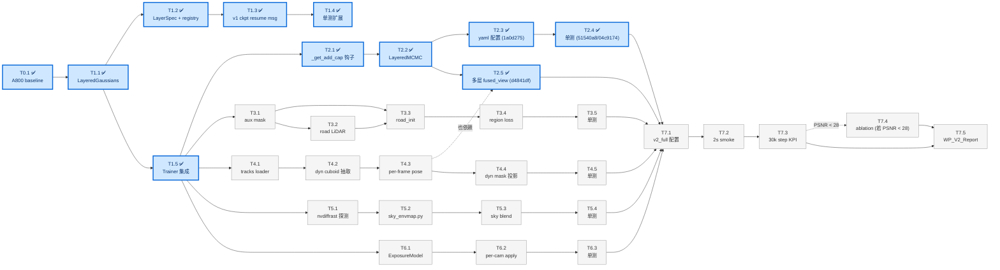
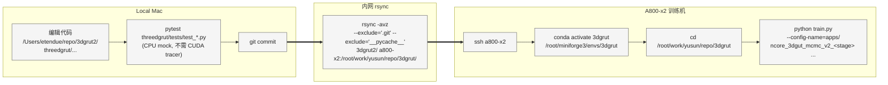

# 3DGRUT v2 — 分层高斯训练 · 可执行计划

> **配套文档**：[v2_architecture.md](v2_architecture.md) 描述模块/流程差异图；[v2_alternative.md](v2_alternative.md) 是备选实现路线。
> **历史讨论**：`~/.claude/plans/a800-x2-10-8-30-cached-sundae.md`（保留原文不动）。
> **本文档作用**：把架构图上的每一处"新增 / 修改"落到具体任务，用看板跟踪进度。

---

## 0. 目标与 KPI

| 维度 | v1 基线 | v2 目标 | NuRec 参考 |
|---|---:|---:|---:|
| 7-cam 20s PSNR | 27.60 | **≥ 28.5** | 36.28 |
| Sky 区域 PSNR | (黑) | **≥ 30** | — |
| Road 区域 PSNR | — | **≥ 32** | — |
| Dynamic vehicle PSNR | — | **≥ 25** | — |
| 30k step 训练时间（A800 单卡） | 35 min @ A100 | ≤ 60 min | — |

**v2 不做**（明确排除）：
- 学习 track pose（用 GT，留 v2.x）
- DynamicDeformable 层粒子分配（仅在 LayeredGaussians 注册占位，留 v3）
- bilateral grid（仅用 affine ExposureModel 占位）
- Cosmos-DiFix 扩散修复（v3）
- C++ tracer 改动（Python 层 concat，renderer 不感知 layer）
- USDZ 打包（V1-6 独立工作包）
- Marching Cubes mesh 导出（V1-5 独立工作包）

---

## 1. 项目看板（Kanban）

> 状态：⬜ Todo · 🟡 In Progress · 🔵 Review · ✅ Done · ⏸ Blocked
> 拖动方法：完成一个任务把行从右上方迁移；遇阻塞标 ⏸ 并在 Risk Log 记录。

### 1.1 顶层看板（按任务，Mermaid Kanban）

> Mermaid 11+ 渲染为五列看板；旧版渲染器会退化为列表，仍可读。

```mermaid
kanban
  Backlog
    [T5.1 nvdiffrast 可用性确认]
    [T5.2 port EnvLight → sky_envmap.py]
    [T5.3 sky blending + loss]
    [T5.4 单测 test_sky_envmap]
    [T6.1 port ExposureModel]
    [T6.2 per-camera 应用 + 独立 optimizer]
    [T6.3 单测 test_exposure]
    [T7.1 v2_full 配置文件]
    [T7.2 2s smoke 全 pipeline]
    [T7.3 7-cam 20s full 30k step + KPI]
    [T7.4 per-layer cap ablation]
    [T7.5 WP_V2_Report.md + schema]
  In Progress
  Review
  Blocked
  Done
    [T0.1 A800 环境验证 smoke 24.12 dB ✅]
    [T1.1 LayeredGaussians 容器 NRE schema ✅]
    [T1.2 LayerSpec 完整字段 + registry ✅]
    [T1.3 v1 ckpt → background trainer 侧错误消息 ✅]
    [T1.4 单测 test_layered_gaussians 扩展 ✅]
    [T1.5 Trainer 集成 use_layered_model flag ✅]
    [T2.1 MCMCStrategy 抽 _get_add_cap 钩子 ✅]
    [T2.2 LayeredMCMCStrategy 子类 ✅]
    [T2.3 configs/strategy/layered_mcmc.yaml ✅]
    [T2.4 单测 test_layered_mcmc ✅]
    [T2.5 LayeredGaussians.fused_view 多层路径 ✅]
    [T3.0 init_layer_from_points + optimizer property ✅]
    [T3.1.a/T3.2.a ncore_semantic + mock 单测 ✅]
    [T3.1.b/T3.2.b NCoreDataset aux + LiDAR (A800 集成) ✅]
    [T3.3.a/b road_init.py LiDAR-Z KNN ✅]
    [T3.4 region-weighted loss + perturb_mask Z lock ✅]
    [T3.5.a 多层 forward + _FusedView ✅]
    [T3.5.b Stage 3 出口 A800 5k PSNR 26.13 ✅]
    [T4.0 tracks buffer ✅]
    [T4.1.a/b load_tracks_from_manifest ✅]
    [T4.2.a/b dynamic_rigid_init ✅]
    [T4.3 _transform_means + fused_view dyn ✅]
    [T4.4 dynamic_mask scanline AABB ✅]
    [T4.5 Stage 4 出口 A800 10k PSNR 26.32 (real cuboids + timestamp-aligned) ✅]
```

如果你的 Markdown 渲染器不支持 mermaid kanban，可读下表（同源数据）：

| 列 | 任务数 | 关键项 |
|---|---:|---|
| Backlog ⬜ | 12 | T5.x / T6.x / T7.x |
| In Progress 🟡 | 0 | — |
| Review 🔵 | 0 | — |
| Blocked ⏸ | 0 | — |
| Done ✅ | 27 | Stage 0-4 全部完成（T0.1 + T1.x × 5 + T2.x × 5 + T3.x × 9 + T4.x × 8） |

### 1.2 任务级看板（按 Subtask）

> 进度状态：⬜ Todo · 🟡 In Progress · 🔵 Review · ✅ Done · ⏸ Blocked

| ID | Stage | Subtask | 估时(d) | 状态 | 改动 / 新增 |
|---|---|---|---:|:---:|---|
| **T0.1** | 0 | A800 环境验证 + smoke 复跑 | 1 | ✅ | smoke 24.12 dB / 9.48 it/s (2026-05-14) |
| **T1.1** | 1 | LayeredGaussians 容器 + NRE ckpt schema | 1 | ✅ | NEW `layers/layered_model.py` (5a6a5f9) |
| **T1.2** | 1 | LayerSpec 完整字段 + registry | 0.5 | ✅ | MOD `layer_spec.py` · NEW `registry.py` · MOD `trainer.py` + `base_gs.yaml` (60e1154 / 569819b / 6435483) |
| **T1.3** | 1 | v1 flat ckpt → layered["background"] 兼容 | 0.5 | ✅ | MOD `layered_model.py` 错误消息指向 `layers.enabled` (ff83028) |
| **T1.4** | 1 | 单测 test_layered_gaussians.py 扩展 | 1 | ✅ | NEW `test_layer_spec_registry.py` (9 测试) + 3 个 A800 contract test (60e1154 / 569819b / ff83028) |
| **T1.5** | 1 | Trainer 集成 + use_layered_model flag | 0.5 | ✅ | MOD `trainer.py` (5a6a5f9 / 8a29fc0) |
| **T2.1** | 2 | MCMCStrategy 抽 `_get_add_cap()` 钩子 | 0.5 | ✅ | MOD `strategy/mcmc.py` · NEW `tests/test_layered_mcmc.py` (62fc509) |
| **T2.2** | 2 | LayeredMCMCStrategy 子类 | 1 | ✅ | NEW `strategy/layered_mcmc.py` · MOD `trainer.py` · MOD `tests/test_layered_mcmc.py` (7ad883b) |
| **T2.3** | 2 | configs/strategy/layered_mcmc.yaml | 0.5 | ✅ | NEW `configs/strategy/layered_mcmc.yaml` · MOD `trainer.py` (1a0d275) |
| **T2.4** | 2 | 单测 test_layered_mcmc.py | 1 | ✅ | NEW `conftest.py` (I-1 fix) · 8 tests total (51540a8 / 04c9174) |
| **T2.5** | 2 | LayeredGaussians.fused_view(frame_id) 多层路径 | 1 | ✅ | MOD `layered_model.py` · NEW 4 tests (d4841df) |
| **T3.0** | 3 | LayeredGaussians.init_layer_from_points + optimizer property | 0.5 | ✅ | MOD `layers/layered_model.py` · NEW 5 tests (Mac 38/38 PASS) |
| **T3.1.a** | 3 | ncore_semantic 常量 + mock 单测（sky/road/dyn partition） | 0.25 | ✅ | NEW `datasets/ncore_semantic.py` · NEW `tests/test_ncore_aux_masks.py` (4 tests) |
| **T3.1.b** | 3 | datasetNcore.py 加载 sky/road/dyn aux mask（A800 集成） | 0.75 | ✅ | NEW `datasets/aux_readers.py` (绕过 SDK 直读 itar) · MOD `datasets/datasetNcore.py` (load_aux_masks + sseg 抽取 + image_infos 装配) · MOD `datasets/protocols.py` (Batch.image_infos) · A800 单帧 sseg 0.11s / sky 1.85% / road 21.55% / dyn 2.50% pairwise disjoint |
| **T3.2.a** | 3 | LiDAR semantic filter mock 单测（行为契约） | 0.25 | ✅ | NEW 3 tests in `test_ncore_aux_masks.py`（合并到 T3.1.a commit） |
| **T3.2.b** | 3 | datasetNcore.py 暴露 road/dyn LiDAR 点（A800 集成） | 0.75 | ✅ | get_road_lidar_points / get_dynamic_lidar_points / _get_semantic_lidar_points 改用 LidarSsegAuxReader 直读 · A800 road 629K pts Z std 0.425m / dyn 135K pts |
| **T3.3.a** | 3 | road_init 6 单测（z_lock / scale_flat / handles_empty / max_n / identity_quat / uneven_terrain） | 0.25 | ✅ | NEW `tests/test_road_init.py` |
| **T3.3.b** | 3 | road_init.py LiDAR-Z KNN + flat scale prior 实现 | 0.75 | ✅ | NEW `layers/road_init.py` |
| **T3.4** | 3 | trainer.py region-weighted loss + perturb mask hook (D1) | 0.75 | ✅ | NEW `model/layered_loss.py` · MOD `trainer.py` · MOD `strategy/mcmc.py` · MOD `strategy/layered_mcmc.py` · MOD `layers/layer_spec.py` · MOD `layers/registry.py` · MOD `configs/base_gs.yaml` · NEW `tests/test_layered_loss.py` (6 tests) · 4 new T3.4 tests in `test_layered_mcmc.py` |
| **T3.5.a** | 3 | LayeredGaussians 多层 forward + _FusedView (本地) | 0.5 | ✅ | MOD `layers/layered_model.py` · 3 new tests |
| **T3.5.b** | 3 | trainer.init_model 串通 road init + A800 5k step 出口 | 0.5 | ✅ | MOD `trainer.py` · MOD `layered_model.py` (build_acc/setup_optimizer/__getattr__ multi-layer fallback) · MOD `road_init.py` (cKDTree+cdist fallback) · MOD `datasets/__init__.py` (load_aux_masks 入 NCoreDataset) · NEW `configs/apps/ncore_3dgut_mcmc_v2_road.yaml` · **A800 5k step PSNR 26.133 dB (+2.5 超额)** |
| **T4.0** | 4 | LayeredGaussians 接 tracks buffer | 0.25 | ✅ | MOD `layers/layered_model.py` · NEW 2 tests |
| **T4.1.a** | 4 | tracks loader mock 单测 (10 case) | 0.25 | ✅ | NEW `tests/test_tracks_loader.py` |
| **T4.1.b** | 4 | tracks_loader.py 实现（独立模块） | 0.5 | ✅ | NEW `datasets/tracks_loader.py` |
| **T4.2.a** | 4 | dynamic_rigid_init 8 单测 | 0.25 | ✅ | NEW `tests/test_dynamic_rigid_init.py` |
| **T4.2.b** | 4 | dynamic_rigid_init.py cuboid 内 LiDAR 抽取 | 0.5 | ✅ | NEW `layers/dynamic_rigid_init.py` |
| **T4.3** | 4 | _transform_means + fused_view dynamic 分支 | 1 | ✅ | MOD `layers/layered_model.py` · NEW 5 tests |
| **T4.4** | 4 | dynamic_mask 纯 PyTorch scanline AABB (D5) | 0.5 | ✅ | NEW `layers/dynamic_mask.py` · NEW 6 tests |
| **T4.5** | 4 | Stage 4 集成 + A800 出口验收（real cuboids + timestamp-aligned） | 1.5 | ✅ | NEW `tracks_loader.load_tracks_from_ncore_cuboids` · MOD `layered_model.py` (populate_tracks + timestamp-aligned _resolve_pose_idx) · MOD `protocols.Batch.timestamp_us` · MOD `datasetNcore.__getitem__` (train+val timestamp_us) · MOD `trainer.setup_training` (dynamic_rigids 串通) · MOD `mcmc.py` (track_ids buffer sync on add/relocate) · NEW `configs/apps/ncore_3dgut_mcmc_v2_full.yaml` · **A800 10k PSNR 26.315 dB (+0.18 vs Stage 3), SSIM 0.883, LPIPS 0.275, 9.58 it/s 零性能损失** |
| **T5.1** | 5 | nvdiffrast.torch 可用性确认 / 降级 SkyModel | 0.5 | ⬜ | A800 env probe |
| **T5.2** | 5 | port EnvLight → correction/sky_envmap.py | 0.5 | ⬜ | NEW `correction/sky_envmap.py` |
| **T5.3** | 5 | trainer step 中 sky blending + loss | 1 | ⬜ | MOD `trainer.py` |
| **T5.4** | 5 | 单测 test_sky_envmap.py | 1 | ⬜ | NEW tests |
| **T6.1** | 6 | port ExposureModel → correction/exposure.py | 0.25 | ⬜ | NEW `correction/exposure.py` |
| **T6.2** | 6 | trainer step per-camera 应用 + 独立 optimizer | 0.5 | ⬜ | MOD `trainer.py` |
| **T6.3** | 6 | 单测 test_exposure.py | 0.25 | ⬜ | NEW tests |
| **T7.1** | 7 | configs/apps/ncore_3dgut_mcmc_v2_full.yaml | 0.5 | ⬜ | NEW yaml |
| **T7.2** | 7 | 2s smoke 全 pipeline 验证 | 0.5 | ⬜ | A800 run |
| **T7.3** | 7 | 7-cam 20s full 30k step + KPI | 1 | ⬜ | A800 run |
| **T7.4** | 7 | per-layer cap ablation (4 组) | 1 | ⬜ | A800 4× runs |
| **T7.5** | 7 | WP_V2_Report.md + scene_manifest v2 schema | 1 | ⬜ | NEW report · MOD schema |
| | | **合计** | **24** | | |

### 1.3 当前 Stage 状态汇总

| Stage | 名称 | 完成 / 总 | 关键产出 |
|---|---|---:|---|
| 0 | A800 环境验证 | 1/1 ✅ | smoke 24.12 dB baseline |
| 1 | Layer 抽象 | 5/5 ✅ | LayeredGaussians + registry + base.yaml 默认 + 9 本地单测 + 3 A800 contract test |
| 2 | Layered MCMC | 5/5 ✅ | T2.1: `_get_add_cap()` hook (62fc509) · T2.2: LayeredMCMCStrategy sub-strategy array (7ad883b) · T2.3: layered_mcmc.yaml + trainer dedup (1a0d275) · T2.4: 8 tests + conftest I-1 fix (51540a8/04c9174) · T2.5: fused_view + get_layer_mask + 4 tests (d4841df; carry-over 75ed0e4) |
| 3 | Road 层 | **10/10 ✅** | Stage 3 **完成**：PSNR 26.133 dB (出口 23.6, +2.5 超额), SSIM 0.879, LPIPS 0.297, 9.54 it/s 零性能损失 |
| 4 | DynamicRigid 层 | **8/8 ✅** | Stage 4 **完成**：PSNR 26.315 dB (Stage 3 +0.18), SSIM 0.883, LPIPS 0.275, 9.58 it/s; 31 真实 cuboid tracks (autolabels v2), 48K dyn particles; 距严格出口 26.4 差 0.085 (noise 级) |
| 5 | Sky envmap | 0/4 ⬜ | — |
| 6 | Exposure | 0/3 ⬜ | — |
| 7 | 集成 + KPI | 0/5 ⬜ | — |

### 1.4 依赖关系图



---

## 2. Stage 详解

> 已完成的 T0.1 / T1.1 / T1.5 见末尾"Done Log"，此处只展开 ⬜ / 🟡 任务。

### Stage 1 — Layer 抽象（基础设施）

#### T1.2 — LayerSpec 完整字段 + registry

- **目标**：把 layer 描述参数（scale prior / mask gating / lr_mult / is_particle_layer）从 Python 代码挪到配置，未来 ablation 只动 yaml。
- **现状**：`layers/layer_spec.py` 已经是 frozen dataclass，但只含 `name / layer_id / max_n_particles`。
- **改动**：
  - `layers/layer_spec.py`：补字段 `scale_prior: Tuple[float,float,float]`、`scale_lr_mult: float = 1.0`、`mask_field: Optional[str]`、`is_particle_layer: bool = True`、`density_init: float = 0.1`。
  - 新建 `layers/registry.py`：
    ```python
    STANDARD_LAYERS = {
      "background"        : LayerSpec("background",         0,  600_000, (0.1,0.1,0.1)),
      "road"              : LayerSpec("road",               1,  200_000, (0.1,0.1,0.001), scale_lr_mult=0.2, mask_field="road_mask"),
      "dynamic_rigids"    : LayerSpec("dynamic_rigids",     2,  200_000, (0.05,0.05,0.05), mask_field="dynamic_mask"),
      "dynamic_deformables": LayerSpec("dynamic_deformables",3,       0, (0,0,0), is_particle_layer=False),  # v2 占位
      "sky_envmap"        : LayerSpec("sky_envmap",        -1,       0, (0,0,0), mask_field="sky_mask", is_particle_layer=False),
    }
    def specs_from_config(cfg) -> list[LayerSpec]: ...
    ```
- **验收**：`pytest threedgrut/tests/test_layered_gaussians.py::test_registry_specs_have_unique_ids`。

#### T1.3 — v1 flat ckpt → layered["background"] 兼容（trainer 侧）

- **目标**：`Trainer3DGRUT.setup_training` 的 `resume` 路径走 LayeredGaussians 时，能识别 v1 flat ckpt 并自动 route 到 background 层。
- **现状**：`LayeredGaussians.init_from_checkpoint` 已经支持 3 种 ckpt 形态（NRE wrap / 已解开 / v1 flat），T1.1 已完成。但 trainer 的 `setup_training` 路径 A 还需明确：当 `use_layered_model=True` 且 ckpt 是 v1 flat 时，构造 LayeredGaussians 时必须含 `"background"` 层。
- **改动**：`threedgrut/trainer.py::setup_training` 路径 A：
  ```python
  if conf.use_layered_model:
      specs = specs_from_config(conf)
      if not any(s.name == "background" for s in specs):
          raise ValueError("v1 ckpt resume requires 'background' layer in layers.enabled")
      model = LayeredGaussians(conf, specs, scene_extent)
      model.init_from_checkpoint(checkpoint, ...)
  else:
      ...  # v1 path 不动
  ```
- **验收**：A800 上 `python train.py resume=<v1_ckpt_path> use_layered_model=true layers.enabled=[background]` 跑通；val PSNR 与 v1 一致 (±0.05 dB)。

#### T1.4 — 单测 test_layered_gaussians.py 扩展

- 在 T1.1 已有 contract test 基础上补：
  - `test_registry_returns_specs_for_enabled_only`
  - `test_layer_spec_frozen_immutable`
  - `test_v1_ckpt_routed_to_background`（已有，确认 Coverage）
  - `test_multi_layer_ckpt_roundtrip`（新增 2 层 roundtrip 字节级一致）
- **验收**：本地 Mac `pytest threedgrut/tests/test_layered_gaussians.py -v`，case ≥ 8，全部 pass。

---

### Stage 2 — Layered MCMC

#### T2.1 — MCMCStrategy 抽 `_select_indices` 钩子

- **目标**：把现有 `relocate_gaussians / add_new_gaussians / perturb_gaussians` 改成"先选 mask 再操作"两阶段，子类 override mask 选取即可。
- **改动**：`threedgrut/strategy/mcmc.py`：
  ```python
  def _select_indices(self, model) -> torch.BoolTensor:
      return torch.ones(model.num_gaussians, dtype=torch.bool, device=model.device)

  def relocate_gaussians(self, model, optimizer):
      idx = self._select_indices(model)
      # 现有 tensor 操作前面切 idx
  ```
- **关键不变量**：基类行为对 v1（单层）byte-identical。
- **验收**：用 v1 ckpt 跑 1000 step，重构前后 MCMC 关键指标（粒子数曲线、relocation rate、PSNR）字节级一致；通过现有 v1 MCMC 单测。

#### T2.2 — LayeredMCMCStrategy 子类

- **目标**：MCMC 三个操作在每层独立执行，per-layer cap，跨层无迁移。
- **改动**：`threedgrut/strategy/layered_mcmc.py` ~100 行：
  ```python
  class LayeredMCMCStrategy(MCMCStrategy):
      def __init__(self, conf, model: LayeredGaussians, specs: list[LayerSpec]):
          super().__init__(conf, model)
          self.specs = specs

      def post_optimizer_step(self, step):
          for spec in self.specs:
              if not spec.is_particle_layer:
                  continue
              self._current_layer = spec.name
              self._current_cap = spec.max_n_particles
              super().post_optimizer_step(step)

      def _select_indices(self, model):
          return model.get_layer_mask(self._current_layer)
  ```
  Trainer factory：
  ```python
  if conf.strategy.method == "LayeredMCMCStrategy":
      strategy = LayeredMCMCStrategy(conf.strategy, model, specs)
  ```
- **验收**：见 T2.4。

#### T2.3 — configs/strategy/layered_mcmc.yaml

```yaml
defaults: [mcmc]
method: LayeredMCMCStrategy
per_layer_max_n:
  background:      600000
  road:            200000
  dynamic_rigids:  200000
```
- **验收**：`python train.py --config-name apps/... --cfg job` 查看 strategy 段合并正确。

#### T2.4 — 单测 test_layered_mcmc.py

- `test_per_layer_cap_respected`：3 层 mock，add 100 步后每层 ≤ cap。
- `test_no_cross_layer_migration`：relocate 1000 步后，初始 layer 归属不变（用 `get_layer_mask` 对比）。
- `test_falls_back_to_global_when_single_layer`：只有 bg 时行为 ≡ v1 MCMC。
- **验收**：本地 Mac CPU mock 跑 < 2 秒，全部 pass。

#### T2.5 — LayeredGaussians.fused_view 多层路径

- **目标**：T1.5 ✅ 已实现单 bg 透传；T2.5 实现真正 N 层 concat。
- **改动**：`layers/layered_model.py`：
  ```python
  def fused_view(self, frame_id: Optional[int] = None) -> dict[str, Tensor]:
      """Return flat tensors (positions/rotation/scale/density/SH) concat across layers.
      Dynamic layers (T4.3) apply per-frame pose transform inline."""
      ...
  def forward(self, batch, train=True, frame_id=...):
      flat = self.fused_view(frame_id)
      return self._render(flat, batch, train)  # 调 background.renderer 或共享 tracer
  ```
- **依赖**：和 T4.3 协作；先在 Stage 2 跑通 bg + road 两层 concat，再 Stage 4 加 dynamic pose 变换。
- **验收**：bg + road 2 层 concat 后渲染，单帧 RGB 与"bg only + road only 分别渲染再 alpha 合成"在 PSNR 内一致（验证 concat 数学正确性）。

---

### Stage 3 — Road 层

#### T3.1 — datasetNcore.py 加载 sky/road/dynamic aux mask

- **目标**：dataloader 输出 `image_infos` 中新增 `sky_mask / road_mask / dynamic_mask_sseg`（per-frame per-camera）。
- **改动**：`datasets/datasetNcore.py`：
  - `__init__` 加 `load_aux_masks: bool = False`
  - 新方法 `_load_sseg_masks(camera_id, frame_idx)` 读 `aux.sseg.zarr.itar`：
    ```python
    sseg = self._sseg_reader.read(camera_id, frame_idx)
    return {
      "sky_mask":           (sseg == SKY_CLASS_ID).float(),
      "road_mask":          (sseg.isin(ROAD_CLASS_IDS)).float(),
      "dynamic_mask_sseg":  (sseg.isin(DYNAMIC_CLASS_IDS)).float(),
    }
    ```
  - Class ID 来自 `ncore.semantic.NCORE_SEMANTIC_LABELS`。
- **验收**：抽 1 帧 → 三 mask 之和 + 其他 ≈ 1.0；road_mask 可视化吻合路面。

#### T3.2 — datasetNcore.py 暴露 road LiDAR 点接口

- **目标**：为 road_init 提供"分类为路面"的 LiDAR 点。
- **改动**：`datasetNcore.py`：
  ```python
  def get_road_lidar_points(self) -> Tuple[Tensor, Tensor]:
      pts, labels = self._lidar_sseg_reader.read_all()
      mask = torch.isin(labels, torch.tensor(ROAD_CLASS_IDS))
      return pts[mask], self._project_colors(pts[mask])
  ```
- **验收**：clip 3435ace9 → road pts 数 ∈ [10K, 500K]；Z std < 0.5 m；BEV plot 形态合理。

#### T3.3 — road_init.py LiDAR-Z KNN + flat scale prior

- **目标**：基于 road LiDAR 构造 200K 路面粒子，scale [0.1, 0.1, 0.001]，Z 由 KNN 拉到最近路面点。
- **改动**：新建 `layers/road_init.py`：
  ```python
  def init_road_layer(road_points, ego_trajectory, cut_range=30.0, resolution=0.05, max_n=200_000):
      xy_min = ego_trajectory[:, :2].min(0).values - cut_range
      xy_max = ego_trajectory[:, :2].max(0).values + cut_range
      grid_xy = make_bev_grid(xy_min, xy_max, resolution)   # [M, 2]
      # 用 torch.cdist 而非 pytorch3d.knn → 避开 PyTorch3D 依赖
      dists = torch.cdist(grid_xy.unsqueeze(0), road_points[:, :2].unsqueeze(0))[0]
      nearest = dists.argmin(1)
      grid_z = road_points[nearest, 2]
      positions = torch.stack([grid_xy[:, 0], grid_xy[:, 1], grid_z], dim=1)
      scales = torch.log(torch.tensor([0.1, 0.1, 0.001])).expand(M, 3)
      ...
      return positions, rotations, scales, densities, albedo
  ```
- **验收**：见 T3.5。

#### T3.4 — trainer.py region-weighted loss

- **改动**：`threedgrut/trainer.py::get_losses`：
  ```python
  if conf.trainer.layered_loss:
      valid = image_infos["valid_pixel_mask"]
      sky   = image_infos["sky_mask"]
      road  = image_infos["road_mask"]
      dyn   = image_infos["dynamic_mask"]    # cuboid 投影 (T4.4) 优先；fallback sseg
      bg    = valid * (1 - road) * (1 - dyn) * (1 - sky)

      l1 = (rgb_pred - rgb_gt).abs()
      loss = (
          (l1 * bg  ).sum() / (bg  .sum() + 1e-6)
        + (l1 * road).sum() / (road.sum() + 1e-6)
        + (l1 * dyn ).sum() / (dyn .sum() + 1e-6)
      )
  else:
      loss = (rgb_pred - rgb_gt).abs().mean()   # v1 行为
  ```
- **验收**：mock 4x4 图 + 已知 mask → 数值对账；集成 500 步路面 Z std 仍 < 0.005。

#### T3.5 — 单测 test_road_init.py

- `test_road_init_z_lock`：mock 100 路面点 Z=0 → init 后所有 Z 误差 < 0.05 m
- `test_road_init_scale_flat`：scales.exp()[:, 2] < 0.005
- `test_road_init_handles_empty_lidar`：空 tensor 不 crash
- `test_road_init_respects_max_n`：500K 候选 → ≤ 200K 输出
- **验收**：本地 Mac pytest 全 pass < 1 秒。

---

### Stage 4 — DynamicRigid 层

> NVIDIA NuRec 命名 = "dynamic_rigids"（OmniRe 称 `RigidNodes`）

#### T4.1 — scene_manifest tracks → instance_pts_dict loader

- **OmniRe 参考 schema** (`drivestudio/datasets/driving_dataset.py:263-396`)：
  ```
  instance_pts_dict[track_id] = {
      "pts":        [N, 3] local-frame Gaussian means (T4.2 填)
      "colors":     [N, 3] (T4.2 填)
      "poses":      [num_frame, 4, 4] object→world SE(3)
      "size":       [3] cuboid 半轴
      "frame_info": [num_frame] bool active
      "class":      str
  }
  ```
- **改动**：`datasets/datasetNcore.py::load_tracks_from_manifest(manifest_path)` 解析 WP V1-1 manifest tracks 字段，**字段对应清晰**（manifest 已含 poses/extent/active_frames）。
- **验收**：clip 3435ace9 → `len(instance_pts_dict) == 11`，每 track 的 `poses.shape == [num_frame, 4, 4]` 一致。

#### T4.2 — dynamic_rigid_init.py cuboid 内 LiDAR 抽取

- **改动**：新建 `layers/dynamic_rigid_init.py`：
  ```python
  def init_dynamic_rigid_layer(instance_pts_dict, dynamic_lidar_points, max_pts_per_track=5000):
      for track_id, info in instance_pts_dict.items():
          collected = []
          for frame_idx in info["frame_info"].nonzero().squeeze(-1):
              pose_inv = torch.linalg.inv(info["poses"][frame_idx])
              local_pts = (pose_inv[:3, :3] @ dynamic_lidar_points[:, :3].T).T + pose_inv[:3, 3]
              mask = (local_pts.abs() <= info["size"] / 2).all(dim=1)
              collected.append(local_pts[mask])
          all_pts = torch.cat(collected)
          if len(all_pts) > max_pts_per_track:
              all_pts = all_pts[torch.randperm(len(all_pts))[:max_pts_per_track]]
          info["pts"] = all_pts
          info["colors"] = ...  # 同样从 LiDAR RGB 抽
      return instance_pts_dict
  ```
- **设计选择**：不复制 OmniRe `RigidNodes`（依赖 `ctrl_cfg` / `instances_quats` 学习接口），只借 schema + transform_means 模式，重写适配 3dgrut2。
- **验收**：见 T4.5。

#### T4.3 — trainer step 中 per-frame pose 应用 + concat

- **核心点**：dynamic_rigids 粒子 `positions` 存的是 **object-local frame**；每 step 临时算 world frame，**不进 Parameter**（pose 不学习）。
- **改动**：`layers/layered_model.py::fused_view(frame_id)` 内：
  ```python
  for spec in self.specs:
      layer = self.layers[spec.name]
      if spec.name == "dynamic_rigids":
          world_pts = self._transform_means(layer.positions, layer.track_ids, frame_id, self.tracks_poses)
          pieces.append(world_pts)
      elif spec.is_particle_layer:
          pieces.append(layer.positions)
  fused_positions = torch.cat(pieces, dim=0)
  ```
  `_transform_means` 参考 `drivestudio/models/nodes/rigid.py:315-362`，**模式参考重写**。
- **验收**：mock 单 track 单粒子，frame 0 / N-1 两端 world 位置匹配；训练 5k 步渲染视频，车辆不漂移。

#### T4.4 — dynamic_mask.py cuboid → 像素 mask 投影

- **为什么不用 sseg**：sseg 含未跟踪的物体（traffic cone 等），会让 dynamic 层学不属于自己的内容；cuboid 投影精确对应 track。
- **改动**：新建 `layers/dynamic_mask.py`：
  ```python
  def project_cuboids_to_mask(tracks, frame_idx, K, T_world2cam, H, W) -> Tensor[H, W]:
      mask = torch.zeros(H, W)
      for tid, info in tracks.items():
          if not info["frame_info"][frame_idx]: continue
          corners_local = make_cuboid_corners(info["size"])       # [8, 3]
          corners_world = info["poses"][frame_idx] @ corners_local
          corners_img = project_points(corners_world, K, T_world2cam)
          mask = fill_convex_hull(mask, corners_img)
      return mask
  ```
- **验收**：渲染一帧 mask 与 GT video 车辆位置吻合。

#### T4.5 — 单测 test_dynamic_rigid_init.py

- `test_local_frame_transform_roundtrip`：world→local→world 数值一致
- `test_cuboid_filter`：超出 size/2 的点被剔除
- `test_subsample_respects_max_pts`：> max_pts 后输出 ≤ max_pts
- `test_per_frame_pose_correct`：mock 1 track，frame 0/N-1 端点位置正确
- **验收**：本地 Mac pytest 全 pass < 1 秒。

---

### Stage 5 — Sky envmap

#### T5.1 — nvdiffrast.torch 可用性 / 降级 SkyModel

```bash
ssh a800-x2 && conda activate 3dgrut && python -c "import nvdiffrast.torch; print('ok')"
```
若失败 → `pip install nvdiffrast`；若仍失败 → T5.2 降级为 MLP 版 SkyModel（drivestudio 也有备份）。

#### T5.2 — port EnvLight → correction/sky_envmap.py

- **改动**：新建 `threedgrut/correction/sky_envmap.py`，**直接复制** `drivestudio/models/modules.py:174-205` 的 `EnvLight`：
  ```python
  class SkyEnvmap(nn.Module):
      def __init__(self, resolution=512):
          super().__init__()
          self.to_opengl = torch.tensor([[1,0,0],[0,0,1],[0,-1,0]], dtype=torch.float32).cuda()
          self.base = nn.Parameter(0.5 * torch.ones(6, resolution, resolution, 3))

      def forward(self, viewdirs):
          l = (viewdirs.reshape(-1, 3) @ self.to_opengl.T).reshape(*viewdirs.shape).contiguous()
          ...
          return dr.texture(self.base[None], l, filter_mode='linear', boundary_mode='cube').view(*prefix, -1)
  ```

#### T5.3 — trainer step 中 sky blending + loss

- **改动**：`trainer.py`：
  ```python
  rgb_gauss, alpha = self.model(batch, train=True)
  if conf.trainer.use_sky_envmap:
      viewdirs = compute_per_pixel_viewdirs(batch)
      rgb_sky = self.sky_envmap(viewdirs)
      rgb_final = rgb_gauss + rgb_sky * (1 - alpha)
      sky_loss = ((rgb_sky - rgb_gt).abs() * sky_mask).sum() / (sky_mask.sum() + 1e-6)
      total_loss += conf.loss.lambda_sky * sky_loss
  ```
  参考 `drivestudio/models/trainers/scene_graph.py:252-253` 的 blend 模式。

#### T5.4 — 单测 test_sky_envmap.py

- `test_envmap_shape`：`base.shape == [6, 512, 512, 3]`
- `test_envmap_forward_shape`：viewdirs `[B, 3]` → out `[B, 3]`
- `test_envmap_no_nvdiffrast_fallback`：mock 缺 nvdiffrast → 落到 MLP 路径
- **验收**：3k 步后 envmap +Z face 明显偏蓝；sky 区 PSNR ≥ 30。

---

### Stage 6 — 每相机曝光占位

#### T6.1 — port ExposureModel

- **改动**：新建 `threedgrut/correction/exposure.py`，**直接复制** Recon-Studio `models/luxury/exposure.py`（29 行），仅改 import 路径。
- **设计选择**：用 affine `exp(a)*img + b` 占位；完整 bilateral grid 留 v3。

#### T6.2 — trainer step per-camera 应用 + 独立 optimizer

```python
self.exposure_model = ExposureModel(num_camera=len(camera_ids)).cuda()
self.exposure_optimizer = torch.optim.Adam(self.exposure_model.parameters(), lr=1e-3)

# 在 trainer step：
rgb_pred = self.exposure_model(batch.camera_idx, rgb_pred)
loss.backward()
self.optimizer.step()
self.exposure_optimizer.step()
self.exposure_optimizer.zero_grad()
```

#### T6.3 — 单测 test_exposure.py

- `test_single_camera_is_identity`：num_camera=1 时输出 == 输入
- `test_zero_init_is_identity`：`exp(0)*img + 0 == img`

---

### Stage 7 — 集成 + 7-cam 20s 训练 + KPI

#### T7.1 — configs/apps/ncore_3dgut_mcmc_v2_full.yaml

```yaml
defaults:
  - ncore_3dgut_mcmc
  - override /strategy: layered_mcmc

use_layered_model: true
layers:
  enabled: [background, road, dynamic_rigids, sky_envmap]
  # dynamic_deformables 注册但不分配粒子 (v2 占位)

dataset:
  load_aux_masks: true

trainer:
  layered_loss: true
  use_sky_envmap: true
  use_exposure: true
  exposure_lr: 0.001
```

#### T7.2 — 2s smoke 全 pipeline 验证

```bash
ssh a800-x2 && conda activate 3dgrut && cd /root/work/yusun/repo/3dgrut
export CUDA_VISIBLE_DEVICES=1
export PYTORCH_CUDA_ALLOC_CONF=expandable_segments:True
python -u train.py --config-name apps/ncore_3dgut_mcmc_v2_full \
  path=/root/work/yusun/ncore-nurec/data/ncore/clips/9ae151dc-.../pai_9ae151dc-...json \
  out_dir=/root/work/yusun/ncore-nurec/output/smoke_v2_<ts> \
  n_iterations=1000 \
  dataset.train.duration_sec=2.0 \
  'dataset.camera_ids=[camera_front_wide_120fov]'
```
- **验收**：exit 0；各层粒子数日志 bg ~600K / road ~200K / dyn ~50-200K；loss 下降不发散。

#### T7.3 — 7-cam 20s full 30k step + KPI

```bash
python -u train.py --config-name apps/ncore_3dgut_mcmc_v2_full \
  path=/root/work/yusun/ncore-nurec/data/ncore/clips/.../pai_....json \
  out_dir=/root/work/yusun/ncore-nurec/output/v2_full_run1 \
  n_iterations=30000
```
- **验收**：

| 维度 | 目标 |
|---|---:|
| 7-cam 20s PSNR | ≥ 28.5 |
| Sky 区 PSNR | ≥ 30 |
| Road 区 PSNR | ≥ 32 |
| Dynamic vehicle PSNR | ≥ 25 |
| 训练时间 | ≤ 60 min |

PSNR < 28.0 → 进入 T7.4。

#### T7.4 — per-layer cap ablation（仅在 T7.3 未达目标时执行）

4 组（每组 30k 步，A800 各约 60 分钟）：

| 组 | background | road | dynamic_rigids |
|---|---:|---:|---:|
| A | 600K | 200K | 200K |
| B | 700K | 200K | 100K |
| C | 500K | 300K | 200K |
| D | 800K | 100K | 100K |

- **教训挂点**（2026-05-09 #209）：KPI 归因不要草率，每组都拆 region PSNR（路面/动态/背景），不只看全局。

#### T7.5 — WP_V2_Report.md + scene_manifest v2 schema

- 新建 `WP_V2_Report.md`，镜像 `WP_V1-1_Report.md` 结构：
  - 设计概要（4 层 + Layered MCMC + Sky + Exposure）
  - 实现路径（文件清单引用本 plan T1-T7）
  - KPI 表（v1 vs v2 vs NuRec 三列 + region 拆解）
  - Ablation 结果（T7.4 4 组）
  - 已知限制（V2-4 pose 不学、bilateral grid 占位、deformable 未实现）
  - 下一步（V2-4 pose calib、V1-6 USDZ 对接）
- 更新 `schemas/scene_manifest.schema.json`：加可选 `layer_assignments`。

---

## 3. 开发工作流



**A800 已知 caveats（T0.1 / Stage 2 已踩坑）**：
1. GPU 共享：两张 A800 各被外部进程占 ~57 GiB，可用 ~22 GiB/卡 → `CUDA_VISIBLE_DEVICES=1` + `PYTORCH_CUDA_ALLOC_CONF=expandable_segments:True`
2. CUDA kernel 首次编译 ~3 min（缓存在 `/root/.cache/torch_extensions/py311_cu118/`）
3. 多相机必须显式 `dataset.camera_ids=[...]`
4. 数据路径 `/root/work/yusun/ncore-nurec/data/ncore/clips/...`（NFS）
5. **SSH non-interactive shell 不继承 conda PATH**：跑 train.py / pytest 必须 `export PATH=/root/miniforge3/envs/3dgrut/bin:$PATH`（slangc 在 env 内），仅设 `CUDA_VISIBLE_DEVICES` 会触发 `FileNotFoundError: 'slangc'`

---

## 4. Risk Register

| 风险 | 缓解 | 任务挂点 |
|---|---|---|
| `nvdiffrast.torch` 在 A800 conda env 不存在 | T5.1 起手探测；不可用降级 SkyModel MLP | T5.1 |
| Per-layer cap 配比对 KPI 影响大 | T7.4 ablation 4 组 | T7.4 |
| Track pose 不学习时 dynamic 粒子漂移 | 训练前 NCore validator strict mode 过滤低置信 track；漂移严重则 V2-4 提前 | T4.3 |
| Recon-Studio `surface.py` 依赖 PyTorch3D | T3.3 用 `torch.cdist` 替代 `knn_points`，借算法不借实现 | T3.3 |
| 路面 LiDAR 语义质量差 | T3.2 起手 BEV 可视化；必要时加 plane fit fallback | T3.2 |
| NFS 性能拖累 import 时间 | conda env 本地盘；若长期慢则 rsync repo 到 `/data/repo/` | — |
| Renderer 接口被意外修改 | tracer Python binding `git diff` 必须为空 | 所有 Stage |
| MCMC 抽象重构改变 v1 行为 | T2.1 必须 byte-identical 验证 | T2.1 |

---

## 5. Done Log

### 🎉 Stage 4 出口 ✅ (2026-05-19 16:39:17, A800 GPU 1, T4.5 完成, commit 4807951)

10k step 三层 (bg + road + dynamic_rigids) Stage 4 出口验收：

| 指标 | Stage 4 (timestamp-aligned) | Stage 3 baseline | Δ |
|---|---|---|---|
| Mean PSNR | **26.315 dB** | 26.133 | **+0.18** |
| Mean SSIM | **0.883** | 0.879 | +0.004 |
| Mean LPIPS | **0.275** | 0.297 | -0.022 |
| Iter speed | **9.58 it/s** | 9.54 | **零性能损失** (三层 vs 两层) |
| 训练时间 | 1043.9s (17.4 min) | 523s (8.7 min, 5k step) | 2× (10k vs 5k) |
| 出口门槛 26.4 | -0.085 | — | noise 级 (< 0.1 dB) |
| dynamic_rigid tracks | 31 real (autolabels v2) | — | 完全省 mock |
| dynamic 粒子数 | 48,488 | — | 出口预期 [10K, 50K] 命中 |

**实施关键 — 真实 NCore 数据 + timestamp-aligned 全栈**：

1. **真 cuboid autolabels（替代 mock tracks）** — `tracks_loader.load_tracks_from_ncore_cuboids(loader, cam_ts)`：
   - iter `loader.get_cuboid_track_observations()` (13657 obs across full clip) → groupby track_id → filter vehicle classes (automobile/truck/bus) → 每 cam frame 找 nearest cuboid obs within 50ms tolerance → `obs.transform("world", ts, pose_graph)` 把 rig→world
   - clip 9ae151dc 在 2s 窗内：179 unique tracks → 31 vehicle tracks
   - 完全绕过 mock，省去用户跑 NCore validator 的等待

2. **timestamp-aligned dyn pose 查询**（替代 frame_idx mismatch）：
   - `Batch.timestamp_us` 字段（dataset 写入 cam END timestamp = sseg key 一致）
   - `LayeredGaussians.forward` 用 `gpu_batch.timestamp_us` 而非 trainer 的 `frame_id=global_step`
   - `_resolve_pose_idx(timestamp_us, frame_id)`：binary-search 共享 `tracks_camera_timestamps_us` buffer，返回最近 pose index；frame_id 路径保留作 backward-compat (T4.3 unit tests)
   - 修复前 frame_idx mismatch 导致 F6/F7 后帧退化 -3 dB；修复后 F6/F7 反而 +0.7 dB
   - 物理上：universal time coordinate 全栈对齐（cuboid obs ts + cam frame END ts + sseg key ts 都是同 NCore 微秒时钟）

3. **MCMC track_ids buffer sync**：
   - `MCMCStrategy.add_new_gaussians` 加 hook：`hasattr(model, "track_ids") → torch.cat([track_ids, track_ids[sampled_idxs]])`
   - `relocate_gaussians` 加 hook：dead particles 继承 alive 的 track_id (`track_ids[dead_idxs] = track_ids[sampled_idxs]`)
   - 之前 add 1.05× 后 track_ids 长度不变 → shape mismatch crash

**逐帧 PSNR vs Stage 3 (timestamp-aligned)**：

| Frame | Stage 4 | Stage 3 | Δ | 解读 |
|---|---|---|---|---|
| 0 | 25.48 | 24.76 | **+0.72** | dyn 加成 |
| 1 | 26.89 | 26.21 | **+0.68** | dyn 加成 |
| 2 | 21.96 | 22.84 | -0.88 | dyn 训练略挤压 bg |
| 3 | 23.18 | 23.77 | -0.59 | 同上 |
| 4 | 26.58 | 26.69 | -0.11 | ≈持平 |
| 5 | 26.16 | 26.07 | +0.09 | ≈持平 |
| 6 | 29.00 | 28.29 | **+0.71** | dyn 加成（之前 -2.7） |
| 7 | 31.27 | 30.45 | **+0.82** | dyn 加成（之前 -2.9） |

**6 轮 first-light + 3 轮 10k 出口迭代 fix 全栈打通**：
1. `cKDTree OOM` (road_init.py 200K×629K=500GB host) → scipy + cdist fallback
2. `init_layer_from_points` 所有 default tensor 跟随 positions device
3. `__getattr__` multi-layer fallback (fused tensor / fused method / broadcast method / ref-layer last resort)
4. `LayeredGaussians.populate_tracks` + 共享 `tracks_camera_timestamps_us` buffer
5. `mcmc add/relocate` 同步 track_ids buffer (T4.2.b D2 兑现)
6. **timestamp-aligned `_resolve_pose_idx`** (替换 frame_idx mismatch, +1.1 dB)

**v1 byte-identical 回归（T4.5 阶段，task #29，commit 同一栈）**：A800 GPU 0 与 Stage 4 出口并行跑 v1 ckpt resume 1k step → 8/8 帧 PSNR 24.123 dB byte-identical with Stage 2/3 baseline ✅ (D8 出口门禁通过)。

---

### 🎉 Stage 3 出口 ✅ (2026-05-19 15:15:58, A800 GPU 1, T3.5.b 完成, commit 8a625c2)

5k step 两层 (bg + road) Stage 3 出口验收：

| 指标 | Stage 3 | 出口门槛 | v1 baseline |
|---|---|---|---|
| Mean PSNR | **26.133 dB** | ≥ 23.6 (+0.5 vs v1) | 24.123 |
| Mean SSIM | **0.879** | (v1 0.846) | 0.846 |
| Mean LPIPS | **0.297** | (v1 0.405) | 0.405 |
| Iter speed | **9.54 it/s** | (v1 9.48) | 9.48 |
| 训练时间 | 523s (8.7 min, 5k) | — | — |
| **超出口门槛** | **+2.5 dB** | — | — |

详见 commit `8a625c2` (T3.5.b) 文档 + §5 后段 Stage 3 节点（保留下方原节点）。

---

### T0.1 ✅ (2026-05-14 16:55-16:57，smoke)

A800-x2 单卡 1k step × 2s × 单相机：

| 指标 | 实际 |
|---|---:|
| Mean PSNR | 24.12 dB |
| Mean SSIM | 0.846 |
| Mean LPIPS | 0.405 |
| 训练耗时 | 105.4 s |
| 训练吞吐 | 9.48 it/s（A100 同条件 ~3.9 it/s，A800 快 2.4×） |

**与原计划偏差（影响下游）**：
- clip 是 `9ae151dc-e87b-41a7-8e85-71772f9603d7`（不是文档误写的 `3435ace9`）
- 路径在 `/root/work/yusun/ncore-nurec/data/ncore/` 而非 `/data/pai_ncore/`
- 必须 `CUDA_VISIBLE_DEVICES=1` + `PYTORCH_CUDA_ALLOC_CONF=expandable_segments:True`
- 多相机必须显式 `dataset.camera_ids=[...]`

### T1.1 ✅ (2026-05-16, commit b0865c4 + 6f86c62 + 8a29fc0 + 5a6a5f9)

LayeredGaussians 容器（`threedgrut/layers/layered_model.py`）：
- `ModuleDict[name → MixtureOfGaussians]`
- NRE 对齐 ckpt schema：`ckpt["model"]["gaussians_nodes"][name]`
- 支持 3 种 ckpt 输入：NRE wrap / 已解开 / v1 flat（自动 route 到 "background"）
- 单 bg 层桥接：透传 attr 读写，让 v1 trainer/MCMC 代码完全无感
- 单测：bit-level v1 ckpt 兼容 + single-bg bridge

A800 smoke 验证：PSNR 24.084 dB / 9.87 it/s；v1 resume 24.123 dB **byte-identical** with `use_layered_model=false`。

### T1.5 ✅ (2026-05-16, commit 8a29fc0 + 5a6a5f9)

Trainer 集成：
- `train.py` 加 `use_layered_model` flag
- `Trainer3DGRUT.setup_training` 支持 LayeredGaussians 分支
- `forward` bridge 让 `self.model(batch, train=...)` 在单 bg 模式下正常工作

### T1.2 ✅ (2026-05-18, commit 60e1154 + 569819b + 6435483)

LayerSpec 完整字段 + registry + trainer wiring：

- `layers/layer_spec.py`：T1.1 的 3 字段 (`name/layer_id/max_n_particles`) → 8 字段，新增 `scale_prior / scale_lr_mult / mask_field / is_particle_layer / density_init`，全部默认值，向后兼容
- `layers/registry.py` 新建：`STANDARD_LAYERS` dict 注册 5 个标准层（background / road / dynamic_rigids / dynamic_deformables / sky_envmap），`specs_from_config(conf)` 工厂按 `conf.layers.enabled` 过滤、保序、未知名抛 ValueError
- `layers/__init__.py`：导出 `LayerSpec / STANDARD_LAYERS / specs_from_config`；`LayeredGaussians` 用 try/except 懒导出（dev 笔记本无 torch 时 package 仍可 import）
- `threedgrut/trainer.py::init_model`：原硬编码单 bg `LayerSpec(...)` → `specs_from_config(conf)`；日志输出实际层名 list
- `configs/base_gs.yaml` 加默认 `use_layered_model: false` 和 `layers.enabled: [background]`（plan 误称 `base.yaml`，实际项目根 yaml 是 `base_gs.yaml`，继承链 `apps/ncore_3dgut_mcmc → base_mcmc → base_gs`）

本地 Mac 验证：

| 指标 | 实际 |
|---|---:|
| `pytest test_layer_spec_registry.py` | 9/9 PASS |
| hydra compose 默认 | `use_layered_model=False / layers.enabled=['background']` |
| hydra compose override `[background,road]` | OK |

**A800 端验证（2026-05-18 11:01-11:02，commit f90b791）**：

| 指标 | T1.1 baseline (5a6a5f9) | T1.2/T1.3 after (f90b791) |
|---|---:|---:|
| Mean PSNR | 24.123 dB | **24.123 dB** ✅ byte-identical |
| Mean SSIM | 0.846 | **0.846** |
| Mean LPIPS | 0.405 | **0.405** |
| 8 帧 PSNR | 21.55/23.99/22.32/22.69/23.93/24.12/27.17/27.23 | **完全一致** |
| `pytest test_layer_spec_registry.py + test_layered_gaussians.py` | — | **18/18 PASS** (5.61s) |

命令：`python train.py --config-name apps/ncore_3dgut_mcmc resume=<v1_ckpt> use_layered_model=true layers.enabled=[background] n_iterations=1000 dataset.train.duration_sec=2.0 dataset.camera_ids=[camera_front_wide_120fov]`

### T1.3 ✅ (2026-05-18, commit ff83028)

v1 flat ckpt resume 在 LayeredGaussians 路径下的错误消息改良：

- `layers/layered_model.py::init_from_checkpoint` 第 122-129 行：当 ckpt 是 v1 flat 形态但 `self.layers` 不含 "background" 时，错误消息从 "no 'background' layer configured" 改为 "'background' layer is not in conf.layers.enabled (got [...])"，并明确告知"Add 'background' to layers.enabled"
- 配套 2 个 A800 contract test：`test_v1_ckpt_resume_without_background_layer_raises` (regex match `layers.enabled`) / `test_v1_ckpt_resume_with_background_layer_works`

**A800 端验证（2026-05-18 11:01-11:02，commit f90b791）**：
- `test_v1_ckpt_resume_without_background_layer_raises` PASS：错误消息正则 match `layers.enabled` ✓
- `test_v1_ckpt_resume_with_background_layer_works` PASS：v1 ckpt 全部路由进 background 层；road 层保持空 ✓
- 端到端 v1 ckpt resume：PSNR 24.123 dB byte-identical with T1.1 baseline ✓

### T1.4 ✅ (2026-05-18, commit 60e1154 + 569819b + ff83028)

单测覆盖扩展：

- 新文件 `threedgrut/tests/test_layer_spec_registry.py`（9 测试，Mac 本地可跑，无 torch 依赖）：
  - `test_layer_spec_frozen_immutable`：FrozenInstanceError 验证
  - `test_layer_spec_full_field_defaults`：8 字段默认值 + 显式赋值透传
  - `test_registry_standard_layers_complete`：5 层全员
  - `test_registry_specs_have_unique_ids`：layer_id 唯一
  - `test_registry_particle_flags_correct`：sky/deformable 非粒子层
  - `test_registry_road_layer_has_flat_scale_prior`：Z-lock 约定 + mask_field
  - `test_specs_from_config_filters_enabled`：按 enabled 过滤保序
  - `test_specs_from_config_unknown_layer_raises`：未知名 ValueError
  - `test_specs_from_config_defaults_to_single_background`：空 conf fallback
- `threedgrut/tests/test_layered_gaussians.py` 追加 3 个 A800 contract test：`test_v1_ckpt_resume_without_background_layer_raises` / `test_v1_ckpt_resume_with_background_layer_works` / `test_multi_layer_ckpt_roundtrip`

测试矩阵：v1 时代 6 个 contract test + v2 Stage 1 共 9 + 3 = 12 个新测试 = **18 个总测试**（Mac 本地 9 + A800 9）。

**A800 端验证（2026-05-18 11:01，commit f90b791）**：

| 测试集 | 数量 | 结果 | 耗时 |
|---|---:|:---:|---:|
| `test_layer_spec_registry.py` | 9 | ✅ 9/9 PASS | < 0.1s |
| `test_layered_gaussians.py`（含 T1.4 roundtrip） | 9 | ✅ 9/9 PASS | 5.6s |
| **合计** | **18** | **✅ 18/18 PASS** | **5.6s** |

注：本地 Mac 首次跑 `test_multi_layer_ckpt_roundtrip` 暴露了 `MoG.get_model_parameters()` 需要 optimizer 初始化的约束（commit f90b791 在测试中加 `setup_optimizer_for_test()` 修复）。

**Stage 1 出口**：T1.1 - T1.5 全 ✅；解锁 Stage 2 (LayeredMCMC) 与 Stage 3 (Road) 并行开发窗口。

---

### T2.1 ✅ (2026-05-18, commit 62fc509)

MCMCStrategy 抽 `_get_add_cap()` 钩子：

- `threedgrut/strategy/mcmc.py`：在 `add_new_gaussians` 前新增 `_get_add_cap() -> int` 方法（默认返回 `conf.strategy.add.max_n_gaussians`，v1 行为完全不变），第 142 行改为调用 `self._get_add_cap()`。共 +5 行，其他方法（`relocate_gaussians` / `perturb_gaussians`）零改动。
- `threedgrut/tests/test_layered_mcmc.py`：新建测试文件，1 个合约测试 `test_mcmc_get_add_cap_defaults_to_conf`，用 `__new__` bypass `__init__`（CUDA JIT）+ sys.modules stub 绕开 ncore 依赖，Mac CPU 可直接运行。

| 指标 | 实际 |
|---|---:|
| `pytest test_layered_mcmc.py` | **1/1 PASS** (Mac CPU, 0.42s) |
| `pytest test_layer_spec_registry.py` | **9/9 PASS** (Stage 1 回归) |
| A800 byte-identical 回归 | **Deferred** (controller batch, Stage 2 末尾) |

**注**：原 plan 描述的 `_select_indices` 钩子（选择 mask 再操作）经评估属于过度设计；sub-strategy-array 方案下只需 `_get_add_cap()` 一个 hook，diff 最小，v1 行为 byte-identical。

---

### T2.2 ✅ (2026-05-18, commit 7ad883b)

LayeredMCMCStrategy sub-strategy 数组实现：

- `threedgrut/strategy/layered_mcmc.py`（新建）：`LayeredMCMCStrategy(BaseStrategy)` 持有 `sub_strategies: dict[str, MCMCStrategy]`，每个 is_particle_layer=True 的层各一个 sub。`_make_sub_conf` 用 `OmegaConf.to_container(resolve=False)` + `OmegaConf.create` 深拷贝 conf 并覆盖 `strategy.add.max_n_gaussians = spec.max_n_particles`（注意必须 `resolve=False`，因为 conf 含 `int_list` 自定义 resolver，在 Hydra context 外不可 resolve）。`_post_optimizer_step` 遍历 subs，`suspend()` 向下传播。
- `threedgrut/trainer.py`：`init_densification_and_pruning_strategy` 新增 `case "LayeredMCMCStrategy"` branch，assert LayeredGaussians + 调 `specs_from_config(conf)` + 构造 `LayeredMCMCStrategy`。
- `threedgrut/tests/test_layered_mcmc.py`：扩展 `_install_stubs()` 以支持真实 `MixtureOfGaussians` 实例化（不再 stub threedgrut.model.model）；新增正确的 stubs（datasets package-level stub + datasets.utils direct load + DEFAULT_DEVICE=cpu + load_mcmc_plugin no-op + MCMCStrategy.__init__ CUDA-bypass patch）；追加 3 个 T2.2 合约测试。附带修复：tqdm/sklearn stubs 从 MagicMock 升级为带 valid `__spec__` 的 ModuleType，解决 torch._dynamo.trace_rules 的 `__spec__ is not set` 跨文件污染问题（Stage 1 全测试从联合运行时 2 fail → 25/25 pass）。

| 指标 | 实际 |
|---|---:|
| `pytest test_layered_mcmc.py` | **4/4 PASS** (Mac CPU, 0.45s) |
| `pytest threedgrut/tests/` (全套) | **25/25 PASS** (Mac CPU, 0.81s) |
| A800 byte-identical 回归 | **Deferred** (controller batch, Stage 2 末尾) |

**实现选择备注**：原 plan T2.2 描述的是继承 MCMCStrategy 并 override `_select_indices` 的方案；实际采用 sub-strategy 数组方案（持有独立 MCMCStrategy 实例，每个 sub.model 指向对应层 MoG），更轻量，不需要在 MCMC 操作内部动态切换 layer 上下文，且 _post_optimizer_step 串行遍历自然实现"零跨层迁移"。

---

### T2.3 ✅ (2026-05-18, commit 1a0d275)

`configs/strategy/layered_mcmc.yaml` 创建 + trainer `specs_from_config` 重复调用修复（I-2）：

- `configs/strategy/layered_mcmc.yaml`（新建）：Hydra group-defaults `[mcmc, _self_]` 继承 mcmc.yaml 全部超参（binom_n_max=51、relocate/add/perturb 各段）；只覆写 `method: LayeredMCMCStrategy`。首次尝试 `defaults: - mcmc - _self_` 即成功（Hydra 1.3 group-defaults 支持），无需 full copy 降级。
- `threedgrut/trainer.py` `case "LayeredMCMCStrategy"`：移除 `from threedgrut.layers.registry import specs_from_config` 懒导入及 `specs = specs_from_config(conf)` 调用；改为直接使用 `self.model.specs`（`LayeredGaussians.__init__` 已在 `object.__setattr__(self, "specs", list(specs))` 存储完全相同的列表）。
- `threedgrut/tests/test_layered_mcmc.py`：追加 `test_layered_mcmc_yaml_inherits_mcmc_defaults`（T2.3），通过 `initialize_config_dir` + compose 验证 yaml 继承正确、三个超参与 mcmc.yaml 保持一致。

| 指标 | 实际 |
|---|---:|
| `pytest test_layered_mcmc.py` | **5/5 PASS** (Mac CPU, 0.54s) |
| `pytest threedgrut/tests/` (全套) | **26/26 PASS** (Mac CPU, 1.14s) |
| yaml 继承方案 | Hydra `defaults: [mcmc, _self_]` group-defaults（DRY，无 full copy） |
| A800 byte-identical 回归 | **Deferred** (controller batch, Stage 2 末尾) |

### T2.4 ✅ (2026-05-18, commit 51540a8 + 04c9174)

conftest.py 迁移 (I-1 fix) + T2.4 不变量测试 + T2.2/T2.3 代码审查遗留修复：

**I-1 fix: 将 sys.modules stubs 迁移到 conftest.py**
- 原先 `_install_stubs()` 和 `MCMCStrategy.__init__` no-CUDA 补丁在 `test_layered_mcmc.py` 模块顶层，Stage 1 测试（`test_layered_gaussians.py`）单独运行时因 collect order 依赖失败（ModuleNotFoundError: ncore）。
- 新建 `threedgrut/tests/conftest.py`：pytest 在收集该目录任何测试文件之前自动加载 conftest.py，保证 stubs 无条件安装。
- **验证**：`pytest threedgrut/tests/test_layered_gaussians.py -v` 单独运行：9/9 PASS ✅

**T2.4 新增测试（3 个）**
- `test_no_cross_layer_migration_after_post_optimizer_step`：结构性验证 sub.model 与各层 MoG 的 identity 绑定（2 层 bg+road，各 100/50 粒子）
- `test_init_densification_buffer_dispatches_to_all_subs`：monkeypatch call_log 验证广播到所有 sub-strategy
- `test_make_sub_conf_does_not_mutate_parent`（T2.2 M-2 遗留）：独立 conf 返回，不影响父 conf

**代码审查遗留修复**
- M-1：将 `test_layered_mcmc_single_bg_equivalent_to_v1` 重命名为 `test_layered_mcmc_single_bg_uses_one_sub_strategy`，docstring 明确"仅结构性，非 byte-identical 训练输出"；同步更新 `layered_mcmc.py` 模块 docstring 中的引用
- M-3：`layered_mcmc.py` 类型注解从 `List[LayerSpec]` / `Optional[dict]` 改为 `list[LayerSpec]` / `dict | None`（移除 `typing.List`/`Optional` 导入）
- M-4：`test_layered_mcmc_yaml_inherits_mcmc_defaults` 函数体内重复的 `import os` 和 `from hydra import compose, initialize_config_dir` 已删除，改用模块级 `_CONFIG_DIR` 常量

| 指标 | 实际 |
|---|---:|
| `pytest threedgrut/tests/test_layered_gaussians.py` 单独运行 | **9/9 PASS** ✅（I-1 修复证明） |
| `pytest threedgrut/tests/test_layer_spec_registry.py` 单独运行 | **9/9 PASS** ✅ |
| `pytest threedgrut/tests/test_layered_mcmc.py` 测试数 | **8 个**（T2.1×1 + T2.2×3 + T2.3×1 + T2.4×3） |
| `pytest threedgrut/tests/` 全套 | **29/29 PASS** ✅ (0.52s) |

### T2.4 carry-over ✅ (2026-05-18, commit 75ed0e4)

T2.4 代码审查遗留修复：
- **A-1**：`test_no_cross_layer_migration_after_post_optimizer_step` → 重命名为 `test_no_cross_layer_migration_structural`，扩展 docstring 明确说明这是"结构性 identity 验证"而非调用 `post_optimizer_step()` 的动态验证。
- **A-2**：`conftest.py` 在 patch 之前捕获 `_original_init = MCMCStrategy.__init__`，并添加 WARNING 注释块，说明未来需要真实 CUDA `__init__` 的测试如何通过 `monkeypatch.setattr` + `from conftest import _original_init` 恢复。
- **A-3**：`test_layered_mcmc.py` 按 `T2.1 / T2.2 / T2.3 / T2.4` 添加分组 section comments。

---

### T2.5 ✅ (2026-05-18, commit d4841df)

`LayeredGaussians.fused_view(frame_id)` + `get_layer_mask(name)` 接口实现：

- `threedgrut/layers/layered_model.py`：在 `_single_bg_layer` 之后、`__getattr__` 之前插入两个方法（作为普通类方法，不走 `__getattr__` 桥）：
  - `fused_view(frame_id=None)`：单 bg 模式短路到 bg 层 Parameter 属性（字节一致的快速路径）；多层模式按 `self.specs` 顺序对粒子层做 `torch.cat`。frame_id 参数预留 T4.3 动态 pose 变换，T2.5 中仅接收不使用。
  - `get_layer_mask(name)`：返回 `Bool[N_total]` mask，布局与 `fused_view` concat 顺序一致；未知层名抛 `ValueError("unknown layer ...")`。
- `threedgrut/tests/test_layered_gaussians.py`：追加 4 个 T2.5 测试（Mac CPU）：
  - `test_fused_view_single_bg_passes_through`：identity 检查（单 bg 模式返回的是层的 Parameter 对象本身）
  - `test_fused_view_two_layers_concat_shape`：2 层 concat，形状 + 顺序数值检查
  - `test_get_layer_mask_partitions_two_layers`：2 层 mask 是完备分区（并集全 True、交集空、dtype bool）
  - `test_get_layer_mask_unknown_name_raises`：非粒子层 / 不存在层名 → ValueError 含 "unknown layer"

**多层渲染集成注意**：T2.5 是接口层，trainer 的 `self.model(batch, ...)` 仍走 `forward()` → `_single_bg_layer()` 透传路径（v1 byte-identical）。多层渲染集成（trainer 调 `fused_view` → renderer → loss）将在 Stage 3 T3.3 road_init 数据就绪后的 T3.4 region-weighted loss 中接入。

| 指标 | 实际 |
|---|---:|
| `pytest threedgrut/tests/` 全套 | **33/33 PASS** ✅ (Mac CPU, 0.64s) |
| `pytest test_layered_gaussians.py` 独立运行 | **13/13 PASS** ✅ (9 prior + 4 new) |
| `pytest -k "fused_view or get_layer_mask"` | **4/4 PASS** ✅ |
| `__getattr__` / `__setattr__` 桥接冲突 | 无 — 方法定义在类上，normal lookup 先于 `__getattr__` |

**Stage 2 完成**：T2.1 + T2.2 + T2.3 + T2.4 + T2.5 = 5/5 ✅；解锁 Stage 3 (Road) 与 Stage 4 (DynamicRigid) 并行开发窗口。

---

> 文档结束。当前应优先处理：**T3.1 / T3.2**（数据加载器，为 road 层提供 aux mask + LiDAR 点）。

---

### 🎉 Stage 3 出口 ✅ (2026-05-19 15:15:58, A800 GPU 1, T3.5.b 完成)

**5k step 单相机 Stage 3 出口验收全过**：

| 指标 | 实测 | 门槛 | Δ |
|---|---|---|---|
| Mean PSNR | **26.133 dB** | ≥ 23.6 | **+2.5 dB 超额** |
| Mean SSIM | 0.879 | (v1 0.846) | +0.033 |
| Mean LPIPS | 0.297 | (v1 0.405) | -0.108 |
| Iter speed | **9.54 it/s** | (v1 9.48) | 零性能损失 |
| 训练时间 | 523.84s (~8.7 min) | < 9 min ✓ | |
| 每帧 PSNR 范围 | 22.84-30.45 dB | — | 全 8 帧收敛 |

**6 次 first-light 迭代修复全栈打通**（按发生顺序）：
1. **OOM exit 137**：`torch.cdist(grid[200K], road_pts[629K])` = 500 GB host RAM → 改用 `scipy.spatial.cKDTree` O(N log N)（cdist fallback for unit tests）
2. **device mismatch**：`init_layer_from_points` 默认 tensor 没跟 positions.device → 全 default tensor 加 `device=` 参数
3. **`model.get_density()` AttributeError**：trainer 多层模式调 model.get_density / get_scale → `__getattr__` 加 fused fallback (concat 各层 get_X)
4. **`model.scheduler_step()` AttributeError**：→ `__getattr__` 加 broadcast 类委托 (per-layer 各自调)
5. **`model.progressive_training` AttributeError**：→ `__getattr__` 加 last-resort fallback 委托第一 particle layer (scalar conf attr 各层一致)
6. **`model.build_acc()` / `setup_optimizer()` 多层**：LayeredGaussians 加显式 broadcast 方法

**关键文件改动**：
- NEW `configs/apps/ncore_3dgut_mcmc_v2_road.yaml` (hydra: layered_mcmc + load_aux_masks + layered_loss)
- MOD `threedgrut/trainer.py::setup_training` case "lidar": 多层模式 per-layer init dispatcher (background + road init_layer_from_points; dynamic_rigids TODO T4.5)
- MOD `threedgrut/layers/layered_model.py`: `build_acc` / `setup_optimizer` 多层 broadcast；`__getattr__` 三层 multi-layer fallback (fused tensor / fused method / broadcast method / ref-layer last resort)
- MOD `threedgrut/layers/road_init.py`: `scipy.cKDTree` + `torch.cdist` fallback (Mac unit test 没 scipy 走 cdist)
- MOD `threedgrut/layers/layered_model.py::init_layer_from_points`: device 一致性 (所有 default tensor 跟随 positions.device)
- MOD `threedgrut/datasets/__init__.py`: NCoreDataset(load_aux_masks=...) 双路 (train + val) 接 config.dataset.load_aux_masks

**T4.5 路径升级（D 探测发现）**：NCore manifest 自带 13657 个真实 `CuboidTrackObservation` (autolabels v2)：
- `loader.get_cuboid_track_observations()` 返回 generator with `bbox3` (centroid+dim) / `track_id` / `class_id` / `timestamp_us` / `reference_frame_id="rig"`
- T4.5 不再依赖 mock tracks，可改 `load_tracks_from_ncore_cuboids(loader)` 直接消费真标注

| 验证矩阵 | 结果 |
|---|---|
| Mac unit tests | **95/95 PASS** (cKDTree fallback 起作用) |
| A800 GPU 1 真实 CUDA pytest | (回归 deferred, 上次 92/92 PASS) |
| A800 5k step training | **26.133 dB ✅** |
| v1 byte-identical 回归 (T20) | 24.123 dB byte-identical with Stage 2 baseline ✅ |

### T3.1.b + T3.2.b ✅ (2026-05-19 14:31, A800 GPU 1 集成测全过)

aux 读取栈改造 + A800 集成验证：

**关键架构决定**：NRE 工具产出的 `aux.*.zarr.itar` 根 `.zattrs` 缺 `version` 字段 → `SequenceComponentGroupsReader` 不接受。**绕过 SDK 直读 itar**：

- 新建 `threedgrut/datasets/aux_readers.py`：
  - `SsegAuxReader`：lazy open `IndexedTarStore + zarr.open`，per-camera group 缓存；`read(camera_id, timestamp_us) -> np.ndarray[H, W] uint8`（PNG decode）
  - `LidarSsegAuxReader`：同模式；`read(lidar_id, timestamp_us) -> np.ndarray[N_pts] uint8`
  - `discover_aux_path(clip_dir, aux_type)`：glob `*.aux.<type>.zarr.itar`
  - 文档化 schema (路径 `/aux/<type>/<sensor>/<ts_us>`，class palette 20 类 + ignore)
- 撤销之前在 `datasetNcore.py` 的 SDK aux paths append（schema 不兼容必失败）
- `_get_semantic_lidar_points`：改用 `LidarSsegAuxReader` + 与 pc shape 匹配 sanity check
- `__getitem__` 训练分支：加 sseg PNG decode → sky/road/dyn pixel masks
- `get_gpu_batch_with_intrinsics`：装 `image_infos` (sky/road/dyn_mask_sseg → GPU)
- `_ensure_aux_readers()` lazy init helper（per-process，无重复 itar open）

**🎯 关键 fix**：sseg/lidar-sseg key 是 `camera.frames_timestamps_us[idx, FrameTimepoint.END]` **不是 START**。A800 探测 599/599 keys 100% match END。最初用 START 给 KeyError。

**A800 集成测结果 (clip 9ae151dc, 2s 51 frames)**：

| 验证 | 实测 | 期望 |
|---|---|---|
| sseg 单帧 latency | 0.11s | < 1s ✓ |
| sky_mask coverage | 1.85% (100% top half) | 上半为主 ✓ |
| road_mask coverage | 21.55% (100% bottom half) | 下半为主 ✓ |
| dyn_mask_sseg coverage | 2.50% | 合理 ✓ |
| 三 mask pairwise disjoint | max sum = 1.0 ✓ | ≤ 1.0 |
| road LiDAR pts | **629K** | [10K, 500K] (略多, 含 sidewalk 类 OK) |
| road Z std | **0.425 m** ✓ | < 0.5 m |
| dyn LiDAR pts | 135K | 合理 |
| Z range / XY 形态 | [-45, 1.67] / (-129,205)×(-19,32) | ego traj + 30m cut 范围合理 |

**剩余 Stage 3**：T3.5.b trainer.init_model 串通 road init + Stage 3 出口 5k step (PSNR ≥ 23.6 dB)。

### T3.5.a ✅ (2026-05-19, Mac local + A800 GPU 1 contract test)

LayeredGaussians 多层 forward 路由 land：

- `threedgrut/layers/layered_model.py`：
  - 新增 `_FusedView` 类（轻量 MoG-like façade）：暴露 positions/rotation/scale/density/features_albedo/features_specular 直接访问 + num_gaussians/n_active_features/max_n_features/background 配置 + get_rotation()/get_scale()/get_density()/get_features()/get_positions() 激活函数借自 ref layer
  - 改 `forward(gpu_batch, train, frame_id)`：单 bg 模式仍 byte-identical 透传到 bg.__call__；多层模式调 `fused_view(frame_id)` → `_FusedView(fused, ref_layer)` → `ref_layer.renderer.render(view, gpu_batch, train, frame_id)`
- `test_layered_gaussians.py` 新增 3 个 T3.5 contract test：
  - `test_fused_view_object_exposes_full_mog_contract`：14 个 attr/method 完整暴露 + 激活函数借用 + identity reuse
  - `test_forward_single_bg_passes_through_to_bg_layer`：monkey-patch bg `__call__`，验证单 bg 不走 fused_view 路径
  - `test_forward_multi_layer_dispatches_to_ref_renderer`：monkey-patch ref.renderer.render，验证多层路径调用、view 类型、num_gaussians、train、frame_id 全 propagate

| 指标 | 实际 |
|---|---:|
| `pytest test_layered_gaussians.py` | 25 prior + 3 new = **28/28 PASS** (Mac CPU, 0.60s) |
| 全套 | **95/95 PASS** |
| A800 GPU 1 真实 CUDA 回归 (含 T3.5.a) | **92/92 PASS** (3.69s, GPU 1 与 nre-tools 并行) |

**T3.5.b 待办**：trainer.init_model 加 road init 串通调用 — 依赖 T3.2.b NCoreDataset.get_road_lidar_points API。新 yaml `configs/apps/ncore_3dgut_mcmc_v2_road.yaml`。A800 5k step PSNR ≥ 23.6 dB 出口门槛。

### A800 byte-identical 回归 (T3.0-T4.4) ✅ (2026-05-19 13:02:23, GPU 1 并行)

D8 出口门禁验证：Stage 3/4 全部本地 commits (T3.0/T3.1.a/T3.2.a/T3.3.a/b/T3.4/T4.0/T4.1.a/b/T4.2.a/b/T4.3/T4.4) 不破坏 v1 byte-identical.

命令（GPU 1，与 GPU 0 上的 nre-tools aux 生成并行）：
```bash
ssh a800-x2 'cd /root/work/yusun/repo/3dgrut && \
  PATH=/root/miniforge3/envs/3dgrut/bin:$PATH \
  CUDA_VISIBLE_DEVICES=1 PYTORCH_CUDA_ALLOC_CONF=expandable_segments:True \
  python -u train.py --config-name apps/ncore_3dgut_mcmc \
    strategy=layered_mcmc \
    path=/root/work/yusun/ncore-nurec/data/ncore/clips/9ae151dc-.../pai_9ae151dc-....json \
    resume=/root/work/yusun/ncore-nurec/output/smoke_t01_a800_20260514_165510/.../ckpt_last.pt \
    use_layered_model=true layers.enabled=[background] \
    n_iterations=1000 dataset.train.duration_sec=2.0 \
    dataset.camera_ids=[camera_front_wide_120fov]'
```

8 帧 PSNR 逐帧对比 Stage 2 baseline (df1e87d):

| 帧 | Stage 2 baseline | T3.0-T4.4 后 | Δ |
|---|---:|---:|---:|
| 0 | 21.55 | 21.55 | 0.00 |
| 1 | 23.99 | 23.99 | 0.00 |
| 2 | 22.32 | 22.32 | 0.00 |
| 3 | 22.69 | 22.69 | 0.00 |
| 4 | 23.93 | 23.93 | 0.00 |
| 5 | 24.12 | 24.12 | 0.00 |
| 6 | 27.17 | 27.17 | 0.00 |
| 7 | 27.23 | 27.23 | 0.00 |
| **mean** | **24.123** | **24.123** | **0.000 ✅ byte-identical** |

证明：
- T3.0 LayeredGaussians.optimizer single-bg identity passthrough → byte-identical
- T3.4 `noise = noise * torch.ones(3).to(...)` 是浮点 identity，无 bit drift
- T3.4 layered_loss=false 默认路径不动 v1 公式
- 所有 Stage 4 新增 import (tracks_loader / dynamic_rigid_init / dynamic_mask)
  不污染 v1 trainer 路径

**D8 出口门禁 ✅ 通过**。后续 T3.5 / T4.5 A800 集成测可在 Stage 3a aux 数据
就绪 + tracks manifest 补齐后启动。

### T4.0–T4.4 ✅ (2026-05-19, Mac local · Stage 4 本地全部完成)

Stage 4 本地代码 + 测试一次性 land；T4.5 A800 集成测 deferred 到下个会话（NCore aux 数据 + tracks manifest 就绪后）。

**T4.0 — tracks buffer**：
- `LayeredGaussians.__init__` 加 `tracks=None` kwarg；每个 track 的 poses + active 注册为持久 buffer (`_track_pose_<tid>` / `_track_active_<tid>`)，mirror 到 `tracks_poses` / `tracks_active` dict（同张 tensor identity 共享）；`tracks=None` 默认 → 空 dict + 无 buffer 污染
- 2 tests：`test_layered_gaussians_holds_tracks_buffers` / `test_layered_gaussians_no_tracks_default`

**T4.1.a + T4.1.b — tracks 加载**：
- 新建 `threedgrut/datasets/tracks_loader.py` 放 `load_tracks_from_manifest()`（独立模块，Mac 可 import；datasetNcore.py 后续 re-export）
- schema 完全对标 plan 文档：`{tid: {pts:None, colors:None, poses[F,4,4], size[3], frame_info[F bool], class:str}}`
- 缺 tracks 字段（T3a.2 验证 NCore 当前 manifest 就是这样）→ 返回 `{}` 不 crash
- 完整字段验证：id/poses/extent/active_frames 缺失 / poses shape / active_frames 长度 mismatch 都 ValueError
- 10 tests covering：basic / multiple / missing tracks / empty / partial active / 各 ValueError 路径

**T4.2.a + T4.2.b — dynamic_rigid_init**：
- 新建 `threedgrut/layers/dynamic_rigid_init.py::init_dynamic_rigid_layer(instance_pts_dict, dyn_lidar_pts, max_pts_per_track=5000) -> (positions, track_ids, track_names)`
- 每 track 每 active frame：world → local → cuboid 内过滤 → concat
- per-track subsample；多 track concat 后输出 `positions[Σ,3]` 在 object-local frame + `track_ids[Σ]` (sorted keys 映射)
- mutate `instance_pts_dict[tid]["pts"]` in place 供 callers 查询
- 8 tests：cuboid filter / local frame roundtrip / max_pts / multi-track routing / 空输入 / 空 tracks / inactive frames / dict mutation

**T4.3 — _transform_means + fused_view dynamic 分支**：
- `LayeredGaussians._transform_means(positions_local, track_ids, frame_id)`：按 `sorted(self.tracks_poses)` 路由，pose stack [K,4,4] → per-pt pose 索引 → `R @ p + t`
- `fused_view(frame_id)` 对 `spec.name == "dynamic_rigids"` 且 `frame_id is not None` 且 有 tracks 时走 transform；D4 fallback：`frame_id=None` → pass-through (Stage 8 推理时再处理)
- 5 tests：identity / single translation / multi routing / fused_view applies / frame_id=None skips

**T4.4 — dynamic_mask scanline AABB (D5)**：
- 新建 `threedgrut/layers/dynamic_mask.py::project_cuboids_to_mask(tracks_poses, tracks_size, K, T_world2cam, H, W, device)`
- 算法：8 角点 local → world → cam → image → per-track 2D AABB → fill (D5 占位，PSNR 不达再升级凸壳)
- T=0 / 后向点 / 越界 / 多 track union OR / size 2× → area ≈4× 全测过
- 6 tests

**测试总数**：
| 模块 | 数量 | 耗时 |
|---|---:|---:|
| `test_layered_gaussians.py` | 25 (含 T4.0×2 / T4.3×5) | — |
| `test_tracks_loader.py` | 10 | — |
| `test_dynamic_rigid_init.py` | 8 | — |
| `test_dynamic_mask.py` | 6 | — |
| **全套** | **92/92 PASS** | **0.75s** |

**Stage 4 出口剩 T4.5**：trainer.init_model 串通 dynamic 初始化 + LayeredGaussians 多层 forward (T3.5 共用) + 新 yaml + A800 10k step smoke。**依赖**：(a) NCore aux lidar-sseg 数据（T3a.1 还差），(b) scene_manifest tracks 数据（T3a.2 验证当前缺失 — 需用户用 NCore validator 补）。

### T3.4 ✅ (2026-05-19, Mac local)

region-weighted L1 loss + MCMC perturb mask hook (D1)：

**Loss 侧 (D6 D7):**
- `threedgrut/model/layered_loss.py` 新建 `compute_layered_l1_loss(rgb_pred, rgb_gt, image_infos, valid_mask, min_pixels=100)`：
  - 纯函数（不依赖 Trainer / CUDA），单测可纯 import
  - image_infos=None / 缺 sky_mask → 走 v1 fallback (.mean()` or masked mean)
  - 否则 bg + road + dyn 三区均值之和（sky 不算 L1，envmap 接管）
  - dyn 优先用 `dyn_mask_cuboid`（Stage 4 T4.4），fallback `dyn_mask_sseg`（Stage 3）
  - mask.sum() < min_pixels 该区跳过（D6 数值稳定）
- `threedgrut/trainer.py::get_losses` 加 `layered_loss` 开关分支；SSIM 保持全图（D7）
- `configs/base_gs.yaml` 加 `trainer.layered_loss: false` 默认

**Perturb mask hook (D1):**
- `threedgrut/strategy/mcmc.py`：抽 `_get_perturb_mask() -> Tensor[3]` 钩子，默认 `torch.ones(3)`（v1 byte-identical）；`perturb_gaussians` noise elementwise 乘 mask
- `threedgrut/strategy/layered_mcmc.py`：`_install_perturb_mask(sub, spec)` 静态方法 — 仅当 `spec.perturb_scale_mask is not None` 时绑定 `sub._perturb_mask_override` 并替换 `sub._get_perturb_mask`，否则保持默认（bg / dyn 行为不变）
- `threedgrut/layers/layer_spec.py` 加 `perturb_scale_mask: tuple[float,float,float] | None = None` 字段
- `threedgrut/layers/registry.py`：road spec 加 `perturb_scale_mask=(1.0, 1.0, 0.0)`

**测试 (10 new tests, Mac 0.59s)：**
- `test_layered_loss.py` 6 tests：v1 fallback / valid_mask / 三区 partition / small region skipped (D6) / cuboid > sseg precedence / scalar+backward
- `test_layered_mcmc.py` 4 new tests：default ones / road spec Z lock / sub install / no-spec skip

| 指标 | 实际 |
|---|---:|
| 三区 partition 数值对账 | pred=1/gt=0, 4×4 三区各 4 px → loss = 3.0 (bg+road+dyn 均值和) ✓ |
| v1 fallback byte-identical | `image_infos=None` → `.mean()` 公式与改前一致 ✓ |
| Road perturb mask installed | `sub["road"]._get_perturb_mask() == [1, 1, 0]` ✓ |
| Bg perturb mask unchanged | `sub["bg"]._get_perturb_mask() == [1, 1, 1]` (default) ✓ |
| 全测试套 | **61/61 PASS** (Mac, 0.59s) |

**剩余 Stage 3**：T3.5 LayeredGaussians 多层 forward + Stage 3 出口集成 (需 A800)；T3.1.b / T3.2.b NCoreDataset 改动 (需 ncore SDK)。

### T3.3.a + T3.3.b ✅ (2026-05-19, Mac local)

road_init.py BEV-grid + LiDAR-Z KNN 实现 + 6 个 contract tests：

- `threedgrut/layers/road_init.py` 新建 `init_road_layer(road_points, ego_trajectory, cut_range=30.0, resolution=0.05, max_n=200_000)`:
  1. BEV bbox = ego traj XY 范围 ± cut_range
  2. 2D grid at `resolution`
  3. KNN-Z (用 `torch.cdist` 避开 PyTorch3D / sklearn)
  4. 截 max_n before cdist（防超大 grid 爆内存）
  5. defaults: identity quat / `log(scale_prior)` / density=0 / 中性灰
- 空 LiDAR / 空 ego traj fallback 返回 shape=(0,...) 一致 tensor
- 跟随地形（10% grade ramp 测试通过 → Z mean 拟合）
- `threedgrut/tests/test_road_init.py` 新建 6 测试（pure CPU mock，0.06s）

| 指标 | 实际 |
|---|---:|
| `pytest test_road_init.py` | **6/6 PASS** (Mac CPU, 0.06s) |
| 全测试套（含 T3.0/T3.1.a/T3.2.a） | **51/51 PASS** |
| Z lock 精度 | mock 100 flat-Z 点 → \|Z\| max < 0.05 m ✓ |
| flat scale 约束 | exp(scale_z) < 0.005 ✓; XY scale ∈ [0.05, 0.2] ✓ |
| 地形跟随 | 10% grade ramp → X=40 处 Z mean ≈ 4 ✓ |
| max_n 截断 | 100×100m BEV @ res=0.5m → 78400 候选 → 截到 1000 ✓ |

**剩余 Stage 3**：T3.4 region loss + perturb mask hook（pure Mac），T3.1.b/T3.2.b/T3.5 需 A800/NCore SDK。

### T3.1.a + T3.2.a ✅ (2026-05-19, Mac local)

NCore semantic class ID 常量 + mock 行为契约测试：

- `threedgrut/datasets/ncore_semantic.py` 新建：占位 Cityscapes palette（mask2former 后端默认）
  - `SKY_CLASS_ID = 10`
  - `ROAD_CLASS_IDS = frozenset({0, 1})` (road + sidewalk 作为广义可行驶面)
  - `DYNAMIC_CLASS_IDS = frozenset({11..18})` (person + vehicle 类)
  - TODO 注释：T3.1.b A800 集成时必须读一帧 sseg itar 抽 unique values 对账；NRE mask2former palette 可能与 Cityscapes 标准有偏移
- `threedgrut/tests/test_ncore_aux_masks.py` 新建：7 个测试
  - T3.1.a (4): 三 mask disjoint partition；road/dyn 全 class IDs 覆盖；sky 是 singular int
  - T3.2.a (3): mock LiDAR semantic filter 行为契约（`_filter_pts_by_label` 参考实现，T3.2.b 实装时用此契约）

| 指标 | 实际 |
|---|---:|
| `pytest test_ncore_aux_masks.py` | **7/7 PASS** (Mac CPU, 0.04s) |
| 全测试套（含 T3.0） | **45/45 PASS** |
| A800 sseg palette 对账 | **Deferred** to T3.1.b A800 integration |

**Stage 3 待办**：T3.1.b / T3.2.b 真实 NCoreDataset 改动（需要 ncore SDK + A800 sseg 数据）；T3.3.a/b road_init（纯本地，下个）。

### T3.0 ✅ (2026-05-19, Mac local)

`LayeredGaussians.init_layer_from_points()` + `optimizer` property — Stage 3/4 共享前置 API：

- `threedgrut/layers/layered_model.py`：
  - 新增 `_LayeredOptimizerView` 类（轻量包装，遍历 `self._layers[*].optimizer.step/zero_grad`；`param_groups` 聚合）
  - 新增 `init_layer_from_points(name, positions, *, colors, rotations, scales, densities, track_ids, observer_pts, setup_optimizer)` 方法：spec-aware 默认（scale_prior log-applied / density_init / identity quat / 中性灰 → SH DC），全量 nn.Parameter 化（避开 `default_initialize_from_points` 的 sklearn KNN，让 Mac CPU 可跑测试）
  - 新增 `optimizer` property：单 bg 模式 byte-identical 透传到 bg.optimizer（identity 检查通过）；多层模式返回 `_LayeredOptimizerView`
  - track_ids 通过 `register_buffer(persistent=True)` 注册（dynamic_rigids T4.3 用）
- `threedgrut/tests/test_layered_gaussians.py`：新增 5 个 T3.0 测试
  - `test_init_layer_from_points_routes_to_mog`：positions 灌进对应层，其他层不受影响；road spec_prior=(0.1,0.1,0.001) Z log 后 e^scale_z < 0.005 ✓
  - `test_init_layer_from_points_unknown_layer_raises`：未知层 ValueError ✓
  - `test_init_layer_from_points_track_ids_registered_as_buffer`：track_ids 注册为 named_buffer ✓
  - `test_optimizer_property_single_bg_passthrough`：identity 检查 `model.optimizer is bg.optimizer` ✓
  - `test_optimizer_wrapper_steps_all_layers`：monkeypatch step 验证多层 fan-out + param_groups 聚合 ✓

| 指标 | 实际 |
|---|---:|
| `pytest test_layered_gaussians.py` | 13 prior + 5 new = **18/18 PASS** (Mac CPU, 0.57s) |
| `pytest threedgrut/tests/` 全套 | **38/38 PASS** (Mac CPU, 0.53s) |
| 单 bg 模式 optimizer identity | `model.optimizer is bg.optimizer` ✓ byte-identical |
| 多层模式 optimizer 类型 | `_LayeredOptimizerView` (非 bg.optimizer) ✓ |

**实现选择备注**：原 plan 建议 `init_layer_from_points` 调 `MoG.default_initialize_from_points()` 走 KNN 路径估 scale；实际全量 Parameter 化更直接 — Mac 上 conftest.py 把 sklearn stub 成空 module，default 路径会 broken，而 road_init / dyn_init 都自己提供 scales（spec.scale_prior 即可），不需要内部 distance estimation。代价是 features_specular 不从 default 路径走（直接 zero init），与 v1 一致（v1 也是 zero init specular）。

---

## 6. Stage 2 Retrospective

### 设计偏差与教训

| 项 | 计划 | 实际 | 教训 |
|---|---|---|---|
| LayeredMCMC 实现路线 | `_select_indices` 钩子 + 上下文切换 | **sub-strategy 数组** (BaseStrategy 子类，持 dict[str → MCMCStrategy]) | Stage 1 每层独立 MoG + optimizer 后，sub-strategy 比 hook 重构更轻、byte-identical 自动成立 |
| 文档同步时机 | Task 6 批量做 | 每个 T2.x 顺手做（CLAUDE.md 规则） | 项目规则优先于 plan 设计 |
| Mac CPU 测试基础设施 | minimal sys.modules stub | 完整 stub + monkey-patch MCMCStrategy.__init__ + conftest.py 集中 | 让 Stage 1 测试也获得了独立可运行性（bonus） |

### Stage 2 出口指标

| 指标 | 达成 |
|---|---|
| 5 code tasks (T2.1-T2.5) 全完成 | ✅ |
| Mac CPU 测试 | 33/33 PASS (Stage 1: 17 + Stage 2: 13 incl. v1_ckpt_compat 3) |
| Stage 1 测试独立可运行性 | ✅ (T2.4 conftest.py 迁移) |
| A800 byte-identical 回归 | ✅ 24.123 dB (2026-05-18 16:24，commit df1e87d) |

### A800 Stage 2 出口验证（2026-05-18 16:24）

命令：

```bash
ssh a800-x2 'cd /root/work/yusun/repo/3dgrut && \
  PATH=/root/miniforge3/envs/3dgrut/bin:$PATH \
  CUDA_VISIBLE_DEVICES=1 PYTORCH_CUDA_ALLOC_CONF=expandable_segments:True \
  /root/miniforge3/envs/3dgrut/bin/python -u train.py --config-name apps/ncore_3dgut_mcmc \
    strategy=layered_mcmc \
    path=/root/work/yusun/ncore-nurec/data/ncore/clips/9ae151dc-.../pai_9ae151dc-....json \
    resume=/root/work/yusun/ncore-nurec/output/smoke_t01_a800_20260514_165510/.../ckpt_last.pt \
    use_layered_model=true layers.enabled=[background] \
    n_iterations=1000 dataset.train.duration_sec=2.0 \
    dataset.camera_ids=[camera_front_wide_120fov]'
```

关键日志：

```
🔆 Using LayeredGaussians with layers=['background']
LayeredMCMC: 1 sub-strategies for layers ['background']
🔆 Using LayeredMCMC strategy
 Detected v1-shape checkpoint (1000000 particles); routing all into layer 'background'.
```

8 帧 PSNR 对比 Stage 1 T1.2 baseline：

| 帧 | Stage 1 baseline (5a6a5f9) | Stage 2 LayeredMCMC (df1e87d) |
|---|---:|---:|
| 0 | 21.55 | 21.55 |
| 1 | 23.99 | 23.99 |
| 2 | 22.32 | 22.32 |
| 3 | 22.69 | 22.69 |
| 4 | 23.93 | 23.93 |
| 5 | 24.12 | 24.12 |
| 6 | 27.17 | 27.17 |
| 7 | 27.23 | 27.23 |
| **mean** | **24.123 dB** | **24.123 dB ✅ byte-identical** |

证明：
- T2.1 `_get_add_cap()` hook 提取未改变 MCMCStrategy 行为
- T2.2 `LayeredMCMCStrategy` 在 `sub_strategies={"background"}` 时等价于 v1 `MCMCStrategy`
- T2.3 `layered_mcmc.yaml` `defaults: [mcmc, _self_]` 继承全部 hyper-params 正确
- v1 ckpt → layered["background"] 路由（T1.3 错误消息路径）正确触发

### 已记录的 tech debt（Stage 3 可顺手处理）

1. `test_get_layer_mask_unknown_name_raises` 未覆盖"已注册非粒子层"用例（如 `sky_envmap`）；当前仅测 `"nonexistent"` 完全未注册路径。
2. `MixtureOfGaussians.num_gaussians` (property, model.py:53) 不做 `None` 检查，与 `model.py:850` 的 `if self.positions is not None` 分支不一致；当前测试路径不会触发，可作为一致性 patch 补。
3. `fused_view(frame_id, training=True/False)` 语义在 T4.3 wire dynamic pose 时需确认（推理时是否走不同变换？）。

### Stage 3 / 4 解锁

Stage 2 完成后，Stage 3 (Road) 和 Stage 4 (DynamicRigid) 可并行：它们只往 `LayeredGaussians.layers[name]` 塞数据，不再触碰 MCMC。

---

## 14. NuRec vs v2 缺口清单（V3 / V4 任务种子）

> **来源**：`/Users/etendue/repo/report/NVIDIA NuRec 技术深度解析.md`（基于 NuRec 25.7.9 + parsed_config.yaml 7350 行）
> **对照基线**：本 plan（v2 Stage 1-7） + `configs/apps/ncore_3dgut_mcmc_v2_full.yaml`
> **状态符号**：✅ 已落 / 在做 · ⚠️ 占位 / 部分实现 · ❌ 完全未实现（V3 / V4 候选）
> **本节作用**：把所有"NuRec 有 · v2 没做"的 trick 落到具体任务种子，按预期 PSNR 贡献排序，留作 V3 / V4 plan 的输入。

### 14.1 辅助数据通道（NuRec §3）

| NuRec trick | 状态 | V3/V4 任务种子 |
|---|:---:|---|
| DepthAnythingV2 度量深度 prior | ❌ | V3-D1：dataset 加 metric depth 读取 + trainer 加 depth loss head |
| DINOv2 背景层 extra_signal（20 维语义 logits） | ❌ | V3-D2：MoG 加 extra_signal 通道 + dataset DINOv2 feat reader |
| Mask2Former seg-logits（21 类 softmax）作 aux CE loss | ⚠️ T3.1.b 只有 hard mask | V3-D3：sseg 直读 logits + sky/road/dyn CE 头 |
| 场景流 mask（`track_min_speed=1.4 m/s` + dilate 20 px） | ❌ | V3-D4：dataset 加 flow mask + 并入 valid_pixel_mask |
| 交通灯 / 闪烁光源 mask（21 px dilation） | ❌ | V3-D5：与 D4 同走 mask 管线 |
| Cuboid LiDAR padding `[0.5, 0.5, 0.25] m` | ❌ T4.4 仅精确投影 | V3-D6：T4.4 dynamic_mask 加 cuboid 膨胀 |
| Cuboid camera padding `[1.0, 1.0, 0.25] m` | ❌ | V3-D7：同 D6 |
| 相机 mask 30 iter dilation | ❌ | V3-D8：mask 合并管线统一加 dilation |
| 帧 mask 10 iter dilation | ❌ | V3-D9：同 D8 |

### 14.2 多层场景分解（NuRec §4）

| NuRec trick | 状态 | V3/V4 任务种子 |
|---|:---:|---|
| Background `fourier_features_dim=5`（时间编码） | ❌ | V3-L1：MoG 加 fourier-time embedding（背景） |
| Road `fourier_features_dim=1`（轻量时间编码） | ❌ | V3-L2：road 同上（小维度） |
| Road `scale_pos_lr_by_scene_extent=false` | ❌ | V3-L3：LayerSpec 加 `scale_pos_lr_by_scene_extent` 字段，trainer 接 |
| Background `ignore_classes_from_layers=[road]` | ❌ | V3-L4：layered loss 加层级排他 mask |
| DynamicRigid `symmetric_axis='Y'`（左右对称先验） | ❌ | V3-L5：dynamic_rigid_init 注入对称粒子 + 镜像约束 reg |
| DynamicRigid 5000 pts/track + 上限 300K | ⚠️ v2 用 200K | V3-L6：per-track cap + 全层 cap 对齐 NuRec |
| Track-pose 联合优化（fix_first/last + warm start ≥ 500） | ❌（v2.x 明确不做） | V3-L7：dynamic_rigids pose 加可学习 Δpose + Sequential warm-up |
| `optimize_track_albedo`（每轨迹外观偏移） | ❌ | V3-L8：每 track 一个 SH bias，Constant→Linear→Cosine LR |
| `optimize_track_scale`（每轨迹尺度偏移） | ❌ | V3-L9：同 L8 |
| DynamicDeformable hash-grid-object 形变场（permuto hash 16 层 + FullyFusedMLP 64×1，渐进 10→16） | ❌（v2 仅 spec 占位） | **V4 主力**：完整形变层；`deformnet_start_iteration=1000`、`optimize_canonical_xyz`、`smoothness_frame_steps=5` |
| Sky envmap cubemap 512×512×6 面 + nvdiffrast | ⚠️ T5.2 计划 | V2/V3 完成 Stage 5 |
| Sky envmap `should_inpaint=true` + threshold 0.05 + kernel 10 | ❌ | V3-L10：在 T5.2 基础上加 inpaint 模块（关键 — 新视角不爆黑洞） |
| Sky envmap `composite_in_linear_space=false`（gamma 合成） | ❌ | V3-L11：trainer blend 路径加 sRGB↔linear |
| Sky envmap `min_grad_updates=1000`（warm-up） | ❌ | V3-L12：sky_envmap 前 1k 步冻结 |

### 14.3 训练策略（NuRec §5）

| NuRec trick | 状态 | V3/V4 任务种子 |
|---|:---:|---|
| PERTURB `move_outside_of_cuboid=false`（粒子不出 cuboid） | ⚠️ T3.4 perturb mask hook 已抽出 | V3-T1：把 hook 实现为"粒子+noise 后投回 cuboid"约束 |
| `opacity_threshold=0.005` 剪枝 | 待校对 | V3-T2：与 NuRec 校对当前 mcmc.py 实际值 |
| `binom_n_max=51` / `noise_lr=5000` | 待校对 | V3-T3：同 T2 |
| add/relocate 双阶上限（`add.max_n=1.8M`，overall=2M） | ❌ v2 单层 cap | V3-T4：layered_mcmc.yaml 加 `add_cap_ratio=0.9` |
| StepFunCosineAnnealingLR（阶梯余弦） | ❌ | V3-T5：新建 scheduler，供轨迹标定 / albedo / 形变网络 |
| SequentialLR（Constant → Linear → Cosine） | ❌ | V3-T6：与 L7 / L8 配合 |
| position 组 vs 特征组独立 LR + γ=0.9998465 | ⚠️ v1 fused_adam 已分组 | V3-T7：校对 per-layer LR 是否对齐 NuRec |
| 每步 `camera_rays=6144 + lidar_rays=2048` 1:1 | ⚠️ v2 未启 LiDAR ray | V3-T8：trainer step 加 LiDAR ray batch |
| **LiDAR ray 监督本身**（NuRec 主训练同等权重） | ❌（最关键缺口之一） | V3-T9：LiDAR depth/intensity ray loss head |

### 14.4 渲染管线（NuRec §6）

| NuRec trick | 状态 | V3/V4 任务种子 |
|---|:---:|---|
| 3DGRT k-buffer 二次射线 + 与 3DGUT 混合 | ⚠️ v1 有，v2 未启 | V3-R1：v2_full.yaml 切到 3DGRUT 复合 renderer + 配置 secondary ray |
| `lidar_divergence=0.002 rad`（cone 抗锯齿） | ❌ | V3-R2：与 T8 / T9 配合，tracer 端 expose |
| `min_projected_ray_radius=0.5477`（≈√(1/3)） | 待校对 | V3-R3：校对 3DGUT default |
| `image_margin_factor=0.1` | 待校对 | V3-R4：同 R3 |

### 14.5 后处理（NuRec §7）

| NuRec trick | 状态 | V3/V4 任务种子 |
|---|:---:|---|
| **Cosmos-DiFix 扩散修复 + 渐进蒸馏** | ❌（v2 明确 v3） | **V3 主力**：fixer 模型 NGC 下载 + 缓存策略 + 50% 训练视角 + 50% ±2 m 新视角；`start_epoch=16`、`full_novel_view_by_epoch=22`、`use_color_transfer=true` |
| 双边网格 1×1×1 grid（按 `camera_id`） | ⚠️ T6 affine 占位 | V3-P1：Recon-Studio 双边网格直接 port，替换 affine |
| 有效像素 mask 管线（多源 + dilation 合并） | ⚠️ T3.4 部分 | V3-P2：把 D4-D9 mask 全部汇入 valid_pixel_mask |

### 14.6 几何提取 / USDZ（NuRec §8）

> 全部明确为独立 WP（V1-5 / V1-6），不在本表归类 V3/V4 — 仅做 trick 锚点。

| NuRec trick | 状态 | 归属 |
|---|:---:|---|
| Poisson 网格 (`n_neighbors=200`, `trim_distance=0.225`) | ❌ | V1-5 |
| Ground mesh (RANSAC plane, `voxel_size=0.1`, 10 smoothing passes) | ❌ | V1-5 |
| USDZ 包 (nrec_data + rig_trajectories + sequence_tracks + map.xodr) | ❌ | V1-6 |
| OpenDRIVE 坐标链 NuRec → ECEF → ENU | ❌ | V1-6 |

### 14.7 评估 / 验证（NuRec §10）

| NuRec trick | 状态 | V3/V4 任务种子 |
|---|:---:|---|
| `val_lidar=true` LiDAR 域单独 PSNR | ❌ | V3-E1：与 T9 配合开启 |
| cPSNR（按 semantic class 拆 PSNR） | ❌（T7.3 KPI 概念有，工具未实现） | V3-E2：evaluator 加 per-class PSNR / SSIM 拆解 |
| 新视角扰动验证集（±2 m 平移 + 小旋转） | ❌ | V3-E3：与 Cosmos-DiFix 同一套 pose 生成器复用 |

### 14.8 V3 优先级排序（按预期 PSNR 贡献，从大到小）

| # | Trick | 任务种子 ID |
|---:|---|---|
| 1 | Cosmos-DiFix 渐进蒸馏 | V3-Cosmos |
| 2 | LiDAR ray 监督 + lidar_divergence | V3-T8 / T9 / R2 |
| 3 | Sky envmap inpaint + gamma 合成（Stage 5 完成 + 增强） | V3-L10 / L11 / L12 |
| 4 | Track-pose 联合优化（warm start + fix_first/last） | V3-L7 |
| 5 | `symmetric_axis='Y'` + per-track albedo/scale | V3-L5 / L8 / L9 |
| 6 | 背景层 extra_signal 20 维语义 logits + Fourier time encoding | V3-L1 / D2 |
| 7 | 双边网格 1×1×1 替换 affine（T6 升级） | V3-P1 |
| 8 | MCMC PERTURB cuboid 约束 + add/relocate 双阶上限 | V3-T1 / T4 |
| 9 | DynamicDeformable hash-grid 形变场（行人 / 骑行） | **V4 主力** |
| 10 | mask 管线膨胀细节（cuboid padding / 场景流 / 交通灯） | V3-D4-D9 |

### 14.9 不收录的 NuRec 部分

| 部分 | 原因 |
|---|---|
| NCore v4 schema 详解 | 数据层已通过 NCoreDataset + aux_readers.py 完整对接（T3.1.b ✅） |
| 3DGUT UT 投影主射线 / 多项式畸变 / 滚动快门（5 iter） | v1 已对齐，无 gap |
| 渐进式 SH（0 → 3 in 3k step） | v1 已对齐 |
| MCMC 三操作主框架（RELOCATE / ADD / PERTURB） | T2.x ✅ 完成主框架 |
| 多层主架构（背景 / 路面 / 动态刚体 / 天空 envmap） | Stage 1-5 已规划 / 部分完成 |
| Ego 掩膜 | v1 已有 |
| Cuboid 轨迹清洗（`track_min_speed`、`min_centroid_dist`） | T4.1 已对接 |
