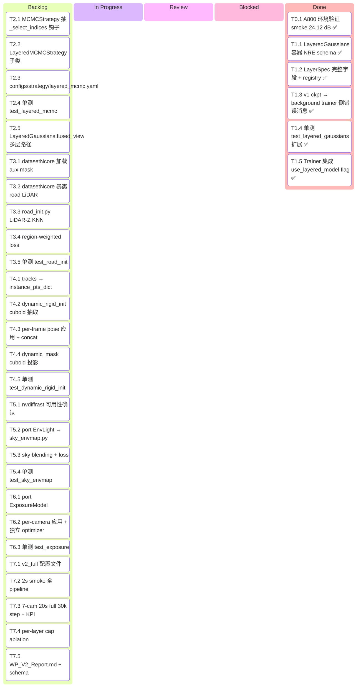
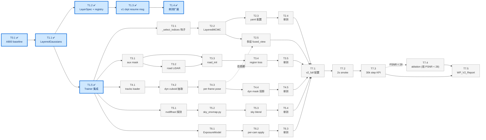
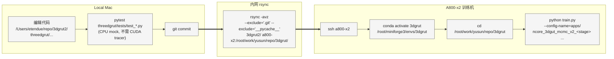

# 3DGRUT v2 — 分层高斯训练 · 可执行计划

> **配套文档**：[v2_architecture.md](v2_architecture.md) 描述模块/流程差异图；[v2_alternative.md](v2_alternative.md) 是备选实现路线。
> **历史讨论**：`~/.claude/plans/a800-x2-10-8-30-cached-sundae.md`（保留原文不动）。
> **本文档作用**：把架构图上的每一处"新增 / 修改"落到具体任务，用看板跟踪进度。

---

## 0. 目标与 KPI

| 维度 | v1 基线 | v2 目标 | NuRec 参考 |
|---|---:|---:|---:|
| 7-cam 20s PSNR | 27.60 | **≥ 28.5** | 36.28 |
| Sky 区域 PSNR | (黑) | **≥ 30** | — |
| Road 区域 PSNR | — | **≥ 32** | — |
| Dynamic vehicle PSNR | — | **≥ 25** | — |
| 30k step 训练时间（A800 单卡） | 35 min @ A100 | ≤ 60 min | — |

**v2 不做**（明确排除）：
- 学习 track pose（用 GT，留 v2.x）
- DynamicDeformable 层粒子分配（仅在 LayeredGaussians 注册占位，留 v3）
- bilateral grid（仅用 affine ExposureModel 占位）
- Cosmos-DiFix 扩散修复（v3）
- C++ tracer 改动（Python 层 concat，renderer 不感知 layer）
- USDZ 打包（V1-6 独立工作包）
- Marching Cubes mesh 导出（V1-5 独立工作包）

---

## 1. 项目看板（Kanban）

> 状态：⬜ Todo · 🟡 In Progress · 🔵 Review · ✅ Done · ⏸ Blocked
> 拖动方法：完成一个任务把行从右上方迁移；遇阻塞标 ⏸ 并在 Risk Log 记录。

### 1.1 顶层看板（按任务，Mermaid Kanban）

> Mermaid 11+ 渲染为五列看板；旧版渲染器会退化为列表，仍可读。



如果你的 Markdown 渲染器不支持 mermaid kanban，可读下表（同源数据）：

| 列 | 任务数 | 关键项 |
|---|---:|---|
| Backlog ⬜ | 27 | T2.x / T3.x / T4.x / T5.x / T6.x / T7.x |
| In Progress 🟡 | 0 | — |
| Review 🔵 | 0 | — |
| Blocked ⏸ | 0 | — |
| Done ✅ | 6 | T0.1, T1.1, T1.2, T1.3, T1.4, T1.5 |

### 1.2 任务级看板（按 Subtask）

> 进度状态：⬜ Todo · 🟡 In Progress · 🔵 Review · ✅ Done · ⏸ Blocked

| ID | Stage | Subtask | 估时(d) | 状态 | 改动 / 新增 |
|---|---|---|---:|:---:|---|
| **T0.1** | 0 | A800 环境验证 + smoke 复跑 | 1 | ✅ | smoke 24.12 dB / 9.48 it/s (2026-05-14) |
| **T1.1** | 1 | LayeredGaussians 容器 + NRE ckpt schema | 1 | ✅ | NEW `layers/layered_model.py` (5a6a5f9) |
| **T1.2** | 1 | LayerSpec 完整字段 + registry | 0.5 | ✅ | MOD `layer_spec.py` · NEW `registry.py` · MOD `trainer.py` + `base_gs.yaml` (60e1154 / 569819b / 6435483) |
| **T1.3** | 1 | v1 flat ckpt → layered["background"] 兼容 | 0.5 | ✅ | MOD `layered_model.py` 错误消息指向 `layers.enabled` (ff83028) |
| **T1.4** | 1 | 单测 test_layered_gaussians.py 扩展 | 1 | ✅ | NEW `test_layer_spec_registry.py` (9 测试) + 3 个 A800 contract test (60e1154 / 569819b / ff83028) |
| **T1.5** | 1 | Trainer 集成 + use_layered_model flag | 0.5 | ✅ | MOD `trainer.py` (5a6a5f9 / 8a29fc0) |
| **T2.1** | 2 | MCMCStrategy 抽 `_select_indices` 钩子 | 0.5 | ⬜ | MOD `strategy/mcmc.py` |
| **T2.2** | 2 | LayeredMCMCStrategy 子类 | 1 | ⬜ | NEW `strategy/layered_mcmc.py` |
| **T2.3** | 2 | configs/strategy/layered_mcmc.yaml | 0.5 | ⬜ | NEW yaml |
| **T2.4** | 2 | 单测 test_layered_mcmc.py | 1 | ⬜ | NEW tests |
| **T2.5** | 2 | LayeredGaussians.fused_view(frame_id) 多层路径 | 1 | ⬜ | MOD `layered_model.py` (T1.5 单层桥之外的多层 forward) |
| **T3.1** | 3 | datasetNcore.py 加载 sky/road/dyn aux mask | 1 | ⬜ | MOD `datasets/datasetNcore.py` |
| **T3.2** | 3 | datasetNcore.py 暴露 road LiDAR 点 | 1 | ⬜ | MOD 同上 |
| **T3.3** | 3 | road_init.py LiDAR-Z KNN + flat scale prior | 1 | ⬜ | NEW `layers/road_init.py` |
| **T3.4** | 3 | trainer.py region-weighted loss | 0.5 | ⬜ | MOD `trainer.py` |
| **T3.5** | 3 | 单测 test_road_init.py | 0.5 | ⬜ | NEW tests |
| **T4.1** | 4 | scene_manifest tracks → instance_dict loader | 1 | ⬜ | MOD `datasets/datasetNcore.py` |
| **T4.2** | 4 | dynamic_rigid_init.py cuboid 内 LiDAR 抽取 | 1.5 | ⬜ | NEW `layers/dynamic_rigid_init.py` |
| **T4.3** | 4 | trainer step 中 per-frame pose 应用 + concat | 1.5 | ⬜ | MOD `trainer.py` · MOD `layered_model.fused_view` |
| **T4.4** | 4 | dynamic_mask cuboid→像素投影 | 0.5 | ⬜ | NEW `layers/dynamic_mask.py` |
| **T4.5** | 4 | 单测 test_dynamic_rigid_init.py | 0.5 | ⬜ | NEW tests |
| **T5.1** | 5 | nvdiffrast.torch 可用性确认 / 降级 SkyModel | 0.5 | ⬜ | A800 env probe |
| **T5.2** | 5 | port EnvLight → correction/sky_envmap.py | 0.5 | ⬜ | NEW `correction/sky_envmap.py` |
| **T5.3** | 5 | trainer step 中 sky blending + loss | 1 | ⬜ | MOD `trainer.py` |
| **T5.4** | 5 | 单测 test_sky_envmap.py | 1 | ⬜ | NEW tests |
| **T6.1** | 6 | port ExposureModel → correction/exposure.py | 0.25 | ⬜ | NEW `correction/exposure.py` |
| **T6.2** | 6 | trainer step per-camera 应用 + 独立 optimizer | 0.5 | ⬜ | MOD `trainer.py` |
| **T6.3** | 6 | 单测 test_exposure.py | 0.25 | ⬜ | NEW tests |
| **T7.1** | 7 | configs/apps/ncore_3dgut_mcmc_v2_full.yaml | 0.5 | ⬜ | NEW yaml |
| **T7.2** | 7 | 2s smoke 全 pipeline 验证 | 0.5 | ⬜ | A800 run |
| **T7.3** | 7 | 7-cam 20s full 30k step + KPI | 1 | ⬜ | A800 run |
| **T7.4** | 7 | per-layer cap ablation (4 组) | 1 | ⬜ | A800 4× runs |
| **T7.5** | 7 | WP_V2_Report.md + scene_manifest v2 schema | 1 | ⬜ | NEW report · MOD schema |
| | | **合计** | **24** | | |

### 1.3 当前 Stage 状态汇总

| Stage | 名称 | 完成 / 总 | 关键产出 |
|---|---|---:|---|
| 0 | A800 环境验证 | 1/1 ✅ | smoke 24.12 dB baseline |
| 1 | Layer 抽象 | 5/5 ✅ | LayeredGaussians + registry + base.yaml 默认 + 9 本地单测 + 3 A800 contract test |
| 2 | Layered MCMC | 0/5 ⬜ | — |
| 3 | Road 层 | 0/5 ⬜ | — |
| 4 | DynamicRigid 层 | 0/5 ⬜ | — |
| 5 | Sky envmap | 0/4 ⬜ | — |
| 6 | Exposure | 0/3 ⬜ | — |
| 7 | 集成 + KPI | 0/5 ⬜ | — |

### 1.4 依赖关系图



---

## 2. Stage 详解

> 已完成的 T0.1 / T1.1 / T1.5 见末尾"Done Log"，此处只展开 ⬜ / 🟡 任务。

### Stage 1 — Layer 抽象（基础设施）

#### T1.2 — LayerSpec 完整字段 + registry

- **目标**：把 layer 描述参数（scale prior / mask gating / lr_mult / is_particle_layer）从 Python 代码挪到配置，未来 ablation 只动 yaml。
- **现状**：`layers/layer_spec.py` 已经是 frozen dataclass，但只含 `name / layer_id / max_n_particles`。
- **改动**：
  - `layers/layer_spec.py`：补字段 `scale_prior: Tuple[float,float,float]`、`scale_lr_mult: float = 1.0`、`mask_field: Optional[str]`、`is_particle_layer: bool = True`、`density_init: float = 0.1`。
  - 新建 `layers/registry.py`：
    ```python
    STANDARD_LAYERS = {
      "background"        : LayerSpec("background",         0,  600_000, (0.1,0.1,0.1)),
      "road"              : LayerSpec("road",               1,  200_000, (0.1,0.1,0.001), scale_lr_mult=0.2, mask_field="road_mask"),
      "dynamic_rigids"    : LayerSpec("dynamic_rigids",     2,  200_000, (0.05,0.05,0.05), mask_field="dynamic_mask"),
      "dynamic_deformables": LayerSpec("dynamic_deformables",3,       0, (0,0,0), is_particle_layer=False),  # v2 占位
      "sky_envmap"        : LayerSpec("sky_envmap",        -1,       0, (0,0,0), mask_field="sky_mask", is_particle_layer=False),
    }
    def specs_from_config(cfg) -> list[LayerSpec]: ...
    ```
- **验收**：`pytest threedgrut/tests/test_layered_gaussians.py::test_registry_specs_have_unique_ids`。

#### T1.3 — v1 flat ckpt → layered["background"] 兼容（trainer 侧）

- **目标**：`Trainer3DGRUT.setup_training` 的 `resume` 路径走 LayeredGaussians 时，能识别 v1 flat ckpt 并自动 route 到 background 层。
- **现状**：`LayeredGaussians.init_from_checkpoint` 已经支持 3 种 ckpt 形态（NRE wrap / 已解开 / v1 flat），T1.1 已完成。但 trainer 的 `setup_training` 路径 A 还需明确：当 `use_layered_model=True` 且 ckpt 是 v1 flat 时，构造 LayeredGaussians 时必须含 `"background"` 层。
- **改动**：`threedgrut/trainer.py::setup_training` 路径 A：
  ```python
  if conf.use_layered_model:
      specs = specs_from_config(conf)
      if not any(s.name == "background" for s in specs):
          raise ValueError("v1 ckpt resume requires 'background' layer in layers.enabled")
      model = LayeredGaussians(conf, specs, scene_extent)
      model.init_from_checkpoint(checkpoint, ...)
  else:
      ...  # v1 path 不动
  ```
- **验收**：A800 上 `python train.py resume=<v1_ckpt_path> use_layered_model=true layers.enabled=[background]` 跑通；val PSNR 与 v1 一致 (±0.05 dB)。

#### T1.4 — 单测 test_layered_gaussians.py 扩展

- 在 T1.1 已有 contract test 基础上补：
  - `test_registry_returns_specs_for_enabled_only`
  - `test_layer_spec_frozen_immutable`
  - `test_v1_ckpt_routed_to_background`（已有，确认 Coverage）
  - `test_multi_layer_ckpt_roundtrip`（新增 2 层 roundtrip 字节级一致）
- **验收**：本地 Mac `pytest threedgrut/tests/test_layered_gaussians.py -v`，case ≥ 8，全部 pass。

---

### Stage 2 — Layered MCMC

#### T2.1 — MCMCStrategy 抽 `_select_indices` 钩子

- **目标**：把现有 `relocate_gaussians / add_new_gaussians / perturb_gaussians` 改成"先选 mask 再操作"两阶段，子类 override mask 选取即可。
- **改动**：`threedgrut/strategy/mcmc.py`：
  ```python
  def _select_indices(self, model) -> torch.BoolTensor:
      return torch.ones(model.num_gaussians, dtype=torch.bool, device=model.device)

  def relocate_gaussians(self, model, optimizer):
      idx = self._select_indices(model)
      # 现有 tensor 操作前面切 idx
  ```
- **关键不变量**：基类行为对 v1（单层）byte-identical。
- **验收**：用 v1 ckpt 跑 1000 step，重构前后 MCMC 关键指标（粒子数曲线、relocation rate、PSNR）字节级一致；通过现有 v1 MCMC 单测。

#### T2.2 — LayeredMCMCStrategy 子类

- **目标**：MCMC 三个操作在每层独立执行，per-layer cap，跨层无迁移。
- **改动**：`threedgrut/strategy/layered_mcmc.py` ~100 行：
  ```python
  class LayeredMCMCStrategy(MCMCStrategy):
      def __init__(self, conf, model: LayeredGaussians, specs: list[LayerSpec]):
          super().__init__(conf, model)
          self.specs = specs

      def post_optimizer_step(self, step):
          for spec in self.specs:
              if not spec.is_particle_layer:
                  continue
              self._current_layer = spec.name
              self._current_cap = spec.max_n_particles
              super().post_optimizer_step(step)

      def _select_indices(self, model):
          return model.get_layer_mask(self._current_layer)
  ```
  Trainer factory：
  ```python
  if conf.strategy.method == "LayeredMCMCStrategy":
      strategy = LayeredMCMCStrategy(conf.strategy, model, specs)
  ```
- **验收**：见 T2.4。

#### T2.3 — configs/strategy/layered_mcmc.yaml

```yaml
defaults: [mcmc]
method: LayeredMCMCStrategy
per_layer_max_n:
  background:      600000
  road:            200000
  dynamic_rigids:  200000
```
- **验收**：`python train.py --config-name apps/... --cfg job` 查看 strategy 段合并正确。

#### T2.4 — 单测 test_layered_mcmc.py

- `test_per_layer_cap_respected`：3 层 mock，add 100 步后每层 ≤ cap。
- `test_no_cross_layer_migration`：relocate 1000 步后，初始 layer 归属不变（用 `get_layer_mask` 对比）。
- `test_falls_back_to_global_when_single_layer`：只有 bg 时行为 ≡ v1 MCMC。
- **验收**：本地 Mac CPU mock 跑 < 2 秒，全部 pass。

#### T2.5 — LayeredGaussians.fused_view 多层路径

- **目标**：T1.5 ✅ 已实现单 bg 透传；T2.5 实现真正 N 层 concat。
- **改动**：`layers/layered_model.py`：
  ```python
  def fused_view(self, frame_id: Optional[int] = None) -> dict[str, Tensor]:
      """Return flat tensors (positions/rotation/scale/density/SH) concat across layers.
      Dynamic layers (T4.3) apply per-frame pose transform inline."""
      ...
  def forward(self, batch, train=True, frame_id=...):
      flat = self.fused_view(frame_id)
      return self._render(flat, batch, train)  # 调 background.renderer 或共享 tracer
  ```
- **依赖**：和 T4.3 协作；先在 Stage 2 跑通 bg + road 两层 concat，再 Stage 4 加 dynamic pose 变换。
- **验收**：bg + road 2 层 concat 后渲染，单帧 RGB 与"bg only + road only 分别渲染再 alpha 合成"在 PSNR 内一致（验证 concat 数学正确性）。

---

### Stage 3 — Road 层

#### T3.1 — datasetNcore.py 加载 sky/road/dynamic aux mask

- **目标**：dataloader 输出 `image_infos` 中新增 `sky_mask / road_mask / dynamic_mask_sseg`（per-frame per-camera）。
- **改动**：`datasets/datasetNcore.py`：
  - `__init__` 加 `load_aux_masks: bool = False`
  - 新方法 `_load_sseg_masks(camera_id, frame_idx)` 读 `aux.sseg.zarr.itar`：
    ```python
    sseg = self._sseg_reader.read(camera_id, frame_idx)
    return {
      "sky_mask":           (sseg == SKY_CLASS_ID).float(),
      "road_mask":          (sseg.isin(ROAD_CLASS_IDS)).float(),
      "dynamic_mask_sseg":  (sseg.isin(DYNAMIC_CLASS_IDS)).float(),
    }
    ```
  - Class ID 来自 `ncore.semantic.NCORE_SEMANTIC_LABELS`。
- **验收**：抽 1 帧 → 三 mask 之和 + 其他 ≈ 1.0；road_mask 可视化吻合路面。

#### T3.2 — datasetNcore.py 暴露 road LiDAR 点接口

- **目标**：为 road_init 提供"分类为路面"的 LiDAR 点。
- **改动**：`datasetNcore.py`：
  ```python
  def get_road_lidar_points(self) -> Tuple[Tensor, Tensor]:
      pts, labels = self._lidar_sseg_reader.read_all()
      mask = torch.isin(labels, torch.tensor(ROAD_CLASS_IDS))
      return pts[mask], self._project_colors(pts[mask])
  ```
- **验收**：clip 3435ace9 → road pts 数 ∈ [10K, 500K]；Z std < 0.5 m；BEV plot 形态合理。

#### T3.3 — road_init.py LiDAR-Z KNN + flat scale prior

- **目标**：基于 road LiDAR 构造 200K 路面粒子，scale [0.1, 0.1, 0.001]，Z 由 KNN 拉到最近路面点。
- **改动**：新建 `layers/road_init.py`：
  ```python
  def init_road_layer(road_points, ego_trajectory, cut_range=30.0, resolution=0.05, max_n=200_000):
      xy_min = ego_trajectory[:, :2].min(0).values - cut_range
      xy_max = ego_trajectory[:, :2].max(0).values + cut_range
      grid_xy = make_bev_grid(xy_min, xy_max, resolution)   # [M, 2]
      # 用 torch.cdist 而非 pytorch3d.knn → 避开 PyTorch3D 依赖
      dists = torch.cdist(grid_xy.unsqueeze(0), road_points[:, :2].unsqueeze(0))[0]
      nearest = dists.argmin(1)
      grid_z = road_points[nearest, 2]
      positions = torch.stack([grid_xy[:, 0], grid_xy[:, 1], grid_z], dim=1)
      scales = torch.log(torch.tensor([0.1, 0.1, 0.001])).expand(M, 3)
      ...
      return positions, rotations, scales, densities, albedo
  ```
- **验收**：见 T3.5。

#### T3.4 — trainer.py region-weighted loss

- **改动**：`threedgrut/trainer.py::get_losses`：
  ```python
  if conf.trainer.layered_loss:
      valid = image_infos["valid_pixel_mask"]
      sky   = image_infos["sky_mask"]
      road  = image_infos["road_mask"]
      dyn   = image_infos["dynamic_mask"]    # cuboid 投影 (T4.4) 优先；fallback sseg
      bg    = valid * (1 - road) * (1 - dyn) * (1 - sky)

      l1 = (rgb_pred - rgb_gt).abs()
      loss = (
          (l1 * bg  ).sum() / (bg  .sum() + 1e-6)
        + (l1 * road).sum() / (road.sum() + 1e-6)
        + (l1 * dyn ).sum() / (dyn .sum() + 1e-6)
      )
  else:
      loss = (rgb_pred - rgb_gt).abs().mean()   # v1 行为
  ```
- **验收**：mock 4x4 图 + 已知 mask → 数值对账；集成 500 步路面 Z std 仍 < 0.005。

#### T3.5 — 单测 test_road_init.py

- `test_road_init_z_lock`：mock 100 路面点 Z=0 → init 后所有 Z 误差 < 0.05 m
- `test_road_init_scale_flat`：scales.exp()[:, 2] < 0.005
- `test_road_init_handles_empty_lidar`：空 tensor 不 crash
- `test_road_init_respects_max_n`：500K 候选 → ≤ 200K 输出
- **验收**：本地 Mac pytest 全 pass < 1 秒。

---

### Stage 4 — DynamicRigid 层

> NVIDIA NuRec 命名 = "dynamic_rigids"（OmniRe 称 `RigidNodes`）

#### T4.1 — scene_manifest tracks → instance_pts_dict loader

- **OmniRe 参考 schema** (`drivestudio/datasets/driving_dataset.py:263-396`)：
  ```
  instance_pts_dict[track_id] = {
      "pts":        [N, 3] local-frame Gaussian means (T4.2 填)
      "colors":     [N, 3] (T4.2 填)
      "poses":      [num_frame, 4, 4] object→world SE(3)
      "size":       [3] cuboid 半轴
      "frame_info": [num_frame] bool active
      "class":      str
  }
  ```
- **改动**：`datasets/datasetNcore.py::load_tracks_from_manifest(manifest_path)` 解析 WP V1-1 manifest tracks 字段，**字段对应清晰**（manifest 已含 poses/extent/active_frames）。
- **验收**：clip 3435ace9 → `len(instance_pts_dict) == 11`，每 track 的 `poses.shape == [num_frame, 4, 4]` 一致。

#### T4.2 — dynamic_rigid_init.py cuboid 内 LiDAR 抽取

- **改动**：新建 `layers/dynamic_rigid_init.py`：
  ```python
  def init_dynamic_rigid_layer(instance_pts_dict, dynamic_lidar_points, max_pts_per_track=5000):
      for track_id, info in instance_pts_dict.items():
          collected = []
          for frame_idx in info["frame_info"].nonzero().squeeze(-1):
              pose_inv = torch.linalg.inv(info["poses"][frame_idx])
              local_pts = (pose_inv[:3, :3] @ dynamic_lidar_points[:, :3].T).T + pose_inv[:3, 3]
              mask = (local_pts.abs() <= info["size"] / 2).all(dim=1)
              collected.append(local_pts[mask])
          all_pts = torch.cat(collected)
          if len(all_pts) > max_pts_per_track:
              all_pts = all_pts[torch.randperm(len(all_pts))[:max_pts_per_track]]
          info["pts"] = all_pts
          info["colors"] = ...  # 同样从 LiDAR RGB 抽
      return instance_pts_dict
  ```
- **设计选择**：不复制 OmniRe `RigidNodes`（依赖 `ctrl_cfg` / `instances_quats` 学习接口），只借 schema + transform_means 模式，重写适配 3dgrut2。
- **验收**：见 T4.5。

#### T4.3 — trainer step 中 per-frame pose 应用 + concat

- **核心点**：dynamic_rigids 粒子 `positions` 存的是 **object-local frame**；每 step 临时算 world frame，**不进 Parameter**（pose 不学习）。
- **改动**：`layers/layered_model.py::fused_view(frame_id)` 内：
  ```python
  for spec in self.specs:
      layer = self.layers[spec.name]
      if spec.name == "dynamic_rigids":
          world_pts = self._transform_means(layer.positions, layer.track_ids, frame_id, self.tracks_poses)
          pieces.append(world_pts)
      elif spec.is_particle_layer:
          pieces.append(layer.positions)
  fused_positions = torch.cat(pieces, dim=0)
  ```
  `_transform_means` 参考 `drivestudio/models/nodes/rigid.py:315-362`，**模式参考重写**。
- **验收**：mock 单 track 单粒子，frame 0 / N-1 两端 world 位置匹配；训练 5k 步渲染视频，车辆不漂移。

#### T4.4 — dynamic_mask.py cuboid → 像素 mask 投影

- **为什么不用 sseg**：sseg 含未跟踪的物体（traffic cone 等），会让 dynamic 层学不属于自己的内容；cuboid 投影精确对应 track。
- **改动**：新建 `layers/dynamic_mask.py`：
  ```python
  def project_cuboids_to_mask(tracks, frame_idx, K, T_world2cam, H, W) -> Tensor[H, W]:
      mask = torch.zeros(H, W)
      for tid, info in tracks.items():
          if not info["frame_info"][frame_idx]: continue
          corners_local = make_cuboid_corners(info["size"])       # [8, 3]
          corners_world = info["poses"][frame_idx] @ corners_local
          corners_img = project_points(corners_world, K, T_world2cam)
          mask = fill_convex_hull(mask, corners_img)
      return mask
  ```
- **验收**：渲染一帧 mask 与 GT video 车辆位置吻合。

#### T4.5 — 单测 test_dynamic_rigid_init.py

- `test_local_frame_transform_roundtrip`：world→local→world 数值一致
- `test_cuboid_filter`：超出 size/2 的点被剔除
- `test_subsample_respects_max_pts`：> max_pts 后输出 ≤ max_pts
- `test_per_frame_pose_correct`：mock 1 track，frame 0/N-1 端点位置正确
- **验收**：本地 Mac pytest 全 pass < 1 秒。

---

### Stage 5 — Sky envmap

#### T5.1 — nvdiffrast.torch 可用性 / 降级 SkyModel

```bash
ssh a800-x2 && conda activate 3dgrut && python -c "import nvdiffrast.torch; print('ok')"
```
若失败 → `pip install nvdiffrast`；若仍失败 → T5.2 降级为 MLP 版 SkyModel（drivestudio 也有备份）。

#### T5.2 — port EnvLight → correction/sky_envmap.py

- **改动**：新建 `threedgrut/correction/sky_envmap.py`，**直接复制** `drivestudio/models/modules.py:174-205` 的 `EnvLight`：
  ```python
  class SkyEnvmap(nn.Module):
      def __init__(self, resolution=512):
          super().__init__()
          self.to_opengl = torch.tensor([[1,0,0],[0,0,1],[0,-1,0]], dtype=torch.float32).cuda()
          self.base = nn.Parameter(0.5 * torch.ones(6, resolution, resolution, 3))

      def forward(self, viewdirs):
          l = (viewdirs.reshape(-1, 3) @ self.to_opengl.T).reshape(*viewdirs.shape).contiguous()
          ...
          return dr.texture(self.base[None], l, filter_mode='linear', boundary_mode='cube').view(*prefix, -1)
  ```

#### T5.3 — trainer step 中 sky blending + loss

- **改动**：`trainer.py`：
  ```python
  rgb_gauss, alpha = self.model(batch, train=True)
  if conf.trainer.use_sky_envmap:
      viewdirs = compute_per_pixel_viewdirs(batch)
      rgb_sky = self.sky_envmap(viewdirs)
      rgb_final = rgb_gauss + rgb_sky * (1 - alpha)
      sky_loss = ((rgb_sky - rgb_gt).abs() * sky_mask).sum() / (sky_mask.sum() + 1e-6)
      total_loss += conf.loss.lambda_sky * sky_loss
  ```
  参考 `drivestudio/models/trainers/scene_graph.py:252-253` 的 blend 模式。

#### T5.4 — 单测 test_sky_envmap.py

- `test_envmap_shape`：`base.shape == [6, 512, 512, 3]`
- `test_envmap_forward_shape`：viewdirs `[B, 3]` → out `[B, 3]`
- `test_envmap_no_nvdiffrast_fallback`：mock 缺 nvdiffrast → 落到 MLP 路径
- **验收**：3k 步后 envmap +Z face 明显偏蓝；sky 区 PSNR ≥ 30。

---

### Stage 6 — 每相机曝光占位

#### T6.1 — port ExposureModel

- **改动**：新建 `threedgrut/correction/exposure.py`，**直接复制** Recon-Studio `models/luxury/exposure.py`（29 行），仅改 import 路径。
- **设计选择**：用 affine `exp(a)*img + b` 占位；完整 bilateral grid 留 v3。

#### T6.2 — trainer step per-camera 应用 + 独立 optimizer

```python
self.exposure_model = ExposureModel(num_camera=len(camera_ids)).cuda()
self.exposure_optimizer = torch.optim.Adam(self.exposure_model.parameters(), lr=1e-3)

# 在 trainer step：
rgb_pred = self.exposure_model(batch.camera_idx, rgb_pred)
loss.backward()
self.optimizer.step()
self.exposure_optimizer.step()
self.exposure_optimizer.zero_grad()
```

#### T6.3 — 单测 test_exposure.py

- `test_single_camera_is_identity`：num_camera=1 时输出 == 输入
- `test_zero_init_is_identity`：`exp(0)*img + 0 == img`

---

### Stage 7 — 集成 + 7-cam 20s 训练 + KPI

#### T7.1 — configs/apps/ncore_3dgut_mcmc_v2_full.yaml

```yaml
defaults:
  - ncore_3dgut_mcmc
  - override /strategy: layered_mcmc

use_layered_model: true
layers:
  enabled: [background, road, dynamic_rigids, sky_envmap]
  # dynamic_deformables 注册但不分配粒子 (v2 占位)

dataset:
  load_aux_masks: true

trainer:
  layered_loss: true
  use_sky_envmap: true
  use_exposure: true
  exposure_lr: 0.001
```

#### T7.2 — 2s smoke 全 pipeline 验证

```bash
ssh a800-x2 && conda activate 3dgrut && cd /root/work/yusun/repo/3dgrut
export CUDA_VISIBLE_DEVICES=1
export PYTORCH_CUDA_ALLOC_CONF=expandable_segments:True
python -u train.py --config-name apps/ncore_3dgut_mcmc_v2_full \
  path=/root/work/yusun/ncore-nurec/data/ncore/clips/9ae151dc-.../pai_9ae151dc-...json \
  out_dir=/root/work/yusun/ncore-nurec/output/smoke_v2_<ts> \
  n_iterations=1000 \
  dataset.train.duration_sec=2.0 \
  'dataset.camera_ids=[camera_front_wide_120fov]'
```
- **验收**：exit 0；各层粒子数日志 bg ~600K / road ~200K / dyn ~50-200K；loss 下降不发散。

#### T7.3 — 7-cam 20s full 30k step + KPI

```bash
python -u train.py --config-name apps/ncore_3dgut_mcmc_v2_full \
  path=/root/work/yusun/ncore-nurec/data/ncore/clips/.../pai_....json \
  out_dir=/root/work/yusun/ncore-nurec/output/v2_full_run1 \
  n_iterations=30000
```
- **验收**：

| 维度 | 目标 |
|---|---:|
| 7-cam 20s PSNR | ≥ 28.5 |
| Sky 区 PSNR | ≥ 30 |
| Road 区 PSNR | ≥ 32 |
| Dynamic vehicle PSNR | ≥ 25 |
| 训练时间 | ≤ 60 min |

PSNR < 28.0 → 进入 T7.4。

#### T7.4 — per-layer cap ablation（仅在 T7.3 未达目标时执行）

4 组（每组 30k 步，A800 各约 60 分钟）：

| 组 | background | road | dynamic_rigids |
|---|---:|---:|---:|
| A | 600K | 200K | 200K |
| B | 700K | 200K | 100K |
| C | 500K | 300K | 200K |
| D | 800K | 100K | 100K |

- **教训挂点**（2026-05-09 #209）：KPI 归因不要草率，每组都拆 region PSNR（路面/动态/背景），不只看全局。

#### T7.5 — WP_V2_Report.md + scene_manifest v2 schema

- 新建 `WP_V2_Report.md`，镜像 `WP_V1-1_Report.md` 结构：
  - 设计概要（4 层 + Layered MCMC + Sky + Exposure）
  - 实现路径（文件清单引用本 plan T1-T7）
  - KPI 表（v1 vs v2 vs NuRec 三列 + region 拆解）
  - Ablation 结果（T7.4 4 组）
  - 已知限制（V2-4 pose 不学、bilateral grid 占位、deformable 未实现）
  - 下一步（V2-4 pose calib、V1-6 USDZ 对接）
- 更新 `schemas/scene_manifest.schema.json`：加可选 `layer_assignments`。

---

## 3. 开发工作流



**A800 已知 caveats（T0.1 已踩坑）**：
1. GPU 共享：两张 A800 各被外部进程占 ~57 GiB，可用 ~22 GiB/卡 → `CUDA_VISIBLE_DEVICES=1` + `PYTORCH_CUDA_ALLOC_CONF=expandable_segments:True`
2. CUDA kernel 首次编译 ~3 min（缓存在 `/root/.cache/torch_extensions/py311_cu118/`）
3. 多相机必须显式 `dataset.camera_ids=[...]`
4. 数据路径 `/root/work/yusun/ncore-nurec/data/ncore/clips/...`（NFS）

---

## 4. Risk Register

| 风险 | 缓解 | 任务挂点 |
|---|---|---|
| `nvdiffrast.torch` 在 A800 conda env 不存在 | T5.1 起手探测；不可用降级 SkyModel MLP | T5.1 |
| Per-layer cap 配比对 KPI 影响大 | T7.4 ablation 4 组 | T7.4 |
| Track pose 不学习时 dynamic 粒子漂移 | 训练前 NCore validator strict mode 过滤低置信 track；漂移严重则 V2-4 提前 | T4.3 |
| Recon-Studio `surface.py` 依赖 PyTorch3D | T3.3 用 `torch.cdist` 替代 `knn_points`，借算法不借实现 | T3.3 |
| 路面 LiDAR 语义质量差 | T3.2 起手 BEV 可视化；必要时加 plane fit fallback | T3.2 |
| NFS 性能拖累 import 时间 | conda env 本地盘；若长期慢则 rsync repo 到 `/data/repo/` | — |
| Renderer 接口被意外修改 | tracer Python binding `git diff` 必须为空 | 所有 Stage |
| MCMC 抽象重构改变 v1 行为 | T2.1 必须 byte-identical 验证 | T2.1 |

---

## 5. Done Log

### T0.1 ✅ (2026-05-14 16:55-16:57，smoke)

A800-x2 单卡 1k step × 2s × 单相机：

| 指标 | 实际 |
|---|---:|
| Mean PSNR | 24.12 dB |
| Mean SSIM | 0.846 |
| Mean LPIPS | 0.405 |
| 训练耗时 | 105.4 s |
| 训练吞吐 | 9.48 it/s（A100 同条件 ~3.9 it/s，A800 快 2.4×） |

**与原计划偏差（影响下游）**：
- clip 是 `9ae151dc-e87b-41a7-8e85-71772f9603d7`（不是文档误写的 `3435ace9`）
- 路径在 `/root/work/yusun/ncore-nurec/data/ncore/` 而非 `/data/pai_ncore/`
- 必须 `CUDA_VISIBLE_DEVICES=1` + `PYTORCH_CUDA_ALLOC_CONF=expandable_segments:True`
- 多相机必须显式 `dataset.camera_ids=[...]`

### T1.1 ✅ (2026-05-16, commit b0865c4 + 6f86c62 + 8a29fc0 + 5a6a5f9)

LayeredGaussians 容器（`threedgrut/layers/layered_model.py`）：
- `ModuleDict[name → MixtureOfGaussians]`
- NRE 对齐 ckpt schema：`ckpt["model"]["gaussians_nodes"][name]`
- 支持 3 种 ckpt 输入：NRE wrap / 已解开 / v1 flat（自动 route 到 "background"）
- 单 bg 层桥接：透传 attr 读写，让 v1 trainer/MCMC 代码完全无感
- 单测：bit-level v1 ckpt 兼容 + single-bg bridge

A800 smoke 验证：PSNR 24.084 dB / 9.87 it/s；v1 resume 24.123 dB **byte-identical** with `use_layered_model=false`。

### T1.5 ✅ (2026-05-16, commit 8a29fc0 + 5a6a5f9)

Trainer 集成：
- `train.py` 加 `use_layered_model` flag
- `Trainer3DGRUT.setup_training` 支持 LayeredGaussians 分支
- `forward` bridge 让 `self.model(batch, train=...)` 在单 bg 模式下正常工作

### T1.2 ✅ (2026-05-18, commit 60e1154 + 569819b + 6435483)

LayerSpec 完整字段 + registry + trainer wiring：

- `layers/layer_spec.py`：T1.1 的 3 字段 (`name/layer_id/max_n_particles`) → 8 字段，新增 `scale_prior / scale_lr_mult / mask_field / is_particle_layer / density_init`，全部默认值，向后兼容
- `layers/registry.py` 新建：`STANDARD_LAYERS` dict 注册 5 个标准层（background / road / dynamic_rigids / dynamic_deformables / sky_envmap），`specs_from_config(conf)` 工厂按 `conf.layers.enabled` 过滤、保序、未知名抛 ValueError
- `layers/__init__.py`：导出 `LayerSpec / STANDARD_LAYERS / specs_from_config`；`LayeredGaussians` 用 try/except 懒导出（dev 笔记本无 torch 时 package 仍可 import）
- `threedgrut/trainer.py::init_model`：原硬编码单 bg `LayerSpec(...)` → `specs_from_config(conf)`；日志输出实际层名 list
- `configs/base_gs.yaml` 加默认 `use_layered_model: false` 和 `layers.enabled: [background]`（plan 误称 `base.yaml`，实际项目根 yaml 是 `base_gs.yaml`，继承链 `apps/ncore_3dgut_mcmc → base_mcmc → base_gs`）

本地 Mac 验证：

| 指标 | 实际 |
|---|---:|
| `pytest test_layer_spec_registry.py` | 9/9 PASS |
| hydra compose 默认 | `use_layered_model=False / layers.enabled=['background']` |
| hydra compose override `[background,road]` | OK |

A800 端 byte-identical resume 待执行（见 plan Verification 节）。

### T1.3 ✅ (2026-05-18, commit ff83028)

v1 flat ckpt resume 在 LayeredGaussians 路径下的错误消息改良：

- `layers/layered_model.py::init_from_checkpoint` 第 122-129 行：当 ckpt 是 v1 flat 形态但 `self.layers` 不含 "background" 时，错误消息从 "no 'background' layer configured" 改为 "'background' layer is not in conf.layers.enabled (got [...])"，并明确告知"Add 'background' to layers.enabled"
- 配套 2 个 A800 contract test：`test_v1_ckpt_resume_without_background_layer_raises` (regex match `layers.enabled`) / `test_v1_ckpt_resume_with_background_layer_works`

A800 端验证待跑（rsync + `python train.py resume=<v1_ckpt> use_layered_model=true layers.enabled=[background]`）。

### T1.4 ✅ (2026-05-18, commit 60e1154 + 569819b + ff83028)

单测覆盖扩展：

- 新文件 `threedgrut/tests/test_layer_spec_registry.py`（9 测试，Mac 本地可跑，无 torch 依赖）：
  - `test_layer_spec_frozen_immutable`：FrozenInstanceError 验证
  - `test_layer_spec_full_field_defaults`：8 字段默认值 + 显式赋值透传
  - `test_registry_standard_layers_complete`：5 层全员
  - `test_registry_specs_have_unique_ids`：layer_id 唯一
  - `test_registry_particle_flags_correct`：sky/deformable 非粒子层
  - `test_registry_road_layer_has_flat_scale_prior`：Z-lock 约定 + mask_field
  - `test_specs_from_config_filters_enabled`：按 enabled 过滤保序
  - `test_specs_from_config_unknown_layer_raises`：未知名 ValueError
  - `test_specs_from_config_defaults_to_single_background`：空 conf fallback
- `threedgrut/tests/test_layered_gaussians.py` 追加 3 个 A800 contract test：`test_v1_ckpt_resume_without_background_layer_raises` / `test_v1_ckpt_resume_with_background_layer_works` / `test_multi_layer_ckpt_roundtrip`

测试矩阵：v1 时代 6 个 contract test + v2 Stage 1 共 9 + 3 = 12 个新测试 = **18 个总测试**（Mac 本地 9 + A800 9）。

**Stage 1 出口**：T1.1 - T1.5 全 ✅；解锁 Stage 2 (LayeredMCMC) 与 Stage 3 (Road) 并行开发窗口。

---

> 文档结束。当前应优先处理：**T2.1 / T3.1 并行**（T2.x 与 T3.x 之间无强依赖，dataloader 改完即可同时推进 MCMC 重构）。
