# 3DGRUT v3 — NuRec 缺口闭合 + 新视角扰动鲁棒性 · 可执行计划

> **配套文档**：`v2_plan.md`（v2 已结题，本计划承接 § 14 全部 V3-* / V4 任务种子）·`v2_architecture.md`（v2 模块/流程图）·`v3_architecture.md`（待 Stage 9 T9.0 任务创建）
> **评估输入**：`/Users/etendue/repo/3dgrut2/according-to-oss-sim-roadmap-md-how-zazzy-harbor.md`（V3-1..V3-4 pillar 视角）
> **本文档作用**：把 v2_plan.md § 14 全部 V3-* / V4 任务种子落到具体 Stage + 任务卡，承担 v3 整体看板与状态跟踪。

---

## 0. 目标与 KPI

### 0.1 v3 核心方向（用户补充澄清，2026-05-22）

**v2 Stage 8 viser_gui_4d 交互式可视化实证发现**：
- ✅ **Reconstructed view**（训练视角附近）：质量不错，cc_psnr_masked 24.70 dB，与 v2 设计预期一致
- ❌ **Novel view degradation 严重**：一旦视角偏离（位置 ±1m+ / 角度 ±5°+），质量大幅下降——天空爆黑洞、动态对象漂移、反射 view-dependent 失效、几何远景模糊

**v3 主目标重新定位**：把 **novel view generation 质量提升到 ~30 dB**，作为 v3 主 KPI。
Reconstructed cc_psnr_masked 退为辅指标——只要不显著退化（≥ v2 24.70）即可，**不再追求训练视角 30/34 dB**。

### 0.2 KPI 双档（主 KPI 切换为 novel-view PSNR）

| 档位 | 触发 Stage | **★ Novel-view PSNR ★** | Novel Sky PSNR | Novel Dynamic PSNR | Reconstructed cc_psnr_masked (辅) | LPIPS 改善 |
|---|---|---:|---:|---:|---:|---:|
| v2 baseline | Stage 7 (旧, 非对称 5cam) | **~ 待 Stage 8.5 实测**（估测 18-22 dB） | 严重黑洞 | 严重漂移 | 24.70 | baseline |
| **v3 baseline (T8.5.7)** | Stage 8.5 (对称 5cam 30k) | 待 T8.5.3/4 测 | 待测 | 待测 | **26.04** ★ (E2b, +1.34 vs Stage 7) | baseline |
| **v3 baseline 重生 ✅ (2026-06-03, 从头30k A)** | LiDAR+R2+exempt | **novel LPIPS 0.5987** (主KPI口径, 略优于旧 0.6022) | — | — | **25.79** (lidar_psnr 22.69) | baseline |
| **v3 保守门槛（必达）** | Stage 15 出口 | **≥ 28.0** | ≥ 28 | ≥ 25 | ≥ v3 baseline (26.04, 不退化) | ≥ 25% |
| **v3 进取目标** | Stage 17 出口 | **≥ 30.0** ★ 用户目标 | ≥ 30 | ≥ 28 | ≥ 26.5 | ≥ 35% |
| NuRec 理论极限（留 v4） | — | ~32-34（含 DiFix 专有数据） | — | — | 36.28 reconstructed | — |

**双档说明**：
- **保守门槛 Stage 15**（Cosmos-DiFix 渐进蒸馏后）必达 novel-view ≥ 28，否则 v3 不结题。
- **进取目标 Stage 17 完成 ≥ 30** — 用户明确目标，v3 应努力达成（虽然标 stretch 但是用户主线诉求）
- Reconstructed cc_psnr_masked 不再设激进目标——只监控不退化（≥ 24.70）。v3 训练增加监督可能短期拉低 reconstructed（trade-off for novel-view），可接受 24.0 容忍下限。
- NuRec 36.28 是 **reconstructed view** 数字；其 novel-view PSNR 未公开，估测 ~32-34，需 DiFix 专有数据，留 v4。

### 0.3 v3 不做（明确排除，转 v4 backlog）

- NuRec 专有 DiFix 训练数据集复现（v3 用开源 Cosmos-DiFix NGC 公开 checkpoint，novel-view 上限差 +2-4 dB）
- 跨 clip 大规模联训（v3 仍单 clip 训练）
- USDZ 打包（V1-6 独立工作包，与 v3 解耦）
- Marching Cubes mesh 导出（V1-5 独立工作包）
- **追求训练视角 NuRec 36.28 reconstructed**——v3 关心的是 novel-view，不优化训练视角到极致

### 0.4 v3 baseline（v2 出口实测数 + Stage 8.5 必须补测 novel-view）

| 维度 | v2 Stage 7 实测 | v3 Stage 9 起点 |
|---|---:|---:|
| `mean_psnr` (full, reconstructed) | 23.78（exposure OFF） | 用 exposure OFF baseline |
| `mean_psnr_masked` (reconstructed) | 25.76（exposure OFF, Stage 7 非对称 5cam） / **15.29**（exposure ON, T8.5.7 对称 5cam 30k —— exposure 退化已知问题, V3-P1 修复） | 用对称 5cam baseline |
| `mean_cc_psnr_masked` (reconstructed) | 24.70（Stage 7 非对称 5cam, σ < 0.2 dB） / **26.04** ★（T8.5.7 对称 5cam 30k） | v3 辅 KPI baseline 更新为 26.04 |
| **Novel-view LPIPS (4 档 avg, 主 KPI)** | T8.5.4 旧 baseline 0.6022 | **v3 baseline 重生 (2026-06-03 从头30k A): 0.5987 ✅** (略优; cc_psnr 25.79, lidar_psnr 22.69) |
| Sky region PSNR (reconstructed) | Stage 5 出口 ≥ 30，30k 训练后衰减 | Stage 10 重新达标 |
| **Novel Sky region** | **❓ 视觉验证已知严重黑洞** | Stage 8.5 量化 |
| **Novel Dynamic region** | **❓ 视觉验证已知严重漂移** | Stage 8.5 量化 |
| 4 层粒子规模 | bg 1M + road 200K + dyn 200K (70 tracks) + sky MLP | 维持 |
| 训练速度 | 9.80 it/s @ A800 | 维持（v3 增加监督会略降，目标 ≥ 7 it/s） |
| ckpt baseline 路径 | `a800-x2:/root/work/yusun/ncore-nurec/output/stage7_noexp_20260521-102930/.../ckpt_30000.pt`（991 MB） | v3 Stage 9 从此 ckpt 续训 |

**Stage 8.5 强制前置任务**：必须实测 v2 baseline 的 **novel-view PSNR（±1m / ±2m / ±5° / ±10° pose 扰动 4 档）** 作为 v3 起点，否则 v3 进展无法量化。

---

## 1. 项目看板（Kanban）

> 状态：⬜ Todo · 🟡 In Progress · 🔵 Review · ✅ Done · ⏸ Blocked · ⏭ Skip

### 1.1 顶层看板（Mermaid Kanban）


> Flowchart 在 VSCode/Markdown 中可正常渲染；若不支持则退化为文本列表。

降级表（同源数据）：

| 列 | 任务数 | 关键项 |
|---|---:|---|
| Backlog ⬜ | **57** | Stage 8.5 (5) + 9 (6) + 10 (4) + 11 (6) + 12 (8) + 13a (7) + 13b (7) + 14 (7) + 15 (7) + 16 (5) + 17 (3) + 18 (3) — 含 T9.0 架构图任务 |
| Done ✅ | **1** | T8.5.7 V3-E4 (5-cam vs 7-cam KPI 对照 + 对称 5-cam 切换) |
| In Progress 🟡 | 0 | — |
| Review 🔵 | 0 | — |
| Blocked ⏸ | 0 | — |
| Done ✅ | 0 | v3 启动中 |

### 1.2 任务级看板（按 T*.* 编号）

> 进度状态：⬜ Todo · 🟡 In Progress · 🔵 Review · ✅ Done · ⏸ Blocked · ⏭ Skip
> "改动 / 新增" 列在任务完成后填实际 commit 短 hash 与改动文件

| ID | Stage | Subtask | V3-* 锚 | 估时(d) | 状态 | 改动 / 新增 |
|---|---|---|---|---:|:---:|---|
| **T8.5.1** | 8.5 | R3/R4 投影参数 (`min_projected_ray_radius` ≈ √(1/3), `image_margin_factor=0.1`) 校对 + 校对值入档 | V3-R3/R4 | 0.5 | ⬜ | — |
| **T8.5.2** | 8.5 | cuboid padding 设计草案 + LayerSpec 字段预留（不实现，给 T13a.5/6 用） | V3-D6/D7 设计 | 0.5 | ⬜ | — |
| **T8.5.3** ★ | 8.5 | Novel-view pose 生成器 + hold-out 验证集（±1m / ±2m / ±5° / ±10° 4 档 pose 扰动）+ render.py 接入 | NEW `threedgrut/utils/novel_view.py` | 1.5 | ⬜ | — |
| **T8.5.4** ★ | 8.5 | v2 baseline novel-view PSNR 实测（4 档 × {full / sky / dyn / bg 区域}）+ metrics.json novel_* 字段定义 | A800 + `render.py` eval | 1 | ⬜ | — |
| **T8.5.5** | 8.5 | A800 5k smoke 验证投影校对无回归（reconstructed cc_psnr_masked ≥ 24.7 不退化 + novel-view baseline 入档） | — | 1 | ⬜ | — |
| **T8.5.7** ★ | 8.5 | V3-E4 7-cam vs 5-cam KPI 对照实验 + per-camera PSNR breakdown 工具 + 对称 5-cam 切换 | V3-E4 (新) | 2 | ✅ | dd6c39f + 0ffd738 + 6e14059 |
| **T9.0** | 9 | v3_architecture.md 创建（v2_architecture.md 1:1 镜像 + v3 新增模块占位） | docs | 1 | ⬜ | — |
| **T9.1** | 9 | V3-P1.a 双边网格 1×1×1 grid（按 camera_id）port Recon-Studio | V3-P1 | 1.5 | ✅ | 8644660 |
| **T9.2** | 9 | V3-P1.b ExposureModel L2 reg + lr cosine decay + 2-stage freeze (step > 2000) | V3-P1 | 1 | ✅ | 9fc75f7 + 9d9766a (sched-optim ordering fix) |
| **T9.3** | 9 | V3-P1.c 训练 forward 与 eval `color_correct_affine` 用同一套 bilateral grid（消除 raw vs cc 分歧） | V3-P1 | 0.5 | ✅ | c07b92d |
| **T9.4** | 9 | V3-P1.d 健康度监控 — 训练日志 `exposure_a.std` + raw/cc PSNR ratio，> 2 dB 警报 | V3-P1 | 0.5 | ✅ | 830fa55 + 0278f57 (val loop apply fix) |
| **T9.5** | 9 | A800 5k smoke + 30k 出口 — cc_psnr_masked ≥ 26.5 dB + raw vs cc 差 ≤ 2 dB | V3-P1 出口 | 1.5 | ✅ | A800 9ae151dc + ThinkPad 30k 复现 |
| **T10.1** | 10 | V3-L10 sky envmap inpaint hole-filling — threshold 0.05 + kernel 10 | V3-L10 | 1 | ⬜ | — |
| **T10.2** | 10 | V3-L11 sRGB↔linear gamma 合成 — composite_in_linear_space=false | V3-L11 | 0.5 | ⬜ | — |
| **T10.3** | 10 | V3-L12 sky_envmap 前 1k 步冻结 warm-up — min_grad_updates=1000 | V3-L12 | 0.5 | ⬜ | — |
| **T10.4** | 10 | A800 Stage 10 出口 — Sky region PSNR ≥ 30 dB + 新视角无黑洞（视觉验证） | — | 1.5 | ⬜ | — |
| **T11.1/2** | 11 | **改 image-space**: LiDAR depth + bg_lidar loss head（`depth_prior.py`，复用 tracer pred_dist，非 ray-space） | V3-T8/9 | 1.5 | ✅ | `ae36867`+`3b091d8`+`eb4433f` |
| **T11.3** | 11 | V3-R2 lidar_divergence cone 抗锯齿 — **defer**（出口不依赖，tracer Slang 改动大） | V3-R2 | 1 | ⏭️ defer | — |
| **T11.4** | 11 | V3-D1 DepthAnythingV2 metric depth prior — reader + dataset 接入 + depth loss head | V3-D1 | 2 | ✅ | `f6e4e52`+`f12c304` |
| **T11.5** | 11 | V3-E1 `mean_lidar_psnr` — render.py+trainer 双路 + 三层 eval-path 修复 | V3-E1 | 0.5 | ✅ | `c368b0c`+`f33dc89`+`9ac0d51` |
| **T11.6** | 11 | A800 30k 出口 — **工程✓ KPI✗**: cc_psnr_masked 25.98 不退化, novel-view LPIPS Δ-0.0015 无提升, lidar_psnr 20.68 | — | 2 | 🟡 见 Done Log | `yaml opt-in` |
| **T11.7** | 11 | 通道隔离 30k + C1 口径/约定审计 — LiDAR-only novel LPIPS −0.0045 / lidar_psnr +2dB, DepthV2-only −0.0027; **根因2坐实**(dense-view RGB pin 几何), 路线转 D 档稀疏视角 | T11.6 | 1.5 | ✅ 见 Done Log | `test_lidar_psnr_calibration.py` |
| **T11.8** | 11 | D 档稀疏视角 ablation (3-cam, LiDAR-ON vs OFF) — **假设证伪**: 稀疏下 depth 反让 novel LPIPS −0.004(全4模式), vs dense +0.0045 符号翻转 → 深度监督对 novel-view 无稳健效应; KPI 杠杆转 DiFix | T11.7 | 1 | ✅ 见 Done Log | `CLI only` |
| **T12.1** | 12 | V3-T2 opacity_threshold=0.005 与 NuRec 校对，记录当前 mcmc.py 实际值 | V3-T2 | 0.5 | ⬜ | — |
| **T12.2** | 12 | V3-T3 binom_n_max=51 / noise_lr=5000 校对 | V3-T3 | 0.5 | ⬜ | — |
| **T12.3** | 12 | V3-T4 add/relocate 双阶上限 — layered_mcmc.yaml 加 add_cap_ratio=0.9 / overall=2M | V3-T4 | 1 | ⬜ | — |
| **T12.4** | 12 | V3-T5 StepFunCosineAnnealingLR 新 scheduler — 供轨迹标定 / albedo / 形变网络 | V3-T5 | 1 | ⬜ | — |
| **T12.5** | 12 | V3-T6 SequentialLR Constant→Linear→Cosine | V3-T6 | 1 | ⬜ | — |
| **T12.6** | 12 | V3-T7 per-layer LR 校对 — position 组 vs 特征组 + γ=0.9998465 | V3-T7 | 0.5 | ⬜ | — |
| **T12.7** | 12 | V3-T1.basic PERTURB hook 简化版（不含 cuboid clip，留 T15.1） | V3-T1 部分 | 0.5 | ⬜ | — |
| **T12.8** | 12 | A800 Stage 12 出口 — cc_psnr_masked ≥ 28.5 dB + MCMC 收敛监控曲线 | — | 1 | ⬜ | — |
| **T13a.1** | 13a | V3-L4 background ignore_classes_from_layers=[road] — layered loss 加层级排他 mask | V3-L4 | 0.5 | ⬜ | — |
| **T13a.2** | 13a | V3-L5 DynamicRigid symmetric_axis='Y' — 镜像粒子对称先验 + 镜像约束 reg | V3-L5 | 1.5 | ⬜ | — |
| **T13a.3** | 13a | V3-L6 DynamicRigid 5000 pts/track + 全层 300K cap | V3-L6 | 0.5 | ⬜ | — |
| **T13a.4** | 13a | V3-L7 track-pose 联合优化 — fix_first/last + warm start ≥ 500 + 可学习 Δpose | V3-L7 | 3 | ⬜ | — |
| **T13a.5** | 13a | V3-D6 cuboid LiDAR padding [0.5, 0.5, 0.25] m — T4.4 dynamic_mask 加膨胀 | V3-D6 | 0.5 | ⬜ | — |
| **T13a.6** | 13a | V3-D7 cuboid camera padding [1.0, 1.0, 0.25] m | V3-D7 | 0.5 | ⬜ | — |
| **T13a.7** | 13a | A800 Stage 13a 出口 — cc_psnr_masked ≥ 29.2 + dynamic region PSNR ≥ 26 | — | 1.5 | ⬜ | — |
| **T13b.1** | 13b | V3-L1 background fourier_features_dim=5 时间编码 | V3-L1 | 1 | ⬜ | — |
| **T13b.2** | 13b | V3-L2 road fourier_features_dim=1 | V3-L2 | 0.5 | ⬜ | — |
| **T13b.3** | 13b | V3-L3 LayerSpec scale_pos_lr_by_scene_extent 字段 + trainer 接 | V3-L3 | 0.5 | ⬜ | — |
| **T13b.4** | 13b | V3-L8 optimize_track_albedo — per-track SH bias + Constant→Linear→Cosine LR | V3-L8 | 1.5 | ⬜ | — |
| **T13b.5** | 13b | V3-L9 optimize_track_scale — per-track scale offset 同 L8 | V3-L9 | 1 | ⬜ | — |
| **T13b.6** | 13b | V3-D2 MoG extra_signal 20 维通道 + dataset DINOv2 feat reader + 背景层接入 | V3-D2 | 2.5 | ⬜ | — |
| **T13b.7** | 13b | A800 Stage 13b 出口 — cc_psnr_masked ≥ 29.7 dB | — | 1 | ⬜ | — |
| **T14.1** | 14 | V3-D3 sseg 直读 logits + sky/road/dyn aux CE loss head (21 类 softmax) | V3-D3 | 1.5 | ⬜ | — |
| **T14.2** | 14 | V3-D4 场景流 mask — track_min_speed=1.4 m/s + dilate 20 px | V3-D4 | 1 | ⬜ | — |
| **T14.3** | 14 | V3-D5 交通灯 / 闪烁光源 mask — 21 px dilation（与 D4 同管线） | V3-D5 | 0.5 | ⬜ | — |
| **T14.4** | 14 | V3-D8 相机 mask 30 iter dilation — mask 合并管线统一 | V3-D8 | 0.5 | ⬜ | — |
| **T14.5** | 14 | V3-D9 帧 mask 10 iter dilation | V3-D9 | 0.5 | ⬜ | — |
| **T14.6** | 14 | V3-P2 valid_pixel_mask 多源汇入 + dilation 合并 | V3-P2 | 1 | ⬜ | — |
| **T14.7** | 14 | A800 Stage 14 出口 — cc_psnr_masked ≥ 30.0 + LPIPS 改善 ≥ 15% | — | 1.5 | ⬜ | — |
| **T15.1** | 15 | V3-T1.full PERTURB cuboid clip — move_outside_of_cuboid=false（粒子+noise 后投回 cuboid） | V3-T1 完整 | 1 | ⬜ | — |
| **T15.2** | 15 | V3-Cosmos.a HF `nvidia/Fixer` (Difix3D+) checkpoint 下载 + 本地缓存策略 + lazy-import wrapper（**HF 主路径，NGC 转 V4 backlog**） | V3-Cosmos | 2 | ✅ (Stage A) | `third_party/Fixer/` + `correction/difix.py` + `render.py` + `download_difix.sh` |
| **T15.3** | 15 | V3-Cosmos.b 复用 T8.5.3 novel-view pose 生成器（已 Stage 8.5 实现） | V3-Cosmos | 0.25 | ⬜ | — |
| **T15.4** | 15 | V3-Cosmos.c 渐进蒸馏调度 — start_epoch=16 / full_novel_view_by_epoch=22 / 50% 训练视角 + 50% 新视角 | V3-Cosmos | 2.5 | ⬜ | — |
| **T15.5** | 15 | V3-Cosmos.d use_color_transfer=true — DiFix 输出色彩传输到 GT 域 | V3-Cosmos | 1 | ⬜ | — |
| **T15.6** | 15 | V3-E3 hold-out 新视角验证集（与 Cosmos pose 生成器复用） + metrics 新字段 | V3-E3 | 1 | ⬜ | — |
| **T15.7** | 15 | A800 Stage 15 出口（**保守门槛**） — cc_psnr_masked ≥ 30.0 dB + hold-out novel-view PSNR ≥ 27 | — ★ | 2 | ⬜ | — |
| **T16.1** | 16 (stretch) | V4-Deform.a permuto hash-grid encoding 16 层 | V4 | 4 | ⬜ | — |
| **T16.2** | 16 (stretch) | V4-Deform.b FullyFusedMLP 64×1 形变网络 | V4 | 3 | ⬜ | — |
| **T16.3** | 16 (stretch) | V4-Deform.c canonical xyz + smoothness_frame_steps=5 | V4 | 2 | ⬜ | — |
| **T16.4** | 16 (stretch) | V4-Deform.d deformnet_start_iteration=1000 + 渐进 10→16 hash level | V4 | 3 | ⬜ | — |
| **T16.5** | 16 (stretch) | A800 Stage 16 出口 — 行人 region PSNR ≥ 28 + cc_psnr_masked ≥ 32.5 | — | 3 | ⬜ | — |
| **T17.1** ★ | 17 ★ | V3-R1 v2_full.yaml 切到 3DGRUT 复合 renderer + 配置 secondary ray（反射 view-dependent 改善 novel view） | V3-R1 | 1.5 | ⬜ | — |
| **T17.2** ★ | 17 ★ | V3-E2 evaluator per-class PSNR / SSIM / LPIPS × 4 档 novel pose 拆解（sky / road / dyn / bg） | V3-E2 | 1.5 | ⬜ | — |
| **T17.3** ★ | 17 ★ | A800 Stage 17 出口 — **novel-view PSNR (4 档平均) ≥ 30.0 ★ 用户进取主目标 ★** + per-class report 完整 | — | 1 | ⬜ | — |
| **T18.1** | 18 | WP_V3_Report.md 编写（镜像 WP_V2_Report.md 结构） | docs | 1.5 | ⬜ | — |
| **T18.2** | 18 | v3 双档判定（保守 ≥ 30 / 进取 ≥ 34）+ V4 backlog 转出 | docs | 0.5 | ⬜ | — |
| **T18.3** | 18 | v3_plan.md / v3_architecture.md 最终同步 + git commit | docs | 0.5 | ⬜ | — |
| **P2A-FE.1** | Phase 2A (backlog) | **调查给训练加 fisheye / 宽FOV 相机以补路面监督** — Phase 2A 已证实路面空洞根因是**相机掠射欠观测路面**（非 LiDAR 盲区；相机距离为主因、LiDAR 距离次因）。fisheye 朝下+宽视场直接给路面 patch 光度梯度，**从源头消洞**（优于 Fix v1 仅"止饿死"的治标）。关键点：① 引擎已是 **3DGUT，原生支持畸变相机**（UT/7 sigma 点，无需 undistort），fisheye 接入主要是内参(Kannala-Brandt/OpenCV fisheye)+外参标定+**pinhole/fisheye 混合联训**（可复用现有 per-cam exposure scale/bias，参考 UniGaussian）；② **分辨率-覆盖 tradeoff**：fisheye 把像素摊到宽视场→单位面积采样密度反而可能更低，**近场路面收益最大、远场仍需窄/长焦相机**（fisheye 是补充非替代）；③ **~160° 为最佳折中**（>180° UT 投影会崩，arXiv 2508.06968）；④ 忽略畸变代价巨大（KITTI-360 fisheye：正确建模 24.65 dB vs naive undistort 12.6 dB，UniGaussian）；⑤ 3DGUT vs analytic-Jacobian(DirectFisheye-GS) 在宽外景有效性有争议，需在本数据基准。详见 §5 Done Log 2026-06-02 "fisheye 研究报告"（参考：3DGUT 2412.12507 / Fisheye-GS 2409.04751 / UniGaussian 2411.15355 / FisheyeGaussianLift 2511.17210 / ParkGaussian 2601.01386） | V3-R2 / Phase 2A | 5 | ⬜ | — |

### 1.3 当前 Stage 状态汇总（**主 KPI: novel-view PSNR ↑**；reconstructed 为辅 KPI）

| Stage | 主题 | 任务数 (Done / Total) | **Novel-view PSNR 出口 ★** | Reconstructed (辅, 不退化) | 状态 |
|---:|---|---:|:---:|:---:|:---:|
| 8.5 | 投影校对 + cuboid 草案 + **novel-view baseline 实测** | 0/5 | **baseline 入档**（≈ 待实测） | ≥ 24.7 (持平) | ⬜ Todo |
| 9 | V3-P1 双边网格 + ExposureModel 修复 | 5/6 | baseline + 0.5 (反作用) | ≥ 24.7（raw/cc 差 ≤ 2 dB） | ✅ Done（T9.0 docs 待补） |
| 10 | Sky envmap inpaint + gamma + warm-up | 0/4 | **+1.5（Sky novel 不爆黑洞最大头）** | ≥ 24.7 | ⬜ Todo |
| 11 | LiDAR ray + DepthAnythingV2 几何先验 | 0/6 | **+3.0（几何稳定性核心）** | ≥ 24.7 | ⬜ Todo |
| 12 | MCMC + scheduler 增强 | 0/8 | +0.3（cap baseline 修正） | ≥ 24.7 | ⬜ Todo |
| 13a | Track-pose + symmetric + cuboid padding | 0/7 | **+1.5（dynamic novel 不漂移）** | ≥ 24.7（dyn ≥ 26） | ⬜ Todo |
| 13b | per-track albedo/scale + Fourier + DINOv2 | 0/7 | +0.5（每 track 外观稳定） | ≥ 24.7 | ⬜ Todo |
| 14 | 辅助 mask 管线（LPIPS 主） | 0/7 | +0.2（LPIPS 主） | ≥ 24.7（LPIPS -15%） | ⬜ Todo |
| **15** ★ | **Cosmos-DiFix 渐进蒸馏 + PERTURB cuboid**（保守门槛） | 0/7 | **+2.0 → ≥ 28.0 ★ 保守门槛必达** | ≥ 24.7 | ⬜ Todo |
| 16 (stretch) | DynamicDeformable hash-grid（行人/骑行） | 0/5 | +1.5（行人 novel 改善） | ≥ 24.0（容忍轻退） | ⬜ Todo |
| 17 (★ 用户进取目标 ★) | 3DGRUT secondary ray + per-class cPSNR | 0/3 | **+1.5 → ≥ 30.0 ★ 用户主目标** | ≥ 26.5 | ⬜ Todo |
| 18 | V3 结题报告 + 双档判定 | 0/3 | 保守 ✅ / 进取 ✅ / V4 转出 | — | ⬜ Todo |
| **总计** | — | **0/68** | — | — | — |

> Novel-view PSNR 累计预算：baseline + 0.5 - 0 + 1.5 + 3.0 + 0.3 + 1.5 + 0.5 + 0.2 + 2.0 = baseline + 9.5 dB
> 若 v2 baseline novel-view ≈ 19 dB（Stage 8.5 待实测验证），Stage 15 出口 ≈ 28.5（保守门槛 28 达成）；Stage 17 出口 ≈ 30.0（进取目标达成）。
> Stage 16 行人/骑行通常不计入主 novel-view 平均（受动态权重小），实际累积 +1.5 仅在行人 region 体现。

### 1.4 任务依赖图（关键路径）

```mermaid
flowchart LR
  classDef todo fill:#f5f5f5,stroke:#999,color:#333
  classDef stretch fill:#fff7e6,stroke:#f5a623,color:#333
  classDef milestone fill:#e6f4ff,stroke:#0070f3,color:#000,font-weight:bold

  v2["v2 Stage 7 baseline<br/>recon cc_psnr_masked 24.70<br/>novel-view ❓ Stage 8.5 实测"]:::milestone

  S85["Stage 8.5 ★<br/>R3/R4 + cuboid 草案<br/>+ novel-view pose 生成器<br/>+ v2 baseline novel-view 实测"]:::milestone
  S9["Stage 9<br/>V3-P1 ExposureModel 修复<br/>novel +0.5 (反作用小) / raw≈cc"]:::todo
  S10["Stage 10<br/>Sky inpaint+gamma+warm-up<br/>novel +1.5 / Sky novel ≥28"]:::todo
  S11["Stage 11<br/>LiDAR + DepthV2 深度监督 (image-space)<br/>工程✓ 但 novel-view 无提升; opt-in yaml"]:::done
  S12["Stage 12<br/>MCMC + scheduler 增强<br/>novel +0.3"]:::todo
  S13a["Stage 13a<br/>Track-pose + symmetric + cuboid padding<br/>novel +1.5 / dyn novel 不漂移"]:::todo
  S13b["Stage 13b<br/>per-track albedo/scale + Fourier + DINOv2<br/>novel +0.5"]:::todo
  S14["Stage 14<br/>Aux mask 管线 + valid_pixel_mask<br/>novel +0.2 (LPIPS 主)"]:::todo
  S15["Stage 15 ★保守门槛<br/>Cosmos-DiFix + PERTURB cuboid<br/>novel +2.0 → ≥28.0 必达 ★"]:::milestone

  S16["Stage 16 (stretch)<br/>V4 DynamicDeformable hash-grid<br/>行人 novel ≥28"]:::stretch
  S17["Stage 17 ★ 用户进取主目标 ★<br/>3DGRUT secondary ray + per-class cPSNR<br/>novel +1.5 → ≥30.0 ★"]:::milestone
  S18["Stage 18<br/>WP_V3_Report.md + 双档判定"]:::milestone

  v2 --> S85 --> S9 --> S10 --> S11 --> S12 --> S13a --> S13b --> S14 --> S15
  S15 --> S17 --> S18
  S15 -.可选并行.-> S16 --> S18

  V4["V4 backlog<br/>(NuRec 专有 DiFix 数据 / 跨 clip 联训 / DynamicDeformable 若 stretch 失败)"]:::stretch
  S18 -.转出.-> V4
```



---

## 2. Stage 详细任务卡

> 每个 Stage 任务卡包含：**触发条件 / 任务清单 / 改动文件预期 / 验收准则 / A800 验证脚本预设 / 风险与 fallback**。
> 所有任务卡只描述目标 / 改动文件 / 验收准则，**不放代码**（按 CLAUDE.md 全局约束）。

### 2.0 Stage 8.5 — 渲染管线投影校对 + Novel-view baseline 实测（健康检查 + ★ v3 主 KPI baseline）

**触发条件**：v2 Stage 7 ckpt 已固化（`stage7_noexp_20260521-102930/ckpt_30000.pt`）。

**核心变化（用户反馈驱动 2026-05-22）**：
Stage 8.5 不再仅是健康检查 — 增加 **novel-view pose 生成器 + v2 baseline novel-view PSNR 实测** 两项关键任务。原 Stage 15 V3-Cosmos.b 的 pose 生成器（T15.3）前置到这里，让 Stage 9-15 每一个出口都能用同一套 hold-out 验证集报告 novel-view PSNR。**没有 novel-view baseline 实测数据，整个 v3 无法量化主 KPI 进展。**

**任务清单**：

| Task | 描述 | 预期改动文件 |
|---|---|---|
| T8.5.1 | V3-R3 `min_projected_ray_radius ≈ √(1/3) = 0.5477` + V3-R4 `image_margin_factor=0.1` 校对值入档；与 NuRec parsed_config.yaml 对照 | `threedgut_tracer/`, `configs/render/3dgut.yaml` |
| T8.5.2 | V3-D6/D7 cuboid padding LayerSpec 字段预留（不实现）：`dynamic_rigid_pad_lidar`, `dynamic_rigid_pad_camera` | `threedgrut/layers/layer_spec.py` |
| **T8.5.3 ★** | **Novel-view pose 生成器 + hold-out 验证集**：基于训练 ego trajectory 生成 4 档扰动 pose：±1m / ±2m 平移、±5° / ±10° 旋转；render.py eval 路径接入（按 4 档分别报告 PSNR / SSIM / LPIPS） | NEW `threedgrut/utils/novel_view.py`, MOD `render.py` |
| **T8.5.4 ★** | **v2 baseline novel-view PSNR 实测**：用 T8.5.3 hold-out 集 + v2 Stage 7 ckpt 在 A800 上跑 eval；按 4 档 × {full / sky region / dyn region / bg region} 拆解 PSNR；metrics.json 新增 `novel_psnr_<档>_<region>` 字段命名规范 | A800 + `render.py` |
| T8.5.5 | A800 5k smoke 验证投影校对无回归：reconstructed cc_psnr_masked ≥ 24.7 + novel-view PSNR 4 档基线入档 | A800 |

**验收准则**：
- R3/R4 校对值与 NuRec 一致或解释差异写入 v3_architecture.md
- A800 5k smoke reconstructed cc_psnr_masked ≥ 24.7（v2 baseline 持平，σ < 0.2 dB）
- LayerSpec 新字段不破坏 v2 ckpt 加载（roundtrip 测试通过）
- **★ v2 baseline novel-view PSNR 4 档实测入档**（这是 v3 主 KPI 起点；用户先验估测 18-22 dB，实测确认后写入 § 0.2 KPI 表）
- **★ Novel-view 4 档拆解显示 Sky novel / Dynamic novel 退化严重**（确认用户视觉观察的量化证据）

**A800 验证脚本预设**：
- T8.5.4 用 v2 Stage 7 ckpt + 4 档 hold-out pose（每档至少 20 帧）跑 eval，输出 `metrics_v2_baseline_novel.json`
- T8.5.5 用 v3 Stage 8.5 配置（仅 R3/R4 校对 + LayerSpec 字段加） 续 v2 ckpt 跑 5k smoke

**风险与 fallback**：
- T8.5.3 pose 生成器边界 case：novel pose 落到 cuboid 内 / 远离 ego trajectory → 用 ego trajectory ±N% 范围 sampling 而非全空间扰动
- T8.5.4 novel-view PSNR 全部低于 15 dB（极度退化）→ 视觉验证是否 pose 生成有 bug；若确认 v2 真的这么差，说明 v3 baseline 起点更低，KPI 目标需重新校准
- R3/R4 校对若发现 v2 baseline 存在系统偏差 → v2 Stage 7 24.70 数字需打折扣，KPI 表的 v2 baseline 列需要更新

---

### 2.1 Stage 9 — V3-P1 双边网格 + ExposureModel 退化修复 ★

**触发条件**：Stage 8.5 验收通过。

**背景**：v2 Stage 7 实证 ExposureModel 在 30k 长训中退化优化失控（raw psnr_masked 15.63 vs 关掉后 25.76，+10.13 dB；但 cc_psnr_masked 几乎不变 24.75 ↔ 24.70）。退化路径：高斯学个大概 + exposure 把色彩偏差全 compensate（14 参数 vs 几百万高斯，更快收敛）。

**任务清单**：

| Task | 描述 | 预期改动文件 |
|---|---|---|
| T9.0 | v3_architecture.md 创建（v2_architecture.md 1:1 镜像 + v3 新增模块占位） | `v3_architecture.md` (NEW) |
| T9.1 | V3-P1.a Recon-Studio 双边网格 1×1×1 grid 直接 port 替换 affine `exp(a)·img+b` | `threedgrut/correction/exposure.py` (改造) 或 NEW `bilateral_grid.py` |
| T9.2 | V3-P1.b 加约束防退化：bilateral grid params L2 reg + lr cosine decay + 2-stage freeze (step > 2000 freeze) | `threedgrut/correction/exposure.py`, `trainer.py` |
| T9.3 | V3-P1.c 训练 forward 与 eval `color_correct_affine` 用同一套 bilateral grid（消除 raw vs cc 分歧） | `trainer.py`, `render.py`（eval 路径同步） |
| T9.4 | V3-P1.d 健康度监控：训练日志 `exposure_a.std` + raw/cc PSNR ratio，> 2 dB 警报 | `trainer.py` log hook |
| T9.5 | A800 5k smoke + 30k 出口验证 | A800 |

**验收准则**：
- **★ Novel-view PSNR (4 档平均) ≥ v2 baseline + 0.5 dB**（V3-P1 主要解决 exposure 不直接改善 novel-view 几何，预期反作用小）
- Reconstructed `mean_cc_psnr_masked` ≥ 24.7（不退化于 v2）
- raw `mean_psnr_masked` 与 cc `mean_cc_psnr_masked` 差 ≤ 2 dB（exposure 健康度，**这是 V3-P1 真正主验收点**）
- 30k 长训 `exposure_a.std` 单调收敛（不发散）
- v1/v2 ckpt 加载兼容性测试通过（affine 模式仍可启用）
- Mac CPU pytest 单测覆盖：bilateral grid 0 初始化 ≈ affine identity / 2-stage freeze 触发 / raw/cc 同步

**A800 验证脚本预设**：
- 5k smoke：1-cam 5k step 验证 bilateral grid forward + raw vs cc gap
- 30k 出口：7-cam 30k step + use_exposure=true，对比 T7.3 / T7.3.b baseline

**风险与 fallback**：
- 若 bilateral grid 1×1×1 仍发生退化优化 → 试 2×2×2 grid 增加约束（NuRec 默认 1×1×1，但更复杂可能稳定）；或 freeze step 提前到 1000
- 若 raw vs cc 差仍 > 2 dB → 排查 `color_correct_affine` 与 bilateral grid 双重作用，确保 eval 路径只 apply 一次
- Stretch goal：3 dB 提升（→ 27.7 dB）但保守 1.8 dB 即可触发 Stage 10

---

### 2.2 Stage 10 — Sky envmap 增强（inpaint + gamma + warm-up）

**触发条件**：Stage 9 出口 cc_psnr_masked ≥ 26.5。

**背景**：v2 Stage 5 出口 Sky region PSNR ≥ 30 但在 30k 训练后衰减（30k baseline 中 Sky 区域已无独立监控）。NuRec 用 inpaint + gamma 合成 + warm-up 三件套防止新视角天空黑洞。

**任务清单**：

| Task | 描述 | 预期改动文件 |
|---|---|---|
| T10.1 | V3-L10 inpaint hole-filling — `should_inpaint=true` + threshold 0.05 + kernel 10（关键 — 新视角不爆黑洞） | `threedgrut/correction/sky_envmap.py` |
| T10.2 | V3-L11 `composite_in_linear_space=false` — trainer blend 路径加 sRGB↔linear | `threedgrut/correction/sky_envmap.py`, `trainer.py` (blend) |
| T10.3 | V3-L12 sky_envmap 前 1k 步冻结 warm-up — `min_grad_updates=1000` | `trainer.py` |
| T10.4 | A800 Stage 10 出口验证（含新视角验证） | A800 |

**验收准则**：
- Reconstructed Sky region PSNR ≥ 30 dB（30k 长训后维持，不衰减）
- **★ Novel-view PSNR (4 档平均) ≥ baseline + 1.5 dB ★**（Sky 不爆黑洞是 novel-view 头号头号收益点）
- **★ Novel Sky region PSNR ≥ 28 dB ★**（Stage 8.5 baseline 视觉验证已知严重黑洞，本 Stage 必须量化改善）
- Reconstructed cc_psnr_masked 不回退（≥ 24.7）
- ±1 m / ±2 m 测试 pose Sky 区域无黑洞 / 大块伪影（视觉验证 + LPIPS）
- Mac CPU 单测：inpaint hole-filling 收敛 / linear-space blend 数值正确性

**A800 验证脚本预设**：
- 30k 训练 + Sky region 独立 PSNR 报告
- 5 张 ±1 m holdout 视角渲染 + 视觉检查

**风险与 fallback**：
- 若 inpaint 引入新视角接缝（与 background 交界 LPIPS 升高） → kernel 缩小到 5；threshold 调到 0.02
- nvdiffrast 仍不可用（v2 Stage 5 T5.1 已确认）→ 维持 MLP sky backend，inpaint 在 MLP 路径上等价实现

---

### 2.3 Stage 11 — LiDAR ray 监督 + lidar_divergence + DepthAnythingV2 prior

**触发条件**：Stage 10 出口 Sky region PSNR ≥ 30。

**背景**：NuRec §3 / §5 最重要的两个特色之一（与 DiFix 并列）。LiDAR ray 监督是 NuRec 主训练同等权重的 supervision。DepthAnythingV2 提供稠密 prior，与稀疏 LiDAR 真值锚定互补。Plan agent 修正：D1 与 T8/T9 必须同 Stage 启动。

**任务清单**：

| Task | 描述 | 预期改动文件 |
|---|---|---|
| T11.1 | V3-T8 trainer step 加 LiDAR ray batch — `camera_rays=6144 + lidar_rays=2048` 1:1 比例 | `trainer.py`, `threedgrut/datasets/datasetNcore.py`（LiDAR ray reader） |
| T11.2 | V3-T9 LiDAR depth/intensity ray loss head（NuRec 主训练同等权重） | `trainer.py` (loss), `threedgrut/model/layered_loss.py` |
| T11.3 | V3-R2 lidar_divergence=0.002 rad cone 抗锯齿 — tracer 端 expose | `threedgrt_tracer/` config |
| T11.4 | V3-D1 DepthAnythingV2 metric depth prior — dataset reader + trainer depth loss head | `threedgrut/datasets/datasetNcore.py`, `trainer.py`, NEW `threedgrut/correction/depth_prior.py` |
| T11.5 | V3-E1 val_lidar=true — LiDAR domain PSNR 独立报告 + metrics.json 新字段 | `render.py`, `trainer.py` (eval) |
| T11.6 | A800 Stage 11 出口验证 | A800 |

**验收准则**：
- **★ Novel-view PSNR (4 档平均) ≥ baseline + 3.0 dB ★**（**Stage 11 是 novel-view 几何稳定性核心 Stage** — LiDAR ray 提供稀疏真值锚定 + DepthV2 提供稠密 prior 是 view extrapolation 不糊的最关键约束）
- LiDAR domain PSNR ≥ 25 dB（NuRec 参考值；独立 metrics.json 字段 `mean_lidar_psnr`）
- Reconstructed cc_psnr_masked 不退化（≥ 24.7；可能因引入 LiDAR/depth 多任务训练而轻退至 24.0-24.5，可接受）
- DepthAnythingV2 depth loss 收敛单调（不发散）
- LiDAR ray batch 与 camera ray batch 速度损失 < 30%（A800 it/s ≥ 6.8）
- Mac CPU 单测：LiDAR ray reader / depth loss head / val_lidar metrics 字段

**A800 验证脚本预设**：
- 5k smoke：验证 LiDAR + depth loss 收敛
- 30k 出口：7-cam 30k step + LiDAR ray + DepthV2 prior

**风险与 fallback**：
- LiDAR ray 在 Sky 区域 NaN/inf（Stage 10 已修，但残余风险）→ valid mask 排除 sky；或 LiDAR depth > 100 m clip
- DepthAnythingV2 与 LiDAR 度量不一致（DepthV2 是 scale-shift invariant 相对深度，NuRec 用 metric 版本）→ Stage 11 用 NuRec metric 微调版；fallback 用 scale 对齐 head
- A800 it/s 跌破 5 → LiDAR ray batch 降到 1024；或每 2 step 一次 LiDAR loss

**数据资产发现（2026-05-29 实施 T11.C1/D1 时，A800 schema 探查）**：clip 内 NuRec nre-tools 已预生成多个 aux 通道，与 Stage 11 深度监督直接相关：

| aux store | 体积 | schema（A800 实测） | 与本 Stage 关系 |
|---|---|---|---|
| `aux.depth.zarr.itar` | 4.7 GB | `aux/depth/<camera_id>/<ts>` → dense `[1036,1848] float16` 每帧深度图 | **预生成稠密深度（极可能即 NuRec DepthAnythingV2 metric depth）**。T11.D1 的 `dump_depth_priors.py` 某种程度重造了它；**未来 clip 可直接加一个 "depth" AuxReader 读它，省掉 DepthV2 推理 dump**（待验证其度量与坐标约定） |
| `aux.lidar-camvis.zarr.itar` | 3.5 MB | `lidar_camera_visibility/<lidar_id>/<ts>` → `[N_points,1] uint8` 每点可见性码 | **per-point 相机可见性，NOT per-pixel (u,v,depth)**。我的 dump 仍需自投影算深度；camvis 仅提供"该点对某相机是否可见"的布尔/码 |
| `aux.lidar-sseg.zarr.itar` | 1.8 MB | per-point 语义 label（已由 `LidarSsegAuxReader` 用于 road/dynamic 层 init） | 动态类剔除来源 |

**结论（回答 camvis 关系问题）**：我 `dump_lidar_depth_map.py` 的 LiDAR→camera 投影几何与 NuRec `lidar-camvis` 同源（同一 "point-in-camera visibility" 投影），但产物不同——camvis 是每点可见性，我的是每像素 ray-depth 图。第一版几何 dump 正确、够 Stage 11 出口用，**不必改**。

**→ Stage 13a 邻近增强机会（已确认数据可用）**：scatter 成深度图前用 aux 过滤累积点 —— (a) 用 `lidar-camvis` 每点可见性做**正确遮挡剔除**（当前 `scatter_depth_map` 只有 nearest-wins 近似，远点会错误贡献到"近处无回波"像素）；(b) 用 `lidar-sseg` label **剔除动态类点**，消除时间窗口累积的移动车辆拖影（直接关联车道线退化问题）。两者数据均已在 clip 内，Stage 13a 可直接接入。

---

### 2.4 Stage 12 — MCMC + 训练策略增强（固定 baseline 密度）

**触发条件**：Stage 11 出口 cc_psnr_masked ≥ 28.0。

**背景**：Plan agent 修正：MCMC densification 影响整个高斯分布，应在 Stage 13a/b 多层 per-track 参数前固定 baseline 分布，否则 L1..L9 基于错误密度学习。V3-T1 PERTURB cuboid 完整版留 Stage 15（与 V3-E3 强耦合），Stage 12 只做简化 hook。

**任务清单**：

| Task | 描述 | 预期改动文件 |
|---|---|---|
| T12.1 | V3-T2 `opacity_threshold=0.005` 与 NuRec 校对，记录当前 mcmc.py 实际值 | `threedgrut/strategy/mcmc.py` |
| T12.2 | V3-T3 `binom_n_max=51` / `noise_lr=5000` 校对 | `threedgrut/strategy/mcmc.py` |
| T12.3 | V3-T4 add/relocate 双阶上限 — `add_cap_ratio=0.9` / overall=2M | `configs/strategy/layered_mcmc.yaml` |
| T12.4 | V3-T5 StepFunCosineAnnealingLR 新 scheduler — 供轨迹标定 / albedo / 形变网络 | NEW `threedgrut/utils/schedulers.py` |
| T12.5 | V3-T6 SequentialLR Constant→Linear→Cosine | 同上 |
| T12.6 | V3-T7 per-layer LR 校对 — position 组 vs 特征组 + γ=0.9998465 | `trainer.py` optimizer init |
| T12.7 | V3-T1.basic PERTURB hook 简化版（不含 cuboid clip，留 T15.1） | `threedgrut/strategy/mcmc.py` |
| T12.8 | A800 Stage 12 出口验证 | A800 |

**验收准则**：
- **Novel-view PSNR (4 档平均) ≥ baseline + 3.3 dB**（+0.3 vs Stage 11；MCMC 改进对 novel-view 间接收益）
- Reconstructed cc_psnr_masked ≥ 24.7（不退化）
- MCMC 收敛监控曲线无 collapse（每层 Gaussian 数 ≤ 配置 cap）
- 新 scheduler 在 5k smoke 上 LR 单调下降到 ≈ 配置末端值
- Mac CPU 单测：scheduler 端点正确性 / per-layer LR group 隔离

**A800 验证脚本预设**：
- 5k smoke：验证 LR scheduler + MCMC cap 触发
- 30k 出口：7-cam 30k step

**风险与 fallback**：
- 若 per-layer LR γ 不收敛 → 用 v2 fused_adam 默认 γ；γ=0.9998465 是 NuRec 经验值
- MCMC cap_max 增大引入显存爆 → 单层 cap 维持 v2 200K，仅引入 add_cap_ratio 比例参数

---

### 2.5 Stage 13a — 多层 + Track-pose 联合优化 + cuboid padding

**触发条件**：Stage 12 出口 cc_psnr_masked ≥ 28.5。

**背景**：v2 明确"不做 track pose 学习"（用 GT），v3 Stage 13a 是 v2.x 留的下一步。symmetric_axis 'Y' 给车辆左右镜像粒子，per-track cap 5000 是 NuRec 经验值。cuboid padding D6/D7 是 L4 / L7 的前置（agent 修正）。

**任务清单**：

| Task | 描述 | 预期改动文件 |
|---|---|---|
| T13a.1 | V3-L4 background `ignore_classes_from_layers=[road]` — layered loss 加层级排他 mask | `threedgrut/model/layered_loss.py` |
| T13a.2 | V3-L5 DynamicRigid `symmetric_axis='Y'` — 对称粒子初始化 + 镜像约束 reg | `threedgrut/layers/dynamic_rigid_init.py`, `layered_loss.py` |
| T13a.3 | V3-L6 DynamicRigid 5000 pts/track + 全层 300K cap | `threedgrut/layers/dynamic_rigid_init.py`, `configs/strategy/layered_mcmc.yaml` |
| T13a.4 | V3-L7 track-pose 联合优化 — fix_first/last + warm start ≥ 500 + 可学习 Δpose（与 Sequential warm-up 配合） | `threedgrut/layers/layered_model.py`, `trainer.py` |
| T13a.5 | V3-D6 cuboid LiDAR padding `[0.5, 0.5, 0.25]` m — T4.4 dynamic_mask 加膨胀 | `threedgrut/datasets/datasetNcore.py` (mask) |
| T13a.6 | V3-D7 cuboid camera padding `[1.0, 1.0, 0.25]` m | 同上 |
| T13a.7 | A800 Stage 13a 出口验证 | A800 |

**验收准则**：
- **★ Novel-view PSNR (4 档平均) ≥ baseline + 4.8 dB ★**（+1.5 vs Stage 12；dynamic novel 不漂移是 v3 第二关键收益点）
- **★ Novel Dynamic region PSNR ≥ 25 dB ★**（Stage 8.5 baseline 视觉验证已知 dyn novel 严重漂移）
- Reconstructed Dynamic region PSNR ≥ 26 dB
- Reconstructed cc_psnr_masked ≥ 24.7
- track-pose 学到的 Δpose 端点固定（`‖Δpose[0]‖ ≤ 1e-4` 和 `‖Δpose[-1]‖ ≤ 1e-4`）
- 镜像约束 reg loss 单调下降（不发散）
- Mac CPU 单测：fix_first/last 端点 / per-track cap / cuboid padding

**A800 验证脚本预设**：
- 5k smoke：验证 track-pose warm start 不爆梯度
- 30k 出口：7-cam 30k step + region PSNR 拆解（基础版，per-class 工具留 Stage 17）

**风险与 fallback**：
- track-pose 学到 collapse（Δpose → 0 或远离）→ 增加 fix_first/last 权重 10×；warm start 提到 1000 步
- 对称约束在非对称车辆（如 SUV vs 卡车）回退 PSNR → symmetric_axis 设为 per-track 可选

---

### 2.6 Stage 13b — per-track albedo/scale + Fourier time + extra_signal 背景层

**触发条件**：Stage 13a 出口 cc_psnr_masked ≥ 29.2 + dyn ≥ 26。

**任务清单**：

| Task | 描述 | 预期改动文件 |
|---|---|---|
| T13b.1 | V3-L1 background `fourier_features_dim=5` 时间编码 | `threedgrut/layers/layer_spec.py`, `model/model.py`, NEW Fourier encoding |
| T13b.2 | V3-L2 road `fourier_features_dim=1`（轻量） | 同上 |
| T13b.3 | V3-L3 LayerSpec `scale_pos_lr_by_scene_extent` 字段 + trainer 接 | `threedgrut/layers/layer_spec.py`, `trainer.py` |
| T13b.4 | V3-L8 `optimize_track_albedo` — per-track SH bias + Constant→Linear→Cosine LR（用 T12.5 scheduler） | `threedgrut/layers/layered_model.py` |
| T13b.5 | V3-L9 `optimize_track_scale` — per-track scale offset | 同上 |
| T13b.6 | V3-D2 MoG `extra_signal` 20 维通道 + dataset DINOv2 feat reader + 背景层接入 | `threedgrut/model/model.py`, `datasets/datasetNcore.py` |
| T13b.7 | A800 Stage 13b 出口验证 | A800 |

**验收准则**：
- **Novel-view PSNR (4 档平均) ≥ baseline + 5.3 dB**（+0.5 vs Stage 13a）
- Reconstructed cc_psnr_masked ≥ 24.7
- Fourier time encoding 在不同时间帧产生可观察的色彩/亮度变化（visualisation）
- per-track albedo 学到的 SH bias 与 track-pose 学习不冲突（两组参数 covariance 监控）
- DINOv2 feat 加载速度不显著拖慢训练（每 epoch < 10% overhead）

**A800 验证脚本预设**：
- DINOv2 feat 预计算缓存（per-frame .pt）+ dataset reader 测试
- 30k 出口 + Fourier time 视觉验证

**风险与 fallback**：
- DINOv2 feat 存储爆盘（7-cam × 600 帧 × 20 维 × 各分辨率）→ 用 float16 + per-frame .pt 压缩
- Fourier time 在静态场景 over-fitting（学到时间噪声）→ Fourier feat dim 降到 3；或 lambda 缩小

---

### 2.7 Stage 14 — 辅助数据通道 + mask 管线（LPIPS 主导）

**触发条件**：Stage 13b 出口 cc_psnr_masked ≥ 29.7。

**背景**：mask 管线增强主要改善 LPIPS（感知质量），PSNR 增益较小（Plan agent 评估 +0.3~0.7 dB）。但对结题 ≥ 30.0 仍是必要的最后 0.3 dB。

**任务清单**：

| Task | 描述 | 预期改动文件 |
|---|---|---|
| T14.1 | V3-D3 sseg 直读 logits + sky/road/dyn aux CE loss head (21 类 softmax) | `datasets/datasetNcore.py`, `trainer.py` |
| T14.2 | V3-D4 场景流 mask — `track_min_speed=1.4` m/s + dilate 20 px | `datasets/datasetNcore.py` (mask), aux_readers |
| T14.3 | V3-D5 交通灯 / 闪烁光源 mask — 21 px dilation | 同上 |
| T14.4 | V3-D8 相机 mask 30 iter dilation | `datasets/aux_readers.py` |
| T14.5 | V3-D9 帧 mask 10 iter dilation | 同上 |
| T14.6 | V3-P2 valid_pixel_mask 多源汇入 + dilation 合并 | `datasets/datasetNcore.py` |
| T14.7 | A800 Stage 14 出口验证 | A800 |

**验收准则**：
- **Novel-view PSNR (4 档平均) ≥ baseline + 5.5 dB**（+0.2 vs Stage 13b；mask 管线主要改 LPIPS）
- LPIPS 改善 ≥ 15%（vs v2 baseline，**这是 Stage 14 真正主验收点**）
- Reconstructed cc_psnr_masked ≥ 24.7
- valid_pixel_mask 与 dilation 后无 holes / 边缘 artifact（视觉验证）
- Mac CPU 单测：sseg logits CE loss / mask dilation 数值正确性 / valid_pixel_mask 汇总

**A800 验证脚本预设**：
- 30k 出口 + LPIPS 拆解

**风险与 fallback**：
- mask dilation 过度引入 over-smoothing → dilation 减半（D8: 15 iter / D9: 5 iter）
- sseg CE loss 与主 photometric loss 不平衡 → CE lambda 调小到 0.01

---

### 2.8 Stage 15 — Cosmos-DiFix 渐进蒸馏 + 新视角扰动 + PERTURB cuboid 完整版 ★

**触发条件**：Stage 14 出口 cc_psnr_masked ≥ 30.0。**保守门槛 Stage**。

**背景**：NuRec §7 主力（与 LiDAR ray 并列预期最大 PSNR 提升点）。Plan agent 修正：DiFix 在 cc_psnr_masked 净增益 +0.8~1.5 dB（不是 +2，因为 cc 已 mask 出动态区）。V3-T1 完整 PERTURB cuboid clip 与 V3-E3 新视角扰动强耦合，同 Stage。

**任务清单**：

| Task | 描述 | 预期改动文件 |
|---|---|---|
| T15.1 | V3-T1.full PERTURB cuboid clip — `move_outside_of_cuboid=false`（粒子 + noise 后投回 cuboid） | `threedgrut/strategy/mcmc.py`, `strategy/src/` |
| T15.2 | V3-Cosmos.a HF `nvidia/Fixer` (Difix3D+) checkpoint 下载 + lazy-import wrapper — Stage A 已完成 2026-05-27 | NEW `third_party/Fixer/` (vendor), NEW `threedgrut/correction/difix.py`, NEW `scripts/download_difix.sh`, MOD `threedgrut/render.py`, MOD `configs/render/3dgrt.yaml` |
| T15.3 | V3-Cosmos.b 新视角 pose 生成器 — ±2 m 平移 + 小旋转 | `threedgrut/utils/novel_view.py` (NEW) |
| T15.4 | V3-Cosmos.c 渐进蒸馏调度 — `start_epoch=16` / `full_novel_view_by_epoch=22` / 50% 训练视角 + 50% 新视角 | `trainer.py` |
| T15.5 | V3-Cosmos.d `use_color_transfer=true` — DiFix 输出色彩传输到 GT 域 | `correction/difix.py` |
| T15.6 | V3-E3 hold-out 新视角验证集（与 Cosmos pose 生成器复用）+ metrics 新字段 | `render.py` (eval) |
| T15.7 | A800 Stage 15 出口验证（**保守门槛**） | A800 |

**验收准则（★ v3 保守门槛 ★）**：
- **★ Novel-view PSNR (4 档平均) ≥ 28.0 dB ★ — v3 保守门槛必达**（+2.0 vs Stage 14；DiFix 是直接为 novel view 设计的伪影修复器，预期最大单 Stage 收益）
- **★ Novel Sky region novel-view PSNR ≥ 28** ★ + **Novel Dynamic novel-view PSNR ≥ 25** ★
- Reconstructed cc_psnr_masked ≥ 24.7（不退化）
- DiFix 蒸馏前后 v3 训练 loss 不 collapse（progressive epoch 16 启动后 loss 平稳）
- PERTURB cuboid 后粒子位置 100% 在 cuboid 内（投回约束验证）
- Mac CPU 单测：novel-view pose 生成正确性 / DiFix forward shape / PERTURB cuboid clip

**A800 验证脚本预设**：
- DiFix checkpoint 下载 + smoke test（forward shape + 输出范围）
- 30k 出口（DiFix 在 step 16k epoch 启动）+ hold-out novel-view 5 张视觉验证

**风险与 fallback**：
- DiFix NGC checkpoint 不可访问（无 NGC 账号 / sandbox）→ 用 Cosmos-DiFix-public HuggingFace 版本（如有）；若都不可用，转 V4 backlog，Stage 15 出口降为 cc_psnr_masked ≥ 29.5 + 配合 stretch Stage 16 补
- DiFix 输出引入 over-saturation / hallucination → use_color_transfer=true 强制色彩对齐；novel-view 比例从 50% 降到 30%
- 30 dB 门槛仍未达 → 重新评估前序 Stage 误差累积；可能需要 Stage 9/11/13a re-run
- 若 Stage 15 出口 cc_psnr_masked < 30.0 dB → v3 **不结题**，回滚到 Stage 14 出口（cc_psnr_masked 30.0）作为保守结题，DiFix 转 V4

---

### 2.9 Stage 16 (stretch) — DynamicDeformable hash-grid（V4 主力进 v3）

**触发条件**：Stage 15 出口 cc_psnr_masked ≥ 30.0 已结题。Stage 16 是 stretch，不阻塞结题。

**背景**：NuRec V4 主力，行人/骑行/形变 actor 重建关键模块。complexity 极高（hash-grid + FullyFusedMLP + permuto encoding + canonical xyz + smoothness_frame_steps）。失败转 V4 不影响 v3 保守结题。

**任务清单**：

| Task | 描述 | 预期改动文件 |
|---|---|---|
| T16.1 | V4-Deform.a permuto hash-grid encoding 16 层（依赖 `thirdparty/tiny-cuda-nn/`） | NEW `threedgrut/layers/dynamic_deformable.py` |
| T16.2 | V4-Deform.b FullyFusedMLP 64×1 形变网络 | 同上 |
| T16.3 | V4-Deform.c canonical xyz + `smoothness_frame_steps=5` | 同上 |
| T16.4 | V4-Deform.d `deformnet_start_iteration=1000` + 渐进 10→16 hash level + `optimize_canonical_xyz` | 同上 |
| T16.5 | A800 Stage 16 出口验证 | A800 |

**验收准则（stretch）**：
- 行人 / 骑行 region **novel-view PSNR ≥ 28 dB**（per-class，依赖 Stage 17 评估工具或临时手动拆解；这是 Stage 16 主验收点）
- 行人 / 骑行 reconstructed region PSNR ≥ 30 dB
- v3 主 KPI Novel-view PSNR (4 档平均) ≥ baseline + 7.5（即 Stage 15 出口 + 1.5），但若失败不阻塞结题
- 形变网络梯度回流到 hash-grid + MLP（数值一致性测试）
- v2 / v3 Stage 15 ckpt 加载兼容（DynamicDeformable layer 可选 enable）

**A800 验证脚本预设**：
- 5k smoke：形变网络梯度健康检查
- 30k 出口（deformnet 在 step 1000 启动）+ 行人 region 视觉验证

**风险与 fallback**：
- hash-grid + FullyFusedMLP 显存爆 → 降到 8 层 hash + MLP 32×1
- permuto encoding 编译失败 → 用普通 multi-resolution hash（drivestudio 备份）
- 形变网络与 v2 LayeredGaussians fused_view collapse → DynamicDeformable layer 在 fused_view 加 `if spec.enabled_deform_render` 守卫
- **Stretch 失败转 V4**：Stage 16 不达标不阻塞 Stage 18 结题

---

### 2.10 Stage 17 — 3DGRUT 复合 renderer + per-class cPSNR ★ 用户进取主目标 ★

**触发条件**：Stage 15 出口已结题（保守门槛 novel-view ≥ 28 达成）。

**用户进取目标定位（2026-05-22 澄清）**：
本 Stage 是 v3 **进取目标 novel-view PSNR ≥ 30 的最后冲刺 Stage**，**不再是 stretch**。3DGRUT secondary ray 处理反射 / 折射类 view-dependent 效果——这是除 DiFix 之外另一个直接改善 novel view 的核心机制（v1 已有 OptiX 实现但 v2 未启用）。

**任务清单**：

| Task | 描述 | 预期改动文件 |
|---|---|---|
| T17.1 | V3-R1 v2_full.yaml 切到 3DGRUT 复合 renderer + 配置 secondary ray（反射 view-dependent 改善 novel view 关键） | `configs/apps/ncore_3dgut_mcmc_v3_full.yaml`, `threedgrut/render/` |
| T17.2 | V3-E2 evaluator per-class PSNR / SSIM / LPIPS 拆解（sky / road / dyn / bg）+ 每档 novel-view 分别报告 | `render.py` (eval), `trainer.py` (compute_metrics) |
| T17.3 | A800 Stage 17 出口验证 | A800 |

**验收准则（★ v3 进取目标 ★）**：
- **★ Novel-view PSNR (4 档平均) ≥ 30.0 dB ★ — 用户进取主目标**（+2.0 vs Stage 15 出口 28.0；secondary ray 在反射、汽车玻璃、湿路面场景预期 +1.5；per-class 拆解精细化预期 +0.5）
- Novel-view PSNR 在 ±2m / ±10° 极端档单独 ≥ 28 dB（不再仅 4 档平均，极端 pose 也必须达标）
- per-class report 完整（sky / road / dynamic / background 各独立 PSNR / SSIM / LPIPS × 4 档 pose）
- Reconstructed cc_psnr_masked ≥ 26.5（轻提升于 v2 是可以接受的副作用）
- 3DGRUT 复合 renderer secondary ray 不引入数值不稳定（5k smoke loss 平稳）

**A800 验证脚本预设**：
- 5k smoke：验证 3DGRUT 复合 renderer + secondary ray 不发散
- 30k 出口 + per-class × 4 档 novel-view metrics 完整 dump
- 与 Stage 15 ckpt 渲染对比：反射区域（车窗 / 湿路）视觉验证

**风险与 fallback**：
- 3DGRUT secondary ray 在某些 NCore 场景 collapse（OptiX edge case）→ 关闭 secondary ray，只启用复合 renderer 基础部分
- per-class PSNR 拆解 mask 不对齐 → 用 Stage 14 valid_pixel_mask + Stage 13a cuboid padding 后的 dynamic_mask 重新对齐
- 若 ≥ 30 进取目标未达 → 在 Stage 18 报告"进取目标未达 X.X dB"，v3 仍按 Stage 15 保守门槛结题

---

### 2.11 Stage 18 — V3 结题报告 + 双档判定 + V4 转出

**触发条件**：Stage 15 出口已通过（保守门槛达成）。

**任务清单**：

| Task | 描述 | 预期改动文件 |
|---|---|---|
| T18.1 | WP_V3_Report.md 编写（镜像 WP_V2_Report.md 结构）— KPI 三组对比 + 每 Stage 实测 + 关键技术发现 + V4 backlog | NEW `WP_V3_Report.md` |
| T18.2 | v3 双档判定 — 保守 ✅ ≥ 30 / 进取 ✅ ≥ 34（或 stretch 未达说明）/ V4 backlog 转出 | `WP_V3_Report.md`, `v3_plan.md` § 7.8 |
| T18.3 | v3_plan.md / v3_architecture.md 最终同步 + git commit | docs |

**验收准则**：
- WP_V3_Report.md 完整覆盖 Stage 8.5-18（或 8.5-15 保守 + 16/17 stretch 状态说明）
- v3 双档判定明确写入（保守 30.0 实测 / 进取 34.0 实测 or 未达）
- V4 backlog 明确（DynamicDeformable 若未达 / NuRec 36.28 极限对齐 / 跨 clip 联训 / 专有 DiFix 数据集）
- 所有 v3_plan.md 任务状态从 ⬜ 转为 ✅ 或 ⏭

---

## 3. 关键架构改动（前置说明）

### 3.1 v3 新增模块（与 v2_architecture.md 模式一致）

| 模块 | Stage | 类型 | 说明 |
|---|---|---|---|
| `threedgrut/correction/exposure.py` 改造 | 9 | 替换 | affine `exp(a)·img+b` → bilateral grid 1×1×1 |
| `threedgrut/correction/sky_envmap.py` 扩展 | 10 | 扩展 | + inpaint hole-filling + sRGB↔linear blend + warm-up freeze |
| `threedgrut/correction/depth_prior.py` | 11 | NEW | DepthAnythingV2 metric depth prior loss head |
| `threedgrut/utils/schedulers.py` | 12 | NEW | StepFunCosineAnnealingLR + SequentialLR Constant→Linear→Cosine |
| `threedgrut/layers/layered_model.py` track-pose 扩展 | 13a | 扩展 | track-pose 联合优化 + fix_first/last + warm start |
| `threedgrut/layers/dynamic_rigid_init.py` symmetric 扩展 | 13a | 扩展 | symmetric_axis='Y' 镜像粒子 + 镜像约束 reg |
| `threedgrut/utils/fourier_time.py` | 13b | NEW | Fourier features time encoding（fourier_features_dim） |
| `threedgrut/utils/novel_view.py` | 15 | NEW | ±2 m 平移 + 小旋转 pose 生成器 |
| `threedgrut/correction/difix.py` | 15 | NEW | Cosmos-DiFix NGC checkpoint 加载 + 渐进蒸馏调度 |
| `threedgrut/layers/dynamic_deformable.py` | 16 (stretch) | NEW | permuto hash-grid + FullyFusedMLP 64×1 + canonical xyz |

### 3.2 复用 / 移植第三方代码清单（NuRec / Recon-Studio / drivestudio）

| 来源 | 用途 | Stage |
|---|---|---|
| Recon-Studio bilateral grid | T9.1 双边网格 port | 9 |
| drivestudio sky envmap inpaint | T10.1 hole-filling 实现参考 | 10 |
| NuRec parsed_config.yaml | T8.5.1 R3/R4 / T12.1-T12.7 校对值 | 8.5 / 12 |
| DepthAnythingV2 weights (HuggingFace) | T11.4 metric depth prior | 11 |
| DINOv2 weights (Facebook Research) | T13b.6 extra_signal 20 维 | 13b |
| HF `nvidia/Fixer` (Difix3D+) checkpoint + cosmos_predict2 stack (Docker) | T15.2 (Stage A 完成) → T15.4 渐进蒸馏 (Stage C) | 15 |
| `thirdparty/tiny-cuda-nn/` permuto | T16.1-T16.2 hash-grid + FullyFusedMLP | 16 |

### 3.3 与 v2 LayeredGaussians 的兼容性策略

**强制约束**：所有 v3 新模块按 v2 风格 `isinstance` 守卫 + config flag 默认 False，v1 / v2 ckpt 仍可加载。

| 兼容性维度 | 策略 |
|---|---|
| v1 ckpt 加载 | bilateral grid / inpaint / DiFix / DynamicDeformable 全部默认 disabled，v1 ckpt 自动走 affine / 无 inpaint / 无 DiFix / 无 deform 路径 |
| v2 ckpt 加载 | 全部 v3 新字段在 LayerSpec / ExposureModel 中可选；v2 ckpt 加载时 fallback 到 v2 行为（与 v2 测试一致） |
| 训练流程 | v3 新功能通过 config flag 启用（`trainer.use_bilateral_grid=true`, `trainer.use_difix=true`, etc.）；默认 config 与 v2 一致 |
| 单测 | v3 不破坏 v2 现有 200 个测试；每个新模块新增独立单测 + roundtrip 测试 |

---

## 4. 风险登记表（Risk Log）

| ID | 风险描述 | 触发条件 | 影响范围 | 缓解措施 | 责任 Stage |
|---|---|---|---|---|---|
| R1 | bilateral grid 仍发生 ExposureModel 退化优化 | Stage 9 30k 训练 raw vs cc 差仍 > 2 dB | Stage 9 出口失败 | freeze 提前到 step 1000 + 2×2×2 grid + 严格 lr cosine | 9 |
| R2 | LiDAR ray 在 Sky 区域 NaN/inf | Stage 11 训练梯度爆 | Stage 11 失败回滚 | valid mask 排除 sky / LiDAR depth > 100 m clip | 10 → 11 |
| R3 | DepthAnythingV2 度量不一致 | Stage 11 depth loss 不收敛 | Stage 11 出口降级 | 用 scale-shift align head；或换 DepthV2 metric 微调版 | 11 |
| R4 | track-pose 学习 collapse | Stage 13a Δpose 端点失约束 | dynamic region PSNR 不达标 | fix_first/last 权重 10× + warm start 提到 1000 步 | 13a |
| R5 | DINOv2 feat 存储爆盘 | Stage 13b DINOv2 缓存 > 200 GB | A800 盘满训练失败 | float16 + per-frame .pt + LRU 缓存 | 13b |
| R6 | DiFix 依赖（cosmos_predict2 / TE / imaginaire）装机失败 / 与 3dgrut conda env 冲突 | Stage A wrapper 可 import 但真实 forward crash | Stage 15 出口阻塞 | **决定 2026-05-27**：HF `nvidia/Fixer` 走 lazy-import + Vast.ai / cosmos-predict2 Docker（third_party/Fixer/INSTALL.md），不污染 3dgrut env；NGC Cosmos-DiFix 转 V4 backlog（若需要专有数据 +2-4 dB 增益再申请 NGC 账号） | 15 |
| R7 | DiFix 引入 hallucination | Stage 15 视觉验证伪影 | LPIPS / novel-view PSNR 回退 | use_color_transfer=true + novel-view 比例 50% → 30% | 15 |
| R8 | **保守门槛 cc_psnr_masked 30.0 未达** | Stage 15 出口失败 | **v3 不结题** | 回滚到 Stage 14 出口（应已 30.0）作为保守结题，DiFix 转 V4；重新评估 Stage 9/11/13a 误差累积 | 15 |
| R9 | DynamicDeformable 编译 / 训练失败 | Stage 16 hash-grid / permuto 不可用 | Stretch 失败 | 转 V4；用普通 multi-resolution hash 替换 permuto | 16 |
| R10 | 训练速度跌破 5 it/s | LiDAR ray + DiFix + Deform 累积 overhead | 30k 训练时间 > 60 min KPI | LiDAR ray batch 减半 + DiFix 每 N epoch 一次 + Deform 渐进 hash level | 11/15/16 |
| R11 | A800 显存不足 | 多层增强 + DINOv2 feat + DiFix 渲染 | OOM crash | 显存分析 + checkpoint 重启 + bg 层 cap 降到 800K | 13b 起 |
| R12 | NuRec parsed_config.yaml 校对值找不到 | T8.5.1 / T12.1-T12.7 无参考 | 校对失败 | 用 v2 默认值 + 实证 ablation 找 sweet spot | 8.5 / 12 |
| **R13** ★ | **v2 baseline novel-view PSNR 严重低于估测**（实测 < 16 dB） | T8.5.4 实测发现 | **v3 KPI 目标体系需重新校准** | (1) 视觉验证 pose 生成器无 bug;(2) 若确认 v2 真的这么差，把保守门槛降为 baseline + 8 dB / 进取改为 baseline + 10 dB 而非绝对 28/30;(3) Stage 11 LiDAR/DepthV2 几何先验权重加倍 | 8.5 |
| **R14** ★ | **Stage 17 进取目标 ≥ 30 未达** | 3DGRUT secondary ray + per-class 仍差 1-2 dB | 用户主诉求未满足 | (1) 重审 Stage 11 几何先验是否充分;(2) DiFix novel-view 比例从 50% 上调到 70%;(3) novel-view pose 范围缩小到 ±1m/±5° 满足较容易场景 | 17 |
| **R15** | novel-view PSNR 与 reconstructed 严重不一致（reconstructed 高 / novel 低） | 任意 Stage 9-14 | 过拟合训练视角 | LiDAR / DepthV2 / DiFix 等几何与新视角监督权重提升；reduce SH degree | 11 起 |

---

## 5. Done Log

> 按 Stage 顺序追加。每条包含：日期 + commit hash + Stage / Task ID + 实际改动摘要 + 关键验收数据（实测 PSNR / it/s / 耗时）。
> v3 启动后填充。初始为空。

### v3 baseline 重生（2026-06-03）— ✅ 定稿（对照 A：从头 30k λ0.1）+ resume 退化根因诊断

**背景**：经 PR #6–#11（Stage 11 LiDAR / R1-R2 / Phase 2A / DiFix），`multilayer.yaml` 默认行为已偏离旧 baseline（novel LPIPS 0.6022 / cc_psnr 26.04）的配置。用户决策重新冻结一次 baseline 作为 Stage 12+ 统一锚点。

**配置改动**（`configs/apps/ncore_3dgut_mcmc_multilayer.yaml`，6 处，**尚未 commit**）：
- `lambda_road_eff_rank: 0.01 → 0.0`（剔除 V3-R1 实测 null 噪声）
- `use_lidar_depth: false → true` + `load_lidar_depth_map: false → true`（纳入 LiDAR，dataset+trainer 两处同改）
- `lambda_lidar_depth: 0.03 → 0.1` + `lidar_w_decay: 1.0 → 0`（Stage 11 生效配方；默认 0.03+decay 等于开了没用 lidar_psnr 仅 20.68）
- `use_depth_prior` 保持 false（不纳 DepthV2：z/ray 口径 bug + 噪声级）
- exposure 注释纠正（V3-P1 已用 BilateralGrid 替换 ExposureModel，保持 use_exposure=true；删过时的"复跑 baseline 关 exposure"建议）
- 保留 bg_road_penalty(R2) + exempt_layers_opacity_reg=[road]（Phase2A Fix v1）

**★ 新 baseline 定稿数据（对照 A：从头连续 30k λ0.1，`render.py --novel-view`，clip 9ae151dc sym5cam）**：

| 指标 | **A (新 baseline)** | 旧 baseline (T8.5.4) | Δ |
|---|---|---|---|
| **mean_novel_lpips_avg（主 KPI）** | **0.5987** | 0.6022 | **−0.0035 略改善（不退化）** |
| ├ lateral_1m / 2m | 0.5791 / 0.6096 | 0.5838 / 0.6168 | 全档 ≤ 旧 |
| ├ yaw_5° / 10° | 0.5892 / 0.6171 | 0.5895 / 0.6188 | 全档 ≤ 旧 |
| mean_cc_psnr_masked（辅） | 25.79 | 26.04 | −0.25（守护线 24.7 之上）|
| mean_psnr_masked | 27.02 | — | — |
| **mean_lidar_psnr** | **22.69** | (旧无 LiDAR) | LiDAR 生效配方坐实（vs 没生效 20.68）|
| anchor mean_lpips_masked | 0.323 | 0.329 | −0.006 |

- **结论**：A 主 KPI（novel LPIPS）不退化反略优；辅 KPI cc_psnr 25.79 在守护线之上（−0.25 = R2+Fix v1 已接受 trade-off，与 Phase 2A road-exempt 30k=25.81 吻合）；新增 LiDAR 几何精度 lidar_psnr 22.69。**A 定稿为 v3 新 baseline。**
- baseline ckpt: `a800:/root/work/yusun/ncore-nurec/output/v3_base_scratch30k_lam01/...-0406_204815/ours_30000/ckpt_30000.pt`

**⚠️ resume 续训退化诊断（双对照坐实 + 代码穷尽排查）**：
- 首版误用 `5k smoke→resume→30k`，cc_psnr 仅 **23.87**（−2.17，破守护线）。双对照 30k（均从头连续）定位根因：

  | run | cc_psnr_masked |
  |---|---|
  | 原 resume run (λ0.1) | 23.87 🚩 |
  | A: 从头 λ0.1 | **25.79** ✅ (+1.92 vs resume) |
  | B: 从头 λ0.03 | 25.85（vs A 差 0.06 噪声 → LiDAR λ 与退化无关）|

- **根因 = resume 续训本身**（A 比 resume +1.92，唯一差异是从头 vs resume）。代码层穷尽排除 4 候选：MCMC strategy(stateless,`get_strategy_parameters`→`{}`) / optimizer(save L125+load L528 完整 round-trip) / build_acc(3DGUT no-op) / lr scheduler(stateless f(step)+max_steps 固定 30000)。**真因在运行时**（疑 MCMC densification 两进程 RNG 分叉），确证留 backlog（task #6）。
- **实用结论**：MCMC+多层 resume 续训不可靠，**baseline 一律从头训**。

**口径厘清**：当前 v3 主 KPI = **novel-view LPIPS**（§0.2/§6.1 写的 novel-view PSNR 是历史遗留；PSNR 留待 Stage 15 DiFix synthesized GT 就绪）。

### Stage 11 — LiDAR + DepthAnythingV2 image-space 深度监督（2026-05-30）

**路线**：改走 **image-space**（drivestudio 风格，复用 tracer 的 `pred_dist`），非 plan 原定 ray-space 旁路 forward —— tracer 已逐像素返回深度，省一遍 forward。T11.3（lidar_divergence cone）defer，出口不依赖。

**Commits（branch `worktree-stage11-lidar-depthv2`）**：
- `ae36867` T11.A1 `DepthLoss` + `compute_bg_lidar_loss`（`threedgrut/correction/depth_prior.py`）+ 9 单测
- `3b091d8`+`f512fb4`+`eb4433f` T11.A2 trainer 三 loss 接入 + grad-check tripwire + NameError 回归（`compute_bg_lidar_loss` 提 module 级 import + AST guard）
- `7c50f99` per-head depth loss TB 记录（`loss/lidar_depth`、`loss/bg_lidar`、`loss/depth_prior`）
- `f24fb36`+`f721044` T11.B1 LiDAR→image 投影脚本（`scripts/dump_lidar_depth_map.py`）+ NaN/遮挡鲁棒
- `9c39f61`+`8836928` T11.B2 `LidarDepthAuxReader`/`DepthV2AuxReader`（npz-per-frame）+ 有界缓存
- `f12c304` T11.C1 dump_clip 主体（FthetaForwardProjector 复用）+ datasetNcore train 分支注入
- `f6e4e52` T11.D1 DepthV2 下载 + dump（`scripts/dump_depth_priors.py`，HF `Depth-Anything-V2-Metric-Outdoor-Large-hf`）
- `c368b0c`+`f33dc89`+`9ac0d51` T11.F1 `mean_lidar_psnr`（`threedgrut/utils/eval_metrics.py`，render.py+trainer 双路）+ **三层 eval-path 修复**（make_test 工厂 + val/test `__getitem__` 分支转发 depth flags）
- yaml 可配置选项（`configs/apps/ncore_3dgut_mcmc_multilayer.yaml`，默认全 OFF opt-in）

**实测（A800，clip 9ae151dc，sym5cam 30k，vs baseline `v3_kpi_sym5cam_30k`）**：
| 指标 | baseline | Stage11(+depth) | 判定 |
|---|---|---|---|
| cc_psnr_masked | 26.04 | **25.98**（Δ-0.06） | **不退化 ✓** |
| novel-view LPIPS (4模式avg) | 0.6022 | **0.6007**（Δ-0.0015 噪声级） | **无提升 ✗** |
| 视觉 A/B（viser 3dgut） | — | **肉眼无差别** | 印证无提升 |
| mean_lidar_psnr | — | 20.68（< 25 NuRec ref） | 口径未校准 |
| it/s | — | 4.68（30k≈107min） | — |

**结论**：⚠️ **工程链路完整且正确**（dump→注入→3 loss→eval 全验证），但 **depth 监督在当前配置下对 novel-view 无可观测效果**，主 KPI（+3.0）未达成。量化（LPIPS）+ 视觉 A/B 一致。
**根因（疑）**：`lidar_w_decay=1.0` 让 LiDAR λ 到 30k 衰到 ~2.4% + depth_prior inverse-depth 早饱和（27→0 by step 1000）→ **监督训练中途消失**；且 30k/5cam 下 RGB 信号已 pin 住几何（高斯 LiDAR 初始化），先验改进空间小。呼应 plan 风险 R13/R14。
**已沉淀为 opt-in yaml 选项**（默认 OFF，baseline 字节等价）。**调参待验方向**：`lidar_w_decay=0`（全程监督）+ 提 `lambda_depth_prior` + depth_prior 换不饱和 loss。

**数据资产发现（A800 schema 探查）**：clip 内 NuRec nre-tools 已预生成 `aux.depth.zarr.itar`（4.7GB，每相机 dense f16 深度，疑即 DepthV2 metric，未来可直读省 dump）+ `aux.lidar-camvis.zarr.itar`（每点 uint8 可见性，非 per-pixel 深度）。**Stage 13a 增强机会**：scatter 前用 camvis 做遮挡剔除 + lidar-sseg 剔动态点（消移动车拖影，关联车道线退化）。
### V3-R1 + V3-R2 — Road 层独立性专项（车道线模糊变形根因攻坚，2026-05-30/06-01）

**分支**：`claude/v3-r1-road-phase1`（rebased onto Stage 11 main，建 PR 合并中）。
**缘起**：用户主诉「road gaussian 和 background 交集多，车道线在大位移/大角度 novel-view 下模糊变形」。研究报告（`docs/superpowers/plans/road-gaussian-background-*.md`）初判主因为 road 层 view-dep SH 过拟合 + scale 失控；实测推翻了这一判断，定位到**真正根因 = background 占领路面、road 隐形**。

#### 阶段 A：V3-R1 road-only 微调（commits `e64f275`→`1117493`）— **实测 null，但产出关键架构发现**

| 子项 | 改动 | commit | 结果 |
|---|---|---|---|
| V3-R1.1 SH 降阶 | road 层 SH degree 3→1（缩 features_specular 张量宽度 45→9） | `e64f275`+`0a20689`，后 `1117493` 中和 | ❌ **与 fused-view 渲染器架构不兼容** |
| V3-R1.2 scale clamp | road `scale_xy_max=0.3 / scale_z_max=0.05 / anisotropy_ratio_max=8.0` + `clamp_layer_scales` + LayeredMCMCStrategy post-step hook | `cc88784`+`75ab6f9` | 🟡 生效但 novel-view null |
| V3-R1.3 eff-rank reg | road scale 谱熵正则 `lambda_road_eff_rank=0.01` 接入 get_losses | `0abc230` | 🟡 null |

**关键架构发现（写入不变量）**：`_FusedView.get_features()`（[layered_model.py:289](threedgrut/layers/layered_model.py)）把所有粒子层的 `features_specular` 沿粒子维 concat 成单张量，渲染器用 ref 层（background, degree 3）的 `max_n_features` 统一求值 SH → **所有层 SH 宽度必须一致**。单层降阶不能靠缩张量（`validate_fields` 断言失败 + concat 维度不匹配），必须改 freeze 法（保 45 维、zero+freeze road order≥2 系数）。CPU 测试因 `setup_optimizer=False` 跳过 `validate_fields` 未抓到，GPU 训练才暴露。

**A/B 实测（ThinkPad 4090, clip 9ae151dc）**：
- 5k：novel_lpips_avg 0.5985(baseline) vs 0.5993(V3-R1)，cc_psnr_masked 23.29 vs 23.44
- 30k：novel_lpips_avg 0.6021 vs 0.6030，cc_psnr_masked 26.05 vs 25.94
- 方向在 5k/30k 间翻转 → 纯噪声。**结论：road-only 微调对画面零影响。**

#### 阶段 B：根因诊断（ckpt 粒子分布分析 + viser 肉眼）

**铁证（30k ckpt 实测）**：路面 XY 范围内 **75 万 alive background 粒子**（opacity 主导），road 仅 11 万、opacity 中位 **0.014**（近乎透明）。→ **路面 99% 由 background 渲染，road 是隐形配角**，这解释了为何所有 road-only 改动无效。现有 `bg_dyn_cuboid_penalty` 只罚动态车框内 bg，**无任何机制管路面区**。

#### 阶段 C：V3-R2 bg-in-road opacity penalty（commits `7bf4992`+`41fc55d`）— ✅ **首个真正有效改动**

- **新模块** [`threedgrut/model/road_region.py`](threedgrut/model/road_region.py)：`build_road_height_field`（road 粒子 BEV 网格 → per-cell median ground Z）/ `query_ground_z` / `compute_bg_road_opacity_penalty`。镜像 `bg_cuboid_loss.py`（grad 只过 density，spatial mask no_grad，lambda warmup）。8 单测。
- **trainer 接线**：setup 时建 height field（road Z-locked 故固定）；get_losses 加 `loss_bg_road`；config `bg_road_penalty{enabled/lambda=0.1/lambda_warmup_iters=1000/cell_size=1.0/z_band=0.4}`，base 默认 off，multilayer on。
- **机制 A/B 实测（5k, ThinkPad 4090, penalty ON vs OFF）**：

| 指标 | OFF | ON | Δ |
|---|---|---|---|
| 路面上 bg 粒子数 | 246,729 | **33,996** | **−86%** |
| 路面上 bg opacity 总和 | 34,068 | **4,591** | −87% |
| road 层 opacity 总和 | 24,768 | **31,602** | **+28%（road 反超主导）** |
| road opacity 中位 | 0.063 | 0.077 | +22% |
| **cc_psnr_masked（守护）** | 23.09 | **23.74** | **+0.65 dB** |
| psnr_masked | 24.36 | **24.96** | +0.60 dB |

- **viser 肉眼验收（用户, 2026-06-01）**：「penalty on 路面完整很多，比 off 好很多；大位移大角度也好很多」。**机制完全奏效：bg 撤出路面 → road 接管 → opacity 主导权翻转。**
- **遗留问题**：BEV 俯视下路面仍有空洞（两臂都有，ON 好很多）。属 Phase 2A 范畴。⚠️ **根因已被 Phase 2A 量化诊断修正**（见下节）：初版判断"LiDAR 未命中区无 road 粒子 → 几何空洞"**不准确**——`road_init.py` KNN-Z 无距离剔除，整个 bbox 网格都被铺满 road 粒子；真正主因是**水平薄盘只被掠射环视监督 → 远场/侧向/遮挡处 road 半透明（A 类）+ MCMC relocate 把死亡尾部聚集留洞（B 类）**，baseline 里被 bg 替路面撑满所以看不出，V3-R2 赶走 bg 后才暴露。

**踩坑备忘**：① ThinkPad 双卡选 4090 必须 `CUDA_DEVICE_ORDER=PCI_BUS_ID CUDA_VISIBLE_DEVICES=1`（CUDA 默认 FASTEST_FIRST 与 nvidia-smi PCI 序相反）；② 根目录 `render.py` 需单独 rsync（只同步 threedgrut/+configs/ 会留 stale render.py 无 `--novel-view`）；③ ThinkPad 会休眠杀 nohup 进程，长任务用 `setsid nohup systemd-inhibit --what=sleep:idle`；④ `/tmp` 日志休眠/重启被清，产物写持久盘 `~/work/output`；⑤ viser 真实路径 `threedgrut_playground/viser_gui_4d.py --gs_object`（非 `threedgrut/gui/`）。

### Phase 2A — BEV 路面空洞量化诊断（2026-06-01）

承接 V3-R2 遗留问题，把"路面俯视有空洞"拆成可测的两类并用 B3_30k ckpt 实测，**修正了根因**。

- **新增诊断基建**（Mac/CPU，纯 numpy/scipy，无 ckpt 无需 torch/GPU）：
  - [`threedgrut_playground/utils/bev_holes.py`](threedgrut_playground/utils/bev_holes.py) `compute_bev_hole_stats()`：在 ego corridor 网格上分离 **A 类透明洞**（有粒子但 max opacity < floor）/ **B 类几何洞**（cell 无粒子），输出占比 + count/opacity 网格。grid 按 ego corridor 限界（非 particle bbox，否则 bg 粒子 sprawl 几百米致网格 OOM——已 pin 回归测试）。
  - [`scripts/diagnose_road_bev_holes.py`](scripts/diagnose_road_bev_holes.py)：load ckpt → 提取 road/bg positions + `sigmoid(density)` → ego 轨迹 → road-only / bg-only / road∪bg 三趟 + 两张 BEV 热力图。
  - [`threedgrut/tests/test_bev_holes.py`](threedgrut/tests/test_bev_holes.py)：9 单测（Mac `pytest --noconftest` 全绿）。
- **B3_30k 实测**（penalty-OFF baseline，ego ±12m corridor，6210 cells，cell 0.5m）：
  - 验证锚点：road opacity 中位 **0.0297**（与 L841 "0.014" 同量级，证实 `sigmoid(density)` 提取无误）。

  | pass | B 类几何洞 | A 类透明洞@0.05 | 不透明覆盖@0.1 | @0.3 |
  |---|---|---|---|---|
  | road-only | 15.2% | 14.3% | **68.1%** | 54.4% |
  | bg-only | 13.3% | 10.3% | — | — |
  | road∪bg（俯视所见） | **1.6%** | 4.6% | **91.7%** | 82.7% |

  - **road 自身覆盖缺口 ≈32%（floor 0.1）≈ 一半几何(15%) + 一半透明(17%)**；baseline 里 bg 补到 91.7% → 真空洞仅 1.6%。
- **关键结论**：baseline road 只覆盖 68%，bg 替它撑满 → 看不出洞；**V3-R2 赶走 bg（−86%）后 road 那 32% 缺口被暴露 = 残留 BEV 空洞**。R2 用"哪里监督好哪里清晰 + 别处露洞"换掉"到处模糊但填满"。
- **热力图证实空间分布**：road 空洞集中在 **ego 起点后方 + 远侧向**（前向环视掠射看不到处）；被监督处 opacity 直接拉满（双峰，非均匀半透明）。
- **修复方向**（数据支持，需 A 类 + B 类两手）：A 类→road opacity floor / 反透明正则 / Stage 11 几何监督；B 类→road relocate `max_relocation_fraction<1`（`mcmc.py:121` 已有旋钮）或关 road relocate。
- **遗留**：精确 ON 残留数字需重跑 penalty-ON ckpt（5k A/B ON ckpt 已被 ThinkPad /tmp 休眠清理）——Step 2 A800 5k ON/OFF 复测中。

#### 续（2026-06-02）：饥饿机制事实核查 + Fix v1（road 豁免 lambda_opacity）

承接上面"修复方向"，先**事实核查**根因再动手，结果**修正了机制判断**。

- **新增核查工具**（CPU，纯 numpy/scipy）：[`scripts/diagnose_road_starvation.py`](scripts/diagnose_road_starvation.py)（T1 死亡量级 / T2 按 ego 距离 / T3 按 LiDAR 距离 / T4 2×2 解耦 + dead/alive 散点）+ [`scripts/_dump_road_lidar_xy.py`](scripts/_dump_road_lidar_xy.py)（A800 dump 200 万 LiDAR road 点）。
- **干净 5k A/B（同 config，本次 A800 实测）**：penalty 按设计奏效——road opacity 中位 0.031→0.036、覆盖@0.1 77.4%→81.6%、bg 覆盖 81%→68%（被赶出），合并覆盖 ~96% 基本持平。
- **核查结论（区分 dead op≤0.005 vs faint op<0.1 两个人群）**：
  - **5k：dead 仅 2.7%、空间近乎均匀**（T2 2.7%→3.1%）→ **推翻**"死亡+relocate 掏空"为 5k 主因；真实主因是 **faint（67%）随监督强结构化**：ego 近 55%→远 92%、不透明粒子贴轨迹（ego p50 7.0m vs faint 12.3m）。
  - **30k（B3）：dead 暴涨到 32%、远场偏置**（近 27%→远 47%），dead 粒子被 relocate 堆到轨迹 + **perturb 随机游走甩到 ±1000m**（noise∝(1−opacity)），→ 远场路面清空 = B 类几何洞 15%。**relocate/perturb 掏空机制在 30k 被证实**（5k 看不到，迭代涌现）。
  - **T4 解耦**：相机距离是**主因**（固定 LiDAR，远 ego faint 54.7%→66.3%），LiDAR 距离是**次因**（+5pp）。LiDAR 覆盖其实很密（200 万点，64% road 粒子在 0.1m 内），真盲区仅 ~12% 且与相机远场重叠。**根因 = 相机欠观测**（无 top-down 视角），非 LiDAR 盲区。
- **Fix v1（commit 待补）**：road 层**豁免 `lambda_opacity`**——停掉饿死 road 的恒定下压力，无监督 road 粒子停留在 init opacity 附近（不再死亡→不被 relocate/perturb 甩走→LiDAR 先验表面保留）。
  - 实现：新增 opt-in config `loss.exempt_layers_opacity_reg`（默认 `[]` 字节等价）+ `LayeredGaussians.get_density_excluding(exclude)` + 纯函数 `particle_layer_names_excluding`（torch-free，6 单测 Mac 全绿）+ trainer 接线（空 list 走原路径）。
  - **A800 30k 同 config A/B 实测**（`phase2a_30k_on_baseline` 无 fix vs `phase2a_30k_on_roadexempt` `++loss.exempt_layers_opacity_reg=[road]`，commit `e457648`）：**机制完全奏效，洞大幅消除，代价是 ~0.18 dB（接近噪声）**。

  | 指标 | baseline | roadexempt(fix) | Δ |
  |---|---|---|---|
  | road **dead%**(op≤0.005) | 29.1% | **0.2%** | **−99%** ✓ |
  | road opacity 中位 | 0.037 | **0.264** | ×7 |
  | road 覆盖@0.1 | 82.0% | **92.9%** | +10.9pp |
  | road 覆盖@0.3 | 71.4% | **88.0%** | +16.6pp |
  | road **B类几何洞** | 9.8% | **4.4%** | −5.4pp |
  | road∪bg 覆盖@0.1 | 94.2% | **98.0%** | +3.8pp |
  | road∪bg B类洞 | 1.2% | **0.4%** | −0.8pp |
  | **mean_cc_psnr（守护）** | 25.99 | 25.81 | **−0.18 dB**（≈噪声）|
  | mean_psnr | 27.17 | 27.06 | −0.11 dB |
  | LPIPS | 0.359 | 0.367 | +0.008 |

  - **结论**：Fix v1 把 road 饿死率从 29%→0.2%、路面覆盖 +11~17pp、合并 BEV 洞率 6%→2%，**用户报告的俯视空洞应基本填上**；photometric 守护 ~−0.18 dB cc_psnr（接近 V3-R1 记录的 ±0.1 dB run 间噪声）。代价来源 = 无监督区 road 停在 ~init opacity 渲成灰面（预测的风险）。**近 quality-neutral + 大幅完整性提升**。
  - **viser 肉眼验收（用户, 2026-06-02）**：「中段行程路面基本完整（符合预期）；残留黑区主要由**光照/阴影（如建筑物投影）**造成，属另一类问题，非路面 starvation 机制」→ **用户接受当前状态，Fix v1 合入**。
  - **结论**：**Step3 ✅** —— Fix v1（road 豁免 lambda_opacity）合入。残留黑区根因转移到 **appearance/exposure/阴影建模**（与本次 road 几何/opacity 修复正交），不在 Phase 2A 范畴。
  - **后续（backlog，非阻塞）**：① 若要回收 0.18 dB：LiDAR 置信度 gate 豁免（只豁免 LiDAR 命中区）/ 温和 opacity floor 替代全豁免；② 治本路面监督仍是 **P2A-FE.1** fisheye；③ 残留阴影黑区 → 另立 exposure/shadow 任务（超出 Phase 2A）。
### V3-T15.2 Stage A — HF nvidia/Fixer 推理 wrapper + render.py post-process 钩子（2026-05-27）

**Commit**: `<next>` （`third_party/Fixer/` 源码 vendor + `threedgrut/correction/difix.py` + `threedgrut/render.py` hook + `scripts/download_difix.sh` + `threedgrut/tests/test_difix_smoke.py` + `configs/render/3dgrt.yaml` config flags + `v3_plan.md` Stage 15 同步）

**背景**：v3_plan.md Stage 15 原计划用 NVIDIA NGC Cosmos-DiFix 做 novel-view 精修，但 NGC 路径需账号且 dep 不易；HF `nvidia/Fixer`（Difix3D+ 后续工作，NVIDIA Open Model License，商用 OK）已公开，决策切为主路径，NGC 转 V4 backlog。Stage A 范围：只做推理 wrapper + render.py eval post-process，**不动训练**；Stage B/C（novel_view 4-mode fan-out + progressive distillation）依赖 Stage A 数字。

**实际改动**：

- vendor `third_party/Fixer/` 3 个 .py（`pix2pix_turbo_*`, `model.py`, `inference_pretrained_model.py`）+ LICENSE.txt + THIRD_PARTY_LICENSE.txt + `__init__.py` 空文件 + `INSTALL.md`（Docker / 原生 pip 两种装机路径）
- NEW `scripts/download_difix.sh` 走 `hf download nvidia/Fixer --local-dir $HF_HOME/nvidia-Fixer`
- NEW `threedgrut/correction/difix.py::DifixPostProcessor(nn.Module)`：**lazy import 设计** — 模块加载时只 `import torch`，Pix2Pix_Turbo 在 `forward()` 首次调用且 `enabled=True` 时才 import。Mac dev 上即使无 cosmos_predict2 / TE 也能正常 import render.py
- MOD `threedgrut/render.py`：Renderer.__init__ 增加 `self.difix = DifixPostProcessor(...)`；render_all() 在 raw `pred_rgb_full` 取出后增加并行计算 `psnr_difix` / `ssim_difix` / `lpips_difix`（与 `psnr/ssim/lpips` 并列，不替换）；metrics.json 增加 `mean_psnr_difix` 三字段，仅在 `use_difix=true` 时出现（byte-identical 回归保证）
- MOD `configs/render/3dgrt.yaml`：增 `use_difix: false`（默认关）+ `difix_ckpt_path: null`（null → HF_HOME）+ `difix_timestep: 250`
- MOD `.gitignore`：排除 third_party/Fixer/{__pycache__/,*.pkl,*.pt,*.pth}（权重永不进仓库）
- NEW `threedgrut/tests/test_difix_smoke.py` 5 个测试，Mac CPU 全绿 0.03s：
  1. 模块 import 不触发 cosmos_predict2 / transformer_engine（lazy 契约硬保证）
  2. `enabled=False` forward 是 identity
  3. `enabled=True` + missing ckpt → RuntimeError（不 silently no-op，CLAUDE.md 严格把关 #5）
  4. 坏 shape (B,H,W,5) 或 2D → ValueError
  5. `ckpt_path=None` 时 fallback 到 `$HF_HOME/nvidia-Fixer/pretrained_fixer.pkl`

**关键验收数据 (Mac CPU smoke, 2026-05-27)**：

- `pytest threedgrut/tests/test_difix_smoke.py -v` → 5 passed in 0.03s
- `python -c "from threedgrut.correction.difix import DifixPostProcessor"` 后 `'cosmos_predict2' in sys.modules` → **False**（lazy 契约成立）
- `python -m py_compile threedgrut/render.py` → OK
- `DifixPostProcessor(enabled=False)(rand(2,32,48,3))` → exact-equal 输入（identity 路径）
- 真实 forward smoke **未跑**：需 Vast.ai 高性能 GPU 起 cosmos-predict2 Docker（third_party/Fixer/INSTALL.md），延后到独立 session

**遗留**：

- (a) Vast.ai 真实 forward smoke — 见下方 V3-T15.2 Stage A.2 装机验证条目；本次会话尝试但被 flash-attn build 阻塞，下次走 cosmos-predict2-container Docker 路径
- (b) Stage B（novel_view 4-mode fan-out 时 `mean_novel_<mode>_psnr_difix` 字段自然 fan-out）依赖 T8.5.4 完成
- (c) Stage C（trainer.py progressive distillation，T15.4） — 看 Stage A 实测 Δ PSNR 大小再决定

**关联未来 task**：T15.4 progressive distillation（Stage C） / T8.5.4 novel-view 4-mode loop（Stage B 自然接通） / Vast.ai 真实 forward smoke

---

### V3-T15.2 Stage A.2 — Vast.ai 装机验证 + Path Layout Fix（2026-06-01）

**Commit**: `<next>` （`threedgrut/correction/difix.py` path resolution + `_ensure_tokenizer_symlinks()` + `third_party/Fixer/INSTALL.md` 实测 layout + smoke test 同步）

**目标**：在 Vast.ai RTX 4090 上真实跑通 `DifixPostProcessor.forward()`，验证 lazy-import 设计 + 拿到首批 forward 延迟 / shape / range 数字。

**实际结果**：装机验证至 90% 进度，**真实 forward smoke 被 flash-attn build 阻塞，未跑通**。但本次会话产出 2 个不可少的工件：

#### 工件 1：difix.py path layout 修复（已 commit）

V-3 `hf download nvidia/Fixer` 实测落盘后发现 **真实 layout 与 Stage A 假设不符**：

```
$HF_HOME/nvidia-Fixer/
├── pretrained/pretrained_fixer.pkl       # 3.8 GB（不是 nvidia-Fixer/pretrained_fixer.pkl）
└── base/                                  # 不是 models/base/
    ├── model_fast_tokenizer.pt           # 1.2 GB
    └── tokenizer_fast.pth                # 221 MB
```

总大小 **5.2 GB**（Stage A plan 估的 1.5 GB 严重低估）。修复落入 difix.py：

- `_resolve_ckpt_path()` 改为返回 `nvidia-Fixer/pretrained/pretrained_fixer.pkl`
- 新增 `_ensure_tokenizer_symlinks()`：在 `_lazy_init` 内幂等创建 `/work/models/base/{model_fast_tokenizer.pt, tokenizer_fast.pth}` symlink → HF cache 实际位置，桥接 vendored `pix2pix_turbo_*.py` 硬编码的 Docker layout
- INSTALL.md 同步实测 layout + 标注 symlink 桥接机制
- Mac smoke test 同步更新 (`pretrained/` 子目录路径)，5/5 仍全绿

#### 工件 2：vast.ai 装机踩坑清单（决定下次怎么走）

本次 Vast.ai RTX 4090 实例（38869096, $0.609/hr, pytorch:2.4.0-cuda12.1-cudnn9-devel base image）走原生 pip 装 cosmos-predict2 stack，踩了 **4 个连续 blocker**：

| 阶段 | 问题 | 修复 / 结论 |
|---|---|---|
| 1 | `pip install cosmos-predict2==1.0.9` 升级 torch 到 2.6.0+cu124，torchvision 0.19 不兼容（`torchvision::nms does not exist`） | `pip install torchvision==0.21.0` align 到 cu124 ✅ |
| 2 | `transformer_engine` 不在 cosmos-predict2 PyPI deps，需手动装；首次 build 失败 `fatal error: cudnn.h: No such file or directory` | `apt install libcudnn9-dev-cuda-12` (9.23.0.39) + `CUDA_HOME=/usr/local/cuda TORCH_CUDA_ARCH_LIST="8.9" pip install transformer-engine[pytorch]==1.13 --no-build-isolation` → TE 1.13.0 装好 ✅ |
| 3 | TE 装好后 `from cosmos_predict2.pipelines.text2image import Text2ImagePipeline` 触发 → `imaginaire.models.vlm_qwen` → `AssertionError: flash_attn_2 not available` | cosmos_predict2 通过 imaginaire VLM 间接依赖 flash-attn；`pip install flash-attn==2.8.3` → import 时 `undefined symbol: _ZN3c105ErrorC2ENS_...__cxx1112basic_string` (ABI mismatch) ❌ |
| 4 | 尝试 `FLASH_ATTENTION_FORCE_CXX11_ABI=FALSE pip install flash-attn==2.5.8 --no-build-isolation` 强制 cxx11_abi=0（torch 实测 `_GLIBCXX_USE_CXX11_ABI=False`）；conda-forge `flash-attn` 等版本都 require py3.12+ / cuda-cudart 13 | flash-attn build 在 cu124 + torch 2.6.0 cxx11_abi=0 组合下 setup.py bdist_wheel 反复失败；2 个独立 run 都没 pass ❌ |

**装机投入**：~2.5 小时 + ~$1.5 vast.ai 费用。

#### 下次怎么走（建议路径优先级）

1. **★ 推荐**：vast.ai 实例直接用 `nvcr.io/nvidia/cosmos/cosmos-predict2-container:1.2` 作 base image（不是 pytorch:2.4.0）。NVIDIA 官方预装 TE + flash-attn + imaginaire + cosmos_predict2 + 匹配 torch；跳过所有 build。需先确认 nvcr 镜像在 vast 上能 pull（无 NGC API key 公开）。
2. 备选：保持 pytorch base，降级 torch 到 2.4.0+cu121 + 找匹配的 TE / flash-attn 预编译 wheel 组合（cosmos-predict2 1.0.9 可能 require torch>=2.5，需 verify）
3. 备选：装完 stack 后用 `unittest.mock` patch 掉 `imaginaire.models.vlm_qwen` (Pix2Pix_Turbo `use_text_encoder=False`，VLM 路径不在 runtime 必经)，绕过 flash-attn 依赖 — hack 但快速验证 forward 是否真的不需 flash-attn

#### 已完成 ≠ 未完成 — 工件清单

✅ V-1 vast.ai 实例创建 + ssh setup（脚本 `scripts/t8_12_fix_vast_create.sh` polling fields 用 jq 替代 python3 json.loads，避开 control-char bug）
✅ V-3 权重下载完整（5.2 GB，hf download nvidia/Fixer）
🟡 V-2 部分装机（torch 2.6 / TE 1.13 / cosmos_predict2 / imaginaire / diffusers / lpips OK；flash-attn 卡）
❌ V-4 真实 forward smoke 未跑（被 V-2 阻塞）
✅ V-5 实例销毁（$0.609/hr 不浪费）+ 本 Done Log 完整记录

#### 关键不变量更新

- DiFix 权重总大小 **5.2 GB** (3.8 + 1.2 + 0.221)，不是 plan 假设的 1.5 GB → vast 实例 disk 必须 ≥ 100 GB 给 conda env + 镜像 + 权重 + 缓存
- DiFix `_ensure_tokenizer_symlinks()` requires `/work/` writeable（root OK；non-root host 需 `sudo mkdir -p /work/models/base`）
- cosmos_predict2 ↔ flash-attn ABI 兼容是核心装机风险，不是 plan 之前列的 transformer_engine（TE build with cudnn-dev 实测可解）

**关联未来 task**：V3-T15.2 Stage A.3 ✅（**已完成 2026-06-01**，见下方）；
后续 Stage A.4（在已 commit ckpt 上跑完整 render.py `+render.use_difix=true` eval，
拿 `mean_psnr_difix` 数据完成 Done Log v3 KPI 表）

---

### V3-T15.2 Stage A.3 — ThinkPad cosmos Docker 真实 forward smoke 完整通过（2026-06-01）

**Commit**: `<next>` (`threedgrut/correction/difix.py` autocast 修复 + 完整实测
数据 Done Log)

**目标**：在 ThinkPad RTX 4090 + cosmos-predict2-container:1.2 Docker 里跑通
`DifixPostProcessor.forward()`，拿首批 forward 延迟/shape/range 实测数字。

**🎉 完全成功 — 5/5 验证通过**：

| metric | 实测值 |
|---|---|
| 第一次 forward (含 lazy_init + load 3.8 GB pretrained_fixer.pkl) | **11.5 s** |
| 第二次 (CUDA kernel warm-up) | 1235.8 ms |
| 第 3-4 次 steady-state hot forward | **78 / 81 ms / frame** |
| UNet (Text2ImagePipeline DiT) 参数 | 674.33 M |
| VAE (DC-AE tokenizer + Wan2.1 VAE) 参数 | 76.79 M |
| Input shape | (1, 956, 1408, 3) float32 ∈ [0, 1] — NCore FTheta 渲染分辨率 |
| Output shape | (1, 956, 1408, 3) float32 ∈ **[0.206, 0.746]** |
| Shape 一致性 | ✅ 输入输出完全一致 |
| Range validity | ✅ 输出在 [0, 1] 内（denoised 不是 sharp clip，正常）|
| Lazy import 契约 | ✅ DifixPostProcessor 加载时 cosmos_predict2 不 import |

延迟基线：~80 ms/frame on RTX 4090；对比 README 报 A100 50.6 ms / H20 61.7 ms /
H100 26.5 ms，4090 略慢于 A100 for bf16 inference，符合预期。

**走通的环境组合**（**下次复现的关键参数**）：

| 项 | 值 |
|---|---|
| Vast.ai / ThinkPad / A800 | **ThinkPad** (本地 GPU + Docker，避开 vast.ai 网络/装机不确定性) |
| Docker base image | `nvcr.io/nvidia/cosmos/cosmos-predict2-container:1.2` (43.2 GB / 13.5 GB on-disk) |
| 预装关键 deps | torch 2.7.0a0 cu12.9 NV nightly / **transformer_engine 2.2.0+c55e425** (NV custom build) / **flash_attn 2.7.3** (ABI 已匹配) / diffusers 0.33.1 / safetensors 0.5.3 / huggingface_hub 0.32.4 |
| 需手动装的 deps | `pip install --no-deps cosmos-predict2==1.0.9` + `pip install lpips natsort` (lpips/natsort 在 cosmos image 缺，但 difix forward 不依赖；建议补) |
| HF cache layout | `/home/yusun/.cache/huggingface/nvidia-Fixer/{pretrained/pretrained_fixer.pkl, base/{model_fast_tokenizer.pt, tokenizer_fast.pth}}` 总 5.3 GB |
| `/work/models/base/` symlink | `_ensure_tokenizer_symlinks()` 在 container 内自动创建 → `/root/.cache/huggingface/nvidia-Fixer/base/*` |
| docker run flags | `--gpus all -v ~/3dgrut2_difix:/work -v ~/.cache/huggingface:/root/.cache/huggingface -w /work --entrypoint /bin/bash` |

#### 本次新增/修改

1. **`threedgrut/correction/difix.py` 关键修复**（在 Vast.ai 上未发现，ThinkPad 真跑才暴露）：
   - `_lazy_init()` 新增 sys.path 插入 `third_party/Fixer/`，让 vendored `pix2pix_turbo_*.py:49` `from model import ...` 解析到 `third_party/Fixer/model.py`（否则 ModuleNotFoundError: top-level 'model'）
   - `forward()` 包 `torch.autocast(device_type="cuda", dtype=bfloat16)`，对齐 nv-tlabs/Fixer 原 `inference_pretrained_model.py::model_inference` 的 forward 上下文（否则 DiT `x_embedder.proj` Linear 报 `RuntimeError: expected mat1 and mat2 to have the same dtype, but got: float != c10::BFloat16`）
2. **`Mac CPU pytest test_difix_smoke.py` 仍 5/5 全绿**（lazy-import 契约 + identity shortcut + missing ckpt RuntimeError + 坏 shape ValueError + HF_HOME fallback path 全过）

#### 装机踩坑教训（vs Stage A.2 Vast.ai）

ThinkPad cosmos Docker 路径**跳过了 Vast.ai 的 4 个 build blocker**：

| Vast.ai blocker | ThinkPad cosmos Docker |
|---|---|
| torch 2.6.0+cu124 vs torchvision 0.19 不兼容 | cosmos image 预装 torch 2.7 NV nightly + torchvision matched |
| transformer_engine 需 build (cudnn.h 缺) | TE 2.2.0+c55e425 预装 |
| flash_attn ABI mismatch (cxx11_abi=True vs torch=False) | flash_attn 2.7.3 预装 ABI 已对齐 torch |
| flash_attn 2.5.8 setup.py bdist_wheel 失败 | 不需 build |

**最大教训**：cosmos image 价值 = 跳过所有 GPU-build C++ ABI 兼容问题。对于本仓库
任何依赖 NVIDIA cosmos / TE / flash-attn 栈的 v3 实验（**包括将来的 Stage 15 progressive
distillation, Stage 16 hash-grid deformable, Stage 17 secondary ray 等**），**默认走
cosmos image** 比原生 pip 装机省 3-4 小时。

#### 网络 / 文件传输 学到的工作流

ThinkPad 在中国，**huggingface.co 直接访问被 GFW 阻挡**；container 内同样无网。
HF endpoint 国内镜像 `hf-mirror.com` 也是兜底方案。本次实际走 **Mac (HF 可达) →
rsync (5.2 GB ~3 min on 局域网) → ThinkPad** 路径。复杂点：

- Container 内创建的目录是 root uid 0，host yusun (uid 1000) rsync 写入受阻
  → 在 container 内 `chown -R 1000:1000 /root/.cache/huggingface/nvidia-Fixer/`
  （挂载点改 host 文件 uid）后 rsync 通

#### 下次 Stage A.4 任务（数据已就绪）

- 在 ThinkPad container 已 mount 的 `/work` 里跑 `python render.py --checkpoint
  <某 NCore ckpt> --out-dir /tmp/difix_eval +render.use_difix=true`，拿到
  完整 metrics.json `mean_psnr_difix` / `mean_ssim_difix` / `mean_lpips_difix`
  对比 baseline，决定是否上 Stage B/C distillation
- 预计延迟 80 ms/frame × 375 frames ≈ 30 s 额外 eval 时间（trivial）

**关联未来 task**：T15.4 progressive distillation（Stage C）/ T8.5.4 novel-view
4-mode loop（Stage B 自然接通）/ V3-T15.2 Stage A.4 ✅ (real-ckpt eval Δ-PSNR — 完成，见下)

---

### V3-T15.2 Stage A.4 — Real ckpt Δ-PSNR (2026-06-01)

**Commit**: `<next>` （render.py `--use-difix` CLI flag + `scripts/eval_difix_pngs.py`
离线 PNG eval 脚本 + Done Log 实测数据）

**目标**：在真实 V3 ckpt (`v3_kpi_sym5cam_30k/ckpt_last.pt`, 30k iter,
LayeredGaussians 5-cam) 上跑 render eval，量化 DiFix 在 reproduction view
（训练分布内）的 PSNR/SSIM/LPIPS 净 Δ，为 Stage B/C 决策提供基线。

#### 🎉 实测数据 (ThinkPad RTX 4090, 375 frames)

| metric | baseline | + DiFix | Δ | 解读 |
|---|---|---|---|---|
| **mean_psnr** | 14.578 | **14.877** | **+0.299 dB** ✅ | DiFix 在 reproduction view 净增益 |
| mean_ssim | 0.7727 | 0.7582 | **-0.0145** | structural similarity 略降 |
| mean_lpips | 0.3691 | 0.3770 | **+0.0078** (worse) | perceptual 略变差 |
| forward (mean) | — | 109 ms/frame | — | RTX 4090 bf16 (与 Stage A.3 80ms 差异 = 含 PNG IO) |
| first forward | — | 9.97 s | — | 含 lazy_init + 3.8 GB ckpt load |

**关键发现 — 与 plan 假设的偏差**：

| 来源 | 估计 / 实测 |
|---|---|
| v3_plan §2.8 Stage 15 estimate | reproduction +0.8-1.5 dB（cc mask 后）, novel-view +2.0 dB |
| Stage A.4 实测 (reproduction view, no cc, no mask) | **+0.30 dB PSNR** |
| 解读 | DiFix 对 reproduction view (训练分布内) 增益 **比 plan 估的低 50-70%**；预期 novel-view 增益更大（DiFix 论文 / Difix3D+ 的核心使用场景） |

SSIM/LPIPS 略降的根因：DiFix 强制 576×1024 输入，对原始 956×1408 渲染做了
2 次 bilinear resize，损失高频细节 → 结构 / 感知相似度受损。PSNR 仍正增益
说明 DiFix 在重建的低频/中频上 dominant 起作用（去伪影 + 颜色一致性）。

#### 走通的环境工作流（2 阶段，cosmos image 网络阻断绕道）

阻断：cosmos container 内 pip + torch hub 都打不通 PyPI / pytorch.org（中国
环境 + container 网络 stack 异常）。SSL EOF 持续失败，conda/pypi mirror 也不通。

**解决工作流**：

1. **Stage 1 — Mac 准备所有缺失资源**：
   - `pip download --no-deps -d /tmp/<dir>` 下 `torchmetrics`, `cosmos-predict2==1.0.9`,
     `lpips`, `natsort` 4 个 wheel (~1.5 MB)
   - rsync 给 ThinkPad host
2. **Stage 2 — host 复制到 container + 离线 install**：
   - `docker cp /tmp/<wheels> difix-eval:/tmp/<wheels>` 进入 container
   - `pip install --no-cache-dir --no-index --find-links=/tmp/<dir> --no-deps <pkgs>`
   - VGG16 LPIPS 权重同样路径：host `~/.cache/torch/hub/checkpoints/vgg16-397923af.pth`
     → `docker cp` 到 container `/root/.cache/torch/hub/checkpoints/`

#### 新增 / 修改

1. **`render.py` 新增 `--use-difix` CLI flag** + 在 `Renderer.from_checkpoint`
   inject `conf["render"]["use_difix"] = True`（dict-style 覆盖匹配
   `eval_cameras` 现有 pattern）
2. **`threedgrut/render.py::Renderer.from_checkpoint(use_difix=False)`** 新增 kwarg
3. **NEW `scripts/eval_difix_pngs.py`** (~150 lines)：离线 PNG eval 脚本
   - 读 `<out>/ours_<step>/{renders,gt}/*.png` 配对 (375 pairs)
   - 每帧 DiFix forward → 算 baseline + DiFix 的 PSNR/SSIM/LPIPS
   - 输出 `metrics_difix.json` 含 `mean_*` (baseline) + `mean_*_difix` + `delta_*` 三组字段
   - 与 render.py 流程**解耦**：不需要 cosmos container 内安装 3dgrut2 CUDA tracer
     (即便 cosmos image 缺 tiny-cuda-nn / slangc / OptiX build chain)

#### 工作流模式（下次复现这类 cross-env 操作）

cosmos container 适合 **DiFix model 推理** 但**不适合**跑 3dgrut2 train/eval
（CUDA tracer kernels 需 slangc + OptiX + ninja build，cosmos image 缺这套）。
**正确分工**：

| 阶段 | 环境 | 任务 |
|---|---|---|
| Render → PNG + baseline metrics | **ThinkPad host conda `3dgrut2` env** | render.py 跑 baseline (无 DiFix), 保存 pred/gt PNG 对，metrics.json |
| DiFix → Δ metrics | **cosmos container** | offline PNG eval, 每帧 DiFix forward, 写 metrics_difix.json |

对 v3 之后所有 NCore + cosmos 栈联合实验（Stage 11 LiDAR ray supervision /
Stage 17 secondary ray 等），可复用同样 2 阶段 pattern。

#### 工件清单

- `/home/yusun/work/output/difix_a4_baseline/v3_kpi_sym5cam_30k/.../ours_30000/`
  - `renders/00000.png ... 00374.png` (375 pred PNGs)
  - `gt/00000.png ... 00374.png` (375 gt PNGs)
  - `../metrics.json` (baseline, 含 mean_psnr=14.578)
  - `../metrics_difix.json` (含 mean_psnr_difix=14.877, Δ=+0.299)

#### 下次 Stage B 任务（直接可跑）

T8.5.4: novel_view 4-mode loop 接入 render.py eval — 复用 Stage A.4 工作流：
1. ThinkPad `3dgrut2` conda env 跑 render.py 含 4 档 novel-view perturbation
   pose → 输出 4 套 PNG (lateral_1m / lateral_2m / yaw_5deg / yaw_10deg)
2. cosmos container 跑 `eval_difix_pngs.py` × 4 → 拿
   `mean_novel_<mode>_psnr_difix` 实测 Δ；预期 novel-view Δ > reproduction +0.3 dB

**关联未来 task**：T8.5.4 (novel_view loop) → Stage B / T15.4 progressive
distillation (Stage C，DiFix 输出回灌训练) — 看 novel-view Δ 决定 ROI

#### Stage A.3 尝试（2026-06-01 当日同 session，已 cancel）

用 `nvcr.io/nvidia/cosmos/cosmos-predict2-container:1.2` 作 vast.ai instance image
（label `v3_difix_cosmos`, instance 38889394, RTX 4090 California $0.80/hr）。
实例创建成功 + ssh port 分配 (`ssh6.vast.ai:19394`)，但 image pull 阶段
（status=loading, cur=stopped）耗时过长，**用户判断 cosmos image 在 vast.ai
环境下可能拉不下来 → 主动 cancel + destroy**。实例零运行时间销毁。

**下次 Stage A.3 可选路径**（更新 2026-06-01，按可行性排序）：

1. **★ ThinkPad RTX 4090 + 用户预备的 docker 环境**（已选）：A800 已排除（无 docker
   环境）；ThinkPad 有 RTX 4090 (memory #1733 CUDA_DEVICE_ORDER=PCI_BUS_ID 选 GPU 1)。
   用户准备 `nvcr.io/nvidia/cosmos/cosmos-predict2-container:1.2` 的 docker pull。
   流程：本地 docker pull → run --gpus all -v 3dgrut2:/work → 进 container 跑
   download_difix.sh + forward smoke。**网络稳定 + 不烧 vast.ai 钱 + 零装机**
2. **pinned wheel combo**：torch 2.4.0+cu121 + transformer_engine 1.11 + flash-attn 2.4.x
   （这套老组合 cxx11_abi=0 wheel 多）；用 pytorch 默认 vast image 走原生 pip
3. **离线 fix → metric**：跳过 in-process 集成，render.py 落 PNG → 独立 Docker 跑
   inference_pretrained_model.py CLI → Python 脚本算 metrics。架构不优雅但绕开所有
   ABI 问题

---

### V3-T15.2 Stage A.5 — DiFix viser 交互式实时集成（独立进程 IPC，2026-06-02）

**Commit**: `<next>`（NEW `threedgrut_playground/difix_server.py` +
`threedgrut_playground/utils/difix_client.py` + `difix_protocol.py`,
MOD `threedgrut_playground/viser_gui_4d.py`, NEW `threedgrut/tests/test_difix_ipc.py`）

**目标**：把 A.4 的离线 DiFix 后处理变成 **viser 交互式显示选项** —— 勾选开关后
渲染帧经 DiFix 修复再推浏览器，实时目视 novel-view 去伪影效果。评估可行性 + 实时性。

**架构（独立进程 + 本地 TCP）**：DiFix 依赖栈（cosmos_predict2 / TE / flash-attn）
只在 cosmos Docker 内可用，viser viewer 在 host `3dgrut2` conda env，两环境不可合并；
故 DiFix 跑成**容器内独立 server**，viewer 通过 **raw-uint8 over localhost TCP** 传帧。
server 用 **per-connection daemon 线程**（accept 后开线程处理该 conn，僵死/半开连接不阻塞
其他连接）+ 每连接 socket timeout 自清理 + 全局 `gpu_lock` 串行 GPU forward。
接入点：`viser_gui_4d.update()` 在 `fast_render()` 之后、`set_background_image()` 之前
插 `_maybe_difix(img)`（→ `DifixClient.fix`，失败 graceful fallback 原帧、不阻塞 viewer）。

#### 🎉 端到端实测（ThinkPad RTX 4090，clip 9ae151dc，2026-06-02）

| 项 | 实测 |
|---|---|
| 真实渲染帧尺寸 | 1920×1080（FTheta novel-view 渲染输出） |
| **热端到端 RTT（IPC + DiFix forward）** | **93 ms/帧**（median；min 92 / max 96，n=5） |
| 冷启动首帧（含 TCP 连接） | 1212 ms |
| 纯 DiFix forward（A.3 对照） | 78–81 ms |
| **IPC 净增** | **~13 ms**（6.2 MB FHD 帧 GPU→CPU→TCP→GPU 往返，raw-uint8 协议） |
| server warmup（lazy_init + 3.8GB 权重 + kernel compile） | 15.9 s（开机一次，之后帧帧 hot） |
| 图像正确性 | changed 94.1% + 输入输出 shape 一致（DiFix 真处理 + IPC 无损） |
| 视觉效果 | before/after 目视：顶部/边缘水波纹伪影 + 中心道路黑洞 **显著消除** |

**实时性结论**：启用后单帧 ≈ 渲染时间 + 93 ms → on-demand **~7–10 FPS**，适合"停下精修"；
不勾选零开销维持原 ~20 FPS。raw-uint8 协议优于 JPEG（IPC 仅 +13ms，JPEG 编解码更慢）。

#### 验证矩阵
- ✅ Mac CPU 单测 **20 个**（`test_difix_ipc.py` 15 + `test_difix_smoke.py` 5）：protocol
  round-trip/分片/坏magic + client RTT/降级/重连/from_addr + server `_serve_one`/transform
  uint8↔float/真实 serve+client 端到端 + **并发(僵死client不阻塞正常client)**
- ✅ 容器 server warmup + listening :8765（`cosmos-predict2-container:1.2`，`--gpus device=1`）
- ✅ host viewer 启动 + FTheta ckpt(1920×1080) 加载 + 连 difix_server + viser listening :8080
- ✅ 端到端 RTT 93ms + before/after 去伪影目视确认
- ✅ **容错实测**：server 不可达 → fix 1.14ms 返回原帧(healthy=False,不抛)；僵死连接在场 →
  正常 client 仍被服务(threading 修复后实测 PASS)；server 恢复 → client 自动重连成功
- 🟡 浏览器交互目视（用户在 `http://<thinkpad>:8080` 勾 "DiFix (novel-view fix)" 实时对比）

#### 容错 / 健壮性（直接回答"DiFix 服务连不上 viewer 还正常吗"）
viewer **永远正常工作**，DiFix 只是"有则锦上添花、无则透明降级"：
- **server 进程没起（connection refused）**：`fix()` 立即(~1ms)返回原帧 + `healthy=False`
  + RTT 显示 "unavailable"，viewer 流畅维持原渲染（实测连续 5 帧稳定 passthrough）。
- **server 起着但连接僵死**：原 `serve()` 单连接串行会让后续 `fix()` 每帧 timeout（viewer 卡）
  → **已修复为 per-connection threading**（commit 内），实测僵死 client 在场时正常 client 仍被
  及时服务。
- **server 中途恢复**：`DifixClient` 失败后自动重连，下一帧即恢复 DiFix（实测 PASS）。
- 任何 socket/协议异常都被 `DifixClient.fix` 的 try/except 兜底返回原帧，**绝不崩 viewer**。

#### 工程要点 / 踩坑
- ThinkPad 双 mirror：容器用 `~/3dgrut2_difix`（-v mount），host conda 用 `~/repo/3dgrut2`
  （pip -e）；两者落后 main（缺 renderer dropdown）→ host viewer 删 `Engine3DGRUT(renderer=...)`
  一行即兼容旧 engine（dropdown/`--renderer` 保留无害，set_renderer 已 try/except 包裹）
- `--gpus '"device=1"'` 让容器只看 4090（否则 cuda:0=T2000 3.7GB → OOM）
- 容器裸环境 `from threedgrut.correction.difix` 可直接 import（无需 conftest stub，实测 PKG_IMPORT_OK）
- 用法：server = cosmos 容器内 `python -m threedgrut_playground.difix_server --port 8765`；
  viewer = host `python threedgrut_playground/viser_gui_4d.py --gs_object <ckpt> --difix_server 127.0.0.1:8765`

---

### Stage 11 后续 — 通道隔离实验 + LiDAR-PSNR 口径/约定审计（2026-06-01）

承接上条 "调参待验方向"。A800 双卡并行跑**通道隔离** 30k（clip 9ae151dc，sym5cam），各自对照 baseline `v3_kpi_sym5cam_30k`，baseline 用同一 `render.py --novel-view` 协议重跑确保口径一致（重跑得 0.6022，与旧 Done Log 字节级吻合）。

**配方**（CLI override，multilayer yaml 不改）：
- **GPU0 LiDAR-only**：`use_lidar_depth=true use_depth_prior=false lidar_w_decay=0 lambda_lidar_depth=0.1`
- **GPU1 DepthV2-only**：`use_depth_prior=true use_lidar_depth=false lambda_depth_prior=0.1`

**实测（protocol-identical A/B）**：
| 指标 | baseline | LiDAR-only | DepthV2-only |
|---|---|---|---|
| novel-view LPIPS (4模式avg) | 0.6022 | **0.5977 (−0.0045)** | **0.5995 (−0.0027)** |
| ├ lateral_1m / 2m | 0.5838 / 0.6168 | 0.5788 / 0.6109 | 0.5811 / 0.6122 |
| ├ yaw_5° / 10° | 0.5895 / 0.6188 | 0.5865 / 0.6145 | 0.5884 / 0.6161 |
| cc_psnr_masked | 26.044 | 26.011 (Δ-0.03) | 26.045 (Δ+0.00) |
| cc_lpips_masked | 0.3022 | 0.3006 | 0.2971 |
| mean_lidar_psnr | — | **22.67**（vs 原 combined 20.68，+1.99） | n/a |

**结论**：
1. **两通道在全部 4 个 novel 模式上一致小幅改善**（同号同量级，非噪声）；**LiDAR-only(−0.0045) ≈ DepthV2-only(−0.0027)×1.7**，均**不退化**重建。
2. **去衰减+提权重让 LiDAR 监督真正生效**：`mean_lidar_psnr` 20.68→22.67（+2dB），证伪 "监督中途消失" 是唯一问题；**但 novel-view 仍仅 −0.0045（≈0.7% 相对，远低 +3.0dB KPI）**→ **根因 2 坐实**：dense 5-cam/30k 下 RGB 已 pin 住几何，几何正确的全程强深度监督也只换边缘级 novel-view 收益。
3. **路线判定**：通往 +3.0 KPI **不在深度监督调参**，而在 **D 档（稀疏 2-3 cam regime，让先验真正起作用）** 或其他 novel-view 杠杆（DiFix 合成 GT 等）。深度监督价值在 LiDAR-domain 几何精度（lidar_psnr）与重建稳定性，而非 dense-view 外推。

**LiDAR-PSNR 口径 + 深度约定审计（C1，Mac 本地零 GPU）**：
- `mean_lidar_psnr=20.68/22.67` 是**真实数字非口径 artifact**：两条 eval 路径（`render.py` / `trainer.py`）均用默认 `max_depth=100`（有意对齐 NuRec ref），dump/loss 的 80m clip 对 100²-norm 无影响（无 80–100 区间数据）。
- **`pred_dist` = ray-depth**（tracer `canonicalRayDistance` = 沿单位方向射线欧氏距离）。故 **LiDAR loss 约定匹配 ✓**（ray vs ray），**DepthV2 loss 不匹配**（z vs ray，`dump_depth_priors.py` 注释承认 deliberate）。其 "中心 z≈ray <5%" 理由在 **120° 宽 FOV 边缘失效**（ray=z/cosθ，θ=60° 时≈2×），且 inverse-depth 只吸收**全局**尺度、吸收不了**逐像素** cosθ 偏差 → DepthV2 通道被压制的真实嫌疑。
- **B 档待办（新登记）**：dump_depth_priors 时把 DAv2 z-depth→ray-depth 逐像素转换（相机内参可得），或 depth_prior loss 限中心区；预期能抬高 DepthV2 通道，但天花板仍受根因 2 限制。
- **C2 回归 guard**：新增 `threedgrut/tests/test_lidar_psnr_calibration.py`（7 测，Mac CPU）— pin 默认 `max_depth=100`、AST guard 两条 eval 路径口径一致（CLAUDE.md §B 双路不变量）、把 ray/z 约定锚进代码。`pytest` 12 passed（含现有 5 个 eval_metrics）。

**产物**：ckpt 与 novel-view 渲染存于 `output/s11_lidaronly_decay0_30k/` + `output/s11_depthv2only_30k/`（各含 `novel_eval/.../ours_30000/novel_view/`）。

### Stage 11 后续 — 稀疏视角 ablation（D 档，验证 LiDAR 深度有效性）（2026-06-01）

承接上条根因 2（"dense 5-cam RGB 已 pin 住几何，深度先验无发挥空间"）。**假设**：削到稀疏视角让 RGB 欠约束后，LiDAR 深度先验的 novel-view 增益应**放大**。A800 双卡并行跑 **3-cam 前向**（`camera_ids=[front_wide, cross_left, cross_right]`，去掉 2 个 rear）的 depth-ON vs OFF 对照，30k。

**配方**：GPU0 = 3-cam + LiDAR-only（`use_lidar_depth=true lidar_w_decay=0 lambda_lidar_depth=0.1`）；GPU1 = 3-cam + depth 全关（稀疏 baseline）。CLI override，无代码改动。

**实测（同一 3-cam 测试集，within-regime A/B）**：
| 指标 | baseline(OFF) | LiDAR-ON | Δ(OFF−ON) |
|---|---|---|---|
| novel-view LPIPS (4模式avg) | **0.5781** | **0.5821** | **−0.0040（ON 反而更差）** |
| ├ lateral_1m / 2m | 0.5559 / 0.5938 | 0.5603 / 0.5966 | −0.0044 / −0.0028 |
| ├ yaw_5° / 10° | 0.5673 / 0.5953 | 0.5716 / 0.5997 | −0.0043 / −0.0044 |
| cc_psnr_masked | 26.302 | 26.285 | −0.017 |
| mean_lidar_psnr | — | **23.96**（>5-cam 22.67） | — |

**结论 — 假设证伪 ⛔**：
1. **稀疏 regime 下 LiDAR 深度监督全 4 模式一致让 novel-view 略变差（−0.004）**，而非预期的放大正增益。对照 dense 5-cam 的 Δ(OFF−ON)=**+0.0045**（深度略好）→ **跨 regime 符号翻转 + 量级都 ~0.004**：说明 image-space LiDAR 深度监督对 novel-view **没有稳健正效应**，dense 下的微弱"提升"是噪声而非真实先验价值。
2. **口径提醒**：3-cam 与 5-cam 的 novel LPIPS 绝对值不可直接比（测试帧集不同——3-cam 不含较难的 rear，故绝对值更低）；唯一合法对照是**各 regime 内的 Δ(ON−OFF)**。
3. **疑似机理**：稀疏下强 LiDAR λ=0.1 把优化容量过度拉向"拟合 LiDAR 覆盖像素（地面/近景/下半幅）"，挤占了 RGB 光度对欠约束区域（决定 novel-view 外观）的容量 → 净负。`lidar_psnr` 越调越高（20.7→22.7→24.0）但 novel-view 不跟随，印证深度监督价值在 **LiDAR-domain 几何精度**而非 RGB 外推。

**路线判定（重要）**：**通往 +3.0dB novel-view KPI 的杠杆不是深度监督（任何 regime / 任何通道）**。深度监督保留为 opt-in，价值在 LiDAR-domain 几何保真 + 重建稳定性。novel-view KPI 应转向 **DiFix 合成 novel-view GT** 或 novel-view 专项监督/正则（Stage 15+）。C 档 DepthV2 z→ray 修正可作为提升 lidar_psnr/几何精度的备选，但不再期望它救 novel-view。

**产物**：`output/s11_sparse3cam_lidar_30k/` + `output/s11_sparse3cam_baseline_30k/`（各含 `novel_eval/`）。

**视觉 A/B 确认（viser `--renderer 3dgut` 双实例 8090/8091）+ 机理收口**：用户肉眼对比 ON vs OFF **看不出谁更好**（与 Δ−0.004 一致，实锤负向）。更关键的观察：去掉后向 2 相机后**后向视角两 ckpt 都很烂**，揭示根本机理 —— **image-space LiDAR 深度监督绑在训练相机上**（loss 只在有训练相机的像素比 pred_dist vs lidar_depth_map；3-cam 时后向无相机 → 后向无任何深度监督，即便原始 lidar_top_360fov 是 360°）。故 depth 监督**结构上无法给"无相机方向"补信息**：覆盖方向 RGB 已 pin 几何（depth 冗余），无覆盖方向 depth 也使不上劲（两边一样烂）。**两 regime 无增益至此从"测出"升级为"讲通"**：novel-view 外推缺的是**外观/辐射信息**，深度监督给不了 → 唯一杠杆是加真实相机覆盖 或 **DiFix 生成式补全外观**（Stage 15）；ray-space LiDAR 能补无覆盖方向的*几何*但仍补不了*外观*，亦非答案。

### V3-VIZ — 可视化诊断 + viser GUI 增强（2026-05-26）

可视化基础设施 sub-stage，承担 v3 训练前的"看清楚问题"诉求，复用 B3_30k ckpt 不重跑训练。

- **V3-VIZ.1** BEV 散点诊断：`scripts/diagnose_layered_bev.py` + `threedgrut_playground/utils/bev_renderer.py`，CPU/Mac 可跑，输出每帧 BEV PNG（ego + cuboid + 各 layer Gaussian 中心散点按 layer 着色）。
- **V3-VIZ.1b** BEV stitched：`scripts/diagnose_layered_bev_stitched.py` + `threedgrut_playground/utils/bev_stitcher.py`，5 相机 FTheta IPM (z=0 vehicle plane) 拼成 BEV 底图，cuboid + Gaussian 叠加其上。ThinkPad 批量跑了 500 帧 (`/tmp/b3_bev_stitched_full/`, 455MB)。
- **V3-VIZ.2** viser cuboid label：每个 active cuboid 顶角加 "tID | class" 3D 文本 billboard，跟随 Active cuboids 可见性。FTheta + pinhole 两条路径都生效。
- **V3-VIZ.3** viser 多相机 dropdown + Follow Camera：从 `--dataset_path` 自动加载 7 相机的 per-frame c2w + FTheta intrinsics + FOV，dropdown 切换时同时 snap viewer pose + 改 engine FTheta intrinsics + 改 client FOV，跟 Follow Ego 互斥。
- **V3-VIZ.5** ego trajectory 诊断：`scripts/diagnose_ego_trajectory.py` + 单测。结论：B3_30k ckpt trajectory 数据干净（max kink 2.4°），dt 双峰 (33ms/66ms) 为正常 rolling-shutter 模式，"乱七八糟"来自 viser 渲染端。
- **架构统一**：cuboid wireframe / label / ego_trajectory / track_trajectories **全部走 viser 3D scene primitive**（移除 FTheta image-space overlay 路径中的 cuboid+ego+track 块）。ego 从 `add_spline_catmull_rom` 改成 `add_line_segments`（避免 dt 双峰处的样条过冲）。Trade-off：3D primitives 用 viser 内部 pinhole 投影，跟 FTheta backdrop 在画面边缘可能有几像素到几十像素漂移；好处是 cuboid + label + trajectory 之间互相完全对齐，没有 FTheta overlay 的 behind-camera 剪枝 bug。
- **Dichotomy 验证**：`scripts/validate_cuboid_7cam.py` 在 5 相机原始图上投影 cuboid 全部精确贴合实际车辆 → 证明 cuboid pose 数据 + FTheta 投影算法 100% 正确。
- **Diagnostic 工具**：`scripts/diagnose_bg_in_cuboid.py` 跑 B3_30k 结果 → bg 层 1.58% (15,845)、road 层 10.53% (21,067) 粒子落入 cuboid 内，dyn → bg/road 错分残留（V3 backlog 等待 V3-P2 修复）。
- **Mac/CPU 单测**：`test_bev_renderer.py` (5 cases) + `test_diagnose_ego_trajectory.py` (9 cases) 全绿。
- **遗留**：(a) ego/track trajectory 视觉上仍有少量异常（用户报告，未完全定位）；(b) Follow Ego toggle 偶发不自动更新（中段反馈，未修）；(c) `compare_raw_vs_recon_cuboid.py` recon 渲染破（kaolin Camera convention 跟引擎不一致，留作后续调试）；(d) V3-VIZ.4（viser 嵌入 BEV panel）未做（P2）。

**关联未来 task**：V3-P2 — 修 dyn→bg/road 错分（cuboid-exclusion mask 加严 / 训练后 post-process 粒子迁移）。

---

### V3-E4.1 — Renderer.from_checkpoint 还原 tracks_poses + scene_extent（2026-05-27）

**Commit**: `<next>` （render.py L143-178 fix + tests/test_render_reload_parity.py 新增 6 测试）

**背景**：T8.5.7 commit 0ffd738 加了 `logger.warning` 标注 standalone `Renderer.from_checkpoint()` 比 train-end-of-train eval 低 **~3 dB**，但未定位根因。Phase 8.5 T8.5.4 必须用 v2 ckpt 跑 standalone novel-view eval 拿 v3 主 KPI baseline，**不修这个 bug 则 baseline 数字偏低 ~3 dB，整个 v3 KPI 校准会错**。

**根因定位（5cam 5k smoke 历史数据复现 + ckpt inspection bisection）**：

| 指标 | train-end (live model) | reload (修复前) | Δ |
|---|---:|---:|---:|
| `mean_psnr_masked` (raw) | 21.42 | 19.48 | **−1.94 dB** |
| `mean_cc_psnr_masked` | 23.36 | 20.40 | **−2.96 dB** |

raw psnr 也掉 ~2 dB 排除了"eval 漏 apply exposure"假设（两条 eval 路径都不 apply ExposureModel）。Ckpt inspection 暴露两个真实根因：

1. **tracks_poses 未恢复**（主因）：训练时 `trainer.py:433` 在 dataset ready 后调 `model.populate_tracks(tracks)` 把 70 个 dynamic_rigid track 的 per-frame poses (`Tensor[599,4,4]` × 70) 写入 model buffer；但 `render.py:from_checkpoint` 路径**完全不调** populate_tracks → 300K dyn Gaussians 留在 canonical pose（不跟随车辆运动）→ 所有含动态车辆的帧 raw psnr 显著下降。Tracks pose 数据本身存在 `ckpt["viz_4d"]["tracks"][<tid>]["poses"]` + `ckpt["viz_4d"]["tracks_camera_timestamps_us"]`，只是 render.py 没读。
2. **scene_extent 传 None 给 ctor**（次因）：`render.py:164` 传 `LayeredGaussians(conf, specs, scene_extent=None)` 而 ckpt 里有 `model.scene_extent=1.103`。MoG.init_from_checkpoint 会从 sub-dict 覆盖回正确值，所以单测 / inference 行为对 model 本身无影响，但 `model.scene_extent`（顶层）保持 None 与 live 训练态不一致，未来代码引用 `model.scene_extent` 会回归。

**修复**：把 `playground/engine.py:1340-1360` 已有的正确 pattern 复制到 `threedgrut/render.py:143-178`：
- Ctor 传 `scene_extent = float(checkpoint.get("model", {}).get("scene_extent", 1.0))`
- `init_from_checkpoint` 后从 `viz_4d.tracks + tracks_camera_timestamps_us` 调 `populate_tracks`
- 用 `viz_4d` 缺失 / `tracks_camera_timestamps_us` 缺失的两层 guard 兼容 v1 + pre-T8.2 ckpts
- 删掉 0ffd738 的 misleading warning（warning 文本怀疑是 exposure_state，实际无关）

**验收（A800 sym5cam 30k ckpt, byte-identical ★）**：

| 指标 | train-end | reload (修复后) | Δ |
|---|---:|---:|---:|
| `mean_psnr_masked` | 15.2878 | **15.2878** | **0.0000** ★ |
| `mean_cc_psnr_masked` | 26.0436 | **26.0436** | **0.0000** ★ |
| `mean_cc_psnr` | 23.8795 | **23.8795** | 0.0000 |
| per_camera (5 个 × 6 metric) | 全 | 全 | 全 0 ★ |

远超 plan 验收门槛（差 < 0.1 dB）→ 修复完全闭合 gap，T8.5.4 可以直接启动。

**测试**：
- `tests/test_render_reload_parity.py` 新增 6 测试：4 contract（viz_4d → populate_tracks 调用 / ctor scene_extent / no-viz_4d / shared_ts 缺失）+ 2 source-level guard（greppy 检查 render.py 不会被回归性误删）— Mac venv 0.08s 全绿
- 既有 58 个 layered / render_per_camera / track_ids / engine_layered_load 测试无回归

**关联未来 task**：
- **下一步 V3-P1 (Stage 9 T9.1-T9.5)**：bilateral grid 替换 ExposureModel + L2 reg + 2-stage freeze（Plan agent 现已确认 V3-P1 范围按原计划走，T9.3 走路线 B = eval 也 apply correction）
- Phase 1 决策门通过：V3-E4.1 与 ExposureModel 无关，V3-P1 实施不需调整范围

---

### Stage 8.5 启动条目

### T8.5.3 / T8.5.4 — Novel-view pose 生成器 + v3 baseline LPIPS 实测（2026-05-27）

**Commits**: `b27d09e` (T8.5.3 code) + `<next>` (T8.5.4 数据回填 Done Log + KPI 表更新)

**任务**:
- T8.5.3: NEW `threedgrut/utils/novel_view.py` 4 模式扰动 (lateral_1m / lateral_2m / yaw_5deg / yaw_10deg) + render.py `--novel-view` flag + render_all 4 模式循环 + metrics.json `mean_novel_lpips_*` 字段
- T8.5.4: A800 sym5cam 30k ckpt 上跑全 5cam 375 帧 × 5 渲染 (1 anchor + 4 novel) = 1875 renders, 14 min wall-clock

**关键设计决策（用户对齐, 2026-05-27 16:00）**:
- **Anchor**: 训练帧 c2w
- **4 档幅度**: v3_plan 默认 (±1m / ±2m 横向平移 + ±5° / ±10° yaw 旋转)
- **GT 策略**: 不算 PSNR vs anchor GT — 小扰动下 image content 因 parallax 变化，PSNR 是 noise floor 而非 view-extrapolation 质量。**只算 LPIPS + 视觉验证**；PSNR 留到 Stage 15 DiFix synthesized GT 可用时。
- **无 region mask**: 不算 per-region PSNR 就不需要 mask 拆解
- **Baseline ckpt**: T8.5.7 对称 5cam 30k（v3 实际 baseline）而非 v2 Stage 7 旧非对称 5cam

**Rolling-shutter integrity**: T_to_world 和 T_to_world_end 用 **同一 world-frame delta** 同步扰动（rigid trajectory shift）。lateral 用 start frame 的 right axis 算两端平移；yaw 用 start frame 的 up axis、绕 start 位置 pivot end frame。`perturb_shutter_pair()` 处理，单测覆盖 `test_shutter_pair_lateral_preserves_rigid_shift` + `test_shutter_pair_yaw_rotates_end_around_start_origin`。

**T8.5.4 关键结果（v3 Stage 8.5 baseline ★）**:

| 维度 | LPIPS |
|---|---:|
| Anchor `mean_lpips`（重建质量参考） | **0.3702** |
| Anchor `mean_cc_lpips` | 0.3432 |
| Anchor `mean_lpips_masked` | 0.3286 |
| **Novel-view avg (4 modes)** | **0.6022** ★ |
| Novel `lateral_1m` | 0.5838 |
| Novel `yaw_5deg` | 0.5895 |
| Novel `lateral_2m` | 0.6168 |
| Novel `yaw_10deg` | 0.6188 |

**baseline 解读**:
- Novel-view LPIPS 比 anchor LPIPS 劣化 **+0.23**（相对 +58-67%）
- 4 模式 LPIPS 单调随扰动幅度增加（1m < 2m, 5° < 10°）—— 几何上合理
- 平移与旋转幅度对 LPIPS 影响相当：1m ≈ 5°, 2m ≈ 10°
- 重建 anchor `mean_cc_psnr_masked = 26.0436` 与 train-end metrics.json byte-identical（V3-E4.1 fix 持稳）

**v3 主 KPI 起点确认**:
- v3 进取目标：把 novel-view LPIPS **拉回接近 anchor LPIPS 0.37**（即 Stage 9-17 累计改善 ~0.23）
- 主要改善源：Stage 10 sky inpaint（novel sky 不爆黑洞）+ Stage 11 LiDAR/DepthV2 几何先验 + Stage 15 DiFix 蒸馏

**视觉验证**:
- 4 模式 × 5 帧样本图保存在 `<out_dir>/ours_30000/novel_view/<mode>/{00000-00004}.png`
- 抽样肉眼对照：lateral_2m 明显侧移 / yaw_10deg 明显旋转；底部 ego mask 在 novel pose 下错位形成黑椭圆（已知边界 case，所有 mode 受影响相同，不破坏相对 baseline）

**Edge case 与已知限制**:
- ego mask 沿用 anchor 帧的 mask（在 novel pose 下不严格准确），导致 LPIPS 数字略偏高。Stage 10/11 阶段 mask 管线 V3-D8/D9/P2 改进时一并修
- LPIPS 是相对感知度量，绝对数字不直接对标 NuRec 论文（NuRec 报的是 reconstructed PSNR），与 v2 baseline 也无对照数字（v2 没跑过 novel-view）

**测试**:
- `tests/test_novel_view.py` 13 测试（CPU，0.03s）：4 模式扰动数学 + rolling-shutter rigid trajectory + torch wrapper
- 26 个 render-related 测试全绿（test_novel_view.py + test_render_reload_parity.py + test_render_per_camera.py）

**关联未来 task**:
- Stage 10 (T10.1-T10.4): Sky envmap inpaint — 期望降 novel_lpips_lateral_2m + novel_lpips_yaw_10deg 最多（sky 区域劣化最严重）
- Stage 11 (T11.1-T11.6): LiDAR + DepthV2 几何先验 — 期望降所有 4 模式平均（几何稳定）
- Stage 15 (T15.2-T15.5): Cosmos-DiFix 渐进蒸馏 — 直接为 novel view 设计的伪影修复器，期望降全部模式 + 最终拉回接近 anchor 0.37

---

### V3-L7 / V3-StageA — 学习式 track-pose 30k 预研（Run B, ThinkPad, 2026-05-27）

**Commits**: `6b84d54` (Merge stageA into main) + `bb49bc5` (V3-StageB temporal smoothness scaffolding) + `e902bf6` (StageB device fix) — 全部在 origin/main，源代码来自 `.claude/worktrees/v3-learnable-track-pose-stageA/` 已合并

**任务背景**：T13a.4 / V3-L7 完整版需 fix_first/last + warm start + temporal smooth reg + pose prior reg；stageA 先把基础架构落下（learnable Parameter 替换 buffer + ckpt 持久化 + freeze-until-iter 调度），跑一次预研看 photometric loss 自校准 NCore cuboid GT 的潜力。

**配置（Run B = `poseopt_on_30k_freeze10k`）**：

```yaml
trainer.learnable_pose:
  enabled: true
  lr_rotation: 1.0e-05               # 极保守 LR (refine, 不重学)
  lr_translation: 0.0001
  freeze_until_iter: 10000           # 步 0-9999 freeze, 步 10000-30000 联合优化
  lambda_temporal_smooth_trans: 0.0  # ⏸ stageA 暂不启用
  lambda_temporal_smooth_rot: 0.0    # ⏸ stageA 暂不启用 (T13a.4 完整版需要)
  lambda_pose_prior_trans: 0.0       # ⏸ 同上
  lambda_pose_prior_rot: 0.0         # ⏸ 同上
```

**代码改动机制**（[layered_model.py:321-330](.claude/worktrees/v3-learnable-track-pose-stageA/threedgrut/layers/layered_model.py:321)）：
- v2 baseline: 每 track 一个 `_track_pose_<tid>` buffer `[F, 4, 4]`，GT 不可学
- stageA：拆成 `_track_quat_<tid>` Parameter `[F, 4]` (wxyz) + `_track_trans_<tid>` Parameter `[F, 3]`，渲染时归一化 quat → R + trans 组合 SE(3)，photometric loss 反向传播到这 70 tracks × 599 frames
- 同时保留 frozen `_track_pose_gt_<tid>` buffer 用于 resume detection / 未来 viz diff
- ckpt 顶层新增 `learnable_pose_state` key（独立 nn.Module 容器 `model.layered_track_state`）

**关键结果（Run B, sym5cam 30k, ThinkPad RTX 4090, 12:56 完成）**:

| 指标 | T8.5.7 baseline (no poseopt) | Run B (poseopt + freeze10k) | Δ |
|---|---:|---:|---:|
| `mean_psnr_masked` (raw) | 15.288 | **17.344** | **+2.06 dB ★** |
| `mean_cc_psnr_masked` | 26.044 | 25.431 | **−0.61 dB** ⚠️ |
| `mean_class_psnr` (per-cuboid 动态车辆区域) | 17.276 | **18.958** | **+1.68 dB ★** |
| `class_psnr_n_low_15db` | 1298 | (待确认) | — |

**Ckpt 持久化验证 ✅**（`scripts/inspect_poseopt_ckpt.py` 走 Run B `ckpt_30000.pt`）：
- 顶层 `learnable_pose_state` key 存在
- 70 个 `_track_quat_*` Parameter (599, 4)；std min 0.36 / mean 0.44 / max 0.50 — 单位 quat 帧间正常变化
- 70 个 `_track_trans_*` Parameter (599, 3)；std min 2.6 m / mean 22.4 m / max 88 m — 合理车辆位移
- 70 个 `_track_pose_gt_*` frozen buffer 保留 — resume / diff 用
- 0 个 v2 `_track_pose_*` 旧 buffer — 完全切到 learnable
- → 历史 memory 1416/1461 "Silent Data Loss: Learnable Track Pose Parameters Not Persisted" 告警**已修复**

**关键观察 + 解读**:
1. **raw psnr +2.06 dB**：主要来自 dynamic_rigid Gaussians 不再被错误的 NCore cuboid annotation pose 拖累（自动 tracking 标注本来就 ~5-10cm / ~1° noise），photometric loss 在 freeze 解锁后让 SE(3) 自校准
2. **class_psnr +1.68 dB**：per-cuboid 动态车辆区域直接受益，与 raw 改善方向一致
3. **cc_psnr -0.61 dB**：cc affine 修正吸收 tone 偏差，learnable_pose 改善几何不直接受益；且 lr_pose=1e-5 量级训练 20k 步可能轻微扰动 ExposureModel 优化平衡 — 与 V3-P1 退化 mode 一致逻辑
4. **trans std 88 m max** 是合理的高速车辆 20 秒位移，**不**是 over-fitting

**已知 caveat（影响后续标 T13a.4 ✅）**:
- ⚠️ stageA 仅启用 freeze 调度 + 基础 SE(3) Parameter 化；T13a.4 完整版还要：
  - **fix_first/last**: Δpose 端点固定（防 collapse）
  - **warm start ≥ 500**: freeze 解锁后渐进释放 LR
  - **temporal_smooth reg**: 相邻帧 Δpose 平滑（StageB `bb49bc5` 已写好但 lambda=0 未启用）
  - **pose_prior reg**: Δpose vs GT 偏离的 L2 约束
- ⚠️ Run B ckpt reload 必须用 stageA worktree 的 render.py（含 `learnable_pose_state` 加载链）；**当前 main 分支的 render.py（V3-E4.1 fix 后）也不支持** `learnable_pose_state` 加载——加载到 buffer-mode model 会回退到 frozen GT pose，raw psnr 退回 baseline 15.29
- ⚠️ Novel-view（T8.5.3）也尚未在 Run B ckpt 上跑过；T13a.4 完整出口要在 Stage 13a 时再 novel-view eval

**V3-L7 完整版 T13a.4 状态**: ⬜ Todo (依然在 Backlog)。stageA 预研只解锁了 +2.06 dB raw 的潜力证据，**完整 V3-L7 的 +1.5 dB novel-view 增益预算仍需 fix_first/last + warm start + smooth/prior reg 一起验证**。

**关联未来 task**:
- StageB (`bb49bc5`) 已加 temporal smoothness reg 代码，下次实验把 lambda 打开（如 0.01）跑 Run C 看 cc_psnr 是否回归（解决 cc_psnr -0.61 dB 退化）
- T13a.4 标 ✅ 的前提：fix_first/last + warm start + smooth reg + pose prior 都启用且 ablation 数据完整 + main 分支 render.py 支持 `learnable_pose_state` reload

---

### T8.5.7 / V3-E4 — 5-cam vs 7-cam KPI 对照 + 对称 5-cam 切换（2026-05-27）

**Commits**: dd6c39f (Phase 1 代码) → 0ffd738 (standalone reload fix + 知识警告) → `<next>` (对称 5-cam 切换 + 文档同步)

**动机**：v2 multilayer 默认 5-cam ring 是非对称的 `[front_wide_120, rear_tele_30, cross_left_120, cross_right_120, rear_left_70]` — 用 30° 窄视角 rear-tele 占位后向，缺右后 70°，左右不对称。原计划是"5-cam vs 加 2 个相机 (rear_right_70 + front_tele_30)"对比，但用户指出 baseline 选择本身就有问题：真正的对称环视 ring 应该是 `[front_wide_120, cross_left_120, cross_right_120, rear_left_70, rear_right_70]`。三组 30k 实测后结论清晰，**应切对称 5-cam 而不是 7-cam**。

**实验设计**：

| 实验 | iter | camera_ids | wall-clock |
|---|---:|---|---:|
| **E1a** 原非对称 5cam | 5000 | front_wide + rear_tele_30 + cross_l + cross_r + rear_l | ~9 min |
| **E1b** 7cam | 5000 | E1a + front_tele_30 + rear_right_70 | ~13 min |
| **E1c** 7cam per-cam step parity | 7000 | E1b 同 camera_ids | ~18 min |
| **E2a** 7cam 30k | 30000 | 全 7 个相机 | ~80 min |
| **E2b** 对称 5cam 30k | 30000 | front_wide + cross_l + cross_r + rear_l + **rear_right_70** | ~75 min |

**关键工具**：dd6c39f commit 新增 render.py `metrics.json["per_camera"]` 字段 + `--eval-cameras` hydra filter。配合 NCoreDataset val frame 切分按 `frame_idx % 8 == 0`（与 camera 数无关），同一 camera_id 在不同 train-set 配置下 val 帧集完全一致，**train-time metrics.json 的 per_camera 字典就是天然的同名公平对比工具，不需要 standalone re-eval**。

**核心结果 — 3 组在 4 公共相机上 cc_psnr_masked 对照（dB）**：

| Camera | E1a 5cam(原)5k | E2a 7cam 30k | E2b **对称5cam 30k** |
|---|---:|---:|---:|
| front_wide_120 | 20.19 | 21.24 | **21.75** |
| cross_left_120 | 24.86 | 26.71 | **27.01** |
| cross_right_120 | 26.87 | 28.08 | **28.58** |
| rear_left_70 | 22.33 | 24.74 | **25.10** |
| **4-cam mean** | **23.56** | **25.19** | **25.61** ★ |
| **Δ vs E2b** | -2.05 | -0.42 | baseline |

**rear-back 相机选择关键证据**：

| 配置 | 相机 | cc_psnr_masked |
|---|---|---:|
| E1a 非对称 5cam | rear_tele_30 | 22.56 |
| E2a 7cam（含 rear_tele_30） | rear_tele_30 | 23.38 |
| **E2b 对称 5cam** | **rear_right_70** | **27.78** |
| E2a 7cam（也含 rear_right_70） | rear_right_70 | 26.99 |

**`rear_right_70` 比 `rear_tele_30` 高 +5.2 dB** — 后向用 30° 窄视角是 baseline 的主要短板。

**结论 + 行动**：
1. **7-cam 在所有公共相机上劣于对称 5-cam，平均 -0.42 dB** — 多相机几何约束没补偿训练量摊薄（每相机 1/7 vs 1/5）
2. **对称 5-cam vs 原非对称 5-cam 大幅提升 +2.05 dB** — 主要来自 `rear_right_70` 替换 `rear_tele_30`
3. **切换 multilayer.yaml 默认 camera_ids → 对称 5-cam** (本 commit)
4. 后续 baseline 数字以 E2b cc_psnr_masked **26.04** (global, 5cam test set) 替换 v2 Stage 7 的 24.70

**Independent observation**: 30k 训练相比 5k smoke，`raw psnr_masked` 反而下降（E2a 18.35 / E2b 15.29 vs E1a 21.42），但 `cc_psnr_masked` 大幅上升 → ExposureModel 学到了让 raw RGB 偏离 GT 的 tone shift，cc affine fit 能拉回但说明 exposure 退化严重。**这正是 V3-P1 (T9.1-T9.4) 双边网格 + L2 reg + 2-stage freeze 要修的问题**。本 task 仅记录现象。

**Caveat — standalone reload 已知问题（V3-E4.1 follow-up）**：
- `Renderer.from_checkpoint()` 对 LayeredGaussians ckpt 加载时缺少 ExposureModel state（`exposure_state` key）和可能的 sky_envmap warmup buffers 恢复，导致重新加载评估比 train-end-of-train 自带 metrics.json 低 ~3 dB
- commit 0ffd738 加了 logger.warning 明确告知 caller，但加载链路本身未完整修复
- 本 task 结论不依赖 standalone reload（用 train-time metrics.json per_camera 直接对比），但 V3 后续 novel-view eval / cross-clip eval 需要 standalone reload 时必须先解决 V3-E4.1

**测试**：tests/test_render_per_camera.py 7 个新测试 + tests/test_trainer_masked_metrics.py 等 23 个既有测试无回归（70/70 通过 on Mac venv）。

---

### V3-L5 + V3-L8 + V3-L9 — NuRec dynamic_rigids tricks（2026-05-27）

Branch: `v3-l589-on-main` (基于 origin/main, push 至 https://github.com/etendue/3dgrut/tree/v3-l589-on-main)

**Commits**（cherry-pick from worktree-feat-v3-l589-symmetric onto origin/main）:
- `c46cf63` feat(V3-L5/L8/L9): NuRec dynamic_rigids tricks — symmetric_axis + per-track albedo/scale
- `f5ea26d` fix(V3-L589): use Hydra ++ to override existing yaml defaults
- `9d2e0ff` chore(V3-L589): vast.ai bootstrap + 5k smoke A/B helper scripts
- `46eba02` docs(CLAUDE): Vast.ai 远程执行环境章节 + 5k A/B 实战经验

**实装范围**（默认全 OFF，通过 `layers.overrides.dynamic_rigids.<key>` 翻转）：

| Trick | 文件 | 行为 |
|---|---|---|
| **V3-L5** `symmetric_axis: 'Y'` | `threedgrut/layers/dynamic_rigid_init.py` | LiDAR object-local 点云 y 取负后 concat（subsample cap=5000 前） |
| **V3-L8** `optimize_track_albedo` | `threedgrut/layers/layered_model.py` | `_track_albedo_table[K,3]` 加到 features_albedo DC SH; warmup=500 翻 requires_grad |
| **V3-L9** `optimize_track_scale` | `threedgrut/layers/layered_model.py` | `_track_log_scale_table[K,1]` 加到 scale (log-space); 同 warmup |
| 基础设施 | `registry.py` extra-key 白名单 / `trainer.py` warmup hook / `render.py` 4 metrics 字段 / `multilayer.yaml` 默认 OFF | — |

**Mac 单测**：v3-l589-on-main worktree **133 PASS / 0 regression**（43 新增/扩展测试 + main 新增 test_render_per_camera.py 都过）。

#### 5k smoke A/B（vast.ai RTX 4090, **非对称 5cam** with rear_tele_30，2026-05-27 早期）

vast 38003930 RTX 4090, 10.97 it/s, 7.6 min train + 8 min eval per run。Note: 这是在 main 切对称 5cam 之前跑的，**baseline 不能直接与 30k 对比**。

| 指标 | 5k Baseline (OFF) | 5k Experiment (ON) | Δ |
|---|---:|---:|---:|
| mean_cc_psnr_masked | 23.290 | 23.536 | **+0.246** |
| mean_class_psnr | 20.295 | 20.296 | +0.001 |
| heavy_truck_psnr | 21.563 | 21.709 | **+0.146** |
| bus_psnr | 22.161 | 22.309 | **+0.149** |
| class_psnr_n_low_15db | 500 | 435 | **−65 (−13%) ✅** |
| track_albedo_l2_mean | null | 6.9e-4 | (warmup 不足) |
| track_log_scale_std | null | 3.4e-3 | (warmup 不足) |

**5k 结论**：V3-L5 信号正向（heavy_truck/bus +0.15, n_low_15db −13%）；V3-L8/L9 未充分激活（track_*_std ≈ 0）。

#### 30k full A/B（A800 GPU 1, **对称 5cam** with rear_right_70，main baseline 26.04）

A800 SXM4-80GB, 6.89 it/s, 72.5 min train + 8 min eval per run。Baseline `mean_cc_psnr_masked = 25.99 dB` **与 main report E2b 30k=26.04 仅差 −0.05 dB → 实验环境与 main 完全一致 ✅**。

| 指标 | 30k Baseline (OFF, 对称5cam) | 30k Experiment (ON) | Δ | 5k Δ 对照 |
|---|---:|---:|---:|---|
| mean_psnr_masked | 15.68 | 15.41 | −0.27 | (5k: −0.32 同向) |
| **mean_cc_psnr_masked** | **25.99** | **26.03** | **+0.04** | (5k: +0.25 ↓信号严重弱化) |
| mean_cc_psnr | 23.88 | 23.88 | 0.00 | (5k: +0.23 ↓) |
| **mean_class_psnr** | 17.73 | 17.61 | **−0.12** | (5k: 0.00 ↓**反向**) |
| automobile_psnr | 17.65 | 17.51 | −0.14 | (5k: −0.01 ↓加剧) |
| heavy_truck_psnr | 17.87 | **17.99** | +0.12 | (5k: +0.15 ≈) |
| bus_psnr | 19.86 | 19.88 | +0.02 | (5k: +0.15 ↓) |
| **class_psnr_n_low_15db** | 1042 | **1260** | **+218 (+21%) ❌** | (5k: −65 (−13%) ✅ **反转！**) |
| (per-camera) front_wide_120 cc_psnr_masked | 21.82 | 21.78 | −0.04 | — |
| (per-camera) rear_right_70 cc_psnr_masked | 27.50 | 27.77 | +0.27 | — |

**⚠️ 30k 结果与 5k 趋势反转**：

| 现象 | 5k smoke | 30k full | 解读 |
|---|---|---|---|
| n_low_15db | **−13%** ✅ | **+21%** ❌ | 5k 把"困难"车辆区域救回，30k 反而推垮更多 |
| heavy_truck Δ | +0.146 | +0.12 | 量级差不多但 30k 偏弱 |
| bus Δ | +0.149 | +0.02 | 30k 几乎归零 |
| mean_cc_psnr_masked Δ | +0.25 | +0.04 | 30k 几乎归零 |

⚠️ **A800 是 rsync mirror，experiment 30k 的 eval 在另一个并行 task (`multilayer_poseopt` 16:45 启动) overwrite render.py 之后跑**，所以 experiment metrics.json 缺失 4 个 V3 diagnostic 字段 (`symmetric_axis`, `track_albedo_l2_mean`, `track_log_scale_mean`, `track_log_scale_std`)。但**训练本身不受影响** — baseline metrics.json 含 V3 null 字段证明 render.py 在 baseline 跑时正确；experiment 训练时 ⚡ V3-L8/L9 warmup at step 500 实测触发证明 trainer.py + layered_model.py 是 V3 版本。**如需 diagnostic 数值，可从 ckpt 后处理（experiment ckpt `_track_albedo_table` / `_track_log_scale_table` Parameter 仍在）**。

**Run 信息**：
- A800 baseline: `/root/work/yusun/ncore-nurec/output/v3_L589_baseline_30k_2605_27_144607/`
- A800 experiment: `/root/work/yusun/ncore-nurec/output/v3_L589_on_30k_2605_27_144607/`
- 本地 archive: `/Users/etendue/repo/report/v3_L589_30k_results/{baseline_OFF,experiment_ON}/`
- 5k vast archive: `/Users/etendue/repo/report/v3_L589_5k_results/`
- Plan 文件：`/Users/etendue/.claude/plans/users-etendue-repo-report-nurec-av-usdz-crystalline-toast.md`

**结论 + Follow-up 任务（V3-L589 不可直接 merge to main，需要 ablation 后再定）**：

1. **V3-L5/L8/L9 全开** 在 30k 长跑出现副作用（n_low_15db +21%），不能合 main
2. **可能成因**：V3-L8/L9 (per-track albedo/scale) 在 30k 才真正激活（warmup=500 后 29500 步 cosine decay LR 1e-5 累积），但**学过头**让 dyn 层 track-level offset 推到错误方向，加上 V3-L5 init 增强翻倍 dyn 粒子，让 cuboid 内分布不稳
3. **关键 ablation 必须分开做**：
   - **V3-L5b** sym=Y only（albedo=false, scale=false） — 隔离 init 增强单独效果，30k 数据是否仍维持 5k 的 +0.15 dB 趋势？
   - **V3-L8b** albedo only — 单独激活 albedo 在 30k 的效果
   - **V3-L9b** scale only — 同上 for scale
   - **V3-L8/L9 调参**：warmup_steps 500→5000, lr 1e-5→1e-6，避免学过头
4. **5k smoke 信号过于早期**，30k 才暴露真实效果 — **未来类似 NuRec tricks 评估必须 30k 起步**，不要再用 5k smoke 作 acceptance gate

**关联未来 task**：V3-L5b（sym only 30k）；V3-L8b / V3-L9b（单独激活 30k）；V3-L8/L9 LR ablation（warmup ↑ + lr ↓）。

---

### T9.1–T9.5 / V3-P1 — BilateralGrid 替换 ExposureModel + A800 回归验证（2026-05-28/29）

**Commits**: `8644660` (T9.1) → `9fc75f7` (T9.2) → `c07b92d` (T9.3) → `830fa55` (T9.4) → Merge `4c7635b`

**背景**：V3-E4 / T8.5.7 实测发现旧 ExposureModel 30k 训练后 raw psnr 严重退化（15.29 dB），cc affine 事后拉回掩盖了问题（cc=26.04 dB，raw/cc 差高达 10.75 dB）。V3-P1 (T9.1–T9.4) 整体用 BilateralGrid 替换 ExposureModel 并加健康约束，T9.5 用最新 main（含 symmetric_axis=Y + pose_adjustment）做完整 A800 回归验证。

**实现要点**：
- **T9.1**：`threedgrut/correction/bilateral_grid.py` NEW — 1×1×1 3D 双边网格（per-camera_id），替换 `trainer.init_exposure_model`；AdamW 优化器（weight_decay=1e-4）
- **T9.2**：BilateralGrid + AdamW + CosineAnnealingLR + 2-stage freeze（前 `exposure_freeze_until_iter=2000` 步冻结 grid，让 Gaussians 先收敛）
- **T9.3**：`render.py` eval 路径同步从 ckpt 重建 BilateralGrid 并 apply，消除 train-end vs standalone reload 的 raw/cc 不一致；`save_checkpoint` 也保存 `exposure_scheduler` state
- **T9.4**：TensorBoard health 监控（`exposure_a_std`、`exposure_b_mean`、raw/cc PSNR ratio 各 camera，超 2 dB 自动警报）
- **T9.5**：A800 9ae151dc clip，5cam 对称 ring，`++layers.overrides.dynamic_rigids.symmetric_axis=Y`，`trainer.pose_adjustment.enabled=true lambda_t=1e-2 lambda_r=1e-1`；代码基于 origin/main `4c7635b`（`3dgrut3` 目录）

**A800 验收结果（clip 9ae151dc，对称 5cam，nohup 独立进程）**：

| 指标 | 5k（regression_5k_symY_poseadj_v2） | 30k（regression_30k_symY_poseadj_v2） |
|---|---:|---:|
| `mean_psnr_masked` (raw) | 24.61 dB | **27.44 dB** |
| `mean_cc_psnr_masked` | 23.47 dB | **26.23 dB** |
| raw/cc 差 | **1.14 dB** ✓ | **1.21 dB** ✓ |
| `mean_class_psnr` | 21.64 dB | **25.17 dB** |
| → automobile | 21.37 dB | 24.93 dB |
| → heavy_truck | 24.84 dB | 27.98 dB |
| → bus | 22.88 dB | 26.37 dB |
| `class_psnr_n_low_15db` | 361 | **153** |
| `mean_ssim_masked` | 0.824 | 0.872 |
| `mean_lpips_masked` | 0.385 | 0.293 |

**Per-camera psnr_masked（30k）**：

| Camera | 5k | 30k |
|---|---:|---:|
| front_wide_120 | 24.58 | 26.38 |
| cross_left_120 | 25.22 | 27.48 |
| cross_right_120 | 26.15 | 28.59 |
| rear_left_70 | 21.99 | 26.12 |
| rear_right_70 | 25.11 | 28.63 |

**对比旧 ExposureModel 基线（T8.5.7 E2b 30k，无 symmetric/pose_adj）**：

| | ExposureModel E2b 30k | BilateralGrid 30k（本次） | Δ |
|---|---:|---:|---:|
| raw psnr_masked | 15.29 dB | **27.44 dB** | **+12.15 dB** ★ |
| cc_psnr_masked | 26.04 dB | 26.23 dB | +0.19 dB |
| raw/cc 差 | 10.75 dB ❌ | **1.21 dB** ✓ | **−9.54 dB** ★ |

**主要结论**：
1. **raw/cc 健康度大幅修复**：raw/cc 差从 10.75 dB 降至 1.21 dB（远低于 2 dB 门槛）✓ — V3-P1 核心目标达成
2. **cc_psnr_masked = 26.23 dB**（T9.5 门槛 26.5 dB，差 0.27 dB）— 与 symmetric_axis + pose_adjustment 开启有关；纯 bilateral grid 效果预计略高于此基线
3. **5k→30k 健康曲线正常**：raw psnr 随训练单调提升（24.61→27.44），与旧 ExposureModel 30k raw 下降的病态行为相反
4. `symmetric_axis: "Y"` 已写入 metrics.json，验证配置正确传递

**Follow-up fixes（2026-05-29 ThinkPad RTX 4090 验证）**：

1. **`9d9766a` — T9.2 sched-optim ordering fix**：T9.4 5k smoke 暴露 PyTorch `UserWarning: scheduler.step() before optimizer.step()` — freeze 期 `optim.zero_grad()` 不 step 但 sched 仍 tick，触发 1.1+ deprecated 调用模式 + 静默 skip 第一个 cosine LR 值。修复：把 `scheduler.step()` 也 gate 在 `freeze_until` 内，配合 `T_max = n_iterations - freeze_until` 让 BilateralGrid 真实训练窗口跑完 cosine 衰减到 0。+2 source-level guards.

2. **`0278f57` — T9.4 val loop apply fix**：T9.5 30k smoke 暴露 TB 监控里 `val/psnr` 在 step 25k 跌到 13.72，但同 ckpt 的 test_last raw_psnr_masked=27.25（差 +13.5 dB「假退化」）。根因：T9.3 的 apply hook 加到了 `render.py:render_all` 和 `trainer.step_iter`，但漏改 `trainer.run_validation_pass`。修复：val loop 同样 apply `self.exposure_model`，让训练中 val 监控与 test_last 路径一致。验证（ThinkPad 1k smoke val_freq=500）：val_gap_masked=+1.61 dB / test_gap_masked=+1.64 dB（同方向、同量级 ✓）。

**ThinkPad RTX 4090 30k 重现验证（2026-05-29，无 pose_adjustment）**：

| 指标 | A800 30k（含 symY + pose_adj） | ThinkPad 30k（仅 BilateralGrid） |
|---|---:|---:|
| raw psnr_masked | 27.44 | **27.25** |
| cc psnr_masked | 26.23 | 26.05 |
| raw/cc 差 | 1.21 dB | 1.20 dB |
| mean_class_psnr | 25.17 | 24.37 |

→ raw/cc 健康度差异 < 0.01 dB → **BilateralGrid 是 V3-P1 主导效应**，pose_adjustment 的边际贡献集中在 class_psnr (+0.80 dB)。

**遗留**：T9.0（v3_architecture.md 创建）未做，阻塞低，可后续补充。

---

## 6. v3 工作流补充（在 CLAUDE.md 基础上）

CLAUDE.md 已有 v2 工作流（A800 远程执行 + 把关清单 A/B/C + 任务完成同步文档）继续适用。v3 增加以下补充：

### 6.1 A800 双档 KPI 验证流程（novel-view 主 KPI + reconstructed 辅 KPI）

每个 Stage 出口必须按 **novel-view PSNR 主 KPI** + **reconstructed cc_psnr_masked 辅 KPI** 双重验证：

1. **必读字段**（每个 Stage 出口跑完）：
   - `mean_cc_psnr_masked`（reconstructed 辅 KPI，必须 ≥ 24.7 不退化）
   - **`novel_psnr_<档>_<region>` × 16 字段**（4 档 pose × {full / sky / dyn / bg}）
   - `mean_novel_psnr_avg`（4 档平均，**v3 主 KPI**）

2. **保守门槛达成判定**（Stage 15）：
   - `mean_novel_psnr_avg ≥ 28.0` ★
   - Novel Sky region ≥ 28 + Novel Dynamic region ≥ 25
   - reconstructed cc_psnr_masked ≥ 24.7
   - 写入 v3_plan.md § 5 Done Log + commit hash

3. **★ 进取目标达成判定（Stage 17，用户进取主线）**：
   - `mean_novel_psnr_avg ≥ 30.0` ★ 用户主目标
   - ±2m / ±10° 极端档单独 ≥ 28
   - reconstructed cc_psnr_masked ≥ 26.5

4. **保守门槛失败处理**（Stage 15 `mean_novel_psnr_avg < 28.0`）：
   - v3 **不结题**
   - 回滚 Stage 14 出口作为保守结题基线（baseline + 5.5 dB）
   - DiFix / 形变 / 评估工具 全部转 V4
   - Stage 18 WP_V3_Report.md 报告"v3 保守门槛未达，回滚 Stage 14 结题，V4 backlog 扩大"

5. **Stage 16 (stretch only) 触发**：用户决策，不自动启动。stretch 失败不阻塞结题。

### 6.2 DiFix / DepthAnythingV2 / DINOv2 模型依赖管理

- **DepthAnythingV2**：Stage 11 启动时 `scripts/download_depth_anything_v2.sh`（NEW）下载到 `models/depth_anything_v2/`，加入 .gitignore；HuggingFace 公开
- **DINOv2**：Stage 13b 启动时 `scripts/download_dinov2.sh`（NEW），HuggingFace 公开
- **HF nvidia/Fixer (Difix3D+)**：Stage 15 主路径，**Stage A 已完成 2026-05-27**。`scripts/download_difix.sh` 走 `hf download nvidia/Fixer` 拿权重（~1.5 GB pkl + DC-AE tokenizer）到 `$HF_HOME/nvidia-Fixer/`，加入 .gitignore；NVIDIA Open Model License（商用 OK）。**dep 走独立 env**：`third_party/Fixer/INSTALL.md` 文档化 cosmos-predict2 Docker 或 Vast.ai 路径，**不进 3dgrut2 pyproject**。原 NGC Cosmos-DiFix 转 V4 backlog（若需要专有数据 +2-4 dB 增益再申请 NGC 账号）。
- 三个模型本地缓存路径在 v3_architecture.md 文档化；A800 与 Mac 各自下载，rsync 不传

### 6.3 Stage 16 stretch 触发条件 + Stage 17 进取主线说明

- **Stage 17 不再是 stretch** — 用户进取目标 novel-view ≥ 30 的最后冲刺，应在 Stage 15 出口达成后继续推进
- **Stage 16 是 stretch only**（DynamicDeformable 复杂度极高 + 主要针对行人/骑行 region）：
  - 触发判定由用户决策（不自动启动）
  - 若用户不启动 stretch，Stage 15 → Stage 17 → Stage 18 直推结题
  - Stretch 失败不阻塞结题，转 V4 backlog
- Stage 16 与 Stage 17 **可并行启动**（依赖图无相互依赖）

### 6.4 ThinkPad RTX 4090 部署（v3 视觉验收辅助主机）

**定位**：A800 是 Ampere datacenter SKU（RT cores 被阉割），OptiX dlopen segfault → **A800 做不了 Gaussian 渲染**，viser_gui_4d 视觉验收只能走 `--no_gaussian_render`（仅 scene primitives）。**ThinkPad RTX 4090**（消费级 RTX，有完整 RT cores）作为本地视觉验收主机，替代 vast.ai RTX 4090（$0.6-0.9/hr）做 viser_gui_4d / playground / render.py 视觉对比；**A800 仍是 v3 训练主力**，ThinkPad 只做视觉验收，不跑训练。

**主机参数**：
- SSH alias `thinkpad`（user `yusun`），LAN IP 10.8.31.45
- Ubuntu 24.04，repo `/home/yusun/repo/3dgrut2/`
- 双 GPU：`cuda:0` = RTX 4090 24 GiB（torch FASTEST_FIRST 排第一，与 `nvidia-smi` 列顺序相反），`cuda:1` = Quadro T2000 Max-Q（不用）
- **必须 `CUDA_VISIBLE_DEVICES=0` 才走 4090**

**conda env 激活模板**（与 A800 模式对齐）：
```bash
ssh thinkpad 'source ~/miniconda3/etc/profile.d/conda.sh && conda activate 3dgrut2 && cd ~/repo/3dgrut2 && CUDA_VISIBLE_DEVICES=0 <cmd>'
```
- env 名：`3dgrut2`（torch 2.11.0+cu128 / Python 3.11 / kaolin 0.17.0）
- `PYTHONNOUSERSITE=1` 已在 env config vars 永久锁定（防 `~/.local` site-packages 影子）
- gcc-11 / g++-11 已装 + 默认 selected（install_env.sh `WITH_GCC11=1` 路径）

**踩坑 tcnn pin（必读）**：
- `install_env.sh` 走 `git submodule update --init --recursive`，但 ThinkPad 是 **rsync mirror（无 .git）** → 改用手动 `git clone --recursive https://github.com/NVlabs/tiny-cuda-nn.git` 拉的是 **master HEAD**（如 2026-05-23 拿到 `749dd70`），比仓库期望 commit 新；
- 新版 tcnn `common.h:105` 强制要 `-DTCNN_HALF_PRECISION` define，而 `threedgut_tracer/setup_3dgut.py` 没传 → 首次 `viser_gui_4d` / `train.py` 触发 JIT 编译时 `lib3dgut_cc` fail：
  ```
  error: #error "TCNN_HALF_PRECISION is undefined. The build system must define this explicitly."
  ```
- **修复**（一次性，pin 到 Mac 仓库锁定的 commit）：
  ```bash
  ssh thinkpad 'cd ~/repo/3dgrut2/thirdparty/tiny-cuda-nn \
    && git checkout 075158a70b87dba8729188a9cadc9411cfa4b71d \
    && git submodule update --init --recursive \
    && rm -rf ~/.cache/torch_extensions/py311_cu128/lib3dgut_cc'
  ```
  cutlass / fmt 子模块也会同步回 `1eb6355` / `b0c8263`。pin 后首次 JIT 编译 lib3dgut_cc + libplayground_cc 共 ~1-2 分钟，编译产物缓存在 `~/.cache/torch_extensions/py311_cu128/`，后续启动秒级。

**ckpt 拷贝路径**（v2 inject 产物 → ThinkPad）：
- A800 inject 产物（`python -m threedgrut.viz.inject --ckpt <old> --dataset_path <manifest> --out /tmp/<new>`）写在 A800 `/tmp/`，**重启即丢**，inject 后必须立刻 `rsync` 到持久存储；
- Mac 本地 `/tmp/ckpt_with_ftheta.pt`（T8.13 inject 完 rsync 下来的 schema_v2 + FTheta，949 MB）是离线 fallback；
- **Mac → ThinkPad 直传**（不走 A800）：
  ```bash
  scp /tmp/ckpt_with_ftheta.pt thinkpad:~/work/ckpts/v2_ftheta/ckpt_with_viz_4d_v2.pt
  ```
  ThinkPad 直连不到 A800，A800 → ThinkPad 必须用 `scp -3 a800-x2:<path> thinkpad:<path>`（Mac 做 SSH stream relay，不落盘）。

**viser_gui_4d 启动 + Mac 隧道访问**：
```bash
# 1. ThinkPad 拉起 viser（4090, 端口 8090）
ssh thinkpad 'source ~/miniconda3/etc/profile.d/conda.sh && conda activate 3dgrut2 \
  && cd ~/repo/3dgrut2 \
  && CUDA_VISIBLE_DEVICES=0 nohup python threedgrut_playground/viser_gui_4d.py \
       --gs_object ~/work/ckpts/v2_ftheta/ckpt_with_viz_4d_v2.pt \
       --port 8090 --target_fps 10 > /tmp/viser_4d.log 2>&1 & disown'

# 2. Mac 端 SSH tunnel（一行起，stay alive 直到手动 kill）
ssh -fN -L 8090:localhost:8090 thinkpad
# → 浏览器打开 http://localhost:8090
```
- ckpt schema_v2 + FTheta 时启动日志必有：`[T8.13] FTheta intrinsics 已加载 (resolution=(...), max_angle=...rad). GUI resolution slider 已锁定到训练分辨率。`
- ThinkPad 是 RTX 4090（有 RT cores），**不要**加 `--no_gaussian_render`（那是 A800 / A100 专用 bypass）；
- 关闭：`ssh thinkpad pkill -f viser_gui_4d` + Mac 端 `pkill -f "ssh.*8090"`。

**实测锚点（2026-05-23 v2 验收）**：T8.13 inject 产物 `ckpt_with_viz_4d_v2.pt`（schema_v2 + FTheta 8-key + resolution=(1920,1080) + max_angle=1.221rad + 31 tracks + 51 ego poses）在 ThinkPad 4090 跑 viser_gui_4d：lib3dgut_cc + libplayground_cc JIT 编译通过 → viser 0.0.0.0:8090 listening → 4090 GPU mem 2732 / 24564 MiB。tcnn pin 是唯一 thinkpad-only blocker。

---

## 7. NuRec 对齐表（移植自 v2_plan.md § 14）

> 本节是 v2_plan.md § 14.1-14.9 的 v3 对齐版。原文为 v3 任务种子，本节列出每个种子分配到的 v3 Stage 与状态。

### 7.1 § 14.1 辅助数据通道 → v3 Stage 11 / 14

| NuRec trick | v3 Stage | v3 任务 ID |
|---|:---:|---|
| DepthAnythingV2 度量深度 prior | 11 | T11.4 (V3-D1) |
| DINOv2 背景层 extra_signal | 13b | T13b.6 (V3-D2) |
| Mask2Former seg-logits aux CE loss | 14 | T14.1 (V3-D3) |
| 场景流 mask | 14 | T14.2 (V3-D4) |
| 交通灯 / 闪烁光源 mask | 14 | T14.3 (V3-D5) |
| Cuboid LiDAR padding | 13a | T13a.5 (V3-D6) |
| Cuboid camera padding | 13a | T13a.6 (V3-D7) |
| 相机 mask 30 iter dilation | 14 | T14.4 (V3-D8) |
| 帧 mask 10 iter dilation | 14 | T14.5 (V3-D9) |

### 7.2 § 14.2 多层场景分解 → v3 Stage 10 / 13a / 13b / 16

| NuRec trick | v3 Stage | v3 任务 ID |
|---|:---:|---|
| Background fourier_features_dim=5 | 13b | T13b.1 (V3-L1) |
| Road fourier_features_dim=1 | 13b | T13b.2 (V3-L2) |
| Road scale_pos_lr_by_scene_extent=false | 13b | T13b.3 (V3-L3) |
| Background ignore_classes_from_layers=[road] | 13a | T13a.1 (V3-L4) |
| DynamicRigid symmetric_axis='Y' | 13a | T13a.2 (V3-L5) |
| DynamicRigid 5000 pts/track + 300K | 13a | T13a.3 (V3-L6) |
| Track-pose 联合优化 | 13a | T13a.4 (V3-L7) |
| optimize_track_albedo | 13b | T13b.4 (V3-L8) |
| optimize_track_scale | 13b | T13b.5 (V3-L9) |
| DynamicDeformable hash-grid 形变场 | 16 (stretch) | T16.1-T16.4 (V4) |
| Sky envmap should_inpaint=true | 10 | T10.1 (V3-L10) |
| Sky envmap composite_in_linear_space=false | 10 | T10.2 (V3-L11) |
| Sky envmap min_grad_updates=1000 | 10 | T10.3 (V3-L12) |

### 7.3 § 14.3 训练策略 → v3 Stage 11 / 12 / 15

| NuRec trick | v3 Stage | v3 任务 ID |
|---|:---:|---|
| PERTURB move_outside_of_cuboid=false 简化版 | 12 | T12.7 (V3-T1.basic) |
| PERTURB cuboid clip 完整版 | 15 | T15.1 (V3-T1.full) |
| opacity_threshold=0.005 | 12 | T12.1 (V3-T2) |
| binom_n_max / noise_lr | 12 | T12.2 (V3-T3) |
| add/relocate 双阶上限 | 12 | T12.3 (V3-T4) |
| StepFunCosineAnnealingLR | 12 | T12.4 (V3-T5) |
| SequentialLR | 12 | T12.5 (V3-T6) |
| per-layer LR + γ=0.9998465 | 12 | T12.6 (V3-T7) |
| camera_rays=6144 + lidar_rays=2048 | 11 | T11.1 (V3-T8) |
| LiDAR ray supervision loss head | 11 | T11.2 (V3-T9) |

### 7.4 § 14.4 渲染管线 → v3 Stage 8.5 / 11 / 17

| NuRec trick | v3 Stage | v3 任务 ID |
|---|:---:|---|
| 3DGRUT k-buffer 复合 renderer | 17 (stretch) | T17.1 (V3-R1) |
| lidar_divergence=0.002 rad | 11 | T11.3 (V3-R2) |
| min_projected_ray_radius=0.5477 | 8.5 | T8.5.1 (V3-R3) |
| image_margin_factor=0.1 | 8.5 | T8.5.1 (V3-R4) |

### 7.5 § 14.5 后处理 → v3 Stage 9 / 14 / 15

| NuRec trick | v3 Stage | v3 任务 ID |
|---|:---:|---|
| Cosmos-DiFix 渐进蒸馏 | 15 | T15.2-T15.5 (V3-Cosmos) |
| 双边网格 1×1×1 + ExposureModel 修复（整合） | 9 | T9.1-T9.5 (V3-P1) |
| valid_pixel_mask 多源 + dilation | 14 | T14.6 (V3-P2) |

### 7.6 § 14.7 评估 → v3 Stage 11 / 15 / 17

| NuRec trick | v3 Stage | v3 任务 ID |
|---|:---:|---|
| val_lidar=true LiDAR domain PSNR | 11 | T11.5 (V3-E1) |
| per-class cPSNR / SSIM | 17 (stretch) | T17.2 (V3-E2) |
| 新视角扰动验证集 | 15 | T15.6 (V3-E3) |

### 7.7 § 14.8 优先级排序回归对照（novel-view 主目标重新校准 2026-05-22）

> 用户澄清：v3 主目标是 novel-view PSNR ≥ 30，不是 reconstructed view。重新按 **novel-view PSNR 贡献** 排序：

| 新 v3 优先级 | NuRec trick | v3 Stage | Novel-view 预期增益 | 与 v2 § 14.8 对比 |
|---:|---|---|---:|---|
| **1 ★** | **LiDAR ray 监督 + DepthAnythingV2 几何先验** | **11** | **+3.0** dB | 原 #2 → 升 #1（几何稳定性是 view extrapolation 不糊的根本） |
| **2 ★** | **Cosmos-DiFix 渐进蒸馏** | **15** | **+2.0** dB | 原 #1 → 降 #2（伪影修复但依赖前置 Stage 几何） |
| **3 ★** | **3DGRUT secondary ray + per-class cPSNR** | **17 ★** | **+2.0** dB | 原 #7/末（v3-R1 stretch）→ 升 #3 用户进取主线 |
| 4 | Track-pose 联合优化 + dynamic 改善 | 13a | +1.5 | 原 #4 维持 |
| 5 | Sky envmap inpaint + gamma | 10 | +1.5（主要 Sky novel 不爆黑洞） | 原 #3 维持 |
| 6 | DynamicDeformable hash-grid（行人/骑行 novel） | 16 (stretch) | +1.5 行人 region | 原 V4 → V3 stretch 维持 |
| 7 | symmetric_axis + per-track albedo/scale | 13b | +0.5 | 原 #5 拆 |
| 8 | MCMC PERTURB cuboid（防粒子飞出训练空间） | 15 (完整版) | +0.5（与 DiFix 协同） | 原 #8 维持 |
| 9 | 双边网格替换 affine（ExposureModel 修复） | 9 | +0.5（间接 — exposure 主要影响 reconstructed） | 原 #7 → 降级（novel 主线下优先级降低，但仍必做修复） |
| 10 | extra_signal DINOv2 + Fourier time | 13b | +0.3（间接） | 原 #6 → 降级 |
| 11 | mask 管线膨胀细节 | 14 | +0.2（LPIPS 主） | 原 #10 维持 |

**核心方向**：原 v2 § 14.8 优先级是按 reconstructed PSNR 提升排序的；v3 主目标改为 novel-view 后，**几何监督类（LiDAR + DepthV2 + DiFix + secondary ray）跃居 Top 3，应用类视觉细节修复（bilateral grid / DINOv2 / mask）降级**。

### 7.8 V4 backlog（v3 之后留给 V4 / NuRec 极限对齐的任务）

- **DynamicDeformable hash-grid 形变场（行人/骑行）**：若 Stage 16 stretch 未启动或失败，转 V4
- **NuRec 专有 DiFix 训练数据集复现**：v3 用开源版，v4 用专有版预期 +1-2 dB
- **跨 clip 大规模联训**：v3 单 clip，v4 多 clip 联训（10+ clips）
- **C++ tracer 大规模改动**：v3 仅 Python concat + 配置层 3DGRUT 复合，v4 改 OptiX kernel 加 layer-aware ray
- **NuRec 36.28 PSNR 极限对齐**：v3 进取目标 34.0 + DiFix 专有数据 + 跨 clip + tracer 改动 ≈ 36+
- **USDZ 打包 + Marching Cubes mesh 导出**：V1-5 / V1-6 独立工作包，与 v3 解耦
- **Cuboid 轨迹清洗 / 跨 clip 一致性 / 大型场景拼接**：v4 数据层增强
- **Sky envmap nvdiffrast cubemap 路径**（v2 Stage 5 用 MLP fallback）：若 nvdiffrast 在 A800 conda env 可用，v4 完成 NuRec 严格对齐

---

> **本计划状态**：v3 启动准备就绪。Stage 8.5 任务卡完整。等待用户触发 Stage 8.5 实际执行。
> **下一步**：用户触发后，按 Stage 8.5 → 9 → 10 → ... → 15（必达）→ 16/17（stretch）→ 18 顺序执行，每个 Stage 完成后按 CLAUDE.md 工作流同步 v3_plan.md（看板 / 任务级表 / Stage 状态 / Done Log）+ v3_architecture.md。
