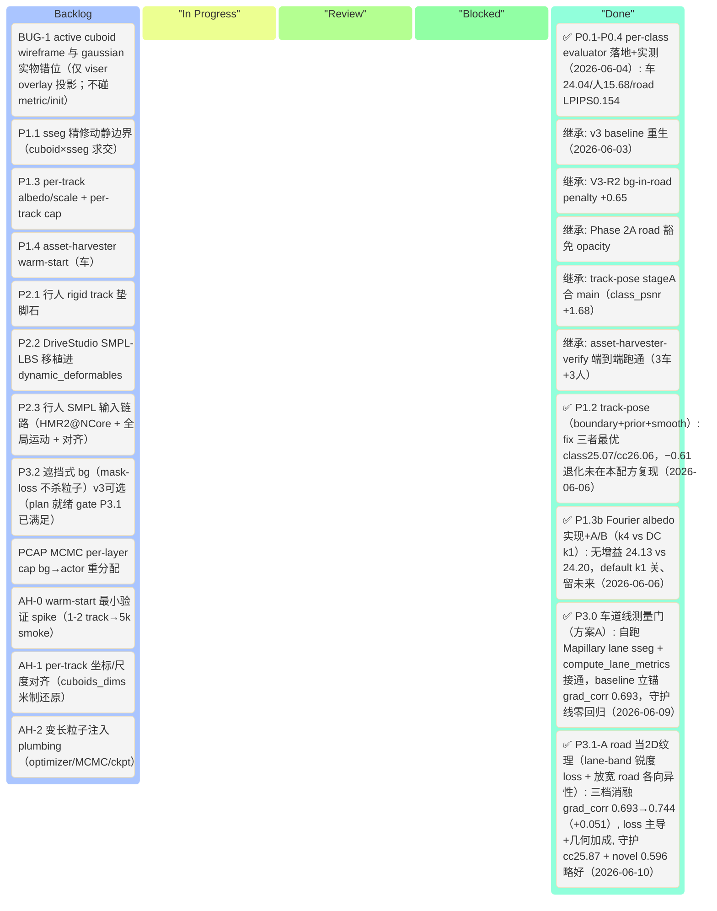

# 3DGRUT v3 — 前景 actor per-class 质量 · 可执行计划（actor-centric 重编号版）

> **本文档定位**：v3 的**新主线 plan**，按「前景 actor per-class 重建质量」轴重度重编号（Phase 0–3 + asset-harvester）。今后 v3 工作**以本文档为准执行**。
> **冻结的旧版**：[`v3_plan.md`](v3_plan.md) — 错轴阶梯（Stage 8.5→18 / novel-view PSNR≥30），**保留作历史 experience 参考**，不再作为执行依据。旧版 Done Log（baseline 重生 / V3-R2 / Phase 2A / track-pose / Stage 11）仍是有效证据来源。
> **决策依据（decision of record）**：
> - 战略诊断 [`docs/superpowers/specs/2026-06-04-v3-actor-centric-perf-diagnosis.md`](docs/superpowers/specs/2026-06-04-v3-actor-centric-perf-diagnosis.md)
> - asset-harvester 可行性 [`docs/superpowers/specs/2026-06-04-asset-harvester-gaussian-injection-feasibility.md`](docs/superpowers/specs/2026-06-04-asset-harvester-gaussian-injection-feasibility.md)
> - [`v3_plan.md`](v3_plan.md) § 5 Done Log「2026-06-04 战略复盘」
> **执行约定**：沿用 [`CLAUDE.md`](CLAUDE.md)（A800 远程 / multilayer config / 文档同步纪律）与旧 plan § 6 工作流。

---

## 0. 目标与 KPI

### 0.1 v3 核心方向（actor-centric，2026-06-04 定稿）

> **真实成功指标 = 最大化前景 actor 的 per-class 重建质量：车辆 + 行人/骑行 + 道路/车道线。背景模糊可接受。**

与旧 plan 的「novel-view PSNR ≥ 30 全局主 KPI」**几乎正交**，且旧指标 **无 GT、测不准**（只能报 LPIPS，Δ≈0.004 在噪声地板）。诊断确诊：旧阶梯是 **「优化错了轴」的 local minimum**——算力投在背景/全局，用户要的却是前景 actor。

两条铁证（旧 plan Done Log）：
- 超参调优史上最大增益 **+0.04 dB**（T12 SH clamp）；唯二真跃迁均来自**重构物理问题**——V3-R2 bg-in-road penalty **+0.65**、Phase 2A road 豁免。
- Stage 11 深度监督预算 +3.0，三实验实测 ≈0（dense −0.0045 / sparse −0.004 反向，符号翻转 → 无稳健效应）。

**编辑/仿真（删/插 actor 不留痕）= v4 目标，不是 v3。** v3 只追重建质量。

### 0.2 KPI — per-class actor 为主（绝对数 Phase 0 回填）

> ⚠️ **不再设「cc_psnr ≥28.5/29.2/29.7」式绝对阶梯**——那是错轴的虚构预算。新 KPI = **每类 actor 相对 Phase 0 锚点的 gap 闭合**；绝对目标数 Phase 0 测完才定。

| actor 类（主 KPI） | 现状 / baseline | 测量工具 | v3 目标 |
|---|---|---|---|
| **车辆** class_psnr（动态车辆区） | **18.96**（V3-L7 poseopt sym5cam 30k 实测）/ baseline 17.28 | [`class_psnr.py`](threedgrut/model/class_psnr.py)（现成，cuboid-based） | Phase 0 重测立锚 → P1 闭合（≥ +1.5 已由 track-pose 单项证得） |
| **行人/骑行/rider** per-class | **≈ 地板（完全未建模）** | **P0.2 新建 sseg-based**（person=11/rider=12/bicycle=18） | 从「没有」到「有」：先 rigid blob 验证抬升，再 SMPL deformable |
| **道路/车道线** | road 区 PSNR 不可信（沥青主导测不出线条锐度） | **P0.3 lane-mask PSNR/LPIPS 或 BEV-crop LPIPS** | Phase 0 立锚 → P3 提升高频线条 |
| 背景（辅，仅监控不退化） | cc_psnr_masked 25.79 | 现成 | **≥ 24.7 守护线**（不主动优化） |
| novel-view LPIPS（监控，非主） | 0.5987（4 档 avg） | `render.py --novel-view` | 不退化即可 |

### 0.3 v3 不做（明确转 v4 backlog）

- **asset-harvester frozen drop-in**（换车 / 删插不留痕）—— v4 编辑目标
- 想法 ③ 遮挡式 bg 完整版 / ④ inpaint 遮挡地面 / ⑤ 学习式软分割 —— v4
- NuRec 专有 DiFix 训练数据复现、跨 clip 联训、USDZ 打包、Marching Cubes mesh 导出
- **追求全局 novel-view PSNR ≥ 30** —— 旧主目标，已判定为错轴

### 0.4 v3 baseline（沿用 2026-06-03 重生 baseline，不重训）

| 维度 | 数值 | 来源 |
|---|---:|---|
| mean_novel_lpips_avg（监控） | **0.5987** | 旧 Done Log「v3 baseline 重生」对照 A（从头 30k λ0.1） |
| mean_cc_psnr_masked（守护辅 KPI） | 25.79 | 同上（守护线 24.7 之上） |
| mean_lidar_psnr | 22.69 | LiDAR 生效配方坐实 |
| 车辆 class_psnr（poseopt） | 18.96 | V3-L7 Run B sym5cam 30k |
| 4 层粒子规模 | bg **1M** + road 200K + dyn 200K(70 tracks) + sky MLP | — |
| baseline ckpt | `a800:/root/work/yusun/ncore-nurec/output/v3_base_scratch30k_lam01/...-0406_204815/ours_30000/ckpt_30000.pt` | — |

> ⚠️ **MCMC+多层 resume 续训不可靠**（resume cc_psnr 23.87 vs 从头 25.79，−1.92，根因疑两进程 RNG 分叉）。**Phase 0–3 所有 baseline 对照一律从头训。**

---

## 1. 项目看板（Kanban，按 Phase 0–3 重编号）

> 状态：⬜ Todo · 🟡 In Progress · 🔵 Review · ✅ Done · ⏸ 降级(保留) · ⏭ Skip

### 1.1 顶层看板（Mermaid Kanban）



### 1.2 任务级看板（按 P*.* 编号）

> "继承自旧 ID" 列建立与 [`v3_plan.md`](v3_plan.md) 的可追溯映射（旧 experience 仍可参考）。

| 新 ID | Phase | 主题 | 继承自旧 ID | 估时(d) | 状态 | 改动/新增 |
|---|---|---|---|---:|:---:|---|
| **P0.1** | 0 | 车辆 class_psnr 实测 — 现 baseline ckpt 跑现成 [`class_psnr.py`](threedgrut/model/class_psnr.py) | 部分 T17.2 | 0.5 | ✅ | 实测 24.04（本就接通） |
| **P0.2** ★ | 0 | **行人/骑行 sseg-based per-class 评测（新建）** — [`ncore_semantic.py`](threedgrut/datasets/ncore_semantic.py) person/rider/bicycle 类表 → per-class PSNR/LPIPS | 新 | 2 | ✅ | `per_class_eval.py`+11测；人 15.68 |
| **P0.3** ★ | 0 | **车道线指标** — lane/marking mask PSNR/LPIPS 或道路 BEV-crop LPIPS（绕开沥青主导） | 新 | 1.5 | ✅ | road-crop LPIPS 0.154 |
| **P0.4** | 0 | per-class evaluator 整合 + `metrics.json` 字段规范 + 4 档 novel pose 拆解（车/人/路/bg） | T17.2 V3-E2 | 1 | ✅ | render.py+dataset 双路径；novel 拆解 🟡缓 |
| **P1.1** ★ | 1 | **sseg 精修动静边界** — cuboid 定 track × sseg 定像素求交；动态 loss 只路由 sseg-actor 像素，AABB 内非 actor（影子/车底）还给 bg | 部分 T14.1 V3-D3 + T14.2 V3-D4 | 2.5 | ⬜ | ROI/工程比最佳 |
| **P1.2** ★ | 1 | **track-pose 完整版** — boundary anchor（fix_first/last）+ pose prior + temporal smooth（复用 stageA） | T13a.4 V3-L7 | 2 | ✅ | `pose_anchor.py`+trainer+configs；fix 三者最优 class25.07/cc26.06，−0.61 未在本配方复现，相对 stageA +0.22 class（含跨机噪声）|
| **P1.3** | 1 | per-track albedo（SH bias，DC only）+ per-track scale + per-track 粒子上限 | T13b.4 L8 + T13b.5 L9 + T13a.3 L6 | 2 | ⬜ | — |
| **P1.3b** | 1 | **Fourier albedo feature**（4D-SH 时变颜色）：把 P1.3 DC-only albedo 扩展为 Fourier 级数，捕获车辆时变外观（阴影穿越/曝光变化）。gate = P1.3 验证有效后再投 | T13b.4 L8b（旧命名） | 1.5 | ✅ 实现+验证（无增益） | `track_albedo_fourier.py`+layered_model+registry；A/B k4 24.13 vs DC k1 24.20（−0.07 噪声内），default k1 关、留未来 clip |
| **P1.4** ★ | 1 | **asset-harvester warm-start（车）** — 扩散补全的完整几何当初始化注入，继续多帧 photometric+pose 训练（详见 § 3） | 新（PR #14 spec） | 见 § 3 | ⬜ | gate=AH-0 |
| **P2.1** | 2 | 行人 rigid track 垫脚石 — 从「完全没有」到「有粗 blob」验证抬升（asset-harvester 静态人可当 init） | 新 | 2 | ⬜ | — |
| **P2.2** ★ | 2 | **DriveStudio SMPL-LBS 移植** 进空壳 `dynamic_deformables` 层 — canonical 高斯长在 SMPL mesh，per-frame 24 关节 LBS 蒙皮 | Stage 16 **改机制**（原 hash-grid+MLP→SMPL） | 6 | ⬜ | — |
| **P2.3** | 2 | 行人 SMPL 输入链路 — HMR2 在 NCore 相机跑通 + 全局运动估计 + 坐标系对齐 | 新 | 3 | ⬜ | — |
| **P3.0** ★ | 3 | **车道线测量门（方案 A，对标 Phase 0）** — 自跑 Mapillary lane sseg（[`gen_lane_sseg.py`](scripts/gen_lane_sseg.py)）+ `compute_lane_metrics`（dilated-band + 梯度锐度）接通 render/dataset；baseline 立锚（纯 eval 无训练） | 新（spec 2026-06-09） | 1 | ✅ | `per_class_eval.py`(+lane) / `datasetNcore.py` / `render.py` / scripts；**grad_corr 0.693**，守护线零回归 |
| **P3.1** | 3 | road 当 2D 纹理问题 — 沿车道线定向加密 / 平面 feature grid（**非堆 Fourier 时间维**） | 新（替代 13b L1/L2 Fourier） | 3 | ✅ P3.1-A（B 二阶未投） | `lane_loss.py`+trainer+datasetNcore+[p31preset](configs/apps/ncore_3dgut_mcmc_multilayer_p31.yaml)；**grad_corr 0.693→0.744（+0.051）** 拆变量 loss 主导(+0.035)+几何(+0.026)，守护 cc25.87/novel 0.596，[plan↗](docs/superpowers/plans/2026-06-09-p31-p32-road-lane.md) |
| **P3.2** | 3 | 遮挡式 bg（penalty 改「只 mask loss 不杀粒子」+ 深度合成）— 保 actor 移开帧路面连续 | 想法③ | 1.5 | ⬜（plan 就绪） | v3 可选·见同 plan（gate=P3.1） |
| **P-CAP** | 容量 | MCMC per-layer cap 重分配 — 砍 bg(1M) 补 actor(200K)，预算向前景倾斜 | 新（V3-R2 套路延伸） | 1 | ⬜ | — |
| **AH-0** ★ | 1(spike) | asset-harvester warm-start **最小验证** — 1–2 track 注入 `init_layer_from_points` → 5k smoke → 对比 class PSNR（**P1.4 立项 gate**） | 新 | 1.5 | ⬜ | — |
| **AH-1** | 1 | per-track 坐标/尺度对齐（**头号风险**）— Objaverse 归一化 canonical → object-local 旋转对齐 + `cuboids_dims` 米制还原 | 新 | 2 | ⬜ | — |
| **AH-2** | 1 | 变长粒子注入 plumbing — `setup_optimizer()` 重置 Adam + `LayeredMCMCStrategy` resync + ckpt `track_ids` 兼容 | 新 | 1.5 | ⬜ | — |
| **BUG-1** | bug | active cuboid wireframe 与 dynamic gaussian 实物渲染错位 — **仅 viser 可视化**（`viser_gui_4d.py` overlay 投影路径）；3D pose / gaussian init / class_psnr **均不受影响**（gaussian init 共享同一 pose，错则 init 就崩 → 现 init 正常即反证 pose 对）。详见 § 2.5 | 新 | 0.5 | ⬜ | — |

### 1.3 Phase 状态汇总 + per-class gap 表（Phase 0 回填）

| Phase | 主题 | 任务数 (Done/Total) | 主验收（per-class actor） | 背景守护 | 状态 |
|---:|---|---:|---|:---:|:---:|
| **0** ★ | 把目标测出来（前置/便宜/无新训练） | 4/4 | **per-class 真实数字+缺口入档** ✅ | cc 25.79 守住 | ✅ 门(过) |
| **1** ★ | 车辆（高 ROI/已验证） | 0/7（含 AH-0/1/2） | 车辆 class_psnr 闭合 gap | ≥ 24.7 | ⬜ |
| **2** | 行人（最大缺口/工程重） | 0/3 | 行人从「没有」到「有」 | ≥ 24.0(容忍轻退) | ⬜ |
| **3** | 道路/车道线 | 2/3（**P3.0 门 + P3.1-A 见效** ✅） | 车道线锐度 lane **grad_corr 0.693→0.744（+0.051）** ✅ | ≥ 24.7（实 25.87） | 🟢 P3.1-A 过 |
| 容量 | bg→actor 预算重分配 | 0/1 | actor 粒子占比↑ | — | ⬜ |
| bug | cuboid overlay 对齐修复（BUG-1，仅 viz） | 0/1 | viser cuboid wireframe 与 gaussian 实物目视重合 | 不影响 metric | ⬜ |
| **总计** | — | **6/19** | — | — | — |

> **per-class gap 表（2026-06-04 P0 实测回填，baseline ckpt `v3_base_scratch30k_lam01`，metrics.json=`output/p0_percls_eval2/.../metrics.json`）**：
> | actor 类 | Phase 0 实测 | v3 出口目标 | 缺口 |
> |---|---|---|---|
> | 车辆 class_psnr | **24.04**（auto 23.79 / truck 27.32 / bus 24.74，3420 rec） | 闭合至 ≥ 25.5 | 中等 ~+1.5 |
> | 行人 person PSNR | **15.68**（301 帧 / 3.97M px；**bg 在行人像素的误差地板，非行人重建——行人无专属高斯**） | 加模型后从 15.68 升至 ≥ 22 | **最大缺口 ~−8 dB（modeled 车 vs unmodeled 人）** |
> | rider / bicycle PSNR | rider 17.76（仅 2 帧·过稀不可信）/ bicycle 29.97（94 帧·已可） | — | rider 样本不足 |
> | 车道线 lane-marking | 门锚 **grad_corr 0.693** → **P3.1-A 0.744（+0.051）**（前视 75 帧，A800 lidar-on 30k）/ band_psnr 21.77→22.01 / raw_psnr 22.78→23.36 / novel 0.5987→0.5962（Mapillary lane 类 23+24，2026-06-10）；〔旧 P0.3 road-crop 代理：PSNR 29.20 沥青虚高 / LPIPS 0.154〕 | grad_corr↑ ✅ 闭合 | P3.1-A 见效；P3.2 可继续 |
>
> ⚠️ **方法论修正**：per-class LPIPS 用全图 GT-fill，对**小目标**（person/rider/bicycle）受区域面积主导（lpips≈0 是面积假象非质量）→ 小 actor **以 per-class PSNR 为准**；LPIPS 仅对**大区域 road_crop（0.154）**有意义（正是 P0.3 车道线锐度信号）。
> ⚠️ **行人 15.68 的正确读法**：dynamic 层仅含车（by_class 仅 auto/truck/bus，无 person/rider/bicycle）→ **行人确实无专属模型（原假设「完全未建模」成立，未被推翻）**。15.68 = bg/静态场景在行人像素处的 PSNR = **未建模行人（尤指移动行人）的误差地板**，**不是行人重建质量**；它混合了静态行人（被 bg 烤进、偏高）与移动行人（bg 跟不上、偏低），绝对值仅作 Phase 2 的 **before-anchor**（加模型后应上升）。Phase 2 框定仍是「**从无到有**」，仍是最大单一缺口（modeled 车 24 vs unmodeled 人 15.68）。

### 1.4 任务依赖图（Phase 0 → 三分支并行）


---

## 2. Phase 详细任务卡

> 只描述目标 / 改动文件 / 验收准则，**不放代码**（按 CLAUDE.md 全局约束）。

### 2.0 Phase 0 — 把目标测出来（门，前置，无新训练）★

**触发**：v3 baseline ckpt 已固化（§0.4）。
**核心**：旧 plan 把含糊的「30 dB」当目标，但 ① 车辆指标只能测车（cuboid-based）② 行人完全测不了 ③ 车道线被沥青主导测不出。**没有 per-class baseline，后面任何「改善」都不可证**（违反 CLAUDE.md「metric 数字达标才算完成」纪律）。

| Task | 描述 | 改动文件 |
|---|---|---|
| P0.1 | 车辆 class_psnr：现 baseline ckpt 上跑现成 [`class_psnr.py`](threedgrut/model/class_psnr.py) | 无（现成工具） |
| P0.2 ★ | 行人 sseg-based per-class：用 [`ncore_semantic.py`](threedgrut/datasets/ncore_semantic.py) person=11/rider=12/bicycle=18 mask 求 per-class PSNR/LPIPS | NEW eval 模块 |
| P0.3 ★ | 车道线：lane/marking mask PSNR/LPIPS 或道路 BEV-crop LPIPS | NEW eval 模块 |
| P0.4 | 整合进 `render.py` eval + `metrics.json` 字段规范 + 4 档 novel pose 拆解 | `render.py`, `trainer.py` |

**验收**：
- per-class gap 表（§1.3）三行全部回填真实数字。
- **若实测改变 Phase 1/2 优先级**（例：车辆 class_psnr 已不差、行人是唯一真缺口）→ 据实重排，本 plan 看板同步更新。
- 不需 A800 训练，纯 eval；可在现 baseline ckpt 上跑（**本轮按用户决策暂不开 A800**，Phase 0 待排期）。

### 2.1 Phase 1 — 车辆（高 ROI / 已验证）★

**触发**：Phase 0 车辆数字入档。

| Task | 描述 | 改动文件 / 锚点 |
|---|---|---|
| P1.1 ★ | sseg 精修动静边界：cuboid 定 track × sseg car/person mask 定像素求交；动态 loss 只路由 sseg-actor 像素，AABB 内非 actor 还给 bg。修「1/4 辆车其实是 background」的 bleed | `layered_loss.py`, sseg mask 管线 |
| P1.2 ★ | track-pose 完整版：现 opt-in `trainer.pose_adjustment.*` 已合 main（[base_gs.yaml](configs/base_gs.yaml) + [multilayer_poseopt.yaml](configs/apps/ncore_3dgut_mcmc_multilayer_poseopt.yaml)）；补 fix_first/last + temporal smooth + pose prior，**重点修 −0.61 cc 退化** + novel eval | `trainer.py` |
| P1.3 | per-track albedo SH bias（DC only，L8）+ per-track scale offset（L9）+ per-track 粒子 cap 5000（L6） | `model.py`, `layered_model.py` |
| P1.3b | **Fourier albedo feature**（gate = P1.3）—— 见下方专项描述 | `model.py`, `layered_model.py` |
| P1.4 ★ | asset-harvester warm-start（车）—— 见 § 3 专项 | 见 § 3 |

**验收**：
- 车辆 class_psnr 相对 P0.1 锚点 **gap 闭合**（track-pose 单项已证 +1.68，sseg 边界 + warm-start 叠加预期更高）。
- cc_psnr_masked ≥ 24.7（守护）；P1.2 的 −0.61 cc 退化经 reg 修复后回到守护线之上。
- **优先选「能产出干净动静分解」的实现**（sseg-actor 像素分解、track-pose 干净运动）—— 为 v4 编辑打底，不返工。

#### P1.3b — Fourier albedo feature 专项

> **gate**：P1.3 DC-only 版 A800 验证有正增益后再投此任务。

**动机**：驾驶日志里同一辆车外观随时间变化（穿越树荫→明暗变化、迎面车灯→高光、曝光变化），单个固定 DC SH bias（P1.3）无法拟合这种低频时变信号。V3-L8 当前实现（`_track_albedo_table[K,3]`）本质是 k=1 退化版。

**方法来源**：StreetGaussian (Yan et al., ECCV 2024) § 3.2 — **4D Spherical Harmonics**

- 论文：[Street Gaussians: Modeling Dynamic Urban Scenes with Gaussian Splatting](https://arxiv.org/abs/2401.01339)
- 核心思路：将每个 SH 系数（包括 DC albedo 项）替换为 k 阶 Fourier 系数组：

```
z_{m,l}(t) = Σ_{i=0}^{k-1} f_i · cos(i · π · t / N_t)
```

其中 `f_i` 为可学习参数，`t` 为帧时间步，`N_t` 为总帧数，`k` 为 Fourier 阶数（超参，k=1 即退化为 P1.3 DC-only）。

**与 P1.3 的关系**：

| | P1.3（DC-only） | P1.3b（Fourier） |
|---|---|---|
| 参数形状 | `_track_albedo_table[K, 3]` | `_track_albedo_fourier[K, 3, k]` |
| 表达力 | 固定颜色偏置 | 时变颜色，k 阶 |
| 计算开销 | O(1) | O(k)，k 通常 4–8 |
| 激活建议 | warmup=500，lr=1e-4（P1.3 已修） | 同 P1.3，k 从小到大消融 |

**已知风险（来自 V3-L8 历史，obs #1831）**：
- warmup=500 + lr=1e-5 时 DC 项都未充分激活（5k smoke 虚高、30k 反转），P1.3 先修 lr → 1e-4 再投 Fourier 扩展
- 高阶 Fourier 参数量增 k 倍，MCMC 稀疏化时需同步 track-level gather；ckpt 序列化需兼容

**改动文件**：`threedgrut/layers/dynamic_rigid_init.py`、`threedgrut/model/model.py`（`_track_albedo_table` 扩维）、`threedgrut/trainer.py`（warmup gate 沿用）

**验收**：车辆 class_psnr 相对 P1.3 DC-only 基线进一步提升（A800 30k A/B，与 P1.3 对照）。

### 2.2 Phase 2 — 行人（最大缺口 / 工程重）

**触发**：Phase 1 车辆链稳定（或与 Phase 1 并行，依赖图无强约束）。
**关键修正（asset-harvester doc）**：旧 plan Stage 16 用 hash-grid+MLP 形变网络（无人体先验、未验证）；**改用 DriveStudio SMPL-LBS**（有人体先验、代码在工作目录 `drivestudio/`、方法成熟）。**asset-harvester 在行人是错工具**（只产静态、不会走路），至多当 rigid 垫脚石的静态 blob。

| Task | 描述 | 改动文件 / 锚点 |
|---|---|---|
| P2.1 | 行人 rigid track 垫脚石：从「完全没有」到「有粗 blob」（先证抬升）；可用 asset-harvester 静态人当 init | `tracks_loader.py`（解除 `DEFAULT_VEHICLE_CLASSES` 排除）, `dynamic_rigids` |
| P2.3 | 行人 SMPL 输入链路：HMR2 从 NCore RGB 预测 per-frame SMPL pose(24 quat)/betas(10)/trans(3)（`drivestudio/datasets/tools/extract_smpl.py`）+ 全局运动 + 坐标对齐 | NEW reader |
| P2.2 ★ | DriveStudio SMPLNodes（`drivestudio/models/nodes/smpl.py` + `human_body.py`）的 canonical+LBS+正则移植进空壳 `dynamic_deformables` 层（[registry.py:55](threedgrut/layers/registry.py)），复用 `MixtureOfGaussians` 渲染 | NEW `threedgrut/layers/dynamic_deformable_smpl.py` |

**验收**：
- 行人 per-class（P0.2 指标）**从「地板」到「可测的正值」**（先 rigid blob 立锚，再 SMPL 提升）。
- cc_psnr_masked ≥ 24.0（容忍轻退，因新建模引入多任务）。
- 注：cc_psnr_masked 的 mask 只屏蔽 ego 车身、**不屏蔽行人**（[trainer.py:999](threedgrut/trainer.py)）→ 行人建好后 cc 也会受益。

### 2.3 Phase 3 — 道路/车道线

**触发**：Phase 0 车道线锚点入档。✅ **测量门已立（2026-06-09，§6 Done Log）**：自跑 Mapillary lane sseg + `compute_lane_metrics` 接通，baseline 立锚 **grad_corr 0.693**（前视 75 帧）= P3.1/P3.2 改善的对照基线，主 KPI = `mean_lane_grad_corr`。下方 P3.1/P3.2 为门要测量的**实际改善**（尚未做）。

| Task | 描述 | 改动文件 |
|---|---|---|
| P3.1 | road 当 2D 纹理：沿车道线定向加密 / 平面 feature grid（**非 Fourier 时间维**）；可复用 [`road_region.py`](threedgrut/model/road_region.py) BEV 网格基建 | `road_region.py`, 致密化策略 |
| P3.2 | 遮挡式 bg（v3 可选）：现 `bg_road_penalty` / `bg_cuboid_loss` 的「杀死」机制改「只 mask loss 不杀粒子」+ 深度合成 → 保 actor 移开帧路面连续（同时为 v4 打底） | `bg_cuboid_loss.py`, `road_region.py` |

> **执行 plan（2026-06-09 展开为可执行阶梯）**：[`p31-p32-road-lane plan`](docs/superpowers/plans/2026-06-09-p31-p32-road-lane.md)（11 task，TDD，沿用 P3.0 plan 格式）。
> - **P3.1 阶梯**：① lane-band 监督 loss（band 内 Sobel 梯度幅值 L1，复用 P3.0 `_grad_mag`/`dilate_mask`；KPI `grad_corr` 只读、loss 不复用 Pearson 防 Goodhart）+ 放宽 road 各向异性/scale（**与 V3-R1.2/R1.3 抑制细长高斯反向**，A/B 权衡，须看 novel_lpips）→ 便宜先证 grad_corr 可被推过 0.693；② MCMC 定向加密（near-lane `valid_indices` 偏置，仅 road 层，gate=①见效）。平面 feature grid 留 stretch/v4。
> - **P3.2**（v3 可选，gate=P3.1 见效）：penalty kill→mask-only（保留 bg 粒子不杀）+ 深度合成（Task9 先 Explore 渲染合成路径再动手）。

**验收**：车道线 `mean_lane_grad_corr`（+ band_psnr / band_lpips 辅证）相对 2026-06-09 门锚（grad_corr 0.693）改善；road 区不再被 background 偷渲（延续 V3-R2 成果）。

### 2.4 停 / 降级清单（保留供历史，不在新主线）

> **别再为这些烧 A800 30k。** 旧任务卡仍在 [`v3_plan.md`](v3_plan.md) § 2，需要时查阅。

| 旧 ID / Stage | 旧主题 | 处置 | 理由 |
|---|---|---|---|
| Stage 10（T10.1–4） | sky envmap inpaint + gamma + warm-up | ⏸ 降级 | 背景轴，用户「不重要」 |
| Stage 12（T12.1–8） | MCMC + scheduler 超参移植 | ⏸ 降级 | NuRec 超参移植历史回报≈0；仅 cap 抽进 **P-CAP** |
| T13b.1/2/3 | background/road Fourier + scene-extent lr | ⏸ 降级 | 背景/全局轴 |
| T13b.6（V3-D2） | DINOv2 extra_signal 20 维 | ⏸ 降级 | 背景层，工程重回报不明 |
| Stage 14 多数（T14.3–6） | 交通灯/相机/帧 mask | ⏸ 降级 | T14.1 sseg/T14.2 场景流 mask 部分**吸收进 P1.1** |
| Stage 11（T11.*） | LiDAR + DepthV2 深度监督 | ✅ 已 opt-in 沉淀，**停投** | 三实验证伪对 novel/外观无效（深度只约束几何） |
| Stage 15（T15.*） | Cosmos-DiFix 渐进蒸馏 | ⏸ 停「当救世主」 | repro 仅 +0.30 且 novel 未测；synthesized GT 留备选 |
| Stage 17（T17.1 V3-R1） | 3DGRUT secondary ray | ⏸ 降级 | 全局 novel 轴 |
| **Stage 17（T17.2 V3-E2）** | **per-class cPSNR evaluator** | ⬆ **提前到 P0.4** | 测量本就该前置 |

### 2.5 BUG 修复任务卡 — active cuboid overlay 对齐（BUG-1，仅可视化）

**现象（用户报告 2026-06-05）**：playground 4D 可视化里 active cuboid 的 wireframe 包围盒与它框住的 dynamic gaussian 实物（动态车辆等）在渲染图上**没有对齐**——盒子相对实物有平移/旋转/尺度偏差，没有套住对应的高斯车。

**根因已定位 = 纯可视化（viser overlay 投影），不碰 metric / init（用户 2026-06-05 判定）**：
- cuboid 的 **3D pose 是对的**——dynamic rigid gaussian 的初始化（[dynamic_rigid_init.py](threedgrut/layers/dynamic_rigid_init.py)）正是用**同一套** `pose_inv` 把 LiDAR 点滤进 object-local frame；若 pose / 坐标系约定错，gaussian 根本长不出正常车（init 就崩）。现 gaussian 实物渲染正常 ⇒ **3D pose 正确**。
- 因此错位只发生在 **viser 的 overlay 投影路径**（[viser_gui_4d.py](threedgrut_playground/viser_gui_4d.py) 把 world-frame cuboid edges 投到屏幕用的相机模型/内外参 ≠ 实际 3dgrut renderer 的相机），是**纯可视化 bug**。
- **明确不受影响**：[`class_psnr.py`](threedgrut/model/class_psnr.py) / [`dynamic_mask.py`](threedgrut/layers/dynamic_mask.py) 的 per-track mask（车辆 **class_psnr 24.04 / P0.1**）走另一条投影，且其正确性由 gaussian init 同 pose 背书 → **P0.1 不需重测**。

**改动文件 / 锚点（只动 playground overlay，⛔ 勿碰 3D pose 链路）**：
- cuboid wireframe 构建：`threedgrut_playground/viser_gui_4d.py`（`_build_cuboid_edges` / `_update_active_cuboids` ~894-958）、`threedgrut_playground/utils/cuboid.py`（`cuboid_world_edges`）
- overlay 投影（核查点）：`threedgrut_playground/utils/{ftheta_projector,pinhole_projector,overlay_renderer}.py` —— overlay 用的相机模型/内外参须与实际 render 相机一致（ftheta vs pinhole、viser line_segments 路径 vs ftheta overlay 路径不一致 ~917）
- ⛔ **不改**：[`tracks_loader.py`](threedgrut/datasets/tracks_loader.py)（Euler 解码）、[`dynamic_rigid_init.py`](threedgrut/layers/dynamic_rigid_init.py)、[`layered_model.py`](threedgrut/layers/layered_model.py)（`_transform_means`）、[`dynamic_mask.py`](threedgrut/layers/dynamic_mask.py) / [`class_psnr.py`](threedgrut/model/class_psnr.py) —— 已被 gaussian 实物正常渲染背书，动它们反而会碰坏 init/metric。

**验收**：
1. playground 多帧 / 多 track（含纯 yaw 直行 + 转弯）目视：cuboid wireframe 套住对应 gaussian 实物（中心 / 朝向 / 尺寸重合）。
2.（可选）轻量回归测试 pin 住「overlay projector 与 renderer 相机一致」：构造已知相机 + 已知 world 点，断言 overlay 投影像素 == renderer 投影像素。
3. **纯可视化修复，不需 A800 重训 / 重 eval**；§ 1.3 per-class gap 表与 P0.1 锚点不变。

---

## 3. asset-harvester 注入专项（车辆 warm-start）

> 完整可行性见 [`asset-harvester-gaussian-injection-feasibility.md`](docs/superpowers/specs/2026-06-04-asset-harvester-gaussian-injection-feasibility.md)。

**定位（写死防误用）**：asset-harvester = **给训练一个「补全未观测面的高质量起点」，不是「替换训练结果」**。
- 攻击的是 photometric 多帧训练**结构上补不了**的死角：驾驶日志里永远看不到的车背面/侧面 = blob。扩散先验幻觉补全 360°，与训练**互补不是竞争**。
- **必须 warm-start**（注入当初始化、保持 `nn.Parameter` 可学、继续多帧训练），**不能 frozen drop-in**（frozen 丢掉 3dgrut 已赢的三栏：本场景光照匹配 / view-dependent SH / 多视角整合 → v3 多半退化）。frozen → v4 编辑。

**可运行性已解闸**（`asset-harvester-verify` 实测）：真实 NCore 上端到端跑通，3 车+3 人各 ~99k 高斯，RTX 4090 17s/对象，cuboid 真实可用。NuRec apply-schema 卡点**与本路径无关**（warm-start 不经 NuRec，直接注入 `init_layer_from_points`）。

| Task | 描述 | 风险/锚点 |
|---|---|---|
| **AH-0** ★ | **最小验证 spike**（P1.4 立项 gate）：1–2 track 抽 object-centric 稀疏视角 → asset-harvester 生成 PLY → 格式转换 → `init_layer_from_points("dynamic_rigids", ...)`（[layered_model.py:1250](threedgrut/layers/layered_model.py)）→ 5k smoke → 对比 class PSNR。**抬升才投完整版** | 便宜探针 |
| **AH-1** | per-track 坐标/尺度对齐（**头号风险**）：Objaverse 归一化 canonical → object-local（X前Y左Z上）旋转对齐（vs NCore cuboid Euler XYZ，[dynamic_rigid_init.py:35](threedgrut/layers/dynamic_rigid_init.py)）+ `cuboids_dims` 米制还原 | 对齐错→车浮空/错位；cuboids_dims 已验证可用 |
| **AH-2** | 变长粒子注入 plumbing：`setup_optimizer()` 重置 Adam state + `LayeredMCMCStrategy` 重新同步计数/索引 + ckpt `track_ids` 兼容 | 已知工程，非阻塞 |

**格式转换映射（机械层，确定性低风险）**：
| 字段 | asset-harvester | 3dgrut | 转换 |
|---|---|---|---|
| opacity | sigmoid 后 [0,1] | `density`（logit 前体） | `density = logit(opacity)` |
| color | RGB=f_dc·SH_C0+0.5 | `features_albedo`（DC-SH） | `(RGB−0.5)/SH_C0` |
| 高阶 SH | 无 | `features_specular`(degree 3) | **补零**（训练学出） |
| scale/rotation | log / wxyz | log / wxyz | 直接（注意尺度+canonical 朝向，见 AH-1） |

**与 Phase 1 协同**：asset-harvester 给「完整几何+外观先验」，P1.2 track-pose 修运动，P1.3 per-track bias 修色偏，P1.1 sseg 边界给干净像素归属——**四者不冲突、叠加**。warm-start 对 asset 质量不完美**鲁棒**（训练会修），无 PSNR/LPIPS 量化也不致命。

---

## 4. 风险登记表（Risk Log）

| ID | 风险 | 触发 | 影响 | 缓解 | 关联 |
|---|---|---|---|---|---|
| R1 | Phase 0 实测改变优先级 | 车辆已不差 / 行人是唯一缺口 | 路线需重排 | Phase 0 即设计为「测完据实重排」；本就是门 | P0 |
| R2 | sseg mask 与 cuboid 不对齐 | 斜车角落欠覆盖 / sseg 噪声 | P1.1 边界仍脏 | cuboid×sseg 求交取保守交集；dilate 调参 | P1.1 |
| R3 | asset-harvester 坐标/尺度对齐错 | canonical 朝向 / 米制还原 bug | 车浮空/错位 | AH-0 先 1-2 track 目视验证；cuboids_dims 已证可用 | AH-1 |
| R4 | 变长粒子注入破坏 ckpt/MCMC | optimizer/strategy resync 漏 | 训练崩/不收敛 | 先写注入 roundtrip 单测再上 A800（CLAUDE.md 纪律 C.10） | AH-2 |
| R5 | DriveStudio SMPL 链路重 | HMR2@NCore 跑不通 / 移植量大 | Phase 2 拖期 | P2.1 rigid 垫脚石先证价值；P2.2 可单开 spec | P2.2/2.3 |
| R6 | per-class warm-start 退化 cc | asset 外观域差 | 背景守护破线 | warm-start 由训练消化 + per-track bias；守护线监控。**2026-06-05 实测：freeze 式 protected warm-start 否定**（10k 追平、未观测面 spiky，见 § 6）；真瓶颈=asset 质量+未观测面缺约束 → 走约束式/re-harvest，**勿再冻结** | P1.4 |
| R7 | resume 续训退化（已坐实） | MCMC+多层 resume | cc −1.92 | **所有 baseline 对照从头训** | §0.4 |
| R8 | cuboid overlay 错位 | viser overlay 投影相机 ≠ renderer 相机 | playground 可视化误导（**仅 viz；metric/init 不受影响**——gaussian init 与 class_psnr 共享同一 3D pose，错则 init 崩，现 init 正常 ⇒ pose 对，已排除污染度量） | BUG-1 只修 playground overlay，⛔ 勿碰 3D pose/metric 链路 | BUG-1 |

---

## 5. v4 backlog 转出

- asset-harvester **frozen drop-in**（换车/删插不留痕）—— 需先补量化评测（PSNR/LPIPS vs 本 clip GT）+ 域适配
- 想法 ③ 遮挡式 bg 完整版 / ④ inpaint 遮挡地面 / ⑤ 学习式软分割（per-gaussian 动/静软归属）
- NuRec 专有 DiFix 数据复现、跨 clip 联训、USDZ、Marching Cubes mesh
- **v3 打底承诺**：Phase 1 ①② 优先选「能产出干净动静分解」的实现；v3 测出的 per-class 指标 + 干净分解 = v4 的起点

---

## 6. Done Log（继承关键锚点 + 新条目）

> 继承自 [`v3_plan.md`](v3_plan.md) § 5 的有效证据；新工作在此追加（日期+commit+实测数）。

**继承锚点（已验证，作 baseline / 协同基础）**：
- **2026-06-04 战略复盘**：目标修正为前景 actor per-class，local minimum 确诊（[v3_plan.md:799](v3_plan.md)）。
- **2026-06-03 v3 baseline 重生**：从头 30k λ0.1，novel LPIPS 0.5987 / cc 25.79 / lidar_psnr 22.69（定稿，§0.4）。
- **V3-L7 track-pose stageA 合 main**：class_psnr **+1.68** / raw **+2.06** / cc **−0.61**（待 P1.2 修），opt-in `trainer.pose_adjustment.*`。
- **V3-R2 bg-in-road penalty**：+0.65 dB，赶走 75 万入侵路面 bg 粒子（重构物理问题的真跃迁范例）。
- **Phase 2A road 豁免 opacity**：填路面洞。
- **asset-harvester-verify**：真实 NCore 端到端跑通，3 车+3 人各 ~99k 高斯，可运行性闸门已解。

**新条目（本 plan 启动后填充）**：
- **2026-06-04 Phase 0 per-class evaluator 落地 + baseline 实测**（A.1 / C / D）：
  - 新建 [`per_class_eval.py`](threedgrut/model/per_class_eval.py)（`compute_per_class_metrics` / `compute_lpips_in_mask`(GT-fill) / `class_mask_from_sseg`，纯张量、LPIPS 依赖注入、cv2/NCore-free）+ [`tests/test_per_class_eval.py`](threedgrut/tests/test_per_class_eval.py)（11 测试，Mac `.venv`/py3.12 全绿，跑法 `pytest ... --noconftest`）。
  - [`datasetNcore.py`](threedgrut/datasets/datasetNcore.py)：**根因修复**——sseg 原只在 **train 分支**（L935）加载，**val/test 分支（eval 真路径）从未加载**（与 lidar/depth 同款双路径坑，L1077-1084 注释已记载同类修复）；在 val 分支补 sseg 加载 + raw `semantic_sseg` 透传到 `image_infos`（render-res NEAREST resize）。
  - [`render.py`](threedgrut/render.py) `render_all()`：逐帧 per-class 累积 + metrics.json 新字段 `mean_{person,rider,bicycle}_{psnr,lpips}` / `*_n_records` / `*_total_pixels` / `mean_road_crop_{psnr,lpips}`。
  - **A800 实测**（baseline ckpt，GPU0，~3min）：车 class_psnr **24.04** / person **15.68**(301帧/3.97Mpx) / rider 17.76(2帧) / bicycle 29.97(94帧) / road_crop PSNR 29.20·LPIPS **0.154**。
  - **守护线零回归**：cc_psnr_masked **25.789**(=25.79) / novel_lpips_avg **0.5987**(=0.5987) / lidar_psnr **22.69**(=22.69)——改动纯增量。
  - **结论**：① 行人**确实无专属模型**（by_class 仅车）——15.68 是 **bg 在行人像素的误差地板**（before-anchor，**非行人重建质量**），混静/动行人；Phase 2 框定维持「从无到有」，最大缺口确认（车 24 vs 人 15.68，~−8dB）；② 小 actor LPIPS GT-fill 受面积主导，per-class PSNR 为准；③ P0.4 的「4 档 novel pose per-class 拆解」标 🟡 stretch 暂缓（novel 无真 GT），全图 novel 监控不退化。
- **2026-06-06 P1.2 track-pose 完整版（boundary anchor + pose prior）**：
  - 新建 [`pose_anchor.py`](threedgrut/model/pose_anchor.py)（`compute_pose_boundary_loss` 首/末活跃帧锚定 GT + `compute_pose_prior_loss` 全帧软 L2，旋转用矩阵 Frobenius² 绕开 quat 双覆盖，纯函数 Mac 可单测）+ 接入 [`trainer.py`](threedgrut/trainer.py)（`_compute_pose_boundary_term` / `_compute_pose_prior_term`，三层 gate）+ [`base_gs.yaml`](configs/base_gs.yaml)（`fix_first_last` / `lambda_pose_boundary_*` / 接通占位的 `lambda_pose_prior_*`，默认全 0=stageA 复现）+ [`poseopt.yaml`](configs/apps/ncore_3dgut_mcmc_multilayer_poseopt.yaml)（修复版默认）+ [`test_pose_anchor.py`](threedgrut/tests/test_pose_anchor.py)。temporal smooth 是 stageA 既有、本任务复用。
  - **测试**：Mac 纯函数全绿；inceptio GPU 74 passed（顺手修 `_maybe_trainer` 用错的类名 `Trainer`→`Trainer3DGRUT`，含 `test_learnable_pose_smoothness.py` 同款预存 bug）。default `pose_adjustment.enabled=false` → baseline byte-identical。
  - **30k A/B 三方对照（全 lidar-on）**：baseline（无 poseopt, A800）class **24.04** / cc **25.79**；stageA（poseopt 无 fix, A800）class **24.85** / cc **26.02**；fix（poseopt+boundary+prior, inceptio）class **25.07** / cc **26.06**。
  - **诚实结论（修正预期）**：① 原计划要修的 **−0.61 cc 退化在本 multilayer 5-cam ring 配方未复现**（那是 V3-L7 sym5cam 特有）——poseopt 本体在本配方就是小赢（+0.81 class / +0.23 cc，无退化）；② boundary+prior fix 是三者最优（+1.03 class / +0.27 cc vs baseline）但相对 stageA 仅 **+0.22 class**，且含跨机噪声（fix 在 inceptio、baseline/stageA 在 A800）；③ 视觉（viser_gui_4d）：动态车更清晰、不跳；实测 poseopt 把车逐帧抖动 ‖Δ²t‖ 压了 5–8 倍。
  - **已知限制**：停车原地抖动根因是 **GT cuboid 标注逐帧噪声**（静止车 ‖Δ²t‖ 中位 73mm/帧），poseopt 已压到 ~18mm 但未清零（prior 往噪声 GT 拉 + 停车光度约束弱）→ 后续改进：近静止 track 位姿塌缩。
- **2026-06-06 P1.3b Fourier albedo feature（4D-SH 时变颜色）**：
  - 新建 [`track_albedo_fourier.py`](threedgrut/model/track_albedo_fourier.py)（`fourier_albedo_bias` = Σ f_i·cos(iπt/N_t)，matmul 收缩时间轴 + track_ids gather；`upgrade_albedo_table` ckpt 升/降维；纯函数 Mac 可单测）+ [`layered_model.py`](threedgrut/layers/layered_model.py)（albedo 表 `[K,3]`→`[K,3,k]`，fused_view 复用 `_resolve_pose_idx` 拿帧 t、`_get_track_pose_F` 拿 N_t；2 条加载路径用 `upgrade_albedo_table` back-compat）+ [`registry.py`](threedgrut/layers/registry.py)（`n_fourier_albedo_terms`，默认 1）。**k=1 严格退化 = P1.3 DC、OFF 不注册表 = v2 baseline byte-identical**。
  - **测试**：Mac 13 Fourier 纯函数 + 16 registry；inceptio GPU 全套 passed。ckpt 端到端 `[70,3,4]`、一次谐波非零（warmup 后真在优化）。**viser_gui_4d 实测能正确加载渲染 k=4 ckpt**（共享 `timestamp_us→_resolve_pose_idx` 时间链路，与动态 pose 同源）。
  - **30k A/B（k=1 DC vs k=4 Fourier，lidar off，nw=24，inceptio ~8.8 it/s）**：class_psnr **k1 DC 24.20** vs **k4 Fourier 24.13**（−0.07，噪声内）→ **Fourier 在本 clip 无增益**。
  - **结论**：实现正确（k=1 退化验证）、不是过/欠拟合（额外参数仅 +630 个 float，可忽略）——**是本 20s clip 车辆 albedo 时变信号不足**（全局曝光已被 BilateralGrid 吃掉，无强阴影穿越/隧道/夜灯）。**default k=1 关闭、保留能力 gated 留未来强光照变化 clip**。旁注：lidar off 实测 ~8.8 it/s（vs lidar on ~4），坐实「lidar depth 是数据管线速度+内存大头」。
- **2026-06-05 P1.4 protected warm-start — 🔴 负面结论备案（防重跑冻结实验）**：完整实现 + AH-0/1/2 引擎在 **PR #18（`claude/interesting-mccarthy-03c6be`，未合 main，改动大）**，此处只把否定结论落 main 以免他人重蹈。
  - **背景**：asset-harvester warm-start 注入引擎已跑通，**AH-0 5k 感知 gate 正向**（automobile class_psnr +0.730，cc 不退；vs 未注入 truck +0.348 → 净增 ~+0.38）。
  - **提质实验（protected，C1–C5）**：warmstart 点 5k→50k + 把 warm track 排除出 MCMC relocate dead set + 冻结其 perturb noise + `dynamic_rigids` 整层豁免 opacity 正则 + 观测面留 Adam 精修，10k iters。
  - **A800 10k A/B 结果**：**automobile class_psnr Δ=+0.023（持平）**，heavy_truck −0.968（C3 整层豁免误伤），mean_class −0.036。**5k 的 +0.730 warm 优势在 10k 被 LiDAR-only 追平消失**；viser 看**未观测面严重 spiky / 白玻璃碴**。
  - **根因（修正 spec 前提）**：spec 假设「MCMC 侵蚀 asset」是**反的**——diffusion 补全的 asset 本身 spiky，MCMC+opacity 正则其实在**清理**它；C2 冻 perturb/relocate + C3 关 opacity 衰减恰好**锁死 spiky 并挡住清理**。frozen drop-in 离线手术佐证：原始 asset 几何连贯但**悬浮+光照失配**（→ 必须训练而非冻结）。**真瓶颈 = asset 质量 + 未观测面缺约束，不是 MCMC 侵蚀。**
  - **结论**：**freeze 式 protected warm-start 否定，勿再冻结**。后续若再试 P1.4 走「**约束式**」（scale clamp + anisotropy 上限 + opacity floor，有界非冻结）或先提 asset 质量（re-harvest / 协方差对齐）。代码默认关闭、baseline 字节等价。
- **2026-06-09 Phase 3 车道线测量门（方案 A：lane sseg → per-class lane 指标）落地 + baseline 立锚**（对标 Phase 0，纯 eval 无训练；commits 247ce9c→98bd9b3，inceptio RTX 4090）：
  - **指标层**（Mac TDD，纯张量、cv2/NCore-free）：[`per_class_eval.py`](threedgrut/model/per_class_eval.py) 加 `dilate_mask`（`F.max_pool2d` 方形膨胀，细 lane mask→dilated band）+ `_grad_mag_corr_in_mask`（Sobel 梯度幅值 Pearson 相关，**阈值无关、替代 edge-IoU**）+ `compute_lane_metrics`（band-LPIPS + band/raw-PSNR + grad-corr **四候选一次全报**，baseline 后挑主指标）；`LANE_CLASS_IDS=(23,24)`。23 测试 Mac 全绿。
  - **数据链路**：[`datasetNcore.py`](threedgrut/datasets/datasetNcore.py) **val/test-only** 加载独立 lane 产物 `*.aux.lane.zarr.itar`→`semantic_lane_sseg`（软失败 + **缺相机/帧跳过**，因 lane 产物前视-only）；[`render.py`](threedgrut/render.py) 前视相机 gate + metrics.json `mean_lane_{band_lpips,band_psnr,raw_psnr,grad_corr}` / `lane_{n_records,total_pixels,band_total_pixels}`（缺产物时**字节等价**）；eval 入口 [`render.py`](render.py) 加 `--load-lane-masks`/`--lane-band-px`（OmegaConf struct 解锁注入，旧 baseline ckpt 也能 eval）。
  - **lane GT 来源**（自跑，**不依赖 nre-tools**）：新建 [`scripts/gen_lane_sseg.py`](scripts/gen_lane_sseg.py)，inceptio 用 `facebook/mask2former-swin-large-mapillary-vistas-semantic`（hf-mirror）逐帧前视推理 → 599 帧 Mapillary 65 类 itar（13.9 MB，与 sseg 字节同构复用 `SsegAuxReader`）；对账 id2label：**23=Lane Marking-Crosswalk / 24=Lane Marking-General**。
  - **inceptio 立锚**（baseline ckpt `v3_base_scratch30k_lam01`，前视 75 帧，~3 min）：**grad_corr 0.693** / band_psnr 21.77 / raw_psnr 22.78 / band_lpips 0.0233 / lane_n_records 75（全覆盖，raw 4.68M px / band 7.75M px）。
  - **守护线零回归**：前视 mean_psnr 18.624 / psnr_masked 26.113 / cc_psnr_masked 21.578 / ssim_masked 0.906 / lpips_masked 0.231 全部 = baseline `per_camera[front]`（差 <1e-3）——改动纯增量。
  - **A.3 红旗自检（信号/方差）通过**：grad_corr 0.69 非退化（非 1/None）、阈值无关、有提升空间 → **荐为 Phase 3 主 KPI**（P3.1/P3.2 改善以此对照）；band_lpips 0.023 小但非零（band 沥青主导，次要）。**本条是「门」，不含 P3.1/P3.2 实际改动。**
- **2026-06-10 P3.1-A 车道线锐度 loss + 放宽 road 几何（P3.1 阶梯第一刀，三档消融 A800 lidar-on 30k）— ✅ 全胜**（commits 0e9d7c1→35a1e54，Mac TDD 全门绿 + A800 三档 A/B）：
  - **改动**：① 新建 [`lane_loss.py`](threedgrut/model/lane_loss.py) `compute_lane_sharpness_loss`（lane-band Sobel 梯度幅值 L1，**eps-safe 防 sqrt(0) 反向 NaN**——TDD `test_lane_loss_positive_and_differentiable` 抓到 pred.grad=NaN，内联 `_grad_mag_safe`、复用 P3.0 `_luma`/`dilate_mask`，eval KPI grad_corr/Pearson 只读防 Goodhart）；② [`datasetNcore.py`](threedgrut/datasets/datasetNcore.py) train 分支前视 try/except 软失败加载 lane mask（透传 P3.0 已 train/val 通用）；③ [`trainer.py`](threedgrut/trainer.py) `get_losses` 条件式 `loss_lane`（仿 lidar 范式「有才算」防 NaN，`lambda_lane=0` 默认字节等价）；④ [`multilayer_p31.yaml`](configs/apps/ncore_3dgut_mcmc_multilayer_p31.yaml) preset（lane on + road `anisotropy_ratio_max` 8→30 / `scale_xy_max` 0.3→0.6）+ [`test_lane_loss.py`](threedgrut/tests/test_lane_loss.py) / [`test_road_scale_override.py`](threedgrut/tests/test_road_scale_override.py)。Mac 全门 30 测绿（lane_loss 4 + override 3 + per_class_eval 23 零回归）。
  - **三档消融实测**（baseline 锚 = A800 同机 eval，与 inceptio 立锚**字节一致** grad_corr 0.6932 / band_psnr 21.77 / cc 25.79 / lidar 22.69）：**B1 lane-only**（lane·几何8）grad_corr **0.7278（+0.035）** / cc 25.89；**B2 放宽几何-only**（无lane·几何30）grad_corr **0.7191（+0.026）** / cc 25.84；**B3 叠加** grad_corr **0.7441（+0.051）** / band_psnr 22.01 / raw_psnr 23.36 / cc 25.87 / lidar 22.72。
  - **拆变量**：lane loss 主导（+0.035, 68%）+ 放宽几何次要（+0.026, 51%）；B1+B2=+0.061 > B3 +0.051 → **sub-additive**（目标重叠 ~16%），叠加仍最优、二者都留。
  - **守护线全过**：三档 cc 25.84~25.89（baseline 25.79，全 +0.05~0.10）、lidar 不退、band/raw lane-PSNR 全升（**非拿 PSNR 换锐度**）。
  - **D2 novel 安全**：B3 `mean_novel_lpips_avg` **0.5962** vs baseline 0.5987（**−0.0025 略好**，4 档 lateral/yaw 0.576~0.614）→ 放宽 road 各向异性 8→30 **未产生 hair-thin novel artifact**（V3-R1.2/R1.3 反向担忧解除，本 clip 安全）。
  - **结论**：主 KPI grad_corr **0.693→0.744（+7.3%）**——继 V3-R2 bg-in-road +0.65 之后又一「重构物理问题」真跃迁（road 当 2D 高频纹理来监督+表达，非堆参数）。**P3.1-B 定向加密（二阶）大g 决策暂不投**（边际 vs 工程量），收 P3.1-A → 转 P3.2。A800 三档 ckpt_30000 + eval metrics 保留、中间 ckpt_7000 已清理。

---

## 7. 与旧 plan 的关系（traceability 速查）

| 想找 | 去哪 |
|---|---|
| 旧 Stage 卡完整描述 / NuRec 对齐表 / 历史 A800 实测 | [`v3_plan.md`](v3_plan.md) § 2 / § 7 / § 5 |
| 错轴 local minimum 完整论证 | [诊断 doc](docs/superpowers/specs/2026-06-04-v3-actor-centric-perf-diagnosis.md) |
| asset-harvester 三子问题 / 格式映射 / 行人 SMPL 对比 | [可行性 doc](docs/superpowers/specs/2026-06-04-asset-harvester-gaussian-injection-feasibility.md) |
| 旧 T-ID → 新 P-ID 映射 | 本文 § 1.2「继承自旧 ID」列 + § 2.4 降级清单 |
| 执行约定（A800 / multilayer / 文档同步） | [`CLAUDE.md`](CLAUDE.md) + [`v3_plan.md`](v3_plan.md) § 6 |
