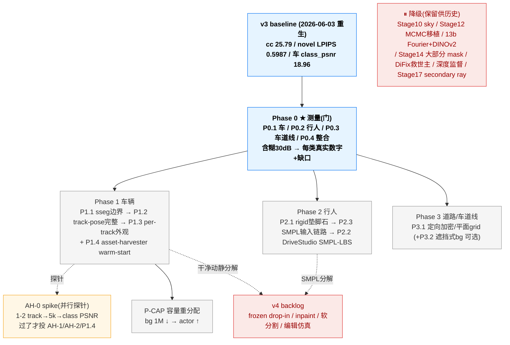

# 3DGRUT v3 — 前景 actor per-class 质量 · 可执行计划（actor-centric 重编号版）

> **本文档定位**：v3 的**新主线 plan**，按「前景 actor per-class 重建质量」轴重度重编号（Phase 0–3 + asset-harvester）。今后 v3 工作**以本文档为准执行**。
> **冻结的旧版**：[`v3_plan.md`](v3_plan.md) — 错轴阶梯（Stage 8.5→18 / novel-view PSNR≥30），**保留作历史 experience 参考**，不再作为执行依据。旧版 Done Log（baseline 重生 / V3-R2 / Phase 2A / track-pose / Stage 11）仍是有效证据来源。
> **决策依据（decision of record）**：
> - 战略诊断 [`docs/superpowers/specs/2026-06-04-v3-actor-centric-perf-diagnosis.md`](docs/superpowers/specs/2026-06-04-v3-actor-centric-perf-diagnosis.md)
> - asset-harvester 可行性 [`docs/superpowers/specs/2026-06-04-asset-harvester-gaussian-injection-feasibility.md`](docs/superpowers/specs/2026-06-04-asset-harvester-gaussian-injection-feasibility.md)
> - [`v3_plan.md`](v3_plan.md) § 5 Done Log「2026-06-04 战略复盘」
> **执行约定**：沿用 [`CLAUDE.md`](CLAUDE.md)（A800 远程 / multilayer config / 文档同步纪律）与旧 plan § 6 工作流。

---

## 0. 目标与 KPI

### 0.1 v3 核心方向（actor-centric，2026-06-04 定稿）

> **真实成功指标 = 最大化前景 actor 的 per-class 重建质量：车辆 + 行人/骑行 + 道路/车道线。背景模糊可接受。**

与旧 plan 的「novel-view PSNR ≥ 30 全局主 KPI」**几乎正交**，且旧指标 **无 GT、测不准**（只能报 LPIPS，Δ≈0.004 在噪声地板）。诊断确诊：旧阶梯是 **「优化错了轴」的 local minimum**——算力投在背景/全局，用户要的却是前景 actor。

两条铁证（旧 plan Done Log）：
- 超参调优史上最大增益 **+0.04 dB**（T12 SH clamp）；唯二真跃迁均来自**重构物理问题**——V3-R2 bg-in-road penalty **+0.65**、Phase 2A road 豁免。
- Stage 11 深度监督预算 +3.0，三实验实测 ≈0（dense −0.0045 / sparse −0.004 反向，符号翻转 → 无稳健效应）。

**编辑/仿真（删/插 actor 不留痕）= v4 目标，不是 v3。** v3 只追重建质量。

### 0.2 KPI — per-class actor 为主（绝对数 Phase 0 回填）

> ⚠️ **不再设「cc_psnr ≥28.5/29.2/29.7」式绝对阶梯**——那是错轴的虚构预算。新 KPI = **每类 actor 相对 Phase 0 锚点的 gap 闭合**；绝对目标数 Phase 0 测完才定。

| actor 类（主 KPI） | 现状 / baseline | 测量工具 | v3 目标 |
|---|---|---|---|
| **车辆** class_psnr（动态车辆区） | **18.96**（V3-L7 poseopt sym5cam 30k 实测）/ baseline 17.28 | [`class_psnr.py`](threedgrut/model/class_psnr.py)（现成，cuboid-based） | Phase 0 重测立锚 → P1 闭合（≥ +1.5 已由 track-pose 单项证得） |
| **行人/骑行/rider** per-class | **≈ 地板（完全未建模）** | **P0.2 新建 sseg-based**（person=11/rider=12/bicycle=18） | 从「没有」到「有」：先 rigid blob 验证抬升，再 SMPL deformable |
| **道路/车道线** | road 区 PSNR 不可信（沥青主导测不出线条锐度） | **P0.3 lane-mask PSNR/LPIPS 或 BEV-crop LPIPS** | Phase 0 立锚 → P3 提升高频线条 |
| 背景（辅，仅监控不退化） | cc_psnr_masked 25.79 | 现成 | **≥ 24.7 守护线**（不主动优化） |
| novel-view LPIPS（监控，非主） | 0.5987（4 档 avg） | `render.py --novel-view` | 不退化即可 |

### 0.3 v3 不做（明确转 v4 backlog）

- **asset-harvester frozen drop-in**（换车 / 删插不留痕）—— v4 编辑目标
- 想法 ③ 遮挡式 bg 完整版 / ④ inpaint 遮挡地面 / ⑤ 学习式软分割 —— v4
- NuRec 专有 DiFix 训练数据复现、跨 clip 联训、USDZ 打包、Marching Cubes mesh 导出
- **追求全局 novel-view PSNR ≥ 30** —— 旧主目标，已判定为错轴

### 0.4 v3 baseline（沿用 2026-06-03 重生 baseline，不重训）

| 维度 | 数值 | 来源 |
|---|---:|---|
| mean_novel_lpips_avg（监控） | **0.5987** | 旧 Done Log「v3 baseline 重生」对照 A（从头 30k λ0.1） |
| mean_cc_psnr_masked（守护辅 KPI） | 25.79 | 同上（守护线 24.7 之上） |
| mean_lidar_psnr | 22.69 | LiDAR 生效配方坐实 |
| 车辆 class_psnr（poseopt） | 18.96 | V3-L7 Run B sym5cam 30k |
| 4 层粒子规模 | bg **1M** + road 200K + dyn 200K(70 tracks) + sky MLP | — |
| baseline ckpt | `a800:/root/work/yusun/ncore-nurec/output/v3_base_scratch30k_lam01/...-0406_204815/ours_30000/ckpt_30000.pt` | — |

> ⚠️ **MCMC+多层 resume 续训不可靠**（resume cc_psnr 23.87 vs 从头 25.79，−1.92，根因疑两进程 RNG 分叉）。**Phase 0–3 所有 baseline 对照一律从头训。**

---

## 1. 项目看板（Kanban，按 Phase 0–3 重编号）

> 状态：⬜ Todo · 🟡 In Progress · 🔵 Review · ✅ Done · ⏸ 降级(保留) · ⏭ Skip

### 1.1 顶层看板（Mermaid Kanban）

```mermaid
%%{init: {'theme':'base'}}%%
kanban
    Backlog
        [P0.1 车辆 class_psnr 实测(跑现成工具)]
        [P0.2 行人 sseg-based per-class 评测(新建)]
        [P0.3 车道线 lane-mask/BEV-crop LPIPS]
        [P0.4 per-class evaluator 整合 + metrics 字段 + 4档novel拆解]
        [P1.1 sseg 精修动静边界(cuboid×sseg 求交)]
        [P1.3 per-track albedo/scale + per-track cap]
        [P1.4 asset-harvester warm-start(车)]
        [P2.1 行人 rigid track 垫脚石]
        [P2.2 DriveStudio SMPL-LBS 移植进 dynamic_deformables]
        [P2.3 行人 SMPL 输入链路(HMR2@NCore + 全局运动 + 对齐)]
        [P3.1 road 当2D纹理: 定向加密 / 平面 feature grid]
        [P3.2 遮挡式 bg(mask-loss 不杀粒子) v3可选]
        [PCAP MCMC per-layer cap bg→actor 重分配]
        [AH-0 warm-start 最小验证 spike(1-2 track→5k smoke)]
        [AH-1 per-track 坐标/尺度对齐(cuboids_dims 米制还原)]
        [AH-2 变长粒子注入 plumbing(optimizer/MCMC/ckpt)]

    In Progress
        [P1.2 track-pose 完整版(stageA 已合 main, 补 reg 修 −0.61 cc)]

    Review

    Blocked

    Done
        [继承: v3 baseline 重生(2026-06-03)]
        [继承: V3-R2 bg-in-road penalty +0.65]
        [继承: Phase 2A road 豁免 opacity]
        [继承: track-pose stageA 合 main(class_psnr +1.68)]
        [继承: asset-harvester-verify 端到端跑通(3车+3人)]
```

### 1.2 任务级看板（按 P*.* 编号）

> "继承自旧 ID" 列建立与 [`v3_plan.md`](v3_plan.md) 的可追溯映射（旧 experience 仍可参考）。

| 新 ID | Phase | 主题 | 继承自旧 ID | 估时(d) | 状态 | 改动/新增 |
|---|---|---|---|---:|:---:|---|
| **P0.1** | 0 | 车辆 class_psnr 实测 — 现 baseline ckpt 跑现成 [`class_psnr.py`](threedgrut/model/class_psnr.py) | 部分 T17.2 | 0.5 | ⬜ | — |
| **P0.2** ★ | 0 | **行人/骑行 sseg-based per-class 评测（新建）** — [`ncore_semantic.py`](threedgrut/datasets/ncore_semantic.py) person/rider/bicycle 类表 → per-class PSNR/LPIPS | 新 | 2 | ⬜ | — |
| **P0.3** ★ | 0 | **车道线指标** — lane/marking mask PSNR/LPIPS 或道路 BEV-crop LPIPS（绕开沥青主导） | 新 | 1.5 | ⬜ | — |
| **P0.4** | 0 | per-class evaluator 整合 + `metrics.json` 字段规范 + 4 档 novel pose 拆解（车/人/路/bg） | T17.2 V3-E2 | 1 | ⬜ | — |
| **P1.1** ★ | 1 | **sseg 精修动静边界** — cuboid 定 track × sseg 定像素求交；动态 loss 只路由 sseg-actor 像素，AABB 内非 actor（影子/车底）还给 bg | 部分 T14.1 V3-D3 + T14.2 V3-D4 | 2.5 | ⬜ | ROI/工程比最佳 |
| **P1.2** ★ | 1 | **track-pose 完整版** — 补 fix_first/last + temporal smooth + pose prior，**修 −0.61 cc 退化** + novel eval | T13a.4 V3-L7 | 2 | 🟡 stageA 已合 main | `6b84d54`+`bb49bc5`+`e902bf6`+`47fefa7`（class_psnr +1.68 / raw +2.06） |
| **P1.3** | 1 | per-track albedo（SH bias）+ per-track scale + per-track 粒子上限 | T13b.4 L8 + T13b.5 L9 + T13a.3 L6 | 2 | ⬜ | — |
| **P1.4** ★ | 1 | **asset-harvester warm-start（车）** — 扩散补全的完整几何当初始化注入，继续多帧 photometric+pose 训练（详见 § 3） | 新（PR #14 spec） | 见 § 3 | ⬜ | gate=AH-0 |
| **P2.1** | 2 | 行人 rigid track 垫脚石 — 从「完全没有」到「有粗 blob」验证抬升（asset-harvester 静态人可当 init） | 新 | 2 | ⬜ | — |
| **P2.2** ★ | 2 | **DriveStudio SMPL-LBS 移植** 进空壳 `dynamic_deformables` 层 — canonical 高斯长在 SMPL mesh，per-frame 24 关节 LBS 蒙皮 | Stage 16 **改机制**（原 hash-grid+MLP→SMPL） | 6 | ⬜ | — |
| **P2.3** | 2 | 行人 SMPL 输入链路 — HMR2 在 NCore 相机跑通 + 全局运动估计 + 坐标系对齐 | 新 | 3 | ⬜ | — |
| **P3.1** | 3 | road 当 2D 纹理问题 — 沿车道线定向加密 / 平面 feature grid（**非堆 Fourier 时间维**） | 新（替代 13b L1/L2 Fourier） | 3 | ⬜ | — |
| **P3.2** | 3 | 遮挡式 bg（penalty 改「只 mask loss 不杀粒子」+ 深度合成）— 保 actor 移开帧路面连续 | 想法③ | 1.5 | ⬜ | v3 可选 |
| **P-CAP** | 容量 | MCMC per-layer cap 重分配 — 砍 bg(1M) 补 actor(200K)，预算向前景倾斜 | 新（V3-R2 套路延伸） | 1 | ⬜ | — |
| **AH-0** ★ | 1(spike) | asset-harvester warm-start **最小验证** — 1–2 track 注入 `init_layer_from_points` → 5k smoke → 对比 class PSNR（**P1.4 立项 gate**） | 新 | 1.5 | ⬜ | — |
| **AH-1** | 1 | per-track 坐标/尺度对齐（**头号风险**）— Objaverse 归一化 canonical → object-local 旋转对齐 + `cuboids_dims` 米制还原 | 新 | 2 | ⬜ | — |
| **AH-2** | 1 | 变长粒子注入 plumbing — `setup_optimizer()` 重置 Adam + `LayeredMCMCStrategy` resync + ckpt `track_ids` 兼容 | 新 | 1.5 | ⬜ | — |

### 1.3 Phase 状态汇总 + per-class gap 表（Phase 0 回填）

| Phase | 主题 | 任务数 (Done/Total) | 主验收（per-class actor） | 背景守护 | 状态 |
|---:|---|---:|---|:---:|:---:|
| **0** ★ | 把目标测出来（前置/便宜/无新训练） | 0/4 | **per-class 真实数字+缺口入档** | — | ⬜ 门 |
| **1** ★ | 车辆（高 ROI/已验证） | 0/7（含 AH-0/1/2） | 车辆 class_psnr 闭合 gap | ≥ 24.7 | ⬜ |
| **2** | 行人（最大缺口/工程重） | 0/3 | 行人从「没有」到「有」 | ≥ 24.0(容忍轻退) | ⬜ |
| **3** | 道路/车道线 | 0/2 | 车道线锐度（lane LPIPS↓） | ≥ 24.7 | ⬜ |
| 容量 | bg→actor 预算重分配 | 0/1 | actor 粒子占比↑ | — | ⬜ |
| **总计** | — | **0/17** | — | — | — |

> **per-class gap 表（待 P0 实测回填）**：
> | actor 类 | Phase 0 实测 | v3 出口目标 | 缺口 |
> |---|---|---|---|
> | 车辆 class_psnr | _待 P0.1_ | _闭合_ | _待定_ |
> | 行人 per-class | _待 P0.2（预期≈地板）_ | _从无到有_ | **最大单一缺口** |
> | 车道线 lane LPIPS | _待 P0.3_ | _锐度↑_ | _待定_ |

### 1.4 任务依赖图（Phase 0 → 三分支并行）



---

## 2. Phase 详细任务卡

> 只描述目标 / 改动文件 / 验收准则，**不放代码**（按 CLAUDE.md 全局约束）。

### 2.0 Phase 0 — 把目标测出来（门，前置，无新训练）★

**触发**：v3 baseline ckpt 已固化（§0.4）。
**核心**：旧 plan 把含糊的「30 dB」当目标，但 ① 车辆指标只能测车（cuboid-based）② 行人完全测不了 ③ 车道线被沥青主导测不出。**没有 per-class baseline，后面任何「改善」都不可证**（违反 CLAUDE.md「metric 数字达标才算完成」纪律）。

| Task | 描述 | 改动文件 |
|---|---|---|
| P0.1 | 车辆 class_psnr：现 baseline ckpt 上跑现成 [`class_psnr.py`](threedgrut/model/class_psnr.py) | 无（现成工具） |
| P0.2 ★ | 行人 sseg-based per-class：用 [`ncore_semantic.py`](threedgrut/datasets/ncore_semantic.py) person=11/rider=12/bicycle=18 mask 求 per-class PSNR/LPIPS | NEW eval 模块 |
| P0.3 ★ | 车道线：lane/marking mask PSNR/LPIPS 或道路 BEV-crop LPIPS | NEW eval 模块 |
| P0.4 | 整合进 `render.py` eval + `metrics.json` 字段规范 + 4 档 novel pose 拆解 | `render.py`, `trainer.py` |

**验收**：
- per-class gap 表（§1.3）三行全部回填真实数字。
- **若实测改变 Phase 1/2 优先级**（例：车辆 class_psnr 已不差、行人是唯一真缺口）→ 据实重排，本 plan 看板同步更新。
- 不需 A800 训练，纯 eval；可在现 baseline ckpt 上跑（**本轮按用户决策暂不开 A800**，Phase 0 待排期）。

### 2.1 Phase 1 — 车辆（高 ROI / 已验证）★

**触发**：Phase 0 车辆数字入档。

| Task | 描述 | 改动文件 / 锚点 |
|---|---|---|
| P1.1 ★ | sseg 精修动静边界：cuboid 定 track × sseg car/person mask 定像素求交；动态 loss 只路由 sseg-actor 像素，AABB 内非 actor 还给 bg。修「1/4 辆车其实是 background」的 bleed | `layered_loss.py`, sseg mask 管线 |
| P1.2 ★ | track-pose 完整版：现 opt-in `trainer.pose_adjustment.*` 已合 main（[base_gs.yaml](configs/base_gs.yaml) + [multilayer_poseopt.yaml](configs/apps/ncore_3dgut_mcmc_multilayer_poseopt.yaml)）；补 fix_first/last + temporal smooth + pose prior，**重点修 −0.61 cc 退化** + novel eval | `trainer.py` |
| P1.3 | per-track albedo SH bias（L8）+ per-track scale offset（L9）+ per-track 粒子 cap 5000（L6） | `model.py`, `layered_model.py` |
| P1.4 ★ | asset-harvester warm-start（车）—— 见 § 3 专项 | 见 § 3 |

**验收**：
- 车辆 class_psnr 相对 P0.1 锚点 **gap 闭合**（track-pose 单项已证 +1.68，sseg 边界 + warm-start 叠加预期更高）。
- cc_psnr_masked ≥ 24.7（守护）；P1.2 的 −0.61 cc 退化经 reg 修复后回到守护线之上。
- **优先选「能产出干净动静分解」的实现**（sseg-actor 像素分解、track-pose 干净运动）—— 为 v4 编辑打底，不返工。

### 2.2 Phase 2 — 行人（最大缺口 / 工程重）

**触发**：Phase 1 车辆链稳定（或与 Phase 1 并行，依赖图无强约束）。
**关键修正（asset-harvester doc）**：旧 plan Stage 16 用 hash-grid+MLP 形变网络（无人体先验、未验证）；**改用 DriveStudio SMPL-LBS**（有人体先验、代码在工作目录 `drivestudio/`、方法成熟）。**asset-harvester 在行人是错工具**（只产静态、不会走路），至多当 rigid 垫脚石的静态 blob。

| Task | 描述 | 改动文件 / 锚点 |
|---|---|---|
| P2.1 | 行人 rigid track 垫脚石：从「完全没有」到「有粗 blob」（先证抬升）；可用 asset-harvester 静态人当 init | `tracks_loader.py`（解除 `DEFAULT_VEHICLE_CLASSES` 排除）, `dynamic_rigids` |
| P2.3 | 行人 SMPL 输入链路：HMR2 从 NCore RGB 预测 per-frame SMPL pose(24 quat)/betas(10)/trans(3)（`drivestudio/datasets/tools/extract_smpl.py`）+ 全局运动 + 坐标对齐 | NEW reader |
| P2.2 ★ | DriveStudio SMPLNodes（`drivestudio/models/nodes/smpl.py` + `human_body.py`）的 canonical+LBS+正则移植进空壳 `dynamic_deformables` 层（[registry.py:55](threedgrut/layers/registry.py)），复用 `MixtureOfGaussians` 渲染 | NEW `threedgrut/layers/dynamic_deformable_smpl.py` |

**验收**：
- 行人 per-class（P0.2 指标）**从「地板」到「可测的正值」**（先 rigid blob 立锚，再 SMPL 提升）。
- cc_psnr_masked ≥ 24.0（容忍轻退，因新建模引入多任务）。
- 注：cc_psnr_masked 的 mask 只屏蔽 ego 车身、**不屏蔽行人**（[trainer.py:999](threedgrut/trainer.py)）→ 行人建好后 cc 也会受益。

### 2.3 Phase 3 — 道路/车道线

**触发**：Phase 0 车道线锚点入档。

| Task | 描述 | 改动文件 |
|---|---|---|
| P3.1 | road 当 2D 纹理：沿车道线定向加密 / 平面 feature grid（**非 Fourier 时间维**）；可复用 [`road_region.py`](threedgrut/model/road_region.py) BEV 网格基建 | `road_region.py`, 致密化策略 |
| P3.2 | 遮挡式 bg（v3 可选）：现 `bg_road_penalty` / `bg_cuboid_loss` 的「杀死」机制改「只 mask loss 不杀粒子」+ 深度合成 → 保 actor 移开帧路面连续（同时为 v4 打底） | `bg_cuboid_loss.py`, `road_region.py` |

**验收**：车道线 lane-mask/BEV LPIPS 相对 P0.3 锚点改善；road 区不再被 background 偷渲（延续 V3-R2 成果）。

### 2.4 停 / 降级清单（保留供历史，不在新主线）

> **别再为这些烧 A800 30k。** 旧任务卡仍在 [`v3_plan.md`](v3_plan.md) § 2，需要时查阅。

| 旧 ID / Stage | 旧主题 | 处置 | 理由 |
|---|---|---|---|
| Stage 10（T10.1–4） | sky envmap inpaint + gamma + warm-up | ⏸ 降级 | 背景轴，用户「不重要」 |
| Stage 12（T12.1–8） | MCMC + scheduler 超参移植 | ⏸ 降级 | NuRec 超参移植历史回报≈0；仅 cap 抽进 **P-CAP** |
| T13b.1/2/3 | background/road Fourier + scene-extent lr | ⏸ 降级 | 背景/全局轴 |
| T13b.6（V3-D2） | DINOv2 extra_signal 20 维 | ⏸ 降级 | 背景层，工程重回报不明 |
| Stage 14 多数（T14.3–6） | 交通灯/相机/帧 mask | ⏸ 降级 | T14.1 sseg/T14.2 场景流 mask 部分**吸收进 P1.1** |
| Stage 11（T11.*） | LiDAR + DepthV2 深度监督 | ✅ 已 opt-in 沉淀，**停投** | 三实验证伪对 novel/外观无效（深度只约束几何） |
| Stage 15（T15.*） | Cosmos-DiFix 渐进蒸馏 | ⏸ 停「当救世主」 | repro 仅 +0.30 且 novel 未测；synthesized GT 留备选 |
| Stage 17（T17.1 V3-R1） | 3DGRUT secondary ray | ⏸ 降级 | 全局 novel 轴 |
| **Stage 17（T17.2 V3-E2）** | **per-class cPSNR evaluator** | ⬆ **提前到 P0.4** | 测量本就该前置 |

---

## 3. asset-harvester 注入专项（车辆 warm-start）

> 完整可行性见 [`asset-harvester-gaussian-injection-feasibility.md`](docs/superpowers/specs/2026-06-04-asset-harvester-gaussian-injection-feasibility.md)。

**定位（写死防误用）**：asset-harvester = **给训练一个「补全未观测面的高质量起点」，不是「替换训练结果」**。
- 攻击的是 photometric 多帧训练**结构上补不了**的死角：驾驶日志里永远看不到的车背面/侧面 = blob。扩散先验幻觉补全 360°，与训练**互补不是竞争**。
- **必须 warm-start**（注入当初始化、保持 `nn.Parameter` 可学、继续多帧训练），**不能 frozen drop-in**（frozen 丢掉 3dgrut 已赢的三栏：本场景光照匹配 / view-dependent SH / 多视角整合 → v3 多半退化）。frozen → v4 编辑。

**可运行性已解闸**（`asset-harvester-verify` 实测）：真实 NCore 上端到端跑通，3 车+3 人各 ~99k 高斯，RTX 4090 17s/对象，cuboid 真实可用。NuRec apply-schema 卡点**与本路径无关**（warm-start 不经 NuRec，直接注入 `init_layer_from_points`）。

| Task | 描述 | 风险/锚点 |
|---|---|---|
| **AH-0** ★ | **最小验证 spike**（P1.4 立项 gate）：1–2 track 抽 object-centric 稀疏视角 → asset-harvester 生成 PLY → 格式转换 → `init_layer_from_points("dynamic_rigids", ...)`（[layered_model.py:1250](threedgrut/layers/layered_model.py)）→ 5k smoke → 对比 class PSNR。**抬升才投完整版** | 便宜探针 |
| **AH-1** | per-track 坐标/尺度对齐（**头号风险**）：Objaverse 归一化 canonical → object-local（X前Y左Z上）旋转对齐（vs NCore cuboid Euler XYZ，[dynamic_rigid_init.py:35](threedgrut/layers/dynamic_rigid_init.py)）+ `cuboids_dims` 米制还原 | 对齐错→车浮空/错位；cuboids_dims 已验证可用 |
| **AH-2** | 变长粒子注入 plumbing：`setup_optimizer()` 重置 Adam state + `LayeredMCMCStrategy` 重新同步计数/索引 + ckpt `track_ids` 兼容 | 已知工程，非阻塞 |

**格式转换映射（机械层，确定性低风险）**：
| 字段 | asset-harvester | 3dgrut | 转换 |
|---|---|---|---|
| opacity | sigmoid 后 [0,1] | `density`（logit 前体） | `density = logit(opacity)` |
| color | RGB=f_dc·SH_C0+0.5 | `features_albedo`（DC-SH） | `(RGB−0.5)/SH_C0` |
| 高阶 SH | 无 | `features_specular`(degree 3) | **补零**（训练学出） |
| scale/rotation | log / wxyz | log / wxyz | 直接（注意尺度+canonical 朝向，见 AH-1） |

**与 Phase 1 协同**：asset-harvester 给「完整几何+外观先验」，P1.2 track-pose 修运动，P1.3 per-track bias 修色偏，P1.1 sseg 边界给干净像素归属——**四者不冲突、叠加**。warm-start 对 asset 质量不完美**鲁棒**（训练会修），无 PSNR/LPIPS 量化也不致命。

---

## 4. 风险登记表（Risk Log）

| ID | 风险 | 触发 | 影响 | 缓解 | 关联 |
|---|---|---|---|---|---|
| R1 | Phase 0 实测改变优先级 | 车辆已不差 / 行人是唯一缺口 | 路线需重排 | Phase 0 即设计为「测完据实重排」；本就是门 | P0 |
| R2 | sseg mask 与 cuboid 不对齐 | 斜车角落欠覆盖 / sseg 噪声 | P1.1 边界仍脏 | cuboid×sseg 求交取保守交集；dilate 调参 | P1.1 |
| R3 | asset-harvester 坐标/尺度对齐错 | canonical 朝向 / 米制还原 bug | 车浮空/错位 | AH-0 先 1-2 track 目视验证；cuboids_dims 已证可用 | AH-1 |
| R4 | 变长粒子注入破坏 ckpt/MCMC | optimizer/strategy resync 漏 | 训练崩/不收敛 | 先写注入 roundtrip 单测再上 A800（CLAUDE.md 纪律 C.10） | AH-2 |
| R5 | DriveStudio SMPL 链路重 | HMR2@NCore 跑不通 / 移植量大 | Phase 2 拖期 | P2.1 rigid 垫脚石先证价值；P2.2 可单开 spec | P2.2/2.3 |
| R6 | per-class warm-start 退化 cc | asset 外观域差 | 背景守护破线 | warm-start 由训练消化 + per-track bias；守护线监控 | P1.4 |
| R7 | resume 续训退化（已坐实） | MCMC+多层 resume | cc −1.92 | **所有 baseline 对照从头训** | §0.4 |

---

## 5. v4 backlog 转出

- asset-harvester **frozen drop-in**（换车/删插不留痕）—— 需先补量化评测（PSNR/LPIPS vs 本 clip GT）+ 域适配
- 想法 ③ 遮挡式 bg 完整版 / ④ inpaint 遮挡地面 / ⑤ 学习式软分割（per-gaussian 动/静软归属）
- NuRec 专有 DiFix 数据复现、跨 clip 联训、USDZ、Marching Cubes mesh
- **v3 打底承诺**：Phase 1 ①② 优先选「能产出干净动静分解」的实现；v3 测出的 per-class 指标 + 干净分解 = v4 的起点

---

## 6. Done Log（继承关键锚点 + 新条目）

> 继承自 [`v3_plan.md`](v3_plan.md) § 5 的有效证据；新工作在此追加（日期+commit+实测数）。

**继承锚点（已验证，作 baseline / 协同基础）**：
- **2026-06-04 战略复盘**：目标修正为前景 actor per-class，local minimum 确诊（[v3_plan.md:799](v3_plan.md)）。
- **2026-06-03 v3 baseline 重生**：从头 30k λ0.1，novel LPIPS 0.5987 / cc 25.79 / lidar_psnr 22.69（定稿，§0.4）。
- **V3-L7 track-pose stageA 合 main**：class_psnr **+1.68** / raw **+2.06** / cc **−0.61**（待 P1.2 修），opt-in `trainer.pose_adjustment.*`。
- **V3-R2 bg-in-road penalty**：+0.65 dB，赶走 75 万入侵路面 bg 粒子（重构物理问题的真跃迁范例）。
- **Phase 2A road 豁免 opacity**：填路面洞。
- **asset-harvester-verify**：真实 NCore 端到端跑通，3 车+3 人各 ~99k 高斯，可运行性闸门已解。

**新条目（本 plan 启动后填充）**：
- _待 Phase 0 实测回填 per-class baseline …_

---

## 7. 与旧 plan 的关系（traceability 速查）

| 想找 | 去哪 |
|---|---|
| 旧 Stage 卡完整描述 / NuRec 对齐表 / 历史 A800 实测 | [`v3_plan.md`](v3_plan.md) § 2 / § 7 / § 5 |
| 错轴 local minimum 完整论证 | [诊断 doc](docs/superpowers/specs/2026-06-04-v3-actor-centric-perf-diagnosis.md) |
| asset-harvester 三子问题 / 格式映射 / 行人 SMPL 对比 | [可行性 doc](docs/superpowers/specs/2026-06-04-asset-harvester-gaussian-injection-feasibility.md) |
| 旧 T-ID → 新 P-ID 映射 | 本文 § 1.2「继承自旧 ID」列 + § 2.4 降级清单 |
| 执行约定（A800 / multilayer / 文档同步） | [`CLAUDE.md`](CLAUDE.md) + [`v3_plan.md`](v3_plan.md) § 6 |
