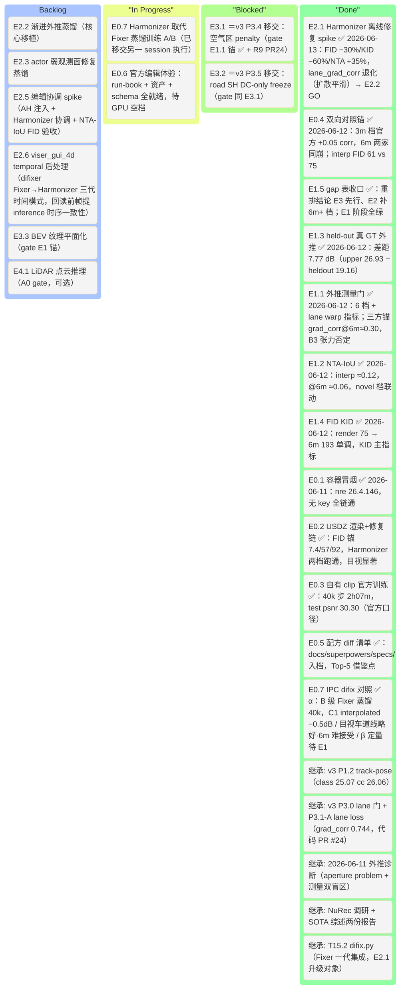
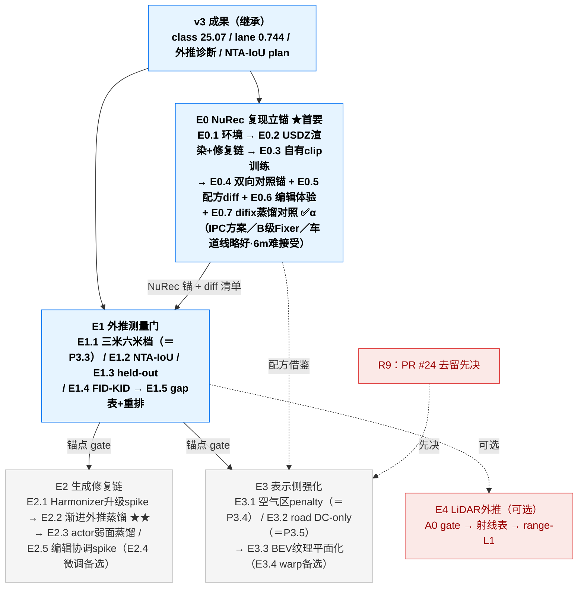

# 3DGRUT v4 — Extrapolation 性能 · 可执行计划

> **本文档定位**：v4 **主线 plan**。v4 唯一主题 = **extrapolation（外推视角）性能**：让 v3 已做实的 interpolated 重建质量（车辆 / 道路车道线）在**偏离录制轨迹的视角**（横移 3m/6m、变 yaw、变高度、held-out 相机）下仍然可用。
> **方法论（2026-06-10 NuRec 调研定稿）**：对标 NVIDIA NuRec 的**双层架构**——表示侧忠实重建 + 生成修复器补洞（渐进蒸馏 + 在线增强）。**首要任务（大g 指定）= 先用 NuRec 官方工具链复现场景立锚，再参考其思路在 3dgrut2 仓库实现性能提升。**
> **决策依据（decision of record）**：
> - NuRec 工具链调研 [`~/repo/report/nvidia-nurec-extrapolation-analysis.md`](../report/nvidia-nurec-extrapolation-analysis.md)（修复器三代演进 / DiFix3D+ 量化证据 / held-out 协议 / license）
> - 领域综述 [`~/repo/report/3d-4d-state-of-the-art-2025-2026.md`](../report/3d-4d-state-of-the-art-2025-2026.md)（外推 = 生成先验主战场；NTA-IoU/FID/KID 评测共识）
> - 2026-06-11 外推诊断（aperture problem 根因 + 测量双盲区）：[`v3_plan_revised.md`](v3_plan_revised.md) § 2.3 / § 6 Done Log
> **执行约定**：沿用 [`CLAUDE.md`](CLAUDE.md)（inceptio 首选 / depth-off+nw=10 铁律 / 文档同步纪律 / Mermaid 全角括号）；具体任务开工时按 superpowers 流程在 `docs/superpowers/plans/` 起 TDD 执行 plan。
> **官方工具就绪**：NVIDIA nurec-skills 已装入本环境（`nre` / `ncore` / `asset-harvester` / `nurec-fixer` / `physical-ai-datasets` / `nurec-index`），E0 直接调用。

---

## 0. 目标与 KPI

### 0.1 v4 核心方向（extrapolation，2026-06-11 定稿）

> **真实成功指标 = 外推视角下道路/车道线 + 车辆的可用质量**：lateral 3m/6m 下车道线不糊、车辆不散、路面无悬浮鬼影；并有一套能证明它的测量体系。

三条事实链支撑这个方向：

1. **根因已确诊**（2026-06-11 诊断，v3 § 2.3）：训练相机全在 ego 轨迹一条线上、路面掠射角观测 → **aperture problem 欠约束**——road/bg 耦合（bg 悬浮粒子"帮忙"渲染）与 3m/6m 外推退化是**同根因两面**。训练视角内无解，必须引入新约束或新监督。
2. **领域共识**（SOTA 综述 Key Finding #4）：外推是 2025–2026 最大未解问题，**生成先验是共识解法**；评测用 NTA-IoU / NTL-IoU / FID / KID，不用无 GT 的 PSNR/LPIPS。
3. **NuRec 实证**（调研报告 § 2）：NuRec 外推可用性的支柱是**修复器链**（DiFix3D+ → Fixer → DiffusionHarmonizer）——驾驶外推实测 **+1.8 dB PSNR / FID −20%**；其 ablation 证明**纯后处理只提感知（FID 134.65→49.87），蒸馏回 3D 才提几何（PSNR +1.03），叠加最优**。

**v3 → v4 的关系**：v3 把 interpolated per-class 质量做到位（车 class_psnr 25.07 / lane grad_corr 0.744 / cc 26.06）；v4 把这些质量**带出训练轨迹**。v3 遗留的 Phase 2（行人）与 P3.2 仍归 v3 主线，由大g按资源另行排期；P3.3–P3.5 因属外推主题**移交 v4**（见 § 2.5）。

### 0.2 KPI — 外推指标为主（绝对数 E0/E1 回填）

> ⚠️ 沿 v3 纪律：**不设虚构绝对阶梯**。新 KPI = 每轴相对 E0（NuRec 锚）/ E1（自有锚）的 gap 闭合；绝对目标数锚点测完才定。下表「量级参考」来自他人论文、不同数据/协议，**只作方向感，不可直接对标**。

| 轴（主 KPI） | 现状 | 测量工具 | v4 目标 / 量级参考 |
|---|---|---|---|
| **车道线外推** lane grad_corr / band_lpips @ lateral_3m/6m | **未测（测量盲区）**：现 `NOVEL_VIEW_MODES` 仅 lateral_1m/2m + yaw_5/10deg | E1.1（=P3.3）：[`novel_view.py`](threedgrut/utils/novel_view.py) 扩档 + lane 区域 novel 指标 | E1 立锚 → E2/E3 闭合；参考 DiFix3D+ FID −20% 量级 |
| **车辆外推** NTA-IoU（原轨迹 + 3m/6m 档） | 未测（plan 已备未执行） | E1.2：[`2026-06-10-nta-iou-eval-metric.md`](docs/superpowers/plans/2026-06-10-nta-iou-eval-metric.md) | E1 立锚 → 闭合；参考 ReconDreamer 系 3m 0.498→0.572 |
| **真 GT 外推** held-out camera per-class | 未测（协议不存在） | E1.3：留出侧相机做真 GT 外推集（DiFix3D+ RDS 协议反用） | E1 立锚 → 闭合 |
| **感知质量** FID/KID @ 3m/6m | 未测 | E1.4：FID/KID 接入 render eval | 立锚 → 不升 |
| **NuRec 同 clip 对照锚** | 传闻 ~36 dB 未实测（v3_plan.md L33 理论对标值） | **E0.4**：官方 nre 配方在自有 clip 训练 + 双向全指标对照 | 把"与 NuRec 差距"从估计变实测，量化 v4 天花板 |
| 守护线（interpolated 不退化） | class_psnr 25.07 / cc 26.06 / lane grad_corr 0.744 / novel(≤2m) 0.5962 | 现成（v3 全套） | cc ≥ 24.7（沿 v3）；grad_corr / class_psnr 不退 |

### 0.3 v4 不做（明确出界）

- **行人**（SMPL/rigid 垫脚石）—— 留 v3 Phase 2，v4 外推评测亦不含 person 轴（无模型可推）
- **编辑/仿真完整产品化**（删/插 actor 不留痕的质量达标）—— 留 v5；但 v4 **纳入两个窄域 spike**（E0.6 官方链编辑体验 + E2.5 3dgrut2 侧插入协调，2026-06-11 大g 拍板）：asset-harvester 与 Harmonizer 同为 NuRec 官方「优化与资产」两大件、Harmonizer 训练管道③（asset re-insertion，正是用 3DGUT+Asset Harvester 构造）④（PBR 阴影）专为插入协调而设，且插入物在新位姿/光照下渲染本质是**内容外推**——与 v4 主题同根
- closed-loop 仿真器集成（CARLA / AlpaSim gRPC 接入）、跨 clip 联训、feed-forward、relighting、LiDAR intensity/ray-drop 内核改造（E4-A3 backlog）
- NuRec 专有数据复现（1M–1B 张 post-train 数据不可得；开源 Harmonizer 权重已含其收益）

### 0.4 v4 起点 baseline（继承 v3，不重训）

| 维度 | 数值 | 来源 |
|---|---:|---|
| 车辆 class_psnr（interpolated） | **25.07** | v3 P1.2 fix（poseopt+boundary+prior，inceptio 30k） |
| cc_psnr_masked | **26.06** | 同上 |
| lane grad_corr（interpolated） | **0.744** | v3 P3.1-A（门锚 0.693 → +0.051；代码在 PR #24） |
| novel LPIPS avg（lateral≤2m+yaw 4 档） | 0.5962 | P3.1-A 实测（**仅 ≤2m 有效**，3m/6m 盲区） |
| baseline 对照配方 | inceptio depth-off + nw=10，从头训 | CLAUDE.md 铁律；v3 R7（resume 不可靠） |
| NuRec 对照锚 | **待 E0.4 回填** | — |

---

## 1. 项目看板（Kanban）

> 状态：⬜ Todo · 🟡 In Progress · 🔵 Review · ✅ Done · ⏸ 降级 · ⏭ Skip

### 1.1 顶层看板（Mermaid Kanban）

> 注：E1.1/E3.1/E3.2 初始在 Blocked 列——E1.1 等 E0.1 环境完成后即解锁（纯 eval 可与 E0 并行）；E3.1/E3.2 gate = E1.1 锚点 + PR #24 去留（R9）。

### 1.2 任务级看板（E*.* 编号）

| ID | Phase | 主题 | 继承来源 | 估时(d) | 状态 | gate / 备注 |
|---|---|---|---|---:|:---:|---|
| **E0.1** ★ | E0 | **容器环境 gate**：镜像拉取 ✅ + 运行时冒烟 ✅（2026-06-11 全部完成）。实测：`nre-ga:latest` = **26.4.146-c63f08a4**（2026-05-28 build）；validate_setup.py 仅 2 预期 FAIL（24GB 边界 + key 空）；容器内 nvidia-smi/CLI 全子命令面正常；**无 NGC key 跑通 train/render 全链**（R-v4.1 答案：key 仅 difix-distill 下载 `cosmos_3dgut.pt` 时需要） | 新 | 0.5 | ✅ | 无 key 训练+渲染实测通过；唯一例外＝官方 train-time difix 蒸馏权重在 NGC |
| **E0.2** ★ | E0 | **官方 USDZ 场景渲染 + 修复链体验** ✅（2026-06-11）：场景 0fd06bc3（1.92GB 4K）+ 048b974e 已下；`nre render` 三档各 595 帧（gt / lat3m / lat6m，rig offset 法，17.8ms/帧 @4090 1080p）；Harmonizer 时间模式修复两档跑通。**FID（vs 真实参考帧分布）：原轨迹渲染 7.37（忠实度极高）/ lat3m 57.3→修复后 65.6（↑）/ lat6m 91.8→86.6（↓5.2）**；目视修复显著（锥桶修直 / 涂抹消除 / 黄线连续）但 FID 几乎不动——**判别产出：官方表示侧伪影轻，FID 大头＝视角内容差，修复链 FID 收益∝伪影占比**（论文 134→50 是重伪影场景；3dgrut2 伪影重于官方→E2 收益预期更大）；FID 单指标评修复会误判（E1.4 须配区域化指标，R-v4.5 实证） | 新 | 1 | ✅ | 帧档：inceptio `~/work/nurec_e0/renders/0fd06bc3/` + `~/repo/harmonizer/input_frames_cosmos_temporal_lat{3,6}m/`；真帧 `~/work/nurec_e0/real_frames/`；Harmonizer 权重全 HF 化（token 须开 gated 权限 + Cosmos-Predict2 模型页接受 license——两步均需 HF 网页手动操作，已留档） |
| **E0.3** ★ | E0 | **自有 clip 官方配方训练复现** ✅（2026-06-11）：clip 9ae151dc 用 Hyperion-8.1 `car2sim_6cam`+pai overlay（PAI 配方，非 Waymo 3dgut_dynamic）40k 步一次训完——**4090 24GB 无降配**（峰值 16GB / 稳态 ~9GB，2.62M gaussians），2h07m（7.45 it/s）。**官方口径锚：test/psnr 30.30 / cpsnr road 38.27 · car 34.59 · person 32.65 / chamfer 0.295**；产物 `artifacts/last.usdz`（1.1GB）+ 20 类 cpsnr 全套。兼容性结论：官方分片全兼容 nre 26.4，唯一不兼容＝v3 自产 lane aux（缺 consolidated 元数据 + sequence 标识不符）→ 移出即过（R-v4.3 实际未命中） | 新 | 1.5 | ✅ | ⚠️ 官方 val 口径＝每 3 帧+1/4 分辨率+cpsnr，**不可直接对比 multilayer 数字**（E0.4 统一口径重算） |
| **E0.4** ★ | E0 | **同 clip 双向对照锚**：NuRec ckpt 与 multilayer baseline 互渲 — interpolated（PSNR/LPIPS/per-class）+ 外推（lateral 3m/6m lane/NTA-IoU/FID，用 E1 工具）双向跑全指标 → **v4 gap 表首行**（量化"差距在哪一层"：表示/配方/修复器） | 新 | 1 | ✅ | **2026-06-12 完成**：时间戳精确对齐（600 映射 max_dt=0µs）+ 反号保险趟实证 offset 语义（grad_corr 0.437 vs 0.045）；**判别数字：lane@3m 官方 +0.05 corr/+3.9dB band_psnr、@6m 两家同崩 ~0.30；interp FID 61 vs 75 官方更干净、interp grad_corr 我方反超（B3 0.739 vs 官方 0.659，full-res+lane loss 近景更锐）**；详见 §5 Done Log |
| **E0.5** | E0 | **配方 diff 清单** ✅（2026-06-11）：官方 resolved 全量（8438 行 parsed.yaml）vs [`ncore_3dgut_mcmc_multilayer.yaml`](configs/apps/ncore_3dgut_mcmc_multilayer.yaml) 11 维度逐项 diff → [`2026-06-11-e05-nurec-vs-multilayer-recipe-diff.md`](docs/superpowers/specs/2026-06-11-e05-nurec-vs-multilayer-recipe-diff.md)。**Top-5**：① road 几何冻结五件套（ground-mesh init + lr 1e-6 冻结 + MCMC 豁免 + z-scale/平整正则，喂 E3.1-E3.3）② road/bg 所有权 init 切分（bg init 剔 road 类点）③ 官方 train-time difix 蒸馏钩子原生＝±3m lateral 增强（本 run 关，sqa_difix_distill 开，喂 E2.2）④ 对锚口径陷阱（官方 val 每 3 帧+1/4 res+cpsnr）⑤ LiDAR ray 级监督 2048 ray/step + 200m 远场 | 新 | 0.5 | ✅ | 顺手发现：`LayerSpec.scale_lr_mult` 死配置（已 spawn 后台任务）；官方 `noise_lr 5000` vs 本项目 5e5 待验证 |
| **E0.6** | E0 | **官方链 actor 插入/取代体验**：在 E0.2 USDZ 场景或 E0.3 自有 clip 重建上走官方编辑工作流——nre actor 编辑（gRPC/CLI 删/移/替）+ `asset-harvester` 资产插入（项目已收割 3 车+3 人直接可用）+ Harmonizer 协调（训练管道③④正为此设）→ 渲染对照 + **官方编辑能力/限制清单**（删除后路面是否出洞 / 插入物阴影来源 / 协调前后 FID） | 新（大g 2026-06-11 提议纳入） | 1 | 🟡 | run-book + 能力清单骨架已入档（[`2026-06-12-e06-official-actor-editing-capability.md`](docs/superpowers/specs/2026-06-12-e06-official-actor-editing-capability.md)）；前置全验证（sequence_tracks ✅ / AH 资产已传 / schema 全文消化）；待 GPU 空档执行 |
| **E0.7** | E0 | **官方 difix-distill 对照 run**（2026-06-12 大g 拍板新增；独立执行 plan [`2026-06-12-e07-official-difix-distill-ab.md`](docs/superpowers/plans/2026-06-12-e07-official-difix-distill-ab.md)）：**E0.3 配方 + `difix.training.enabled=true` 单 key 覆盖**（最小变量——E0.5 实测蒸馏钩子参数已固化在 parsed.yaml：±3m novel poses + p_scheduler + color transfer，唯 enabled=false；`sqa_difix_distill.yaml` 降级为开蒸馏方式的文档性对照）同 clip 9ae151dc 重训 40k → 与 E0.3 锚（difix OFF）单变量对比 → **官方修复器蒸馏增益上限锚**＝E2.2 预期收益的直接校准（Δ@3m vs Δ@6m＝渐进推进收益读数）。权重：① inceptio 已 ngc login，先试官方下 `cosmos_3dgut.pt`（A 级口径）；② 不行走 R-v4.10 hack——B 级 HF [nvidia/Fixer](https://huggingface.co/nvidia/Fixer) / C 级 sd_difix+HF Difix3D，等级标进增益表列头 | 新（E0.5 diff Top-5 ③衍生） | 0.5 | ✅ α | **α 完成（2026-06-12，IPC 方案，权重级 B）**：NGC/hack 权重因 jit.load-vs-state_dict 格式墙不可行 → 大g改 IPC（Fixer server@harmonizer 容器 + nre DifixModel socket 转发，换 server=换修复器）。B 级 HF Fixer 蒸馏 40k（2h19m，单变量审计干净）。**C1 interpolated 全面 −0.5~1.35dB**（psnr 30.30→29.77）；**C3 目视车道线略好·其它持平·6m 难接受** → difix 蒸馏机制有效（车道线正中 v4 lane KPI）但 B 级权重温和局部，显著增益需官方权重+progressive（喂 E2.2）。**β lane/NTA-IoU 定量待 E1.1/E1.2**（USDZ 已落盘）。详见 §5 Done Log。**β'（Harmonizer 取代 Fixer，大g 提议）已于 2026-06-15 启动执行**（`launch_harmonizer_train.sh`：harmonizer_server@:59487 READY + e07_harmonizer_train 容器跑 40k，预计 ~2.5h）——移交方案 [`2026-06-12-e07-harmonizer-as-fixer-handoff.md`](docs/superpowers/specs/2026-06-12-e07-harmonizer-as-fixer-handoff.md)（同 IPC 协议 `harmonizer_server.py` smoke ✅）；E1.1/E1.2 工具已落地 → **β 定量回填解锁**（两个 USDZ 纯渲染回填，不重训） |
| **E1.1** ★ | E1 | **外推测量门扩展** = **v3 P3.3 移交**：lateral_3m/6m 新档（4 档 avg 口径不变保历史可比）+ lane 区域 novel 指标（路面平面诱导 warp 重投影）+ 三方 ckpt（baseline/B3/aniso20）立锚，顺答 B3 细长高斯外推张力 | v3 P3.3（2026-06-11 立项原文 [`v3_plan_revised.md`](v3_plan_revised.md) §1.2） | 1.5 | ✅ | **2026-06-12 完成**：PR #24 eval 侧移植（R9 中立）+ plane_warp 模块 + 6 档扩档；avg 口径回归 Δ1.5e-5 PASS；三方锚 lane grad_corr@3m≈0.38 / @6m≈0.30 三方打平 → **B3 张力否定、外推退化配方无关**；详见 §5 Done Log |
| **E1.2** ★ | E1 | **NTA-IoU 接入**：按 [`2026-06-10-nta-iou-eval-metric.md`](docs/superpowers/plans/2026-06-10-nta-iou-eval-metric.md) 执行（Task 0–5 全 TDD 已写好）+ **增量**：novel 外推档下也跑 NTA-IoU（渲 lateral_3m/6m 帧→检测→与投影 GT box IoU） | docs/superpowers plan（未执行） | 1.5 | ✅ | **2026-06-12 完成**：interp 0.117/0.120/0.120（三方），@3m 0.076–0.096，@6m 0.054–0.062 单调；口径注记：全 GT 车含远景小目标、YOLOv8m conf 0.3 best-match，绝对值不与论文比 |
| **E1.3** ★ | E1 | **held-out camera 真 GT 外推协议**：训练排除 1–2 台侧相机（`dataset.camera_ids` 覆盖），eval 在被排除相机跑 per-class 全套 → 唯一**有真 GT** 的外推轴（DiFix3D+ RDS cross-reference 协议反用）；需从头训 1 个对照 ckpt | NuRec 调研 § 5.1 | 1.5 | ✅ | **2026-06-12 完成**：4-cam 30k 实际仅 **70 min**（depth-off 轻配方）；三件套（同 exposure-off 口径）——held-out cc 19.16 / guard 25.82 / upper 26.93 → **真 GT 外推差距 7.77 dB**（car class gap 3.5 dB / NTA 0.101→0.071）；guard 25.82 ≈ 5-cam baseline 25.79 → 4-cam 不伤训练相机 |
| **E1.4** | E1 | **FID/KID 接入**：novel 外推档渲染帧 vs 训练视角真图分布的 FID/KID（torchmetrics/clean-fid），写 metrics.json `mean_novel_fid_{mode}` | SOTA 综述（无 GT 外推共识指标） | 1 | ✅ | **2026-06-12 完成**：`--novel-fid` 开关；baseline FID render 75.3 → 1m 124 → 3m 168 → 6m 193 单调（K4 sanity PASS）；KID 主指标（subset 自适应）；**FID render 75 vs 官方场景 7.4 → 自有表示侧伪影重一个量级（E0.2 推论③实证）** |
| **E1.5** | E1 | **v4 gap 表回填**：E0.4 NuRec 锚 + E1.1–E1.4 自有锚汇总入 § 1.3，**据实重排 E2/E3 优先级**（对标 v3 R1 纪律） | — | 0.5 | ✅ | **2026-06-12 重排结论：E3 先行、E2 定位 6m+ 档互补**。证据链：①官方纯表示侧（difix 关）3m lane +0.05/+3.9dB（road 冻结五件套之效）②6m 两家同崩 ~0.30 → 表示侧只能右移退化曲线一档，6m 必须修复链 ③三方锚配方无差 → 差距是结构性配方非调参 ④interp FID 61 vs 75 官方伪影少 ⑤E1.3 真 GT gap 7.77dB。**执行序：E3.1/E3.2 短刀（待 R9，大g暂缓）→ E3.3 BEV；E2.1 spike 低成本并行（域差已被 E0.7 smoke 初步排除）** |
| **E2.1** ★ | E2 | **Harmonizer 升级集成 + 域差 spike**：[`third_party/Fixer`](third_party/Fixer)（一代）→ [NVIDIA/harmonizer](https://github.com/NVIDIA/harmonizer)（Cosmos Predict2 0.6B，时间条件，Apache-2.0）；HF `nvidia/Harmonizer` 权重 → 对 baseline 渲染的 3m/6m 帧离线修复 → E1 指标前后对比（**纯后处理预期：FID/感知大改善、几何指标不动**——正确预期，勿误判失败） | NuRec 调研 § 2.3/5.2 + v3 T15.2 | 1 | ✅ | **2026-06-13 完成**（render-only daefc03/4ac911d · batch-fix cd9fa6b · compare 24b03b0）：render-only 关监督出帧 10.6→4.62s/帧 + harmonizer IPC 批修复 750 帧 + eval_frames_dir 评。**FID −33%/−28% · KID −64%/−56% · NTA +0.033/+0.037 · lane_grad_corr −0.085/−0.095**（raw≡E1锚口径已验）；目视去伪影显著无异物 → **E2.2 GO**（§5 Done Log） |
| **E2.2** ★★ | E2 | **渐进外推蒸馏（v4 核心）**：DiFix3D+ progressive update 移植——外推位姿从 1m→2m→3m→6m 逐步推进，每步「渲染→Harmonizer 修复→修复帧按低权重蒸馏回 3D（road/lane 区域加权）→下一步」；区别 v3 Stage 15 教训：不打全图 repro 轴，蒸馏目标=外推档 + road/lane 病灶区 | NuRec 调研 § 2.4（ablation 证据）+ v3 Stage 15 复活改轴 | 2.5 | ⬜ | gate=E2.1 spike + E1 锚；验收=E1 全指标 |
| **E2.3** | E2 | **actor 弱观测面修复蒸馏**：对车辆 track object-centric 环绕渲染弱观测面 → Harmonizer 修复 → cuboid×sseg mask 内低权蒸馏；攻 P1.4 验尸根因（未观测面缺约束）的 2D 监督解法 | v3 P1.4 否定结论 + SOTA 共识（2D 监督非 3D 注入） | 2 | ⬜ | gate=E2.1；验收=class_psnr + NTA-IoU + 守护线 |
| **E2.4** | E2 | （备选）**Harmonizer 域内微调**：若 E2.1 spike 显示 NCore 域差大——按 DiFix3D+ 降质构造法（cycle reconstruction 横移 1–6m / model underfitting / cross reference）在自有 clip 造配对，LoRA 级微调 | DiFix3D+ 论文 § 训练数据构造 | 2 | ⬜ | 仅 E2.1 域差坐实才投 |
| **E2.5** | E2 | **编辑协调 spike（3dgrut2 侧）**：复用 AH 注入引擎（PR #18 plumbing / frozen 离线手术）在自有 ckpt 插入/取代 1–2 辆 asset-harvester 车 → Harmonizer 时间模式协调 → NTA-IoU/FID + 目视验收；**不训练或轻训练**——区别 P1.4 warm-start（重建轴）：本卡是编辑场景 + 生成协调，正是 NuRec 官方编辑形态 | 新（E0.6 的 3dgrut2 对应） | 1.5 | ⬜ | gate=E2.1 + E0.6 清单；v5 编辑轴第一块带指标基石 |
| **E2.6** ★ | E2 | **viser_gui_4d 交互 difixer 升级（temporal 后处理提 inference 质量）**：[`viser_gui_4d.py`](threedgrut_playground/viser_gui_4d.py) 现 `--difix_server` 接 Fixer 一代（单帧）→ 换 DiffusionHarmonizer 三代**时间模式**（`diffusion_harmonizer.pkl`，回读前 K 帧已修复输出做时序参考）→ 对交互渲染的连续帧序列后处理，用帧间时序一致性提升 inference 视觉质量（去闪烁/运动连贯）。复用 E0.7 IPC server 架构（`fixer_server.py`→harmonizer temporal server）+ viser_gui_4d 已有 `--difix_server` 钩子。**唯有连续渲染序列能发挥 Harmonizer 时序优势**（区别 E2.1 离线单帧 / E2.2 训练蒸馏必 nontemporal）| 新（2026-06-12 大g 提议）| 1 | ✅ | **2026-06-15 完成，inceptio 端到端目测通过**（commits 9de9101/5cf26e7/4058704/cce14ba）。设计：client-side K-deque（history 在 client、server 无状态、seek=clear 自然 reset）；HMN1 协议独立于 DFX1（守护 E1 锚）；`_on_time_change` 的 `source!="play"` 自动 reset 历史。**关键修复（cce14ba）**：Harmonizer temporal Conv3d kernel=3 只接受 V=1 或 V≥3，冷启动逐步增长（V=2,3,4）会 crash → 改为 history 满了 K 才发 V=1+K，否则 V=1（对齐官方 `have_history = len >= min_history`）。实测 V=5 延迟 ~1000ms（5 帧 0.6B），K=2 可降到 ~600ms 备选。详见 §5 Done Log |
| **E3.1** | E3 | **空气区 penalty** = **v3 P3.4 移交**：路面上方 0.4m~上界悬浮 bg opacity penalty（cuboid actor 豁免），复用 V3-R2 基建 | v3 P3.4 | 1.5 | ⬜ | gate=E1.1 锚 + **R9（PR #24 去留先决）** |
| **E3.2** | E3 | **road SH 降阶 DC-only（freeze 法）** = **v3 P3.5 移交**：砍 view-dependent 过拟合逃逸通道（路面近似 Lambertian） | v3 P3.5 | 1 | ⬜ | gate 同 E3.1 |
| **E3.3** ★ | E3 | **BEV 纹理平面化**（v4 backlog 转正）：road 颜色不再 per-gaussian SH，改 BEV feature grid/纹理图采样、真正贴在高度场平面 → **外推天然正确**（参数化级根治 aperture problem；ExtraGS Road Surface Gaussians 同思路）；复用 [`road_region.py`](threedgrut/model/road_region.py) BEV 网格基建 | v3 § 5 backlog「外推终极方向」 | 3 | ⬜ | gate=E1 锚 + E3.1/E3.2 结果（短刀够用则缓） |
| **E3.4** | E3 | （备选）**平面诱导 warp 伪横移一致性 loss**：训练时按路面平面 homography warp 伪横移视角做一致性约束 | v3 § 5 backlog 备选 | 1.5 | ⬜ | E3.3 的轻量替代/前菜 |
| **E4.1** | E4 | （可选）**LiDAR 点云推理**：按 [`2026-06-10-lidar-pointcloud-from-gs.md`](docs/superpowers/plans/2026-06-10-lidar-pointcloud-from-gs.md) 执行（A0 gate：3DGUT ckpt 能否被 3DGRT 渲 → A1 射线表 → A2 range-L1/出 .ply）；外推的传感器维度（novel 轨迹渲 LiDAR），对标 NuRec LiDAR re-sim | docs/superpowers plan（未执行） | 2.5 | ⬜ | A0 NO-GO 则整线作废（plan 内置判据） |

### 1.3 Phase 状态汇总 + v4 gap 表（E0/E1 回填）

| Phase | 主题 | 任务数 (Done/Total) | 主验收 | 守护线 | 状态 |
|---:|---|---:|---|:---:|:---:|
| **E0** ★ | NuRec 工具链复现立锚（**首要**） | 5/7 | ≥2 场景跑通 ✅ + NuRec 锚 ✅ + 配方 diff ✅ + **双向对照 ✅（E0.4 判别数字入 gap 表）** + difix-distill 增益锚 ✅α（E0.7：B 级 Fixer 蒸馏，车道线略好 / interpolated −0.5dB / β 定量待回填）+ 官方编辑能力清单（E0.6 🟡）+ 修复器代际 β'（**2026-06-15 已启动执行中**，e07_harmonizer_train 跑 40k ~2.5h） | — | 🟡 |
| **E1** ★ | 外推测量门（gate 后续一切） | **5/5 ✅** | 3m/6m ✅ + NTA-IoU ✅ + FID/KID ✅ + held-out ✅（真 GT 差距 7.77 dB）+ gap 表收口 ✅（E1.5 重排：E3 先行） | interpolated 全指标不退（已验：avg Δ1.5e-5 / cc 25.79 / grad_corr 0.6931 三点零回归） | ✅ |
| **E2** | 生成修复链（NuRec 思路移植）+ 编辑协调 spike + viser temporal 后处理 | 3/6（含 1 备选） | 同左；**E2.1 ✅ 离线 Harmonizer：FID −30%/KID −60%/NTA +35%，lane_grad_corr 退化待 E2.2 蒸馏修 → E2.2 GO**；E2.5 插入协调；**E2.6 ✅ inceptio 目测通过（V=5 temporal，延迟 ~1000ms；Conv3d warmup 修复 cce14ba）** | cc ≥ 24.7 / grad_corr 0.744 不退 | 🟡 |
| **E3** | 表示侧外推强化（与 E2 互补） | 0/4（含 1 备选） | 同 E2 验收口径；E3 减伪影产生、E2 修残余 | 同上 | ⬜ |
| **E4** | LiDAR 外推（可选） | 0/1 | A0 GO + range-L1 入档 | — | ⬜ |
| **总计** | — | **10/23** | — | — | — |

> **v4 gap 表（E0.4 + E1.5 回填，格式预置）**：
> | 轴 | 3dgrut2 锚（E1） | NuRec 锚（E0.4） | 差距 | E2/E3 后 |
> |---|---|---|---|---|
> | lane grad_corr @ 3m / 6m（warped 口径） | **B3 0.381 / 0.307**（baseline 0.384/0.303，aniso20 0.389/0.298——三方打平；对照 interp 0.74 → 外推腰斩再腰斩） | **0.437 / 0.297**（band_psnr 16.34/13.45 vs 我方 12.47/11.33——**3m 档官方 +0.05 corr/+3.9dB，6m 档两家同崩**） | 3m：表示侧差距实证；6m：无差 | **E2.1 后 fixed 0.299 / 0.208（Δ−0.085/−0.095）**：扩散平滑伤高频车道线，E2.2 蒸馏待修 |
> | NTA-IoU @ 原轨迹 / 3m / 6m | **B3 0.120 / 0.076 / 0.054**（baseline 0.117/0.096/0.062；口径＝全 GT 车含远景，绝对值不与论文比） | **0.126 / 0.087 / 0.044**（interp 略高；外推档与我方交错——样本小，仅观察不下结论） | ≈持平 | **E2.1 后 fixed 0.128 / 0.100（Δ+0.033/+0.037 ✅）**：修复改善车辆检出 |
> | held-out cam 真 GT 外推（cross_left，exposure-off 口径） | **gap 7.77 dB**（heldout cc 19.16 vs upper 26.93）；car class gap 3.5 dB；NTA 0.101→0.071；guard 25.82 ≈ baseline 25.79 | 待测（E0.4 可选：NuRec 同协议 4-cam 重训成本高，暂不对称） | — | — |
> | FID/KID @ 3m / 6m | **B3 FID 165/192 · KID 0.081/0.098**（baseline 168/193 · 0.082/0.102；render 75.3/0.021；**口径＝5 相机混合分布**） | lateral：FID 217/237 · KID 0.230/0.265（**口径＝前视单相机 75 帧，与我方 5 相机口径不可直接比**）；**interp FID 61.3 vs 我方 75.3（同口径可比 → 官方伪影更少）** | interp 感知：官方更干净 | **E2.1 后 fixed FID 113/139（−33%/−28%）· KID 0.029/0.045（−64%/−56%）✅** |
> | interpolated（守护线） | class 25.07 / cc 26.06 / grad_corr 0.744 | **官方口径**：psnr 30.30 / cpsnr car 34.59 · road 38.27 · person 32.65 / chamfer 0.295（E0.3，**口径未统一不可直接比**，E0.4 重算） | 待 E0.4 | 不退化 |

### 1.4 任务依赖图

> 并行性：E1.1/E1.2 纯 eval，可与 E0 并行开工（E0.1 环境就绪即可）；E0.4 需要 E1 工具，故 E0 与 E1 交替推进。E2 与 E3 在 E1 锚后可并行（不同文件域），但**单变量 A/B 纪律**：同一对照实验只动一边。

---

## 2. Phase 详细任务卡

> 只描述目标 / 改动文件 / 验收准则，不放代码（CLAUDE.md 约束）。开工时每个任务按 superpowers 流程起 `docs/superpowers/plans/` TDD 执行 plan。

### 2.0 Phase E0 — NuRec 工具链复现立锚（首要任务）★

**触发**：立即。
**核心**：在自己动手改进之前，先把"对标对象"真实地跑起来——① 跑通官方**渲染+修复链**直观感受外推天花板（E0.2）；② 在**同一份自有 clip** 上跑官方配方，把流传的"~36 dB"对标值变成同数据实测锚（E0.3/E0.4）；③ 把官方配方与 multilayer 配方的差异变成可执行的借鉴清单（E0.5）；④ 顺手走一遍官方 actor 编辑工作流，拿到「插入/取代」的能力/限制清单（E0.6）。**全程用已装的 nurec-skills**（`nre` / `ncore` / `asset-harvester` / `nurec-fixer` / `physical-ai-datasets`），不重复造轮子。

| Task | 关键动作 | 锚点 / 备注 |
|---|---|---|
| E0.1 | ✅ 镜像已就位（`nre-ga:latest` 42.6GB / `nre-tools-ga:latest` 59.7GB，2026-06-11 实测，拉取未用 key）→ 剩：nre skill `scripts/validate_setup.py` → 容器内 `nvidia-smi` + `nre --help` 冒烟 → **不带 NGC key 先试**，遇 auth 错再补（R-v4.1）→ 显存/内存评估 + `:latest` 实际版本号记录 | inceptio 已有 docker + nvidia runtime（难点已清）；**4090 24GB 处官方推荐（24–48GB+）下限** |
| E0.2 | `physical-ai-datasets` skill 选下 1–2 个 PhysicalAI-AV-NuRec USDZ（~每场景数 GB，HF token）→ `nre render --artifact-path <usdz>` 原轨迹 + 自定义 `--custom-rig-trajectory`（横移 3m/6m）渲帧 → `nurec-fixer` skill 过 Harmonizer（时间/非时间两模式）→ 目视对照 + 修复前后 FID | **不训练、成本最低**，先验证"官方场景外推+修复后长什么样"；产出对照帧存档供 E2 设计参考 |
| E0.3 | 自有 clip（`pai_9ae151dc`，inceptio `~/work/data/9ae151dc/`）先 `ncore` skill validate 格式版本 → `nre` 官方 AV 配方（`3dgut_dynamic` 系）训练；OOM 则降分辨率/相机数，仍不行 → `vast-train` skill 起 48GB 卡 | **NCore v4 本就是 NuRec 原生格式**，预期低摩擦；R-v4.3 版本兼容风险见 § 3 |
| E0.4 | 双向对照：NuRec ckpt 与 multilayer baseline ckpt 在**同一评测协议**下跑全指标——interpolated（PSNR/LPIPS/class_psnr/lane grad_corr）+ 外推（E1.1 的 3m/6m lane 指标、E1.2 NTA-IoU、E1.4 FID/KID）。NuRec 侧用 `nre render` 出帧后喂项目 eval 工具（指标代码统一用项目侧，保口径一致） | **v4 gap 表首行**；若 NuRec 外推也糊 → 修复器才是主差距，E2 权重↑；若 NuRec 表示侧就稳 → 配方/E3 权重↑。**这个判别本身就是 E0 最大价值** |
| E0.5 | diff 官方 yaml vs [`ncore_3dgut_mcmc_multilayer.yaml`](configs/apps/ncore_3dgut_mcmc_multilayer.yaml)：LiDAR intensity 监督、densification/正则参数、相机/rolling shutter 处理、sky/road 专项、训练长度与 lr 调度 → 按「外推相关性」标记优先级，喂 E3 | 产出 markdown 清单入 `docs/superpowers/specs/` |
| E0.6 | nre actor 编辑（gRPC `serve-grpc` 演员编辑 / CLI）做「删一辆 / 插一辆 AH 收割车 / 取代一辆」→ Harmonizer 协调 → 渲染对照存档 + 能力/限制清单（删除后路面洞？插入物阴影来源？协调前后 FID/目视） | **P1.4 官方解法对照**：官方不把 asset 做完美，而是插入后生成协调器擦屁股；清单直接喂 E2.5 设计 |
| E0.7 | 按独立 plan [`2026-06-12-e07-official-difix-distill-ab.md`](docs/superpowers/plans/2026-06-12-e07-official-difix-distill-ab.md) 执行（Task 0–5）：E0.3 配方 + `difix.training.enabled=true` 单 key 覆盖同 clip 重训 40k（蒸馏钩子参数已固化于 parsed.yaml：±3m / p_scheduler / color transfer）→ vs E0.3（OFF）单变量对比（parsed.yaml diff 审计入档）→ **官方蒸馏增益上限锚**（E2.2 校准；Δ@3m vs Δ@6m＝渐进推进收益读数）。权重路径：先试官方 ngc 下载（A 级），不行 hack——B 级 HF Fixer 预放 cache / C 级 `difix=sd_difix`+HF Difix3D；state_dict 探针先行 + 300 步 smoke（start_step=50 强迫早 fire）再烧全量，等级标进增益表列头 | **✅ α 完成（2026-06-12，IPC 方案，权重级 B）**：NGC/hack 权重因 jit.load-vs-state_dict 格式墙走不通 → 大g改 **IPC**（Fixer server@harmonizer 容器 + nre `DifixModel` socket 转发，换 server=换修复器）。C1 interpolated −0.5dB（psnr 30.30→29.77）/ 目视车道线略好·6m 难接受 → difix 蒸馏机制有效（正中 v4 lane KPI）·B 级权重温和局部·显著增益需官方权重+progressive（喂 E2.2）。β lane/NTA-IoU 定量待 E1.1/E1.2。详见 §5 Done Log |

**验收**：≥2 场景跑通（1 官方 USDZ 渲染+修复链、1 自有 clip 官方训练）；NuRec 锚数字写入 § 1.3 gap 表 + § 5 Done Log（commit hash + 实测数）；配方 diff 清单 + 官方编辑能力/限制清单入档。**E0 不改 3dgrut2 任何训练代码。**

### 2.1 Phase E1 — 外推测量门 ★

**触发**：E0.1 完成即可与 E0 并行。
**核心**：v3 教训（测量先行）在外推轴重演——现 novel 指标存在**幅度盲区**（仅 ≤2m）与**区域盲区**（全图 LPIPS 沥青/bg 主导）。E1 不立锚，E2/E3 任何"改善"不可证。

| Task | 改动文件 / 锚点 |
|---|---|
| E1.1（=P3.3 移交，任务卡原文见 [`v3_plan_revised.md`](v3_plan_revised.md) § 1.2 P3.3） | [`novel_view.py`](threedgrut/utils/novel_view.py)（加 lateral_3m/6m 档，4 档 avg 字段口径不变）、[`render.py`](threedgrut/render.py)、[`per_class_eval.py`](threedgrut/model/per_class_eval.py)（lane 区域 novel 指标：路面平面诱导 warp 重投影 lane band，FTheta 兼容）；三方 ckpt（baseline/B3/aniso20，inceptio 现存）立锚 |
| E1.2 | 按 [`2026-06-10-nta-iou-eval-metric.md`](docs/superpowers/plans/2026-06-10-nta-iou-eval-metric.md) Task 0–5 执行（新建 `nta_iou.py` / `vehicle_detector.py`）；**增量**：novel 档渲染帧上同样跑 NTA-IoU（GT cuboid 投影到 novel 相机位姿——投影函数复用 `project_cuboids_to_mask`，位姿来自 novel_view 档位变换） |
| E1.3 | 训练配置：`'dataset.camera_ids=[...]'` 排除 1–2 台 cross 相机从头训对照 ckpt（inceptio depth-off+nw=10 配方）；eval：被排除相机上跑 per-class 全套 + NTA-IoU。新增 eval 开关（held-out 相机集合可配） |
| E1.4 | render eval 新增 FID/KID：novel 档渲染帧集 vs 训练视角真图集（torchmetrics image.fid / kid；帧数 <500 用 KID）。metrics.json：`mean_novel_fid_{mode}` / `mean_novel_kid_{mode}` |
| E1.5 | 汇总 E0.4 + E1.1–1.4 → § 1.3 gap 表回填 + **据实重排 E2/E3**（写明判别逻辑结果：差距主因=修复器/表示/配方） |

**验收**：gap 表全行立锚；现有 interpolated 指标零回归（纯增量改动）；metrics.json 新字段齐全（CLAUDE.md § B6：没见到新 key 不许标 ✅）。

### 2.2 Phase E2 — 生成修复链（NuRec 核心思路移植）

**触发**：E1 锚点入档 + E2.1 spike 正向。
**核心**：把 NuRec 已验证的「修复器双模式」移植到 3dgrut2——**蒸馏回 3D 提几何，在线后处理提感知**（DiFix3D+ ablation 实证）。与 v3 Stage 15 的本质区别：旧实验打"全图 repro 轴"（+0.30 而废），E2 打"外推档 + road/lane/actor 病灶区"。

| Task | 改动文件 / 锚点 |
|---|---|
| E2.1 | `third_party/` 新增 harmonizer（[NVIDIA/harmonizer](https://github.com/NVIDIA/harmonizer)，HF `nvidia/Harmonizer` 权重：`diffusion_harmonizer.pkl` 时间版 / `harmonizer_nontemporal.pt` 单帧版）；升级 [`correction/difix.py`](threedgrut/correction/difix.py) 为后端可切换（fixer/harmonizer）；spike：baseline 渲 3m/6m 帧 → 两模式修复 → E1 指标前后对比 + 目视存档。**预期正确性提醒：纯后处理 FID/感知应大改善、grad_corr/NTA-IoU 等几何敏感指标基本不动——这是 ablation 的预期行为，不是失败** |
| E2.2 | [`trainer.py`](threedgrut/trainer.py) 新增渐进蒸馏调度（opt-in，默认关）：每轮从 [`novel_view.py`](threedgrut/utils/novel_view.py) 取当前外推档位姿 → 渲染 → Harmonizer 修复（时间模式，批量离线）→ 修复帧入蒸馏 buffer（低权重 λ_distill，road/lane 区域加权 mask）→ 档位按 schedule 推进 1m→2m→3m→6m。ckpt/恢复兼容；A/B：E2.2 on vs off 从头训对照 |
| E2.3 | object-centric 弱面渲染（复用 playground 环绕相机基建 [`threedgrut_playground/`](threedgrut_playground/)）→ Harmonizer 修复 → cuboid×sseg mask 内蒸馏（与 E2.2 共用蒸馏 buffer 机制，目标区域不同）；攻 P1.4 根因——**约束式 2D 监督**替代被否定的 freeze 式 3D 注入 |
| E2.4 | （备选）域内微调：DiFix3D+ 降质构造（cycle reconstruction：训练 ckpt 沿横移轨迹渲帧再反向重建造退化对；underfit：25–75% epoch ckpt 渲帧）造自有 clip 配对 → LoRA 微调 Harmonizer。**仅 E2.1 域差坐实才投** |
| E2.5 | 编辑协调 spike：AH 注入引擎（PR #18 plumbing / frozen 离线手术）在自有 ckpt 插入/取代 1–2 辆收割车 → [`correction/difix.py`](threedgrut/correction/difix.py)（E2.1 升级后）Harmonizer 时间模式协调 → **三验收**：NTA-IoU（插入车被检出且框齐）/ FID（协调前后）/ 目视存档；E0.6 官方能力清单作设计输入；产出即 v5 编辑轴立项依据 |
| E2.6 ★ | **viser_gui_4d 交互 difixer 升级 = temporal 后处理提 inference 质量（2026-06-12 大g 新增）**：[`viser_gui_4d.py`](threedgrut_playground/viser_gui_4d.py) 现 `--difix_server` 接的 Fixer 一代（单帧，via [`correction/difix.py`](threedgrut/correction/difix.py)）→ 换 DiffusionHarmonizer 三代 **时间模式**（`diffusion_harmonizer.pkl`，回读前 K 帧已修复输出做时序参考）→ 对交互渲染的连续帧序列后处理，用帧间时序一致性提升 inference 视觉质量（去闪烁 / 运动连贯）。复用 E0.7 IPC server 架构（`fixer_server.py` → harmonizer temporal server，回读历史输出做参考帧）+ viser_gui_4d 已有 `--difix_server` 钩子。**为何独立于 E2.1/E2.2：E2.1 离线单帧修复、E2.2 训练蒸馏必 nontemporal（随机单 novel view 无时序可言）——唯有交互 viewer 的连续渲染序列能发挥 Harmonizer 的时序优势，这正是 Harmonizer 三代相对 Fixer 二代的核心代际升级（视频级一致性）的用武之地**。验收：viser_gui_4d 下 temporal Harmonizer vs Fixer 单帧的帧间一致性（去闪烁目视存档 + 可选时序抖动指标）；gate=E2.1（Harmonizer 集成）；纯 inference 后处理、不依赖训练 |

**验收**：E1 外推指标（lane@3m/6m + NTA-IoU + FID/KID + held-out per-class）相对锚改善；守护线不破（cc ≥ 24.7 / interpolated grad_corr、class_psnr 不退）；**双协议验收防幻觉**（R-v4.5）：held-out 真 GT 指标与无 GT 感知指标须同向改善。

### 2.3 Phase E3 — 表示侧外推强化（与 E2 互补）

**触发**：E1 锚点 + R9（PR #24 去留）落定。
**核心**：E2 修"已产生的伪影"，E3 减少"伪影的产生"——对应 NuRec 的表示侧（LiDAR 强监督、mesh、配方）。E3.1/E3.2 是 2026-06-11 诊断的"第 1 层短刀"（原 v3 P3.4/P3.5 移交），E3.3 是参数化级根治。

| Task | 改动文件 / 锚点 |
|---|---|
| E3.1（=P3.4 移交） | [`road_region.py`](threedgrut/model/road_region.py)、[`trainer.py`](threedgrut/trainer.py)、multilayer yaml：路面上方 0.4m~上界（A/B 定）空气区 bg opacity penalty，cuboid 内 actor 豁免；复用 V3-R2 height field / `query_ground_z` / cuboid mask 全套 |
| E3.2（=P3.5 移交） | [`layered_model.py`](threedgrut/layers/layered_model.py)、[`registry.py`](threedgrut/layers/registry.py)：road 层高阶 SH zero+freeze（保 45 维宽度一致，绕 V3-R1.1 fused SH 坑）。注：2026-06-11 已把死配置 `scale_lr_mult` 接线（`_apply_scale_lr_mult`，registry 默认 1.0 保锚点等价）——E3 做官方式 road scales lr 冻结（5e-3→1e-4）直接 `++layers.overrides.road.scale_lr_mult=0.02`，无需新代码；positions 1e-6 冻结仍需另做绝对值 override 机制 |
| E3.3 | road 颜色改 BEV feature grid/纹理图采样（贴高度场平面）：[`road_region.py`](threedgrut/model/road_region.py) BEV 网格基建扩展 + 渲染路径改造；E0.5 配方 diff 中 NuRec 对路面的处理方式作输入。**先 spike 小网格验证训练稳定，再全量** |
| E3.4 | （备选）平面诱导 warp 一致性 loss：训练 batch 内按路面 homography warp 伪横移视角与渲染一致性约束；E3.3 的轻量前菜，若 E3.1/E3.2 后 3m/6m 指标已达标则跳过 |

**验收**：同 E2 口径（E1 指标 + 守护线）；E3.1 另验 road/bg 耦合改善（路面区 bg 粒子占比、bg 替补率 <24% 现状）；R10（路面出洞）监控——E3.1 只动空气区、贴地带机制不变。

### 2.4 Phase E4 —（可选）LiDAR 外推

按 [`2026-06-10-lidar-pointcloud-from-gs.md`](docs/superpowers/plans/2026-06-10-lidar-pointcloud-from-gs.md) 执行，plan 已含 A0 stop/go gate（3DGUT ckpt ↔ 3DGRT tracer 兼容性）、A1 纯几何 TDD、A2 GPU 集成与 range-L1 验收。v4 语境下的定位：**外推的传感器维度**（novel 轨迹下渲 LiDAR 点云），对标 NuRec 的 camera+LiDAR re-sim 能力；非主线，资源富余或 E2/E3 阻塞时插空。A3（intensity/ray-drop 内核）保持 backlog。

### 2.5 与 v3 的边界与移交（避免重复实现）

| 项 | 归属 | 说明 |
|---|---|---|
| **P3.3 / P3.4 / P3.5** | **移交 v4**（E1.1 / E3.1 / E3.2） | 2026-06-11 立项时即为外推主题；执行与回填以本 plan 为准。**待办**：v3_plan_revised.md 对应三行加「→ 移交 v4_plan.md（E1.1/E3.1/E3.2）」标注（一行级改动，防双 plan 漂移） |
| Phase 2 行人（P2.1–2.3）、P3.2 遮挡式 bg、P1.1 sseg 边界、P1.3、P-CAP、AH-* | **留 v3 主线** | per-class interpolated 轴；与 v4 并行与否由大g按资源排期。P3.2 与 E3.1 共用 road 基建，若同期开工须协调（R-v4.6） |
| per-class evaluator（P0）、lane 门（P3.0）、novel_view.py、track-pose、dynamic_mask 投影、USDZ 导出、asset-harvester、difix.py | **v4 直接复用** | 不重做；E1/E2 在其上做增量 |
| NTA-IoU plan、LiDAR plan（docs/superpowers/plans/ 2026-06-10 两份） | **v4 吸收执行**（E1.2 / E4.1） | plan 文档已写好 TDD 步骤，直接按卡执行，不重写 |
| BEV 纹理平面化、平面诱导 warp、Cosmos-DiFix synthesized GT（v3 § 5 backlog） | **v4 转正**（E3.3 / E3.4 / E2.2 思路） | v3 backlog 中的外推项全部进 v4 主线或备选 |
| PR #24（P3.1-A lane loss 代码） | **R9 先决**（继承 v3） | E3.1/E3.2 动同一批 road spec/yaml，开工前必须先定 PR #24 去留，保 road 几何参数单一来源 |

---

## 3. 风险登记表（Risk Log）

| ID | 风险 | 触发 | 影响 | 缓解 | 关联 |
|---|---|---|---|---|---|
| R-v4.1 | ~~nre 容器运行时 NGC key 需求未验证~~ **已关闭（2026-06-11 实测）**：无 NGC key 跑通 validate→train（40k 步）→render→USDZ 导出全链；唯一确认需要 key 的点＝官方 train-time difix 蒸馏权重 `cosmos_3dgut.pt`（NGC API URL、HF 无副本，仅 `sqa_difix_distill` 配方用到——E2 用开源 Harmonizer 自研蒸馏绕开） | — | — | **2026-06-12 补充（大g 实证）**：官方 difix-distill 的无 key 路径已走通——`fixer_server.py`（harmonizer-cosmos-env 容器，socket IPC :59487）挂 HF 开源 `nvidia/Fixer` 权重替代 NGC `cosmos_3dgut.pt`，官方训练 `difix.training.enabled=true` 正常蒸馏；E0.7 在同协议上换 Harmonizer 做代际 A/B | E0 ✅ |
| R-v4.2 | inceptio 4090 24GB 低于官方推荐显存（24–48GB+） | E0.3 官方配方 OOM | 训练复现受阻 | 降分辨率/相机数先跑通；`vast-train` skill 起 48GB 卡（成本 ~$0.5/h，5k smoke 级） | E0.3 |
| R-v4.3 | 自有 clip 与 nre 26.x 的 NCore 版本兼容性（项目 clip 较旧 vs NCore 2026.04） | E0.3 数据加载报错 | 同上 | 先 `ncore` skill validate；不兼容则用官方 PhysicalAI 场景完成 E0.3/E0.4（锚点换数据，对照价值略降但仍立得住） | E0.3 |
| R-v4.4 | Harmonizer 域差（NVIDIA 车队数据 post-train vs NCore clip 相机/ISP） | E2.1 spike 修复质量差/引入异物 | E2 全线打折 | E2.1 先 spike 实测再投 E2.2/2.3；域差坐实走 E2.4 微调（DiFix3D+ 降质构造法已备） | E2 |
| R-v4.5 | **幻觉污染评测**：蒸馏的是扩散模型生成像素，指标升 ≠ 更真实 | E2.2/E2.3 验收 | 自欺 | **双协议验收**：held-out 真 GT 指标（E1.3）与感知指标（E1.4）须同向；目视存档强制；蒸馏权重 λ 从小起 | E2 |
| R-v4.6 | PR #24 / road 基建多任务交叠（继承 v3 R9 + P3.2 同域） | E3 开工 | road spec/yaml 双源漂移、合并冲突 | **先定 PR #24 去留再开 E3**；E3 与 v3 P3.2 不同期动 road 文件 | E3 |
| R-v4.7 | 渐进蒸馏破坏 interpolated 质量（修复帧与真图监督打架） | E2.2 训练 | 守护线破 | λ_distill 低权重起步 + 外推帧只在病灶区域加权 + 守护线全程监控（v3 全套 interpolated 指标在同一 metrics.json） | E2.2 |
| R-v4.8 | E1.3 held-out 协议与 5-cam ring 配方互斥（少相机训练本身改变 baseline） | E1.3 立锚 | 锚点口径混乱 | held-out 对照独立成线（自己 vs 自己），不与全相机 baseline 跨协议比较；文档写死口径 | E1.3 |
| R-v4.9 | Harmonizer license 合规（权重 NVIDIA Open Model License；PhysicalAI 数据集限制性专有） | 商用/再分发场景 | 合规风险 | 代码 Apache-2.0 无虞；权重许可允许商用但需保留条款；PhysicalAI 数据**仅限内部开发评测**、不入训练数据、不再分发 | E0/E2 |
| R-v4.10 | **E0.7 的 cosmos-difix 权重不可得**：`cosmos_3dgut.pt` 仅在 NGC（`nurec-fixer/versions/cosmos_3dgut`，HF 无副本，E0.5 实测确认），NGC key 拿不到或权限不足则官方蒸馏配方跑不起来 | E0.7 启动 | E0.7 阻塞 | **hack 缓解（大g 2026-06-12 指定）**：用开源 [HF nvidia/Fixer](https://huggingface.co/nvidia/Fixer) 权重塞进 nre pipeline——① 先试容器自带 legacy 变体 `difix=sd_difix`（SD 架构加载器，与 HF Fixer 同源概率高）；② HF 权重预放 `~/.cache/nre/difix/cosmos_3dgut.pt` 绕过 NGC 下载（`difix.model_url` 仅在 cache miss 时拉取）；③ 加载不兼容则对齐 state_dict / 改 `difix` 配置段指向本地。⚠️ hack 版增益锚口径与官方 cosmos-difix 不完全等价（架构/post-train 数据不同），入档时须标注权重来源。**2026-06-12 更新**：大g确认 inceptio 已 ngc login——先试官方下载一次（403/404 证据入档），预期权限不足再走 hack；α/β 拆分已拍板（硬 gate＝权重，E1.1/E1.2 仅 gate β 段指标回填）；权重等级 A/B/C 口径与全套步骤见独立 plan [`2026-06-12-e07-official-difix-distill-ab.md`](docs/superpowers/plans/2026-06-12-e07-official-difix-distill-ab.md)；全部不通 → E0.7 ⏸ 不阻塞主线。**2026-06-12 结案（IPC 方案绕开，非 ⏸）**：权重确证不可得（A 级 NGC 无特权 key；B 级 HF Fixer = state_dict、C 级 HF Difix3D = diffusers，而 nre difix loader = `torch.jit.load`（自包含 TorchScript），格式墙实测失败；JIT 自导出 trace 卡 cosmos 模型 cpu inlined 常量 device 无底洞）→ 大g改 **IPC 方案**：不把权重塞 nre，而是 Fixer 做独立 server（harmonizer 容器原生 Python 推理）+ nre `DifixModel` socket 转发，零 trace/device 坑、换 server=换修复器。E0.7 α 已完成（权重级 B，详见 §5 Done Log） | E0.7 ✅(IPC) |

---

## 4. v5 / backlog 转出

- **编辑/仿真轴产品化**（删/插不留痕质量达标、批量编辑、inpaint 遮挡地面、学习式软分割）——v4 已纳入 E0.6/E2.5 两个 spike 立基石（官方工作流能力/限制清单 + 带指标插入协调）；产品化与留痕清零留 v5，E2.5 产出即其立项依据
- closed-loop 仿真集成（gRPC 渲染服务化、CARLA/AlpaSim 对接——NuRec 调研 § 1.4 形态）
- LiDAR intensity / ray-drop（E4-A3，需改 OptiX/CUDA 内核）
- Harmonizer 时间模式在线化（训练内实时增强；v4 仅离线批量用）
- 跨 clip 联训、行人外推（等 v3 Phase 2 行人模型落地后自然并入 E1 评测轴）

---

## 5. Done Log（继承锚点 + 新条目）

**继承锚点（作 v4 对照基础）**：
- **2026-06-11 外推诊断**：aperture problem 根因 + 测量双盲区（幅度 ≤2m / 区域沥青主导）+ road/bg 耦合量化（road 自盖 68%、bg 替补 24%）——P3.3–P3.5 立项依据，本 plan E1.1/E3.1/E3.2 之源（[`v3_plan_revised.md`](v3_plan_revised.md) § 6）。
- **2026-06-10 NuRec 工具链调研**：修复器三代演进（DiFix3D+ → Fixer → DiffusionHarmonizer）、ablation 证据（后处理提感知/蒸馏提几何）、驾驶外推 +1.8dB/FID −20%、held-out 协议、nurec-skills——E0/E2 之源（[`~/repo/report/nvidia-nurec-extrapolation-analysis.md`](../report/nvidia-nurec-extrapolation-analysis.md)）。
- **v3 P1.2 track-pose**：class 25.07 / cc 26.06（interpolated 守护线锚）。
- **v3 P3.0 + P3.1-A**：lane grad_corr 门锚 0.693 → 0.744（+0.051；代码 PR #24，R9）。
- **v3 P1.4 protected warm-start 否定**：freeze 式 3D 注入被否，真瓶颈 = 未观测面缺约束 → E2.3 改 2D 修复蒸馏的立项依据。
- **v3 T15.2**：Fixer 一代已集成（[`correction/difix.py`](threedgrut/correction/difix.py)），E2.1 升级起点；Stage 15 全图蒸馏 +0.30 教训 → E2.2 改打外推档+病灶区。

**新条目（v4 启动后填充，格式：日期 + commit + 实测数）**：
- **2026-06-11 E0.1 + E0.2 + E0.3 + E0.5 完成**（commit `8b2fcbe`，worktree 分支 claude/amazing-tereshkova-5c7b30）——E0 首日四卡落地（剩 E0.4 gate E1 工具、E0.6 材料已备），全程无 NGC key：
  - **E0.1 容器冒烟**：`nre-ga:latest` 实测 = **26.4.146-c63f08a4**（2026-05-28 build，entrypoint `/app/run`）。容器内 nvidia-smi（CUDA 13.1）/ CLI 全子命令面正常。**R-v4.1 答案：无 NGC key 跑通 validate→train→render 全链**；key 唯一已知需求点 = 官方 train-time difix 蒸馏权重 `cosmos_3dgut.pt`（NGC API URL，HF 无副本）。
  - **E0.3 官方配方训练**（inceptio 4090）：clip 9ae151dc + Hyperion-8.1 `car2sim_6cam` + `references/configs/pai.yaml` overlay（`--config-name=external_overrides`），40k 步 **2h07m**（7.45 it/s），峰值显存 16GB（**24GB 无需任何降配**，R-v4.2 未触发），2.62M gaussians。**官方口径锚（每 3 帧 + 1/4 分辨率 + cpsnr）：test/psnr 30.30 / cpsnr road 38.27 · car 34.59 · person 32.65 · sky 38.81 / chamfer_distance 0.295**；产物 `~/work/nurec_e0/train_out/PVG7YYV72YKPLumogi7F7U/`（`artifacts/last.usdz` 1.1GB + val mp4 + metrics.yaml 20 类全套）。“传闻 ~36dB”在本 clip 官方口径下不存在（30.30）；与 multilayer 26.06 的对比须待 E0.4 统一口径。
  - **数据兼容实录（R-v4.3 实际未命中）**：官方 13 个 itar 全兼容 nre 26.4；唯一阻塞 = **v3 P3.0 自产 `aux.lane.zarr.itar`**（旧版 ncore 写入、缺 `.zmetadata.cbor.xz` 且 sequence 标识不符），两次启动失败（KeyError / Can't load aux data for different sequences）→ 用容器内官方 `consolidate_compressed_metadata()` 升级全部 itar 至 `9ae151dc_consolidated/` + lane aux 移出 → 三次启动成功。教训入档：**自产 aux 文件会被 nre 按文件名 glob 自动吞掉，喂官方容器的目录必须只留官方产物**。
  - **E0.2 渲染 + 修复链全链完成**（官方 USDZ 场景 0fd06bc3，1.92GB，4K→1080p）：`nre render` 三档各 595 帧（原轨迹 GT / lateral 3m / 6m，**17.8ms/帧** @4090，rig offset 法）→ Harmonizer 时间模式修复两档（~1.07it/s，594 帧/档 ~9min）。**FID（vs 真实参考帧分布，正确口径）：原轨迹渲染 7.37 / lat3m 57.3→修复后 65.6（↑8.4）/ lat6m 91.8→86.6（↓5.2）**；（早期 vs GT 渲染分布口径：57.3/93.0，留档备查）。**目视修复显著**（lat6m 锥桶修直、左缘树木涂抹消除、路面脏斑清除、黄线连续）**但 FID 几乎不动——E0 判别性结论：① 官方表示侧太强（原轨迹 FID 7.4、6m 横移 raw 才 92，伪影占比低），FID 大头是视角内容差，修复链 FID 收益∝伪影占比（DiFix3D+ 论文 134→50 是重伪影场景）；② 推论：3dgrut2 自有 ckpt 伪影远重于官方 → E2 修复收益预期更接近论文场景；③ FID 单指标评修复会系统性误判（修复输出的扩散平滑风格会抵消去伪影收益）→ E1.4 必须搭配区域化/patch 指标，R-v4.5 双协议验收被实测证实必要**。对照帧存档：inceptio `~/work/nurec_e0/renders/0fd06bc3/{gt,lat3m,lat6m}/`、修复帧 `~/repo/harmonizer/input_frames_cosmos_temporal_lat{3,6}m/`、真帧 `~/work/nurec_e0/real_frames/0fd06bc3/`（594 帧 ffmpeg 自参考 mp4）。Harmonizer 链工程留档：镜像 `harmonizer-cosmos-env`（33.1GB，base `pytorch:25.10-py3` 本地、Dockerfile COPY stage 改本地镜像绕 docker.io 拉取）；HF 权重全量（`diffusion_harmonizer.pkl` 5GB + `Cosmos-Predict2-0.6B-Text2Image` 4.1GB）；**HF 侧两道人工解锁：fine-grained token 勾 gated repos read 权限（403 报错文案误导为网络错误）+ Cosmos-Predict2 模型页接受 license（与 token 权限独立）**；推理须 `--entrypoint python` + 每 run 独立输出目录（时间模式会回读历史输出做参考帧）。
  - **E0.5 配方 diff**：见 §1.2 行内 Top-5 与 [`docs/superpowers/specs/2026-06-11-e05-nurec-vs-multilayer-recipe-diff.md`](docs/superpowers/specs/2026-06-11-e05-nurec-vs-multilayer-recipe-diff.md)（11 维度 / 全部引 resolved key 路径）。**最大架构发现：官方 road = 几何冻结的 ground-mesh 薄片层 + MCMC 全豁免**（aperture problem 的官方答案是“路面不让动”，与 v3 诊断完全互证）；官方 difix 蒸馏钩子原生就是 ±3m lateral（默认关）。
  - **大g 目视终评（nre viewer 交互对比，E0 判别预答案）**：官方配方产物 vs multilayer 自训——①整体锐度**不更好**（官方 subsample:2 半分辨率监督所致，我们 full-res 不输）；②**路面车道线明显更好**；③**3m 侧向移动退化明显更小**。且该 run difix 蒸馏关闭——**官方纯表示侧（road 冻结五件套 + LiDAR ray 监督）就赢下外推**，E0.4 判别初步指向：表示侧为主差距 → **E3 优先级 ≥ E2**（待 E1 量化锚正式确认）。
  - nre viewer 工程留档：26.4.146 viewer 两个 bug/坑——①客户端连接竞态（camera on_update 先于 reload action → `Can't unpack empty optional` 渲染线程死），host-side 两行 patch 绕过（`~/work/nurec_e0/patches/av_patched.py` 挂载覆盖）；②nrend 快速路径对自训 USDZ 间歇性 `NRenderer.render failed`（官方 USDZ 正常），`--no-enable-nrend` 走 torch 路径稳定。viewer GUI 自带 Camera Translation Offset（可直接体验横移外推）+ Render Video 导出。
  - 环境备忘：HF 下载一律 `HF_HUB_DISABLE_XET=1` + 代理（xet/直连均会卡死或失败）；harmonizer 容器 entrypoint 是 `/bin/bash`，跑推理须 `--entrypoint python`。
- **2026-06-12 E1.1 + E1.2 + E1.4 完成，E1.3 训练中，E0.4 工具就绪，E0.6 run-book 入档**（worktree 分支 claude/dreamy-raman-8264ca，commit 链 `4d27bf6`→`5e61064`，Mac 测试 71 个全绿）——E1 测量门首日三卡落地 + 三方 canonical 锚（每 ckpt 全 5 相机 375 val 帧 × 7 渲染 × 全指标，26 min/ckpt @4090）：
  - **E1.1 外推测量门**（`d53e4d9` 移植 / `c3779c2` 扩档 / `a3a6d26` 口径保护 / `02d458c` plane_warp / `6ef63ac` 接线）：PR #24 eval 侧 path 限定移植（9 文件 +634 行，lane loss/trainer/yaml 未拉——**R9 中立**，决议后 reconcile）；`NOVEL_VIEW_MODES` 扩 lateral_3m/6m，`LEGACY_NOVEL_AVG_MODES` 冻结 4 档历史口径，新增 `mean_novel_lpips_avg6`；新建 [`plane_warp.py`](threedgrut/model/plane_warp.py)（novel 射线↔road 高度场定点求交→FTheta 投回原相机采伪 GT；复用 dataset `rays_dir` 缓存 + `query_ground_z` + dynamic_mask 同源投影，BUG-1 隔离）。**口径回归三点全中**：baseline `mean_novel_lpips_avg` 0.598718 vs 历史 0.598733（Δ1.5e-5）、cc_psnr_masked 25.789 ≡ v3 锚、interp `mean_lane_grad_corr` 0.6931 ≡ P3.0 门锚 0.6932。
  - **三方锚 + F3 判别（lane grad_corr，warped 口径，front cam 75 帧）**：baseline 1m 0.551 / 2m 0.467 / 3m 0.384 / 6m 0.303；B3 0.581/0.473/**0.381/0.307**；aniso20 0.573/0.465/0.389/0.298。**结论①（B3 张力否定）**：aniso 8→30 未放大 3m/6m 退化（三方 ±0.01 打平），B3 可继续当主配方；**结论②（更重要）**：lane loss 的 interpolated 优势（+0.05）到 2m 即耗尽、3m/6m 三方无差——**外推退化与表示侧短刀配方无关，必须 E2 修复链 / E3 参数化级方案**，与 E0 判别（官方 road 冻结五件套赢外推）同向互证。
  - **E1.2 NTA-IoU**（`add0aa7` 核心 / `ea22e2c` 接线）：VEHICLE_TRACK_CLASSES 实测＝automobile 68/heavy_truck 1/bus 1（ckpt viz_4d census）；投影含 behind-camera 前置剔除（pinhole 分支 z-clamp 坑）；interp 0.117/0.120/0.120（baseline/B3/aniso20），novel 档单调降至 @6m 0.054–0.062，375/375 帧有车。**口径注记**：全 GT 车含远景小目标（检不出按 0 计入 best-match）→ 绝对值偏低是口径效应，作相对标尺；novel 档 B3/aniso20 略低于 baseline（@3m 0.076 vs 0.096）——**仅记录观察，不下结论**（噪声 or lane loss 配方对车辆外推的副作用，未判；大g 2026-06-12 决议保留待察）。
  - **E1.4 FID/KID**（`b20ff48` + `5e61064` key 名修正为 `mean_novel_fid_<mode>`）：baseline FID render 75.3 → 1m 124 → 2m 152 → 3m 168 → 6m 193 全程单调（K4 sanity PASS）；KID 0.021 → 0.102 @6m（subset 自适应 37）。**FID render 75 vs 官方场景同口径 7.4 → 自有表示侧伪影重一个量级，E0.2 推论③（E2 修复收益更接近论文场景）获定量支撑**；三方 FID/KID 互差 <3（配方间外推无感知差，与 lane 结论一致）。
  - **E1.3 进行中**（`9503242`）：`--dataset-cameras` 开关 ✅（ckpt 嵌入 conf 的 camera_ids 替换 + **BilateralGrid 强制关断**——camera_idx 错套陷阱，held-out 口径以 cc_* 为准，R-v4.8）；4-cam（排除 cross_left）30k depth-off 训练 14:17 自动接力开训（排队脚本），~7h。
  - **E0.4 工具就绪**（`49f27b2`/`7096b55`）：[`dump_test_split_manifest.py`](scripts/dump_test_split_manifest.py) 实测 375=75×5 ✓；[`eval_frames_dir.py`](scripts/eval_frames_dir.py)（render_all 去模型版：项目数据集供 GT/sseg/lane/cuboid/FTheta，NuRec 只供像素帧；interpolated 全指标 + lateral 档 plane-warp/NTA/KID；缺帧硬报错保对齐完整性；tracks 从 ckpt viz_4d 免建模查找——validity 字段实名 `frame_info`）。
  - **E0.6 run-book 入档**（`21e64f8`）：[`2026-06-12-e06-official-actor-editing-capability.md`](docs/superpowers/specs/2026-06-12-e06-official-actor-editing-capability.md)——前置五项全验证（last.usdz 含 sequence_tracks.json 可编辑、AH 3 车+3 人已传 inceptio、镜像/patch 在位）；上游 asset-editing schema 全文消化：remove/replace/insert 三操作 JSON 语法、**`--renderer default` 取代弃用的 `--no-enable-nrend`**、编辑是会话级内存态（render-grpc 完成自动 `restore_model_parameters` 回滚）、AH bundle 需重排嵌套目录。
  - 工程留档：anchor 跑批耗时几乎全在指标栈（渲染仅 ~2%：每帧 7×LPIPS + 6×plane-warp + 7×YOLO + 14×Inception）；权重预下（yolov8m 52MB CWD 解析 + Inception 91MB torch hub）经 mihomo；`pkill -f` 自匹配坑（ssh bash -c 命令行含目标串会自杀，用 `[.]` 正则规避）；三份 anchor metrics.json 已补规范 FID key 别名。
  - **E1.3 held-out 真 GT 锚（当日补完）**：4-cam（排除 cross_left）30k 实际 **70 min**（depth-off 轻配方，远低于 7h 预估）。三件套（统一 exposure-off / cc_* 口径，R-v4.8 协议内比）：**heldout cc_psnr_masked 19.16 / guard 25.82 / upper（5-cam baseline 看 cross_left）26.93 → 真 GT 外推差距 7.77 dB**；car class 17.94 vs 21.48（gap 3.5 dB）、road_crop 15.71 vs 18.23、NTA 0.071 vs 0.101、cc_lpips 0.543 vs 0.380。guard 25.82 ≈ 5-cam baseline 标准口径 25.79 → **少一台相机不伤共有训练相机质量**（信息量集中在 held-out 视角缺失本身）。产物 `~/work/e13/{heldout,guard,upper}/`。
- **2026-06-12 E0.7 立项（大g 提议）：Harmonizer 取代 Fixer 的官方蒸馏训练 A/B**——大g 已用 `fixer_server.py`（64 行 socket IPC，harmonizer-cosmos-env 容器复用 Fixer 的 `pix2pix_turbo_nocond_cosmos_base_faster_tokenizer` + HF `pretrained_fixer.pkl`，复刻 nre DifixModel 前后处理 576×1024、color_transfer 留 client 端 kornia）打通官方 difix-distill 无 key 路径（R-v4.1 补充关闭），对照组训练运行中（`pycena ... difix.training.enabled=true` + fixer_server，`~/work/nurec_e0/e07/`）。实验组设计：同协议 `harmonizer_server.py` 换 **DiffusionHarmonizer 非时间单帧变体**（train-time 蒸馏逐 step 随机 novel view、无帧序 → temporal 模式不适用）→ 同 cmd 重训 → **三方对照**（E0.3 无蒸馏 30.30 / e07-Fixer / e07-Harmonizer）E1 工具同口径评 → 修复器代际增益官方侧标定，直接喂 E2.2 预期。
- **2026-06-12 E0.7 difix 蒸馏对照 run 完成（α 段，IPC 方案）**（commit `2d974de`，worktree 分支 claude/sleepy-einstein-bf3a95）——回答「difix 蒸馏在本 clip 值多少」：**B 级权重温和局部增益（车道线外推略好），interpolated 微降代价，6m 无改善**。
  - **方案转向（大g 拍板）**：原 plan 的 NGC/hack 权重路径不可行——nre difix loader 是 `torch.jit.load`（NVIDIA 内部 `torch.jit.save` 导出的自包含 TorchScript，图里嵌 transformer_engine 算子），而 HF 公开权重全是 state_dict/diffusers 格式，**交付物类型不同、非 state_dict remap 可桥接**（A 级 NGC `cosmos_3dgut.pt`：inceptio 无 ngc CLI / 特权 key 拿不到；B 级 HF Fixer = state_dict、C 级 HF Difix3D = diffusers：实测 `torch.jit.load` 均失败）。JIT 导出工程（harmonizer 容器把 `Pix2Pix_Turbo` trace 成 TorchScript）实测攻克了跨 torch 2.9→2.7 / TE 2.8→1.11 兼容 + checkpoint/RoPE/flash_attn 三大 fused-op patch + trace+save+跨容器 nre-ga load，但**卡在 cosmos 模型内 cpu inlined 标量常量的 device 无底洞**（逐个 patch 不收敛）。→ **大g 改定 IPC 方案**：Fixer 推理做成独立 server（harmonizer 容器跑 `Pix2Pix_Turbo` 原生 Python 推理，**零 trace/device 坑**）+ nre 容器 patch `DifixModel`（`training_controller.py:335` 唯一调用点）经 socket（127.0.0.1:59487）转发降质渲染帧、收回修复帧当蒸馏目标；color_transfer 留 client（nre 有 kornia，harmonizer 无）。**换 server 进程 = 换修复器，训练侧零改动**（Harmonizer 三代 A/B 已据此备好）。
  - **权重级 = B**（HF `nvidia/Fixer`，Cosmos-Predict2-0.6B 架构族，非官方 cosmos-difix；增益方向可信、幅度打折号）。
  - **训练**（inceptio 4090，run id `Qm52hePw64ydcMF3cz3vdA`）：E0.3 配方 + 恰好两处 override（`difix.training.enabled=true` + ckpt 频率 40000→5000）+ IPC difix，difix 钩子全官方默认（start_step=20000 / p_init=0.5 → milestones[25k,28k]×0.5 / ±3m novel poses / color_transfer），40k 步 **2h19m**（vs E0.3 2h07m，difix 蒸馏仅 +12min，IPC 开销小）。**parsed.yaml diff 单变量审计**：仅 `difix.training.enabled` + ckpt 频率两处差（外加 camera_cross_right 列表顺序差一位，同 6 相机集合不影响训练/val 聚合）。蒸馏实证 fire：step 20000 后密集 novel-view 蒸馏步（`train/nrays` 1.3e5 vs 普通步 9.79e5，p_scheduler 期望 ~4750 次）+ server GPU 49% util；smoke（start_step=50/p_init=1.0 强迫早 fire）已先验通路。
  - **C1 interpolated（官方 val 口径，与 E0.3 同协议直接可比）**：test/psnr **30.30→29.77（−0.53）**；cpsnr car 34.59→33.92 / road 38.27→37.79 / person 32.65→31.71 / building 39.50→38.33 / vegetation 38.07→36.72；chamfer 0.295→0.317。**全面略降 ~0.48–1.35 dB**（蒸馏微调代价，符合 R-v4.5/R-v4.7 预期管理：蒸馏优化外推分布、interpolated 可能微降）。
  - **C3 目视（大g viser 交互 + `render` 截图对照，frame300 同轨迹同帧）**：**外推 3m 车道线 E0.7-Fixer 略好**（路面标线外推改善，大g viser + 截图双确认），其它区域差不多；**6m 仍难以接受**（超出 ±3m 蒸馏增强分布，扩散平滑甚至让细节略糊）。
  - **判别结论**：hack **B 级** Fixer 蒸馏在本 clip 是**温和、局部**增益——difix 蒸馏机制有效（车道线/路面标线外推改善被目视证实，正中 v4 lane KPI 方向），但 ① interpolated 微降代价 ② 增益不外推到 6m（目视 3m 改善 > 6m，分布外泛化不足；定量 Δ@3m/Δ@6m 待 β/E1 lane grad_corr）③ B 级权重幅度有限。**两个读数喂 v4**：(a) difix 蒸馏方向对 → 支持 E2.2 渐进外推蒸馏；(b) 显著增益需官方 cosmos-difix 权重（NGC）+ progressive 蒸馏（1m→3m→6m 逐步扩大增强范围），±3m 单档蒸馏不能直接泛化到 6m。
  - **β 段待 E1**（lane grad_corr / band_lpips @3m/6m + NTA-IoU 定量）：大g 目视的「车道线略好」须 E1.1/E1.2 工具定量坐实；两个 USDZ 已落盘（E0.3 `PVG7…` + E0.7-Fixer `Qm52…` 的 last.usdz），届时纯渲染回填，不重训。
  - **工程留档**：IPC server `~/work/nurec_e0/e07/ipc/fixer_server.py` + client `model_ipc.py`（mount 覆盖 nre `nre/difix/model.py` 真身路径，`run.runfiles` 是其 symlink）+ launch `launch_full.sh`；完整记录 `~/work/nurec_e0/e07/ipc_solution_log.md` + 权重决策 `weight_decision.md`。**关键教训：把 Fixer「塞进 nre」两条路——JIT trace 卡在序列化（device 无底洞）、in-process Python 卡在依赖缺失（nre-ga 无 cosmos_predict2/imaginaire）；IPC 用跨容器 socket 绕开两者**。
- **2026-06-12 E0.4 + E1.5 完成，E1 阶段全绿（5/5）**——双向对照锚落地 + gap 表收口 + E2/E3 重排拍板：
  - **E0.4 执行实录**：nre 出帧 8 趟（gt×5 相机 + 前视 ±3m/6m + 反号保险，18.7ms/帧，offset 用标定矩阵精确换算 `3×cam_right_rig=(-0.015,-3.000,0.043)`）→ `eval_frames_dir` 四评测。三层 bug 各修一刀：① scripts/ 直跑 sys.path 落到 env editable 安装（主仓库旧码）→ repo-root bootstrap；② 本 dataset batch 无 frame_idx（全 -1）→ **时间戳精确连接**（manifest `timestamp_us` ≡ nre `frame_end_timestamp_us`，600 映射 max_dt=0µs，对齐由假设变证明）；③ tracks provider numpy 真值判断。**反号保险趟兑现**：正号 grad_corr 0.437 vs 反号 0.045 → offset 语义实证。产物 `~/work/e04/{renders,evals}/` + 四份 metrics json。
  - **判别数字（同口径，项目工具）**：interpolated——NuRec psnr 25.12 / FID **61.3 vs 我方 75.3**（官方伪影更少）/ lane grad_corr **0.659 vs 我方 B3 0.739**（full-res + lane loss 近景反超官方半分辨率监督）/ NTA 0.126≈0.120；lateral——**@3m 官方 grad_corr 0.437 vs 0.381（+0.05）、band_psnr 16.34 vs 12.47（+3.9dB）；@6m 0.297 vs 0.307 两家同崩**；NTA 外推档交错（0.087/0.044 vs 0.076/0.054，小样本仅观察）；lateral FID 217/237（前视单相机口径，与我方 5 相机口径不可直接比，已注记）。
  - **E1.5 重排结论（E1 出口）**：**E3 先行，E2 定位 6m+ 档与残余伪影的互补**。证据链五条：①官方纯表示侧（difix 关）3m lane 全面领先 → road 冻结五件套之效，表示侧差距实证；②6m 两家同崩 ~0.30 → 表示侧只能把退化曲线右移一档，6m 档修复链是共同必需；③三方锚配方无差 → 差距是结构性配方非调参；④interp FID 61 vs 75；⑤E1.3 真 GT gap 7.77dB 待咬。执行序：E3.1/E3.2 短刀（**待 R9 决议，大g 暂缓**）→ E3.3 BEV 纹理平面化；E2.1 Harmonizer spike 低成本并行（域差已被 E0.7 smoke 初步排除：零微调修复我方重伪影帧目视显著）。
  - 工程留档：nre render 输出嵌套 `<cam>/<cam>/` + `timestamps.json`（file_name/render_frame_idx/frame_start・end_timestamp_us）——时间戳连接是对外部渲染器帧对齐的标准做法，假设性序号映射不可靠（nre 599-600 帧 vs dataset 595 帧）。
- **2026-06-13 E2.1 离线 Harmonizer 修复 spike 完成（Task 0–5）**（branch `e21-harmonizer-spike`；commit 链 render-only `daefc03`/`4ac911d` · batch-fix `cd9fa6b` · compare/montage `24b03b0`；pytest frame_align 3 + ipc_client 1 + compare 3 全绿）——量化 DiffusionHarmonizer 三代对 baseline 3m/6m 渲染帧的纯离线修复增益，出 E2.2 go/no-go 判别：
  - **核心对比（raw=修复前≡E1锚 / fixed=修复后，全 5 相机 375 帧/档）**：FID@3m 168→113（−33%）/@6m 193→139（−28%）；KID@3m 0.082→0.029（−64%）/@6m 0.102→0.045（−56%）；NTA-IoU@3m 0.095→0.128（+0.033）/@6m 0.062→0.100（+0.037）；lane_band_psnr +0.57/+0.25；**lane_grad_corr@3m 0.384→0.299（−0.085）/@6m 0.303→0.208（−0.095）**。产物 `~/work/e21/{raw,fixed,evals,montage}`。
  - **raw 交叉验证 ≡ E1 锚（口径可信）**：raw lane_grad_corr 0.384/0.303、NTA 0.095/0.062、FID 168/193 与 E1.1/E1.2/E1.4 锚逐项吻合 → eval_frames_dir 口径 ≡ render_all。
  - **目视（lateral_6m 拼图 raw\|fixed）**：银色悬浮涂抹消除、路面平整、建筑连贯、车辆清晰，**无引入异物** → R-v4.4 域差排除（Harmonizer 在 NCore 域零微调有效）。
  - **E2.2 go/no-go = GO**：教科书级 DiFix3D+ ablation——纯后处理大幅提感知（FID −30%/KID −60%）+ 车辆检出（NTA +35%），但扩散平滑伤车道线高频（grad_corr 退 ~22%/31%）。**lane_grad_corr 退化正是 E2.2「蒸馏回 3D 提几何 + road/lane 区域加权保护」要解决的**（后处理提感知、蒸馏提几何、叠加最优）。修复链对我方重伪影场景显著有效，值得投 E2.2。
  - **工程副产出（归因「render 出帧为何慢 10s/帧」，大g 提问驱动）**：① 主因是**每帧加载全套 GT 监督数据（LiDAR 深度图 8MB + sseg + lane mask）**——非指标栈（微基准 LPIPS/SSIM/FID/KID 仅 0.9s/帧）、非 GPU 争用（关 harmonizer server 仍 10.6s/帧）；新增 render.py `--render-only`（conf override 关 4 监督加载开关 + NTA）+ `--novel-only`（只渲 3m/6m）→ **10.6→4.62s/帧**，~29min 出齐 750 帧。② 修复用 E0.7 IPC 架构（harmonizer_server socket :59489 + `scripts/e21_harmonizer_batch_fix.py` client + kornia Reinhard color_transfer），harmonizer ~1.8s/帧 × 750。③ render_only 顺手加 `if compute_extra_metrics` guard，修了 render_all 无条件访问 `criterions["ssim"/"lpips"]` 的潜在 bug。
  - 新增代码：`threedgrut/render.py`（novel-save-n + frames_map + render-only/novel-only）、`scripts/{e21_harmonizer_batch_fix,e21_compare_metrics,e21_visual_montage}.py`、`tests/test_e21_{frame_align,ipc_client,compare}.py`（7 测全绿）；零训练代码改动（trainer/difix.py/yaml 未碰，符合 spec §8）。
- **2026-06-15 E0.7 β' 启动**（inceptio）——核验发现 handoff spec 标"已移交另一 session 执行"但实际**未启动**（Fixer 对照组 `train_out_e07/Qm52…` 已 done @ `fixer_done.flag`，但无 `harmonizer_done.flag`、无 harmonizer 训练日志、`launch_harmonizer_train.sh` 未跑过）→ 执行 `bash ~/work/nurec_e0/e07/launch_harmonizer_train.sh`：harmonizer_server 容器 READY@:59487 + e07_harmonizer_train 训练容器起（40k 步，~2.5h，~9 it/s）。
- **2026-06-15 E0.7 β' 完成，三方对照表回填**（inceptio，run-id `SqPigPNBiA366kkzTMi3EN`，容器 exit 0）——handoff §5 第一层 interpolated 口径（官方 val：每 3 帧 + 1/4 res + cpsnr，与 α 单变量可比）：

  | run | difix 蒸馏 | test/psnr | cpsnr car | cpsnr road | cpsnr building |
  |---|---|---|---|---|---|
  | E0.3（无蒸馏） | — | 30.30 | — | — | — |
  | α-Fixer（二代） | Fixer | 29.77 | 33.92 | 37.79 | 38.33 |
  | **β'-Harmonizer（三代）** | Harmonizer | **29.91** | **33.97** | **37.86** | **38.48** |

  **判别结论**：Harmonizer 三代全面略优于 Fixer 二代（psnr +0.14 / car +0.05 / road +0.07 / building +0.15），但**仍低于无蒸馏 baseline**（−0.39）—— 与 α 的"interpolated 微降"趋势一致（蒸馏优化外推分布，interpolated 付微降代价）。增益大头应在**外推档**（需第二层评测：两 USDZ 各 `nre render` lateral 3m/6m 出帧喂 `eval_frames_dir`，handoff §5 第二层，待排期）。**喂 E2.2 的读数**：①修复器代际增益方向 = Harmonizer > Fixer（支持 E2.2 用 Harmonizer）；②interpolated 代价 −0.4dB 量级，E2.2 蒸馏权重 λ 须小起步。
- **2026-06-15 E2.6 代码完成，端到端验证 pending（等 β' 释放 GPU）**（branch `e26-harmonizer-temporal`；commit 链 `bff0ef9`(worktree)→`9de9101`(IPC 链路)→`5cf26e7`(viser 接线)→`4058704`(demo 脚本)）——把 viser_gui_4d 的单帧 DiFix 后处理扩展为 Harmonizer temporal 模式（V=1+K，回读前 K 帧已修复输出做时序参考），用于 Play 连续序列去闪烁：
  - **设计决策（client-side K-deque）**：历史在 client（`HarmonizerTemporalClient`），server 无状态（每连接读 1+K_in 帧一次 forward）。理由：① Mac 可用 echo stand-in 直接测协议 + reset 语义，不需 GPU；② seek/scrub = `history.clear()` 自然 reset，无需协议信号；③ 与 difix_server 同构（一连接多帧 + gpu_lock 并发）。K=4（论文默认）。
  - **新增文件（独立 HMN1 协议，不动 DFX1/DifixClient/difix.py，守护 E1 锚）**：`utils/harmonizer_protocol.py`（HMN1，20B 头 magic+H+W+C+K + (1+K)×uint8 帧，DFX1 reply 复用为单帧返回）、`utils/harmonizer_client.py`（K-帧自引用 deque + `fix(img, reset=)` + 失败不污染历史 + graceful raw fallback）、`harmonizer_temporal_server.py`（`make_harmonizer_temporal_transform` 做 V-stacking→5D (1,C,1+K,H,W) forward→V=0 output 选择；纯 torch 无 einops；保留 E0.7 两坑 chdir/HARMONIZER_PORT，默认 59490）、`tests/test_harmonizer_temporal_ipc.py`（**20 测全绿**）、`scripts/e26_temporal_demo.py`（raw/nontemporal/temporal 三列对照）。
  - **viser_gui_4d.py 接线（6 处最小侵入）**：`--harmonizer_temporal_server`/`--harmonizer_temporal_K` CLI（与 `--difix_server` 互斥，main() reject）+ `HarmonizerTemporalClient` 构造 + `_postproc_reset_flag`（`_on_time_change` 中 `source!="play"` 即 set——seek/scrub/loop-wrap/init 自动 reset 历史）+ `_postproc_last_wh` 分辨率锁 + `_maybe_difix` 改分发（temporal 优先带 reset，否则原 DifixClient 路径不变 + None-guard 防 AttributeError）+ "Harmonizer (temporal, de-flicker)" checkbox。
  - **零回归验证**：`test_difix_ipc.py` + `test_e21_ipc_client.py` 16 测 + `test_harmonizer_temporal_ipc.py` 20 测 = **36/36 全绿**（HMN1 magic 与 DFX1 隔离，DiFix 单帧路径逐字不变）。
  - **端到端验证完成（2026-06-15，inceptio 目测通过）**：β' 完成释放 GPU 后起 temporal server(:59490) + viser_gui_4d（baseline ckpt `p1_2_runB_fix_30k`）目测。**功能正常**：勾选 "Harmonizer (temporal, de-flicker)" → 前序 Play 连续帧走 temporal（V=5，K=4），seek/拖动自动 reset 历史；frame buffer 存的是 Harmonizer 修复后数据（`_maybe_difix` 覆盖 img 后才 `set_background_image`），history deque 自引用修复帧（符合 Harmonizer 设计）。**实测 V=5 延迟 ~1000ms**（5 帧过 0.6B），交互 Play 会降到 ~1fps；K=2（V=3）可降到 ~600ms 备选。
  - **Conv3d warmup 关键修复（commit `cce14ba`）**：首次 inceptio 联调 server 端报 `RuntimeError: Kernel size (3,1,1) can't be greater than actual input size (2 x 144 x 256)`——Harmonizer temporal CausalConv3d（kernel=3 on V 轴）**只接受 V=1 或 V≥3**，我的冷启动逐步增长（V=1→2→3→4→5）撞进 V=2..K-1 禁区。查官方 `inference_pix2pix_turbo_harmonizer.py` L133 `have_history = len >= min_history`（min_history=-min(offset_list=[-1,-2,-3,-4])=4）→ 凑满 4 帧才走 temporal，否则 V=1。**修复**：client 侧 `fix()` 改为 `len(history)>=K` 才发 V=1+K，否则 V=1（payload_history=[]），对齐官方语义；20/20 Mac 测更新通过。**教训**：model 类注释说 "V can be 1" 是指 nontemporal 路径，不是任意 V 都行——temporal 路径有 kernel=3 硬约束。

---

## 6. 文档关系速查

| 想找 | 去哪 |
|---|---|
| v3 interpolated 主线（行人 Phase 2 / P3.2 / P1.x 剩余） | [`v3_plan_revised.md`](v3_plan_revised.md)（继续有效，与本 plan 并行） |
| NuRec 工具链全景 / 修复器细节 / license | [`nvidia-nurec-extrapolation-analysis.md`](../report/nvidia-nurec-extrapolation-analysis.md) |
| 领域综述（外推方法谱系 / 指标共识） | [`3d-4d-state-of-the-art-2025-2026.md`](../report/3d-4d-state-of-the-art-2025-2026.md) |
| NTA-IoU / LiDAR 点云 TDD 执行 plan | [`docs/superpowers/plans/2026-06-10-*.md`](docs/superpowers/plans/) |
| 架构图 / 文件清单 / 关键不变量（v4 新模块继续在此登记） | [`v2_architecture.md`](v2_architecture.md) |
| 执行约定（机器 / 配方 / 文档同步） | [`CLAUDE.md`](CLAUDE.md) |
