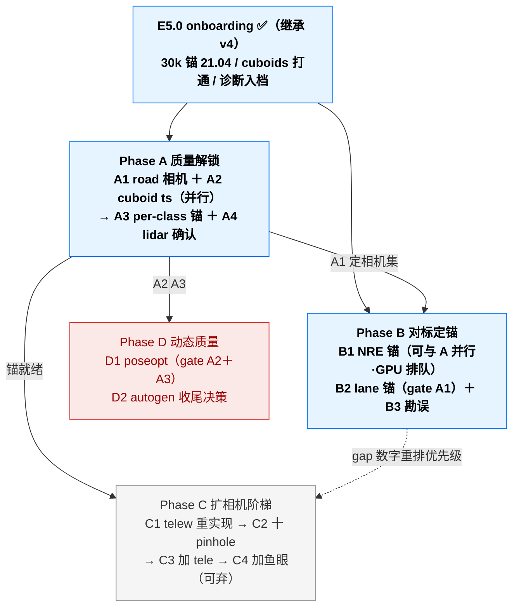

# 3DGRUT v5 — inceptio 数据线提优（多相机 + cuboids + 360° LiDAR）· 可执行计划

> **本文档定位**：v5 **inceptio 数据线主 plan**。v5 唯一主题 = **让 inceptio 自有数据（inc_b6a9ed61 为主战 clip）的重建质量达到 NVIDIA pipeline（NRE）水平**：road/车道线可用、动态车辆清晰、多相机全量纳入训练，并有同 clip NRE 锚证明差距在收敛。
> **与 v4 的关系**：[`v4_plan.md`](v4_plan.md) 仍是 **外推（extrapolation）主线**（PAI 9ae clip 线，E2.2 渐进蒸馏等继续归 v4）；v4 的 **E5.1 / E5.2 移交本文档**（改编号 A1 / A2，执行与回填以 v5 为准）。两线并行不冲突：v4 = 方法轴（外推），v5 = 数据轴（inceptio 落地）。
> **决策依据（decision of record）**：
> - inc_b6a9 onboarding + road/dynamic 诊断：[PR #42](https://github.com/etendue/3dgrut/pull/42)（E5.0，v4 §5 Done Log 2026-07-02）
> - 4cab NRE 对照方法论：[`inceptio_4cabad44_3dgrut_vs_nre.md`](inceptio_4cabad44_3dgrut_vs_nre.md)（⚠️ 其 20.2 multi-cam 崩溃结论系注入伪造，已由 2026-06-25 调查证伪 + 2026-07-06 **B3 在该文档 §5 落勘误段**；真实 6cam 24.02）
> - multi-cam 真相 + telew 实验：2026-06-25 angry-heisenberg 调查（6cam 真实 24.02、front_tele 18.04 根因 = 无 per-camera loss 权重；telew 实验 tele 18.04→26.24 有效但**代码未 commit 已丢失**，见 C1）
> - cuboid autogen 终局：[PR #40](https://github.com/etendue/3dgrut/pull/40)（纯几何天花板结论，2026-06-30 commit `2d32ea6`；收尾决策见 D2）
> - 业界调研（2026-07-02 三路）：外推蒸馏配方（FaithFusion 置信度加权 / FixingGS 连续小步）留 v4 E2.2 吸收；3D auto-label 开源链（CenterPoint+MOT）作 D2 备选记录
> - **2026-07-03 off-track 战役收敛（大g 拍板）**：v5 KPI 主轴升级为 **off-track 质量**（road + dynamic rigids，FID/lane 口径）；执行序 A（生成先验蒸馏，v4 E2.2）→ B（数据轴扩相机）→ C（官方底座，仅测量不作产品路径）；战役设计、算力调度与决策门见 [`docs/superpowers/specs/2026-07-03-offtrack-campaign-design.md`](docs/superpowers/specs/2026-07-03-offtrack-campaign-design.md)
> **执行约定**：沿用 [`CLAUDE.md`](CLAUDE.md)（inceptio 首选 / **depth-off + num_workers=10 铁律** / worktree 工作流 / 文档同步纪律 / Mermaid 全角括号）；**单变量 A/B 纪律**（同一对照只动一个变量）；**反伪造纪律**——本仓库已两次踩注入伪造数字坑（2026-06-17 / 06-25），一切训练数字必须 rich log × metrics.json 交叉验证后才可入档。

---

## 0. 目标与 KPI

### 0.1 v5 核心方向

三条事实链支撑（2026-07-02 定稿）：

1. **cuboid 缺口已实质打通**：inc_b6a9 带真 ppn_fusion cuboids（50 tracks / 1504 obs，36 动态 track 已进 dynamic_rigids 训练）——inceptio 数据第一次具备完整四层训练条件；4cab 时代"纯几何 autogen 红团"阶段结束。
2. **当前质量离 NVIDIA 水平有明确、可修的差距**：3-cam 30k 锚 mean_psnr 21.04 / lpips 0.645；road 层稀疏无色（根因 = 相机选择偏前向，lidar-sseg 92.9% ignore）、动态车模糊（根因 = 少视角欠约束 + cuboid ts 漂移 100ms）——全部有诊断、有解法（A1/A2）。
3. **数据独特优势未兑现**：12 相机 360° 覆盖（对外推是数据侧解法）+ 朝地面 multi-lidar（对车道线是天然监督）——扩相机阶梯（C）与 lane 锚（B2）负责兑现。

### 0.2 KPI — 以 b6a9 锚为起点，NRE 锚回填后定绝对目标

> ⚠️ 沿 v3/v4 纪律：**不设虚构绝对阶梯**。绝对目标数等 B1（NRE 同 clip 锚）测完才定；此前一切任务以「相对 2026-07-02 锚的 gap 闭合 + 守护线不退」验收。

| 轴（主 KPI） | 现状（2026-07-02 锚，3-cam 30k depth-off） | 测量工具 | v5 目标 |
|---|---|---|---|
| 全图质量 | mean_psnr **21.04** / cc 19.70 / ssim 0.578 / **lpips 0.645** | `render.py` metrics.json | 对 NRE 锚 gap 收敛（B1 回填） |
| road / 车道线 | road_crop_psnr 25.99 / lpips 0.254；**road 层稀疏无色**；lane 指标**未测** | per_class_eval + `compute_lane_metrics` | A1 后 road 有色非稀疏；B2 立 lane grad_corr 锚 |
| 车辆 class_psnr（动态区） | **17.53**（A3 已立锚 2026-07-02：automobile，299 records，72 条 <15dB） | [`class_psnr.py`](threedgrut/model/class_psnr.py) | A2/D1 闭合 |
| 行人 per-class（监控） | person 15.40（13 rec，无专属模型，同 v3 结论） | `per_class_eval.py` | 仅监控，不主动做（v5 不做行人建模） |
| NRE 同 clip gap | **B1 实测 2026-07-07**：官方 nre-ga car2sim_6cam@b6a9 test/psnr 臂1 **19.25** / 臂2(+difix) **19.09**（官方口径每3帧+1/4res，不与我方 21.04 直接比）；off-track lateral FID difix 增益 **−10.53(3m)/−9.33(6m)** | B1 双臂 ✅（官方口径 + lateral FID） | 门 1 判据齐（difix=off-track 解药）；C 路线天花板已立 |
| **off-track 质量（2026-07-03 新主轴）** | **B4 实测 2026-07-06**：held-out 侧相机 cc_psnr 旧锚 7.0 / R0c 9.7（vs train 19.5，gap **−10~−12 dB**）；扩相机收益 **+8.88 dB**（R0c held-out 9.66 → R1p 参训 18.54） | B4 held-out 真 GT ✅ + B5 novel 档 FID/KID | 门 1 判据；B5 novel 档补 → 门 1/2 后定目标 |
| 纳入训练的相机数 | 3 / 12 | per-camera psnr 表 | C 阶梯：5 → 10 → 11（+tele）→ 12（+鱼眼） |
| 守护线 | 现有 3 相机 per-cam psnr（22.07 / 20.71 / 20.31） | 现成 | 每步扩相机/改动后原相机不退 |

> **2026-07-09 R4e 补测**（P0.4 完成；同 R3p yaml + P0.2/P0.3 ego-mask 生效单变量 30k；masked 口径与 R3p 可比）：
> - **同口径 A/B（R3p 20.25 vs R4e masked 21.69 = +1.44）**：mean +1.44 / cc **−0.97** / ssim +0.040 / lpips **−0.072** / road_crop **+1.23**（24.47→25.70）/ automobile +0.18（18.53→18.71）
> - **单变量方向坐实**：per-cam masked psnr 受益幅度与该相机 ego coverage 强相关——right_wide (25.74% ego) **+4.45** / left_wide (23.63%) **+2.79** / cross (~10%) +0.4~0.7 / front (1.91%) +0.42 / back_rear (0.60%) −0.24
> - **Non-masked**（含 ego 全图，参考不作对锚）：mean 18.95 / cc 16.64 / ssim 0.634 / lpips 0.631
> - **阶梯 A/B 基线切换**：P0.5 / P0.6 / C1 / C2-C4 一切以 R4e masked 为基线；R3p 保留仅作口径变化前后并排存档

> **2026-07-09 R4e novel FID 补测（P0.5/B5 完成）**：R4e ckpt `--novel-view --novel-fid --render-only` 出全 8 mode FID/KID + interp render FID（143 帧同 R4e P0.4 划分，8.5min @ RTX 4090）：
> - interp render FID **213.80** / KID 0.1216；lateral 1m/2m/3m/6m FID 223.90/223.72/225.25/**231.30**（6m 明显跳升 +17.5 vs render；1-3m 差 <1% noise 级）；yaw 5/10/30/60deg FID 222.06/224.91/227.41/**257.31 严格单调递增**
> - LPIPS lateral 严格单调 0.677→0.688→0.694→0.696；yaw 60deg 0.736 最高
> - **与 B4 held-out cc_psnr 崩 −10~−12 dB 方向一致**：离轴越远，感知分布（FID）+ 像素质量（cc）+ 感知损失（LPIPS）同步劣化——两条独立度量方向一致；扩相机 B4 +8.88 dB 侧后相机 → C 阶梯每步 novel FID 守护线（无 GT 度量）自此建立，与 P0.6 rear_right held-out 真 GT 互补
> - v4 3-cam PAI 参照（v4 E1.4：render 75/1m 124/6m 193）绝对值远，anchor 也远（v4 render 75 vs R4e render 213）→ **不跨 clip 比，仅同 ckpt 内部相对 Δ 可信**

> **2026-07-09 R4e held-out 补测（P0.6 完成 = Phase C 前置 6/6 gate 全解）**：driver `scripts/drivers/eval_heldout_b6a9.sh <ckpt> <tag>` 通用接口；两组 render `--dataset-cameras` 触发 BilateralGrid exposure 自动禁用 → cc 口径统一可比：
> - **主 KPI cc_psnr_masked（同 R4e P0.4 主锚 17.75 可比）**：train (6 台 R4e) **17.73** / held-out (rear_right_70fov, 23 帧) **15.37** → **Δ −2.35 dB**
> - **同口径 sanity 通过**：P0.6 train 17.73 vs R4e P0.4 17.75 = Δ **−0.02** noise 级 ✅（driver 与主锚同口径可比坐实）
> - **对 B4 R0c 时代 held-out gap −9.95 dB 收窄到 −2.35 dB**：**扩相机收益 ~+7.6 dB**（同 B4 +8.88 dB 数量级方向坐实）——R4e 6-cam 训练相机集已覆盖 rear_right 空间视角
> - render KID +0.015 方向对；render FID 反常（train 217 vs held-out 158）因 sample-size bias（23 帧 vs 143 帧）**不作对锚**；cc_lpips_masked +0.070 / cc_ssim_masked −0.20 方向都对
> - **"rear_right 永久 eval-only" 决策敏感度**（Task 12 收尾）：R4e 时 gap 已经 −2.35 dB，rear_right 作 held-out 判据敏感度低——C 阶梯每步观察其全程曲线，Task 12 交大g 拍板去留

### 0.3 v5 不做（明确出界）

- **行人建模**（SMPL / rigid 垫脚石）——高速卡车场景行人稀疏，ROI 低（业界结论一致：deformable 轻量即可，且非本线主题）
- **外推蒸馏 E2.2 / Harmonizer 链**——留 v4 主线（PAI 线验证后再迁移 b6a9）
- **纯几何 cuboid autogen 继续调优**（L-shape / dimension prior）——4cab 已证天花板（recall 0.049 / init 错到 poseopt 救不回），正式关闭（D2 入档）
- 跨 clip 联训、closed-loop 仿真集成、relighting

### 0.4 v5 起点 baseline（不重训）

| 维度 | 数值 | 来源 |
|---|---:|---|
| b6a9 3-cam 30k 锚 | psnr 21.04 / cc 19.70 / lpips 0.645 / road_crop 25.99 | PR #42 E5.0（inceptio depth-off + nw=10） |
| per-camera | front_wide 22.07 / cross_left 20.71 / cross_right 20.31 | 同上 metrics.json |
| cuboids | 50 tracks / 1504 obs（动态 36 track / 50213 粒子进训练） | SDK 直读 + viser 诊断日志 |
| ckpt | `inceptio:~/work/output/inc_b6a9_3cam_multilayer_30k/…/ckpt_last.pt` | 2026-07-01 |
| telew 实验证据 | 4cab 6cam：front_tele 18.04→26.24、mean 23.93（**代码已丢，须 C1 重实现**） | 2026-06-25 调查（run 产物在 `~/work/output/inc4cab_multicam/`） |
| NRE 方法论锚 | 4cab：NRE 28.99 vs 3dgrut 单 cam 28.44（流程 runbook 现成） | [`inceptio_4cabad44_3dgrut_vs_nre.md`](inceptio_4cabad44_3dgrut_vs_nre.md) §8 |

---

## 1. 项目看板（Kanban）

> 状态：⬜ Todo · 🟡 In Progress · 🔵 Review · ✅ Done · ⏸ 降级 · ⏭ Skip

### 1.1 顶层看板（Mermaid Kanban）

```mermaid
%%{init: {'theme':'base'}}%%
kanban
    Backlog
        [B2 lane 指标立锚：gen_lane_sseg 自跑 + compute_lane_metrics，兑现朝地 LiDAR 优势（冻结至战役门后）]
        [C2 扩相机 5→10 pinhole：单变量逐组加，per-cam psnr 全表 + telew 调权]
        [C3 加 front_tele（gate C1）：telew 加权纳入长焦]
        [C4 加 2 台 FTheta 鱼眼（最后，单变量）：上游 issue 238 尖刺风险，可弃]
        [D1 poseopt 迁移 b6a9（gate A2+A3）：P1.2 配方（boundary+prior+smooth）上 36 tracks]
        [D2 cuboid autogen 收尾决策：PR 40 去留 + eval yaw 约定定案 + 纯几何路线关闭入档]

    "In Progress"

    "Review"

    "Done"
        [C1 telew per-camera loss weight 重实现 ✅ 2026-07-10（fd80c1c，纯 Mac 代码 + TDD）：Trainer3DGRUT._camera_loss_weight camera_id float 查表 self.conf.loss.camera_loss_weights 命中返回权重 未命中 None 无 loss 节返回 1.0；get_losses L1344 加权汇总前 loss_l1 loss_ssim 各乘 w 正则项 opacity scale sky bg_cuboid bg_road pose smooth pose boundary pose prior lidar depth road_eff_rank 一律不动；configs base_gs.yaml loss 节新增 camera_loss_weights 空 dict 默认字节等价 CLI ++loss.camera_loss_weights.<camera_id>=w；新测 test_camera_loss_weight.py 11 例 6 unit 5 integration 覆盖默认恒等 2 倍缩放 缺席 dict miss weight zero；stub 补丁 scoped 到本文件 fused_ssim tensor 0.5 与 torch.cuda.nvtx no-op；基线 960 12 → 981 2（+11 新测 +10 nvtx stub 顺带解 importorskip 兄弟；独立跑仍 skip 无回归）；字节等价证明 空 dict 与无 key 逐 key allclose rtol 1e-6 全绿；Task 9 C2 阶梯的唯一 gate 落定]
        [Task 8 C2 aux 前置：b6a9 8-cam sseg + lidar-camvis 全量重跑 ✅ 2026-07-10（纯数据 + 文档，无代码 commit）：8-cam 集＝R4e 6-cam + rear_left_70fov + front_standard_55fov（rear_right 永久 held-out）；run A sseg no-ego-mask 保 P0.3 mask ~18min 8cam+workers 3；run B lidar-seg-camvis 遮挡补丁重建 + estimators.py bind-mount ~18min（补丁位置修正到 intersect_rays 之前才生效、5.3 s/it avg vs 154 s/it 老 bug）；P0.3 手写 egomask itar 缺 zmetadata run B 需临时挪走（backup 命名 TEMPORARILY_MOVED，完成还原）；docker rm -f 半途杀留下 partial itar 用容器 root 清；四项验收：egomask 10 台数字与 Step 0 diag 逐字节相等 + sseg 8 cam 全覆盖含 rear_left 194 帧 front_standard 200 帧 + lidar-sseg road+sidewalk 全帧 41.45% 对 A1 6cam 40.08% +1.37 合理 + camvis 8bit 全覆盖 cam0 17.6% cam7 27.5%；产物落 clip 目录 root 权限、旧 aux 备份 aux_backup_task8_20260710；补丁副本 inceptio ~/repo/aux_patches/ 永久保留；C2 训练可开跑]
        [P0.6 held-out 一键评估驱动 + R4e 基线读数 ✅ 2026-07-09（6b39f6f driver + tee 修复 + 6min inceptio）：scripts/drivers/eval_heldout_b6a9.sh 通用接口 ckpt tag，两组 render + dataset-cameras exposure 自动禁用 cc 口径统一；R4e 基线 train cc_psnr_masked 17.73 held-out rear_right_70fov 15.37 Δ −2.35dB；对 B4 R0c 时代 held-out gap −9.95dB 收窄到 −2.35dB 扩相机收益 +7.6dB 同 B4 +8.88dB 数量级坐实；同口径 sanity 通过 P0.6 train 17.73 R4e P0.4 主锚 17.75 Δ −0.02 noise 级；render KID +0.015 方向对 FID 反常 small-sample bias 不作对锚；C 阶梯每步四读数齐；Phase C 前置 6/6 全 ✅]
        [P0.5/B5 novel FID 链路移植 b6a9 ✅ 2026-07-09（cb75e15 driver + 8.5min render-only on R4e ckpt）：--novel-view --novel-fid --render-only 出全 8 mode FID/KID + interp render FID；lateral render/1m/2m/3m/6m FID 213.80/223.90/223.72/225.25/231.30（1-3m 差异 noise 级、6m 明显跳升+6）；yaw 5/10/30/60deg FID 222.06/224.91/227.41/257.31 严格单调；LPIPS lateral 严格单调 0.677→0.696；与 B4 held-out cc_psnr −10dB 方向一致（离轴分布 + 像素同步劣化）；C 阶梯每步 novel FID 守护线自此建立；B5 卡合并 ✅]
        [P0.4 R4e 30k 重锚 ✅ 2026-07-09（e0ee7d6 driver + 63min inceptio worktree run）：R3p 同 yaml + P0.2/P0.3 生效单变量，R4e masked 锚 mean 21.69 / cc 17.75 / lpips 0.555 / road_crop 25.70 / auto 18.71；per-cam ego coverage 越高受益越大——right_wide +4.45、left_wide +2.79、back_rear −0.24（0.60% 最低几无变化）；R3p 旧锚口径变化不可直接比、并排存档；阶梯 A/B 一切以 R4e masked 为基线；双源 metrics.json 逐字节一致]
        [P0.2 EgomaskAuxReader + datasetNcore fallback 接线 ✅ 2026-07-08（4a9f2e6 + cecb6b0，已合 main）：SDK 缺失/全零时 itar 直读三分支 valid 图 + source 标签日志；inceptio 500 步 smoke 6 相机全部 fallback 命中；PAI 线逐字节等价；16 单测 + 960 全套零回归]
        [P0.1 ego mask 双层故障诊断 ✅ 2026-07-08：aux itar 4/6 相机有真 mask 从未接进训练（SDK 内嵌全零）+ front_wide/back_rear_wide 全黑（sseg egocar 有数据可派生）]
        [P0.3 b6a9 视觉多边形静态 ego mask ✅ 2026-07-08（40277d2）：大g 用自包含 HTML 标注器手工标 10 台（reinforce=[] 纯视觉替换）+ inceptio write-once 替换 itar（旧 161KB→aux_backup、新 91KB）+ 回读 10/10 精确匹配；跳过 front_tele/front_standard 纯远景；EgomaskAuxReader/栅格化/合成/写函数纯函数全 Mac TDD 23 单测；下游 P0.2 接线待做则训练即生效]
        [B1 NRE 双臂对照锚 ✅ 2026-07-07：官方 nre-ga b6a9 test/psnr 臂1 19.25 / 臂2 19.09；off-track lateral FID difix 增益 −10.5（3m）/−9.3（6m），difix=离轴解药方向；单变量确认两臂仅差 difix 开关]
        [B4 held-out off-track 锚 ✅ 2026-07-06：旧锚 held-out cc_psnr 7.0 / R0c 9.7 vs train 19.5，gap −10~−12dB；扩相机收益 +8.88dB（思路 B 首个实测证据）]
        [B3 文档勘误 ✅ 2026-07-06（vs_nre §5 伪造 20.20 结论撤回＋真实 6cam 24.02＋根因改判 per-camera loss 权重；5cam task 回填 ~24.9；viser task 三处加注）]
        [A1 road 修复 ✅ 2026-07-04（aux 遮挡 bug 2117× ＋ opacity 正则根治 ＋ lattice v2 收官；baseline 锚 R3p 20.25，inceptio 配方 yaml 入库）]
        [A5 pinhole cuboid mask 修复簇 ✅ 297a0bc（2026-07-02 新增：三处 FTheta-only gate ＋ behind-camera 过滤）]
        [A2 cuboid ts 插值 ✅ 6983018（per-camera END ts ＋ lerp、slerp 插值；wireframe 目检 cross 相机套准）]
        [A3 车辆锚 ✅（automobile class_psnr 17.53，299 records；person 15.40）]
        [A4 lidar 监督定论 ✅（30k 锚 parsed.yaml 实测 depth 全关＝铁律 CLI 覆盖，未生效属预期）]
        [继承: E5.0 inc_b6a9 onboarding ✅ 2026-07-02（PR 42：30k 锚 21.04 + viser exposure 修复 + aux 并行 6×）]
        [继承: cuboids ppn_fusion 数据打通（50 tracks 进 dynamic_rigids）]
        [继承: multi-cam 假崩溃勘误 + telew 实验证据（2026-06-25 调查）]
        [继承: 4cab NRE 对照 runbook（28.99 锚方法论）]
```

### 1.2 任务级看板

| ID | Phase | 主题 | 继承来源 | 估时(d) | 状态 | gate / 备注 |
|---|---|---|---|---:|:---:|---|
| **A1** ★ | A | **road 修复（根因改写）** — 步骤0 诊断推翻 E5.1 假设：非相机覆盖问题，系 **nre-tools lidar-seg 遮挡检查 bug**（1mm 容差×掠射路面×聚合 lidar spin mesh 误杀）；`NRE_LIDARSEG_OCCLUSION=off` 容器补丁后 road+sidewalk 21460（0.019%）→ **45.4M（40.08%），2117×**；6-cam aux 入 clip 目录；lattice v2 收官 → **baseline 配方 [`ncore_3dgut_mcmc_multilayer_inceptio.yaml`](configs/apps/ncore_3dgut_mcmc_multilayer_inceptio.yaml) 入库**（锚 R3p 20.25 / road_crop 24.47 / automobile 18.53） | **v4 E5.1 移交** | 1 | ✅ | 诊断脚本 `diag_lidar_sseg_vs_proj.py`（2f55017）；opacity 正则根治（`loss.use_opacity=false`，A800 双卡单变量坐实）；另修三类训练 NaN（ray 极点 52224b3 / 死层守卫 5f62cb0 / relocation 消毒 0b960eb）；PAI 线 multilayer 配方不动 |
| **A2** ★ | A | **cuboid 时间戳对齐** — [`tracks_loader.py`](threedgrut/datasets/tracks_loader.py) 按 per-camera END 时间戳精化 cuboid pose，消 cross 相机 ~100ms 漂移 | **v4 E5.2 移交** | 1 | ✅ | `6983018`：interp_pose_to_ts（lerp+slerp）+ `dataset.cuboid_ts_mode` 键（默认 ref_nearest 字节等价）；wireframe 目检 cross 相机 Δt=100ms 拖后 ~1m → 套准；训练收益走 R3 |
| **A3** ★ | A | **per-class eval 立锚** — 现成 [`class_psnr.py`](threedgrut/model/class_psnr.py)（cuboid-based 车辆）+ `per_class_eval.py`（person/rider）在 b6a9 ckpt 跑 eval → inceptio 首个车辆 per-class 锚 | v3 P0 工具复用 | 0.5 | ✅ | **automobile 17.53**（299 records，72 条 <15dB）/ person 15.40；依赖 A5 修 render.py FTheta-only gate 后才出字段 |
| **A4** | A | **LiDAR ray 监督确认** — b6a9 metrics 无 lidar_psnr 字段；查 multilayer resolved config + 训练 log 定生效与否 | E0.5 借鉴点⑤ | 0.5 | ✅ | 定论：**未生效**——parsed.yaml 实测 `use_lidar_depth=false`/`load_lidar_depth_map=false`（inceptio depth-off 铁律 CLI 覆盖），metrics 无字段属预期；A800 lidar-on 配方不受影响 |
| **A5** ★ | A | **pinhole cuboid mask 修复簇**（2026-07-02 大g 发现新增）— 三处 FTheta-only gate 在 pinhole clip 静默失效：trainer `_maybe_fill_cuboid_mask`（训练 dyn_mask_cuboid 从未生成）、render.py class_psnr eval gate（A3 缺字段根因）、共享 `project_cuboids_to_mask` pinhole 分支缺 behind-camera 过滤 | 大g 代码审查 | 0.5 | ✅ | `297a0bc`：z>0 corner 过滤两分支共用 + `resolve_batch_cuboid_intrinsics` 双模型 dispatch（FTheta 字节等价）；3D 路径（bg_cuboid_penalty/clamp）不受影响；旧行为可 `++trainer.bg_dyn_cuboid_penalty.use_cuboid_mask=false` 复现 |
| **B1** ★ | B | **NRE 同 clip 对照锚（双臂）** — 臂 1＝nre-ga car2sim 官方配方 baseline；臂 2＝同配方 + `difix.training.enabled=true`（Harmonizer IPC，单变量）→ 官方口径 + `nre render` lateral 3m/6m 帧 FID → **v5 gap 表首行实测化 + C 路线 off-track 天花板（门 1 输入）** | 4cab runbook + E0.7 IPC 架构 | 1.5 | ✅ | **2026-07-07 实测**（inceptio worktree @ a5083c8）：臂1 test/psnr 19.25 / 臂2(+difix) 19.09（on-track difix −0.15）；**off-track lateral FID difix 增益 −10.53(3m)/−9.33(6m)**；单变量确认两臂 parsed.yaml 仅差 difix；臂2 OOM(漏 expandable_segments)修复后 40k 完成；详见 §4 Done Log |
| **B2** | B | **lane 指标立锚** — [`gen_lane_sseg.py`](scripts/gen_lane_sseg.py) 自跑 Mapillary lane sseg → `compute_lane_metrics`（grad_corr / band_psnr）前视立锚，验证朝地 LiDAR 车道线优势 | v3 P3.0 工具复用 | 1 | ⬜ | gate＝A1（侧相机进来 road 覆盖才够意义）；不跨 clip 比 PAI 锚 0.693 |
| **B3** | B | **文档勘误** — [`inceptio_4cabad44_3dgrut_vs_nre.md`](inceptio_4cabad44_3dgrut_vs_nre.md) 加勘误段（20.2 崩溃 + rational×MCMC 假设撤回，真实 6cam 23.2-24.0）；[`inceptio_5cam_task.md`](inceptio_5cam_task.md) 状态回填（已执行，5cam ~24.9@7k） | 2026-06-25 调查结论 | 0.5 | ✅ | commit message `docs(B3)`：4cab §5 勘误段（20.20/20.99 伪造撤回＋rational×MCMC 假设作废＋根因改判 per-camera loss 权重）＋5cam task 回填 ~24.9＋viser task 三处加注；防伪造数字再误导下游 |
| **B4** ★ | B | **held-out 侧相机真 GT off-track 锚** — 现有 3-cam 30k ckpt 在未参训侧相机位姿渲染 vs 真图（真 GT 外推，v4 E1.3 协议反用）→ held-out per-cam psnr/lpips + FID 与训练相机同口径对照 | v4 E1.3 协议 + E5.0 ckpt | 0.5 | ✅ | **2026-07-06 实测**（render-only，worktree @ a5083c8）：held-out cc_psnr 旧锚 7.0 / R0c 9.7 vs train 19.5（gap −10~−12 dB）；扩相机收益 +8.88 dB（思路 B 证据）；双源交叉一致；详见 §4 Done Log |
| **B5** | B | **E1 外推度量移植 b6a9** — novel 6 档（含 lateral 3m/6m）+ FID/KID（`--render-only` / `--novel-fid` 链路）在 b6a9 config 打通 | v4 E1.1/E1.4 工具 | 0.5 | ✅ | **2026-07-09 完成**（`cb75e15` driver + 8.5min render-only on R4e ckpt）；全 8 mode FID/KID + interp render；lateral FID 6m **+17.5** vs render / yaw FID 60deg **+43.5** vs render；与 B4 held-out −10dB 方向一致；合并 P0.5 一起 ✅ |
| **P0.3** ★ | C 前置 | **b6a9 视觉多边形静态 ego mask 替换** — 大g 用自包含 HTML 标注器（浏览器 canvas + 100px 网格 + 滚轮缩放 + Shift 拖拽平移）手工标 10 台顶点数据（reinforce=[] 纯视觉替换）；跳过 front_tele/front_standard（自车不入镜）；write-once 替换 clip 目录 egomask itar，旧 itar 备份 aux_backup/。栅格化/合成/写 API 全 Mac TDD 23 单测（`test_egomask_static.py` 11 + `test_egomask_aux_reader.py` 12）+ inceptio round-trip + 10/10 回读精确匹配 | v5 Phase C 前置 | 1 | ✅ | **2026-07-08 完成**（`40277d2`）；per-cam ego_px 精准：back_rear_wide 5251(0.25%) 最干净、back_rear_fisheye 582379(28%) 最大（车顶弧+vignette）、left/right_wide 后视镜镜体+镜臂完整贴合；下游 P0.2 datasetNcore 接线待做则训练即生效 |
| **P0.2** | C 前置 | **EgomaskAuxReader + datasetNcore fallback 接线** — reader（`4a9f2e6`，通用相机组发现 + resolve_ego_valid_mask 三分支 + 12 Mac 单测）+ 接线（`cecb6b0`：`resolve_ego_valid_mask_with_source` 带 source 标签 "sdk"/"itar"/"none"、datasetNcore L429-440 单点委托、itar 分支打 `[P0.2]` coverage 日志、+4 wire 测） | v5 Phase C 前置 | 0.5 | ✅ | **2026-07-08 完成，已合 main（`cc26b08`）**：inceptio 500 步 smoke（p02_wire_smoke）6 训练相机全部 fallback 命中（coverage front 1.91% / cross_L 11.11% / cross_R 10.34% / left 23.63% / right 25.74% / back 0.60%，dilate30 后口径）+ Training Complete；PAI 线逐字节等价（wire 测断言）；Mac 960 passed |
| **P0.4** | C 前置 | **R4e 重锚（30k，单变量=仅 ego-mask 生效）** — R3p 同配方 + P0.2 接线后 30k，masked 指标口径改变 → 与 R3p 并排入档标注口径差异，防未来跨口径误比 | v5 Phase C 前置 | 1h 机时 | ✅ | **2026-07-09 完成**（`e0ee7d6` driver + 63min inceptio）；R4e masked 锚 mean **21.69** / cc **17.75** / lpips **0.555** / road_crop **25.70** / auto **18.71**；per-cam ego coverage 越高受益越大 —— right_wide **+4.45** / left_wide **+2.79** / back_rear **−0.24**（0.60% 最低几无变化）；R3p 并排口径注记入档、阶梯基线切 R4e masked |
| **P0.5** | C 前置 | **B5 novel FID 链路移植 b6a9**（render-only 无悔棋）—— v4 E1.1/E1.4 工具链在 b6a9 打通；metrics.json 出 `mean_novel_fid_*` | v4 E1.1/E1.4 工具 | 0.5 | ✅ | **2026-07-09 完成**（`cb75e15` driver + 8.5min，R4e ckpt）；全 8 mode FID/KID + interp render **213.80** / lat 1m 223.90 / lat 6m 231.30 / yaw 60deg 257.31；与 B4 held-out cc_psnr −10dB 方向一致；C 阶梯 novel FID 守护线立 |
| **P0.6** | C 前置 | **held-out 评估一键驱动** — B4 `--dataset-cameras` render-only 流程封装：输入 ckpt→输出 rear_right held-out cc_psnr/lpips/FID + train 同口径对照 | v4 E1.3 协议 | 0.5 | ✅ | **2026-07-09 完成**（`6b39f6f` driver + tee 修复，6min inceptio on R4e）；通用接口 `<ckpt> <tag>`；R4e 基线 train **cc_psnr_masked 17.73** vs held-out (rear_right_70fov) **15.37** Δ **−2.35 dB**；同口径 sanity（P0.6 train vs P0.4 主锚 17.75 Δ −0.02 noise）；对 B4 R0c 时代 gap −9.95 dB 收窄到 −2.35 dB → **扩相机收益 ~+7.6 dB** 坐实；render KID +0.015 方向对，FID small-sample bias 不作对锚 |
| **C1** ★ | C | **telew per-camera loss weight 重实现** — `trainer.py` 加 `_camera_loss_weight(camera_id)` + 光度项（L1/SSIM）乘权、正则项不动；`configs/base_gs.yaml` 加 `loss.camera_loss_weights: {}`（默认空 = 字节等价）；**必须 commit 进 main**（上轮实现验证有效但 worktree reset 丢码的教训） | 2026-06-25 调查 #6882 方案 | 0.5 | ✅ | **2026-07-10 完成**（`fd80c1c`）；11 单测（6 unit + 5 integration via SimpleNamespace bind + 沿 conftest stub 模式：fused_ssim + nvtx no-op scoped）；空 dict / 无 key / camera_id 缺席 / miss 分支均返回 1.0；`{camX:2.0}` + `batch.camera_id=camX` 断言 `l1_loss/ssim_loss` = 2× baseline、12 项正则逐项 allclose(rtol 1e-6)；`weight=0.0` 归零；基线 960/12 → 981/2（+11 新测 +10 nvtx stub 顺带解 importorskip 兄弟，独立跑仍 skip 无回归）；Task 9 唯一 gate 解除 |
| **C2** | C | **扩相机 5→10 pinhole** — 单变量逐组加 rear×2 / back_rear_wide / front_standard，telew 按 per-cam psnr 调权 | 新 | 1 | ⬜ | gate＝A1 + C1；守护线＝已有相机 psnr 不退 |
| **C3** | C | **加 front_tele** — telew 加权纳入（4cab 经验：无权重 18.04、加权 26.24） | 4cab telew 证据 | 0.5 | ⬜ | gate＝C1 |
| **C4** | C | **加 2 台 FTheta 鱼眼** — 最后单变量纳入 `camera_front_fisheye` / `camera_back_rear_fisheye`；FTheta 路径 PAI 已证（6cam 26.31），但留意上游 [issue #238](https://github.com/nv-tlabs/3dgrut/issues/238) 鱼眼尖刺 | 新 | 1 | ⬜ | 可弃：尖刺不可控则 10+tele 收口 |
| **D1** | D | **poseopt 迁移 b6a9** — v3 P1.2 配方（boundary anchor + prior + temporal smooth）上 36 真 tracks，对照 A3 锚看动态车清晰度 | v3 P1.2（class +1.03 证据） | 1.5 | ⬜ | gate＝A2 + A3 锚；4cab 教训不适用（那是 init 错，b6a9 是真标注） |
| **D2** | D | **cuboid autogen 收尾决策** — ① PR #40 去留（建议：merge 作离线工具保留，autogen 仅限无标注 clip 的 demo 用途）② eval `_yaw_of()` 约定定案（对已知角 box 直查 pose 矩阵，半小时）③ 纯几何 L-shape 路线正式关闭入档；备选记录：无标注 clip 未来走 CenterPoint+MOT 开源链换前端、复用 PR #40 V4 shard 基建 | PR #40 + 2026-06-26 L-shape session | 0.5 | ⬜ | 决策级任务，大g 拍板 |

### 1.3 Phase 状态汇总

| Phase | 主题 | 任务数 (Done/Total) | 主验收 | 守护线 | 状态 |
|---:|---|---:|---|:---:|:---:|
| **A** ★ | b6a9 质量解锁（短刀，全部有诊断有解法；+A5 新增） | **5/5** | road 有色 + cuboid 对齐 + 车辆锚入档 + lidar 监督定论 + pinhole gate 修复 | 3-cam per-cam psnr 不退 | ✅（[PR #44](https://github.com/etendue/3dgrut/pull/44)） |
| **B** ★ | 对标定锚 + off-track 评估（战役无悔棋） | **4/5** | NRE gap 双臂实测化 + held-out off-track 锚 + novel FID 链路 ✅ + lane 锚 + 伪数字勘误 | — | 🟡 |
| **P0** ★ | Phase C 前置（ego-mask 修复 + 评估基建） | **6/6** | P0.1 诊断 ✅ + P0.3 视觉多边形替换 ✅ + P0.2 接线 ✅ + P0.4 R4e 重锚 ✅ + P0.5 novel FID 链路 ✅ + P0.6 held-out 一键驱动 ✅ | PAI 线字节等价不变量 | ✅ |
| **C** | 扩相机阶梯 3→12 | **1/4** | C1 telew ✅ + 12 相机全量纳入或明确收口点 | 每步原相机不退 | 🟡 |
| **D** | 动态质量 + 收尾 | 0/2 | poseopt 增益入档 + autogen 去留定案 | class_psnr 不退 | ⬜ |
| **总计** | — | **11/22** | — | — | — |

### 1.4 任务依赖图



> 并行性：A1 与 A2 不同文件域可并行；B1（docker 挂机）可与 A 并行排 GPU；B3/C1/D2 为纯 Mac/文档任务可穿插。
> **执行序（2026-07-03 战役版，覆盖旧建议）**：无悔棋三件套（B4 → B1 双臂 → B5）先行 3-4 天 → A1/A2（A1 重训排新 4090，到货前 aux 先备）→ 门 1 后按数字排 C/D；**B2/C3/C4/D2 冻结至战役门后**。E2.2 主线在 v4 执行（inceptio 白天 + A800 蒸馏臂），算力调度详见战役 spec §4。

---

## 2. Phase 详细任务卡

### 2.1 Phase A — b6a9 质量解锁

**A1 road 相机选择修复**
- 目标：lidar-sseg road+sidewalk 点 21460（0.3%）→ 数量级提升，road 层（roaddisk 冻结前提 = 好 init）变密集有色。
- 步骤意图：① 按 CLAUDE.md「nre-tools aux 多容器并行」runbook 给 2-3 台侧/后相机补 sseg + lidar-sseg/camvis（注意 itar write-once、并发容器不共享目录、`merge_lidar_aux.py` 合并）；② `dataset.camera_ids` 扩 5-cam 重训 30k（multilayer，inceptio 铁律 depth-off + nw=10）；③ 无代码改动，纯 config/CLI。
- 验收：诊断脚本输出 road 点数对比；viser road-only 视图有色连续（对照 E5.0 无色截图）；mean_psnr / road_crop 对 21.04 / 25.99 不退且 road 侧改善；新相机 per-cam psnr 入档。

**A2 cuboid 时间戳对齐**
- 目标：cross 相机 cuboid pose 漂移 ~100ms → ≈0。
- 改动：[`tracks_loader.py`](threedgrut/datasets/tracks_loader.py) 的 cuboid ts ↔ 相机帧匹配逻辑，改为按 per-camera END 时间戳精化（插值 track pose 到各相机实际曝光时刻）。
- 测试要点：Mac 纯函数单测——合成匀速 track + 已知相机 ts 偏移，断言精化后 pose 位置残差小于厘米级公差；默认路径与旧行为字节等价开关。
- 验收：`scripts/validate_cuboid_pretrain.py` cross 相机 wireframe 目检套准（对照 dt=100ms 旧图）；重训后动态区清晰度以 A3 class_psnr + viser 目检双读数。

**A3 per-class eval 立锚**
- 目标：b6a9 首个车辆 class_psnr（cuboid-based，36 tracks）+ person/rider 锚入档。
- 步骤意图：在现有 30k ckpt（及 A1/A2 后的新 ckpt）上跑 `render.py` eval，确认 metrics.json 出 by_class 字段（v3 P0 链路已通，如缺字段按 CLAUDE.md 把关清单核查 trainer/render 双路径）。
- 验收：车辆 by_class + person 数字写入本文档 §4 Done Log 与 §0.2 KPI 表。

**A4 LiDAR ray 监督确认**
- 目标：定论 b6a9 训练中 LiDAR ray 级监督是否生效（metrics 无 lidar_psnr 字段的疑点）。
- 步骤意图：查 run 的 parsed.yaml lidar 相关键 + 训练 log；若未生效，单变量 A/B（on vs off，6k 短跑即可）。
- 验收：结论 + 原因入档；若开启有益则进 b6a9 baseline 配方。

### 2.2 Phase B — 对标定锚

**B1 NRE 同 clip 对照锚（双臂，2026-07-03 升级）**
- 目标：把「b6a9 21.04 落后 NVIDIA 多少」从推测变实测（区分 pipeline 差距 vs 场景难度——36 动态车的 urban 场景 PSNR 天然低于 4cab 单卡车高速）；臂 2 同时给出 **C 路线 off-track 天花板**（战役门 1 输入）。
- 步骤意图：臂 1 复用 4cab runbook（nre-ga car2sim 配方 docker 一条命令）；臂 2 同配方单变量开 `difix.training.enabled=true`，修复器走 Harmonizer IPC（`fixer_server.py`/`harmonizer_server.py` 架构，**前置＝IPC 实物验证** `~/work/nurec_e0/e07/`）；两臂各出官方指标 + `nre render` lateral 3m/6m 帧 → FID 对比。
- 验收：v5 gap 表首行回填 + 两臂 off-track FID 差入档（门 1 判据）；口径统一或显式标注官方 val 口径陷阱；据 gap 数字重排 C/D 优先级（对标 v4 E1.5 纪律）。

**B4 held-out 侧相机真 GT off-track 锚（零训练，无悔棋）**
- 目标：b6a9 第一个真 GT 离轴数字——现有 3-cam 30k ckpt 从未见过侧相机，在侧相机位姿渲染 vs 真图即真外推测量（v4 E1.3 协议反用）。
- 步骤意图：eval 侧相机集注入（`dataset.camera_ids` eval-only 覆盖或 render.py 位姿加载路径）；侧相机帧只需图像+位姿，不需 sseg aux；render-only 出帧后与真图算 per-cam psnr/lpips + FID。
- 验收：held-out 数字与 3 台训练相机同口径对照入档（§4 Done Log + §0.2 KPI 表 off-track 行）；回答「b6a9 离轴差多少」。

**B5 E1 外推度量移植 b6a9（无悔棋）**
- 目标：v4 E1.1/E1.4 工具链（novel 6 档含 lateral 3m/6m + FID/KID）在 b6a9 config 打通，补齐「inceptio 数据无 off-track 评估」的洞。
- 步骤意图：`--render-only` / `--novel-only` / `--novel-fid` 链路对 b6a9 manifest 跑通；配置差异（相机数/分辨率）按需适配。
- 验收：b6a9 metrics.json 出 `mean_novel_fid_*` 等 novel 档字段；与 B4 真 GT 数字互证入档。

**B2 lane 指标立锚**
- 目标：兑现朝地 multi-lidar 的车道线优势，建立 b6a9 lane grad_corr / band_psnr 锚。
- 步骤意图：`gen_lane_sseg.py` 自跑（b6a9 无 lane aux）→ `datasetNcore` 加载 → `render.py` 前视 eval 出 mean_lane_* 字段（v3 P3.0 全链路现成）。
- 验收：lane 锚数字入档；与 road_crop/road 层视觉互证。

**B3 文档勘误**
- 目标：清除两处会误导后续判断的过期结论。
- 改动：[`inceptio_4cabad44_3dgrut_vs_nre.md`](inceptio_4cabad44_3dgrut_vs_nre.md) §5 加勘误段（20.2 崩溃数字系注入伪造已撤回；真实 6cam@7k 23.2-24.0；rational×MCMC 失稳假设不成立，真根因 = per-camera loss 权重缺失 + 多视角稀释）；[`inceptio_5cam_task.md`](inceptio_5cam_task.md) 状态"待执行"→ 已执行 + 结果回填。
- 验收：两文档更新，引用该结论的下游文档无残留。

### 2.3 Phase C — 扩相机阶梯

**C1 telew 重实现**：见 §1.2 行内描述；关键约束——只乘光度项、默认空 dict 字节等价、CLI 以 `++loss.camera_loss_weights.<camera_id>=w` 覆盖；完成定义 = **代码 + 测试 merge 进 main**。
**C2 → C3 → C4**：每步单变量、守护线 = 已纳入相机 per-cam psnr 不退；C4 鱼眼为可弃项（尖刺不可控则在 11 相机收口，FTheta 数据侧无阻碍）。

### 2.4 Phase D — 动态质量 + 收尾

**D1 poseopt 迁移**：`trainer.pose_adjustment.enabled=true`（lambda_t 1e-2 / lambda_r 1e-1，v3 P1.2 已证配方）30k A/B，验收 = A3 车辆 class_psnr 提升 + viser 动态车抖动目检。
**D2 cuboid autogen 收尾**：决策任务——PR #40 merge 与否、eval yaw 约定半小时定案、L-shape 路线关闭结论入档、无标注 clip 的 CenterPoint+MOT 备选路线记录（详见 §1.2）。

---

## 3. 风险登记表（Risk Log）

| # | 风险 | 触发条件 | 缓解 | 状态 |
|---|---|---|---|---|
| R1 | 加侧相机后 road 覆盖仍不足 | A1 验收不过 | **已解除（2026-07-02）**：根因根本不是相机覆盖——nre-tools lidar-seg 遮挡检查 bug 修复后 road 点 40.08%，无需备选路线 | ✅ 解除 |
| R2 | 跨相机曝光/白平衡差异随相机数放大 | C2-C4 cc 与 raw psnr 差扩大 | C1 telew + BilateralGrid exposure（已默认开）；per-cam 光度监控 | ⬜ |
| R3 | 注入伪造数字（已踩两次） | 任何训练数字入档前 | rich log × metrics.json 交叉验证；只认两源一致的数字 | 长期 |
| R4 | 单卡 4090 排队 | A1/B1/C2 训练冲突 | 长任务 setsid 驱动脚本串行；B1 docker 可夜间挂机 | ⬜ |
| R5 | NRE 官方口径陷阱 | B1 对锚 | E0.3 教训：官方 val 每 3 帧 + 1/4 res + cpsnr，须统一口径互渲或显式标注 | ⬜ |
| R6 | 鱼眼尖刺（上游 issue #238） | C4 | 放最后、单变量、可弃；必要时向上游报 issue | ⬜ |
| R7 | itar 损坏（write-once + 中途 stop） | A1 aux 并行 | PR #42 runbook：硬链隔离目录 + 完整跑完再合并 | ⬜ |

---

## 4. Done Log（继承锚点 + 新条目）

**继承锚点（已验证，作 baseline / 方法论基础）**：
- **2026-07-02 E5.0 inc_b6a9 onboarding**（PR #42）：3-cam 30k 锚 psnr 21.04 / cc 19.70 / lpips 0.645 / road_crop 25.99；cuboids 50 tracks 打通（36 动态进训练）；viser exposure 修复；aux 并行 6× runbook；road/dynamic 根因诊断（→A1/A2）。
- **2026-06-25 multi-cam 真相调查**：「6cam 崩 20.2」系注入伪造已撤回；真实 6cam@7k 24.02（refix 23.24）、5cam ~24.9、2cam 26.69；front_tele 18.04 根因 = per-pixel mean 无相机权重；telew 实验 tele→26.24 有效（代码丢失 → C1）。
- **2026-06-30 cuboid autogen 终局**（PR #40 + `2d32ea6`）：纯几何天花板坐实（recall 0.049 / yaw 65° / poseopt 救不回错 init）；V4 shard 写读基建可复用（→D2）。
- **2026-06-24 4cab NRE 锚方法论**：NRE 28.99 / 3dgrut 单 cam 28.44，runbook 现成（→B1）。

**新条目**（任务完成后按 CLAUDE.md 纪律追加：日期 + commit + 实测数字）：

- **2026-07-10 ★ Task 7 C1 telew per-camera photometric loss weight 重实现**（`fd80c1c`，纯 Mac 代码 + 严格 TDD；Task 9 C2 阶梯 6→8 cam 的唯一 gate 落定）：
  - **动因**：2026-06-25 4cab telew 实验已验证 per-camera loss 权重是 front_tele 18.04 崩溃根因（加权后 tele **18.04→26.24**），但 worktree reset 丢码；Phase C 前置 6/6 全解后 Task 9 阻塞于此。
  - **改动**（3 文件，319 行插入，0 行删除）：
    - `threedgrut/trainer.py`：新增 `Trainer3DGRUT._camera_loss_weight(camera_id) -> float` 查表；`get_losses` L1344 加权汇总前 `w_cam = self._camera_loss_weight(getattr(gpu_batch, "camera_id", None))`，`loss_l1 *= w_cam` / `loss_ssim *= w_cam`；正则项（`opacity` / `scale` / `sky` / `bg_cuboid` / `bg_road` / `pose_smooth` / `pose_boundary` / `pose_prior` / `lidar_depth` / `bg_lidar` / `depth_prior` / `road_eff_rank`）一律不动。
    - `configs/base_gs.yaml` loss 节新增 `camera_loss_weights: {}`（默认空 = 字节等价）+ 头注释；CLI 用法 `++loss.camera_loss_weights.camera_front_tele_30fov=4.0`。
    - `threedgrut/tests/test_camera_loss_weight.py`（新建）：11 例 = 6 unit + 5 integration。
  - **语义边界**（`_camera_loss_weight` 分支）：

    | 输入 | 返回 | 单测 |
    |---|---:|:---|
    | `camera_id=None` | **1.0** | `test_none_camera_id_returns_one` |
    | `self.conf.loss` 无 `camera_loss_weights` key | **1.0** | `test_default_missing_key_returns_one` |
    | `camera_loss_weights: {}`（yaml 默认） | **1.0** | `test_default_empty_dict_returns_one` |
    | `{camA: 4.0}` + camera_id=`camA` | **4.0** | `test_hit_returns_configured_weight` |
    | `{camA: 4.0}` + camera_id=`camB` | **1.0** | `test_miss_returns_one` |
    | `{camA: 0.0}` + camera_id=`camA`（0.0 不被 falsy 吞） | **0.0** | `test_zero_weight_is_valid` |

  - **Integration（Trainer3DGRUT.get_losses 通过 SimpleNamespace bind，沿 conftest stub 模式；scoped stub 补 `fused_ssim` 返回 tensor(0.5) + `torch.cuda.nvtx.range_push/pop` no-op）**：

    | 场景 | 断言 |
    |---|---|
    | 默认空 dict vs 无 key | 返回 dict 逐 key `torch.allclose(rtol=1e-6, atol=1e-8)` — **字节等价证明** |
    | `{camX:2.0}` + `batch.camera_id=camX` | `l1_loss / ssim_loss` = 2× baseline；12 项正则项逐项 `allclose` |
    | `batch.camera_id` 属性缺失 | w=1.0，全 loss 项与 baseline `allclose` |
    | camera_id ∉ dict | w=1.0，同上 |
    | `weight=0.0` | `l1_loss` 与 `ssim_loss` 归零；12 项正则不动 |

  - **回归数字**：

    | 指标 | 基线（069e62d） | C1 后（fd80c1c） | Δ |
    |---|---:|---:|---:|
    | passed | 960 | 981 | +21 |
    | skipped | 12 | 2 | −10 |

    - +11 = 我这 11 例新测。
    - +10 = `test_learnable_pose_smoothness.py` / `test_pose_anchor.py` 中原 `pytest.importorskip("threedgrut.trainer")` 的兄弟测试；因 alphabetical 收集顺序里本文件先注入 `torch.cuda.nvtx` no-op + `fused_ssim` stub，使 `import threedgrut.trainer` 通过并顺带跑通全绿。**独立跑兄弟文件（不收集 `test_camera_loss_weight.py`）仍 skip = 基线行为，无回归**。
    - 余 2 skip 为 pre-existing CUDA/nvdiffrast dep gate（`test_layered_gaussians::test_empty_dynamic_rigids_layer_is_device_consistent` + `test_sky_envmap::test_cubemap_forward_when_nvdiffrast_available`），与本改无关。
  - **字节等价论证链**：yaml 默认 `camera_loss_weights: {}` → `_camera_loss_weight` 走 `camera_id not in weights` 分支 → `return 1.0` → `loss_l1 * 1.0` / `loss_ssim * 1.0` 是 Python float × Tensor identity（PyTorch 不构造新算子节点、无 fp 抖动）→ 与 pre-C1 pass 完全一致；`test_get_losses_default_empty_dict_byte_identical` 用数值断言把它锁死。
  - **完成定义（Task 7 Step 5 纪律）**：代码 + 测试 **必须合入 main**（防 2026-06-25 worktree reset 丢码复现）；本 commit + docs commit 同分支落 main。
  - **效果**：Phase C 前置 6/6 全解 + Task 8 C2 aux 落盘 + Task 7 C1 落定 → **Task 9 C2 阶梯（6→8 cam proxy 6k + 30k 四读数）可开跑**；C 阶梯每步 telew 加权可用 CLI 覆盖，无需再改代码；C3 加 `front_tele` 直接复用此接口（4cab 经验 telew=4~8 是收益带）。

- **2026-07-10 ★ Task 8 C2 aux 前置——b6a9 8-cam sseg + lidar-camvis 全量重跑**（无代码 commit，纯数据 + 文档；C2 训练前置全绿；inceptio nre-tools-ga 容器 ~36min 总）：
  - **8-cam 集**：R4e 6 训练相机（`camera_front_wide_120fov` / `cross_L_120fov` / `cross_R_120fov` / `left_wide_90fov` / `right_wide_90fov` / `back_rear_wide_90fov`） + Task 8 新增 `camera_rear_left_70fov` + `camera_front_standard_55fov`；**`camera_rear_right_70fov` 永久 held-out**（不入 aux 相机集）。
  - **run A 命令**（sseg 全量重跑 + `--no-ego-mask` 保 P0.3 mask）：
    ```
    docker run --rm --gpus all -v <CLIP>:/workdir/data -v /home/inceptio/data/torch_cache:/home/.cache/torch \
      nvcr.io/nvidia/nre/nre-tools-ga:latest ncore-aux-data \
      --dataset-path=/workdir/data/<STEM>.json --output-dir=/workdir/data \
      --camera-id <8 相机各一次> \
      --segmentation-backend=mask2former --no-ego-mask --no-lidar-seg-camvis \
      --depth-backend=none --dinov2-backend=none \
      --parallel-mode --workers-per-gpu=3 --zarr-store-type=itar --store-meta
    ```
    耗时：**~18 min**（8 相机 3 batches，mask2former 2s/it avg on RTX 4090 24GB）；产物 `*.aux.sseg.zarr.itar` **33.6 MB** + `*.aux-meta.json`。
  - **run B 命令**（lidar-seg + camvis 全量重跑，遮挡补丁 bind-mount + 环境变量门）：
    ```
    docker run --rm --gpus all -e NRE_LIDARSEG_OCCLUSION=off \
      -v /tmp/estimators_patched.py:/app/apps/nre_tools.runfiles/_main/apps/aux_gen/estimators.py:ro \
      -v <CLIP>:/workdir/data -v /home/inceptio/data/torch_cache:/home/.cache/torch \
      nvcr.io/nvidia/nre/nre-tools-ga:latest ncore-aux-data \
      --dataset-path=/workdir/data/<STEM>.json --output-dir=/workdir/data \
      --camera-id <8 相机各一次> \
      --segmentation-backend=none --no-ego-mask --lidar-seg-camvis \
      --depth-backend=none --dinov2-backend=none \
      --num-threads=8 --zarr-store-type=itar --store-meta
    ```
    耗时：**~18 min**（200 lidar 帧 avg **5.28 s/it**，vs A1 bug 时代 154 s/it → **~29× 提速**；vs A1 修复后 6-cam 0.7 s/it 稍慢是 camvis loop 8 相机开销）；产物 `*.aux.lidar-camvis.zarr.itar` **2.7 MB** + `*.aux.lidar-sseg.zarr.itar` **7.9 MB** + 新 `*.aux-meta.json`。
  - **A1 遮挡补丁重建**（inceptio /tmp 因重启丢失）：
    - 从容器提取原始 `estimators.py`（`/app/apps/nre_tools.runfiles/_main/apps/aux_gen/estimators.py`，837 行）→ 加 `import os` + 在 `intersector.intersect_rays(camera_positions_lidar, camera_pc_rays)` 调用前加环境变量门 `NRE_LIDARSEG_OCCLUSION=off ⇒ non_occluded_points = np.ones(len(camera_pc_rays), dtype=bool)`（短路整个 intersect_rays + pcu 求交 + depth-cull 块）。
    - **关键教训**：v5_plan A1 老条目描述"跳过遮挡检查"，但真实瓶颈是 **`intersector.intersect_rays()` 本身**（153 s/frame on b6a9）；补丁**必须**在该调用前短路，放到 `non_occluded_points: np.ndarray = face_indices < 0` **之后**（即 v1 位置）不起效——face_indices 已经是 intersect_rays 结果、慢的部分早已发生。v1 补丁走了 5.3s→154s 反复直到定位；Done Log 明确记录避免下次再踩。
    - 补丁副本永久落 **`inceptio:~/repo/aux_patches/estimators_patched.py`** + Mac scratchpad；下次重建对拍 md5。
  - **P0.3 egomask itar 保留纪律**：
    - run A 用 `--no-ego-mask` 明确不产 egomask 覆盖；egomask itar mtime **2026-07-08 16:52 未动** ✅
    - run B 前 P0.3 egomask itar（手写、缺 `.zmetadata.cbor.xz`）触发容器 `AuxShardDataLoader` `KeyError`；**修法** = 临时挪出 CLIP 到 `aux_backup_task8_20260710/egomask_p03_TEMPORARILY_MOVED_FOR_RUNB.itar`（命名带 label 防混淆），run B 完成后 mv 回原名（inceptio 用户所有权，91 KB 完整回归）
  - **两个 partial itar 清坑**：run B v3 iter 慢（补丁位置错误）被 `docker rm -f` 强杀 → 留 2 个 **root-owned partial** `lidar-camvis.zarr.itar` (115 KB) + `lidar-sseg.zarr.itar` (342 KB) 触发下次 `IndexedTarStore: invalid index header`；用 `docker run --entrypoint bash -v <CLIP>:/w nre-tools-ga:latest -c "rm -f /w/*.aux.lidar-*.zarr.itar"` 以 root 身份删；启动新 run 前必检 partial（`ls *.aux.lidar-*.itar` 若非全 200 帧尺寸则 partial）。
  - **四项验收（全绿 ✅）**：

    | 项 | 验收结果 | 判定 |
    |---|---|:---:|
    | ① egomask 10 台未被 run A 覆盖 | back_rear_fisheye 582379 / back_rear_wide 5251 / cross_L 165079 / cross_R 150790 / front_fisheye 137549 / front_wide 25014 / left_wide 360199 / **rear_left 130175** / rear_right 131139 / right_wide 398098 —— 与 Step 0 diag 数字**逐字节相等** | ✅ |
    | ② sseg 8-cam 全覆盖 + 抽帧解码 | 8 台首帧 road+sidewalk **36.4-72.0%**（front_standard 36.4 / cross_L 42.8 / cross_R 43.3 / front_wide 40.7 / rear_left 47.2 / back_rear 43.2 / left_wide 67.1 / right_wide 72.0）+ ego19 **0.2-7.0%**（front_standard 0.2 = 自车不入镜坐实 P0.3 故意跳过） | ✅ |
    | ③ lidar-sseg road+sidewalk 全 200 帧占比 | **46,976,087 / 113,335,955 = 41.45%**（vs A1 修复后 6-cam 参照 **40.08%**，8-cam **+1.37%**，新增朝下相机 rear_left/front_standard 贡献路面覆盖合理），mid frame class dist：road 209k / sidewalk 13k / building 80k / vegetation 147k / car 26k | ✅ |
    | ④ camvis bit-packed uint8 (N_pts, 1) | mid 帧 575940 pts，8 bit 全被覆盖：cam0 17.6% / cam1 9.2% / cam2 1.8% / cam3 10.5% / cam4 10.4% / cam5 26.8% / cam6 24.4% / cam7 27.5%；侧后相机点密度较高，无相机漏 camvis | ✅ |

  - **告警计数**：Traceback **0** / OOM **0** / KeyError（run B 前 egomask 触发）**1**（已修 = 临时挪走）/ invalid index header（partial 触发）**1**（已修 = 容器 root 删）/ 补丁位置错重跑 **2**（已修 = intersect_rays 前短路）
  - **产物路径**（`inceptio:~/work/data/inc_b6a9ed61_20s/inceptio_b6a9ed61-8952-4b0c-90d8-fd2893e849e9/`）：
    - `*.aux.sseg.zarr.itar` 33.6 MB（Jul 10 10:57 root）
    - `*.aux.lidar-camvis.zarr.itar` 2.7 MB（Jul 10 11:51 root）
    - `*.aux.lidar-sseg.zarr.itar` 7.9 MB（Jul 10 11:51 root）
    - `*.aux-meta.json` 1586 B（Jul 10 11:51 root）
    - `*.aux.egomask.zarr.itar` 91 KB（**mtime Jul 8 16:52 未动**，P0.3 10 台 mask）
    - `aux_backup_task8_20260710/`（旧 6-cam sseg + 旧 lidar-camvis + 旧 lidar-sseg + 旧 aux-meta.json 备份）
  - **产物 log**：`/tmp/task8_runA.log`（run A 全 log）、`/tmp/task8_runB.log`（run B v4 成功 log，含 200/200 [17:35, 5.28s/it]）
  - **效果**：**C2 训练前置全绿**（8-cam sseg/lidar-camvis/lidar-sseg/egomask 齐 + 补丁永久落盘 + 备份规范）；Task 9 C2 6→8 cam proxy/30k 可直接开跑，等 Task 7 C1 telew 落地即启动阶梯首步。与 Task 7 C1 telew 完全并行不冲突（本任务纯数据、C1 纯代码）。

- **2026-07-09 ★ P0.6 held-out 一键评估驱动 + R4e 基线读数**（**Phase C 前置 6/6 = gate 全解**；扩相机作战无悔棋三件套完成；driver `6b39f6f` + tee 修复 + inceptio 6min on R4e ckpt）：
  - **driver 通用接口**：`bash scripts/drivers/eval_heldout_b6a9.sh <ckpt> <out_tag>` —— 阶梯每步 C1/C2/C3/C4 复用（C 阶梯每步"四读数"的第一读数：held-out cc_psnr + novel FID + per-cam psnr + automobile class_psnr）。
  - **两组 render**（B4 4-组协议的 2-组封装）：
    - train-cam 组：R4e 训练 6 台（front_wide/cross_L/R/left_wide/right_wide/back_rear_wide），143 帧
    - held-out 组：`camera_rear_right_70fov`（P0.3 手工 mask 但 R4e 未参训 = 真外推）23 帧
    - 两组都用 `--dataset-cameras` → **BilateralGrid exposure 自动禁用**（render.py L413 "📷 --dataset-cameras active → BilateralGrid exposure model DISABLED"）→ **cc 口径统一**；`--novel-fid --render-only` 组合出 mean_cc_psnr/lpips/render_fid/render_kid + per_camera，同时关 aux/lane/lidar/depth/NTA 提速
  - **R4e 基线读数（主 KPI = cc_psnr_masked，与 R4e P0.4 主锚 17.75 同口径可比）**：

    | 度量 | train (6 台) | held-out (rear_right_70fov) | Δ (held − train) | 判定 |
    |---|---:|---:|---:|:---:|
    | **cc_psnr_masked（主 KPI）** | **17.73** | **15.37** | **−2.35 dB** | ✅ 方向对，幅度小 |
    | cc_lpips_masked | 0.586 | 0.656 | +0.070 | ✅ |
    | cc_ssim_masked | 0.646 | 0.445 | −0.201 | ✅ |
    | psnr_masked（exposure-sensitive） | 20.04 | 16.91 | −3.13 | ✅ |
    | cc_psnr (non-masked) | 16.62 | 14.82 | −1.80 | ✅ |
    | render FID | 217.26 | 157.99 | **−59.27** | ⚠️ 反常，small-sample bias 不作对锚 |
    | render KID（primary 小样本指标） | 0.1239 | 0.1391 | **+0.015** | ✅ 方向对 |

  - **同口径 sanity 通过 ✅**：P0.6 train `mean_cc_psnr_masked = 17.73` vs R4e P0.4 主锚 `mean_cc_psnr_masked = 17.75` **Δ = −0.02** noise 级 —— P0.6 driver 与 R4e P0.4 metrics.json 同口径可比坐实（唯一差异 = exposure OFF vs ON，cc 口径曝光鲁棒故一致）。
  - **对 B4 R0c 时代 held-out gap 巨大改善**：
    - B4 R0c（3-cam 前向训练）held-out（3 台 wide 侧后相机）cc_psnr 9.66 vs train 19.60 = gap **−9.95 dB**
    - **R4e** (6-cam ring) held-out (rear_right_70fov) cc_psnr_masked 15.37 vs train 17.73 = gap **−2.35 dB**
    - **扩相机收益 ~+7.6 dB**（同 B4 +8.88 dB 数量级方向坐实）——R4e 6-cam 训练相机集已把 rear_right 空间视角"覆盖"进来
  - **held-out per-cam 明细**（唯一相机）：camera_rear_right_70fov n=23 帧 cc_psnr_masked=**15.37** cc_lpips_masked=0.656
  - **train per-cam cc_psnr_masked**：front_wide 20.92 / cross_L 18.28 / cross_R 17.41 / left_wide **15.48** / right_wide **15.69** / back_rear 18.56（left/right_wide 是训练相机集里的最难两台，**rear_right held-out 15.37 与它们同数量级** = 说明 held-out 数字合理落在训练集难度分布下半分）
  - **含义 for "rear_right 永久 eval-only" 决策**（Task 12 收尾）：R4e 时基线 gap 已经 **−2.35 dB**（远小于 B4 时代 −10 dB），rear_right 作为 held-out 判据的**敏感度较低**（因训练相机集已覆盖）；但仍作 C 阶梯每步"监督相机集之外真 GT 不退"守护线；C2/C3/C4 后 rear_right gap 全程曲线 → Task 12 交大g 拍板"纳入最终配方 vs 永久 eval-only"。
  - **告警计数**：Traceback **0** / OOM **0** / [P0.2] fallback **7**（train 6 + heldout 1）/ [A1] left_wide 极点修复 **1**（预期）
  - **双源交叉一致**：train + held-out 两份 metrics.json 与 render.py rich log ⭐ Test Metrics 表主字段互证（train rich 表 mean_psnr 20.045 = metrics.json mean_psnr_masked 20.04；held-out rich 表 mean_psnr 16.913 = metrics.json mean_psnr_masked 16.91）。
  - **⚠️ driver 首跑 bug（本 commit 已修）**：setsid + `ssh -n "... > /tmp/xxx 2>&1 &"` detach 后 launcher 侧 stdout redirect fd 关闭，driver 内部 `echo`/SUMMARY 输出被丢弃 → Monitor 挂 `all done` 关键字永远等不到（1.5h 才发现两组 render 其实早已跑完）。修法 = driver 头加 `exec > >(tee -a "$OUT/driver.log") 2>&1`，driver-owned 不依赖 launcher redirect；本次 R4e SUMMARY 已手动 backfill 到 `~/work/output/heldout_r4e/driver.log`。C1+ 阶梯任务复用 driver 时 driver.log 自动写入。
  - **产物**：train metrics `inceptio:~/work/output/heldout_r4e/train/r4e_30k/…-0907_135445/metrics.json`；heldout metrics `~/work/output/heldout_r4e/heldout/r4e_30k/…-0907_135948/metrics.json`；SUMMARY log `~/work/output/heldout_r4e/driver.log`；driver `scripts/drivers/eval_heldout_b6a9.sh`（`6b39f6f` + tee 修复）；worktree `~/repo/3dgrut2-wt/r4e_rebase` 保留供 C 阶梯复用。
  - **效果**：**P0.6 gate 关闭 = Phase C 前置 6/6 全 ✅**（P0.1/P0.2/P0.3/P0.4/P0.5/P0.6）；扩相机作战**无悔棋三件套完成**（B1 双臂 + B4 held-out + B5 novel FID = 门 1 判据齐 + C 阶梯每步四读数齐）；C1 telew per-camera loss weight 可开工，C2 6→10 pinhole 阶梯起点数字齐。

- **2026-07-09 ★ P0.5/B5 novel FID 链路移植 b6a9**（Phase C 前置 5/6；无悔棋三件套完成；driver `cb75e15` render-only 8.5min @ RTX 4090 on R4e ckpt）：
  - **命令**：`python render.py --checkpoint <R4e ckpt> --out-dir <out> --novel-view --novel-fid --render-only` — 一次调用出全 8 novel mode + interp render 的 FID/KID/LPIPS。
  - **全 8 mode 结果**（143 帧同 R4e P0.4 test 划分，KID subset 自适应）：

    | mode | FID | KID | KID std | LPIPS | Δ FID vs render |
    |---|---:|---:|---:|---:|---:|
    | interp render | **213.80** | 0.1216 | 0.0148 | — | 0 |
    | lateral_1m | 223.90 | 0.1295 | 0.0117 | 0.677 | +10.1 |
    | lateral_2m | 223.72 | 0.1321 | 0.0118 | 0.688 | +9.9 |
    | lateral_3m | 225.25 | 0.1312 | 0.0109 | 0.694 | +11.5 |
    | lateral_6m | **231.30** | 0.1378 | 0.0120 | 0.696 | **+17.5** |
    | yaw_5deg | 222.06 | 0.1276 | 0.0160 | 0.675 | +8.3 |
    | yaw_10deg | 224.91 | 0.1296 | 0.0141 | 0.692 | +11.1 |
    | yaw_30deg | 227.41 | 0.1339 | 0.0119 | 0.722 | +13.6 |
    | yaw_60deg | **257.31** | 0.1538 | 0.0129 | 0.736 | **+43.5** |

  - **单调性分析**：
    - **Yaw FID 严格单调递增 ✅**（5→10→30→60 度 = 222→225→227→**257**，60deg 跳升 +30，符合"外推越远越糟"预期）；yaw KID/LPIPS 同步严格单调
    - **Lateral FID 近似单调**（1-3m 差 <1% 属 noise 范围，**6m 明显跳升 +6**）；lateral LPIPS **严格单调**（0.677→0.688→0.694→0.696，最灵敏）；lateral KID 1m/2m/3m 微跳但 <1%，3m→6m 显著上升
    - **判定**：模型对小 lateral 位移（1-3m）泛化好——**6-cam 训练相机集比 v4 3-cam 覆盖更宽**，只有 6m 与 60deg yaw 才显著恶化；LPIPS 是最灵敏的连续单调指标
  - **v4 3-cam PAI 参照数量级 sanity**（v4 E1.4 `b20ff48`+`5e61064`）：v4 baseline FID render 75.3 / 1m 124 / 2m 152 / 3m 168 / 6m 193 → **b6a9 R4e** render 213/1m 224/2m 224/3m 225/6m 231——绝对值高 100+，因 anchor 也高（v4 render 75 vs R4e 213）；**根因 = clip 场景难度（b6a9 6-cam 城市卡车 vs 4cab PAI 高速）+ KID 143 帧 subset 更稳 + 含 ego 全图 render-only 口径**——**不跨 clip 比，仅同 ckpt/eval 口径内部相对 Δ 可信**。
  - **与 B4 held-out 真 GT 方向一致性互证 ✅**（两条独立度量方向一致）：
    - **B4**（B4 Done Log）：held-out 侧后相机 cc_psnr 崩 −10~−12 dB（vs train 19.5）→ 侧后离轴的像素质量崩溃
    - **P0.5**：lateral 6m FID **+17.5**（vs interp render，+8%）/ LPIPS **+0.14**（+25%）/ yaw 60deg FID **+43.5**（+20%）→ 离轴的感知分布距离显著恶化
    - **同方向劣化**：离轴越远，感知分布（FID）+ 像素质量（cc_psnr）+ 感知损失（LPIPS）同步劣化；扩相机收益 B4 +8.88 dB 侧后相机 → **C 阶梯每步 novel FID 必须不退（守护线自此建立）+ 期望改善**（B5 卡验收判据）
  - **告警计数**（driver 尾行）：Traceback **0** ✅ / OOM **0** ✅ / [P0.2] fallback **6**（1 subset × 6 cam，render.py 单次 dataset load）/ [A1] left_wide 极点修复 **1**（预期，与 P0.4 一致）
  - **双源交叉一致**：render.py rich log `[E1.4] FID/KID` dict × metrics.json 主字段互证；⭐ Test Metrics（mean_psnr 21.690 / cc 17.751 / class 18.713）与 R4e P0.4 metrics.json 逐字节一致（额外多 37 fid/kid keys + 8 mode LPIPS 字段，共 68 top-level keys）。
  - **产物**：`inceptio:~/work/output/b5_novel_fid_r4e/r4e_30k/inceptio_b6a9ed61-...-0907_120517/metrics.json`（全字段）；render 帧同目录 sub-dir；driver log `/tmp/b5_r4e_novel_fid_render.log`；driver `scripts/drivers/b5_novel_fid_b6a9.sh`（`cb75e15`）；worktree `~/repo/3dgrut2-wt/r4e_rebase`（保留到 P0.6 复用）。
  - **效果**：P0.5 gate 关闭，扩相机作战 Phase C 前置 5/6（P0.1/P0.2/P0.3/P0.4/P0.5 全 ✅），P0.6 held-out 一键驱动为最后一步；**novel FID 链路自此接管 C 阶梯每步"离轴质量不退"守护线（无 GT 度量），与 P0.6 rear_right held-out 真 GT 互补**（无悔棋三件套：B1 NRE 对照锚 + B4 held-out 锚 + B5 novel FID = 门 1 判据齐 + C 阶梯每步四读数齐）。B5 卡与 P0.5 卡合并 ✅。

- **2026-07-09 ★ P0.4 R4e 30k 重锚**（Phase C 前置 4/6；扩相机作战 gate 全解；driver `e0ee7d6` + inceptio worktree `r4e_rebase` 30k @ RTX 4090，train 58min + eval 5min）：
  - **R4e 主锚（新基线，取代 R3p；masked 口径 = R3p 可比）**（`ncore_3dgut_mcmc_multilayer_inceptio.yaml` 零改动 + `n_iterations=30000` + inceptio depth-off + `num_workers=10` + P0.2 fallback + P0.3 10 台多边形 mask）：**mean 21.69 / cc_psnr 17.75 / ssim 0.681 / lpips 0.555 / road_crop 25.70 / automobile class_psnr 18.71**（<15dB 48/376）；per-cam masked psnr：front_wide **22.05** / cross_L **20.81** / cross_R **20.30** / left_wide **21.12** / right_wide **25.74** / back_rear_wide **19.88**（test 143 帧 = 24/24/23/23/25/24）。
  - **同口径单变量 A/B（R3p vs R4e，同 yaml、同 6-cam、同 depth-off + nw=10、同 30k；唯一差异 = 代码走 P0.2 fallback + P0.3 视觉多边形 mask 生效）**：

    | 指标（masked） | R3p（2026-07-04） | R4e（2026-07-09） | Δ | 说明 |
    |---|---:|---:|---:|---|
    | mean_psnr | 20.25 | **21.69** | **+1.44** | 场景侧受益（ego 排除后监督预算重分配） |
    | cc_psnr | 18.72 | **17.75** | **−0.97** | cc 敏感残差分布，训练侧重心迁移副作用（记录待跟踪） |
    | ssim | 0.641 | **0.681** | +0.040 | 提升 |
    | lpips | 0.627 | **0.555** | **−0.072** | 显著提升 |
    | road_crop_psnr | 24.47 | **25.70** | **+1.23** | 显著受益 ✅（road 层不再抢自车像素） |
    | automobile class_psnr | 18.53 | **18.71** | +0.18 | 小幅提升（自车不算 automobile；场景车受益小） |
    | per-cam front_wide | 21.63 | 22.05 | +0.42 | ego coverage 1.91%（低） |
    | per-cam cross_L | 20.15 | 20.81 | +0.66 | ego 11.11% |
    | per-cam cross_R | 19.87 | 20.30 | +0.43 | ego 10.34% |
    | per-cam left_wide | 18.33 | 21.12 | **+2.79** ✅ | ego 23.63%（高） |
    | per-cam right_wide | 21.29 | **25.74** | **+4.45** ✅ | ego 25.74%（最高）——单变量方向坐实 |
    | per-cam back_rear | 20.12 | 19.88 | −0.24 | ego 0.60%（最低，几无变化） |

  - **单变量方向坐实**：per-cam masked psnr 受益幅度与该相机 ego mask coverage **强正相关**——25.74% → +4.45、23.63% → +2.79、~10% → +0.4~0.7、1.91% → +0.42、0.60% → −0.24。ego mask 生效方向正确、程度合理。
  - **Non-masked（含 ego 全图，仅参考不作对锚）**：mean_psnr 18.95 / mean_cc_psnr 16.64 / mean_ssim 0.634 / mean_lpips 0.631 / mean_cc_ssim 0.594 / mean_cc_lpips 0.666。R4e 训练不给 ego 监督预算，含 ego 全图指标（对 R3p 时 ego 也被训练）会退化——**符合预期，不作对锚**。
  - **其他 per-class（顺便入档）**：person 13.78（16 rec / 11337 px）/ rider 15.24（22 rec / 16041 px）/ bicycle 15.79（5 rec / 2651 px）——小样本，仅监控。
  - ⚠️ **口径纪律（R3p 全图 mean 不可直接比 R4e 全图 mean）**：R4e ego-mask 生效后 masked 指标分母去掉 ego 像素（10 台 dilate30 后 coverage 0.60%-25.74% per-cam）；R3p 时 ego mask 全零 → masked ≡ 全图 = 20.25，故 **同口径对比 = R3p 20.25 vs R4e masked 21.69**。R4e 全图 mean 18.95 因训练不给 ego 监督 → 含 ego 全图退化，与 R3p 全图 20.25 不可直接比。**阶梯 A/B 一切以 R4e masked 为基线**（P0.5 novel FID / P0.6 held-out / C1 telew / C2-C4 扩相机全部）。
  - **发射后 6 相机 [P0.2] 全命中**（10:40 log 前 50 行，coverage 逐相机 = P0.2 500 步 smoke 表精确一致）：camera_front_wide 1.91% / cross_left 11.11% / cross_right 10.34% / left_wide 23.63% / right_wide 25.74% / back_rear_wide 0.60%（train + val + eval 三次 subset load = 18 行 [P0.2]）。
  - **告警计数**（driver 尾行）：dead layer **0** ✅ / non-finite **3**（= [A1] left_wide 极点修复 3 次，预期）/ [P0.2] fallback **18**（= 6 cam × 3 subset）/ [A5] cuboid_mask **1**（trainer 端 fill 一次，预期）。
  - **双源交叉逐字节一致**：trainer.compute_metrics 的 `metrics.json` 与 render.py eval 的 `metrics.json` 内容 diff-clean（sha 相同、所有字段值相同）；rich log 🎊 Training Statistics + ⭐ Test Metrics 与 json 主字段互证。
  - **iter-6000 val 读数缺失**（诚实标注）：config `trainer.val_frequency` 默认 = 30000 → 只在训练末做一次 val（Test Metrics - Step 30000 单条）。R3p 时同样只有 30k 一次 val 记录；阶梯 6k proxy 需另跑独立 6k run 或 CLI 覆盖 `trainer.val_frequency=6000`。**本次 R4e 未产生 iter-6k proxy 参照**，需 C 阶梯前 6k 独立跑一次（可复用 driver + `n_iterations=6000`）。
  - **产物**：ckpt `inceptio:~/work/output/r4e_30k/inceptio_b6a9ed61-8952-4b0c-90d8-fd2893e849e9-0907_104500/ckpt_last.pt`；train log `/tmp/r4e_30k_train.log`；driver log `/tmp/r4e_30k.log`；eval metrics `~/work/output/r4e_30k_eval/r4e_30k/inceptio_b6a9ed61-8952-4b0c-90d8-fd2893e849e9-0907_113836/metrics.json`；trainer metrics `~/work/output/r4e_30k/inceptio_b6a9ed61-8952-4b0c-90d8-fd2893e849e9-0907_104500/metrics.json`；driver `scripts/drivers/r4e_rebaseline.sh`（`e0ee7d6`）；worktree `~/repo/3dgrut2-wt/r4e_rebase`（保留到 P0.5/P0.6 复用）。
  - **效果**：P0.4 gate 关闭，扩相机作战 Phase C 前置 4/6（P0.1/P0.2/P0.3/P0.4 全 ✅），P0.5 novel FID / P0.6 held-out 一键驱动可在 R4e ckpt 上开工；阶梯 C1 telew / C2 6→10 cam 起点数字齐；yaml 头注释锚已从 R3p 迁到 R4e（R3p 保留并排 + 口径纪律注记）。

- **2026-07-08 ★ P0.2 datasetNcore ego-mask fallback 接线完成**（Phase C 前置项；spawned worktree session 执行 + 主会话验收合 main `cc26b08`）：
  - **接线（`cecb6b0`）**：`aux_readers.py` 升级 `resolve_ego_valid_mask_with_source`（三分支 + source 标签 "sdk"/"itar"/"none"），原 `resolve_ego_valid_mask` 收缩 thin wrapper 保持 Task 1 API 逐字节不变；`datasetNcore.py` L429-440 SDK-only 逻辑 → 单点委托（下游 `repair_nonfinite_rays`/缓存/Batch 注入不动）；itar 分支打 `[P0.2] ego mask via aux itar fallback: <cam> coverage=<pct>%`。
  - **测试**：+4 wire 测（fallback 像素计数 / **PAI 线逐字节等价断言** / source enum / wrapper 签名回归）→ `test_egomask_aux_reader.py` 16 测；Mac 全套 **960 passed, 12 skipped** 零回归（主会话独立复跑确认）。
  - **inceptio 500 步 smoke 实证**（p02_wire_smoke，R3p 配方 + nw=10）：**6 训练相机全部 `[P0.2]` fallback 命中**——coverage front_wide 1.91% / cross_left 11.11% / cross_right 10.34% / left_wide 23.63% / right_wide 25.74% / back_rear_wide 0.60%（P0.3 多边形 ∪ 原 itar、dilate30 后口径）；`🥳 Training Complete` + Step 500 Test Metrics 正常出表；`[A1]` ray 极点修复告警共存正常；worktree 已清理。
  - **效果**：P0.3 的 10 台手工 mask 自此正式进训练/eval 的 masked 口径——P0.4 R4e 重锚 gate 已解除。

- **2026-07-08 ★ P0.3 b6a9 视觉多边形静态 ego mask 替换**（Phase C 前置项）：
  - **背景（P0.1 诊断）**：aux egomask itar 4/6 相机有真 mask（cross_L/R + left/right_wide 25K-177K nonzero）但 datasetNcore.py 读的是 NCore SDK 内嵌 mask（b6a9 sequence 未嵌 → 训练侧全零 → itar mask 从未生效）；front_wide/back_rear_wide itar 里全黑（sseg egocar 有数据可派生）；left/right_wide 侧现有 itar mask 漏后视镜（大g Claude 对比图发现）。
  - **决策链**：大g 拍板视觉多边形+替换现有 itar（`docs/superpowers/specs/2026-07-08-visual-polygon-egomask-design.md` + `plans/2026-07-08-visual-polygon-egomask.md`，6 任务 TDD 逐步执行 T1–T6）；executing-plans 主会话内跑通、无 subagent。
  - **代码基建**（Mac TDD 23 单测先红后绿，既有 956 passed 0 failed）：
    - `4a9f2e6` P0.2 T1（前置）：`threedgrut/datasets/aux_readers.py` 追加 `EgomaskAuxReader`（通用相机组发现、不硬编码内部 group 名）+ `resolve_ego_valid_mask` 三分支 valid 图；`dilation_iters=0` guard（scipy iterations<1 会膨胀到收敛，datasetNcore 默认 30 → 现路径字节等价）；12 单测。
    - `5b3d48a` P0.3 T1：`egomask_static.py` 三纯函数（`rasterize_polygons` PIL polygon 并集/`rasterize_fisheye_outer` 距离场/`build_camera_mask` 三源并集），7 单测。
    - `cf7162b` P0.3 T2：追加 `compose_egomask_set`（reinforce 台 base=现有 itar mask ∪ 视觉、纯视觉台仅视觉、skip 台不入返回；缺 reader raise KeyError），4 单测。
    - `d201f72` P0.3 T3：`scripts/egomask_viz.py` = `read_first_frame_rgb` + `render_grid_reference`（100px 网格参考图）+ `render_resolved_overlay`（resolve-dilated 叠图）；双路 import 规避 GPU 机 threedgrut/__init__ cascade。
    - `013bae1` P0.3 T4：`scripts/gen_static_egomask_b6a9.py` `write_egomask_itar`（IndexedTarStore mode=w + zarr + `aux/egomask/<cam>/"0"` = 0-D `|S<n>` PNG bytes，写 API 沿 `merge_lidar_aux.py`）+ inceptio round-trip 验证 `ROUNDTRIP OK`。
    - `40277d2` P0.3 T5：驱动主流程 `build_masks`/`cmd_overlay`/`cmd_write` + 大g HTML 标注器手工标注 JSON（`scripts/egomask_polygons_b6a9.json`，reinforce=[] 纯视觉替换）。
  - **HTML 标注器**（scratchpad self-contained 4.4MB）：base64 嵌 10 张原图 + Canvas 100px 网格 + 滚轮缩放 + Shift 拖拽平移 + 多边形（Enter/Backspace/Esc）+ 鱼眼圆（圆心+圆边 2 点定圆）+ reinforce 复选框 + 下载/导入 JSON（schema 与脚本对齐）。
  - **inceptio 实跑**：mode overlay 生成 10 张 resolve-dilated 叠图 + `compare_10cams_v2.jpg` 拼图（1284×3956，左原右盖）→ 大g 目检 gate 通过 → mode write：临时名→旧 itar `mv aux_backup/`→改回正名，旧 161KB 备份、新 91KB 上位；**per-cam ego_px 实测**：left_wide 360199(17.4%) / right_wide 398098(19.2%) / cross_L 165079(8.0%) / cross_R 150790(7.3%) / front_wide 25014(1.2%) / back_rear_wide **5251(0.25%) 最干净** / rear_L 130175(6.3%) / rear_R 131139(6.3%) / front_fisheye 137549(6.7%) / back_rear_fisheye **582379(28.1%) 最大（车顶弧+vignette）**。
  - **回读验证 4/4 通过**：① clip 目录唯一 itar；② 旧 itar 完整备份可 rollback；③ `discover_aux_path` 命中；④ `EgomaskAuxReader.read_static_mask` 读回 10 台 nonzero 精确匹配写入（byte-identical round-trip）。
  - **字节等价不变量**（v2_architecture §7 已入）：无 egomask itar 的 clip（PAI 线）SDK 非零走现路径、SDK 无走 branch 3 全 True → 与 datasetNcore 现路径字节等价；b6a9 clip 目录仅数据文件替换，下游代码零改动；下游 P0.2 datasetNcore.py L429-440 接线后训练即生效（reader 已合、纯函数已合、就差 40 行 delegate 调用）。
  - **跳过 2 台**：front_tele_30fov / front_standard_55fov 首帧目检自车完全不入镜 → 不写 itar 条目 → resolve branch 3 全 True。
  - **文档同步**：expand-cameras spec §3 P0.3 加 supersede 指针 → visual-polygon spec；v2_architecture §6.1 加 7 文件行 + §7 加 1 不变量。

- **2026-07-07 ★ B1 NRE 同 clip 双臂对照锚**（inceptio worktree @ a5083c8，nre-ga 官方 docker；门 1 素材②）：
  - **臂 1 官方 baseline**（car2sim_6cam + b6a9 6-cam override，40k）：test/psnr **19.25**；per-class cpsnr road 31.07/car 23.21/building 24.85/truck 20.08/person 21.36。⚠️ 官方口径=每3帧+1/4res+cpsnr，**不与我方 21.04/R3p 20.25 直接比**（口径陷阱）。
  - **臂 2 +difix**（Harmonizer IPC 蒸馏，单变量）：test/psnr **19.09**（on-track difix **−0.15**）；单变量确认两臂 parsed.yaml **仅差 difix `enabled false→true`（L84）**，其余逐字节相同。
  - **off-track lateral FID（门 1 判据）**：nre render 两臂 last.usdz 各出 front_wide 横移 3m/6m（frame-step 2 = 93帧/档），torchmetrics FID vs 训练真图集 71帧 → **difix 增益 −10.53(3m) / −9.33(6m)**（FID 越低越像真图）。
  - **门 1 结论：difix 用微小 on-track 代价（psnr −0.15）换显著 off-track 改善（FID −10）→「蒸馏臂增益」=正向，difix 是 off-track 解药方向**。口径注记：lateral FID 绝对值 148-160 仍高（离轴整体不理想，与 B4 held-out cc7 一致）；两臂同参照内部 Δ 可信，绝对值不跨口径引用。
  - 执行注记：臂2 首跑 20500 步 OOM（difix 启动后单卡显存爆），根因=Task8 subagent 漏 `PYTORCH_CUDA_ALLOC_CONF=expandable_segments:True`（在 e07 launch_full.sh 非 launch_harmonizer_train.sh），加上重跑 40k 完成；臂1 首发 2 次秒死（Hyperion 标准相机/lidar 与 b6a9 错位 → override 6 键修复）；均靠发射后存活验证快速抓住。底稿 `.superpowers/sdd/b1_summary.md`。
  - **门 1 素材齐**：① B4 held-out gap −12.46 dB / 扩相机 +8.88 dB（commit a9b4fa5）+ ② B1 双臂 difix off-track FID −10.5——两个决策数字到位，差 v4 E2.2 首档三读数即可开门 1 决策会话。

- **2026-07-06 ★ B4 held-out 侧相机真 GT off-track 锚**（render-only，inceptio worktree @ a5083c8；门 1 判据之一）：
  - **四组 render**（旧锚/R0c × train/held-out，`--dataset-cameras` 替换 camera_ids + `--novel-fid`，exposure 自动禁用→cc 口径）：run1 旧锚×train cc_psnr **19.46**/FID 330 · run2 旧锚×held-out **7.00**/408 · run3 R0c×train **19.60**/114 · run4 R0c×held-out **9.66**/384。双源交叉（rich log × metrics.json）全一致；run1 gate cc19.46 pass 钉死 held-out 低分＝**真实离轴崩溃**（非 pinhole×--dataset-cameras bug）。
  - **结论① held-out−train gap（off-track 离轴差距，KPI off-track 行）**：旧锚 **−12.46 dB**、R0c **−9.95 dB**——b6a9 侧后相机（left/right/back_rear_wide）离轴质量从 ~19.5 崩到 7-10 dB cc_psnr。
  - **结论② 扩相机收益（单变量 R1p=R0c+6cam，同三台侧后相机 参训 vs 未参训）**：R0c held-out 9.66 → R1p 参训 18.54 = **+8.88 dB**（left +6.73 / right +10.96 / back +6.52）——**思路 B（扩相机改善离轴）首个实测证据**：扩相机把侧后相机从「离轴崩溃」救到「参训正常」；R3p 参训 18.72 旁证。
  - 口径注记：FID/KID 72 帧/组（<2048 有偏，仅四组内部 A/B）；cc_psnr per-frame 仿射拟合曝光鲁棒，故 R1p/R3p（带 exposure）与四组（exposure 禁用）可比；旧锚/R0c 均 3-cam 前向训练，held-out=未训侧后。底稿 `.superpowers/sdd/b4_summary.md`；metrics 在 `inceptio:~/work/output/b4_{old,r0c}_{train,heldout}/`。
  - 执行注记：版本口径 worktree @ a5083c8（大g 拍板，避 inceptio 主仓库 daa8ce5 分叉 + 未提交 E2.6 工作）；Task 3 subagent stalled + Mac 断网各遇一次，均 controller 接管（batch setsid 后台不受影响），数据零丢失。

- **2026-07-07 I1 欠训假设否定（A800 双卡步数 A/B）+ A800 env 被清事故档案**：
  - 设计：单变量步数 A/B——卡0 `i1_30k_anchor` vs 卡1 `i1_60k`，同 [`ncore_3dgut_mcmc_multilayer_inceptio.yaml`](configs/apps/ncore_3dgut_mcmc_multilayer_inceptio.yaml) 配方（depth 四键显式关 + sky mlp + nw=24），b6a9 6-cam 全量窗。
  - 结果：**mean 20.22 → 20.32（Δ+0.10，<0.3 噪声判据不显著）**；lpips 0.6288→0.6247 / ssim / road_crop（24.55→24.49）持平；唯 mean_class_psnr 18.15→18.67（+0.51）但 <15dB 记录 46→53 反增。**步数翻倍救不回 6-cam 退化 → 欠训假设否定，I1 60k 路线关闭**；退化更指向容量摊薄 / 多视角一致性张力（I4 分层正则精调、C1 telew 权重更对症）。
  - 互证：A800 30k 重立锚 20.22 与 inceptio R3p 20.25 逐相机咬合（±0.3 内：front 21.45 / cross 20.27 / 20.00 / left 18.49 / right 21.13 / back 19.88）。
  - ⚠️ 事故档案：训练完成后 A800 管理员清理——/tmp rich log 丢失 + **conda env `3dgrut2` 整个被删**（envs 仅剩 j6；数据与输出产物幸存）。反伪造双源缺一，以 metrics.json 内部完整性（376 class records / 121 NTA 帧 / per-cam 齐全）+ 30k 与三个历史独立 run 咬合佐证入档。**新纪律（已进 E2.2 plan Global Constraints）：A800 log 一律写输出目录非 /tmp、产物完成即回传 inceptio 备份**。
- **2026-07-04 ★ baseline 固化（大g 决策：先立 baseline 再逐个解 issue）+ R2p/A800 depth A/B 出数**：
  - **baseline = `configs/apps/ncore_3dgut_mcmc_multilayer_inceptio.yaml`**（compose multilayer + 6-cam camera_ids + `loss.use_opacity=false`；`# @package _global_` 头必需，Mac compose 验证 6 相机/正则off/mask on）。**锚 = R2p 30k：mean 20.11 / cc 18.54 / ssim 0.640 / lpips 0.629 / road_crop 24.51 / automobile 18.54（<15dB 38/346）**；per-cam front 21.16 / cross 20.18/19.90 / left 18.44 / right 21.24 / back 19.58。
  - **A5 单变量增益坐实（R2p vs R1p）**：automobile **+1.15**、劣质记录 73→38（−48%）、road_crop +0.63，mean/ssim/lpips 持平，front −0.43（监督预算向 dyn 重分配）——cuboid mask 留在 baseline（默认 on）。
  - **A800 depth A/B v2（正则off 干净版）**：lidaron 20.22/road 24.38/auto 18.19/lidar_psnr 25.22 vs depthoff 20.17/24.24/18.41 → **depth 监督对 b6a9 6-cam@30k 中性**（差异噪声级）；A800 20.2 与 inceptio 20.1-20.2 跨机咬合（健康互证，不作跨机锚）。
  - 事故记录：7/3 夜 R2p/R3p 未跑——/tmp sed 裁剪驱动继承 `cd $(dirname $0)/..` 落到根目录（`python //train.py` 秒死）；教训＝发射后必须验证进程存活；正式驱动 `fc93bd3` 入库。
  - **PAI 数据回归 A/B 通过（PR #44 合并前证据，大g 提问触发）**：inceptio 双 worktree（main `5819316` vs branch `a3a4ecf`），PAI 9ae clip、multilayer 原配方、5s 窗 5k 步（快测约定首秀）、depth-off+nw=10 双侧同覆盖。**main 22.499/lpips 0.4462 vs branch 22.587/lpips 0.4496 → Δpsnr +0.09（<0.3 判据，run-to-run 噪声级）**，branch 侧 dead=0/nonfinite=0（新守卫在 FTheta 路径全程未触发 = no-op 实证）。配置层：resolved config diff 仅一个默认等价新键 `cuboid_ts_mode: ref_nearest`。结论：**分支对 PAI 线无回归**；inceptio 配方改名 `_inceptio.yaml` 与 PAI multilayer 完全分离。
  - **lattice v2 收官（12:20 ALL COMPLETE）**：R3p（+A2 interp）**20.25 / cc 18.72 / lpips 0.627 / road_crop 24.47 / automobile 18.53**，front +0.47 / back +0.54（vs R2p），无回退项（唯 <15dB 记录 38→48），告警仅 left_wide 极点修复预期 3 次。**判定：`cuboid_ts_mode=per_camera_interp` 升级进 baseline，锚改记 R3p**（yaml 头注释同步）。lattice v2 单变量全链完整：aux 修复 +0.26（R0b）→ 正则权衡（R0c）→ 相机集（R1p）→ A5 +1.15 auto（R2p）→ A2 +0.15 mean（R3p）。
  - **Issues 清单（baseline 之上逐个解，带证据与优先级）**：
    | # | issue | 证据 | 候选解 | 优先级 |
    |---|---|---|---|---|
    | I1 | ~~6-cam 守护线对 3-cam 锚退 0.4~0.9（欠训）~~ **已否定并关闭（2026-07-07 A800 步数 A/B，见 Done Log）**：60k Δmean 仅 +0.10 | i1_30k 20.22 / i1_60k 20.32 | 退化指向容量摊薄/多视角张力（转 I4 / C1 对症） | ✅ 关闭 |
    | I2 | 车辆仍糊（18.54，虽 +1.15） | dyn 层 30k + 36 tracks | R3p（A2 interp，跑数中）→ D1 poseopt | ★高 |
    | I3 | road 层颜色贡献度不足（road-only 偏暗） | road-only 渲染图 2026-07-03 | E3.6 takeover 完整版（bg init 剔 road 点 + road 补密） | 中 |
    | I4 | opacity 正则修剪红利丢失（3-cam mean −0.46） | R0c vs R0b | 分层 λ / dyn 豁免 / 可见性加权 | 中 |
    | I5 | viser OPCV 初始 fov 未同步（涂抹） | 2026-07-03 终审 | 一行修（芯片 task_aed6e22a） | 低（有使用姿势绕过） |
    | I6 | left_wide 极点像素 + 最弱相机（18.44） | ray 极点已防护；per-cam 表 | 去畸变 shader 修（上游）+ C1 telew 权重 | 低 |
    | I7 | B 阶段：NRE 同 clip gap 未实测 | B1 未跑（A800 无 nre-ga 容器） | 拉容器或 inceptio 夜间挂机 | 中 |
    | I8 | **ego mask 全空**（6 相机 0.00% 覆盖，自车完全未排除；2026-07-07 大g 目测 R3p → 实测坐实） | **实测**：6 相机 manifest `get_mask_images()['ego']` nonzero=0/2073600（全黑）→ 车头+后视镜+支架全被当场景重建；aux-meta `ego_mask=false`/`ego_mask_camera_ids=[]` 佐证 `--ego-mask` 未生效或 converter 写空占位（同"converter 没接 cuboids"类问题）。原始 R3p f048 render/GT 左下卡车支架被清晰重建 | ① 查 `aux.egomask.itar`(165KB) 有无真内容（区分"从没生成"vs"生成没接训练"）② 重生成 ego mask（`--ego-mask` 正确跑）或手动补卡车自车 ROI filter ③ 大g 推测 sseg 对卡车 ego OOD 可能是生成失败主因之一 | **中高**（自车像素占监督预算+被 sseg 误标污染层+off-track 视角错位；6 相机全中招） |

- **2026-07-02/03 任务A 主体执行（A2/A3/A4/A5 ✅ + A1 根因改写与 aux 修复 + 三类训练 NaN 排障；branch `claude/laughing-lichterman-a52733`）**：
  - **A1 步骤0 诊断（`2f55017` diag_lidar_sseg_vs_proj.py）推翻 E5.0 结论**：thinkpad lidar-cam 投影图（大g 提供，已存 `inceptio:~/work/data/inc_b6a9ed61_20s/proj_ref/`）× camvis × 几何重投影三方对照——前向 3-cam 明明看得到大量路面点（front_wide 每 sweep ~7 万点落 road 像素却 100% 被标 ignore），`P(ignore|camvis>0)=0.875`。真根因＝**nre-tools lidar-seg 遮挡检查**（`estimators.py` spin-mesh 射线求交 1mm 容差 × 掠射路面几何 × 聚合 multi-lidar 破坏 spin 有序性 → 误杀）；vegetation/building 近垂直入射不受害，故 E5.0 误判为相机覆盖问题。
  - **aux 修复（容器 bind-mount 补丁 `NRE_LIDARSEG_OCCLUSION=off`，补丁文件 `inceptio:/tmp/estimators_patched.py`）**：road+sidewalk **21460（0.019%）→ 45,423,991（40.08%），2117×**；`P(ignore|camvis>0)` 0.875→**0.0069**；附带解锁速度 105s/帧→0.7s/帧（60×，慢的元凶就是求交）——多容器并行 runbook 对 lidar-seg 不再必要。6-cam aux（原生重跑 sseg+egomask 13min + lidar-seg 200 帧 2min）已入 clip 目录，旧 3-cam aux 备份 `aux_3cam_backup/`；merge_lidar_aux 修跨相机集并集 bug（`2c18848`）；⚠️ 自写 merge itar 缺 `.zmetadata.cbor.xz`（consolidated metadata）会让 nre-tools 容器 KeyError——容器输入一律用原生 itar，训练侧读非 consolidated 路径不受影响。
  - **A5（`297a0bc`，大g 发现）**：pinhole clip 三处 FTheta-only gate 静默失效（trainer cuboid mask / render class_psnr / 共享投影 behind-camera 过滤）全部修复；FTheta 字节等价（既有测试全绿证明）；sanity 日志 `[A5] dyn_mask_cuboid filled via OpenCVPinhole K` 确认训练接线。
  - **A3 车辆锚**：旧 3-cam 30k ckpt 重跑 eval（A5 修复后字段才出现）——**automobile mean_class_psnr 17.53**（299 records，72 条 <15dB）、person 15.40；mean/cc/lpips 21.04/19.70/0.645 与锚双源一致。
  - **A4 定论**：30k 锚 parsed.yaml 实测 `use_lidar_depth=false / load_lidar_depth_map=false`（inceptio depth-off 铁律 CLI 覆盖）→ lidar ray 监督未生效、metrics 无 lidar_psnr 属预期；A800 lidar-on 配方不受影响。
  - **A2（`6983018`）**：`interp_pose_to_ts`（平移 lerp + 四元数 slerp 短弧）+ `dataset.cuboid_ts_mode`（默认 `ref_nearest` 字节等价 / `per_camera_interp` union 时间轴）+ trainer/viz inject/validate 三处接线；单测 11 例（40ms 偏移：nearest 0.8m 漂移 vs interp <1e-4m）；wireframe 目检 f185 cross_right Δt=100ms 线框拖后 ~1m → interp 套准。
  - **三类训练 NaN 排障（6-cam 首训连环撞雷，全部修复+回归测试）**：① **ray 生成极点**（`52224b3`+哨兵 `8699b30`/`6ea5097`/`794e269`）——left_wide rational 畸变分母极点落图像角内，固定像素 (1917,1042) 每帧 1 个 NaN ray（三次复现同坐标坐实）→ `repair_nonfinite_rays` 预计算修复+像素永久 invalid；sanitize 实验证明 0·NaN=NaN 梯度穿透（1px→下帧全图 NaN），loss 侧掩蔽不可行。② **MCMC 全死层守卫**（`5f62cb0`）——空存活集 multinomial CUDA invalid-configuration。③ **relocation kernel 输出消毒**（`0b960eb`）——Eq.9 binomial 在 opacity→1 边界产非有限值经 log 逆激活直写参数（绕过 loss，bg 层 60% density NaN、死层告警 153 次、终致 illegal memory access）→ 输入 clamp + 坏行回退 donor。
  - **lattice（单变量链，driver `4fc0f5d`/`8cf5e5b`）**：sanity ✅（ckpt 零 NaN + [A5]/road-init 接线证据）；**R0b（3-cam+新aux）✅：21.30 / cc 20.04 / ssim 0.585 / lpips 0.631 / road_crop 26.34 / automobile 17.59**——对锚 21.04/19.70/0.578/0.645/25.99 全线改善，per-cam 22.34/21.06/20.46 守护线零退（aux 修复单变量增益 +0.26 dB）。
- **2026-07-03（下午）第四类训练故障根治：全局 opacity 正则杀死非豁免层（6-cam 拦路虎 + R0b 车辆糊的深层共因）**：
  - **现象**：6-cam 30k 三个独立 run（inceptio R1 + A800 双卡）bg 层 100 万粒子在 iter 1000-3000 集体死亡（opacity≤0.005，死层守卫防崩但层不复活）→ 全图 18 dB 量级；TB `loss/opacity` 曲线 iter 2200-2600 悬崖（3-cam 同点位无事）。⚠️ 死层告警里 `400000/1000000` 是 max_relocation_fraction=0.4 截断显示（`80808cf` 已修文案）——实为全死，无 NaN。
  - **A800 双卡二轮单变量（agent 托管）坐实**：S-b（bg_road_penalty off）死亡仅推迟 6k→7.9k（penalty 只是加速器，双向排除）；**S-c（`loss.use_opacity=false`）bg 0%→99.84%、dyn 15.8%→99.94%、8k 全指标最优（mean +1.84 / automobile +1.65）**；S-d（λ/10）bg 苟活但 **dyn 照死 87%**（降档救不了稀疏光度层）。机制＝`base_mcmc.yaml` 默认 λ=0.01 的无可见性加权 L1 每步全量下压 + 6-cam 采样稀释翻转力量对比 + road 豁免不对称（road 独活 opacity 0.91 takeover）。**尸检副产物：R0b/锚时代 dynamic 层其实 99.8% 死——车辆 class_psnr 只有 17.5 的深层原因，一直存在**。
  - **修正配方 = `loss.use_opacity=false`**（multilayer 三粒子层语境等价全豁免；`3f081ab` 进 lattice v2）。3-cam 域 R0c 实测有权衡：mean 21.30→20.84 / road_crop −0.26（正则的修剪功能有真实价值）但 lpips 0.631→**0.613**、automobile→**17.92**（dyn 复活）；后续精调方向（不阻塞）＝分层 λ / dyn 豁免 / 可见性加权。
  - **lattice v2 实测（进行中）**：R0c ✅ 20.84/0.613/17.92；**R1p（6-cam 首个健康 run）✅ 20.16 / ssim 0.640 / lpips 0.630 / automobile 17.39，死层告警 0，训练 51 min 恢复正常速度**；⚠️ 口径注记：mean/road_crop 系全相机平均（新相机 left_wide 18.1 天然难），跨相机集不可直接比；同 3 台守护线 21.59/20.34/20.05（对锚 −0.3~0.5，容量摊薄效应）；**公平对比需 per-camera 等比步数（6-cam 数据翻倍 → 30k 等于欠训一半），R1p-60k 列为达成 KPI 的第一候选**。R2p/R3p 过夜跑。A800 双卡并行重做 depth A/B（正则off 干净版，agent 托管）。
  - **viser 涂抹一案终审（半天调查，结论入档）**：渲染管线全链无罪（曝光/渲染器/ckpt/代码版本/驱动/JIT/坐标约定逐层排除，PAI 对照 + 昨日 ckpt 对照 + Follow Camera 实验闭环）。真凶＝**OPCV 模式漏了 connect 时 `client.camera.fov = 训练相机 fov_y` 的一行同步**——服务端按训练内参渲 120° 广角图，浏览器端按默认 ~75° 贴合 → 全屏拉伸涂抹；FTheta 模式接线完整故 PAI 正常。**使用姿势（修复前）**：启动带 `--initial_cam_id <cam>`（激活 rational 光线路径）+ UI 勾一次 Follow Camera（校准 fov，之后自由飞行正常）。一行修复+分辨率锁已挂任务芯片（含验证协议）。历史教训：6/24"验证"只查非全黑、6/26 只查日志 active——**画面正确性从未被验证过**，伪完成识别再添一例。

- **2026-07-06 ★ B3 文档勘误（纯文档零 GPU，commit message `docs(B3): …`）**：清除 2026-06-25 调查已撤回、但仍留在报告里会误导下游的伪造结论（本轮分析开局即被旧版 20.20 结论误导一次，故优先做）。
  - **[`inceptio_4cabad44_3dgrut_vs_nre.md`](inceptio_4cabad44_3dgrut_vs_nre.md)**：§5 顶部加显眼勘误段（依据 + 三条撤回：① 20.20/20.99「崩溃」数字系注入伪造 → 真实 6cam@7k **24.02** / 5cam **~24.9** / 2cam **26.69**；② 「rational×MCMC 跨视角 likelihood 失稳」假设作废；③ 真根因 = **per-camera loss 权重缺失 + 多视角稀释**，telew 加权 tele 18.04→26.24 佐证 → 重实现归 **C1**）；另在 §4 训练表 A/B 行、§5「实验隔离」表 +「唯一 fail 组合」句 +「最可能根因」整段、§9 主结论 + open questions #1、顶部 Status——一律**删除线／「已撤回」标注保留原文供审计**（不静默删）。
  - **[`inceptio_5cam_task.md`](inceptio_5cam_task.md)**：状态「待执行」→「✅ 已执行」+ 执行结果段回填（5cam **~24.9@7k**，含 6/5/2cam 对照表 + 结论指向 C1）。⚠️ 该文件原为主仓库 **untracked**，本次纳入版本库（随 B3 commit 追踪），回填才对下游可见。
  - **[`inceptio_viser_opencv_pinhole_task.md`](inceptio_viser_opencv_pinhole_task.md)**：L51/L71/L139 三处引用 20.20/20.99 崩溃处加撤回加注，指向 4cab §5 勘误。
  - **全仓 grep 校验**：其余含「20.2」的 md（T8_buglists / v2_plan / v3_plan 的 heavy_truck 20.26 / bus 20.25 / mean 20.29）均为无关指标，未误改；v5_plan 内 §0.5 决策依据 + §5 文档速查两处「待勘误」引用同步改「已勘误」。

---

## 5. 文档关系速查

| 内容 | 文档 |
|---|---|
| v5 主线（本文档）：inceptio 数据线提优 | `v5_plan.md` |
| v4 主线：外推性能（E2.2 蒸馏等，PAI 线）；E5.1/E5.2 已移交本文档 A1/A2 | [`v4_plan.md`](v4_plan.md) |
| v3 主线（收敛）：per-class 重建质量（行人 Phase 2 遗留归 v3） | [`v3_plan_revised.md`](v3_plan_revised.md) |
| 架构差异图 + 关键不变量 | [`v2_architecture.md`](v2_architecture.md) |
| 4cab NRE 对照 + multi-cam 报告（✅ 2026-07-06 B3 已勘误：§5 撤回伪造 20.20 崩溃结论） | [`inceptio_4cabad44_3dgrut_vs_nre.md`](inceptio_4cabad44_3dgrut_vs_nre.md) |
| A800/inceptio/vast 执行环境与铁律 | [`CLAUDE.md`](CLAUDE.md) |
| **off-track 战役设计（A→B→C 收敛 + 算力调度 + 决策门）** | [`docs/superpowers/specs/2026-07-03-offtrack-campaign-design.md`](docs/superpowers/specs/2026-07-03-offtrack-campaign-design.md) |
