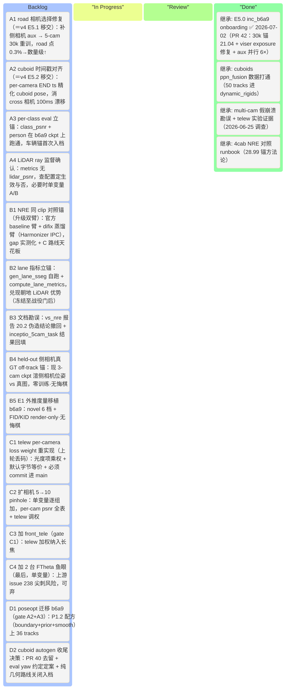
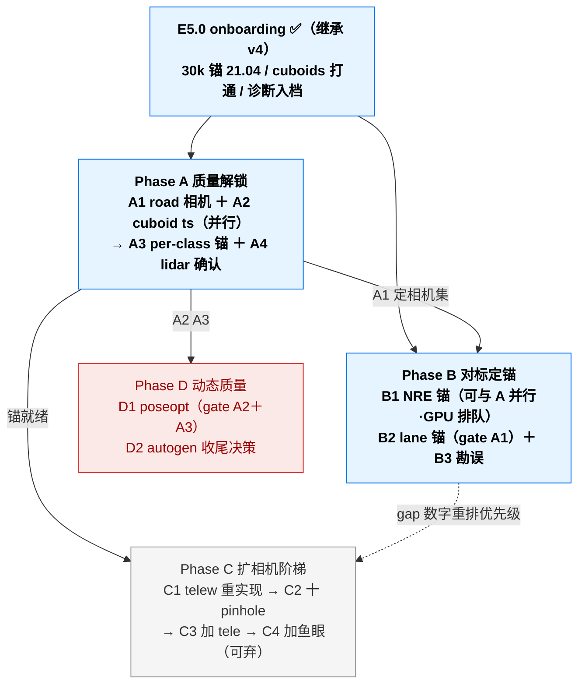

# 3DGRUT v5 — inceptio 数据线提优（多相机 + cuboids + 360° LiDAR）· 可执行计划

> **本文档定位**：v5 **inceptio 数据线主 plan**。v5 唯一主题 = **让 inceptio 自有数据（inc_b6a9ed61 为主战 clip）的重建质量达到 NVIDIA pipeline（NRE）水平**：road/车道线可用、动态车辆清晰、多相机全量纳入训练，并有同 clip NRE 锚证明差距在收敛。
> **与 v4 的关系**：[`v4_plan.md`](v4_plan.md) 仍是 **外推（extrapolation）主线**（PAI 9ae clip 线，E2.2 渐进蒸馏等继续归 v4）；v4 的 **E5.1 / E5.2 移交本文档**（改编号 A1 / A2，执行与回填以 v5 为准）。两线并行不冲突：v4 = 方法轴（外推），v5 = 数据轴（inceptio 落地）。
> **决策依据（decision of record）**：
> - inc_b6a9 onboarding + road/dynamic 诊断：[PR #42](https://github.com/etendue/3dgrut/pull/42)（E5.0，v4 §5 Done Log 2026-07-02）
> - 4cab NRE 对照方法论：[`inceptio_4cabad44_3dgrut_vs_nre.md`](inceptio_4cabad44_3dgrut_vs_nre.md)（⚠️ 其 20.2 multi-cam 崩溃结论已被 2026-06-25 调查证伪，见 B3 勘误任务）
> - multi-cam 真相 + telew 实验：2026-06-25 angry-heisenberg 调查（6cam 真实 24.02、front_tele 18.04 根因 = 无 per-camera loss 权重；telew 实验 tele 18.04→26.24 有效但**代码未 commit 已丢失**，见 C1）
> - cuboid autogen 终局：[PR #40](https://github.com/etendue/3dgrut/pull/40)（纯几何天花板结论，2026-06-30 commit `2d32ea6`；收尾决策见 D2）
> - 业界调研（2026-07-02 三路）：外推蒸馏配方（FaithFusion 置信度加权 / FixingGS 连续小步）留 v4 E2.2 吸收；3D auto-label 开源链（CenterPoint+MOT）作 D2 备选记录
> - **2026-07-03 off-track 战役收敛（大g 拍板）**：v5 KPI 主轴升级为 **off-track 质量**（road + dynamic rigids，FID/lane 口径）；执行序 A（生成先验蒸馏，v4 E2.2）→ B（数据轴扩相机）→ C（官方底座，仅测量不作产品路径）；战役设计、算力调度与决策门见 [`docs/superpowers/specs/2026-07-03-offtrack-campaign-design.md`](docs/superpowers/specs/2026-07-03-offtrack-campaign-design.md)
> **执行约定**：沿用 [`CLAUDE.md`](CLAUDE.md)（inceptio 首选 / **depth-off + num_workers=10 铁律** / worktree 工作流 / 文档同步纪律 / Mermaid 全角括号）；**单变量 A/B 纪律**（同一对照只动一个变量）；**反伪造纪律**——本仓库已两次踩注入伪造数字坑（2026-06-17 / 06-25），一切训练数字必须 rich log × metrics.json 交叉验证后才可入档。

---

## 0. 目标与 KPI

### 0.1 v5 核心方向

三条事实链支撑（2026-07-02 定稿）：

1. **cuboid 缺口已实质打通**：inc_b6a9 带真 ppn_fusion cuboids（50 tracks / 1504 obs，36 动态 track 已进 dynamic_rigids 训练）——inceptio 数据第一次具备完整四层训练条件；4cab 时代"纯几何 autogen 红团"阶段结束。
2. **当前质量离 NVIDIA 水平有明确、可修的差距**：3-cam 30k 锚 mean_psnr 21.04 / lpips 0.645；road 层稀疏无色（根因 = 相机选择偏前向，lidar-sseg 92.9% ignore）、动态车模糊（根因 = 少视角欠约束 + cuboid ts 漂移 100ms）——全部有诊断、有解法（A1/A2）。
3. **数据独特优势未兑现**：12 相机 360° 覆盖（对外推是数据侧解法）+ 朝地面 multi-lidar（对车道线是天然监督）——扩相机阶梯（C）与 lane 锚（B2）负责兑现。

### 0.2 KPI — 以 b6a9 锚为起点，NRE 锚回填后定绝对目标

> ⚠️ 沿 v3/v4 纪律：**不设虚构绝对阶梯**。绝对目标数等 B1（NRE 同 clip 锚）测完才定；此前一切任务以「相对 2026-07-02 锚的 gap 闭合 + 守护线不退」验收。

| 轴（主 KPI） | 现状（2026-07-02 锚，3-cam 30k depth-off） | 测量工具 | v5 目标 |
|---|---|---|---|
| 全图质量 | mean_psnr **21.04** / cc 19.70 / ssim 0.578 / **lpips 0.645** | `render.py` metrics.json | 对 NRE 锚 gap 收敛（B1 回填） |
| road / 车道线 | road_crop_psnr 25.99 / lpips 0.254；**road 层稀疏无色**；lane 指标**未测** | per_class_eval + `compute_lane_metrics` | A1 后 road 有色非稀疏；B2 立 lane grad_corr 锚 |
| 车辆 class_psnr（动态区） | **未测**（有 36 真 track，工具现成没跑） | [`class_psnr.py`](threedgrut/model/class_psnr.py) | A3 立锚 → A2/D1 闭合 |
| 行人 per-class（监控） | person 15.40（13 rec，无专属模型，同 v3 结论） | `per_class_eval.py` | 仅监控，不主动做（v5 不做行人建模） |
| NRE 同 clip gap | **未测**（4cab 锚 28.99 不可跨 clip 比） | B1（双臂）：nre-ga 官方配方 ± difix 蒸馏 | 把"落后多少"变实测数字 + C 路线天花板 |
| **off-track 质量（2026-07-03 新主轴）** | **未测**（现锚全部 on-track 口径） | B4 held-out 侧相机真 GT + B5 novel 档 FID/KID | B4/B5 立锚 → 战役门 1/2 后定目标 |
| 纳入训练的相机数 | 3 / 12 | per-camera psnr 表 | C 阶梯：5 → 10 → 11（+tele）→ 12（+鱼眼） |
| 守护线 | 现有 3 相机 per-cam psnr（22.07 / 20.71 / 20.31） | 现成 | 每步扩相机/改动后原相机不退 |

### 0.3 v5 不做（明确出界）

- **行人建模**（SMPL / rigid 垫脚石）——高速卡车场景行人稀疏，ROI 低（业界结论一致：deformable 轻量即可，且非本线主题）
- **外推蒸馏 E2.2 / Harmonizer 链**——留 v4 主线（PAI 线验证后再迁移 b6a9）
- **纯几何 cuboid autogen 继续调优**（L-shape / dimension prior）——4cab 已证天花板（recall 0.049 / init 错到 poseopt 救不回），正式关闭（D2 入档）
- 跨 clip 联训、closed-loop 仿真集成、relighting

### 0.4 v5 起点 baseline（不重训）

| 维度 | 数值 | 来源 |
|---|---:|---|
| b6a9 3-cam 30k 锚 | psnr 21.04 / cc 19.70 / lpips 0.645 / road_crop 25.99 | PR #42 E5.0（inceptio depth-off + nw=10） |
| per-camera | front_wide 22.07 / cross_left 20.71 / cross_right 20.31 | 同上 metrics.json |
| cuboids | 50 tracks / 1504 obs（动态 36 track / 50213 粒子进训练） | SDK 直读 + viser 诊断日志 |
| ckpt | `inceptio:~/work/output/inc_b6a9_3cam_multilayer_30k/…/ckpt_last.pt` | 2026-07-01 |
| telew 实验证据 | 4cab 6cam：front_tele 18.04→26.24、mean 23.93（**代码已丢，须 C1 重实现**） | 2026-06-25 调查（run 产物在 `~/work/output/inc4cab_multicam/`） |
| NRE 方法论锚 | 4cab：NRE 28.99 vs 3dgrut 单 cam 28.44（流程 runbook 现成） | [`inceptio_4cabad44_3dgrut_vs_nre.md`](inceptio_4cabad44_3dgrut_vs_nre.md) §8 |

---

## 1. 项目看板（Kanban）

> 状态：⬜ Todo · 🟡 In Progress · 🔵 Review · ✅ Done · ⏸ 降级 · ⏭ Skip

### 1.1 顶层看板（Mermaid Kanban）

### 1.2 任务级看板

| ID | Phase | 主题 | 继承来源 | 估时(d) | 状态 | gate / 备注 |
|---|---|---|---|---:|:---:|---|
| **A1** ★ | A | **road 相机选择修复** — 用 PR #42 并行 runbook 给 `camera_left_wide_90fov` / `camera_right_wide_90fov`（可选 `camera_back_rear_wide_90fov`）补 sseg + lidar-sseg/camvis aux → 5-cam multilayer 30k 重训 → road 层从"稀疏无色冻结"变"密集有色可用" | **v4 E5.1 移交** | 1 | ⬜ | 一石三鸟：road 覆盖 + 扩相机第一步 + 动态车多视角；备选＝解冻 road 学色 / 几何法挑地面点 |
| **A2** ★ | A | **cuboid 时间戳对齐** — [`tracks_loader.py`](threedgrut/datasets/tracks_loader.py) 按 per-camera END 时间戳精化 cuboid pose，消 cross 相机 ~100ms 漂移 | **v4 E5.2 移交** | 1 | ⬜ | 与 A1 正交可并行；离线可验（`validate_cuboid_pretrain.py`） |
| **A3** ★ | A | **per-class eval 立锚** — 现成 [`class_psnr.py`](threedgrut/model/class_psnr.py)（cuboid-based 车辆）+ `per_class_eval.py`（person/rider）在 b6a9 ckpt 跑 eval → inceptio 首个车辆 per-class 锚 | v3 P0 工具复用 | 0.5 | ⬜ | 纯 eval 零训练；A1/A2 的验收读数来源 |
| **A4** | A | **LiDAR ray 监督确认** — b6a9 metrics 无 lidar_psnr 字段；查 multilayer resolved config + 训练 log 定生效与否，若关则单变量 A/B 打开 | E0.5 借鉴点⑤ | 0.5 | ⬜ | 结论入档即算完成（生效/不生效+原因） |
| **B1** ★ | B | **NRE 同 clip 对照锚（双臂）** — 臂 1＝nre-ga car2sim 官方配方 baseline；臂 2＝同配方 + `difix.training.enabled=true`（Harmonizer IPC，单变量）→ 官方口径 + `nre render` lateral 3m/6m 帧 FID → **v5 gap 表首行实测化 + C 路线 off-track 天花板（门 1 输入）** | 4cab runbook + E0.7 IPC 架构 | 1.5 | ⬜ | 夜间 docker 挂机；**前置＝IPC 实物验证**（inceptio `~/work/nurec_e0/e07/` flags/日志/USDZ）；⚠️ 口径陷阱（官方 val 每 3 帧 + 1/4 res），对锚须统一口径或显式标注 |
| **B2** | B | **lane 指标立锚** — [`gen_lane_sseg.py`](scripts/gen_lane_sseg.py) 自跑 Mapillary lane sseg → `compute_lane_metrics`（grad_corr / band_psnr）前视立锚，验证朝地 LiDAR 车道线优势 | v3 P3.0 工具复用 | 1 | ⬜ | gate＝A1（侧相机进来 road 覆盖才够意义）；不跨 clip 比 PAI 锚 0.693 |
| **B3** | B | **文档勘误** — [`inceptio_4cabad44_3dgrut_vs_nre.md`](inceptio_4cabad44_3dgrut_vs_nre.md) 加勘误段（20.2 崩溃 + rational×MCMC 假设撤回，真实 6cam 23.2-24.0）；[`inceptio_5cam_task.md`](inceptio_5cam_task.md) 状态回填（已执行，5cam ~24.9@7k） | 2026-06-25 调查结论 | 0.5 | ⬜ | 防伪造数字再误导下游判断（本轮分析已被误导一次） |
| **B4** ★ | B | **held-out 侧相机真 GT off-track 锚** — 现有 3-cam 30k ckpt 在未参训侧相机位姿渲染 vs 真图（真 GT 外推，v4 E1.3 协议反用）→ held-out per-cam psnr/lpips + FID 与训练相机同口径对照 | v4 E1.3 协议 + E5.0 ckpt | 0.5 | ⬜ | **零训练 render-only；无悔棋三件套之一**；侧相机只需图像+位姿、不需 sseg aux；数字回答「b6a9 离轴差多少」（门 1 输入） |
| **B5** | B | **E1 外推度量移植 b6a9** — novel 6 档（含 lateral 3m/6m）+ FID/KID（`--render-only` / `--novel-fid` 链路）在 b6a9 config 打通 | v4 E1.1/E1.4 工具 | 0.5 | ⬜ | render-only；**无悔棋三件套之一**；metrics.json 出 novel 档字段，与 B4 真 GT 互证 |
| **C1** ★ | C | **telew per-camera loss weight 重实现** — `trainer.py` 加 `_camera_loss_weight(camera_id)` + 光度项（L1/SSIM）乘权、正则项不动；`configs/base_gs.yaml` 加 `loss.camera_loss_weights: {}`（默认空 = 字节等价）；**必须 commit 进 main**（上轮实现验证有效但 worktree reset 丢码的教训） | 2026-06-25 调查 #6882 方案 | 0.5 | ⬜ | Mac 单测：weight=1 恒等 / weight=2 光度翻倍正则不变 |
| **C2** | C | **扩相机 5→10 pinhole** — 单变量逐组加 rear×2 / back_rear_wide / front_standard，telew 按 per-cam psnr 调权 | 新 | 1 | ⬜ | gate＝A1 + C1；守护线＝已有相机 psnr 不退 |
| **C3** | C | **加 front_tele** — telew 加权纳入（4cab 经验：无权重 18.04、加权 26.24） | 4cab telew 证据 | 0.5 | ⬜ | gate＝C1 |
| **C4** | C | **加 2 台 FTheta 鱼眼** — 最后单变量纳入 `camera_front_fisheye` / `camera_back_rear_fisheye`；FTheta 路径 PAI 已证（6cam 26.31），但留意上游 [issue #238](https://github.com/nv-tlabs/3dgrut/issues/238) 鱼眼尖刺 | 新 | 1 | ⬜ | 可弃：尖刺不可控则 10+tele 收口 |
| **D1** | D | **poseopt 迁移 b6a9** — v3 P1.2 配方（boundary anchor + prior + temporal smooth）上 36 真 tracks，对照 A3 锚看动态车清晰度 | v3 P1.2（class +1.03 证据） | 1.5 | ⬜ | gate＝A2 + A3 锚；4cab 教训不适用（那是 init 错，b6a9 是真标注） |
| **D2** | D | **cuboid autogen 收尾决策** — ① PR #40 去留（建议：merge 作离线工具保留，autogen 仅限无标注 clip 的 demo 用途）② eval `_yaw_of()` 约定定案（对已知角 box 直查 pose 矩阵，半小时）③ 纯几何 L-shape 路线正式关闭入档；备选记录：无标注 clip 未来走 CenterPoint+MOT 开源链换前端、复用 PR #40 V4 shard 基建 | PR #40 + 2026-06-26 L-shape session | 0.5 | ⬜ | 决策级任务，大g 拍板 |

### 1.3 Phase 状态汇总

| Phase | 主题 | 任务数 (Done/Total) | 主验收 | 守护线 | 状态 |
|---:|---|---:|---|:---:|:---:|
| **A** ★ | b6a9 质量解锁（短刀，全部有诊断有解法） | 0/4 | road 有色 + cuboid 对齐 + 车辆锚入档 + lidar 监督定论 | 3-cam per-cam psnr 不退 | ⬜ |
| **B** ★ | 对标定锚 + off-track 评估（战役无悔棋） | 0/5 | NRE gap 双臂实测化 + held-out off-track 锚 + novel FID 链路 + lane 锚 + 伪数字勘误 | — | ⬜ |
| **C** | 扩相机阶梯 3→12 | 0/4 | 12 相机全量纳入或明确收口点 | 每步原相机不退 | ⬜ |
| **D** | 动态质量 + 收尾 | 0/2 | poseopt 增益入档 + autogen 去留定案 | class_psnr 不退 | ⬜ |
| **总计** | — | **0/15** | — | — | — |

### 1.4 任务依赖图

> 并行性：A1 与 A2 不同文件域可并行；B1（docker 挂机）可与 A 并行排 GPU；B3/C1/D2 为纯 Mac/文档任务可穿插。
> **执行序（2026-07-03 战役版，覆盖旧建议）**：无悔棋三件套（B4 → B1 双臂 → B5）先行 3-4 天 → A1/A2（A1 重训排新 4090，到货前 aux 先备）→ 门 1 后按数字排 C/D；**B2/C3/C4/D2 冻结至战役门后**。E2.2 主线在 v4 执行（inceptio 白天 + A800 蒸馏臂），算力调度详见战役 spec §4。

---

## 2. Phase 详细任务卡

### 2.1 Phase A — b6a9 质量解锁

**A1 road 相机选择修复**
- 目标：lidar-sseg road+sidewalk 点 21460（0.3%）→ 数量级提升，road 层（roaddisk 冻结前提 = 好 init）变密集有色。
- 步骤意图：① 按 CLAUDE.md「nre-tools aux 多容器并行」runbook 给 2-3 台侧/后相机补 sseg + lidar-sseg/camvis（注意 itar write-once、并发容器不共享目录、`merge_lidar_aux.py` 合并）；② `dataset.camera_ids` 扩 5-cam 重训 30k（multilayer，inceptio 铁律 depth-off + nw=10）；③ 无代码改动，纯 config/CLI。
- 验收：诊断脚本输出 road 点数对比；viser road-only 视图有色连续（对照 E5.0 无色截图）；mean_psnr / road_crop 对 21.04 / 25.99 不退且 road 侧改善；新相机 per-cam psnr 入档。

**A2 cuboid 时间戳对齐**
- 目标：cross 相机 cuboid pose 漂移 ~100ms → ≈0。
- 改动：[`tracks_loader.py`](threedgrut/datasets/tracks_loader.py) 的 cuboid ts ↔ 相机帧匹配逻辑，改为按 per-camera END 时间戳精化（插值 track pose 到各相机实际曝光时刻）。
- 测试要点：Mac 纯函数单测——合成匀速 track + 已知相机 ts 偏移，断言精化后 pose 位置残差小于厘米级公差；默认路径与旧行为字节等价开关。
- 验收：`scripts/validate_cuboid_pretrain.py` cross 相机 wireframe 目检套准（对照 dt=100ms 旧图）；重训后动态区清晰度以 A3 class_psnr + viser 目检双读数。

**A3 per-class eval 立锚**
- 目标：b6a9 首个车辆 class_psnr（cuboid-based，36 tracks）+ person/rider 锚入档。
- 步骤意图：在现有 30k ckpt（及 A1/A2 后的新 ckpt）上跑 `render.py` eval，确认 metrics.json 出 by_class 字段（v3 P0 链路已通，如缺字段按 CLAUDE.md 把关清单核查 trainer/render 双路径）。
- 验收：车辆 by_class + person 数字写入本文档 §4 Done Log 与 §0.2 KPI 表。

**A4 LiDAR ray 监督确认**
- 目标：定论 b6a9 训练中 LiDAR ray 级监督是否生效（metrics 无 lidar_psnr 字段的疑点）。
- 步骤意图：查 run 的 parsed.yaml lidar 相关键 + 训练 log；若未生效，单变量 A/B（on vs off，6k 短跑即可）。
- 验收：结论 + 原因入档；若开启有益则进 b6a9 baseline 配方。

### 2.2 Phase B — 对标定锚

**B1 NRE 同 clip 对照锚（双臂，2026-07-03 升级）**
- 目标：把「b6a9 21.04 落后 NVIDIA 多少」从推测变实测（区分 pipeline 差距 vs 场景难度——36 动态车的 urban 场景 PSNR 天然低于 4cab 单卡车高速）；臂 2 同时给出 **C 路线 off-track 天花板**（战役门 1 输入）。
- 步骤意图：臂 1 复用 4cab runbook（nre-ga car2sim 配方 docker 一条命令）；臂 2 同配方单变量开 `difix.training.enabled=true`，修复器走 Harmonizer IPC（`fixer_server.py`/`harmonizer_server.py` 架构，**前置＝IPC 实物验证** `~/work/nurec_e0/e07/`）；两臂各出官方指标 + `nre render` lateral 3m/6m 帧 → FID 对比。
- 验收：v5 gap 表首行回填 + 两臂 off-track FID 差入档（门 1 判据）；口径统一或显式标注官方 val 口径陷阱；据 gap 数字重排 C/D 优先级（对标 v4 E1.5 纪律）。

**B4 held-out 侧相机真 GT off-track 锚（零训练，无悔棋）**
- 目标：b6a9 第一个真 GT 离轴数字——现有 3-cam 30k ckpt 从未见过侧相机，在侧相机位姿渲染 vs 真图即真外推测量（v4 E1.3 协议反用）。
- 步骤意图：eval 侧相机集注入（`dataset.camera_ids` eval-only 覆盖或 render.py 位姿加载路径）；侧相机帧只需图像+位姿，不需 sseg aux；render-only 出帧后与真图算 per-cam psnr/lpips + FID。
- 验收：held-out 数字与 3 台训练相机同口径对照入档（§4 Done Log + §0.2 KPI 表 off-track 行）；回答「b6a9 离轴差多少」。

**B5 E1 外推度量移植 b6a9（无悔棋）**
- 目标：v4 E1.1/E1.4 工具链（novel 6 档含 lateral 3m/6m + FID/KID）在 b6a9 config 打通，补齐「inceptio 数据无 off-track 评估」的洞。
- 步骤意图：`--render-only` / `--novel-only` / `--novel-fid` 链路对 b6a9 manifest 跑通；配置差异（相机数/分辨率）按需适配。
- 验收：b6a9 metrics.json 出 `mean_novel_fid_*` 等 novel 档字段；与 B4 真 GT 数字互证入档。

**B2 lane 指标立锚**
- 目标：兑现朝地 multi-lidar 的车道线优势，建立 b6a9 lane grad_corr / band_psnr 锚。
- 步骤意图：`gen_lane_sseg.py` 自跑（b6a9 无 lane aux）→ `datasetNcore` 加载 → `render.py` 前视 eval 出 mean_lane_* 字段（v3 P3.0 全链路现成）。
- 验收：lane 锚数字入档；与 road_crop/road 层视觉互证。

**B3 文档勘误**
- 目标：清除两处会误导后续判断的过期结论。
- 改动：[`inceptio_4cabad44_3dgrut_vs_nre.md`](inceptio_4cabad44_3dgrut_vs_nre.md) §5 加勘误段（20.2 崩溃数字系注入伪造已撤回；真实 6cam@7k 23.2-24.0；rational×MCMC 失稳假设不成立，真根因 = per-camera loss 权重缺失 + 多视角稀释）；[`inceptio_5cam_task.md`](inceptio_5cam_task.md) 状态"待执行"→ 已执行 + 结果回填。
- 验收：两文档更新，引用该结论的下游文档无残留。

### 2.3 Phase C — 扩相机阶梯

**C1 telew 重实现**：见 §1.2 行内描述；关键约束——只乘光度项、默认空 dict 字节等价、CLI 以 `++loss.camera_loss_weights.<camera_id>=w` 覆盖；完成定义 = **代码 + 测试 merge 进 main**。
**C2 → C3 → C4**：每步单变量、守护线 = 已纳入相机 per-cam psnr 不退；C4 鱼眼为可弃项（尖刺不可控则在 11 相机收口，FTheta 数据侧无阻碍）。

### 2.4 Phase D — 动态质量 + 收尾

**D1 poseopt 迁移**：`trainer.pose_adjustment.enabled=true`（lambda_t 1e-2 / lambda_r 1e-1，v3 P1.2 已证配方）30k A/B，验收 = A3 车辆 class_psnr 提升 + viser 动态车抖动目检。
**D2 cuboid autogen 收尾**：决策任务——PR #40 merge 与否、eval yaw 约定半小时定案、L-shape 路线关闭结论入档、无标注 clip 的 CenterPoint+MOT 备选路线记录（详见 §1.2）。

---

## 3. 风险登记表（Risk Log）

| # | 风险 | 触发条件 | 缓解 | 状态 |
|---|---|---|---|---|
| R1 | 加侧相机后 road 覆盖仍不足 | A1 验收不过 | 备选：解冻 road 学色 / 几何法（高度+平面拟合）挑地面点绕开 lidar-sseg | ⬜ |
| R2 | 跨相机曝光/白平衡差异随相机数放大 | C2-C4 cc 与 raw psnr 差扩大 | C1 telew + BilateralGrid exposure（已默认开）；per-cam 光度监控 | ⬜ |
| R3 | 注入伪造数字（已踩两次） | 任何训练数字入档前 | rich log × metrics.json 交叉验证；只认两源一致的数字 | 长期 |
| R4 | 单卡 4090 排队 | A1/B1/C2 训练冲突 | 长任务 setsid 驱动脚本串行；B1 docker 可夜间挂机 | ⬜ |
| R5 | NRE 官方口径陷阱 | B1 对锚 | E0.3 教训：官方 val 每 3 帧 + 1/4 res + cpsnr，须统一口径互渲或显式标注 | ⬜ |
| R6 | 鱼眼尖刺（上游 issue #238） | C4 | 放最后、单变量、可弃；必要时向上游报 issue | ⬜ |
| R7 | itar 损坏（write-once + 中途 stop） | A1 aux 并行 | PR #42 runbook：硬链隔离目录 + 完整跑完再合并 | ⬜ |

---

## 4. Done Log（继承锚点 + 新条目）

**继承锚点（已验证，作 baseline / 方法论基础）**：
- **2026-07-02 E5.0 inc_b6a9 onboarding**（PR #42）：3-cam 30k 锚 psnr 21.04 / cc 19.70 / lpips 0.645 / road_crop 25.99；cuboids 50 tracks 打通（36 动态进训练）；viser exposure 修复；aux 并行 6× runbook；road/dynamic 根因诊断（→A1/A2）。
- **2026-06-25 multi-cam 真相调查**：「6cam 崩 20.2」系注入伪造已撤回；真实 6cam@7k 24.02（refix 23.24）、5cam ~24.9、2cam 26.69；front_tele 18.04 根因 = per-pixel mean 无相机权重；telew 实验 tele→26.24 有效（代码丢失 → C1）。
- **2026-06-30 cuboid autogen 终局**（PR #40 + `2d32ea6`）：纯几何天花板坐实（recall 0.049 / yaw 65° / poseopt 救不回错 init）；V4 shard 写读基建可复用（→D2）。
- **2026-06-24 4cab NRE 锚方法论**：NRE 28.99 / 3dgrut 单 cam 28.44，runbook 现成（→B1）。

**新条目**（任务完成后按 CLAUDE.md 纪律追加：日期 + commit + 实测数字）：

---

## 5. 文档关系速查

| 内容 | 文档 |
|---|---|
| v5 主线（本文档）：inceptio 数据线提优 | `v5_plan.md` |
| v4 主线：外推性能（E2.2 蒸馏等，PAI 线）；E5.1/E5.2 已移交本文档 A1/A2 | [`v4_plan.md`](v4_plan.md) |
| v3 主线（收敛）：per-class 重建质量（行人 Phase 2 遗留归 v3） | [`v3_plan_revised.md`](v3_plan_revised.md) |
| 架构差异图 + 关键不变量 | [`v2_architecture.md`](v2_architecture.md) |
| 4cab NRE 对照 + multi-cam 报告（⚠️ 待 B3 勘误） | [`inceptio_4cabad44_3dgrut_vs_nre.md`](inceptio_4cabad44_3dgrut_vs_nre.md) |
| A800/inceptio/vast 执行环境与铁律 | [`CLAUDE.md`](CLAUDE.md) |
| **off-track 战役设计（A→B→C 收敛 + 算力调度 + 决策门）** | [`docs/superpowers/specs/2026-07-03-offtrack-campaign-design.md`](docs/superpowers/specs/2026-07-03-offtrack-campaign-design.md) |
